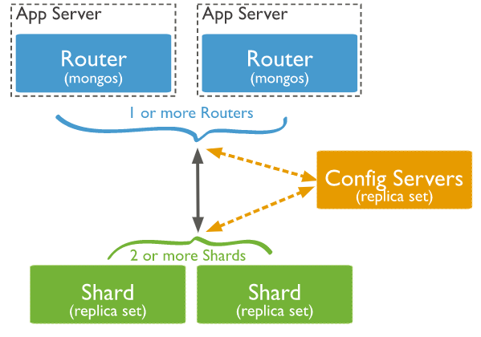

# MongoDB 分片集群实战
MongoDB 海量数据处理方式

**标签:** 数据库

[原文链接](https://developer.ibm.com/zh/articles/os-mongodb-sharded-cluster/)

王 拓

发布: 2019-09-09

* * *

## 背景

在如今的互联网环境下，海量数据已随处可见并且还在不断增长，对于如何存储处理海量数据，比较常见的方法有两种：

- **垂直扩展** ：通过增加单台服务器的配置，例如使用更强悍的 CPU、更大的内存、更大容量的磁盘，此种方法虽然成本很高，但是实现比较简单，维护起来也比较方便。
- **水平扩展** ：通过使用更多配置一般的服务器来共同承担工作负载，此种方法很灵活，可以根据工作负载的大小动态增减服务器的数量，但是实现比较复杂，得有专门的人员来运维。

**[Databases for MongoDB](https://cloud.ibm.com/catalog/services/databases-for-mongodb?cm_sp=ibmdev-_-developer-articles-_-cloudreg)**

试用 [IBM Cloud](https://cloud.ibm.com/login?cm_sp=ibmdev-_-developer-articles-_-cloudreg) 上提供的 MongoDB 数据库服务。

**[Hyper Protect DBaaS for MongoDB](https://cloud.ibm.com/catalog/services/hyper-protect-dbaas-for-mongodb?cm_sp=ibmdev-_-developer-articles-_-cloudreg)**

试用 [IBM Cloud](https://cloud.ibm.com/login?cm_sp=ibmdev-_-developer-articles-_-cloudreg) 上提供的更加安全的 MongoDB 企业服务，您可以通过标准化的界面管理 MongoDB。

MongoDB 支持通过分片技术从而进行水平扩展，用以支撑海量数据集和高吞吐量的操作。如果数据集不够大，还是建议您使用 [MongoDB 副本集](https://developer.ibm.com/zh/articles/os-mongodb-replication/) ，因为分片需要处理更多的技术细节，所以在分片环境下其性能可能始终没有副本集性能强。本文通过介绍如何搭建 MongoDB 分片集群以及及一些相关核心概念，可以帮您快速理解 MongoDB 是如何通过分片技术来处理海量数据的。

## MongoDB 分片集群组件

在搭建 MongoDB 分片集群环境之前，我们先了解一下分片集群包含哪些组件。一个 MongoDB 分片集群（参考官方文档 [Sharded Cluster](https://docs.mongodb.com/v4.0/sharding/) ）由以下三个组件构成，缺一不可：

- **shard** ：每个分片是整体数据的一部分子集。每个分片都可以部署为副本集。强烈建议在生产环境下将分片部署为副本集且最少部署 2 个分片。
- **mongos** ：充当查询路由器，提供客户端应用程序和分片集群之间的接口。应用程序直接连接 mongos 即可，可以部署一个或多个。
- **config servers** ：配置服务器存储集群的元数据和配置（包括权限认证相关）。从 MongoDB 3.4 开始，必须将配置服务器部署为副本集（CSRS，全称是 Config Servers Replica Set）。

MongoDB 分片集群的架构图如下所示，该图片引用自 [MongoDB 官网文档](https://docs.mongodb.com/v4.0/sharding/) 。



## 分片集群环境搭建

接下来我们开始准备部署一个具有 2 个 shard（3 节点副本集）加 1 个 config server（3 节点副本集）加 2 个 mongos 的分片集群。

### 搭建环境

搭建环境如下：

- OS: CentOS 7 64 位。
- Software: 采用的 [官方 64 位 MongoDB 4.0.12 二进制包](https://fastdl.mongodb.org/linux/mongodb-linux-x86_64-4.0.12.tgz) 。
- 准备三台虚拟机，按如下表格规划每台虚拟机 MongoDB 实例的角色以及副本集名称。

**虚拟机一**

**角色****IP****端口****副本集名称**mongos10.0.4.627017shard110.0.4.627018rep\_shard1shard210.0.4.627019rep\_shard2confserver10.0.4.620000rep\_confsvr

**虚拟机二**

**角色****IP****端口****副本集名称**mongos10.0.4.727017shard110.0.4.727018rep\_shard1shard210.0.4.727019rep\_shard2confserver10.0.4.720000rep\_confsvr

**虚拟机三**

**角色****IP****端口****副本集名称**shard110.0.4.827018rep\_shard1shard210.0.4.827019rep\_shard2confserver10.0.4.820000rep\_confsvr

### 搭建步骤

MongoDB 分片集群搭建并不复杂，以下只描述关键步骤。

#### 步骤 1\. 配置文件

下载 [官方 MongoDB 4.0.12 版本的二进制包](https://fastdl.mongodb.org/linux/mongodb-linux-x86_64-4.0.12.tgz) ，按照如下步骤修改配置文件。

1. 每台虚拟机的 27018 实例即分片 1 的配置文件需要配置以下关键参数：


    ```
    replSet = rep_shard1 # 副本集名称
    shardsvr = true # 3.4 版本之后必须明确指定该参数，3.4 版本之前该参数其实无实用性

    ```


    Show moreShow more icon

2. 每台虚拟机的 27019 实例即分片 2 的配置文件需要配置以下关键参数：


    ```
    replSet = rep_shard2
    shardsvr = true

    ```


    Show moreShow more icon

3. 每台虚拟机的 20000 实例即配置服务器的配置文件需要配置以下关键参数：


    ```
    replSet = rep_confsvr
    configsvr = true

    ```


    Show moreShow more icon

4. 虚拟机一和虚拟机二的 27017 实例即 mongos 路由的配置文件需要配置以下关键参数：


    ```
    configdb = rep_confsvr/10.0.4.6:20000,10.0.4.7:20000,10.0.4.8:20000 # 指定配置服务器

    ```


    Show moreShow more icon


#### 步骤 2\. 建立相关目录并启动副本集实例

关于如何配置副本集可以参考 [MongoDB 副本集实战](https://developer.ibm.com/zh/articles/os-mongodb-replication/) ，然后按照下列顺序执行。

1. 启动每台虚拟机的 27018 实例即分片 1 并配置副本集。
2. 启动每台虚拟机的 27019 实例即分片 2 并配置副本集。
3. 启动每台虚拟机的 20000 实例即配置服务器并配置副本集。
4. 启动虚拟机一和虚拟机二的 27017 实例即 mongos 路由，注意这里是通过 mongos 启动非 mongod。

#### 步骤 3\. 配置分片集群

登录虚拟机一的 mongos 终端，和普通登录 MongoDB 一样，只需将端口改成 mongos 的端口 27017 即可，运行以下命令将 rep\_shard1 和 rep\_shard2 分片加入集群，到此一个分片环境已经搭建完成。

```
sh.addShard("rep_shard1/10.0.4.6:27018,10.0.4.7:27018,10.0.4.8:27018")
sh.addShard("rep_shard2/10.0.4.6:27019,10.0.4.7:27019,10.0.4.8:27019")

```

Show moreShow more icon

#### 步骤 4\. 验证分片集群是否搭建成功

通过运行 `sh.status()` 命令可以查看分片相关信息，如有以下输出，说明分片集群搭建成功。

```
shards:
{  "_id" : "rep_shard1",  "host" : "rep_shard1/10.0.4.6:27018,10.0.4.7:27018,10.0.4.8:27018",  "state" : 1 }
{  "_id" : "rep_shard2",  "host" : "rep_shard2/10.0.4.6:27019,10.0.4.7:27019,10.0.4.8:27019",  "state" : 1 }

```

Show moreShow more icon

整个分片集群搭建成功的关键点为各个角色的配置文件需要配置正确，副本集的配置不能有误，如果说需要配置权限认证相关，最好在开始规划集群的时候就定下来。在生产环境下，可以一台服务器挂载多个硬盘，每个硬盘对应一个分片实例，这样可以将资源最大化利用，此种搭建方法需要注意 MongoDB 实例内存的限制。

## 分片集群操作的相关概念

为了更好地理解 MongoDB 分片集群的运行原理，需要对以下核心概念有所了解。

### Shard Key（分片键）

MongoDB 通过定义 **shared key** （分片键）从而对整个集合进行分片，分片键的好坏直接影响到整个集群的性能。另外需要注意的是，一个集合只有且只能有一个分片键，一旦分片键确定好之后就不能更改。分片键分为以下两种类型：

- **基于 Hashed 的分片** ：MongoDB 会计算分片键字段值的哈希值，用以确定该文档存于哪个 chunk（参见下文 “ [Chunk（块）](#chunk（块）)“的介绍），从而达到将集合分摊到不同的 chunk。此种类型能够使得数据整体分布比较均匀，对于等值查询效率很高，但是对于范围查询效率就比较低，因为可能要扫描所有的分片才能获取到数据。
- **基于 Ranged 的分片** ：MongoDB 会将相似的值放到一个 chunk 中，所以说如果在查询的时候带上分片键的范围条件，查询效率会非常高，因为不需要扫描所有的分片就可以定位到数据。注意，如果片键的值为单调递增或单调递减，那么
- 适合采用该分片策略，因为数据总会写到一个分片，从而没有很好地分散 IO。

分片键的类型需要根据实际的业务场景决定，例如有张非常大的用户表，用户表里有用户 ID 字段，每次查询的时候都会带上用户 ID，如果想对该用户表进行分片，可以选择将用户 ID 字段作为 shard key，并且分片键类型可以使用基于 Hashed 的分片。

### Chunk（块）

**chunk** （块）是均衡器迁移数据的最小单元，默认大小为 64MB，取值范围为 1-1024MB。一个块只存在于一个分片，每个块由片键特定范围内的文档组成，块的范围为左闭又开即 `[start,end)` 。一个文档属于且只属于一个块，当一个块增加到特定大小的时候，会通过拆分点（split point）被拆分成 2 个较小的块。在有些情况下，chunk 会持续增长，超过 ChunkSize，官方称为 [jumbo chunk](Maximum-Number-of-Documents-Per-Chunk-to-Migrate) ，该块无法被 MongoDB 拆分，也不能被均衡器（参见下文 “ [Balancer（均衡器）](#balancer（均衡器）)” 的介绍）迁移，故久而久之会导致 chunk 在分片服务器上分布不均匀，从而成为性能瓶颈，表现之一为 insert 数据变慢。

#### Chunk 的拆分

mongos 会记录每个块中有多少数据，一旦达到了阈值就会检查是否需要对其进行拆分，如果确实需要拆分则可以在配置服务器上更新这个块的相关元信息。

chunk 的拆分过程如下：

1. mongos 接收到客户端发起的写请求后会检查当前块的拆分阈值点。
2. 如果需要拆分，mongos 则会像分片服务器发起一个拆分请求。
3. 分片服务器会做拆分工作，然后将信息返回 mongos。

注意，相同的片键只能保存在相同的块中，如果一个相同的片键过多，则会导致一个块过大，成为 jumbo chunk，所以具有不同值的片键很重要。

#### Chunk 的迁移

chunk 在以下情况会发生迁移：

- chunk 数位于 [1,20)，阈值为 2。
- chunk 数位于 [20,80)，阈值为 4。
- chunk 数位于 [80,max)，阈值为 8。

chunk 的迁移过程如下，可以 [参考官方文档](https://docs.mongodb.com/v4.0/core/sharding-balancer-administration/#chunk-migration-procedure) 。

1. 均衡器进程发送 `moveChunk` 命令到源分片。
2. 源分片使用内部 `moveChunk` 命令，在迁移过程，对该块的操作还是会路由到源分片。
3. 目标分片构建索引。
4. 目标分片开始进行数据复制。
5. 复制完成后会同步在迁移过程中该块的更改。
6. 同步完成后源分片会连接到配置服务器，使用块的新位置更新集群元数据。
7. 源分片完成元数据更新后，一旦块上没有打开的游标，源分片将删除其文档副本。

迁移过程可确保一致性，并在平衡期间最大化块的可用性。

#### 修改 chunk 大小的注意事项

修改 chunk 大小需要注意以下几点：

1. chunk 的自动拆分操作仅发生在插入或更新的时候。
2. 如果减少 chunk size，将会耗费一些时间将原有的 chunk 拆分到新 chunk，并且此操作不可逆。
3. 如果新增 chunk size，已存在的 chunk 只会等到新的插入或更新操作将其扩充至新的大小。
4. chunk size 的可调整范围为 1-1024MB。

### Balancer（均衡器）

MongoDB 的 **balancer** （均衡器）是监视每个分片的 chunk 数的一个后台进程。当分片上的 chunk 数达到特定迁移阈值时，均衡器会尝试在分片之间自动迁移块，使得每个分片的块的数量达到平衡。分片群集的平衡过程对用户和应用程序层完全透明，但在执行过程时可能会对性能产生一些影响。

从 MongoDB 3.4 开始，balancer 在配置服务器副本集（CSRS）的主服务器上运行，

在 3.4 版本中，当平衡器进程处于活动状态时，主配置服务器的的 locks 集合通过修改 `_id: "balancer"` 文档会获取一个 _balancer lock_ ，该 balancer lock 不会被释放，是为了保证只有一个 mongos 实例能够在分片集群中执行管理任务。从 3.6 版本开始，均衡器不再需要 balancer lock。

均衡器可以动态的开启和关闭，也可以针对指定的集合开启和关闭，还可以手动控制均衡器迁移 chunk 的时间，避免在业务高峰期的时候迁移 chunk 从而影响集群性能。以下命令将均衡器的迁移 chunk 时间控制在凌晨 02 点至凌晨 06 点：

```
use config
db.settings.update(
{ _id: "balancer" },
{ $set: { activeWindow : { start : "02:00", stop : "06:00" } } },
{ upsert: true }
)

```

Show moreShow more icon

## 分片集群操作实战

了解了一些基本概念后，我们就可以来做一些实战操作，假设在 test 库下有个空集合为 `test_shard` ，注意这里是个空集合，该集合有年龄字段，我们将选择年龄字段作为分片键分别进行范围分片和哈希分片。

为了观察效果，提前将 chunk 的大小调整为 1MB，并且所有的操作都在 mongos 节点执行，随便哪个 mongos 都可以执行。以下为命令和输出示例：

```
use config
db.settings.save({_id:"chunksize",value:1})
db.serverStatus().sharding
{
    "configsvrConnectionString" : "confsvr/10.0.4.6:20000,10.0.4.7:20000,10.0.4.8:20000",
    "lastSeenConfigServerOpTime" : {
        "ts" : Timestamp(1566895485, 2),
        "t" : NumberLong(16)
    },
    "maxChunkSizeInBytes" : NumberLong(1048576)
}

```

Show moreShow more icon

### 基于 Ranged 的分片操作

基于范围分片特别适合范围查找，因为可以直接定位到分片，所以效率很高。

以下为具体操作步骤：

1. 开启 test 库的分片功能。


    ```
    sh.enableSharding("test")

    ```


    Show moreShow more icon

2. 选择集合的分片键，此时 MongoDB 会自动为 age 字段创建索引。


    ```
    sh.shardCollection("test.test_shard",{"age": 1})

    ```


    Show moreShow more icon

3. 批量造测试数据。


    ```
    use test
    for (i = 1; i < = 20000; i++) db.test_shard.insert({age:(i%100), name:"user"+i,
    create_at:new Date()})

    ```


    Show moreShow more icon

4. 观察分片效果。以下为命令和部分输出示例：


    ```
    sh.status()
    test.test_shard
    shard key: { "age" : 1 }
    unique: false
    balancing: true
    chunks:
            rep_shard1    2
            rep_shard2    3
    { "age" : { "$minKey" : 1 } } --<< { "age" : 0 } on : rep_shard1 Timestamp(2, 0)
    { "age" : 0 } --<< { "age" : 36 } on : rep_shard1 Timestamp(3, 0)
    { "age" : 36 } --<< { "age" : 73 } on : rep_shard2 Timestamp(2, 3)
    { "age" : 73 } --<< { "age" : 92 } on : rep_shard2 Timestamp(2, 4)
    { "age" : 92 } --<< { "age" : { "$maxKey" : 1 } } on : rep_shard2 Timestamp(3, 1)

    ```


    Show moreShow more icon


从输出结果可以看到 `test.test_shard` 集合总共有 2 个分片，分片 rep\_shard1 上有 2 个 chunk，分片 rep\_shard2 上有 3 个 chunk，年龄大于或等于 0 并且小于 36 的文档数据放到了第一个分片 rep\_shard1，年龄大于或等于 36 并且小于 73 的文档数据放到了第二个分片 rep\_shard2，此时已经达到了分片的效果。我们可以使用 `find` 命令来确认是否对应的数据存在相应的分片，以下为命令和部分输出示例：

```
db.test_shard.find({ age: { $gte : 36 ,$lt : 73 } }).explain()
{
    "queryPlanner" : {
        "winningPlan" : {
            "stage" : "SINGLE_SHARD",
            "shards" : [
                {
                    "shardName" : "rep_shard2",
                    "connectionString" : "rep_shard2/10.0.4.6:27019,10.0.4.7:27019,10.0.4.8:27019",
                    "namespace" : "test.test_shard",
                    "winningPlan" : {
                        "stage" : "FETCH",
                        "inputStage" : {
                            "stage" : "SHARDING_FILTER",
                            "inputStage" : {
                                "stage" : "IXSCAN",
                                "keyPattern" : {
                                    "age" : 1
                                },
                                "indexName" : "age_1",
                                "direction" : "forward",
                                "indexBounds" : {
                                    "age" : [
                                        "[36.0, 73.0)"
                                    ]
                                }
                            }
                        }
                    },
                }
            ]
        }
    }
}

```

Show moreShow more icon

从以上输出结果可以看到，当查找年龄范围为大于等于 36 并且小于 73 的文档数据，MongoDB 会直接定位到分片 rep\_shard2，从而避免全分片扫描以提高查找效率。如果将 `$gte : 36` 改为 `$gte : 35` ，结果会是怎么样的呢？答案是 MongoDB 会扫描全部分片，执行计划的结果将由 `SINGLE_SHARD` 变为 `SHARD_MERGE` ，如果感兴趣，您可以自行验证。

### 基于 Hashed 的分片操作

为了和基于范围分片形成对比，这一步操作使用相同的测试数据。操作步骤如下所示。

1. 开启 test 库的分片功能。


    ```
    sh.enableSharding("test")

    ```


    Show moreShow more icon

2. 选择集合的分片键，注意这里创建的是 hash 索引。


    ```
    sh.shardCollection("test.test_shard",{"age": "hashed"})

    ```


    Show moreShow more icon

3. 批量造测试数据。


    ```
    use test
    for (i = 1; i <= 20000; i++) db.test_shard.insert({age:(i%100), name:"user"+i, create_at:new Date()})

    ```


    Show moreShow more icon

4. 观察分片效果。以下为命令和部分输出示例：


    ```
    sh.status()
    chunks:
            rep_shard1    2
            rep_shard2    2
    { "age" : { "$minKey" : 1 } } --<< { "age" : NumberLong("-4611686018427387902") } on : rep_shard1 Timestamp(1, 0)
    { "age" : NumberLong("-4611686018427387902") } --<< { "age" : NumberLong(0) } on : rep_shard1 Timestamp(1, 1)
    { "age" : NumberLong(0) } --<< { "age" : NumberLong("4611686018427387902") } on : rep_shard2 Timestamp(1, 2)
    { "age" : NumberLong("4611686018427387902") } --<< { "age" : { "$maxKey" : 1 } } on : rep_shard2 Timestamp(1, 3)

    ```


    Show moreShow more icon


从输出结果可以看到总共有 4 个 chunk，分片 rep\_shard1 有 2 个 chunk，分片 rep\_shard2 有 2 个 chunk，分片后按照分片值 hash 后，存放到对应不同的分片。现在我们来将使用同一查询，看看在基于 Hashed 分片和基于 Ranged 分片的效果，以下为命令和部分输出示例：

```
db.test_shard.find({ age: { $gte : 36 ,$lt : 73 } }).explain()
{
    "queryPlanner" : {
        "winningPlan" : {
            "stage" : "SHARD_MERGE",
            "shards" : [
                {
                    "shardName" : "rep_shard1",
                    "connectionString" : "rep_shard1/10.0.4.6:27018,10.0.4.7:27018,10.0.4.8:27018",
                    "winningPlan" : {
                        "stage" : "SHARDING_FILTER",
                        "inputStage" : {
                            "stage" : "COLLSCAN",                        }
                    }
                {
                    "shardName" : "rep_shard2",
                    "connectionString" : "rep_shard2/10.0.4.6:27019,10.0.4.7:27019,10.0.4.8:27019",
                    "winningPlan" : {
                        "stage" : "SHARDING_FILTER",
                        "inputStage" : {
                            "stage" : "COLLSCAN",
                        }
                    }
        }
    }

```

Show moreShow more icon

从以上结果可以看到，对于范围查找，基于 Hashed 的分片很可能需要全部分片都扫描一遍才能找到对应的数据，效率比较低下，如果等值查找，效率会高些，接下来我们来验证。

同样还是数据不变，我们将查询改为只查找年龄为 36 岁的文档数据。

```
    db.test_shard.find({ age: 36 }).explain()
    {
    "queryPlanner" : {
        "winningPlan" : {
            "stage" : "SINGLE_SHARD",
            "shards" : [
                {
                    "shardName" : "rep_shard2",
                    "connectionString" : "rep_shard2/10.0.4.6:27019,10.0.4.7:27019,10.0.4.8:27019",
                    "namespace" : "test.test_shard",
                    "parsedQuery" : {
                        "age" : {
                            "$eq" : 36
                        }
                    },
                    "winningPlan" : {
                        "stage" : "SHARDING_FILTER",
                        "inputStage" : {
                            "stage" : "FETCH",
                            "inputStage" : {
                                "stage" : "IXSCAN",
                                "keyPattern" : {
                                    "age" : "hashed"
                                },
                                "indexName" : "age_hashed",
                                "indexBounds" : {
                                    "age" : [
                                        "[7618808261848727468, 7618808261848727468]"
                                    ]
                                }
                            }
                        }
                    }
                }
            ]
        }
    }
}

```

Show moreShow more icon

通过以上输出可以看到，对于等值查找，基于 Hashed 分片查找效率很高，直接定位到一个分片就可以返回满足条件的数据，无需进行全部分片的查找。

### 小结

通上述两个实验演示了两种分片方法的优缺点，在真实环境中，需要根据实际业务场景去选择分片方法，这样才能构建一个高性能的集群环境。以上的操作步骤都是对一个空的集合进行分片，如果对于一个已经存在的集合分片，操作步骤会有所不同，需要提前手动对集合的片键建立相关类型的索引，如果是基于 Hashed 分片，需要建立 hash 索引。

## 结束语

通过阅读本文，可以让您对 MongoDB 的分片集群以及集群中的一些组件有个基本认识，同时通过进行一个简单的实验阐述了两种分片方法的优缺点以及适合场景，相信您在面对 MongoDB 里的海量数据，已不会感到恐惧。