# NLP 迁移学习 – BERT 篇
深入了解 BERT 在迁移学习领域的作用

**标签:** 分析,机器学习,深度学习

[原文链接](https://developer.ibm.com/zh/articles/nlp-transfer-learning/)

尹鹏

发布: 2020-11-09

* * *

由于处理复杂形式信息（图像，声音，文本）能力上的优势，深度学习获得了越来越多的关注和发展。随着任务复杂度的增加，深度学习模型呈现出越来越复杂的趋势。一般来说，模型越复杂就需要越多的数据进行训练，这就导致了比较复杂的深度模型需要大量的数据来进行训练。由于训练数据通常需要人工标记因此海量训练数据的获取成本非常高，这使得训练或者改进深度模型成为耗时耗力的过程，非常不利于深度模型的推广和应用。

## 迁移学习

为了解决这个问题，人们尝试将深度学习过程中产生的具有共性的知识提取出来用于具有相关性的机器学习任务中去（如图 1），这样就能够重用已经学到的知识而不必从零开始，节省大量的资源和时间，这就是迁移学习（Transfer learning）的基本思想。基于这种重用的思想，迁移学习将一个完整的训练任务分成了两个阶段：预训练和微调训练。

##### 图 1\. 迁移学习

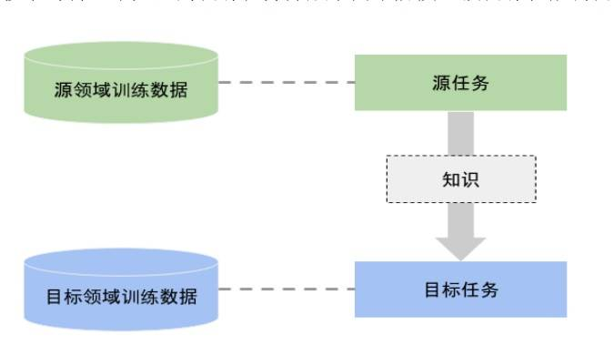

- 预训练阶段：这个阶段的训练目标是生成包含可重用知识的模型——预训练模型。预训练是一个耗时耗力的巨大工程，为了使得更多不同的任务能从中受益，预训练模型要包含尽量多的可重用的知识，因此预训练模型都非常复杂。这类复杂模型只能靠海量数据来进行训练，这个阶段会耗费大量的计算资源。而训练数据的获得则更加困难，以计算机视觉领域最成功的imagenet训练数据集为例，它将超过一千四百万张图片通过众包的方式进行人工标注。虽然耗费巨大，但是由于可以实现一次投入、重复利用，预训练的“费效比”实际上很高，因此业界仍然会在预训练上持续投入大量的资源。
- 微调阶段：根据任务的需要，在预训练模型的基础上设计并加入相应的微调任务层（比如使用分类器处理分类问题）。该阶段的主要目的是训练微调任务层的参数，由于微调任务层通常不会很复杂，参数数量比较少，因此可以使用较少的训练数据完成训练工作。

## NLP 的迁移学习

NLP 的迁移学习同样分为预训练和微调两步。

##### 图 2\. NLP 的迁移学习

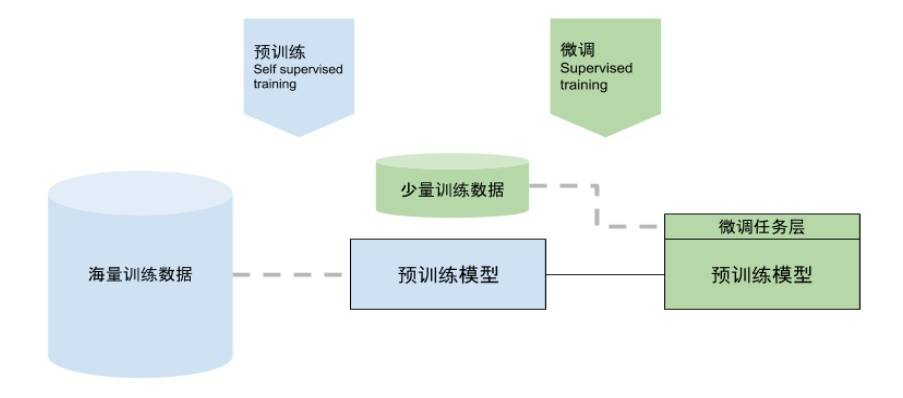

### 预训练

NLP 的预训练阶段采用自监督学习（self supervised learning）方式，这是由于 NLP 中的基本元素——词的含义通常由其所在的语句的上下文来决定，具有高度的灵活性，如果使用监督式学习的训练方式需要极大的工作量来得到训练数据。所幸的是使用语言模型（language model）可以很好地利用现有文本资料而无需任何人工标注来进行训练。语言模型是一种统计方法，用于计算一个序列 W（由词 w1,w2,……wm组成的一句话）出现的概率: P(w = p(w1,w2,w3,……wm)),也可以用于计算在一个序列中某个词 wn+1 出现的概率: P( wn+1\|w1,w2,w3,……wn))。

在使用大量的文本资料训练后，语言模型可以用来进行预测，预测标准为以概率最大的词作为预测结果，这就像我们使用输入法的时候，输入法会根据“机器学”预测“习”那样。

根据序列处理方向可以将语言模型分为两类，单向语言模型（unidirectional language model）和双向语言模型（bidirectional language model）。顾名思义，单向语言模型只以一个方向处理序列，如从左向右：

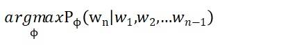

或从右向左：

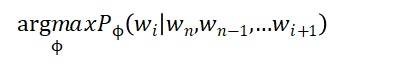

而双向语言模型则在两个方向上（从左到右和从右到左）分别进行序列的处理。

#### 训练目标

NLP 的预训练的目标是对词进行编码，将文本转换为微调任务模型结构能够处理的数据类型，同时编码要能够表达这个词的含义。词编码技术主要经历的下面两个发展阶段：

- 静态词编码（static word embedding）：这是一类早期的固定编码方式，如 Word2Vec，Glove 等，顾名思义这类编码赋予每个词固定的编码值，并且编码值体现了词的代表的含义，我们可以通过对编码值的运算得到有意义的结果，比如著名的例子 king — man + woman = queen
- 语境词编码（contextual word embedding）：静态词编码的最大的问题在于它只能每一个词一个编码值，无法处理一词多义的情况。显然，将“我爱吃苹果”和“我爱苹果手机”中的苹果赋予相同的编码是不合适的，更合理的方式是通过结合词出现的上下文判断词的含义，比如通过“吃”和“手机”来判断上面两句话中的“苹果”分别代表一种水果和一个品牌，这就是语境词编码的基本思想。

根据使用的训练算法可以将语境词编码分为两类：使用单向语言模型训练出的编码为单向语境编码；使用双向语言模型训练出的编码为双向语境编码，如 ELMO。

### 微调 fine tune

由于使用海量的数据进行预训练，预训练模型已经包含了大量的可重用的知识，微调阶段的主要目标是如何将这些知识应用在微调任务中去。这需要根据预训练模型来设计相应的网络结构来完成微调任务，预训练模型的架构设计决定了微调任务的难易程度。

微调任务由于需要解决一个具体问题，因此需要以标注训练数据的方式将相关领域的知识输入模型，进行监督式训练。由于只需要训练微调任务层的模型参数，因此不要特别大量的训练数据。

## BERT 简介

BERT（Bidirectional Encoder Representations from Transformer）是一个基于 Transformer 实现的双向编码器来提取输入序列特征信息的预训练模型。BERT 模型生成的元素编码属于双向语境编码，它能根据输入序列生成每个序列元素（词）在序列上下文中的特征向量， 与传统的双向语境编码算法（如 ELMO）不同的是，它基于注意力机制（attention mechanism）, 利用 Transformer 强大的特征提取能力，实现了深度双向语境编码。所谓 **深度双向** 是指注意力机制可以一次看到所有的序列元素，每个元素的编码的计算都包含了该元素之前和之后的序列信息。从方向来说，同时包含了之前和之后两个方向；从距离来讲，同时计算不同距离的各个元素；从编码方式上，attention 机制可以一次性完成编码， 这些特性都优于传统的基于 LSTM 的双向编码方式。我们在图 3 中可以看到，BERT 可以一次在所有方向和距离上完成注意力计算即可得到双向语境编码 T，而 ELMo 为了实现双向语境编码 T，需要多次在一个方向进行 RNN 的运算，最后再将两个方向上计算得到结果相加。

图 3\. 深度双向语境编码和双向语境编码

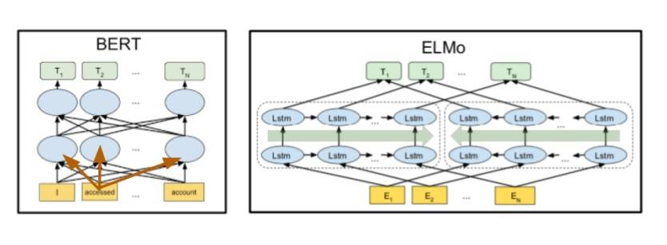

## BERT 预训练模型结构

BERT 预训练模型主要包含两个部分，编码层和 Transformer 编码器 ，如图 4 所示。

图 4\. BERT 模型组成

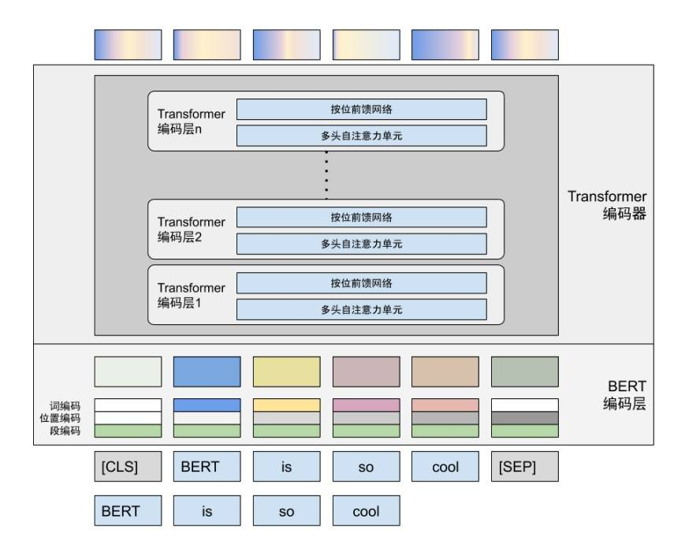

### 编码层

编码层（Embedding）主要解决两个问题，第一个问题是数据结构不匹配，BERT 预训练模型并不能直接接受自然语言的输入，原始输入已经在数据预处理阶段被转换成了能够被计算的浮点数向量，但是这个向量的长度并不和模型内部（Transformer encoder）接受的向量长度 h（在标准 BERT 模型中为 768）一致，因此需要矢量转换。

另一个问题来源 BERT 所使用的注意力机制，由于注意力机制没有前后顺序的概念，因此需要首先将位置信息加入输入元素中才能输入 Transformer 进行处理。

在 BERT 里设计了三种编码解决上述问题：

- 词编码负责向量长度的转换。做法是使用一个随机初始化的矩阵 LWE和输入向量 T[t1,t2,……tv]相乘将 T 转换为长度为 h 的向量 W 。这个矩阵包含 h 个可学习的参数，在 BERT 预训练过程中随其他参数一起学习。

    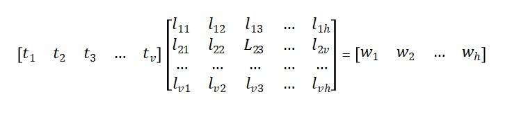

- 位置编码表示每个元素的位置信息。不同于 Transformer 的基于周期函数的固定位置编码计算方法，BERT 中同样使用一个矩阵 LPE，每个输入序列元素通过和 LPE 进行矩阵相乘的方式得到对应的位置编码。矩阵中的所有参数也都是在预训练的过程中学习出来的。表面上看，这种设计由于增加新的参数而提高了学习的成本，但是考虑到这个学习成本不大（查找表的参数量比 Transformer encoder 中参数量要少的多），并且只出现在预训练中，在微调训练和预测阶段，矩阵相乘相对于基于周期函数的位置编码计算方法的计算量要少，因此更适合迁移学习的场景。

与词编码不同是，由于每一个元素 T 的位置信息是以独热（one-hot）的方式输入的，当计算第 i 个词的位置编码时，输入为除了第 i 个位置为 1 其余一个全 0 的向量，这时将输入向量与矩阵相乘运算实际上相当于在矩阵 LPE 中查找第 i 行，因此矩阵 LPE 实际起到的是查找表的作用，如公式所示：

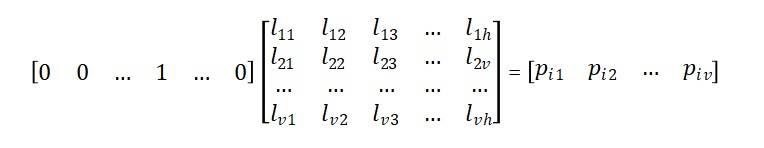

- 段编码与位置编码类似，用于区分不同语句。

以上三种编码的工作并不相互依赖，可以独立进行， 他们的结果通过按位相加（矢量的长度不变）的方式将三种信息融合在一起，作为 Transformer 编码层的输入，如图所示：

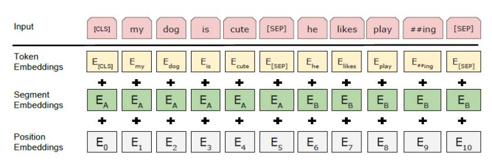

### Transformer 编码器

Transformer 模型最初应用于机器翻译，其最大特点是使用注意力机制（attention mechanism），解决了使用 RNN 模型造成的梯度爆炸和无法并行的问题，并且实践证明 transformer 中提出的多头注意力机制具有强大的特征提取能力，性能超越了 RNN,CNN 等传统方法。

Transformer 所使用的注意力机制的核心思想是去计算一句话中的每个词对于这句话中所有词的相互关系，然后认为这些词与词之间的相互关系在一定程度上反应了这句话中不同词之间的关联性以及重要程度。因此再利用这些相互关系来调整每个词的重要性（权重）就可以获得每个词新的表达。这个新的表征不但蕴含了该词本身，还蕴含了其他词与这个词的关系，因此和单纯的词向量相比是一个更加全局的表达。

Transformer 由编码器（encoder）和解码器（decoder）组成，编码器负责将输入序列中的每个元素转换为包含上下文信息的特征向量，再由解码器根据编码后的特征向量生成输出序列。BERT 模型中只使用了 transformer 的编码器，它主要由若干个结构相同的编码层连接而成。每一个编码层主要有一个多头自注意力计算单元（Multi-Head Attention）和按位前馈网络（Feed Forward）组成，多头自注意力计算单元负责为每个输入元素生成特征向量，前馈网络能够通过组合元素特征向量生成更复杂的特征向量。

## BERT 的预训练

### 任务设计

自然语言中蕴含的意义是以句子的形式表现的，为了让预训练模型学习到更多的知识，BERT 的预训练被设计为多任务学习（multi-task learning），包含两个任务：一个是 Masked Language Model(MLM)，训练模型在词的基础上理解单个句子蕴含的意义；另一个是 Next Sentence Prediction(NSP)，训练模型理解不同语句之间的上下文含义。通过这两个任务的联合学习，可以使得 BERT 学习到的特征既有单词级别信息，同时也包含了句子级别的语义信息。

#### Masked Language Model – MLM

BERT 之所以使用重新设计的 MLM，是由于注意力机制的使用使得 BERT 模型能够同时“看到”所有的序列元素，因此无法使用传统语言模型通过预测下一个元素的方式来进行训练。因此 BERT 使用了 Masked LM，做法是随机挑选序列中的若干词，将他们遮（mask）起来，使注意力机制无法“看到”原来的词，通过训练模型预测被遮罩词来促使模型学习到整个序列的含义。MLM 训练的思路类似于填词游戏，即通过上下文的信息来判断模型被隐藏的词。从原理上讲这种方式可以很好的匹配注意力机制的运算方式，但是在训练中遮罩元素的数量对于训练的效果和速度都有很大影响，如果遮罩太多，会丢失上下文语境，如果遮罩太少，又会让训练速度太慢。

BERT 的做法是给定一个句子，随机遮住 15%的词，然后输入到 BERT 模型并让 BERT 来预测这些被遮住的词。具体来说，对于每个被遮住的词，执行下面的遮罩替换规则：

- 以 80%的概率替换成[MASK]，比如 my dog is hairy → my dog is [MASK]
- 以 10%的概率替换成随机的一个词，比如 my dog is hairy → my dog is apple
- 以 10%的概率替换成它本身，比如 my dog is hairy → my dog is hairy

对于被遮罩词的替换规则：

- 如果只做[MASK]替换，预训练模型会被训练为对[MASK]进行预测，所以只会加强[MASK]附近上下文的分析而不是全部序列的分析。 而微调阶段的目标是分析整个序列，它的输入不包含[MASK]，与预训练模型的目标不一致，因此会导致预训练模型在微调阶段性能下降。 因此 BERT 中以 10%的几率随机将原词 hairy 替换为其他词 apple 而不是[MASK]，为了得出正确结果（hairy）模型需要分析 apple 的上下文。由于所有的词都可能被替换，这就要求模型要对所有输入元素的上下文进行分析，从而满足微调的需要。
- 考虑到如果只用[Mask]和任意词进行替换，模型会认为看到当前的词都是不真实的（替换过的），这会导致生成上下文编码的过程完全不参考当前词。为此预训练时也会以 10%的概率使用原词替换（如 hairy），这样模型也会参考当前词来生成上下文编码。

#### Next Sentence Prediction – NSP

输入句子 A 和句子 B，判断句子 B 是否是句子 A 的下一句，通过迭代训练，可以学习到句子间的关系，这对于文本匹配类任务显得尤为重要。NSP 的任务是判断句子 B 是否是句子 A 的下文。如果是的话输出’IsNext‘，否则输出’NotNext‘。

### 特殊符号

BERT 在预处理阶段中加入了两个特殊符号：CLS 和 SEP。CLS 加在输入序列的开头，它也和其他词一起输入 Transformer 计算上下文编码。我们知道注意力计算是对所有元素以一定的权重进行加权平均，由于 CLS 本身不包含任何意义，因此与序列中的其他元素都不相关，因此 CLS 的上下文编码是将所有元素的意思以相似的权重进行加权平均，这也就是整个序列的意义。由于 CLS 的上下文编码包含了整个序列的含义，因此在对序列进行分类等微调任务中会直接对它进行分类训练。 另一个特殊符号是 SEP，它用来分隔不同的句子。和 CLS 不同的是，SEP 符号本身不会用于微调任务，它主要用于分隔不同的句子。

### 预训练任务层

前面介绍了预训练模型的输出是与输入序列长度相同的浮点数向量（每个向量包含 768 个浮点数）序列，这样的输出无法直接完成任何训练任务，解决方法是在预训练模型之后添加一个网络层，将预训练模型的输出送入新的网络层继续处理，最终完成预训练的 MLM 和 NSP 任务，我们把追加在预训练模型之后的这层网络结构称为预训练任务层。

与预训练的两个训练任务 MLM 和 NSP 相对应的，预训练任务层包含了两个模型结构分别用于进行 MLM 和 NSP 训练任务。

#### MLM 任务层

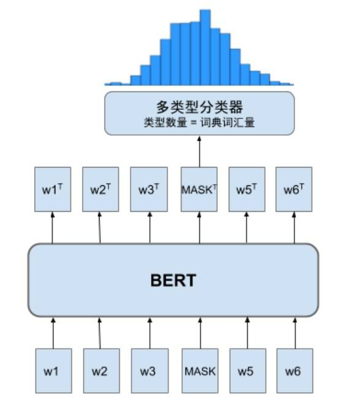

当把词汇表（vocabulary）中的每一个词都作为一个单独的类型时，对被遮罩词进行预测就变成了在所有类型中判断可能性最高的分类，这是典型的多类型分类问题。为了进行分类判断，需要在 BERT 的输出上增加一个多类型分类器（MLM head），如图 6 所示，它包含一个全连接网络和 softmax 运算，可以将 MASK 的上下文编码 MASKT 转换为长度为词典长度的输出向量，该向量中的每个浮点数代表属于对应分类的概率。应用这个分类器对所有词计算出每个类型的概率，再和这个测的真实分类进行比较，通过交叉熵运算计算误差。MLM 任务的误差函数 Lmlm 可以形式化的表示为下式:

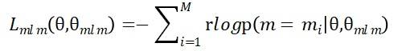

其中 θ 表示 BERT 预训练模型的参数，θmlm 表示 MLM 任务层（多类型分类器）的参数，M 表示数据集词典的容量。

#### NSP 任务层

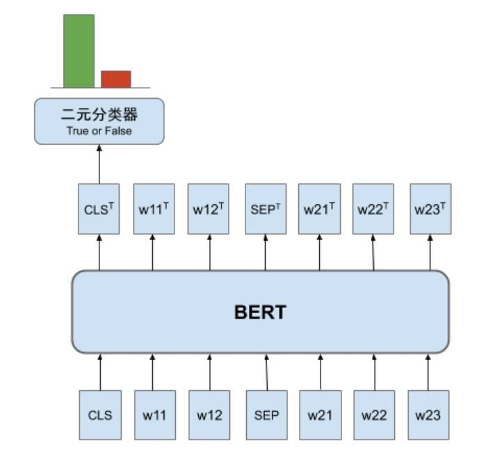

NSP 的训练目标是判断两个句子是否是连续的，属于二元（“是”和“否”）分类问题。和 MLM 相似，需要加上一个二值分类器来进行类型判断。与 MLM 不同的是，由于 CLS 的上下文编码 CLST 包含了整个序列（包含两个句子）的含义，因此只需要对 CLST 进行类型判断。预测误差和 MLM 一样使用交叉熵运算计算出 NSP 任务的误差函数 Lnsp：

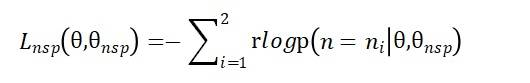

其中 θ 表示 BERT 预训练模型的参数，θnsp表示 NSP 任务层（分类器）的参数。

### 损失函数

与任务相对应，BERT 预训练的损失函数也由两部分组成，第一部分是来自 MLM 的单词级别分类任务，另一部分是 NSP 的句子级别的分类任务。通过这两个任务的联合学习，可以使得 BERT 学习到的表征既有单词级别信息，同时也包含了句子级别的语义信息。具体损失函数如下：

可以看到，虽然我们的目的是得到预训练模型（由 θ 决定），但是为了训练 θ，需要同时训练 NSP 和 MLM 任务层的参数 θmlm 和 θnsp， 在微调任务中会根据任务需要使用相应的模型结构替换预训练任务层，因此不会用到 θmlm 和 θnsp。

### 预训练流程

对于一条训练数据 X 包含两个连续的句子 W1，W2， 分别由词W11，W12，W13，W14，W15 和 W21，W22，W23，W24，W25 组成，预训练包含了下列步骤：

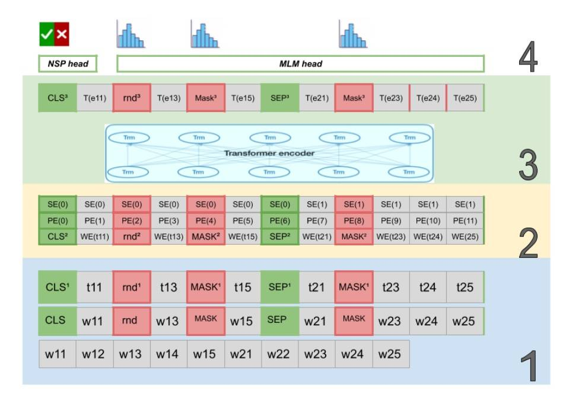

W1[W11，W12，W13，W14，W15]，W2[W21，W22，W23，W24，W25]

- 数据预处理:
    1. 加入特殊符号（CLS 和 SEP），以及使用 MASK 和随机词（rnd）替换原输入。
    2. 符号化（WordPiece tokenization），将文本 wi 转换为数值 ti
    3. 为输入数据生成真实预测值：对于 NSP 任务: PNSP = isNext；对于 MLM 任务:

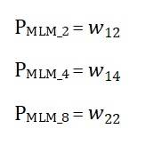

- 编码层
    1. 生成词编码 WE(ti)
    2. 生成位置编码 P
    3. 生成段编码 S
    4. 将以上三种编码按位相加 E(ti) =WE(ti) +PE(ti) +SE(ti)
- 使用 Transformer encoder 计算上下文编码: T(E(ti))
- 预测
    1. 将 MASK 上下文编码 MASK3 输入 MLM 任务层得到 MLM 预测值：P’MLM = MLM\_head(MASK3)
    2. 将 CLS 上下文编码 CLS3 输入 NSP 任务层得到 NSP 预测值：P’NSP = NSP\_head(CLS3)
- 计算误差
    1. 应用交叉熵计算 MLM 预测误差:MLM\_loss = Σ PMLMlog(P’MLM)
    2. 应用交叉熵计算 NSP 预测误差：NSP\_loss = Σ PNSPlog(P’NSP)
    3. 计算预训练总误差：BERT\_loss = MLM\_loss + NSP\_loss

## BERT 的微调

微调（fine tuning）是在 BERT 预训练模型的基础上加入针对性的网络结构（微调层），并利用（相对）少量数据来训练微调层使之能够满足一定的任务需要的学习过程。在微调训练中，训练数据首先通过 BERT 预训练模型计算，这时 BERT 预训练模型起到了特征提取器的作用，它的参数不会被训练（更新）。这些被提取出来的特征（上下文编码）再作为输入用于训练微调任务层的参数。 从本质上讲，基于注意力机制的 BERT 预训练模型能够为序列元素生成具备上下文信息的编码，围绕着这个特点，官方设计了很多微调任务（如 NER，MNLI，SQuAD 等），相对于 BERT 的预训练中使用的 MLM 和 NSP 任务，可以将这些微调任务分为两类：单句上下文任务和多句上下文任务。下面我们介绍这两类任务的典型代表。

### 单句分类问题

这种类型的任务对输入的一句话进行类型判断，例如判断一条购买评价是肯定的还是否定的，实际上就是对这个评价进行类型（肯定和否定）判断。 利用 BERT 预训练模型解决这类问题的方法是对 CLS 符号的 BERT 编码 CLST 进行类型判断，这是由于 CLS 符号和句子中其他词都没有关系，因此 CLST 实际上是以相同的权重加入所有词的信息，这也就是整个句子的信息。因此，实现上只需要将 CLST 输入分类器运算就可以得到这个句子的类型判断。

微调层结构：分类器（全连接+softmax）

- 微调训练：训练数据为输入句子X[w1，w2，w3，w4，w5，w6] 以及真实类型 y
- 训练流程
    1. 数据预处理，先将 CLS 加入 X 前， 再使用 WordPiece tokenizer 对输入文本进行符号化。
    2. 利用 BERT 预训练模型计算 wTi
    3. 用分类器计算预测类型 y’
    4. 使用交叉熵函数计算类型误差 -Σylog(y’)
    5. 应用反向传递机制更新分类器参数

### 阅读理解问题 SQuAD

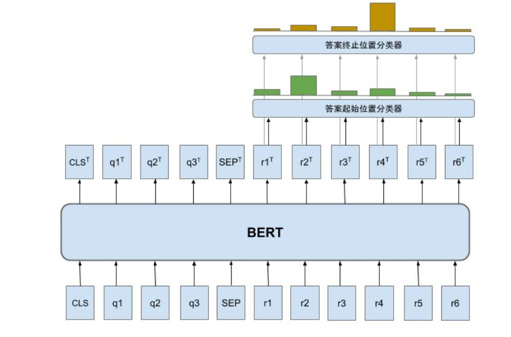

斯坦福问答数据集（SQuAD）是目前机器阅读领域的重要基准，是由众多数据标注者从维基百科文章中提取问题形成的，用于评估人工智能系统对自然语言的理解能力。SQuAD 的理解测试方法是在给定的上下文中为一个具体的问题寻找答案。例如给定一段背景描述信息“ _今天是教师节，小明送给了母亲一份特殊的节日礼物”后，提出问题“小明母亲的职业是什么？_”，让模型在背景描述信息中找到答案“教师”。

基于 BERT 的迁移学习方案在 SQuAD 理解测试中不仅刷新了人工智能系统的记录，甚至超过了人类的表现，再次证明了 BERT 预训练模型作为语言特征提取器的强大能力。 对于机器学习算法来说，这项任务可以表示为当输入为背景介绍和问题时，在背景介绍中答案的位置进行判断，由于答案的位置决定于它的起始和终止位置，而起止位置的判断可以理解为起止位置最可能出现在哪个位置上，属于分类问题（每个位置为一个类型），因此对答案位置的判断就变成了答案起止位置的分类问题。对应的，微调任务层由两个多类型分类器（分别进行起始和终止位置的分类判断）构成。

- 训练数据包含
     输入数据 X 包含两部分：问题 Q 和背景描述人 R : X[Q[q1,q2,q3],R[r1,r2,r3,r4,r5,r6]]，以及对应真实值 Y 包含答案起始位置ystart和答案终止位置yend：Y[ystart,yend]

- 训练流程

    1. 数据预处理：

         1.1 加入 CLS，SEP 后输入变为X'[CLS,q1,q2,q3,SEP,r1,r2,r3,r4,r5,r6]
         1.2 使用 WordPiece tokenizer 将转换为数值向量

    2. 使用 BERT 预训练模型计算 qTirTi

    3. 分别应用答案起始位置分类器和答案终止位置分类器预测答案的起始位置 y’start 和终止位置 y’end。
    4. 计算误差

         4.1 计算起始位置预测误差：Lstart = -Σystartlog(y’start)

         4.2 计算终止位置预测误差 ：Lend = -Σyendlog(y’end)

         4.3 计算总误差：L = (Lstart+Lend)/2

    5. 应用反向传递机制更新答案起始位置分类器和答案终止位置分类器参数。

## 总结

个人理解 BERT 在迁移学习领域取得的巨大成功源自于两个方面的提高，一方面是在内部实现层面引入了 Transformer 模型的强大特征提取能力，为 BERT 在 NLP 领域的优异表现打下了“硬件”基础，特别是根据注意力机制的特点专门设计了 MLM 预训练任务，通过一系列的巧妙遮罩规则设计使得 BERT 的预训练能够顺利进行，这不但需要坚实的理论基础支持，而且需要经过大量实验，不断打磨才能最终获得最优的解决方案。

另一方面在更高的维度上，BERT 在设计之初就考虑了迁移学习简化问题，不仅需要让预训练模型支持多种类型的微调任务，而且还要尽量简化操作，降低使用预训练模型的使用成本。从结果上看，BERT 很好的完成了设计目标，只需要一个微调任务层来对 BERT 预训练模型进行微调就可以用它来满足各种任务，无需针对特定任务对模型进行修改。这种便捷的迁移学习方式大大增加了 BERT 在业界的关注度和影响力， 也是它取得成功的重要因素。