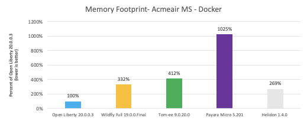
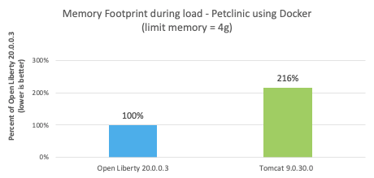
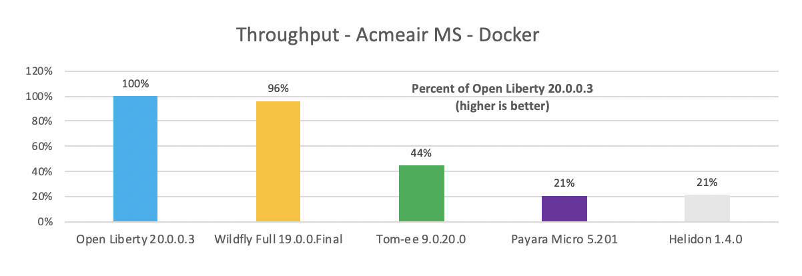
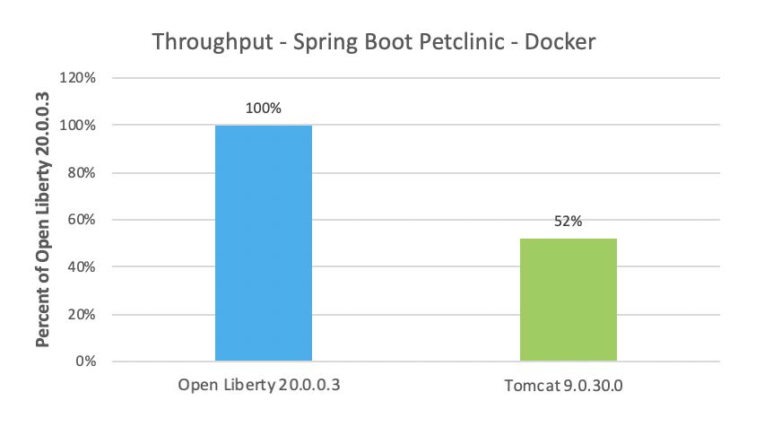
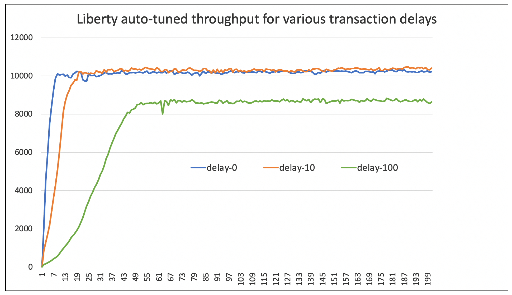

# Open Liberty 成为开发和部署微服务的理想之选的六大理由
使用 Open Liberty 可简化基于微服务的应用程序的开发和部署

**标签:** Eclipse MicroProfile,Java,Open Liberty,微服务

[原文链接](https://developer.ibm.com/zh/articles/6-reasons-why-open-liberty-is-an-ideal-choice-for-developing-and-deploying-microservices/)

Graham Charters

发布: 2020-11-26

* * *

## 简介

当您首次考虑微服务时，您可能会认为它们之间唯一的区别是应用程序的规模。毕竟只有一些小型应用程序可以互相通信。只有当您深入研究并着手操作时，您才会意识到，创建、容器化、部署和管理大量互连应用程序需要满足一系列独特的要求。

IBM® WebSphere Liberty 诞生于 2012 年，旨在满足对轻量级敏捷运行时的日益增长的需求。2017 年，随着对开源的需求不断增长，我们推出了 Open Liberty，这是一种位于上游的功能齐全的 Liberty 开源分发版。同时，WebSphere Liberty 仍然存在，它提供了一些可使传统企业应用程序更容易现代化的附加功能，但对于大多数应用程序而言，Open Liberty 提供了您所需要的一切功能。

与传统应用程序服务器运行时相比，Liberty 极大地简化了应用程序的开发和部署过程。从不到 24MB 的部署一直到完整的 Jakarta EE/Java EE 支持，它都能够创建合适大小的部署。它的零迁移架构解决了版本间的迁移难题，其自动调整功能可以实现最佳性能，并避免了高开销的调整周期，而且配置方式十分简单。这些特性都适用于云部署，同时它还提供了一流的容器支持和云原生 API（例如 MicroProfile），因此 Liberty 是基于微服务的新型应用程序的理想之选。

下面我们来详细看看 Liberty 成为云原生微服务的理想之选的六大理由。

## 理由 1：镜像大小合适（没有额外的包袱）

部署微服务时，它们的资源消耗量（CPU、内存等）直接决定了成本。如果要在曾经只有一个整体式应用程序的位置部署数十个或数百个微服务，那么现在会增加数十个或数百个运行时实例。因此，微服务只能消耗适量的资源，这一点很重要。如果要部署数百个小型微服务，那么您肯定不希望每个微服务都占用数百兆的服务器运行时和库。

Liberty 是一个完全模块化的运行时，可让您挑选应用程序所需的功能。借助 Liberty，您可以使用一种运行时和一种方法来开发和部署各种规模的应用程序，从小型微服务一直到整体式现代化企业应用程序。

下表显示了三个示例运行时包的磁盘和内存测量值。第一行包含 Java EE/Jakarta EE 和 MicroProfile 的所有最新 API（整体式现代化云原生应用程序所需要的一切），第二行包含足以支持 MicroProfile 3.3 的运行时（典型微服务所需要的一切），第三行包含足以运行 Servlet 4.0 的运行时（运行简单 Web 框架可能需要的绝对最低配置）。您可以看到，当我们因需求量下降而适当调整 Liberty 的规模时，磁盘和内存需求也会下降，就像使用单个运行时一样。

包磁盘空间内存**Java EE 8/Jakarta EE 8 + MicroProfile 3.3**121MB165MB**MicroProfile 3.3**59MB113MB**Servlet 4.0**24MB72MB

## 理由 2：运营成本低（所需内存更少，吞吐量更高）

从整体式应用程序转变为架构样式，可能需要部署数十个或数百个小型应用程序，这会导致各个运行时性能特征的重要性发生变化。您可能经常听到“冷启动”这个词，它对于云功能至关重要（ [Liberty 的首次响应时间大约为 1 秒](https://openliberty.io/blog/2019/10/30/faster-startup-open-liberty.html)），但是对于微服务而言，每个正在运行的实例在被替换之前可能会处理数千个请求。综合考虑数十到数百个服务和数千个请求的预期使用情况后，我们发现最重要的性能指标是内存消耗量和吞吐量，而且这两个指标对成本的影响最大。

### 内存占用量比较

下图展示了运行 [Acme Air Microservices](https://github.com/blueperf) 基准测试的服务器在启动后的内存占用量比较。在此场景中，Liberty 使用的内存比其他运行时少 2.5 到 10 倍。

如果您为应用程序选择了 Spring Boot，那么 [在 Liberty 上运行](https://developer.ibm.com/technologies/java/articles/modernize-and-optimize-spring-boot-applications/) 大约可带来 2 倍的内存占用量优势（如下图所示），下图展示了在一定负载条件下使用 4GB 堆运行 [Spring Boot Petclinic](https://github.com/spring-projects/spring-petclinic) 应用程序时的相对内存使用量。

### 吞吐量比较

与其他运行时相比，Liberty 还具有显著的吞吐量优势。下图展示了根据 Acme Air Microservices 基准测试测得的吞吐量测量值。在所测试的运行时当中，Liberty 的整体性能最佳，并且明显优于大多数运行时。

下图展示了在 Liberty 上运行 Spring Boot Petclinic 应用程序时的吞吐量几乎是在 Tomcat 上运行时的 2 倍。

将内存优势和吞吐量优势相结合，相当于在 Liberty 上运行此 Spring Boot 应用程序节省了超过 4 倍的成本（每 MB 吞吐量），而与最接近的其他运行时相比，节省了 3.5 倍的成本。这可能节省 3 倍多的云和许可成本。

## 理由 3：持续交付（低维护开销，零技术债务）

向云原生服务和微服务的转变，通常会导致运行时所有权责任的转移。由单个多学科团队负责将应用程序（例如，微服务）开发、打包和部署为包含服务器运行时的不可变容器，甚至 Spring Boot 应用程序也嵌入了服务器（例如，Tomcat、Jetty 或 Liberty）。由运营团队负责管理基于 Kubernetes 的云平台（例如 Red Hat OpenShift），而应用程序团队将在该平台上部署容器。

在新的云原生领域中，有一点经常会被忽视，那就是现在是由开发团队负责维护运行时（这已成为容器内容的一部分）。以前，运营团队负责管理少量的服务器运行时实例，慎重部署主要版本或服务发行版升级，并确保应用了关键的安全“临时修订”。现在，由交付数十个或数百个应用程序（每个应用程序都嵌入一个运行时）的开发团队来负责确保这些运行时保持最新且没有漏洞。那么，Liberty 如何解决这个问题呢？

答案的第一部分是经常发布。Liberty 具有“持续交付”发布周期，每四周提供一次新发行版。针对先前发行版提供的所有修订都会自动纳入下一个发行版。因此，通过持续交付，无需申请服务，就可以自动获取服务。可从 [Maven Central](https://search.maven.org/) 和 [Docker Hub](http://hub.docker.com/) 中获取每个 Liberty 发行版，因此可以更轻松地通过构建自动化获得最新发行版。开发团队可以轻松地重建其容器以引入最新发行版，确保它包含先前版本的修订。答案的第二部分是“零迁移”（如下一部分中所述）。

当然，如果不想改变应用程序的交付方式，但仍然希望获得 Liberty 的优势，那么也可以使用 Liberty 的发布周期和 [支持选项](https://openliberty.io/support/) 来实现这一点。每个 Liberty 发行版都提供了 5 年支持，一年中名称以 3、6、9 和 12 结尾的版本都提供了两年的“临时修订”支持，因此可以实现更传统的更新周期。也不需要扩展支持，因为每四周发布一次新发行版将会重置五年支持的计时器。有关更多信息，可参阅 [Liberty 支持策略](https://www.ibm.com/support/pages/single-stream-continuous-delivery-sscd-software-support-lifecycle-policy-websphere-liberty)。

## 理由 4：零迁移（毫不费力地保持最新状态）

Liberty 是唯一提供“ [零迁移](https://www.ibm.com/support/knowledgecenter/SSEQTP_liberty/com.ibm.websphere.wlp.doc/ae/cwlp_migration.html)”的 Java 运行时。“零迁移”意味着您可以在短短几分钟内迁移到最新的 Liberty 版本，而无需更改应用程序代码或配置。在过去，团队很害怕进行这些迁移，因为他们必须提前几个月制定计划并用一年以上的时间才能完成迁移，因此需要大量投入才能保持最新状态。

**不要只听我们说**

“今天，我们已将所有 Liberty 服务器配置从 EE7 迁移到 EE8。在 tradWas [传统 WebSphere Application Server] 中，此过程通常需要 18 个月。无法确切地说出需要多少工时。今天只花了 18 分钟。在 7 月，所有应用程序都会开始使用 EE8 框架。Liberty 和持续交付流的表现太棒了！”

– Henrik Lundström，Handelsbanken（瑞典）银行的 WebSphere Application Server 系统管理员

Liberty 通过使用版本化的“功能”实现零迁移。在 Liberty 中，API 是由功能提供的，例如，有一项 servlet-3.1 功能。当引入会破坏现有应用程序的新功能或出现新的规范版本时，Liberty 会提供一项新功能。因此，当发布了 Java EE 8 并进行了重大更改时，将随 servlet-3.1 功能一起创建 servlet-4.0 功能，并且应用程序可以选择使用其中一项功能。因此，是否迁移应用程序的决策与是否更新 Liberty 级别无关。如果要迁移到最新的 Liberty 级别，但不迁移应用程序和配置，那么可以继续使用相同的功能（例如 servlet-3.1）。这意味着您可以获取最新的运行时修订，而不必进行棘手的​​迁移。当您准备好利用最新的 API（例如 servlet-4.0）时，可以更新服务器配置和应用程序以便使用这些 API。

通过将持续交付与零迁移相结合，您可以用最少的投入，利用修订来保持最新状态；在出现新的业务需求时，您可以选择投资于应用程序更改并从中受益。

## 理由 5：针对 Kubernetes 进行了优化（自动调整，原生集成）

现在，大多数大型企业都在生产环境中运行 Kubernetes，并且容器和 Kubernetes 被视为是所交付的云原生微服务必不可少的一部分。需要一个支持容器和容器编排 (Kubernetes) 最佳实践的运行时，才能持续交付基于容器的微服务。因此，必须能够轻松执行以下操作：

- 在不知道容器部署位置的情况下实现最佳性能。
- 创建和维护受支持的安全镜像。
- 将运行时和应用程序与容器编排环境集成在一起。

如果不具备这些特性，微服务将效率低下，难以维护和确保安全，并且难以管理。以下部分说明了 Liberty 如何帮助提供完美的 Kubernetes 体验。

### 自动调整运行时

在部署到公共或私有云容器环境时，实现应用程序的最佳性能至关重要。这并不是容器特有的，但容器使调整更具挑战性。为了解决这个问题，Liberty 做了两件事：

**经验之谈**

“您无需调整线程池。Liberty 在这方面做得很出色。”

– Shawn Hisaw，大型医疗机构的 WebSphere Application Server 技术负责人

- 它提供了非常棒的默认值，您几乎不需要进行更改。
- 其 [线程池可自动调整](https://openliberty.io/blog/2019/04/03/liberty-threadpool-autotuning.html)，并且针对其运行环境进行了优化。

下图展示了基于不同请求延迟的 Liberty 吞吐量。您可以看到，自动调整可以快速实现最佳性能。如果延迟随着时间而更改，那么 Liberty 也会进行适当的调整。

### 适合生产的镜像

对于每个新的 Liberty 发行版，都会将新的 [Universal Base Image](https://access.redhat.com/articles/4238681) 容器镜像上传到 [Docker Hub](https://hub.docker.com/)。这些镜像将免费分发 – 符合 OCI（ [开放容器计划](https://opencontainers.org/)）标准，并可以选择提供相应的 [支持](https://www.ibm.com/support/pages/container-deployment-support-policy-websphere-liberty)。 将根据 Liberty 的 [支持策略](https://www.ibm.com/support/pages/single-stream-continuous-delivery-sscd-software-support-lifecycle-policy-websphere-liberty) 来上传和维护 [Open Liberty](https://hub.docker.com/r/openliberty/open-liberty) 和 [WebSphere Liberty](https://hub.docker.com/r/ibmcom/websphere-liberty) 的镜像。系统会自动应用针对关键安全漏洞的修订并更新镜像，因此您无需执行这些操作。

如果镜像不完全符合您的要求，那么您可以获取并自定义用于创建这些镜像的 [Open Liberty](https://github.com/OpenLiberty/ci.docker) 和 [WebSphere Liberty](https://github.com/WASdev/ci.docker/) Dockerfile 和脚本，因为它们都是开源的，并且在公共存储库（如 Maven Central 和 Docker Hub）中提供了所有必需的工件。

### Kubernetes 集成

迁移到容器后，Kubernetes 已迅速成为首选的编排技术。通过使用基于 Kubernetes 的平台（例如 OpenShift），您可以部署容器，缩放容器，甚至将它们缩放到零。

操作程序是首选的 Kubernetes 管理方法。使用 [Open Liberty Operator](https://operatorhub.io/operator/open-liberty)，可以在 Kubernetes 和 OpenShift 内实现一流的 Liberty 管理。它极大地简化了应用程序的部署和配置、集群化、持久性集成、服务绑定、问题确定等过程。

在管理容器生命周期和流量时，有时候需要容器内的运行时提供帮助。例如，如果 Kubernetes 认为容器已死机，它将重新启动容器；如果它认为容器未准备就绪，那么它不会向容器分派请求。容器提供的 Kubernetes 活动状态和就绪状态探针可用于指示容器/应用程序的状态。利用 Liberty 中的 MicroProfile Health 支持，可以很容易提供这种级别的容器编排集成。

## 理由 6：简单易用的实用开发者工具（容器感知，专注于持续交付）

一流的开发者体验是高效交付新功能和修订时必不可少的一部分。多年来，Liberty 一直致力于帮助开发者使用首选工具来提高工作效率。Liberty 集成了最受欢迎的构建工具 Maven 和 Gradle，包括在 Maven Central 中发布所有运行时二进制文件。 Liberty 的 Maven 和 Gradle 支持还提供了“ [开发模式](https://openliberty.io/blog/2019/11/28/dev-mode-liberty-maven-plugin.html)”，这意味着开发者可以在本地运行的服务器（甚至是在本地容器中运行的服务器）上进行代码和配置更改并使这些更改立即生效。这样就不需要完全重建和重新部署，因此极大地缩短了开发和测试更新所需要的时间；容器支持意味着您可以在更接近于生产环境的环境中进行开发和测试。

测试云原生应用程序时需要进行容器内测试。在容器内进行“True-to-Production”集成测试可大大降低问题进入生产环境的可能性。“ [MicroShed](https://microshed.org/microshed-testing/)”测试刚好可以做到这一点，它可以针对容器中运行的 Liberty 应用程序运行 Junit 集成测试，包括与运行数据库和 Kafka 的容器的集成。

通过使用开发模式，可以在最受欢迎的代码编辑器（如 IntelliJ、Eclipse、VS Code，甚至是 vi）中执行热部署、热测试、热调试等操作。将开发者模式与 MicroProfile API 和 MicroShed 测试相结合，可以为您带来全面的云原生开发者体验。我们将不断提供新功能，让您的开发者如虎添翼！

## 结束语

迁移到更细粒度的云原生微服务部署会给开发和运营团队带来新的挑战：需要具有高吞吐量和低资源使用率的运行时；需要一流的容器和 Kubernetes 集成；必须能够通过频繁进行简单升级来确保安全，等等。

本文重点介绍了 Liberty 中可应对这些新挑战的六大功能：

- 运行时大小合适
- 运营成本低
- 持续交付
- 零迁移
- 优化了 Kube
- 提供了完美的开发者体验

凭借这些功能，Liberty 已经成为了微服务开发和部署的理想之选。

### 后续步骤

如果您想亲自体验 Liberty，可以查看 [Open Liberty 实践指南](https://openliberty.io/guides/)。

本文翻译自： [6 reasons why Open Liberty is an ideal choice for developing and deploying microservices](https://developer.ibm.com/articles/6-reasons-why-open-liberty-is-an-ideal-choice-for-developing-and-deploying-microservices/)（2020-10-28）