# OpenShift 中的容器多网络平面选型
使用 macvlan 实现 pod 的多网络

**标签:** 云计算

[原文链接](https://developer.ibm.com/zh/articles/cl-lo-container-multi-network-plane-selection-in-openshift/)

魏新宇

发布: 2020-09-02

* * *

## OpenShift 中的网络

OpenShift 的网络主要分为两大部分：入口流量网络和内部 SDN。Kubernetes 1.0 中没有 Ingress 的概念，彼时将入站流量路由到 Kubernetes Pod 和 Service 是一项非常复杂、需要手工配置的任务。在 OpenShift 3.0 中，红帽开发了 Router（容器化 HAProxy），以提供入口请求的自动负载平衡。Router 是现在 Kubernetes Ingress Controller 的前身。OpenShift4 通过 Ingress Controller 管理 Router（容器化 HAProxy）。目前 OpenShift 4.4 使用 HAProxy2.0。

Kubernetes 本身不包含 SDN 和虚拟网络隔离。而 OpenShift 包括集成了 OVS 的 SDN，并实现虚拟网络隔离。OVS 全称是 Open vSwitch，它是一个开源项目，各厂商在项目中的代码贡献如下图 1 所示（ [参考链接](https://www.stackalytics.com/unaffiliated?project_type=ovs-group&date=all)）：

**图 1\. Open vSwitch 开源社区代码贡献厂商**

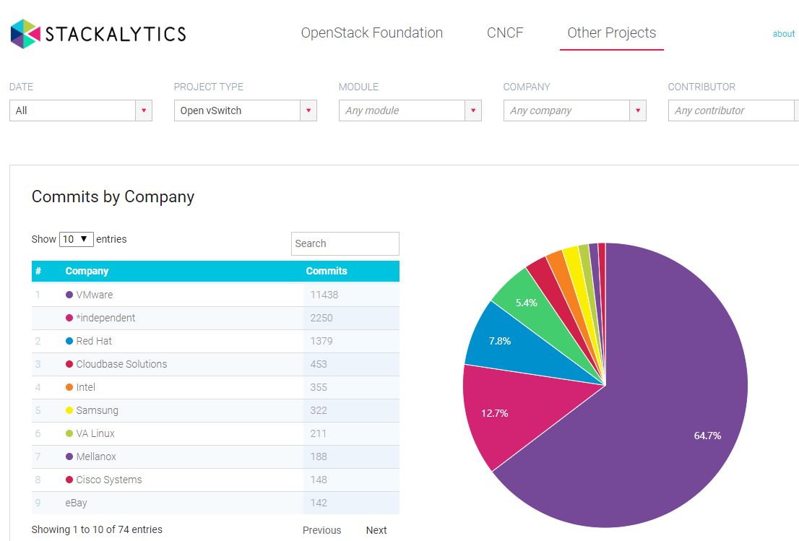

基于 OVS 的 OpenShift SDN 提供了三种模式：ovs-subnet、ovs-multitenant、ovs-networkpolicy。

- ovs-subnet：OpenShift 3 默认的 OVS 插件模式，提供扁平的 Pod 网络。集群中每个 Pod 都可以与其他服务的 Pod（本项目或其他项目）进行通信。
- ovs-multitenant：提供项目级别的隔离，这种模式下，除 default 项目外，默认所有项目之间隔离。
- ovs-networkpolicy：提供 Pod 粒度级别的隔离，这种模式的隔离完全由 NetworkPolicy 对象控制。项目管理员可以创建网络策略，例如配置项目的入口规则保护服务免受攻击。

此外，红帽还帮助推动了 Kubernetes 容器网络接口（Container Network Interface，简称 CNI）的开发、为 Kubernetes 集群提供了丰富的第三方 SDN 插件生态系统。OpenShift 4 OVS CNI 默认使用 Network Policy 模式，极大提升了容器的网络安全。

### OpenShift 上的多网络平面

OpenShift 3 中，一个 OpenShift 集群只能选择一个 SDN 插件，一个 Pod 也只能配置一块虚拟网卡。那么，有没有一种可能，我们为一个 Pod 配置多个网卡，连接多个网络，让一个 Pod 沿多个不同的网络链路发送流量。例如 OpenShift 集群的网络流量使用 OVS 网络，而对性能要求较高业务数据则连接其他类型的 CNI 插件？

在 OpenShift 4 中引入了 Multus-CNI，它同样是一个 CNI 插件，也是一个独立的 [开源项目](https://github.com/intel/multus-cni)。Multus-CNI 实现了在 OpenShift 中将多个网络接口连接到同一个 Pod。在 Multus CNI 模式下，每个 Pod 都有一个 eth0 接口，该接口连接到集群范围的 Pod 网络。使用 Multus CNI 添加的其他网络接口，则将其命名为 net1、net2 等。同时，Multus-CNI 作为一个 CNI 插件，可以调用其他 CNI 插件，它支持：

- CNI 规范的参考插件（例如 Flannel、DHCP、Macvlan、IPvlan）。
- 第三方插件（例如 Calico、Weave、Cilium、Contiv）。
- Kubernetes 中的 SRIOV、SRIOV-DPDK、OVS-DPDK 和 VPP 工作负载以及 Kubernetes 中的基于云原生和基于 NFV 的应用程序。
    我们可以根据业务需要，对插件进行选择。例如对网络性能要求高，可以使用带有 Multus CNI 的 macvlan 等方案。接下来，我们先对几种网络方案的性能进行对比。

### 几种 CNI 性能对比

我们引用 Soong-Sil University 发布的第三方测试报告： [Considerations for Benchmarking Network Performance in Containerized Infrastructure](https://www.ietf.org/proceedings/105/slides/slides-105-bmwg-considerations-for-benchmarking-network-performance-in-containerized-infrastructures-00)。该报告包含多个测试场景，我们关注 BMP2BMP（Baremetal POD to Baremetal）场景，即测试运行在物理服务器上 pod 的网络通信性能。

在 BMP2BMP 中测试如下几类插件：

- OpenStack-Kuryr (OVS bridge)
- Flannel-CNI (docker bridge-Flannel bridge)
- MACVLAN, IPVLAN / Data acceleration(SR-IOV)

BMP2BMP 场景环境架构如下图 2 所示（该图源自 Considerations for Benchmarking Network Performance in Containerized Infrastructure）：有两个 Bare metal 环境，第一个环境有两个 pod，第二个环境有一个 pod。

**图 2\. Pod 网络性能测试环境架构图**

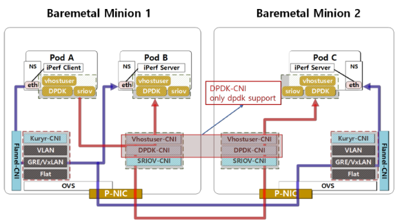

BMP2BMP 场景两个服务器的配置如下所示：

节点部件配置CPUIntel(R) Xeon(R) Gold 6148 2.40GHz \* 2Minion1 Minion2MEMORYDDR4 2400 MHz 32GB \* 6SR-IOV NICMellanox ConnectX-5 (40G SFP+)

BMP2BMP 场景软件配置如下所示：

软件配置OSUbuntu 16.04 Server LTSCloud OSOpenstack queens by DevstackCOEkubernetes v1.9.0 and docker 18.06CNIdefault cni plugin driver and kuryr, flannel, sr-iov, vshot-user, multus

在一个物理服务器上两个 pod 的通讯的测试结果：
吞吐量：macvlan > ovs-vlan (20% lower) > SR-IOV > ipvlan，详情如下图 3 所示（该图源自 Considerations for Benchmarking Network Performance in Containerized Infrastructure）：

**图 3\. 同一个物理机上两个 pod 网络通讯的吞吐量**

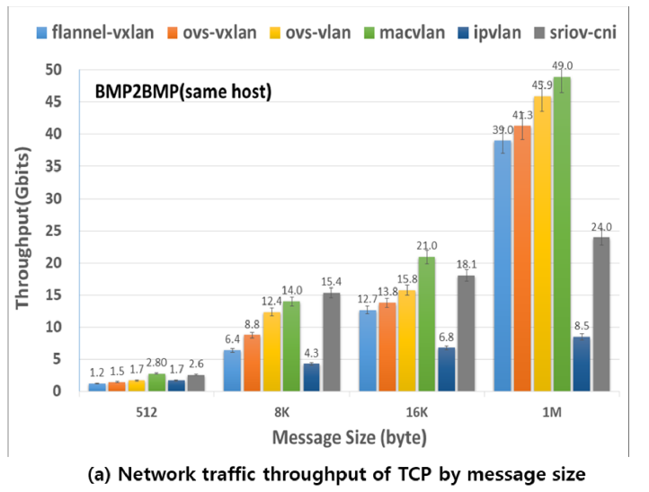

网络延迟：SRIOV(up to 16K) > ovs-vlan > ipvlan > macvlan，如下图 4 所示（该图源自 Considerations for Benchmarking Network Performance in Containerized Infrastructure）：

**图 4\. 同一个物理机上两个 pod 网络通讯的网络延迟**

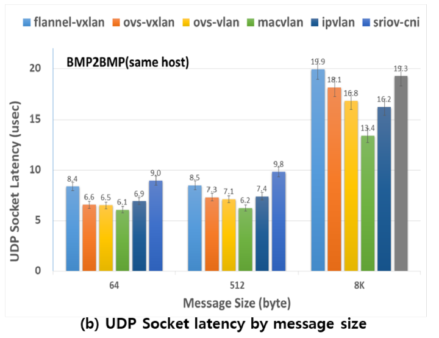

两个物理服务器上 pod 的通信性能测试中，结合吞吐量和网络延迟，整体性能排名：MACVLAN > SR-IOV> ovs-vlan > ipvlan

具体数据如下图 5 所示（该图源自 Considerations for Benchmarking Network Performance in Containerized Infrastructure）：

**图 5\. 两个物理机上 pod 网络通讯的网络性能**

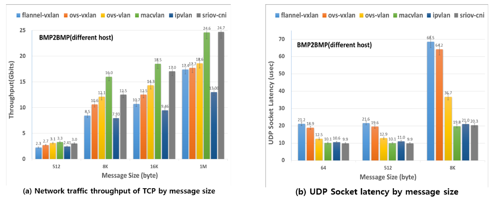

我们再关注另外一个测试报告：Performance of Container Networking Technologies，在该报告中吞吐量测试时：容器所用的 macvlan 网络的极限值和线性与物理网卡非常接近（线性好于 ovs 和 Linux Bridge），如下图 6 所示（该图源自 Performance of Container Networking Technologies）：

**图 6\. 吞吐量极限测试**

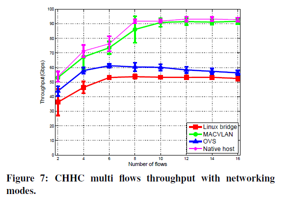

从以上两个测试报告中，我们可以得出结论：如果客户在生产环境想提升 OpenShift 中的容器网络性能，不必考虑替换默认 SDN（OVS）。使用 macvlan 等多网络平面即可，macvlan 的性能接近物理网卡。这样既能保证 OpenShift 原生架构不会破坏（带来 PaaS 方案的多厂商支持的问题），也有助于提升容器的业务网络的性能。

接下来，我们介绍在 OpenShift 中配置基于 macvlan 的 Multus-CNI。

## 在 OpenShift 中配置 macvlan 多网络平面

在本小节中，我们将 macvlan 配置为 pod 的第二个网卡。Macvlan 的地址分配有静态指定和动态分配两种：

- 如果需要为 pod 指定固定 IP 地址，可以使用静态指定的方式。这种方式不利于容器的弹性伸缩。
- 如果允许 pod 随机获取 IP 地址，那么可以使用动态分配 IP 地址的方式，我们只需要指定一个 IP 地址段即可。这种方式管理更方便，也便于实现容器的弹性伸缩。

接下来，我们先介绍静态 IP 分配的方式。

### Macvlan 静态 IP 地址配置示例

查看实验环境的 OpenShift 4.4.3 集群（Kubernetes v1.17.1），包含三个 Master 节点、两个 Worker 节点。

```
[root@lb.weixinyucluster ~]# oc get nodes
NAME       STATUS   ROLES    AGE   VERSION
master-0   Ready    master   21d   v1.17.1
master-1   Ready    master   21d   v1.17.1
master-2   Ready    master   21d   v1.17.1
worker-0   Ready    worker   21d   v1.17.1
worker-1   Ready    worker   21d   v1.17.1

```

Show moreShow more icon

查看 OpenShift 一个 Worker 节点的 IP，为 192.168.91.21：

```
[root@lb.weixinyucluster ~]# oc describe node worker-1 |grep -i ip
InternalIP:  192.168.91.21

```

Show moreShow more icon

登录 worker 节点，查看节点的物理网卡为 ens3，IP 地址为 C 类网段，如下图 7 所示：

**图 7\. 查看 Worker 节点 IP**

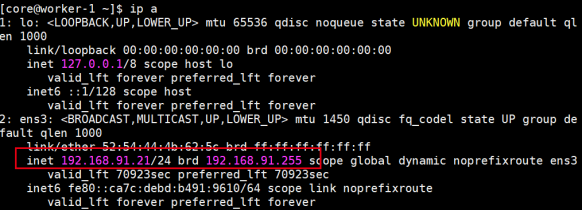

查看网关为 192.168.91.1，如下图 8 所示：

**图 8\. 查看 Worker 节点网关**

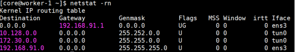

我们为一个 pod 配置 macvlan 的第二个网卡。这个网卡和 OpenShift 处于同一个 vLAN。首先确认 192.168.91.250 地址未被使用。

```
[root@lb.weixinyucluster ~]# ping 192.168.91.250
PING 192.168.91.250 (192.168.91.250) 56(84) bytes of data.
--- 192.168.91.250 ping statistics ---
3 packets transmitted, 0 received, 100% packet loss, time 1999ms

```

Show moreShow more icon

修改网络 ClusterOperator，增加附加网络的定义。在如下清单 1 中，配置附加网络名称（macvlan-network）、静态 IP（192.168.91.250）、配置网关（192.168.91.1）、配置物理网卡名称（ens3）、将网络定义赋予到 tomcat 项目中：

**清单 1\. 在 ClusterOperator 中增加附加网络定义**

```
#oc edit networks.operator.openshift.io cluster
spec:
additionalNetworks:
  - name: macvlan-network
    namespace: tomcat
    simpleMacvlanConfig:
      ipamConfig:
        staticIPAMConfig:
          addresses:
          - address: 192.168.91.250/24
            gateway: 192.168.91.1
        type: static
      master: ens3
      mode: bridge
type: SimpleMacvlan

```

Show moreShow more icon

增加内容在配置文件中的位置如下图 9 所示：

**图 9\. 增加内容在配置文件中的位置**

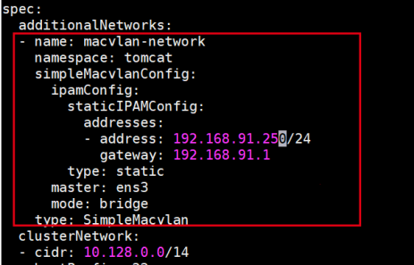

添加信息完毕后，保存退出。
查看赋予项目的附加网络，macvlan-network 已经添加成功：

```
[root@lb.weixinyucluster ~]# oc get network-attachment-definitions  -n tomcat
NAME              AGE
macvlan-network   32s

```

Show moreShow more icon

书写创建 pod 的 yaml，如清单 2 所示，使用 k8s.v1.cni.cncf.io/networks 注释调用 macvlan-network，pod 的 yaml 配置文件如清单所示：

**清单 2\. 创建 pod 的 yaml 文件**

```
[root@lb.weixinyucluster ~]# cat example-pod.yaml
apiVersion: v1
kind: Pod
metadata:
name: example-staticip
annotations:
    k8s.v1.cni.cncf.io/networks: macvlan-network
spec:
containers:
  - name: example-pod
    command: ["/bin/bash", "-c", "sleep 2000000000000"]
image: centos/tools

```

Show moreShow more icon

应用配置文件：

```
[root@lb.weixinyucluster ~]# oc apply -f example-pod.yaml
pod/example-staticip created

```

Show moreShow more icon

pod 已经创建成功：

```
[root@lb.weixinyucluster ~]# oc get pods
NAME               READY   STATUS    RESTARTS   AGE
example-staticip   1/1     Running   0          84s

```

Show moreShow more icon

登录 pod，确认该 pod 已经被添加 192.168.91.250 地址，如下图 10 所示：

**图 10\. 确认 pod 中 macvlan 网络添加成功**

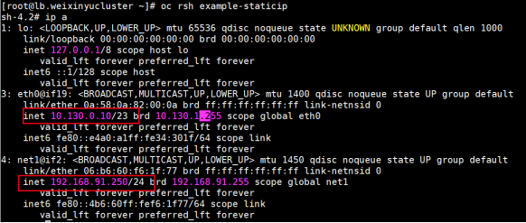

确认在 pod 里 ping 网关可以成功。

```
sh-4.2# ping 192.168.91.1
PING 192.168.91.1 (192.168.91.1) 56(84) bytes of data.
64 bytes from 192.168.91.1: icmp_seq=1 ttl=64 time=0.577 ms

```

Show moreShow more icon

确保在 OpenShift 外的主机 Ping pod ip（192.168.91.250），可以 ping 通。

在验证了通过 yaml 文件创建 pod 使用 macvlan 第二网络后，接下来我们验证在 DeploymentConfig 中配置 macvlan 第二网络。

将 example-staticip pod 删除后，编写配置文件。在清单 3 所示的配置文件中，通过 k8s.v1.cni.cncf.io/networks 调用附加网络 macvlan-network。

**清单 3\. 查看 DeploymentConfig 配置文件**

```
[root@lb.weixinyucluster ~]# cat dc.yaml
kind: "DeploymentConfig"
apiVersion: "v1"
metadata:
name: "frontend"
spec:
template:
    metadata:
      annotations:
        k8s.v1.cni.cncf.io/networks: macvlan-conf
      labels:
        name: "frontend"
    spec:
      containers:
        - name: "helloworld"
          command: ["/bin/bash", "-c", "sleep 2000000000000"]
          image: "centos/tools"
          ports:
            - containerPort: 8080
              protocol: "TCP"
replicas: 1

```

Show moreShow more icon

应用配置：

```
[root@lb.weixinyucluster ~]# oc apply -f dc.yaml
deploymentconfig.apps.openshift.io/frontend created

```

Show moreShow more icon

应用配置后，pod 会被自动创建。

```
[root@lb.weixinyucluster ~]# oc get pods
NAME                READY   STATUS      RESTARTS   AGE
frontend-3-deploy   0/1     Completed   0          36s
frontend-3-gtjqq    1/1     Running     0          31s

```

Show moreShow more icon

创建成功后，确认 pod 被分配 192.168.91.250 地址，如下图 11 所示：

**图 11\. 确认 pod 中 macvlan 网络添加成功**

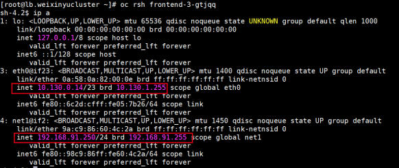

验证成功后，删除 dc：
`[root@lb.weixinyucluster ~]# oc delete -f dc.yaml`

### Macvlan 动态 IP 地址配置

通过为 macvlan 指定静态 IP 的方法，虽然在生产环境可行，但既不方便配置也不利于 pod 的弹性伸缩。接下里，我们介绍 macvlan 动态 IP 地址配置的方法。

动态 IP 的分配有两种方式：

- 配置 DHCP Server，为 macvlan 所在的 vlan 分配 IP 地址。
- 配置 IPAM：在不配置 DHCP Server 的情况下，为 macvlan 所在的 vlan 分配 IP 地址。

如果使用 DHCP Server 的配置方式，需要将 Server 配置到 OpenShift 外部。很多客户的数据中心是不允许配置 DHCP Server 的。

IPAM（IP Address Management）作为一个 CNI 插件，可在整个群集范围内分配 IP 地址。目前，我们可以使用 Whereabouts 工具实现 Kubernetes/OpenShift 集群中的 IPAM。

Whereabouts 采用一个地址范围，例如 CIDR 表示法中的 192.168.2.0/24，并将在该范围内分配 IP 地址。在这种情况下，它将分配从 `192.168.2.1` 到 `192.168.2.255` 的 IP 地址。将 IP 地址分配给 Pod 后，Whereabouts 会在该 Pod 的生命周期内跟踪数据存储区中的 IP 地址。删除 pod 后 Whereabouts 将释放地址并使其可用于后续请求。Whereabouts 优先分配范围内可用的最低值地址。还可以指定要从地址段中排除的 IP 或者范围。

从以上描述，我们可以了解到 IPAM 受 Kubernetes 的管理，更有助于 RBAC 控制和统一调度管理。因此，针对 macvlan 的 multus-cni 场景，IPAM 的模式要优于 DHCP 的模式。接下来，我们基于这种模式展开介绍。

首先安装 Whereabouts，从 github 上克隆资源：
`[root@lb.weixinyucluster ~]# git clone https://github.com/dougbtv/whereabouts && cd whereabouts`

应用 daemonset 和 ippool 的配置：
`[root@lb.weixinyucluster ~/whereabouts]# oc apply -f ./doc/daemonset-install.yaml -f ./doc/whereabouts.cni.cncf.io_ippools.yaml`

接下来，在 tomcat 项目中执行创建 IPAM 的地址段。下面配置文件定义了：附加网络名称（macvlan-conf）、物理网卡名称（ens3）、IP 地址网段（192.168.91.100-192.168.91.110/24）、etcd\_host（设置为OCP Master的VIP地址）、网关地址（192.168.91.1），如清单 4 所示：

**清单 4\. 创建附加网络**

```
#cat <<EOF | oc apply -f -
apiVersion: "k8s.cni.cncf.io/v1"
kind: NetworkAttachmentDefinition
metadata:
name: macvlan-conf
spec:
config: '{
      "cniVersion": "0.3.0",
      "name": "whereaboutsexample",
      "type": "macvlan",
      "master": "ens3",
      "mode": "bridge",
      "ipam": {
        "type": "whereabouts",
        "range": "192.168.91.100-192.168.91.110/24",
        "etcd_host": "192.168.91.8:2379",
        "log_file" : "/tmp/whereabouts.log",
        "log_level" : "debug",
        "gateway": "192.168.91.1"
      }
    }'
EOF

```

Show moreShow more icon

执行上面命令会在 OpenShift 中创建 openshift-multus 项目，并在里面创建 pod。这些 pod 以 demonset 的方式，运行在 OpenShift 的各个节点上，如下图 12 所示：

**图 12\. 确认 openshift-multus 项目中的 pod**

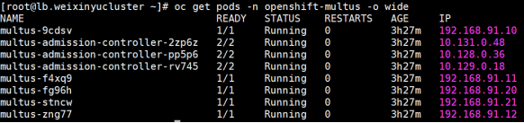

查看创建成功的附加网络定义，增加了 macvlan-conf（静态附加网络定义和动态附加网络定义可以都是以项目作为颗粒度，可以在一个项目中共存，主要不要有 IP 地址冲突）：

```
[root@lb.weixinyucluster ~]# oc get network-attachment-definitions -n tomcat
NAME              AGE
macvlan-conf      82m
macvlan-network   85m

```

Show moreShow more icon

我们查看 macvlan-conf 附加网络定义中的内容，确保与我们设定的一致：

```
[root@lb.weixinyucluster ~/whereabouts]# oc describe network-attachment-definitions macvlan-conf
Name:         macvlan-conf
Namespace:    tomcat
Labels:       <none>
Annotations:  kubectl.kubernetes.io/last-applied-configuration:
                {"apiVersion":"k8s.cni.cncf.io/v1","kind":"NetworkAttachmentDefinition","metadata":{"annotations":{},"name":"macvlan-conf","namespace":"to...
API Version:  k8s.cni.cncf.io/v1
Kind:         NetworkAttachmentDefinition
Metadata:
Creation Timestamp:  2020-05-07T12:56:30Z
Generation:          4
Resource Version:    11877983
Self Link:           /apis/k8s.cni.cncf.io/v1/namespaces/tomcat/network-attachment-definitions/macvlan-conf
UID:                 2c88440a-cc66-4e87-ba8f-eaa1364325ce
Spec:
Config:  { "cniVersion": "0.3.0", "name": "whereaboutsexample", "type": "macvlan", "master": "ens3", "mode": "bridge", "ipam": { "type": "whereabouts", "range": "192.168.91.100-192.168.91.110/24", "etcd_host": "192.168.91.8:2379", "log_file" : "/tmp/whereabouts.log", "log_level" : "debug", "gateway": "192.168.91.1" } }
Events:    <none>

```

Show moreShow more icon

接下来，我们使用 pod yaml 文件，通过注释 k8s.v1.cni.cncf.io/networks 使用 macvlan-conf 定义的附加网络，如清单 5 所示：

**清单 5\. 创建 pod 的 yaml 文件**

```
cat <<EOF | oc create -f -
apiVersion: v1
kind: Pod
metadata:
name: samplepod1
annotations:
    k8s.v1.cni.cncf.io/networks: macvlan-conf
spec:
containers:
  - name: samplepod
    command: ["/bin/bash", "-c", "sleep 2000000000000"]
    image: dougbtv/centos-network
EOF

```

Show moreShow more icon

用上述 pod yaml 的方式，再创建 4 个 pod：

```
[root@lb.weixinyucluster ~]# oc get pods
NAME                READY   STATUS      RESTARTS   AGE
samplepod1          1/1     Running     0          76m
samplepod2          1/1     Running     0          75m
samplepod3          1/1     Running     0          72m
samplepod4          1/1     Running     0          70m
samplepod5          1/1     Running     0          64m

```

Show moreShow more icon

依次查看 5 个 pod 的 macvlan IP 地址（OVS 分配 pod 的 ip 以 10.开头），确保分配置指定网段中的 IP（192.168.91.100-192.168.91.110/24）：

```
[root@lb.weixinyucluster ~/whereabouts]# oc rsh samplepod1 ip a |grep -i  192.168.91
    inet 192.168.91.100/24 brd 192.168.91.255 scope global net1
[root@lb.weixinyucluster ~/whereabouts]# oc rsh samplepod2 ip a |grep -i  192.168.91
    inet 192.168.91.101/24 brd 192.168.91.255 scope global net1
[root@lb.weixinyucluster ~/whereabouts]# oc rsh samplepod3 ip a |grep -i  192.168.91
    inet 192.168.91.102/24 brd 192.168.91.255 scope global net1
[root@lb.weixinyucluster ~/whereabouts]# oc rsh samplepod4 ip a |grep -i  192.168.91
    inet 192.168.91.103/24 brd 192.168.91.255 scope global net1
[root@lb.weixinyucluster ~/whereabouts]# oc rsh samplepod5 ip a |grep -i  192.168.91
    inet 192.168.91.104/24 brd 192.168.91.255 scope global net1

```

Show moreShow more icon

从结果中，我们观察到 pod 的 IP 地址从指定的地址池中自动、依次分配（地址从小到大分配）。

我们知道，在 PaaS 平台中，很多时候我们需要实现应用的弹性伸缩。应用的弹性伸缩借助于 pod 的弹性伸缩。接下来，我们通过 DeploymentConfig/deployments 来创建 pod（两者的注释是一样的），然后增加和减少 pod 的副本，查看 IP 的分配。

DeploymentConfig 的配置如清单 6 所示：

**清单 6\. 部署 pod 的 DeployementConfig**

```
[root@lb.weixinyucluster ~]# cat dc2.yaml
kind: "DeploymentConfig"
apiVersion: "v1"
metadata:
name: "frontend"
spec:
template:
    metadata:
      annotations:
        k8s.v1.cni.cncf.io/networks: macvlan-conf
      labels:
        name: "frontend"
    spec:
      containers:
        - name: "helloworld"
          command: ["/bin/bash", "-c", "sleep 2000000000000"]
          image: "centos/tools"
          ports:
            - containerPort: 8080
              protocol: "TCP"
replicas: 1

```

Show moreShow more icon

应用配置文件：

```
[root@lb.weixinyucluster ~]# oc apply -f dc2.yaml
deploymentconfig.apps.openshift.io/frontend created

```

Show moreShow more icon

确认 pod（frontend-1-pkvmp）创建成功：

```
[root@lb.weixinyucluster ~]# oc get pods
NAME                READY   STATUS      RESTARTS   AGE
frontend-1-deploy   0/1     Completed   0          103s
frontend-1-pkvmp    1/1     Running     0          100s
samplepod1          1/1     Running     0          105m
samplepod2          1/1     Running     0          105m
samplepod3          1/1     Running     0          105m
samplepod4          1/1     Running     0          105m
samplepod5          1/1     Running     0          104m

```

Show moreShow more icon

查看 frontend-1-pkvmp 分配的 macvlan IP 地址（192.168.91.105）属于设定的地址段（前四个 IP 已经被 samplepod 使用）:

```
[root@lb.weixinyucluster ~]# oc rsh frontend-1-pkvmp ip a |grep -i  192.168.91
inet 192.168.91.105/24 brd 192.168.91.255 scope global net1

```

Show moreShow more icon

我们增加 pod 的副本到 3：

```
[root@lb.weixinyucluster ~]# oc scale dc  frontend --replicas=3
deploymentconfig.apps.openshift.io/frontend scaled

```

Show moreShow more icon

pod 增加到了 3 个：

```
[root@lb.weixinyucluster ~]# oc get pods
NAME                READY   STATUS      RESTARTS   AGE
frontend-1-bh867    1/1     Running     0          53s
frontend-1-deploy   0/1     Completed   0          14m
frontend-1-krlgc    1/1     Running     0          53s
frontend-1-pkvmp    1/1     Running     0          14m
samplepod1          1/1     Running     0          118m
samplepod2          1/1     Running     0          118m
samplepod3          1/1     Running     0          118m
samplepod4          1/1     Running     0          117m
samplepod5          1/1     Running     0          117m

```

Show moreShow more icon

我们查看 3 个 pod 的 IP 地址：

```
[root@lb.weixinyucluster ~]# oc rsh frontend-1-pkvmp ip a |grep -i  192.168.91
    inet 192.168.91.105/24 brd 192.168.91.255 scope global net1

[root@lb.weixinyucluster ~]# oc rsh frontend-1-bh867  ip a |grep -i  192.168.91
inet 192.168.91.106/24 brd 192.168.91.255 scope global net1

[root@lb.weixinyucluster ~]# oc rsh frontend-1-krlgc ip a |grep -i  192.168.91
    inet 192.168.91.107/24 brd 192.168.91.255 scope global net1

```

Show moreShow more icon

从而我们得出结果，在 OpenShift 中 pod 弹性增加时，新增加的 pod 可以自动从设定的地址段获取到 IP 地址。

## 结束语

通过阅读本文，相信读者对在 OpenShift 上配置 macvlan 多网络平面有了较为深入的理解。随着技术的发展，会有越来越多的 SDN 符合 CNI 标准。这时候，使用多网络平面既可以保证 PaaS 本身的稳定性，又能提升容器业务网络的性能。