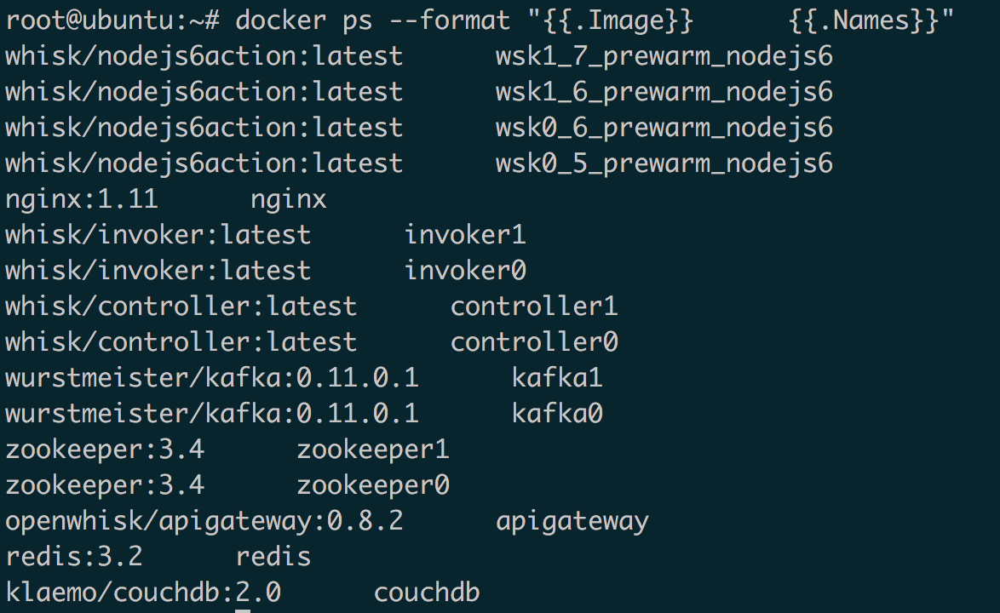
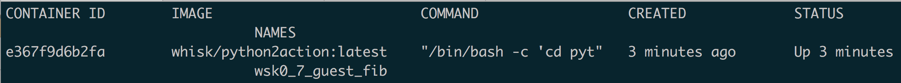
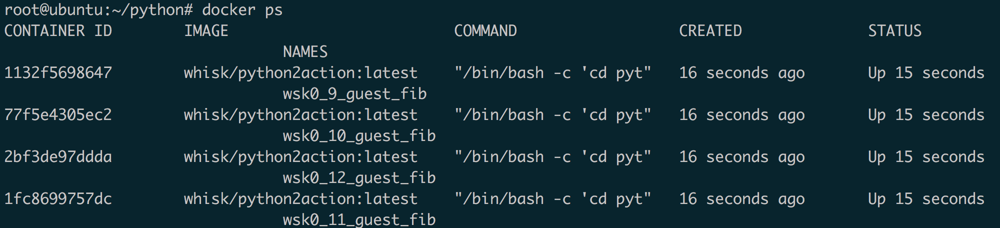

# OpenWhisk 的本地部署和应用
在运行时容器中通过执行扩展的代码响应各种事件

**标签:** 云计算

[原文链接](https://developer.ibm.com/zh/articles/cl-lo-local-deployment-and-application-of-openwhisk/)

商 荣柱

发布: 2018-09-19

* * *

## OpenWhisk 简介

OpenWhisk 是一个开源、无服务（Serverless）的云平台，可以在运行时容器中通过执行扩展的代码响应各种事件，而无需关心相关的基础设施架构。OpenWhisk 是基于云的分布式事件驱动（event-based）的编程服务。OpenWhisk 提供一种编程模型——将事件处理程序注册到云服务中——以处理各种不同的服务，可以支持数千触发器和调用，可以对不同规模的事件进行响应。

## 应用场景

OpenWhisk 有着非常广泛的应用，下面对 OpenWhisk 的应用场景做简要的介绍。

**微服务**

尽管微服务有很多的优点，基于微服务的解决方案仍然难以使用主流的云技术来构建，通常需要复杂的工具链，并且需要单独的开发和运维团队。对于一个小的团队来说，往往花费太多的时间来构建基础工具和运维操作（容错、负载均衡、自动扩展以及日志记录），尤其是当面对一种能够使用最熟悉的语言来解决的流水线型问题时有些力不从心。

OpenWhisk 的模块化和固有的可扩展的特性使其成为理想的处理琐碎逻辑的解决方案。OpenWhisk 的动作 (action) 之间是相互独立的，同时，可以用 OpenWhisk 支持的各种语言来实现并访问不同的后端系统。每一个动作 (action) 都可以独立的部署和管理并且独立于其它的动作进行扩展。OpenWhisk 通过规则、序列和命名约定的形式来公开动作之间的互联性。这对微服务架构的服务来说是个好事。

**Web APP**

尽管 OpenWhisk 最初是为基于事件的编程而设计的，但是对于面向用户的应用程序来说 OpenWhisk 有以下几个优点。比如，当你将它和 Node.js 结合时，可以在 OpenWhisk 上运行一些相对容易调试的程序。OpenWhisk 不是计算密集型，使用费用也很便宜，利用 OpenWhisk 可以构建和运行完整的网络应用程序。将无服务器 API 和静态资源（例如，HTML、JavaScript 和 CSS）相结合可以建立完整的无服务的网络应用程序。OpenWhisk 与 Node.js 或其它传统的服务运行时相比，操作非常简便是其一大优点。OpenWhisk 可以将动作生成 URL，从而直接从浏览器端访问。

**IoT**

可以使用传统的服务器架构来实现 IOT 应用，然而在很多情况下，不同的服务和数据桥 (data bridge) 的组合需要高性能和灵活性的流水线，并且跨越从 IOT 设备到云存储和分析平台。通常预先配置的桥接 (bridge) 缺乏特定的实现和精细调整的解决方案所具有的可编程特性。由于各种各样的可能的管道 (pipeline) 并且数据融合缺乏标准化，一般来说，在物联网，特别是许多其它情况下，管道需要自定义数据转换（格式转换，过滤，增强等）。OpenWhisk 是实现这种转换的一个很好的工具，以一种“无服务”的方式，其自定义逻辑被放在托管的弹性的云平台上。

物联网场景往往有固定的传感器驱动。例如，如果需要对超过特定温度的传感器做出反应，则可能触发 OpenWhisk 中的动作。物联网中交互通常是无状态的，在重大事件（自然灾害、重大天气事件、交通堵塞等）的情况下具有非常高的负载，这就需要一个弹性扩展的系统。一般情况下的工作量可能很小，但在高负载时可以很快地响应并且扩展，而无需事先通知系统。使用传统的服务器架构来构建一个系统来满足这些需求是非常困难的，因为它们往往是动力不足的，无法灵活地处理流量高峰。

**API 后端**

无服务器计算平台为开发人员提供了一种可以快速构建无服务器的 API 的方法。OpenWhisk 支持自动为动作 (action) 生成 REST API 的操作，并且很容易将您选择的 API 管理工具（例如 IBM Connect）连接到 OpenWhisk 提供的这些 REST API 上面。

**Mobile 后端**

许多的应用都需要服务器端处理。对于那些不想处理服务端处理逻辑的移动开发人员来说，他们更愿意把注意力放在运行在设备或浏览器上的 APP 开发，这时使用 OpenWhisk 就是一种很好的选择。此外，OpenWhisk 内置的 Swift 支持使得开发人员能够重用现有的 IOS 编程技巧。移动应用程序通常具有不可预知的负载模式，已有的 OpenWhisk 解决方案（例如 [IBM Cloud Functions](https://cloud.ibm.com/functions?cm_sp=ibmdev-_-developer-articles-_-cloudreg) ）可以动态扩展来满足需求,而不需要提前添加新的资源来满足需求。

**数据处理**

随着现代可用数据的增加，应用程序开发需要处理新数据的能力。这种要求包括处理结构化的数据以及非结构化的文档、图像或视频数据。想要修改 OpenWhisk 可以通过系统提供或自定义 feeds 来配置 OpenWhisk，以对数据的变化作出反应，并自动地对传入的数据 feeds 执行动作。动作可以被编程为处理更改、转换数据格式、发送和接收消息、调用其他动作、更新各种数据存储（包括基于 SQL 的关系数据库）、内存数据网格、NoSQL 数据库、文件、消息代理和各种其他系统。OpenWhisk 的规则和序列提供了灵活性，可以在不需要编程的情况下对 pipeline 进行更改，只需通过更改配置即可。这使得基于 OpenWhisk 的系统非常灵活和易于适应不断变化的需求。

**免费试用 IBM Cloud**

利用 [IBM Cloud Lite](https://cocl.us/IBM_CLOUD_GCG) 快速轻松地构建您的下一个应用程序。您的免费帐户从不过期，而且您会获得 256 MB 的 Cloud Foundry 运行时内存和包含 Kubernetes 集群的 2 GB 存储空间。

**Cognitive**

认知技术可以有效地结合 OpenWhisk 来创建强大的应用程序。例如，IBM Alchemy API 和 [Watson 视觉识别](https://cloud.ibm.com/catalog/services/visual-recognition?cm_sp=ibmdev-_-developer-articles-_-cloudreg) 可以结合 OpenWhisk 一起使用以自动从视频中提取有用信息。

## 准备安装环境

本文使用 Apache 提供在 github 上的 [incubator-openwhisk](https://github.com/apache/incubator-openwhisk) 进行安装。接下来我们将使用 VirtualBox 将 OpenWhisk 安装到一台虚拟机中，当然您也可以装到物理机中。选用的操作系统是 Ubuntu14.04。安装开始之前需要安装一些准备软件。

##### 清单 1\. 安装相关软件以及克隆 OpenWhisk repo 到本地

```
# 安装 git
sudo apt-get install git -y

# 克隆 repo 到本地目录
git clone https://github.com/apache/incubator-openwhisk.git openwhisk

# 切换到 openwhisk 目录
cd openwhisk

# Openwhisk 是由 Scala 开发，运行需要安装 Java 环境，下面的脚本实现了 java 环境的安装，以及其它的所需要的软件，运行脚本
(cd tools/ubuntu-setup && ./all.sh)

```

Show moreShow more icon

## 修改 OpenWhisk 的默认配置

OpenWhisk 使用 ansible 进行部署，环境变量定义在 “ansible/environments/group\_vars/all” 下面。

默认值如下：

##### 清单 2\. OpenWhisk 的默认值

```
limits:
invocationsPerMinute: "{{ limit_invocations_per_minute | default(60) }}"
concurrentInvocations: "{{ limit_invocations_concurrent | default(30) }}"
concurrentInvocationsSystem:  "{{ limit_invocations_concurrent_system | default(5000) }}"
firesPerMinute: "{{ limit_fires_per_minute | default(60) }}"
sequenceMaxLength: "{{ limit_sequence_max_length | default(50) }}"

```

Show moreShow more icon

上面的值定义了 OpenWhisk 在系统中的限制，分别为：

- 第 2 行表示同一个 Namespace 每分钟的调用 action 数量，
- 第 3 行表示同一个 Namespace 的并发调用数量，
- 第 4 行表示系统中所有 Namespace 的并发调用数量，
- 第 5 行表示同一 Namespace 中每分钟调用 trigger 的数量，
- 第 6 行表示 Action 的最大序列长度。

如果想要修改上述的任何变量， 把修改后的值添加到文件 “ansible/environments/local/group\_vars/all” 的末尾。比如，要修改每秒限制的请求为 120，可以将 limit\_invocations\_per\_minute: 120 添加到文件的末尾。每秒钟的请求数就改成了 120。

## 为 OpenWhisk 选用一个数据库存储

在进行部署之前，您必须为先为 OpenWhisk 配置一个持久存储的数据库。OpenWhisk 支持 CouchDB 或基于云的 Cloudant。CouchDB 是一个开源的 json 数据库，用于存储系统的状态。本文选用 CouchDB。

### 安装 CouchDB

下面的步骤应该在每一个环境中只执行一次，执行的过程中会跟据本地的配置自动生成配置文件。如果是在本地执行则不需要指定目标环境。当 setup.yml 运行完以后，在本地的目录下就可以看到一个 ansible/db\_local.ini 的文件。这个文件中的设定可以用来启动一个临时的 CouchDB。想要更改设置的话可以直接修改 db\_local.ini 文件。

如果要创建一个持久存储的话，也可以使用环境变量。使用如下：

#### 环境变量

```
export OW_DB=CouchDB
export OW_DB_USERNAME=root
export OW_DB_PASSWORD=PASSWORD
export OW_DB_PROTOCOL=http
export OW_DB_HOST=172.17.0.1
export OW_DB_PORT=5984
# 运行以下脚本 准备 ansible 配置
# ansible-playbook -i environments/local/ setup.yml

```

Show moreShow more icon

## 使用 CouchDB 部署 OpenWhisk

确保本地已经有了 db\_local.ini 并配置完毕。接下来执行部署命令：

```
# cd <openwhisk_home>
# ./gradlew distDocker
# cd ansible
# ansible-playbook -i environments/local/ couchdb.yml
# ansible-playbook -i environments/local/ initdb.yml
# ansible-playbook -i environments/local/ wipe.yml
# ansible-playbook -i environments/local/ apigateway.yml
# ansible-playbook -i environments/local/ openwhisk.yml
# ansible-playbook -i environments/local/ postdeploy.yml

```

Show moreShow more icon

**注意** ：ansible-platbook 可以使用 -i 选项来指定目标环境，比如指定为本地 -I environment/local。

每次重新部署一个全新的 CouchDB 都要运行一遍 initdb.yml 以初始化 CouchDB。wipe.yml 和 postdeploy.yml，这两个脚本只能在部署的第一次署时运行，否则，OpenWhisk 中的保存的动作 action 和 activations 都会丢失。

部署成功后，OpenWhisk 会在系统中启动几个 docker 容器。可以通过 `docker ps` 来查看，如下所示：



## 配置命令行工具

OpenWhisk 提供了一个统一的命令行接口 wsk。生成的 wsk 在 openwhisk/bin 下。将 wsk 移到 `/usr/local/bin` 目录下。

```
# ln -T ~/openwhisk/bin/wsk /usr/local/bin/wsk

```

Show moreShow more icon

有两个属性需要配置：

- API host 部署 OpenWhisk 的主机名或 IP 地址
- Authorization key 用户名或密码用来授权操作 OpenWhisk 的 API。

设置 API host，在单机配置中的 IP 应该为 172.17.0.1。

```
wsk property set –apihost 172.17.0.1

```

Show moreShow more icon

设置 key。

```
wsk property set --auth `cat ansible/files/auth.guest`

```

Show moreShow more icon

**注意** ：如果使用的是自签名认证（self-signed SSL certificate）,可以使用—insecure 来跳过认证。

OpenWhisk 将 CLI 的配置信息存储在~/.wskprops 中。这个文件的位置也可以通过环境变量 WSK\_CONFIG\_FILE 来指定。

#### 验证 CLI

```
wsk action invoke /whisk.system/utils/echo –p message hello –result
{
    "message": "hello"
}

```

Show moreShow more icon

## 创建简单的动作 (action)

代码如下：

##### 清单 3\. 使用 python 计算斐波那契数列

```
def main(args):
num = args.get("number", "30")
return {"fibonacci": F(int(num))}
def F(n):
if n == 0:  return 0
elif n == 1:  return 1
else:  return F(n-1)+F(n-2)

```

Show moreShow more icon

#### 创建动作

```
wsk –i action create fib fib.py

```

Show moreShow more icon

#### 触发动作

```
wsk -i action invoke fib --result --blocking --param nember 20
{
    "fibonacci": 832040
}

```

Show moreShow more icon

## 验证 OpenWhisk 的自动伸缩特性 (Autoscale)

我们使用上面的计算斐波那契数列的程序来创建一个 web 请求，使用工具来验证 OpenWhisk 的性能。

#### 创建 action

```
wsk action create fib fib.py –web true

```

Show moreShow more icon

#### 创建 web 请求

```
wsk -i api create /default /fib get fib
ok: created API /default/fib GET for action /_/fib
http://172.17.0.1:9001/api/23bc46b1-71f6-4ed5-8c54-816aa4f8c502/default/fib

```

Show moreShow more icon

#### 查看创建的 api 列表

```
wsk -i api list
ok: APIs

```

Show moreShow more icon

ActionVerbAPI NameURL/guest/fibget/default[http://172.17.0.1:9001/api/23bc46b1-71f6-4ed5-8c54-816aa4f8c502/default/fib](http://172.17.0.1:9001/api/23bc46b1-71f6-4ed5-8c54-816aa4f8c502/default/fib)

上述命令运行完以后可以看到 OpenWhisk 启动了一个 container 来处理。



接下来我们一次运行多个请求，在这里我使用 [wrk](https://github.com/wg/wrk) ，它可以同时发出多个请求。使用 wrk 同时发出 10 个请求。

```
wrk –c 10 –d 10 http://172.17.0.1:9001/api/23bc46b1-71f6-4ed5-8c54-816aa4f8c502/default/fib

```

Show moreShow more icon

使用 `docker ps` 查看现在的 container 的数量。



从上面可以看出，在请求多的时候 OpenWhisk 也会创建更多的 container 来处理请求。由于单机的限制，OpenWhisk 创建的 container 也是有上限的。这里的限制数据是 4 个，在实际的应用中可以根据自己的情况设置或者配置一个多机集群。

## 结束语

OpenWhisk 作为一个无服务（Serverless）计算平台，使用起来非常的便利。开发人员无需关注平台，只需要将精力放在代码本身。OpenWhisk 通过自动申缩（AutoScale）功能可以很好的解决性能瓶颈。

## 参考资源

- 参考 [incubator-openwhisk](https://github.com/apache/incubator-openwhisk)，查看 OpenWhisk 的开源实现。
- 查看文章 [OpenWhisk: 轻松创建微服务](https://www.ibm.com/developerworks/cn/opensource/os-introducing-openwhisk-microservices-made-easy/)，更好的了解微服务的应用与实例。