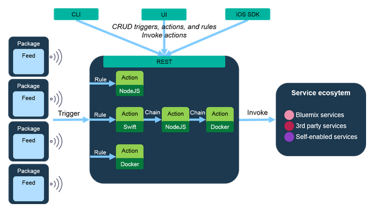
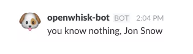
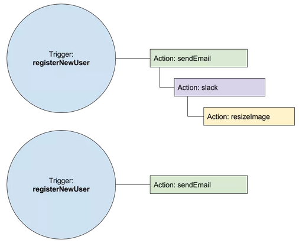

# OpenWhisk 简介：轻松创建微服务
OpenWhisk 是一个开源的、事件驱动的计算平台

**标签:** 云计算,微服务,数据库,消息传递

[原文链接](https://developer.ibm.com/zh/articles/os-introducing-openwhisk-microservices-made-easy/)

Glynn Bird

发布: 2016-07-12

* * *

## 简介

在之前的文章中，我介绍了一种使用队列、发布订阅通道或消息中心来安排”工作”列表的微服务架构。每个工作项都是一个将以某种方式进行处理、保存或操作的数据块——通常是一个 JSON 文档。我使用 Redis、RabbitMQ 或 Apache Kafka 创建了度量指标收集器微服务，用于从移动或 Web 应用程序收集 Web 度量指标数据，并将其写入一个队列或发布订阅通道。另一个度量指标收集器存储微服务使用了收集的数据，并将其写入可供选择的 Cloudant、MongoDB 或 ElasticSearch 中。然后，我介绍了如何添加其他微服务，以便在传入数据时聚合流数据。幸运的是，Compose.io 支持部署 Redis、RabbiMQ、MongoDB 或 ElasticSearch，而且 IBM 以服务的形式提供了 Cloudant 和 Apache Kafka，所以使用它们很容易上手，但也存在许多不断变化的部分。

今天，我将使用一个新服务 OpenWhisk，它简化了微服务的部署，消除了管理自己的消息代理或部署自己的工作服务器的需求。



OpenWhisk 是一个开源的、事件驱动的计算平台。您可以将您的操作代码发送给 OpenWhisk，然后提供 OpenWhisk 代码要处理的数据流。OpenWhisk 负责处理计算资源的扩展，这些资源是处理工作负载所需要的；您只需要处理操作代码以及触发这些操作的数据。您只需为已完成的工作量付费，无需为等待工作的空闲服务器付费。

您可以在 JavaScript 或 Swift 中编写操作代码。这意味着 Web 开发人员和 iOS 开发人员可使用相同的语言创建服务器端代码和前端代码。

## 准备开始

本文中提供的代码段和执行的命令行调用假设您已经注册参加了 [IBM Cloud](https://cloud.ibm.com?cm_sp=ibmdev-_-developer-articles-_-cloudreg) (原名 Bluemix) 中的 OpenWhisk beta 计划 (现已更名为 IBM Cloud Functions，基于 Apache OpenWhisk)，而且已安装了 “wsk”命令行工具。请访问 [https://www.ibm.com/cloud/functions](https://www.ibm.com/cloud/functions) 。

## Hello World

我们创建一个名为 ‘hello.js’ 的 JavaScript 文件，其中包含一个函数，该函数返回了一个简单对象：

```
function main() {
return {payload:'Hello world'};
}

```

Show moreShow more icon

这是最简单的 OpenWhisk 操作；它仅返回一个静态字符串作为有效负载。使用以下命令将该操作部署到 OpenWhisk：

```
> wsk action create hello hello.js
ok: created action hello

```

Show moreShow more icon

这将创建一个名为”hello”的操作来运行 hello.js 中发现的代码。我们可以使用以下命令在云中运行它：

```
> wsk action invoke --blocking hello
{
"payload":"Hello world"
}

```

Show moreShow more icon

我们还可以让我们的代码要求输入一些参数：

```
function main(params) {
return {payload:'Hello, ' + params.name + ' from ' + params.place};
}

```

Show moreShow more icon

然后更新我们的操作：

```
> wsk action update hello hello.js
ok: created updated hello

```

Show moreShow more icon

使用参数来运行我们的代码：

```
> wsk action invoke --blocking --result hello --param name 'Jennie' --param place 'The Block'
{
"payload":"Hello, Jennie from The Block"
}

```

Show moreShow more icon

我们创建了一个简单的 JavaScript 函数来处理一些数据，无需担心队列、工作人员或任何网络基础架构，我们能够在 OpenWhisk 平台上执行此代码。

## 用我们的操作做些有益的事情

我们可以在操作中执行更复杂的事情，比如执行 API 调用。我创建了下面这个操作，它将调用一个简单搜索服务实例（该实例包含《权力的游戏》的数据），并传入 q 参数：

```
var request = require('request');

function main(msg) {
var q = msg.q || 'Jon Snow';
var opts = {
method:'get',
url:'https://sss-got.mybluemix.net/search',
qs:{
q: q,
limit:5
},
json:true
}
request(opts, function(error, response, body) {
whisk.done({msg: body});
});

return whisk.async();
}

```

Show moreShow more icon

我们可以创建此操作并为其提供一个不同的名称：

```
> wsk action create gameofthrones gameofthrones.js
ok: created action gameofthrones

```

Show moreShow more icon

然后使用参数 q 调用它；

```
> wsk action invoke --blocking --result gameofthrones --param q 'melisandre'
{
"msg":{
"_ts":1460028600363、
"bookmark":"g2wAAAABaANkAChkYmNvcmVAZGI0LmJtLWRhbC1zdGFuZGFyZDEuY2xvdWRhbnQubmV0bAAAAAJuBAAAAACAbgQA____n2poAkY_7PVPoAAAAGHlag",
"counts":{
"culture":{
"Asshai":1
},
"gender":{
"Female":1
}
},
"from_cache":true,
"rows":[
{
"_id":"characters:743",
"_order":[
0.9049451947212219,
229
],
"_rev":"1-c68720782e2500311125768153d7170b",
"aliases":[
"The Red Priestess",
"The Red Woman",
"The King's Red Shadow",
"Lady Red",
"Lot Seven"
],
"allegiances":[
"”
],
"books":[
"A Clash of Kings",
"A Storm of Swords",
"A Feast for Crows"
],
"born":"At\ufffd\ufffdUnknown",
"culture":"Asshai",
"died":"",
"father":"",
"gender":"Female",
"mother":"",
"name":"Melisandre",
"playedBy":"Carice van Houten",
"povBooks":"A Dance with Dragons",
"spouse":"",
"titles":[
"”
],
"tvSeries":"Season 2,Season 3,Season 4,Season 5"
}
],
"total_rows":1
}
}

```

Show moreShow more icon

## 将数据从 OpenWhisk 写入 Slack

我们可在 OpenWhisk 操作中执行的另一项任务是在 Slack 中发布一条消息。Slack 有一个不错的 API 可以创建自定义集成：Slack 管理员可设置一个”传入 webhook”，所以只需通过 POST 请求将字符串发送到 HTTP 端点，即可将它发布到一个通道。我们可以使用几行代码创建一个 Slack 发布操作：

```
var request = require('request');

function main(msg) {
var text = msg.text || 'This is the body text';
var opts = {
method:'post',
url:'MY_CUSTOM_SLACK_WEBHOOK_URL',
form:{
payload:JSON.stringify({text:text})
},
json:true
}
request(opts, function(error, response, body) {
whisk.done({msg: body});
});

return whisk.async();
}

```

Show moreShow more icon

将 MY\_CUSTOM\_SLACK\_WEBHOOK\_URL 替换为 Slack 在创建”Incoming Webhook” 集成时创建的 Webhook URL。请注意，此操作是异步执行的，仅在请求完成时收回。

然后我们可以像平常一样部署和运行它：

```
> wsk action create slack slack.js
ok: created action slack

```

Show moreShow more icon

```
> wsk action invoke --blocking --result slack --param text
'you know nothing, Jon Snow'

```

Show moreShow more icon

```
{
"msg":"ok"
}

```

Show moreShow more icon



碰巧的是，Whisk 有一个内置的 Slack 集成，但您自己动手构建一个也不错，不是吗？然后，您可以执行自己的逻辑，根据传入的数据来决定是否发布 Slack 消息。

## 将数据从 OpenWhisk 写入 Cloudant

将您自己的自定义操作写入 Cloudant 相对比较简单，因为您可以：

- 在 JavaScript 操作中’要求’Cloudant Node.js 库
- 使用 Cloudant 的 HTTP API 将数据写入 Cloudant

此方法的缺点是，您需要将 Cloudant 凭证硬编码到操作代码中，就像我们在上一个示例中硬编码 Slack Webhook URL 一样，这不是最佳实践。

幸运的是，OpenWhisk 有一个预先构建的 Cloudant 集成，您无需使用任何自定义代码即可调用它。如果已经有一个 Cloudant 帐户，您可以使用以下命令行授予 Cloudant 服务的访问权：

```
> wsk package bind /whisk.system/cloudant myCloudant -p
username 'myusername' -p password 'mypassword' -p host
'mydomainname.cloudant.com'

```

Show moreShow more icon

然后您可以查看 OpenWhisk 可以交互的连接列表：

```
> wsk package list
packages
/me@uk.ibm.com_dev/myCloudant private binding

```

Show moreShow more icon

其中的 me@uk.ibm.com 是我的 IBM Cloud 用户名（或您的 IBM Cloud 组织的名称），dev 是您的 IBM Cloud 空间。

您可以调用该包的 write 命令来将数据写入 Cloudant：

```
> wsk action invoke /me@uk.ibm.com_dev/myCloudant/
                write --blocking --result --param dbname testdb --param doc '{"name":"George Friend"}'
{
"id":"656eaeaed0fd47aa733dd41c3c79a7a0",
"ok":true,
"rev":"1-a7720095a32c4d1b994ce5e31fe8c73e"
}

```

Show moreShow more icon

## 休息一下

目前为止，我们创建并更新了 OpenWhisk 操作，还触发了各个操作作为一组命令执行任务。’wsk’ 工具允许您触发一些操作，在后台运行它们，还允许将操作链接起来形成序列，但我们不打算在本文中介绍这些内容。

我们的代码是简单的 JavaScript 代码块，其中仅调用了”main” 函数。这意味着我们可以使用普通的自动化测试和持续集成工具来测试我们的代码。部署代码只需要一条命令行语句；无需担心服务器、操作系统或网络硬件。

OpenWhisk 是一个事件驱动的系统。您已经了解了通过手动部署代码来创建事件。但我们如何设置 OpenWhisk 来处理事件流呢？

## OpenWhisk 触发器

OpenWhisk 中的触发器是触发事件和执行代码的另一种方式。我们可以创建许多指定的触发器，然后创建一些规则来定义要针对哪些触发器执行哪些操作（代码）。无需直接调用操作，我们将调用触发器；针对这些触发器而定义的规则会决定要执行哪些操作。这使我们能够将操作链接在一起，让一个触发器能够触发多个操作的执行，还可以通过将同一操作代码分配给多个触发器来重用代码。



触发器可单独触发，或者与外部提要相关联，比如：

- 来自 Cloudant 数据库的更改提要——每次添加、更新或删除一个文档时，都会触发一个触发器
- Github 存储库的提交提要——每次发生提交时，都会触发一个触发器

所以我们可以使用 Cloudant 数据库来触发一个触发器，以便将一些数据写入 Slack：

```
> wsk trigger create myCloudantTrigger --feed /me@uk.ibm.com_dev/
                        myCloudant/changes --param dbname mydb --param includeDocs true

```

Show moreShow more icon

然后配置该触发器来触发我们的 Slack 发布操作：

```
> wsk rule create --enable myRule myCloudantTrigger
slack

```

Show moreShow more icon

现在，每次在 Cloudant 数据库中添加、更新或删除文档时，就会触发我的自定义操作，该操作在本例中会将一条消息发布到 Slack！

## OpenWhisk 有哪些用途？

OpenWhisk 适用于您不希望管理任何基础架构的项目。您只需为已完成的工作付费，不会将金钱浪费在空闲的服务器上。OpenWhisk 很容易管理活动峰值，因为它可以外扩来满足该需求。

将 OpenWhisk 与其他”即服务”数据库结合使用，比如 Cloudant，这样您就不必管理任何数据存储基础架构。构建 Cloudant 是为了存储大型数据集，应对高并发性速率，并提供高可用性。

由于运行 OpenWhisk 操作需要资源，所以最好使用 OpenWhisk 执行以下不是很频繁的计算任务，比如：

- 处理上传的图像来创建缩略图，将它们保存到对象存储
- 从移动应用程序获取地理位置数据，并调用 Weather API 来扩充它

OpenWhisk 对处理具有很高的并发性水平的系统也很有用，比如：

- 将数据发送到云的移动应用程序
- 物联网部署，其中需要存储和处理传入的传感器数据

还有一些 OpenWhisk 特性我没有介绍到，比如 Swift 支持，能够使用 Docker 容器作为操作代码而不是上传源代码，以及移动软件开发工具包。