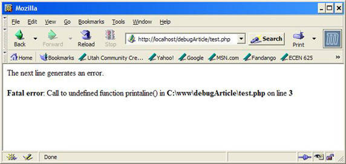
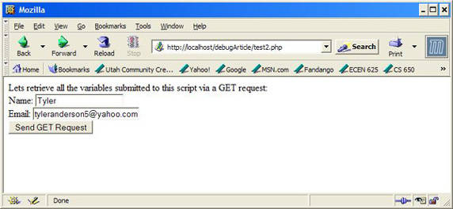
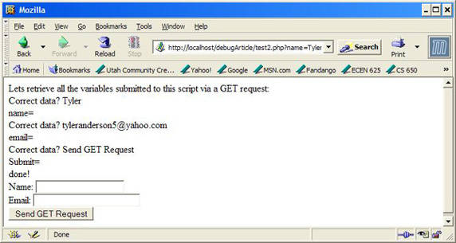
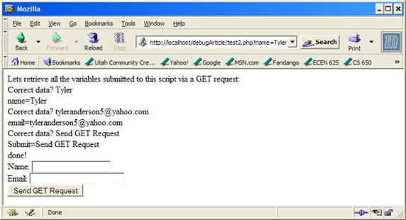
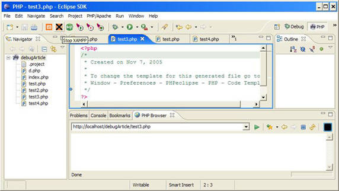
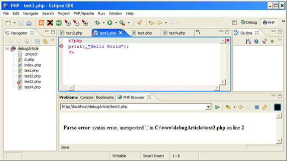
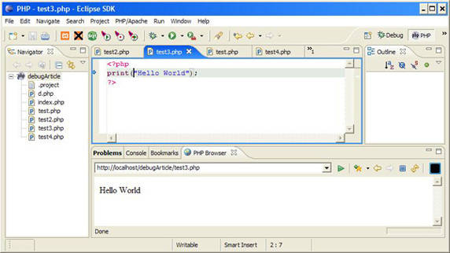
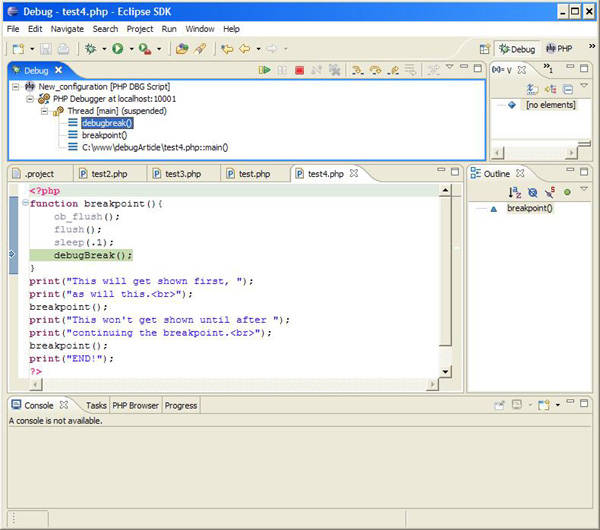
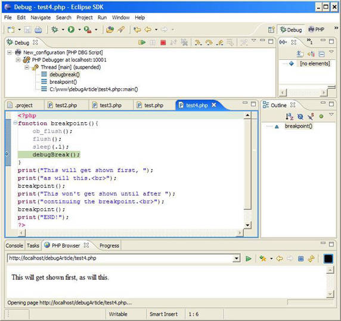

# PHP 程序员的调试技术
使用 print 语句、错误报告和 PHPEclipse 插件

**标签:** PHP,Web 开发

[原文链接](https://developer.ibm.com/zh/articles/os-debug/)

Tyler Anderson

发布: 2006-01-23

* * *

## 简介

有许多 PHP 调试技术可以在编码的时候节约大量时间。一个有效却很基本的调试技术就是打开错误报告。另一个略微高级一点的技术包括使用 print 语句，通过显示在屏幕上实际出现的内容，有助于精确地找出更难发现的 bug。PHPEclipse 是一个 Eclipse 插件，能够强调常见的语法错误，可以与调试器结合起来用于设置断点。

## 设置

要学习本文描述的概念，需要 PHP、Web 服务器和 Eclipse。调试器扩展支持的 PHP 版本是 V5.0.3。

我们需要一个 Web 服务器来解析用 PHP 创建的页面并把它们显示到浏览器。本文中使用的是 Apache2。但是，任何 Web 服务器都可以满足要求。

要利用本文中介绍的一些调试技术，需要安装 Eclipse V3.1.1 和插件 PHPEclipse V1.1.8。由于 Eclipse 要求 Java™ 技术，所以还要下载它。

还需要 PHP 的调试器扩展模块。安装它略有些麻烦。请仔细跟随安装调试器扩展的操作说明。现在，先在 php.ini 文件中注释掉那些要求装入和配置 PHP 扩展的行。在需要使用调试器的时候，再取消注释。

请参阅参考资源获得下载信息。现在介绍出错消息。

## 出错消息

出错消息是作为开发人员的第一道防线。谁都不想在一台没有配置成显示出错消息的服务器上用 PHP 开发代码。但是，请记住，当代码调试完成，准备运行的时候，应当确保关闭了错误报告，因为不希望站点的访问者看到出错消息，因为这会给他们提供足够的信息来利用站点的弱点并黑掉站点。

也可以用出错消息为自己服务，因为它们会显示抛出或生成错误的正确代码行。这样，调试就变成在浏览器上查看生成的错误所显示的行号，并在代码中检查这一行。稍后，将会看到 PHPEclipse 插件通过即时地给语法错误加下划线并在保存文件时用红色 “x” 标注语法错误，可在开发和调试过程中提供极大的帮助。

先来看如何在 php.ini 文件中开启错误报告并设置错误报告的级别。然后将学习如何在 Apache 的配置文件中覆盖这些设置。

### PHP 的错误报告

php.ini 文件中有许多配置设置。您应当已经设置好自己的 php.ini 文件并把它放在合适的目录中，就像在 Linux 上安装 PHP 和 Apache 2 的文档说明中所示的那样（请参阅 参考资料 ）。在调试 PHP 应用程序时，应当知道两个配置变量。下面是这两个变量及其默认值：

```
display_errors = Off
error_reporting = E_ALL

```

Show moreShow more icon

通过在 php.ini 文件中搜索它们，可以发现这两个变量当前的默认值。`display_errors` 变量的目的很明显 —— 它告诉 PHP 是否显示错误。默认值是 `Off` 。但是，要让开发过程更加轻松，请把这个值设为 `On` ：

```
display_errors = On

```

Show moreShow more icon

`error_reporting` 变量的默认值是 `E_ALL` 。这个设置会显示从不良编码实践到无害提示到出错的所有信息。 `E_ALL` 对于开发过程来说有点太细，因为它在屏幕上为一些小事（例如变量未初始化）也显示提示，会搞糟浏览器的输出。我只想看到错误和不良编码实践，但是不想看到无害的提示。所以，请用以下值代替 `error_reporting` 的默认值：

```
error_reporting = E_ALL & ~E_NOTICE

```

Show moreShow more icon

重新启动 Apache，就全部设置好了。接下来，将学习如何在 Apache 上做同样的事。

### 服务器上的错误报告

依赖于 Apache 正在做的工作，在 PHP 中打开错误报告可能没法工作，因为在计算机上可能有多个 PHP 版本。有时很难区分 Apache 正在使用哪个 PHP 版本，因为 Apache 只能查看一个 php.ini 文件。不知道 Apache 正在使用哪个 php.ini 文件配置自己是一个安全问题。但是，有一种方法可以在 Apache 中配置 PHP 变量，从而保证设置了正确的出错级别。

而且，最好知道如何在服务器端设置这些配置变量，以否决或抢占 php.ini 文件，从而提供更高级别的安全性。

在配置 Apache 时，应该已经接触过 /conf/httpd.conf 中 http.conf 文件中的基本配置。

要做在 php.ini 文件中已经做过的事，请把下列各行添加到 httpd.conf，覆盖任何 php.ini 文件：

```
php_flag  display_errors        on
php_value error_reporting       2039

```

Show moreShow more icon

这会覆盖在 php.ini 文件中为 `display_errors` 已经设置的标志，以及 `error_reporting` 的值。值 `2039` 代表 `E_ALL & ~E_NOTICE` 。如果愿意采用 `E_ALL` ，请把值设为 `2047` 。同样，还是要重启 Apache。

接下来，要在服务器上测试错误报告。

### 测试错误报告

如果启动了错误报告，会节约许多时间。PHP 中的错误会指向代码中的错误。请创建一个简单的 PHP 文件 test.php，并像清单 1 所示一样定义它。

##### 清单 1\. 一个生成错误的简单 PHP

```
<?php
print("The next line generates an error.<br>");
printaline("PLEASE?");
print("This will not be displayed due to the above error.");
?>

```

Show moreShow more icon

第一个 `print()` 语句会向 Web 浏览器显示它的内容。但是第二个语句会生成错误并在 Web 页面上显示。这造成最后一个 `print()` 语句不起作用，如图 1 所示。

##### 图 1\. 生成错误



现在开启了错误报告！接下来，用 print 语句帮助调试应用程序。

## 介绍 print 语句

因为应用程序中的功能性 bug 不会产生错误，所以在所有调试策略中，关于如何正确地放置和使用 `print` 或 `die` 语句来调试 PHP 应用程序的知识是一种很好的资产。可以用 `print` 语句在代码中缩小对问题语句的定位，这些语句在语法上没有错误，也不是 bug，但是从代码的功能上看是 bug。这些是最难发现和调试的 bug，因为它们不会抛出错误。惟一知道的就是在浏览器上显示的内容不是想要的内容，或者想要保存在数据库中的内容根本没有保存。

假设正在处理通过 `GET` 请求发送过来的表单数据，想向浏览器显示信息，但是出于某种原因，数据没有正确地提交，或者不能正确地从 `GET` 请求中读出。要调试这类问题，重要的是用 `print()` 或 `die()` 语句知道变量的值是什么。

`die()` 语句会中止程序执行，并在 Web 浏览器上显示文本。如果不想注释掉代码，而且只想显示到出错之前的信息和出错信息，不想显示后面的信息，那么 `die()` 语句特别有用。

让我们在 PHP 中用 print 语句来测试这个概念

### 使用 print 语句进行调试

在我作程序员的那些时候，当我在 Linux® 上开发应用程序时，没有方便的 GUI 可以告诉我 bug 在哪，我迅速地发现我在程序中放的 print 语句越多，我在应用程序中把 bug 的范围缩小到一行的机会越大。请创建另一个 PHP 文件 test2.php，并像清单 2 所示的那样定义它。

##### 清单 2\. 显示通过 GET 提交的所有变量

```
<?php
$j = "";
print("Lets retrieve all the variables submitted to this ");
print("script via a GET request:<br>");
foreach($_GET as $key => $i){
     print("$key=$j<br>");
}
if($_GET['Submit'] == "Send GET Request")
     $j = "done!<br>";
?>
<form method="GET">
     Name: <input name="name"><br>
     Email: <input name="email" size="25"><br>
     <input name="Submit" type="submit" value="Send GET Request">
</form>

```

Show moreShow more icon

您可能会非常容易地发现清单 2 中的 bug！您很棒！但请注意这是一个非常简单的脚本，只是作为使用 print 语句进行调试而展示的一个例子而已。这个脚本只是提取 `GET` 请求中的所有变量，如果有，就把它们显示在浏览器上。还提供了一个表单，用 `GET` 请求向服务器发送变量以进行测试。请看输出，如图 2 所示。

##### 图 2\. test2.php 的输出



现在单击 **Send GET Request** 按钮，请注意只有 `$_GET` 请求的键显示在浏览器上，而正确的值都没显示。可以在循环中放一个 print 语句，检验在 `foreach` 循环中每个元素中是否确实存在数据。请参阅清单 3。

##### 清单 3\. 用 print 语句验证代码的功能

```
...
foreach($_GET as $key => $i){
     print("Correct data? " . $_GET[$key] . "<br>");
     print("$key=$j<br>");
}
...

```

Show moreShow more icon

放进去的 print 语句是粗体。注意，现在已经知道在 Web 浏览器上显示的 `$key` 值是正确的，但是由于某些原因，值没有正确地显示。请看新的输出，如图 3 所示。

##### 图 3\. 修改后的 test2.php 的输出



现在已经知道应用程序正确地从 `GET` 请求接收到了变量，那么肯定是在代码中有 bug。查看之后注意到，用来显示值的变量 `$j` 是错误的。在 `foreach` 语句中指定的是 `$i` ，所以它肯定会有正确的值，但是无意之中输入了 `$j` 。所以通过把 `$j` 替换成 `$i` ，迅速地修正了错误，重新载入页面之后，就看到了正确的输出，如图 4 所示。

##### 图 4\. 修正后的 test2.php 的输出



现在可以删除或注释掉刚才添加的 print 语句了，因为已经发现了代码中的 bug。注意，这只是在调试应用程序时可能遇到的许多错误中的一个很小的子集。对于使用数据库时可能遇到的问题，一个好的解决方案是输出 SQL 语句，以确保执行的 SQL 就是想要执行的。

现在要来看看如何使用 Eclipse IDE 和 PHPEclipse 插件及调试器扩展进一步在调试历程中提供帮助。

## 使用 PHPEclipse

您可能用过 Eclipse，但是可能不熟悉它。请参阅 参考资料 获得 Eclipse 平台的介绍。

用于 Eclipse 的 PHPEclipse 插件是用来开发 PHP 应用程序的一个流行工具。请启动 Eclipse 并把工作区目录指定为 Apache 的 www 目录（在我的机器上是 c:\\www）。现在单击 **File > New > Project** 。会弹出 New Project 向导。双击 PHP 文件夹并选择 PHP Project。单击 **Next** ，输入项目名称 debugArticle，并单击 **Finish** 。

如果把 Web 服务器设置为在端口 80 上侦听，那么不需要做任何修改。否则，请转到 Navigator 窗口，在 PHP 项目 **debugArticle** 上右击，选择 Properties，然后单击 **PHP Project Settings** 。单击 **Configure Workspace Settings** 然后修改合适的 localhost 或者添加 Web 服务器侦听的端口（例如 `http://localhost:8080`）。单击 **Apply** 完成设置。

Navigator 窗口应当显示项目和一个 .project 文件。在项目上右击，就像前面做的那样，只是这次选择 **New > PHP File** 。用想要创建的 PHP 文件的名称 test3.php 替换 `*.php`，然后单击 **Finish** 。在 Eclipse IDE 中应当出现一个新文件。可能需要导航到窗口底部的 PHP 浏览器来查看 PHP 文件的当前输出（参见图 5）。

##### 图 5\. Eclipse 的 PHPEclipse 插件



注意，只有 Windows® 的用户可以像清单 5 所示的那样使用 PHP 浏览器。通过打开独立浏览器窗口并把浏览器指向测试脚本所在目录，也可以使用同样的功能。

现在来演示这个应用程序，证明它的强大能力。

在 “使用调试器” 一节中，将学习如何用 Eclipse、PHPEclipse 和前面下载的调试器 PHP 扩展来调试 PHP 应用程序。先从学习如何使用它的语法解析功能开始。

### 语法解析和加下划线

先从查看 PHPEclipse 如何提供帮助调试 PHP 应用程序的实时语法解析功能开始。要看这个特性的实际应用，先从在 Eclipse 中定义 test3.php 开始，如下所示。

```
<?php
print(,"Hello World!");
?>

```

Show moreShow more icon

注意，在清单 4 中加下划线的两个字符在 Eclipse 中加了下划线，提示语法不正确。按 **Ctrl+S** 保存文件，会在 Eclipse 中显示解析错误：在代码中与解析错误对应的行上会加上红 “x”，如图 6 所示。

##### 图 6\. 语法错误强调



现在演示 PHP 浏览器。这个窗口提供了当前 PHP 脚本的预览，如图 6 所示。

从上面定义的 test3.php 中删除逗号（ `,` ）。按 **Ctrl+S** 保存文件，然后观察 PHP 浏览器窗口的更新，显示了 Hello World（参见图 7）。

##### 图 7\. 在 PHPEclipse 中预览 PHP 脚本



下面是用调试器在 PHP 中设置断点。

## 使用调试器

使用调试器，可以设置断点并查看 PHP 代码到所设断点之前的浏览器输出。然后可以继续代码的执行并查看到下一断点之前的浏览器输出，然后再到下一个，直到 PHP 脚本完成。

现在把 “设置” 一节中在 php.ini 中注释掉的行取消注释，并重新启动 Apache。现在装入了调试器，Eclipse 能够和它挂上了。

现在在 Eclipse 中设计调试环境。请创建新的 test4.php 文件，先保持为空。现在单击 **Run > Debug** 。在左侧面板中选择 PHP DBG Script，并单击 **New** 。现在转到 **File** 选项卡，输入当前项目 **debugArticle** 以及想要调试的文件 **test4.php** 。现在转到 **Environment** 选项卡，然后再到 **Interpreter** 子选项卡。在 PHP 的安装目录中找到 php.exe 文件（我的是 c:\\apps\\php5.0.3\\php.exe）。现在单击 **Remote Debug** 子选项卡，选择 **Remote Debug** ，如果没有使用 Windows，请取消 “Open with DBGSession URL in internal browser box” 复选框。把 Remote Source 路径设置成与要测试的 PHP 脚本的绝对路径（不是 Web 路径）相同（我的设置是 c:\\www\\debugArticle\\test4.php）。 现在单击 **Debug** 。

现在应当装入 Debug 透视图，如图 8 所示。否则，请单击 **Window > Open Perspective > Other** ，并选择 **Debug** 。

##### 图 8\. Eclipse 中的 Debug 透视图



现在可以设置断点了。

对于本文中使用的插件和扩展的版本，断点功能是必需的，因为 PHP 在把输出发送到浏览器之前会缓冲它。除此之外，需要做的不仅仅是设置一个断点把当前显示数据刷新到 Web 浏览器，所以要像下面和图 8 所示那样定义 test4.php。

##### 清单 4\. 设置和创建断点

```
<?php
function break-point(){
    ob_flush();
    flush();
    sleep(.1);
    debugBreak();
}
print("This will get shown first, ");
print("as will this<br>");
breakpoint();
print("This won't get shown until after ");
print("continuing the break-point<br>");
breakpoint();
print("END!");
?

```

Show moreShow more icon

`breakpoint()` 函数会把缓冲的输出和其他缓冲的数据刷新到 Web 浏览器。对 `sleep(.1)` 的调用是必需的，这样代码中止于 `debugBreak()` 之前，服务器才有足够的时间把数据刷新到 Web 浏览器，这个函数是前面下载的 PHP 调试器扩展的内部函数。这样，调用 `breakpoint()` 会把 HTML 块、 `print()` 和 `echo()` 语句的数据刷新到浏览器，然后中止代码执行。

在像清单 4 那样编写完代码之后，可以打开浏览器并指向 test4.php，或者可以查看 PHP 浏览器窗口（我的是 `http://localhost/debugArticle/test4.php`）。每次输入和保存文件时，在 PHP 浏览器窗口中就已经启动了调试序列。如果不使用 Windows，请通过浏览器查看 test4.php。在保存了文件之后，用 **F8** 或单击 **Run > Resume** 继续代码执行。持续这么做，直到最后一行输出是 `END!` 为止（参见图 9、10 和 11）。

##### 图 9\. 初始的到第一个断点的 PHP 浏览器输出



请注意图 9 中的 Debug 窗口如何把执行显示为挂起的。

##### 图 10\. 第一个断点之后到第二个断点之前的 PHP 浏览器输出


图 10 的 Debug 窗口仍然把执行显示为挂起，而第二组数据显示在 PHP 浏览器中。

##### 图 11\. 完整的 PHP 浏览器输出


注意，图 11 的 Debug 窗口中的代码不再挂起，整个脚本已经执行，如图 11 中的 PHP 浏览器所示。

既然已经看到了用 PHPEclipse 和调试器扩展进行开发的优势，那么很难想像没有它会怎么样。

## 结束语

现在已经向 PHP 的调试技术集中添加了错误报告的运用、print 语句、PHPEclipse 和调试器扩展，您可以通过减少每行代码的错误数量，成为更有效的 PHP 编码人员。请参阅 参考资料 获得一些 PHP 教程，可以在上面测试这些新技能。

## 下载本文原代码

[os-debugsource.zip](http://download.boulder.ibm.com/ibmdl/pub/software/dw/library/os-debugsource.zip)