# PlantUML —— 应用于 Eclipse 的简单快速的 UML 编辑软件
快速上手 PlantUML

**标签:** Java,软件开发

[原文链接](https://developer.ibm.com/zh/articles/os-cn-ecl-plantuml/)

宋强

发布: 2012-07-05

* * *

随着计算机技术的飞速发展，面向对象的软件开发技术发展迅速并获得了广泛应用，在面向对象的分析、设计技术及面向对象的程序设计语言方面均获得了丰富的研究成果，面向对象的方法占据着主导地位。统一建模语言 UML（Unified Modeling Language，简称 UML）是面向对象软件开发中的一种通用、统一的图形模型语言，是用于软件系统规约化、可视化构造和建模的有效工具。他已经被国际化标准组织吸收为软件建模领域的国际标准。UML 融入了软件技术领域的新思想、新方法和新技术，不仅可以支持面向对象的分析与设计，更重要的是能够有力的支持从需求分析开始的软件开发全过程。基于 UML 的设计和开发过程也越来越受到广泛的关注，UML 在面向对象的分析和设计中显示了其强大的生命力。本文介绍了一种简单快速的 UML 编辑软件 -PlantUML，PlantUML 是一个用来绘制 UML 图的 Java 类库。支持的 UML 图包括：时序图、用例图、类图、组件图、活动图等。PlantUML 可以帮助开发人员建立和编辑 UML，有较好的应用前景。

## UML 的简介

统一建模语言（UML）是一个通用的可视化建模语言，用于对软件进行描述、可视化处理、构造和建立软件系统制品的文档。UML 合并了由 BOOCH、OMT、OOSE 等方法的基本概念和表示符号的基础上，溶入了软件工程的方法，是一种通用的、易于表达的、具有强大的可视化的建模语言。UML 在 1997 年被国际化标准组织（OMG）接纳为正式官方标准后已经成为新一代面向对象软件设计的事实标准，其与 Rational 统一过程的配合使用已经被业界许多企业所采用。UML 提供了一套描述软件系统模型的概念和图形表示方法，软件开发人员可以使用 UML 对复杂的面向对象软件系统建立可视化的模型，并通过增量式的不断细化直接控制从设计、编码、测试到文档编制的整个软件开发过程。

UML 独立于程序设计语言，用 UML 建立的模型可以采用 C++，Java 以及其它任何一种面向对象的程序设计语言来实现。另外 UML 具有以下等优点；UML 合并了由 BOOCH、OMT、OOSE 等方法的优点，提供了标准的面向对象模型元素定义和表示方法，能够间接地表达面向对象的各种概念和模型元素。UML 是一种图形化的语言，其可视性强，具有较强的表示能力。此外，UML 独立于开发过程，能同多种开发过程结合使用，具有广泛的适用性。最后，UML 易用使用，为开发人员及用户提供了详尽的说明文档。

UML 由视图、图、模型元素和通用机制等几个部分组成。其中，视图是用于表达系统某一方面特征的 UML 建模元素的子集，由多个图构成，是在某一抽象层上，对系统的抽象表示。图是模型元素集的图形表示。模型元素代表面向对象中的类、对象、消息和关系等概念，是构成图的最基本的常用概念。通用机制用于表示其他信息。另外，UML 有事物，关系和图三个基本构造块。事物是实体抽象化的最终结果，是模型是中的基本成员；关系是将事物联系在一起的方式；图是事物集合的分类。

## PlantUML 的安装及配置

PlantUML 支持在多个平台上安装使用，比如 Eclipse，NetBeans，oneline servlet 等，它也支持多种语言的编辑，例如 C/C++，PHP，Java，Html 等。用户可以 [从 PlantUML 的官方网站下载](http://plantuml.sourceforge.net/download.html) 所需用的相应的文件。 。

下面本文仅以 Eclipse 开发操作平台为例简要地介绍 PlantUML 的安装及配置方法。

1. 下载更新 PlantUML Eclipse 插件，打开 Eclipse，Help-> Install new software…。

    填入相应的 URL：

    `http://basar.idi.ntnu.no/svn/tdt4100/anonymous/trunk/updatesite/`

    `http://plantuml.sourceforge.net/updatesite/`

    图 1\. 下载安装 PlantUML 插件 {: #图-1-下载安装-plantuml-插件}

    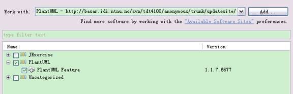

2. 下载安装成功后，重启 Eclipse。会在 Windows->Show View->Other 看到 PlantUML 的图标。

    图 2 . PlantUML 图标成功显示 {: #图-2-plantuml-图标成功显示}

    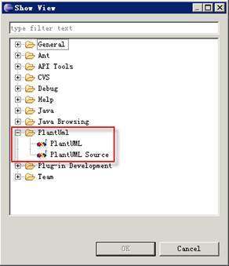

    用户也可以下载相应的 [plantuml.jar](http://sourceforge.net/projects/plantuml/files/plantuml.jar/download) 文件，进行手动安装。


## PlantUML 的使用实例

用户可以根据不同的需要，利用 PlantUML 可以生成不同的视图。操作非常简单方便。

##### 图 3\. PlantUML 操作界面

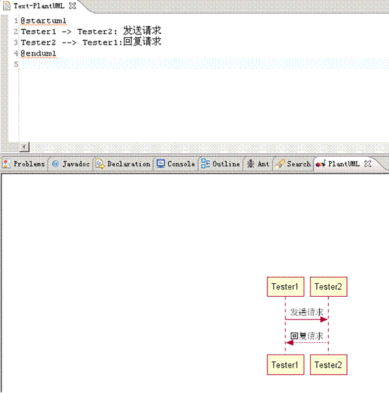

下面本文将用实际的语法实例对应用 PlantUML 生成的各种视图进行说明介绍。

### 时序图

时序图亦称为 [序列图](http://baike.baidu.com/view/2226296.htm) 或循序图，是一种 UML 行为图。它通过描述 [对象](http://baike.baidu.com/view/2387.htm) 之间发送 [消息](http://baike.baidu.com/view/89742.htm) 的时间顺序显示多个对象之间的动态协作。它可以表示 [用例](http://baike.baidu.com/view/706238.htm) 的行为顺序，当执行一个用例行为时，时序图中的每条消息对应了一个类操作或状态机中引起转换的触发事件。

语法实例：

```
@startuml
title Sequence Diagram Example
actor Tester1 #red
actor Tester2 #Yellow
Tester1 -> Tester2: 发送请求
Tester2 --> Tester1: 回复请求
@enduml

```

Show moreShow more icon

##### 图 4\. 时序图视图

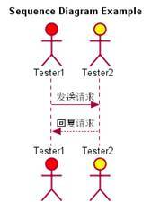

### 用例图

用例图 – 由主角、用例以及它们之间的关系构成的图。

语法实例：

```
@startuml
: 管理员 : as Admin << 管理员 >>
( 应用程序 ) as (Use)
Tester1 -> ( 开始 )
Tester2 --> (Use)
Admin ---> (Use)
note right of Admin : 管理员身份
note left of (Use)
实现 Notes Domino 的功能
end note
note "测试人员进行测试工作" as user
( 开始 ) .. user
user .. (Use)
@enduml

```

Show moreShow more icon

##### 图 5\. 用例图视图

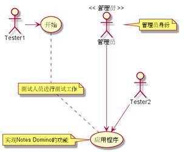

### 类图

类图 – 显示了模型的静态结构，特别是模型中存在的类、类的内部结构以及它们与其他类的关系等。

语法实例：

```
@startuml
skinparam classAttributeIconSize 12
class Test << 主函数 >> {
 -Function1
+Function2
#Function3
~Function4
~method1()
+method2()
#method3()
~method4()
}
Test <|-- Test2
Test1 o-- Test2
Test *-- Test3: 调用
@enduml

```

Show moreShow more icon

##### 图 6\. 类图视图

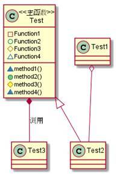

### 活动图

活动图 – 阐明了业务 [用例](http://baike.baidu.com/view/706238.htm) 实现的工作流程。业务用例工作流程说明了业务为向所服务的业务主角提供其所需的价值而必须完成的工作。业务用例由一系列活动组成，它们共同为业务主角生成某些工件。工作流程通常包括一个基本工作流程和一个或多个备选工作流程。

语法实例：

```
@startuml
(*) --> "Start"
note right: Start Testing
if "result" then
  -->[true] "Next Testing"
  --> "End"
  -right-> (*)
else
  ->[false] "Change Testing"
  -->[Ending process] (*)
endif
@enduml

```

Show moreShow more icon

##### 图 7\. 活动图视图

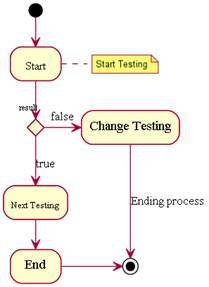

### 组件图

组件图 – 用来反映代码的物理结构。从组件图中，您可以了解各软件组件（如源代码文件或动态链接库）之间的编译器和运行时依赖关系。使用组件图可以将系统划分为内聚组件并显示代码自身的结构。

语法实例：

```
@startuml
title Lotus
interface "IBMDocs" as SC
package "Test1" {
SC - [ 第一个组件 ]
Notes - [ 第一个组件 ]: use
Symphony - [ 第二个组件 ]
[ 其他组件 ]
}
package "Test2" {
Connections - [ 第三个组件 ]
[ 第一个组件 ] --> iNotes
}
@enduml

```

Show moreShow more icon

##### 图 8\. 组件图视图

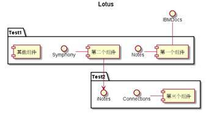

### 状态图

状态图 – 描述一个实体基于事件反应的动态行为，显示了该实体如何根据当前所处的状态对不同的事件做出反应的。

语法实例：

```
@startuml
[*] --> Test
state "Test" as Test {
state "Testing Module" as TM
state "Configuring Module" as CM
[*] --> CM
TM --> CM : Testing1
CM --> TM : Testing2
}
note right of Test : 状态图实例
@enduml

```

Show moreShow more icon

##### 图 9\. 状态图视图

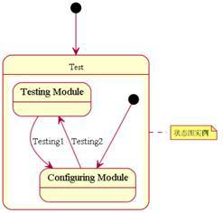

### 对象图

对象图 – 显示了一组对象和他们之间的关系。使用对象图来说明数据结构， [类图](http://baike.baidu.com/view/977673.htm) 中的类或组件等的实例的静态快照。对象图和类图一样反映系统的静态过程，但它是从实际的或原型化的情景来表达的。对象图显示某时刻对象和对象之间的关系。一个对象图可看成一个类图的特殊用例，实例和类可在其中显示。对象也和合作图相联系，合作图显示处于语境中的对象原型（类元角色）。

语法实例：

```
@startuml
object Test1
object Test2
@enduml

```

Show moreShow more icon

##### 图 10\. 对象图实例

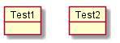

下面本文将简要地介绍一个具体实例的应用。这个实例是由其 [官方网站](http://plantuml.sourceforge.net/unicode.html) 提供。

图 11 是由 PlantUML 的方法生成的实例图。

##### 图 11\. 具体实例图

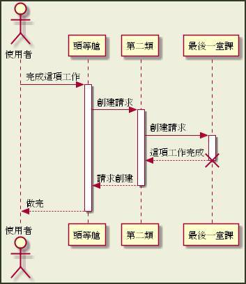

在 PlantUML 的官方主页中，有对各种方法更为详尽的描述及说明。文本仅仅列举了一些简单的语法规则，利用 PlantUML 做出的各种视图。可以看到 PlantUML 提供了非常简单的语法规则，为用户进行编辑提供了较为便捷的方法。

PlantUML 提供了多种语言的编辑方式，如 TXT 文本，HTML，Java，C/C++，LaTex，APT，Word 及 URL 等多种方式，满足不同的用户需求。

## 结束语

本文向读者介绍了一种开源的软件— PlantUML，它是一种简单快速的 UML 编辑软件，PlantUML 是一个用来绘制 UML 图的 Java 类库。提供了各种简单有效地方法，支持的 UML 各种视图，包括：时序图、用例图、类图、组件图、活动图等。PlantUML 可以帮助开发人员建立和编辑 UML，为开发人员提供了更多的开发条件，有较好的应用前景。