# Prometheus 入门与实践
Prometheus 是一套开源的系统监控报警框架

**标签:** 云计算

[原文链接](https://developer.ibm.com/zh/articles/cl-lo-prometheus-getting-started-and-practice/)

吴 莉, 殷 一鸣, 蔡 林

发布: 2018-05-30

* * *

随着容器技术的迅速发展，Kubernetes 已然成为大家追捧的容器集群管理系统。Prometheus 作为生态圈 Cloud Native Computing Foundation（简称：CNCF）中的重要一员,其活跃度仅次于 Kubernetes, 现已广泛用于 Kubernetes 集群的监控系统中。本文将简要介绍 Prometheus 的组成和相关概念，并实例演示 Prometheus 的安装，配置及使用，以便开发人员和云平台运维人员可以快速的掌握 Prometheus。

## Prometheus 简介

Prometheus 是一套开源的系统监控报警框架。它启发于 Google 的 borgmon 监控系统，由工作在 SoundCloud 的 google 前员工在 2012 年创建，作为社区开源项目进行开发，并于 2015 年正式发布。2016 年，Prometheus 正式加入 Cloud Native Computing Foundation，成为受欢迎度仅次于 Kubernetes 的项目。

作为新一代的监控框架，Prometheus 具有以下特点：

- 强大的多维度数据模型：

    1. 时间序列数据通过 metric 名和键值对来区分。
    2. 所有的 metrics 都可以设置任意的多维标签。
    3. 数据模型更随意，不需要刻意设置为以点分隔的字符串。
    4. 可以对数据模型进行聚合，切割和切片操作。
    5. 支持双精度浮点类型，标签可以设为全 unicode。
- 灵活而强大的查询语句（PromQL）：在同一个查询语句，可以对多个 metrics 进行乘法、加法、连接、取分数位等操作。

- 易于管理： Prometheus server 是一个单独的二进制文件，可直接在本地工作，不依赖于分布式存储。
- 高效：平均每个采样点仅占 3.5 bytes，且一个 Prometheus server 可以处理数百万的 metrics。
- 使用 pull 模式采集时间序列数据，这样不仅有利于本机测试而且可以避免有问题的服务器推送坏的 metrics。
- 可以采用 push gateway 的方式把时间序列数据推送至 Prometheus server 端。
- 可以通过服务发现或者静态配置去获取监控的 targets。
- 有多种可视化图形界面。
- 易于伸缩。

需要指出的是，由于数据采集可能会有丢失，所以 Prometheus 不适用对采集数据要 100% 准确的情形。但如果用于记录时间序列数据，Prometheus 具有很大的查询优势，此外，Prometheus 适用于微服务的体系架构。

## Prometheus 组成及架构

Prometheus 生态圈中包含了多个组件，其中许多组件是可选的：

- **Prometheus Server**: 用于收集和存储时间序列数据。
- **Client Library**: 客户端库，为需要监控的服务生成相应的 metrics 并暴露给 Prometheus server。当 Prometheus server 来 pull 时，直接返回实时状态的 metrics。
- **Push Gateway**: 主要用于短期的 jobs。由于这类 jobs 存在时间较短，可能在 Prometheus 来 pull 之前就消失了。为此，这次 jobs 可以直接向 Prometheus server 端推送它们的 metrics。这种方式主要用于服务层面的 metrics，对于机器层面的 metrices，需要使用 node exporter。
- **Exporters**: 用于暴露已有的第三方服务的 metrics 给 Prometheus。
- **Alertmanager**: 从 Prometheus server 端接收到 alerts 后，会进行去除重复数据，分组，并路由到对收的接受方式，发出报警。常见的接收方式有：电子邮件，pagerduty，OpsGenie, webhook 等。
- 一些其他的工具。

图 1 为 Prometheus 官方文档中的架构图：

##### 图 1\. Prometheus 架构图

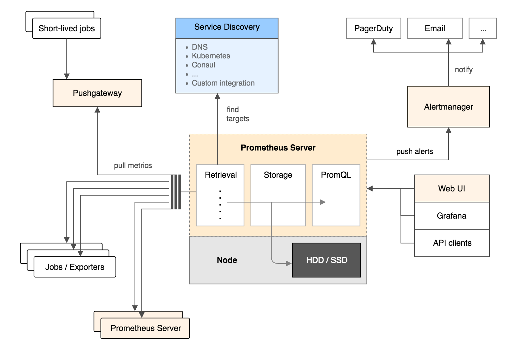

从上图可以看出，Prometheus 的主要模块包括：Prometheus server, exporters, Pushgateway, PromQL, Alertmanager 以及图形界面。

其大概的工作流程是：

1. Prometheus server 定期从配置好的 jobs 或者 exporters 中拉 metrics，或者接收来自 Pushgateway 发过来的 metrics，或者从其他的 Prometheus server 中拉 metrics。
2. Prometheus server 在本地存储收集到的 metrics，并运行已定义好的 alert.rules，记录新的时间序列或者向 Alertmanager 推送警报。
3. Alertmanager 根据配置文件，对接收到的警报进行处理，发出告警。
4. 在图形界面中，可视化采集数据。

## Prometheus 相关概念

下面将对 Prometheus 中的数据模型，metric 类型以及 instance 和 job 等概念进行介绍，以便读者在 Prometheus 的配置和使用中可以有一个更好的理解。

**数据模型**

Prometheus 中存储的数据为时间序列，是由 metric 的名字和一系列的标签（键值对）唯一标识的，不同的标签则代表不同的时间序列。

- metric 名字：该名字应该具有语义，一般用于表示 metric 的功能，例如：http _requests\_total, 表示 http 请求的总数。其中，metric 名字由 ASCII 字符，数字，下划线，以及冒号组成，且必须满足正则表达式 [a-zA-Z_:][a-zA-Z0-9\_:]\*。
- 标签：使同一个时间序列有了不同维度的识别。例如 http _requests\_total{method=”Get”} 表示所有 http 请求中的 Get 请求。当 method=”post” 时，则为新的一个 metric。标签中的键由 ASCII 字符，数字，以及下划线组成，且必须满足正则表达式 [a-zA-Z_:][a-zA-Z0-9\_:]\*。
- 样本：实际的时间序列，每个序列包括一个 float64 的值和一个毫秒级的时间戳。
- 格式：{=,…}，例如：http\_requests\_total{method=”POST”,endpoint=”/api/tracks”}。

**四种 Metric 类型**

Prometheus 客户端库主要提供四种主要的 metric 类型：

**Counter**

- 一种累加的 metric，典型的应用如：请求的个数，结束的任务数， 出现的错误数等等。

例如，查询 http\_requests\_total{method=”get”, job=”Prometheus”, handler=”query”} 返回 8，10 秒后，再次查询，则返回 14。

**Gauge**

- 一种常规的 metric，典型的应用如：温度，运行的 goroutines 的个数。
- 可以任意加减。

例如：go\_goroutines{instance=”172.17.0.2″, job=”Prometheus”} 返回值 147，10 秒后返回 124。

**Histogram**

- 可以理解为柱状图，典型的应用如：请求持续时间，响应大小。
- 可以对观察结果采样，分组及统计。

例如，查询 http\_request\_duration\_microseconds\_sum{job=”Prometheus”, handler=”query”} 时，返回结果如下：

##### 图 2\. Histogram metric 返回结果图

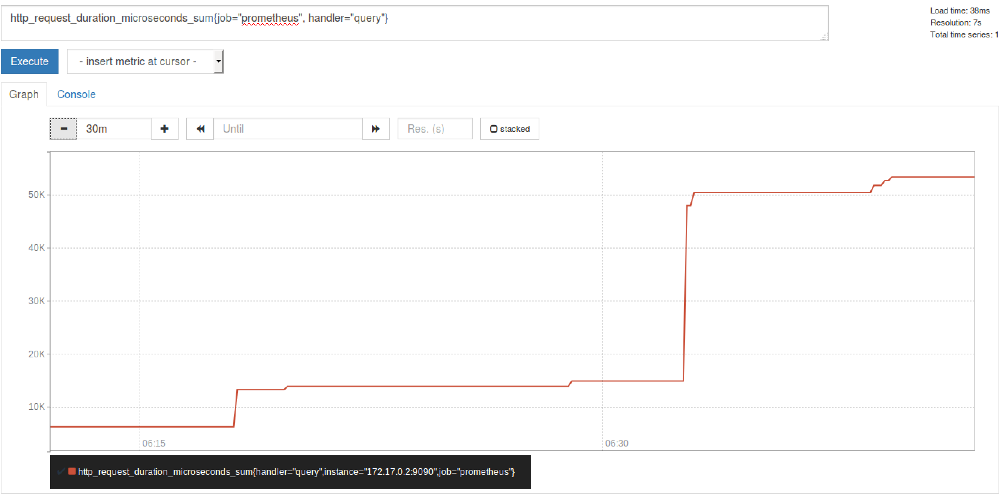

**Summary**

- 类似于 Histogram, 典型的应用如：请求持续时间，响应大小。
- 提供观测值的 count 和 sum 功能。
- 提供百分位的功能，即可以按百分比划分跟踪结果。

**instance 和 jobs**

**instance:** 一个单独 scrape 的目标， 一般对应于一个进程。

**jobs:** 一组同种类型的 instances（主要用于保证可扩展性和可靠性），例如：

##### 清单 1\. job 和 instance 的关系

```
job: api-server

    instance 1: 1.2.3.4:5670
    instance 2: 1.2.3.4:5671
    instance 3: 5.6.7.8:5670
    instance 4: 5.6.7.8:5671

```

Show moreShow more icon

当 scrape 目标时，Prometheus 会自动给这个 scrape 的时间序列附加一些标签以便更好的分别，例如： instance，job。

下面以实际的 metric 为例，对上述概念进行说明。

##### 图 3\. Metrics 示例

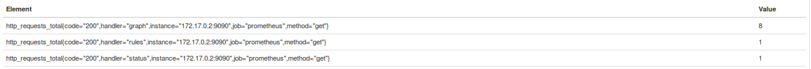

如上图所示，这三个 metric 的名字都一样，他们仅凭 handler 不同而被标识为不同的 metrics。这类 metrics 只会向上累加，是属于 Counter 类型的 metric，且 metrics 中都含有 instance 和 job 这两个标签。

## Node exporter 安装

为了更好的演示 Prometheus 从配置，到监控，到报警的功能，本实例将引入本机 ubuntu server 的监控。由于 Prometheus 主要用于监控 web 服务，如果需要监控 ubuntu server，则需要在本机上安装 node exporter。 Node exporter 主要用于暴露 metrics 给 Prometheus，其中 metrics 包括：cpu 的负载，内存的使用情况，网络等。

安装 node export 首先需要从 github 中下载最新的 node exporter 包，放在指定的目录并解压安装包，在本实例中，放在 /home/lilly/prom/exporters/ 中。

##### 清单 2\. 安装 Node exporter

```
cd /home/lilly/prom/exporters/
wget https://github.com/prometheus/node_exporter/releases/download/v0.14.0/node_exporter-0.14.0.linux-amd64.tar.gz
tar -xvzf node_exporter-0.14.0.linux-amd64.tar.gz

```

Show moreShow more icon

为了更好的启动和停止 node exporter，可以把 node exporter 转换为一个服务。

##### 清单 3\. 配置 node exporter 为服务

```
vim /etc/init/node_exporter.conf
#Prometheus Node Exporter Upstart script
start on startup
script
/home/lilly/prom/exporters/node_exporter/node_exporter
end script

```

Show moreShow more icon

此时，node exporter 已经是一个服务，可以直接用 service 命令进行启停和查看。

##### 清单 4\. 查看 node exporter 状态

```
root@ubuntu1404-dev:~/alertmanager# service node_exporter start
node_exporter start/running, process 11017
root@ubuntu1404-dev:~/alertmanager# service node_exporter status
node_exporter start/running, process 11017
此时，node exporter 已经监听在 9100 端口。
root@ubuntu1404-dev:~/prom# netstat -anp | grep 9100
tcp6       0      0 :::9100                 :::*                    LISTEN      155/node_exporter

```

Show moreShow more icon

当 node exporter 启动时，可以通过 curl [http://localhost:9100/metrics](http://localhost:9100/metrics) 或者在浏览器中查看 ubuntu server 里面的 metrics，部分 metrics 信息如下：

##### 清单 5\. 验证 node exporter

```
root@ubuntu1404-dev:~/prom# curl http://localhost:9100/metrics
......
# HELP node_cpu Seconds the cpus spent in each mode.
# TYPE node_cpu counter
node_cpu{cpu="cpu0",mode="guest"} 0
node_cpu{cpu="cpu0",mode="idle"} 30.02
node_cpu{cpu="cpu0",mode="iowait"} 0.5
node_cpu{cpu="cpu0",mode="irq"} 0
node_cpu{cpu="cpu0",mode="nice"} 0
node_cpu{cpu="cpu0",mode="softirq"} 0.34
node_cpu{cpu="cpu0",mode="steal"} 0
node_cpu{cpu="cpu0",mode="system"} 5.38
node_cpu{cpu="cpu0",mode="user"} 11.34
# HELP node_disk_bytes_read The total number of bytes read successfully.
# TYPE node_disk_bytes_read counter
node_disk_bytes_read{device="sda"} 5.50009856e+08
node_disk_bytes_read{device="sr0"} 67584
# HELP node_disk_bytes_written The total number of bytes written successfully.
# TYPE node_disk_bytes_written counter
node_disk_bytes_written{device="sda"} 2.0160512e+07
node_disk_bytes_written{device="sr0"} 0
# HELP node_disk_io_now The number of I/Os currently in progress.
# TYPE node_disk_io_now gauge
node_disk_io_now{device="sda"} 0
node_disk_io_now{device="sr0"} 0
# HELP node_disk_io_time_ms Total Milliseconds spent doing I/Os.
# TYPE node_disk_io_time_ms counter
node_disk_io_time_ms{device="sda"} 3484
node_disk_io_time_ms{device="sr0"} 12
......
# HELP node_memory_MemAvailable Memory information field MemAvailable.
# TYPE node_memory_MemAvailable gauge
node_memory_MemAvailable 1.373270016e+09
# HELP node_memory_MemFree Memory information field MemFree.
# TYPE node_memory_MemFree gauge
node_memory_MemFree 9.2403712e+08
# HELP node_memory_MemTotal Memory information field MemTotal.
# TYPE node_memory_MemTotal gauge
node_memory_MemTotal 2.098388992e+09
......
# HELP node_network_receive_drop Network device statistic receive_drop.
# TYPE node_network_receive_drop gauge
node_network_receive_drop{device="docker0"} 0
node_network_receive_drop{device="eth0"} 0
node_network_receive_drop{device="eth1"} 0
node_network_receive_drop{device="lo"} 0

```

Show moreShow more icon

## Prometheus 安装和配置

Prometheus 可以采用多种方式安装，本文直接用官网的 docker image（prom/prometheus）启动一个 Prometheus server, 并配置相应的静态监控 targets，jobs 和 alert.rules 文件。

启动 Prometheus 容器，并把服务绑定在本机的 9090 端口。命令如下：

##### 清单 6\. 安装 Prometheus

```
docker run -d -p 9090:9090 \
            -v $PWD/prometheus.yml:/etc/prometheus/prometheus.yml \
            -v $PWD/alert.rules:/etc/prometheus/alert.rules \
            --name prometheus \
            prom/prometheus \
            -config.file=/etc/prometheus/prometheus.yml \
            -alertmanager.url=http://10.0.2.15:9093

```

Show moreShow more icon

其中 Prometheus 的配置文件 prometheus.yml 内容为：

##### 清单 7\. Prometheus.yml 配置文件

```
global:                  # 全局设置，可以被覆盖
scrape_interval:     15s # 默认值为 15s，用于设置每次数据收集的间隔

external_labels:   # 所有时间序列和警告与外部通信时用的外部标签
    monitor: 'codelab-monitor'

rule_files: # 警告规则设置文件
  - '/etc/prometheus/alert.rules'

# 用于配置 scrape 的 endpoint  配置需要 scrape 的 targets 以及相应的参数
scrape_configs:
# The job name is added as a label `job=<job_name>` to any timeseries scraped from this config.
  - job_name: 'prometheus'  # 一定要全局唯一, 采集 Prometheus 自身的 metrics

    # 覆盖全局的 scrape_interval
    scrape_interval: 5s

    static_configs:  # 静态目标的配置
      - targets: ['172.17.0.2:9090']

  - job_name: 'node'  # 一定要全局唯一, 采集本机的 metrics，需要在本机安装 node_exporter

    scrape_interval: 10s

    static_configs:
      - targets: ['10.0.2.15:9100']  # 本机 node_exporter 的 endpoint

```

Show moreShow more icon

alert 规则文件的内容如下：

##### 清单 8\. alert.rules 配置文件

```
# Alert for any instance that is unreachable for >5 minutes.
ALERT InstanceDown   # alert 名字
IF up == 0           # 判断条件
FOR 5m             # 条件保持 5m 才会发出 alert
LABELS { severity = "critical" }  # 设置 alert 的标签
ANNOTATIONS {             # alert 的其他标签，但不用于标识 alert
    summary = "Instance {{ $labels.instance }} down",
    description = "{{ $labels.instance }} of job {{ $labels.job }} has been down for more than 5 minutes.",
}

```

Show moreShow more icon

当 Prometheus server 起来时，可以在 Prometheus 容器的日志中看到：

##### 清单 9\. Prometheus 日志

```
time="2017-09-05T08:18:02Z" level=info msg="Starting prometheus (version=1.7.1, branch=master,
revision=3afb3fffa3a29c3de865e1172fb740442e9d0133)" source="main.go:88"
time="2017-09-05T08:18:02Z" level=info msg="Build context (go=go1.8.3, user=root@0aa1b7fc430d, date=20170612-
11:44:05)" source="main.go:89"
time="2017-09-05T08:18:02Z" level=info msg="Host details (Linux 3.19.0-75-generic #83~14.04.1-Ubuntu SMP Thu Nov
10 10:51:40 UTC 2016 x86_64 71984d75e6a1 (none))" source="main.go:90"
time="2017-09-05T08:18:02Z" level=info msg="Loading configuration file /etc/prometheus/prometheus.yml"
source="main.go:252"
time="2017-09-05T08:18:03Z" level=info msg="Loading series map and head chunks..." source="storage.go:428"
time="2017-09-05T08:18:03Z" level=info msg="0 series loaded." source="storage.go:439"
time="2017-09-05T08:18:03Z" level=info msg="Starting target manager..." source="targetmanager.go:63"
time="2017-09-05T08:18:03Z" level=info msg="Listening on :9090" source="web.go:259"

```

Show moreShow more icon

在浏览器中访问 Prometheus 的主页 [http://localhost:9091](http://localhost:9091/), 可以看到 Prometheus 的信息如下：

##### 图 4\. Prometheus 状态信息


为了保证 Prometheus 确实从 node exporter 中收集数据，可以在 Graph 页面中搜索 metric 名字，如 node\_cpu 并点击 Execute，可以在 console 中看到 metric 如下。

##### 图 5\. Prometheus 中 metric 查询结果 console 输出示例

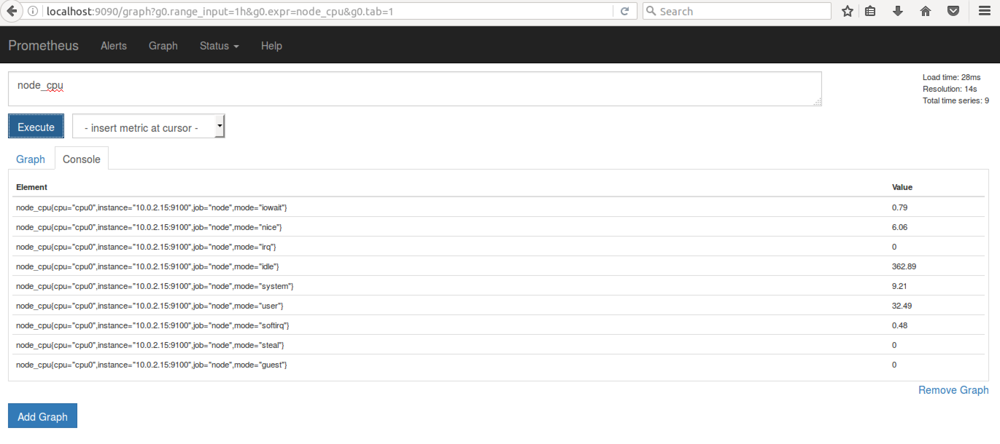

其中第一条为来自 node exporter 的 metric，此时 ubuntu server 上 goroutines 的个数为 13。点击 Graph 可以观察 metrics 的历史数据。如下图所示：

##### 图 6\. Prometheus 中 metric 查询结果 Graph 输出示例

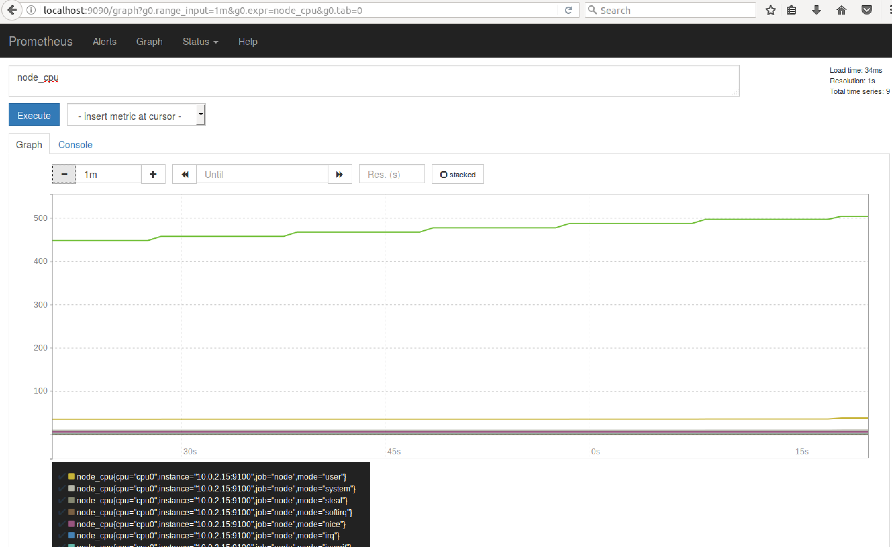

## Alertmanager 安装和配置

当接收到 Prometheus 端发送过来的 alerts 时，Alertmanager 会对 alerts 进行去重复，分组，路由到对应集成的接受端，包括：slack，电子邮件，pagerduty，hitchat，webhook。

在 Alertmanager 的配置文件中，需要进行如下配置：

##### 清单 10\. Alermanager 中 config.yml 文件

```
root@ubuntu1404-dev:~/alertmanager# cat config.yml
global:
    resolve_timeout: 5m
route:
    receiver: 'default-receiver'
    group_wait: 30s
    group_interval: 1m
    repeat_interval: 1m
    group_by: ['alertname']

    routes:
    - match:
        severity: critical
      receiver: my-slack

receivers:
- name: 'my-slack'
slack_configs:
  - send_resolved: true
    api_url: https://hooks.slack.com/services/***
    channel: '#alertmanager-critical'
    text: "{{ .CommonAnnotations.description }}"

- name: 'default-receiver'
slack_configs:
  - send_resolved: true
    api_url: https://hooks.slack.com/services/***
    channel: '#alertmanager-default'
    text: "{{ .CommonAnnotations.description }}"

```

Show moreShow more icon

创建好 config.yml 文件后，可以直接用 docker 启动一个 Alertmanager 的容器，如下：

##### 清单 11\. 安装 Alertmanager

```
docker run -d -p 9093:9093
                 –v /home/lilly/alertmanager/config.yml:/etc/alertmanager/config.yml \
                 --name alertmanager \
                 prom/alertmanager

docker ps | grep alert
d1b7a753a688        prom/alertmanager   "/bin/alertmanager -c"   25 hours ago        Up 25 hours
0.0.0.0:9093->9093/tcp   alertmanager

```

Show moreShow more icon

当 Alertmanager 服务起来时，可以通过浏览器访 Alertmanager 的主页 [http://localhost:9093](http://localhost:9093/) ，其状态信息如下：

##### 图 7\. Alertmanager 状态信息


在 alerts 的页面中，我们可以看到从 Prometheus sever 端发过来的 alerts，此外，还可以做 alerts 搜索，分组，静音等操作。

##### 图 8\. Alertmanager 报警页面

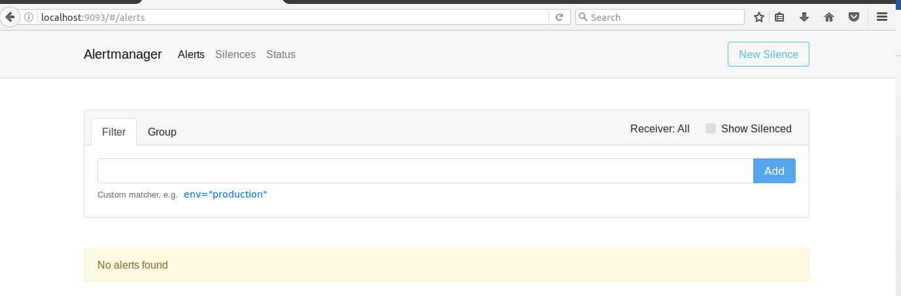

## Prometheus 实例演示

下面将通过一个具体的实例来演示 Prometheus 的使用。在 alert.ruels 中定义了 alert 触发的条件是 up 为 0。下面，手动停止 node exporter 服务。

##### 清单 12\. 停止 node exporter 服务

```
root@ubuntu1404-dev:~/prom# service node_exporter stop
node_exporter stop/waiting
root@ubuntu1404-dev:~/prom# service node_exporter status
node_exporter stop/waiting

```

Show moreShow more icon

此时，Prometheus 中查询 metric up,可以看到此时 up{instance=”10.0.2.15″,job=”node”} 的值为 0，如下所示：

##### 图 9\. Metric up 的返回值（停）

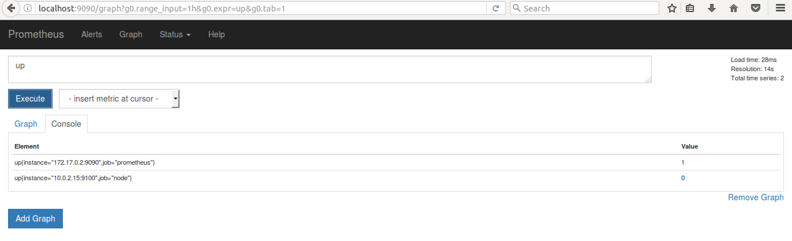

此时，Alerts 页面中显示 InstanceDown，状态为 PENDING。因为 alert 规则中定义需要保持 5 分钟，所以在这之前，alerts 还没有发送至 Alertmanager。

##### 图 10\. Alert Pending 界面

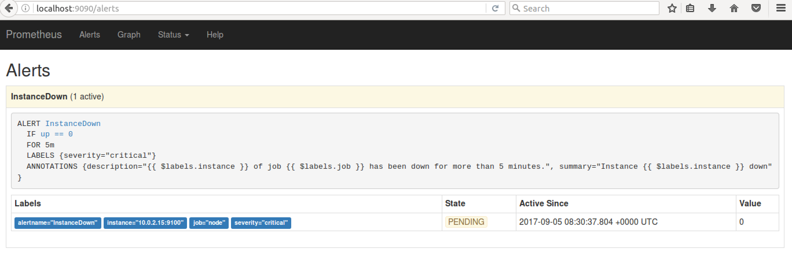

5 分钟后，状态由 PENDING 变为 FIRING，于此同时，在 Alertmanager 中可以看到有一个 alert。

##### 图 11\. Alert Firing 界面

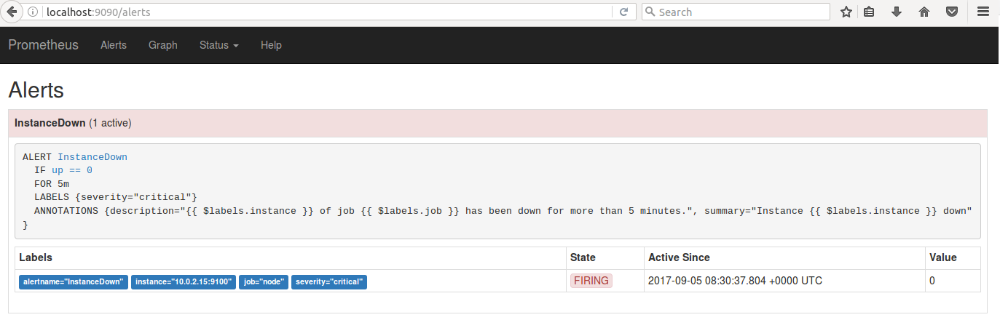

##### 图 12\. Alertmanager 警报界面

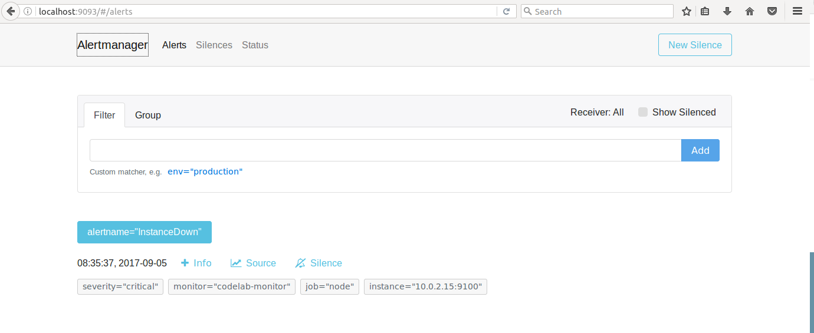

在 Alertmanager 的配置文件中定义，党 severity 为 critical 的时候，往 Alertmanager-critical channel 中发送警告，且每隔两分钟重复发送。如下图所示。

##### 图 13\. Slack 告警界面

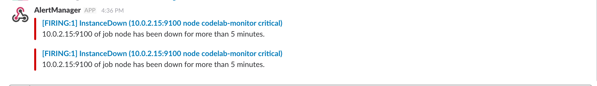

由上可知，当目标失败时，不仅可以在 Prometheus 的主页上实时的查看目标和 alerts 的状态，还可以使用 Alertmanager 发送警告，以便运维人员尽快解决问题。

当问题解决后，Prometheus 不仅会实时更新 metrics 的状态，Alertmanager 也会在 slack 通知 resolved 的消息。以下演示问题解决后的，Prometheus 的操作。

手动启动 node exporter。首先 metric 在 Graph 中恢复至正常值 1。

##### 图 14\. Metric up 的返回值（启）

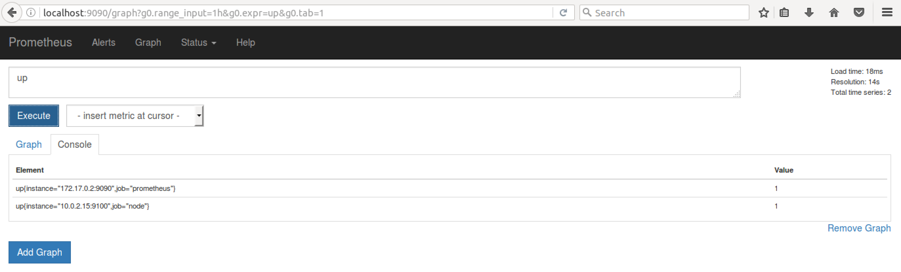

targets 中现实 node 这个 job 是 up 的状态。

##### 图 15\. Targets 界面


Alerts 为绿色，显示有 0 个激活态的警告。

##### 图 16\. Alers resolved 界面

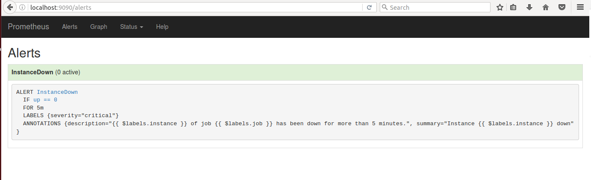

而在 Alertmanager 刚刚的 alert 也被清空，显示 No alerts found。

##### 图 17\. Alertmanager resolved 界面

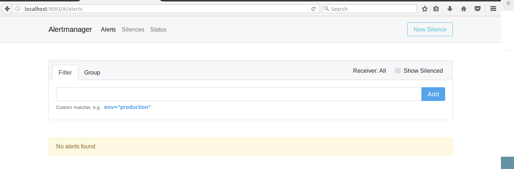

在 slack 端，在多次红色 FRING 报警后，也收到了绿色了 RESOLVED 消息。

##### 图 18\. Slack resolved 界面

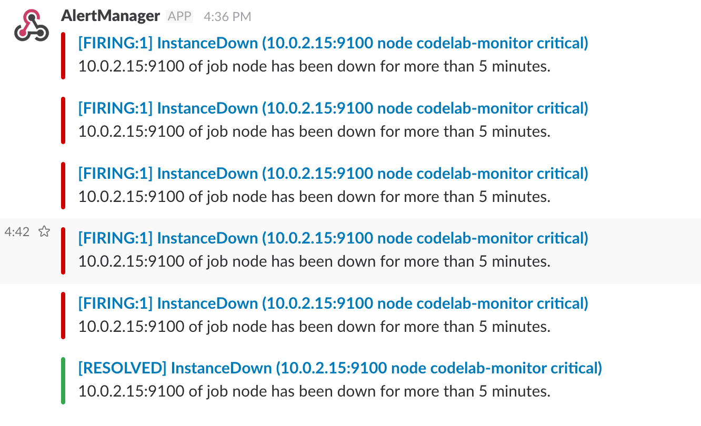

## 结束语

本文对 Prometheus 的组成，架构和基本概念进行了介绍，并实例演示了 node exporter, Prometheus 和 Alermanager 的配置和运行。最后，以一个监控的 target 的启停为例，演示 Prometheus 的一系列响应以及如何在 Prometheus 和 Alertmanager 中查看服务，警报和告警的状态。对于 Prometheus 中更高级的使用，如查询函数的使用，更多图形界面的集成，请参考官方文档。

## 参考资源

- Prometheus 概念及详细配置请参阅 [Prometheus 官方文档](https://prometheus.io/docs/introduction/overview/)
- Node exporter 安装请参考 [node\_exporter github 仓库](https://github.com/prometheus/node_exporter)
- Slack 信息发送请参考 [Incoming Webhooks](https://api.slack.com/incoming-webhooks)