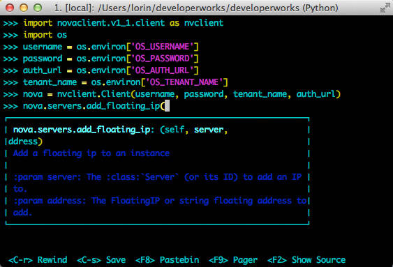

# Python API：OpenStack 隐藏深处的秘密
利用 Python 绑定编写 OpenStack 自动脚本

**标签:** 云计算

[原文链接](https://developer.ibm.com/zh/articles/cl-openstack-pythonapis/)

Lorin Hochstein

发布: 2013-12-12

* * *

OpenStack 是一个越来越流行的、用于部署基础架构即服务 (IaaS) 云的开源解决方案。OpenStack 附带了一个仪表板 Web 应用程序，非常适合执行手动任务，比如启动单个虚拟机 (VM) 实例，但是，如果希望自动化基于云的任务，则需要编写可操作 OpenStack 的脚本。

##### OpenStack 中的服务

OpenStack 中的 _服务e_ 这个词承载了太多含义。它用于表示：

- 一个 OpenStack 项目（比如 Compute Service (`nova`) 和 Identity Service (`keystone`)）
- Identity Service 目录中的一个条目（比如 Image、Compute 和 Volume）
- 一个 Linux 守护进程（比如 `nova-api` 和 `quantum-l3-agent`）

一个 OpenStack 项目与 Identity Service 目录中的一个或多个条目有关联，由一个或多个 Linux 守护进程实现。在本文中，我使用“服务”表示 OpenStack 项目。

许多用户直接为 OpenStack 具象状态传输 (REST) 应用编程接口 (API) 编写自动化脚本，或者编写调用命令行工具（比如 `keystone` 或 `nova`）的 shell 脚本。但 Python 中有一种编写 OpenStack 自动化脚本的更好方法。所有 OpenStack 服务都公开了原生 Python API，以公开与命令行工具相同的特性集。不幸的是，描述如何使用这些 API 的文档很少。

如果您是 Python 程序员，那么 Python API 会比命令行工具或 REST API 容易使用得多。在本文中，我将演示如何使用原生 OpenStack Python API 自动化常见的用户和管理性任务。

## OpenStack 项目和代号

_OpenStack_ 这个词不是指单个应用程序。它是一个服务集合，这些服务协同工作来实现 IaaS 云。（参见边栏 [OpenStack 中的服务](#openstack-中的服务)，了解这里所说的“服务”的含义。）每个 OpenStack 服务都有一个正式名称和一个代号，如下表所示，而且每个 OpenStack 服务公开了自己的 Python API。

##### OpenStack 服务和代号

正式名称代号Identity Service`keystone`Image Service`glance`Compute Service`nova`Networking Service`quantum`Block Storage Service`cinder`Object Storage Service`swift`

## 安装 Python 绑定

Python 绑定与每个服务的命令行工具捆绑在一起。事实上，每个命令行工具使用相应的 Python API 实现。可从 Python Package Index（PyPi — 参见参考资料，获取相关链接）中使用 `pip`（一个 Python 包安装程序）来安装每个工具。`pip` 包名称包括：

- `python-keystoneclient`
- `python-glanceclient`
- `python-novaclient`
- `python-quantumclient`
- `python-cinderclient`
- `python-swiftclient`

例如，要安装 `keystone` 客户端，可运行以下命令：

```
$ pip install python-keystoneclient

```

Show moreShow more icon

可将这些包安装到 Python 虚拟环境或您的系统级 Python 包中，只要您拥有本地机器上的根用户特权。

所有 OpenStack API 都有一些版本，Python 绑定支持多个 API 版本，以保持向后兼容性。因此可以安全地下载这些包的最新版本，因为它们将会适合 OpenStack 服务的所有更低版本。

在本文中，我将重点介绍来自以下服务的 Python API 示例：

- OpenStack Identity Service (`keystone`)
- OpenStack Image Service (`glance`)
- OpenStack Compute Service (`nova`)

## 设置一个测试环境

为了最充分地掌握本文的内容，建议您使用管理员特权访问一个 OpenStack 云，以便试用这些代码段。如果目前没有 OpenStack 云的管理员访问权，那么最简单的方法就是在一个 VM 中部署 OpenStack。DevStack 项目（参见 参考资料 获取链接）旨在简化在单个机器上创建一个面向开发的 OpenStack 部署的过程。配合 VirtualBox 等虚拟化工具，您可以在笔记本电脑上（甚至在 Mac 或 Windows® 上）实现一个 OpenStack 云。

您还可以获得 TryStack 上的一个免费帐户，TryStack 是由社区维护的 OpenStack 沙盒（参见参考资料）。请注意，只能获取 TryStack 上的用户级特权，不能获得管理级特权，所以您无法使用 TryStack 测试需要管理特权的脚本。

## OpenStack Identity (keystone)

客户端要对 Identity (`keystone`) API 发出请求，可实例化适当的 `keystone` 客户端 Python 对象并调用它的方法。因为 API 提供了版本控制，所以 Python 客户端始终与该 API 的一个特定版本有关联。

清单 1 显示了使用 `keystone` 客户端的 2.0 版将 Image Service 添加到服务目录的示例。

##### 清单 1\. 使用 keystone 创建一个管理员角色

```
import keystoneclient.v2_0.client as ksclient
# Replace the method arguments with the ones from your local config
keystone = ksclient.Client(auth_url="http://192.168.27.100:35357/v2.0",
                           username="admin",
                           password="devstack",
                           tenant_name="demo")
glance_service = keystone.services.create(name="glance",
                            service_type="image",
                            description="OpenStack Image Service")

```

Show moreShow more icon

### 凭据

在实例化 `keystoneclient.v2_0.client.Client` 对象时必须提供凭据。`keystone` 端点接受两种类型的凭据：令牌，或者用户名和密码。如果您是管理员，那么您可以使用 `admin` 令牌，这是一种具有管理员特权且永不过期的特殊令牌。要定义此令牌，可以使用运行 `keystone` 服务的机器上的 /etc/keystone/keystone.conf 文件中的 `admin_token` 选项（参见清单 2）。

##### 清单 2\. 使用身份验证令牌执行身份验证

```
import keystoneclient.v2_0.client as ksclient

# Replace the values below with the ones from your local config
endpoint = "http://192.168.27.100:35357/v2.0"
admin_token = "devstack"

keystone = ksclient.Client(endpoint=endpoint, token=admin_token)

```

Show moreShow more icon

出于安全原因，一般不赞成使用 `admin` 令牌。相反，在创建了具有管理特权的用户之后，建议 OpenStack Identity 开发人员始终使用用户名和密码进行身份验证（参见清单 3）。

##### 清单 3\. 使用用户名和密码执行身份验证

```
import keystoneclient.v2_0.client as ksclient

# Replace the values below  the ones from your local config,
auth_url = "http://192.168.27.100:35357/v2.0"
username = "admin"
password = "devstack"
tenant_name = "demo"

keystone = ksclient.Client(auth_url=auth_url, username=username,
                           password=password, tenant_name=tenant_name)

```

Show moreShow more icon

### 加载一个 openrc 文件

为了简化身份验证，建议创建一个 openrc 文件，将凭据导出到环境变量中。这样做可以避免将登录信息硬编码到脚本中。清单 4 显示了一个 openrc 文件示例。

##### 清单 4\. 从环境变量加载凭据

```
export OS_USERNAME="myname"
export OS_PASSWORD="mypassword"
export OS_TENANT_NAME="mytenant"
export OS_AUTH_URL="http://10.20.0.2:5000/v2.0/"

```

Show moreShow more icon

环境变量 OS\_USERNAME、OS\_PASSWORD、OS\_TENANT\_NAME 和 OS\_AUTH\_URL 在所有 Python 命令行工具中已标准化。如果设置了这些环境变量，命令行工具（`keystone`、`nova`）将会使用它们对其 API 端点进行身份验证。

使用 Bash `source` 内置命令将这些环境变量加载到您当前的 shell 中。如果使用 Bash 作为标准 shell，那么您可能希望将这行代码添加到 .profile 中，以便在您每次登录时自动设置这些环境变量：

```
$ source openrc

```

Show moreShow more icon

找到 openrc 文件后，Python 脚本就可以从环境中检索凭据。我们创建了一个名为 credentials.py 的 Python 文件（如清单 5 所示），以便从环境中提取登录信息。请注意，`keystone` 和 `nova` 在其客户端初始化器方法中使用了稍微不同的变量名，所以我为每个工具定义了不同的函数。

##### 清单 5\. credentials.py

```
#!/usr/bin/env python
import os

def get_keystone_creds():
    d = {}
    d['username'] = os.environ['OS_USERNAME']
    d['password'] = os.environ['OS_PASSWORD']
    d['auth_url'] = os.environ['OS_AUTH_URL']
    d['tenant_name'] = os.environ['OS_TENANT_NAME']
    return d

def get_nova_creds():
    d = {}
    d['username'] = os.environ['OS_USERNAME']
    d['api_key'] = os.environ['OS_PASSWORD']
    d['auth_url'] = os.environ['OS_AUTH_URL']
    d['project_id'] = os.environ['OS_TENANT_NAME']
    return d

```

Show moreShow more icon

### 身份验证令牌

如果客户端初始化器返回时没有抛出异常，则它已成功向端点验证。您可访问刚才通过返回的对象 `auth_token` 属性发出的 `keystone` 令牌，如清单 6 所示。当对 `glance` API 进行身份验证时，需要显式地将一个 `keystone` 身份验证令牌作为参数传递给初始化器，我们稍后会对此进行讨论。

##### 清单 6\. 在一个交互式 Python 会话中对一个 keystone 端点执行成功的验证

```
>>> import keystoneclient.v2_0.client as ksclient
>>> from credentials import get_keystone_creds
>>> creds = get_keystone_creds()
>>> keystone = ksclient.Client(**creds)
>>> keystone.auth_token
u'MIILkAYJKoZIhvcNAQcCoIILgTCCC30CAQExCTAHBgUrDgMCGjCCCmkGCSqGSIb3DQEHAaCCCloE
ggpWeyJhY2Nlc3MiOiB7InRva2VuIjogeyJpc3N1ZWRfYXQiOiAiMjAxMy0wNS0yNlQwMjoxMjo0Mi
42MDAwMjUiLCAiZXhwaXJlcyI6ICIyMDEzLTA1LTI3VDAyOjEyOjQyWiIsICJpZCI6ICJwbGFjZWhv
bGRlciIsICJ0ZW5hbnQiOiB7ImRlc2NyaXB0aW9uIjogbnVsbCwgImVuYWJsZWQiOiB0cnVlLCAiaW
...
fI9JnOBZJwuoma8je0a1AvLff6AcJ1zFkVZGb'

```

Show moreShow more icon

**备注：** OpenStack Identity 的 Grizzly 版本默认情况下使用了公钥基础架构令牌，这些令牌比 OpenStack 的以前版本中使用的通用惟一标识符令牌（例如 `7d9fde355f09458f8e97986a5a652bfe` ）要长得多。

### CRUD 操作

`keystone` API 实质上是一个创建、读取、更新、删除 (CRUD) 接口：与 `keystone` API 的大多数交互都会读取 `keystone` 后端数据库或修改它。与该 API 的大多数交互都会调用 `Manager` 对象。一个 Manager 表示一个具有相同类型的对象集合。例如，`UserManager` 处理 `keystone` 用户，`TenantManager` 处理租户，`RoleManager` 处理角色，等等。这些管理器支持多种操作，比如 `create`（创建一个新对象）、`get`（按 ID 检索一个对象）、`list`（检索所有对象）和 `delete`。

### 创建用户、租户和角色

通常，在部署 OpenStack 时，执行的第一个任务是创建一个 `keystone` 租户，然后创建一个具有管理特权的 `keystone` 用户。 [创建一个用户、租户和角色](#创建一个用户、租户和角色) 显示了一个使用 Python API 自动化此过程的示例。该脚本可执行以下任务：

- 创建一个用户角色 (`Client.roles.create`)。
- 创建一个管理角色 (`Client.roles.create`)。
- 创建一个名为 acme 的租户 (`Client.tenants.create`)。
- 创建一个名为 admin 的用户 (`Client.users.create`)。
- 为 admin 用户分配 acme 租户中的管理角色 (`Client.roles.add_user_role`)。

这是一个适合使用 `admin` 令牌的场景，因为 Identity Service 不包含任何具有管理特权的用户。

##### 清单 7\. 创建一个用户、租户和角色

```
import keystoneclient.v2_0.client as ksclient
endpoint = "http://192.168.27.100:35357/v2.0"
admin_token = "devstack"

keystone = ksclient.Client(endpoint=endpoint, token=admin_token)
user_role = keystone.roles.create("user")
admin_role = keystone.roles.create("admin")
acme_tenant = keystone.tenants.create(tenant_name="Acme",
                        description="Employees of Acme Corp.",
                        enabled=True)
admin_user = keystone.users.create(name="admin",
                password="a.G'03134!j",
                email="cloudmaster@example.com", tenant_id=acme_tenant.id)
keystone.roles.add_user_role(admin_user, admin_role, acme_tenant)

```

Show moreShow more icon

### 创建服务和端点

通常，在 OpenStack 云中，部署 Identity Service 的下一个任务是在 `keystone` 中填充云和端点中的服务。清单 8 显示了使用 `Client.services.create` 和 `Client.endpoints.create` 方法为 Identity Service 添加一个服务和端点的示例。

##### 清单 8\. 创建一个服务和端点

```
import keystoneclient.v2_0.client as ksclient
creds = get_keystone_creds() # See openrc-creds
keystone = ksclient.Client(**creds)
service = keystone.services.create(name="keystone",
                                   service_type="identity",
                                   description="OpenStack Identity Service")

keystone_publicurl = "http://192.168.27.100:5000/v2.0"
keystone_adminurl = "http://192.168.27.100:35357/v2.0"
keystone.endpoints.create(service_id=service.id,
                          region="Northeast",
                          publicurl=keystone_publicurl,
                          adminurl=keystone_adminurl,
                          internalurl=keystone_publicurl)

```

Show moreShow more icon

### 访问服务目录

`keystone` 的主要功能之一就是充当服务目录。客户端可使用 `keystone` 查找 OpenStack 服务的端点 URL。该 API 通过 `keystoneclient.v2_0.client.Client.service_catalog.url_for` 方法提供此功能。此方法支持按类型（例如 image、volume、compute、network）和端点类型（`publicURL`、`internalURL`、`adminURL`）查找服务端点。

清单 9 演示了如何使用 `url_for` 方法检索 OpenStack Image (`glance`) Service 的端点。

##### 清单 9\. 在一个交互式 Python 会话中查询 glance 端点

```
>>> import keystoneclient.v2_0.client as ksclient
>>> creds = get_keystone_creds() # See <a href="openrc-creds" />
>>> keystone = ksclient.Client(**creds)
>>> glance_endpoint = keystone.service_catalog.url_for(service_type='image',
                                                       endpoint_type='publicURL')
>>> glance_endpoint
u'http://192.168.27.100:9292'

```

Show moreShow more icon

## OpenStack Compute (nova)

##### nova API 的 1.1 版和第 2 版

`nova` API 的 1.1 版和第 2 版是相同的。可用 “2” 代替 “1.1”，传递它作为 `novaclient.client.Client initializer` 的第一个参数，但没有 `novaclient.v2` 模块，只有一个 `novaclient.v1_1` 模块。

OpenStack Compute (`nova`) Python API 的工作原理类似于 OpenStack Identity API。这里使用了 `nova` API 的 1.1 版，所以本文中使用的 `nova` Python 绑定的 1.1 版中的类位于 `novaclient.v1_1` Python 命名空间中。

### 对 nova-api 端点执行身份验证

要向 `nova-api` 端点发出请求，可实例化一个 `novaclient.v1_1.client.Client` 对象并对它执行调用。可通过两种方式获取一个与该 API 的 1.1 版进行通信的客户端。清单 10 演示了如何通过传递版本字符串作为参数来获取合适的客户端。

##### 清单 10\. 传递版本作为参数

```
from novaclient import client as novaclient
from credentials import get_nova_creds
creds = get_nova_creds()
nova = novaclient.Client("1.1", **creds)

```

Show moreShow more icon

清单 11 演示了如何通过显式导入 1.1 版模块来获取合适的客户端。

##### 清单 11\. 直接导入版本

```
import novaclient.v1_1.client as nvclient
from credentials import get_nova_creds
creds = get_nova_creds()
nova = nvclient.Client(**creds)

```

Show moreShow more icon

### 清单实例

使用 `Client.servers.list` 方法列出当前的 VM 实例，如清单 12 所示。

##### 清单 12\. 在一个交互式 Python 会话中获取一个 VM 实例列表

```
>>> import novaclient.v1_1.client as nvclient
>>> from credentials import get_nova_creds
>>> creds = get_nova_creds()
>>> nova = nvclient.Client(**creds)
>>> nova.servers.list()
[<Server: cirros>]

```

Show moreShow more icon

### 按名称获取一个实例并关闭它

如果不知道实例的 ID，只知道它的名称，那么可以使用 `Server.find` 方法。清单 13 显示了如何按名称找到一个实例，然后使用 `Server.delete` 方法终止它。

##### 清单 13\. 终止 “my-vm” 实例

```
import novaclient.v1_1.client as nvclient
from credentials import get_nova_creds
creds = get_nova_creds()
nova = nvclient.Client(**creds)

server = nova.servers.find(name="my-vm")
server.delete()

```

Show moreShow more icon

### 启动一个实例并检查状态

要启动一个新实例，可以使用 `Client.servers.create` 方法，如清单 14 所示。请注意，必须传递一个 `image` 对象和 `flavor` 对象，而不是 image 和 flavor 的名称。该示例还使用 `Client.keypairs.create` 方法将 Secure Shell (SSH) 公钥上传到 `~/.ssh/id_rsa.pub`，并将密钥对命名为 mykey（假设该密钥对还不存在）。最后，它使用 `Client.servers.get` 方法获取该实例的当前状态，使用它来轮询状态。

##### 清单 14\. 启动一个新实例

```
import os
import time
import novaclient.v1_1.client as nvclient
from credentials import get_nova_creds
creds = get_nova_creds()
nova = nvclient.Client(**creds)
if not nova.keypairs.findall(name="mykey"):
    with open(os.path.expanduser('~/.ssh/id_rsa.pub')) as fpubkey:
        nova.keypairs.create(name="mykey", public_key=fpubkey.read())
image = nova.images.find(name="cirros")
flavor = nova.flavors.find(name="m1.tiny")
instance = nova.servers.create(name="test", image=image, flavor=flavor, key_name="mykey")

# Poll at 5 second intervals, until the status is no longer 'BUILD'
status = instance.status
while status == 'BUILD':
    time.sleep(5)
    # Retrieve the instance again so the status field updates
    instance = nova.servers.get(instance.id)
    status = instance.status
print "status: %s" % status

```

Show moreShow more icon

### 附加一个浮动 IP 地址

要附加一个浮动 IP 地址，必须首先验证 OpenStack 是否拥有一个可用的浮动 IP 地址。使用 `Client.floating_ips.list` 方法获取可用的浮动 IP 地址列表。如果结果列表是空的，可使用 `Client.floating_ips.create` 方法分配一个新的浮动 IP 地址，然后使用 `Server.add_floating_ip` 方法将它分配给该实例，如清单 15 所示。

##### 清单 15\. 创建一个浮动 IP 地址

```
>>> nova.floating_ips.list()
[]
>>> floating_ip = nova.floating_ips.create()
<FloatingIP fixed_ip=None, id=1, instance_id=None, ip=192.168.27.129, pool=public>
>>> instance = nova.servers.find(name="test")
>>> instance.add_floating_ip(floating_ip)

```

Show moreShow more icon

### 更改一个安全组

使用 `Client.security_group_rules.create` 方法向一个安全组添加规则。清单 16 中的示例修改了默认的安全组，以便支持 SSH（在端口 22 上运行）以及所有 Internet Control Message Protocol (ICMP) 流量。为此，我使用 `Client.security_groups.find` 方法获取了名为 default 的安全组。

##### 清单 16\. 允许使用 default 安全组中的端口 22 和 ICMP

```
import novaclient.v1_1.client as nvclient
from credentials import get_nova_creds
creds = get_nova_creds()
nova = nvclient.Client(**creds)

secgroup = nova.security_groups.find(name="default")
nova.security_group_rules.create(secgroup.id,
                               ip_protocol="tcp",
                               from_port=22,
                               to_port=22)
nova.security_group_rules.create(secgroup.id,
                               ip_protocol="icmp",
                               from_port=-1,
                               to_port=-1)

```

Show moreShow more icon

### 获取控制台日志

`Server.get_console_output` 方法获取了在启动 VM 时发送给控制台的文本。可以分析控制台输出，以解决更改主机密钥的常见问题。

IaaS 云（比如 OpenStack）的一个缺陷是，它不能很好地与 SSH 主机密钥检查功能进行互操作。如果登录到（比如 10.40.1.150 上的）某个实例，而该 IP 地址之前被您过去登录的另一个实例使用过，那么您将获得一个类似清单 17 的错误。

##### 清单 17\. ID 更改后的错误

```
@@@@@@@@@@@@@@@@@@@@@@@@@@@@@@@@@@@@@@@@@@@@@@@@@@@@@@@@@@@
@    WARNING: REMOTE HOST IDENTIFICATION HAS CHANGED!     @
@@@@@@@@@@@@@@@@@@@@@@@@@@@@@@@@@@@@@@@@@@@@@@@@@@@@@@@@@@@
IT IS POSSIBLE THAT SOMEONE IS DOING SOMETHING NASTY!
Someone could be eavesdropping on you right now (man-in-the-middle attack)!
It is also possible that a host key has just been changed.
The fingerprint for the RSA key sent by the remote host is
6f:2b:59:46:cb:8c:81:48:06:f3:c5:db:40:23:d3:be.
Please contact your system administrator.
Add correct host key in /home/mylogin/.ssh/known_hosts to get rid of this message.
Offending key in /home/mylogin/.ssh/known_hosts:1
RSA host key for 10.40.1.150 has changed and you have requested strict checking.
Host key verification failed.

```

Show moreShow more icon

如果您的 VM 映像安装了 `cloud-init` 包（参见参考资料），那么它会将主机密钥输出到控制台，如清单 18 所示。

##### 清单 18\. 控制台中的 SSH 密钥输出示例

```
-----BEGIN SSH HOST KEY KEYS-----
ecdsa-sha2-nistp256 AAAAE2VjZHNhLXNoYTItbmlzdHAyNTYAAAAIbmlzdHAyNTYAAABBBDciNMyzj0osyPOM+
1OyseTWgkzw+M43zp5H2CchG8daRDHel7V3OHETVdI6WofNn
SdBJAwIoisRFPxyroNGiVw= root@my-name
ssh-rsa AAAAB3NzaC1yc2EAAAADAQABAAABAQDU854+fNdcKMZTLCUejMOZllQmmphr6V5Aaz1F2+x2jXql5rqKQ
d5/h6OdFszcp+gdTeVtfgG++/298qodTemVVrvqwjp4eN87iHvhPxH6GDEevAKlEed2ckdAmgvzI9rcOYgR/46G9x
Iea0IdgNjMvN1baj6WPtv+HfcfH/ZV58G306lSJfbz/GVxNTIxW+Wg7ZQCAe6jWgm4oQ+66sco+7Fub24EPue3kO8
jqufqq3mY5+MFlzEHSX5B04ioG5Alw/JuqVx5+7zHt9I2wA3nzsyUdKtCTrw8V4fYEhWDm53WLOpW+8CeYCXuv+yL
7EjwLqhIH/TUuzGQiWmFGvyz root@my-name
-----END SSH HOST KEY KEYS-----

```

Show moreShow more icon

清单 19 给出的脚本使用 `Server.get_console_output` API 方法从控制台中提取 SSH 主机密钥，然后更新 `~/.ssh/known_hosts` 文件，所以在首次使用 SSH 访问浮动 IP 地址时，您不会获得此 SSH 警告。

##### 清单 19\. 从控制台提取 SSH 主机密钥

```
import os
import subprocess
import novaclient.v1_1.client as nvclient
from credentials import get_nova_creds

def get_server(creds, servername):
    nova = nvclient.Client(**creds)
    return nova.servers.find(name=servername)

def remove_hostkey(ip):
    subprocess.call(["ssh-keygen", "-R", ip])

def get_hostkey_from_console(text):
    lines = text.split('\n')
    start = '-----BEGIN SSH HOST KEY KEYS-----\r'
    end = '-----END SSH HOST KEY KEYS-----\r'
    start_ind = lines.index(start)
    end_ind = lines.index(end)
    for i in range(start_ind+1, end_ind):
        key = lines[i].rstrip()
        if key.startswith('ssh-rsa'):
            return key
    raise KeyError("ssh host key not found")

def main():
    server = get_server(get_nova_creds(), "my-server")
    netname = "my-network"
    (fixed_ip, floating_ip) = server.networks[netname]
    # Remove existing key, if any
    remove_hostkey(floating_ip)
    output = server.get_console_output()
    key = get_hostkey_from_console(output)
    with open(os.path.expanduser("~/.ssh/known_hosts"), 'a') as f:
        f.write("{0} {1}\n".format(floating_ip, key))

if __name__ == '__main__':
    main()

```

Show moreShow more icon

## OpenStack Image (glance)

OpenStack Image Service (`glance`) 负责管理 Compute Service 所使用的一个 VM 映像目录。

### 对 glance 端点执行身份验证

OpenStack Image (`glance`) Python API 在执行初始身份验证时与 Compute API 有一些细微的差别。`glance` API 依赖于必须从 `keystone` API 获取的信息：

- `glance` 端点 URL
- 一个 `keystone` 身份验证令牌

像 `nova` API 一样，对于 `glance` API，您可以传递 API 的版本作为参数或直接导入该模块。清单 20 中的示例展示了如何使用该 API 的第 2 版，对 `glance` 端点执行身份验证。

##### 清单 20\. 对 glance API 执行身份验证

```
import keystoneclient.v2_0.client as ksclient
import glanceclient
creds = get_keystone_creds()
keystone = ksclient.Client(**creds)
glance_endpoint = keystone.service_catalog.url_for(service_type='image',
                                                   endpoint_type='publicURL')
glance = glanceclient.Client('2',glance_endpoint, token=keystone.auth_token)

```

Show moreShow more icon

清单 21 中的示例直接导入了相关的 `glance` 模块。

##### 清单 21\. 直接导入 glance 模块

```
import keystoneclient.v2_0.client as ksclient
import glanceclient.v2.client as glclient
creds = get_keystone_creds()
keystone = ksclient.Client(**creds)
glance_endpoint = keystone.service_catalog.url_for(service_type='image',
                                                   endpoint_type='publicURL')
glance = glclient.Client(glance_endpoint, token=keystone.auth_token)

```

Show moreShow more icon

### 列出可用映像

使用 `Client.images.list` 方法列出当前的映像，如清单 22 所示。请注意，此方法会返回一个生成器，其中 `nova` API 中的 `list` 方法将会返回列表对象。

##### 清单 22\. 获取一个 VM 映像列表

```
>>> import keystoneclient.v2_0.client as ksclient
>>> import glanceclient.v2.client as glclient
>>> creds = get_keystone_creds()
>>> keystone = ksclient.Client(**creds)
>>> glance_endpoint = keystone.service_catalog.url_for(service_type='image',
...                                                    endpoint_type='publicURL')
>>> glance = glclient.Client(glance_endpoint, token=keystone.auth_token)
>>> images = glance.images.list()
>>> images
<generator object list at 0x10c8efd70>
>>> images.next()
{u'status': u'active', u'tags': [], u'kernel_id':
u'8ab02091-21ea-434c-9b7b-9b4e2ae49591', u'container_format': u'ami', u'min_ram': 0,
u'ramdisk_id': u'd36267b5-7cae-4dec-b5bc-6d2de5c89c64', u'updated_at':
u'2013-05-28T00:44:21Z', u'visibility': u'public', u'file':
u'/v2/images/cac50405-f4d4-4715-b1f6-7f00ff5030e6/file', u'min_disk': 0,
u'id': u'cac50405-f4d4-4715-b1f6-7f00ff5030e6', u'size': 25165824, u'name':
u'cirros-0.3.1-x86_64-uec', u'checksum': u'f8a2eeee2dc65b3d9b6e63678955bd83',
u'created_at': u'2013-05-28T00:44:21Z', u'disk_format': u'ami', u'protected':
False, u'schema': u'/v2/schemas/image'}

```

Show moreShow more icon

### 将一个映像上传到 glance

清单 23 中的示例展示了如何使用 `glance` API 上传一个文件。这里需要使用该 API 的第 1 版创建一个映像，因为 Python API 绑定还未实现第 2 版的 `create` 方法。

##### 清单 23\. 将一个映像上传到 glance

```
import keystoneclient.v2_0.client as ksclient
import glanceclient
creds = get_keystone_creds()
keystone = ksclient.Client(**creds)
glance_endpoint = keystone.service_catalog.url_for(service_type='image',
                                                   endpoint_type='publicURL')
glance = glanceclient.Client('1',glance_endpoint, token=keystone.auth_token)
with open('/tmp/cirros-0.3.0-x86_64-disk.img') as fimage:
    glance.images.create(name="cirros", is_public=True, disk_format="qcow2",
                         container_format="bare", data=fimage)

```

Show moreShow more icon

## 后续步骤

本文仅简短概述了 OpenStack Python API 公开的功能。可通过多种方式进一步了解这些 API 的工作原理。

### 官方 API 文档

OpenStack 项目维护着所有 OpenStack Python API 的文档（参见 参考资料 ）。所有这些 API 都拥有每个模块、类和方法的自动生成的文档。一些 API 的文档中包含使用示例，而其他文档没有。

### Introspect the API

了解 API 的一种最佳方式是在一个交互式命令行 Python 解释器中使用它们。bpython 解释器是一个增强的 Python 解释器，会在您键入时显示有效的方法名称，还会自动显示一个函数的文档字符串（参见图 1）。

##### bpython 的自动帮助显示界面



### 查阅 CLI 源代码

Python 的一个优势在于它的可读性，没有任何方法能够比阅读源代码更好地了解 API。所有包都托管在 openstack 小组中的 github 上。例如，要获取 `nova` API 源代码的副本，可运行以下命令：

```
git clone http://github.com/openstack/python-novaclient

```

Show moreShow more icon

因为这些命令行客户端是使用该 API 实现的，所以每个包都提供了一个示例应用程序。

对于 `novaclient` API，最有趣的文件包含在 novaclient/v1 _1 目录中，该目录包含形成此 API 的 Python 类。shell 上的命令行命令被实现为 novaclient/v1\_1/shell.py 中的 \`do_\*`方法。例如，`nova flavor-list`被实现为`do\_flavor\_list`方法，该方法最终会调用`Client.flavors.list\` API 方法。

### 查阅其他使用 Python API 的应用程序

其他一些应用程序也使用了 OpenStack Python API。OpenStack Dashboard（参见 参考资料 ，获取相关链接）完全使用 Python API 与各种 OpenStack 服务进行通信。它是使用 Python API 的应用程序的一个很好的例子。具体来讲，您可以查看 openstack\_dashboard/api 目录，看看该仪表板是如何使用 Python API 的。

OpenStack Client（参见参考资料）用于将现有客户端上的功能统一到单个命令行接口中。它使用了来自其他所有项目的 Python API。

Heat 项目是一个设计为使用 OpenStack 的业务流程层，它使用了这些 API。具体来讲，请查看 heat/engine/clients.py 文件。

Ansible 是一个基于 Python 的配置管理工具，拥有多个使用 Python API 的 OpenStack 模块。具体来讲，请查看 library/cloud 目录，其中包含 Ansible OpenStack 模块。

了解 Python API 的工作原理后，很难想像再返回使用 REST API 或命令行工具构建您的 OpenStack 自动化脚本的情形。

本文翻译自： [Python APIs: The best-kept secret of OpenStack](https://developer.ibm.com/articles/cl-openstack-pythonapis/)（2013-06-19）