# Quarkus：超音速亚原子 Java 体验
云原生 Java Quarkus 的架构与优势

**标签:** Java,云计算

[原文链接](https://developer.ibm.com/zh/articles/cl-lo-quarkus-supersonic-subatomic-java-experience/)

魏新宇

发布: 2019-12-12

* * *

## 前言

在传统单体应用模式下，技术人员会对整个应用堆栈进行优化，从而让一个应用服务器上可以运行许多应用程序。例如，在一个 JBoss EAP 实例上，我们可以运行上百个应用程序。

传统单体应用架构大致分为五层：底层为操作系统；操作系统上运行 Java 虚拟机；Java 虚拟机之上运行应用服务器；在应用服务器上是应用开发框架，如 SpringBoot、MVC 等；在应用开发框架上是应用程序（如 war、jar 格式的应用包），如下图 1 所示：

图 1\. 传统单体应用架构

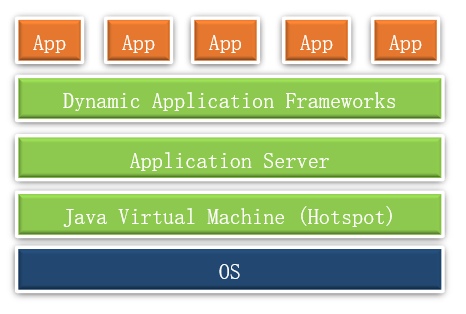

随着 Kubernetes 和容器的发展，虽然不少应用已经实现了容器化运行，但 Java 堆栈并没有太大变化，如下图 2 所示。

图 2\. Kubernetes 时代的 Java 应用架构

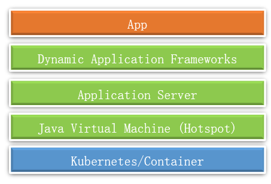

开发人员认为 Java 过重：启动时间慢、消耗内存大，不适合于云原生时代。他们希望使用较新的应用框架来构建微服务，以便它们在 Kubernetes 中非常高效地运行。Quarkus 是为了满足这一需求，它是真正针对微服务、无服务器、事件驱动的应用框架。

### Quarkus 的架构

Quarkus 被称为”超音速亚原子 Java”。Quarkus 优化了 Java 框架，使其更具模块化、减少了框架本身的依赖性。Quarkus 基于 GraalVM，也支持 JVM。GraalVM 是一套通用型虚拟机，能执行各类高性能与互操作性任务，并在无需额外成本的前提下允许用户构建多语言应用程序，如下图 3 所示：

图 3\. GraalVM 架构

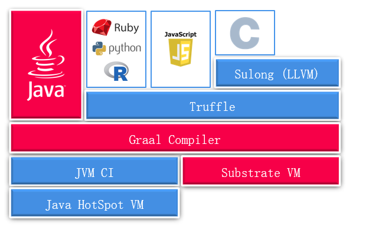

在传统的 JVM 中运行应用启动速度会比较慢。GraalVM 可以为现有基于 JVM 的应用创建 Native Image 的功能（即本机可执行二进制文件）。生成的本机二进制文件以机器代码形式包含整个程序，可以直接运行。

正是由于 Quarkus 本身针对传统 Java 进行了优化，同时它可以运行在 GraalVM 上，因此它的启动速度很快、运行时消耗的内存很小。针对 Quarkus 的特点，总结如下：

- 容器优先：最小的 Java 应用程序，最适合在容器中运行。
- Cloud Native：符合微服务 12 要素架构。
- 统一命令式和响应式：在一种编程模型下实现非阻塞式和命令式开发风格。
- 基于标准：支持多种的标准和框架（RESTEasy，Hibernate，Netty，Eclipse Vert.x，Apache Camel）。
- 微服务优先：缩短了启动时间，使 Java 应用程序可以执行代码转换。

接下来，我们通过实验的方式，验证基于 Quarkus 的特性。

## 验证 Quarkus 功能

我们采用如下实验环境来验证 Quarkus：

- RHEL 7.6
- Quarkus 0.21.2
- OpenShift 3.11
- Graal VM 19.1.1

接下来，我们通过实验环境分别验证：

- 编译和部署 Quarkus 应用
- Quarkus 的热加载
- 在 OpenShift 中部署 Quarkus 应用程序
- Quarkus 添加 Rest Client 扩展
- Quarkus 容错能力

## 编译和部署 Quarkus 应用

实验环境是由两个节点（RHEL7.6）组成的 OpenShift 集群，如清单 1 所示：

清单 1\. 查看 OpenShift 集群

```
[root@master ~]# oc get nodes
NAME                 STATUS    ROLES          AGE       VERSION
master.example.com   Ready     infra,master   339d      v1.11.0+d4cacc0
node.example.com     Ready     compute        339d      v1.11.0+d4cacc0

```

Show moreShow more icon

从 github 上下载 Quarkus 测试代码，如清单 2 所示：

清单 2\. 下载 Quarkus 测试代码

```
[root@master ~]# git clone https://github.com/redhat-developer-demos/quarkus-tutorial
Cloning into 'quarkus-tutorial'...
remote: Enumerating objects: 86, done.
remote: Counting objects: 100% (86/86), done.
remote: Compressing objects: 100% (60/60), done.
Receiving objects: 100% (888/888), 1.36 MiB | 73.00 KiB/s, done.
remote: Total 888 (delta 44), reused 56 (delta 21), pack-reused 802
Resolving deltas: 100% (439/439), done.

```

Show moreShow more icon

在 OpenShift 中创建项目 quarkustutorial，用于后续部署容器化应用。

```
[root@master ~]# oc new-project quarkustutorial

```

Show moreShow more icon

设置环境变量，如清单 3 所示：

清单 3\. 设置环境变量

```
[root@master ~]# cd quarkus-tutorial
[root@master quarkus-tutorial]# export TUTORIAL_HOME=`pwd`
[root@master quarkus-tutorial]# export QUARKUS_VERSION=0.21.2

```

Show moreShow more icon

在 RHEL 中创建 Quarkus 项目，如清单 4 所示：

清单 4\. 创建 Quarkus 项目

```
mvn io.quarkus:quarkus-maven-plugin:$QUARKUS_VERSION:create \
  -DprojectGroupId="com.example" \
  -DprojectArtifactId="fruits-app" \
  -DprojectVersion="1.0-SNAPSHOT" \
  -DclassName="FruitResource" \
  -Dpath="fruit"

```

Show moreShow more icon

创建成功结果如图 4 所示：

图 4\. 成功创建 Quarkus 项目

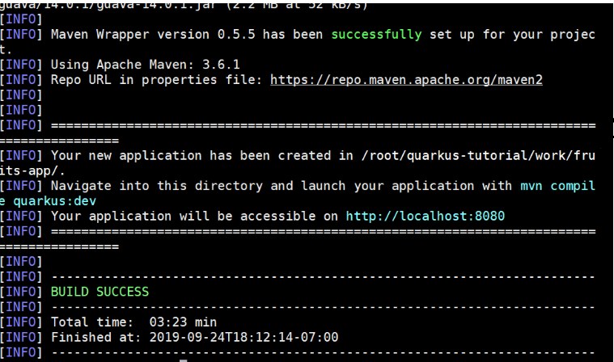

查看项目中生成的文件，如清单 5 所示：

清单 5\. Quarkus 项目内容

```
[root@master quarkus-tutorial]# ls -al /root/quarkus-tutorial/work/fruits-app/.
total 32
drwxr-xr-x. 4 root root   111 Sep 24 18:12 .
drwxr-xr-x. 3 root root    41 Sep 24 18:08 ..
-rw-r--r--. 1 root root    53 Sep 24 18:11 .dockerignore
-rw-r--r--. 1 root root   295 Sep 24 18:11 .gitignore
drwxr-xr-x. 3 root root    21 Sep 24 18:12 .mvn
-rwxrwxr-x. 1 root root 10078 Sep 24 18:12 mvnw
-rw-rw-r--. 1 root root  6609 Sep 24 18:12 mvnw.cmd
-rw-r--r--. 1 root root  3693 Sep 24 18:11 pom.xml
drwxr-xr-x. 4 root root    30 Sep 24 18:11 src

```

Show moreShow more icon

我们查看应用的源码，如清单 6 所示：

```
#cat src/main/java/com/example/FruitResource.java

```

Show moreShow more icon

清单 6\. 查看应用源代码

```
package com.example;
import javax.ws.rs.GET;
import javax.ws.rs.Path;
import javax.ws.rs.Produces;
import javax.ws.rs.core.MediaType;

@Path("/fruit")
public class FruitResource {

    @GET
    @Produces(MediaType.TEXT_PLAIN)
    public String hello() {
        return "hello";
    }
}

```

Show moreShow more icon

上面代码定义了定了一个名为 /fruit 的 URI，通过 get 访问时返回 “hello”。

接下来，我们分别通过 JVM 和 Native 方式生成并运行 Quarkus 应用程序。

首先通过传统的 JVM 模式生成应用，编译成功结果如图 5 所示：

```
./mvnw -DskipTests clean package

```

Show moreShow more icon

图 5\. 源码编译成功

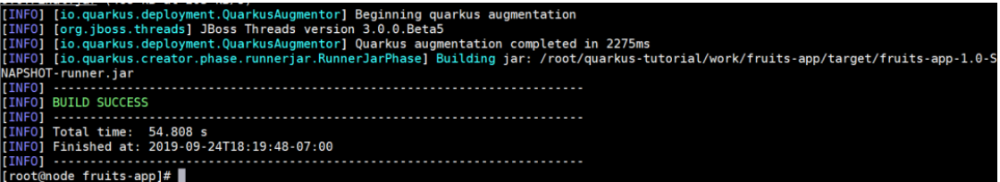

查看编译生成的 jar 文件，如清单 7 所示：

清单 7\. 查看生成的应用

```
[root@node fruits-app]# ls -al target/fruits-app-1.0-SNAPSHOT-runner.jar
-rw-r--r--. 1 root root 114363 Sep 24 18:19 target/fruits-app-1.0-SNAPSHOT-runner.jar

```

Show moreShow more icon

接下来，以 JVM 的方式运行应用，如清单 8 所示：

清单 8\. 运行应用

```
[root@node fruits-app]# java -jar target/fruits-app-1.0-SNAPSHOT-runner.jar
2019-09-24 18:20:29,785 INFO  [io.quarkus] (main) Quarkus 0.21.2 started in 1.193s. Listening on: http://[::]:8080
2019-09-24 18:20:29,837 INFO  [io.quarkus] (main) Installed features: [cdi, resteasy]

```

Show moreShow more icon

应用运行以后， 通过浏览器访问应用，可以看到返回值是 hello，如图 6 所示：

图 6\. 浏览器访问应用

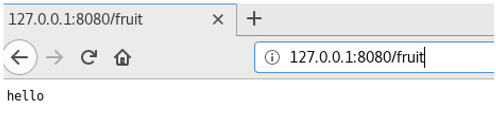

接下来，我们验证 Docker-Native 的模式来编辑应用，生成二进制文件。在编译的过程会使用红帽提供的 docker image，构建成功后在 target 目录中生成独立的二进制文件。执行如下命令启动编译：

```
[root@node fruits-app]# ./mvnw package -DskipTests -Pnative -Dquarkus.native.container-build=true

```

Show moreShow more icon

编译过程如图 7 所示，Quarkus 的 Docker-Native 编译过程会先生成 jar 文件 fruits-app-1.0-SNAPSHOT-runner.jar（这个 jar 文件和基于 JVM 方式编译成功的 jar 文件有所区别）。然后调用红帽的容器镜像 ubi-quarkus-native-image，从 jar 文件生成二进制可执行文件 fruits-app-1.0-SNAPSHOT-runner，如图 7 所示：

图 7\. Quarkus Docker-Native 编译过程

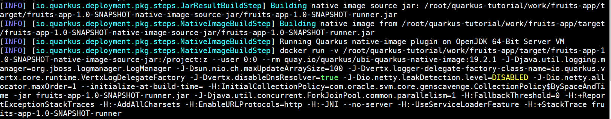

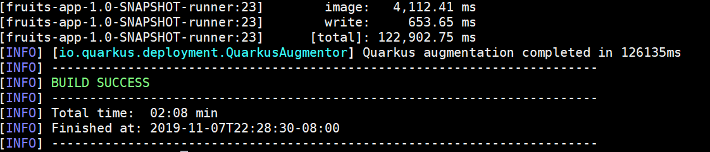

点击查看大图

从 fruits-app-1.0-SNAPSHOT-runner.jar 文件到二进制构建过程中会嵌入一些库文件（这些库文件是生成 fruits-app-1.0-SNAPSHOT-runner.jar 文件时产生的），以 class 的形式存到二进制文件中。lib 目录中包含二进制文件 fruits-app-1.0-SNAPSHOT-runner 运行所需要内容，如 org.graalvm.sdk.graal-sdk-19.2.0.1.jar，如清单 9 所示。

清单 9\. 查看为二进制文件构建的库文件

```
[root@node target]# cd fruits-app-1.0-SNAPSHOT-native-image-source-jar
[root@node fruits-app-1.0-SNAPSHOT-native-image-source-jar]# ls
fruits-app-1.0-SNAPSHOT-runner  fruits-app-1.0-SNAPSHOT-runner.jar  lib
[root@node fruits-app-1.0-SNAPSHOT-native-image-source-jar]# ls lib/* |grep -i gra
lib/org.graalvm.sdk.graal-sdk-19.2.0.1.jar

```

Show moreShow more icon

查看生成的二进制文件 fruits-app-1.0-SNAPSHOT-runner，直接在 RHEL7 中运行，如清单 9 所示：

```
[root@node fruits-app]# ls -al target/fruits-app-1.0-SNAPSHOT-runner
-rwxr-xr-x. 1 root root 23092264 Nov  7 22:28 target/fruits-app-1.0-SNAPSHOT-runner
[root@node target]# ./fruits-app-1.0-SNAPSHOT-runner
2019-11-08 06:37:13,852 INFO  [io.quarkus] (main) fruits-app 1.0-SNAPSHOT (running on Quarkus 0.27.0) started in 0.012s. Listening on: http://0.0.0.0:8080
2019-11-08 06:37:13,852 INFO  [io.quarkus] (main) Profile prod activated.
2019-11-08 06:37:13,852 INFO  [io.quarkus] (main) Installed features: [cdi, resteasy]

```

Show moreShow more icon

通过浏览器访问应用，结果正常，如图 8 所示：

图 8\. 应用访问结果

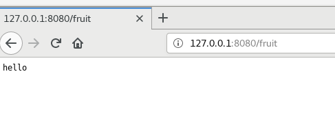

从上面内容我们可以了解到：Quarkus Native 的构建环境需要完整的 GraalVM 环境（RHEL 中安装或以容器方式运行），而编译成功的二进制文件，已经包含 GraalVM 的运行时，可以直接在操作系统或容器中直接运行。

生成的二进制文件也可以用容器的方式运行，即构建 Docker Image。构建有两种方式：基于传统的 JVM 或基于 Native 的方式。

传统 JVM 模式运行的 docker file 如清单 9 所示，我们可以看到 docker file 使用的基础镜像是 openjdk8。

清单 9\. JVM 模式运行的 Docker file

```
[root@node docker]# cat Dockerfile.jvm
FROM fabric8/java-alpine-openjdk8-jre
ENV JAVA_OPTIONS="-Dquarkus.http.host=0.0.0.0 -Djava.util.logging.manager=org.jboss.logmanager.LogManager"
ENV AB_ENABLED=jmx_exporter
COPY target/lib/* /deployments/lib/
COPY target/*-runner.jar /deployments/app.jar
EXPOSE 8080

# run with user 1001 and be prepared for be running in OpenShift too
RUN adduser -G root --no-create-home --disabled-password 1001 \
&& chown -R 1001 /deployments \
&& chmod -R "g+rwX" /deployments \
&& chown -R 1001:root /deployments
USER 1001

ENTRYPOINT [ "/deployments/run-java.sh" ]

```

Show moreShow more icon

Native 模式运行的 docker file 如清单 10 所示，使用的基础镜像是 ubi-minimal。UBI 的全称是：Universal Base Image，这是红帽 RHEL 最轻量级的基础容器镜像。

清单 10\. Native 模式运行的 Docker file

```
[root@node docker]# cat Dockerfile.native
FROM registry.access.redhat.com/ubi8/ubi-minimal
WORKDIR /work/
COPY target/*-runner /work/application
RUN chmod 775 /work
EXPOSE 8080
CMD ["./application", "-Dquarkus.http.host=0.0.0.0"]

```

Show moreShow more icon

在构建的时候，推荐使用 Dockerfile.native 模式构建 docker image，构建并运行的命令如下：

```
[root@node fruits-app]# docker build -f src/main/docker/Dockerfile.native -t example/fruits-app:1.0-SNAPSHOT . && \
> docker run -it --rm -p 8080:8080 example/fruits-app:1.0-SNAPSHOT

```

Show moreShow more icon

命令执行结果如下图 9 所示：

图 9\. Native 模式构建应用的 docker image

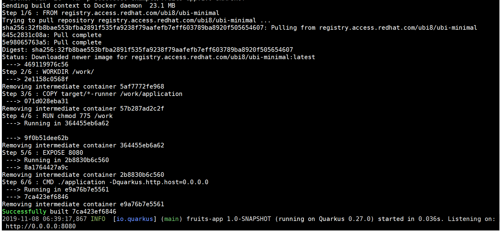

查看容器运行情况，可以正常运行，docker image 的名称是 fruits-app:1.0-SNAPSHOT。

```
[root@node ~]# docker ps
CONTAINER ID        IMAGE                             COMMAND                  CREATED             STATUS              PORTS                    NAMES
ae46922cd0cf        example/fruits-app:1.0-SNAPSHOT   "./application -Dq..."   57 seconds ago      Up 57 seconds       0.0.0.0:8080->8080/tcp   nervous_bartik

```

Show moreShow more icon

至此，我们完成了 Quarkus 应用构建和运行的验证。

## Quarkus 的热加载

接下来，我们验证 Quarkus 应用在开发模式的热加载功能。以开发模式启动应用后，修改应用源代码无需重新编译和重新运行，应用而直接生效。如果是 web 应用，在前台刷新浏览器即可看到更新结果。Quarkus 的开发模式非常适合应用调试阶段、经常需要调整源码并验证效果的需求。

以开发模式编译并热部署应用，如清单 11 所示：

清单 11\. 通过开发模式启动应用

```
[root@master fruits-app]# ./mvnw compile quarkus:dev
[INFO] Scanning for projects...
[INFO]
[INFO] -----------------------< com.example:fruits-app >-----------------------
[INFO] Building fruits-app 1.0-SNAPSHOT
[INFO] --------------------------------[ jar ]---------------------------------
[INFO]
[INFO] --- maven-resources-plugin:2.6:resources (default-resources) @ fruits-app ---
[INFO] Using 'UTF-8' encoding to copy filtered resources.
[INFO] Copying 2 resources
[INFO]
[INFO] --- maven-compiler-plugin:3.1:compile (default-compile) @ fruits-app ---
[INFO] Nothing to compile - all classes are up to date
[INFO]
[INFO] --- quarkus-maven-plugin:0.21.2:dev (default-cli) @ fruits-app ---
Listening for transport dt_socket at address: 5005
2019-09-24 21:18:06,422 INFO  [io.qua.dep.QuarkusAugmentor] (main) Beginning quarkus augmentation
2019-09-24 21:18:07,572 INFO  [io.qua.dep.QuarkusAugmentor] (main) Quarkus augmentation completed in 1150ms
2019-09-24 21:18:07,918 INFO  [io.quarkus] (main) Quarkus 0.21.2 started in 1.954s. Listening on: http://[::]:8080
2019-09-24 21:18:07,921 INFO  [io.quarkus] (main) Installed features: [cdi, resteasy]

```

Show moreShow more icon

应用启动成功后，通过浏览器访问效果如图 10 所示：

图 10\. 应用访问结果


接下来，修改源码文件 src/main/java/com/example/FruitResource.java，将访问返回从 “hello” 修改为 “hello Davidwei!”，如清单 12 所示：

清单 12\. 修改应用源代码

```
package com.example;

import javax.ws.rs.GET;
import javax.ws.rs.Path;
import javax.ws.rs.Produces;
import javax.ws.rs.core.MediaType;

@Path("/fruit")
public class FruitResource {

    @GET
    @Produces(MediaType.TEXT_PLAIN)
    public String hello() {
        return "hello Davidwei!";
    }
}

```

Show moreShow more icon

直接刷新浏览器，如图 11 所示，我们看到浏览的返回与此前在源码中修改的内容一致。

图 11\. 应用访问结果


至此，我们验证完了 Quarkus 应用的热加载功能。

## 在 OpenShift 中部署 Quarkus 应用程序

要将 Quarkus 应用部署到 OpenShift 中，首先需要添加 Quarkus Kubernetes 扩展（清单 13 中包含）。

### Quarkus 扩展

Quarkers 的扩展是一组依赖项，可以将它们添加到 Quarkus 项目中，从而获得特定的功能，例如健康检查等。扩展将配置或引导框架或技术集成到 Quarkus 应用程序中。通过命令行可以列出 Quarkers 可用和支持的扩展，如清单 13 所示：

清单 13\. 查看 Quarkus 扩展

```
[root@master fruits-app]# ./mvnw quarkus:list-extensions
[INFO] Scanning for projects...
[INFO]
[INFO] -----------------------< com.example:fruits-app >-----------------------
[INFO] Building fruits-app 1.0-SNAPSHOT
[INFO] --------------------------------[ jar ]---------------------------------
[INFO]
[INFO] --- quarkus-maven-plugin:0.21.2:list-extensions (default-cli) @ fruits-app ---

Current Quarkus extensions available:
Agroal - Database connection pool                  quarkus-agroal
Amazon DynamoDB                                    quarkus-amazon-dynamodb
Apache Kafka Client                                quarkus-kafka-client
Apache Kafka Streams                               quarkus-kafka-streams
Apache Tika                                        quarkus-tika
Arc                                                quarkus-arc
AWS Lambda                                         quarkus-amazon-lambda
Flyway                                             quarkus-flyway
Hibernate ORM                                      quarkus-hibernate-orm
Hibernate ORM with Panache                         quarkus-hibernate-orm-panache
Hibernate Search + Elasticsearch                   quarkus-hibernate-search-elasticsearch
Hibernate Validator                                quarkus-hibernate-validator
Infinispan Client                                  quarkus-infinispan-client
JDBC Driver - H2                                   quarkus-jdbc-h2
JDBC Driver - MariaDB                              quarkus-jdbc-mariadb
JDBC Driver - PostgreSQL                           quarkus-jdbc-postgresql
Jackson                                            quarkus-jackson
JSON-B                                             quarkus-jsonb
JSON-P                                             quarkus-jsonp
Keycloak                                           quarkus-keycloak
Kogito                                             quarkus-kogito
Kotlin                                             quarkus-kotlin
Kubernetes                                         quarkus-kubernetes
Kubernetes Client                                  quarkus-kubernetes-client
Mailer                                             quarkus-mailer
MongoDB Client                                     quarkus-mongodb-client
Narayana JTA - Transaction manager                 quarkus-narayana-jta
Neo4j client                                       quarkus-neo4j
Reactive PostgreSQL Client                         quarkus-reactive-pg-client
RESTEasy                                           quarkus-resteasy
RESTEasy - JSON-B                                  quarkus-resteasy-jsonb
RESTEasy - Jackson                                 quarkus-resteasy-jackson
Scheduler                                          quarkus-scheduler
Security                                           quarkus-elytron-security
Security OAuth2                                    quarkus-elytron-security-oauth2
SmallRye Context Propagation                       quarkus-smallrye-context-propagation
SmallRye Fault Tolerance                           quarkus-smallrye-fault-tolerance
SmallRye Health                                    quarkus-smallrye-health
SmallRye JWT                                       quarkus-smallrye-jwt
SmallRye Metrics                                   quarkus-smallrye-metrics
SmallRye OpenAPI                                   quarkus-smallrye-openapi
SmallRye OpenTracing                               quarkus-smallrye-opentracing
SmallRye Reactive Streams Operators                quarkus-smallrye-reactive-streams-operators
SmallRye Reactive Type Converters                  quarkus-smallrye-reactive-type-converters
SmallRye Reactive Messaging                        quarkus-smallrye-reactive-messaging
SmallRye Reactive Messaging - Kafka Connector      quarkus-smallrye-reactive-messaging-kafka
SmallRye Reactive Messaging - AMQP Connector       quarkus-smallrye-reactive-messaging-amqp
REST Client                                        quarkus-rest-client
Spring DI compatibility layer                      quarkus-spring-di
Spring Web compatibility layer                     quarkus-spring-web
Swagger UI                                         quarkus-swagger-ui
Undertow                                           quarkus-undertow
Undertow WebSockets                                quarkus-undertow-websockets
Eclipse Vert.x                                     quarkus-vertx

```

Show moreShow more icon

添加 Quarkus Kubernetes 扩展，该扩展使用 Dekorate 生成默认的 Kubernetes 资源模板，如清单 14 所示：

清单 14\. 添加 Quarkus Kubernetes 扩展

```
[root@master fruits-app]# ./mvnw quarkus:add-extension -Dextensions="quarkus-kubernetes"
[INFO] Scanning for projects...
[INFO]
[INFO] -----------------------< com.example:fruits-app >-----------------------
[INFO] Building fruits-app 1.0-SNAPSHOT
[INFO] --------------------------------[ jar ]---------------------------------
[INFO]
[INFO] --- quarkus-maven-plugin:0.21.2:add-extension (default-cli) @ fruits-app ---
Adding extension io.quarkus:quarkus-kubernetes
[INFO] ------------------------------------------------------------------------
[INFO] BUILD SUCCESS
[INFO] ------------------------------------------------------------------------
[INFO] Total time:  2.466 s
[INFO] Finished at: 2019-09-24T23:27:21-07:00
[INFO] ------------------------------------------------------------------------

```

Show moreShow more icon

配置用于部署到 OpenShift 的容器和组和名称，将以下属性加到 src/main/resources /application.properties，如清单 15 所示：

清单 15\. 添加应用参数

```
[root@master resources]# cat application.properties
quarkus.kubernetes.group=example
quarkus.application.name=fruits-app

```

Show moreShow more icon

接下来，运行 Maven 目标来生成 Kubernetes 资源，命令执行结果如图 12 所示：

```
./mvnw package -DskipTests

```

Show moreShow more icon

图 12\. 生成 Kubernetes 资源

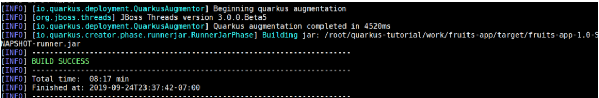

接下来，我们检查自动生成的 Kubernetes 资源，如清单 16 所示（这里使用上面步骤中生成的容器镜像 fruits-app:1.0-SNAPSHOT）：

清单 16\. 查看生成的 Kubernetes 资源

```
[root@master fruits-app]# cat target/wiring-classes/META-INF/kubernetes/kubernetes.yml
---
apiVersion: "v1"
kind: "List"
items:
- apiVersion: "v1"
kind: "Service"
metadata:
    labels:
      app: "fruits-app"
      version: "1.0-SNAPSHOT"
      group: "example"
    name: "fruits-app"
spec:
    ports:
    - name: "http"
      port: 8080
      targetPort: 8080
    selector:
      app: "fruits-app"
      version: "1.0-SNAPSHOT"
      group: "example"
    type: "ClusterIP"
- apiVersion: "apps/v1"
kind: "Deployment"
metadata:
    labels:
      app: "fruits-app"
      version: "1.0-SNAPSHOT"
      group: "example"
    name: "fruits-app"
spec:
    replicas: 1
    selector:
      matchLabels:
        app: "fruits-app"
        version: "1.0-SNAPSHOT"
        group: "example"
    template:
      metadata:
        labels:
          app: "fruits-app"
          version: "1.0-SNAPSHOT"
          group: "example"
      spec:
        containers:
        - env:
          - name: "KUBERNETES_NAMESPACE"
            valueFrom:
              fieldRef:
                fieldPath: "metadata.namespace"
          image: "example/fruits-app:1.0-SNAPSHOT"
          imagePullPolicy: "IfNotPresent"
          name: "fruits-app"
          ports:
          - containerPort: 8080
            name: "http"
            protocol: "TCP"

```

Show moreShow more icon

在 OpenShift 中应用 Kubernetes 资源：

```
[root@master fruits-app]# oc apply -f  target/wiring-classes/META-INF/kubernetes/kubernetes.yml
service/fruits-app created
deployment.apps/fruits-app created

```

Show moreShow more icon

执行上述命令后，包含应用的 pod 会被自动创建，如图 13 所示：

图 13\. 查看生成的 pod

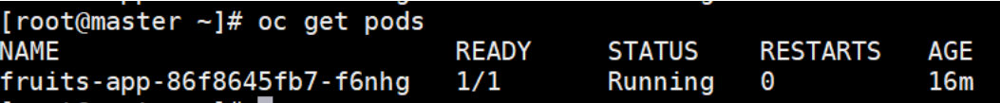

在 OpenShift 中创建路由。

```
[root@master ~]# oc expose service fruits-app
route.route.openshift.io/fruits-app exposed

```

Show moreShow more icon

通过 curl 验证调用应用 fruit URI 的返回值，确保应用运行正常：

```
[root@master ~]# SVC_URL=$(oc get routes fruits-app -o jsonpath='{.spec.host}')

[root@master ~]# curl $SVC_URL/fruit
Hello DavidWei!

```

Show moreShow more icon

至此，我们成功将 Quarkus 应用部署到了 OpenShift 上。

## Quarkus 应用添加 Rest Client 扩展

在微服务架构中，应用如果要访问外部 RESTful Web 服务，Quarkus 需要按照 MicroProfile Rest Client 规范提供 Rest 客户端。

针对 fruits-app，我们创建一个可以访问 `https://www.fruityvice.com/` 的 Rest 客户端，以获取有关水果的营养成分。我们查看 RESTful Web 服务的页面，通过 get 方式可以查看所有水果的相信信息，如图 14 所示：

图 14\. 通过 RESTful Web 应用查看所有水果信息

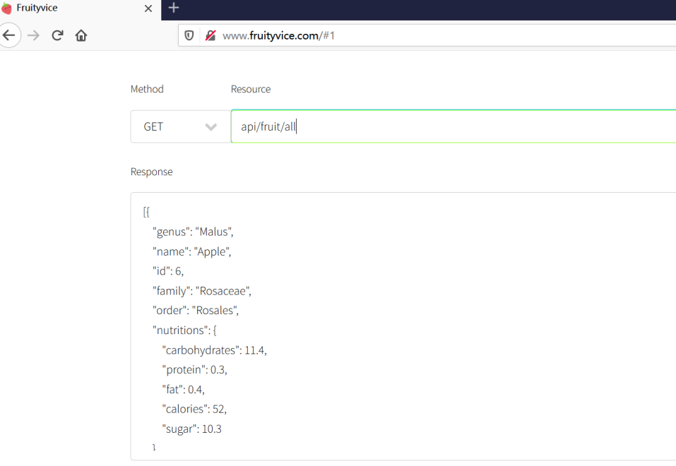

查看香蕉的营养成分，如图 15 所示：

图 15\. 通过 RESTful Web 应用查看香蕉的营养成分

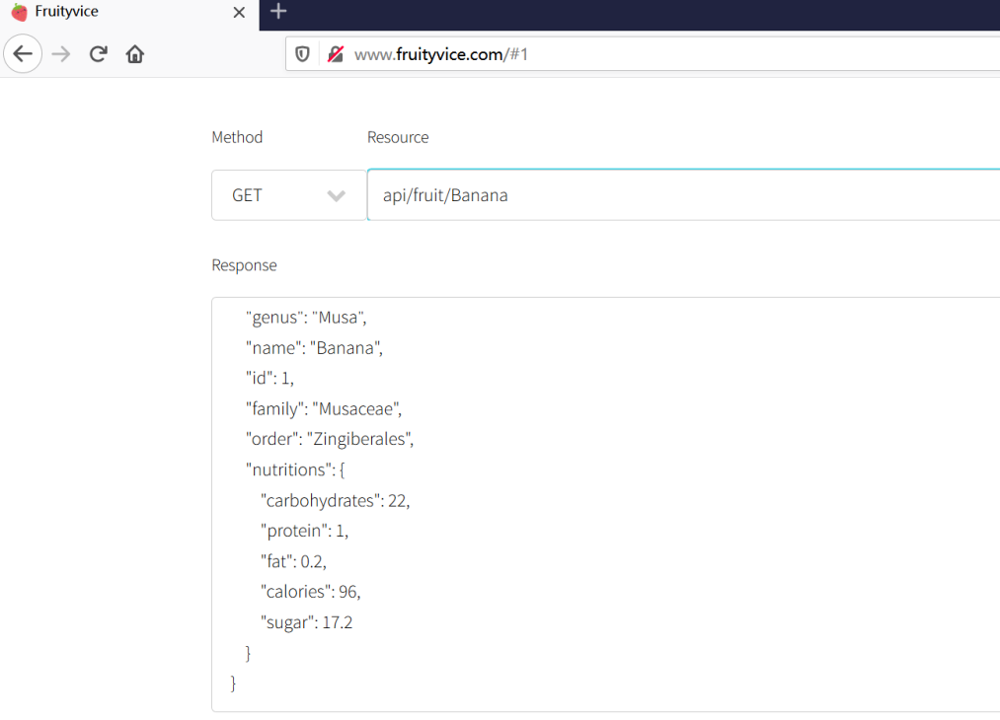

为了让 fruits-app 应用能够访问 RESTful Web 应用，我们将其添加 Rest Client 和 JSON-B 扩展（quarkus-rest-client、quarkus-resteasy-jsonb）。运行以下命令进行添加，执行结果如图 16 所示：

```
./mvnw quarkus:add-extension -Dextension="quarkus-rest-client, quarkus-resteasy-jsonb"

```

Show moreShow more icon

图 16\. 为 Quarkus 应用添加 Rest Client 和 JSON-B 扩展

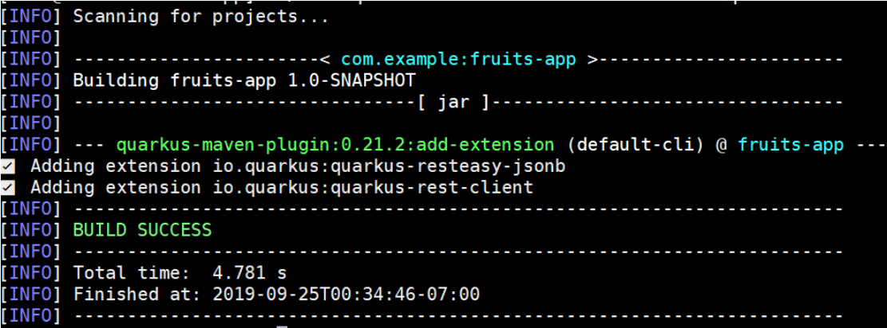

我们还需要创建一个 POJO 对象，该对象用于将 JSON 消息从 `https://www.fruityvice.com/` 反序列化为 Java 对象。

在 src/main/java/com/example 中创建

为 FruityVice 的新 Java 文件，其内容如清单 17 所示：

清单 17\. 创建 FruityVice Java 文件

```
[root@master example]# cat FruityVice
package com.example;

public class FruityVice {

    public static FruityVice EMPTY_FRUIT = new FruityVice();

    private String name;
    private Nutritions nutritions;

    public String getName() {
        return name;
    }

    public void setName(String name) {
        this.name = name;
    }

    public Nutritions getNutritions() {
        return nutritions;
    }

    public void setNutritions(Nutritions nutritions) {
        this.nutritions = nutritions;
    }

    public static class Nutritions {
        private double fat;
        private int calories;

        public double getFat() {
            return fat;
        }

        public void setFat(double fat) {
            this.fat = fat;
        }

        public int getCalories() {
            return calories;
        }

        public void setCalories(int calories) {
            this.calories = calories;
        }

    }
}

```

Show moreShow more icon

接下来创建一个 Java 接口，该接口充当代码和外部服务之间的客户端。在 src/main/java/com/example 中创建

为 FruityViceService 的新 Java 文件，内容如清单 18 所示：

清单 18\. 创建 FruityViceService Java 文件

```
[root@master example]# cat FruityViceService
package com.example;

import java.util.List;

import javax.ws.rs.GET;
import javax.ws.rs.Path;
import javax.ws.rs.PathParam;
import javax.ws.rs.Produces;
import javax.ws.rs.core.MediaType;

import org.eclipse.microprofile.rest.client.inject.RegisterRestClient;

@Path("/api")
@RegisterRestClient
public interface FruityViceService {

    @GET
    @Path("/fruit/all")
    @Produces(MediaType.APPLICATION_JSON)
    public List<FruityVice> getAllFruits();

    @GET
    @Path("/fruit/{name}")
    @Produces(MediaType.APPLICATION_JSON)
    public FruityVice getFruitByName(@PathParam("name") String name);

}

```

Show moreShow more icon

配置 FruityVice 服务，将以下属性添加到 src/main/resources/application.properties 文件中，如清单 19 所示：

清单 19\. 修改应用参数文件

```
[root@master fruits-app]# cat src/main/resources/application.properties
quarkus.kubernetes.group=example
quarkus.application.name=fruits-app
com.example.FruityViceService/mp-rest/url=http://www.fruityvice.com

```

Show moreShow more icon

最后，修改 src/main/java/com/example/FruitResource.java，增加 FruityViceService 的调用，如清单 20 所示：

清单 20\. 修改应用源码文件

```
[root@master fruits-app]# cat src/main/java/com/example/FruitResource.java
package com.example;

import javax.ws.rs.GET;
import javax.ws.rs.Path;
import javax.ws.rs.PathParam;
import javax.ws.rs.Produces;
import javax.ws.rs.core.MediaType;

import org.eclipse.microprofile.rest.client.inject.RestClient;

import com.example.FruityViceService;

@Path("/fruit")
public class FruitResource {

    @GET
    @Produces(MediaType.TEXT_PLAIN)
    public String hello() {
        return "hello";
    }

@RestClient
FruityViceService fruityViceService;
@Path("{name}")
@GET
@Produces(MediaType.APPLICATION_JSON)
public FruityVice getFruitInfoByName(@PathParam("name") String name) {
    return fruityViceService.getFruitByName(name);
}
}

```

Show moreShow more icon

我们以开发模式启动应用程序，命令执行结果如图 17 所示：

```
./mvnw compile quarkus:dev

```

Show moreShow more icon

图 17\. 以开发模式启动应用

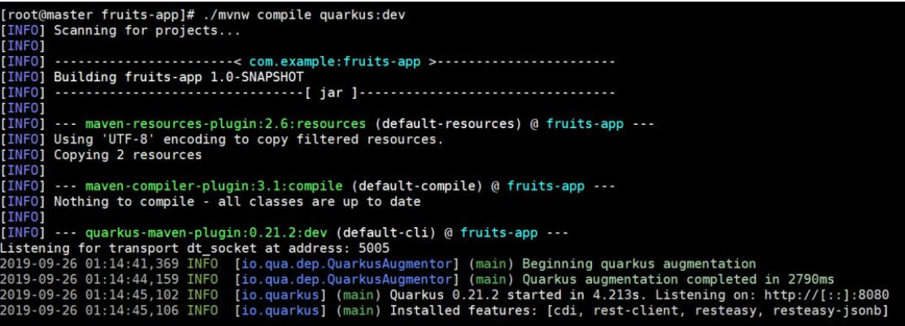

我们通过浏览器访问应用，查看香蕉的营养成分，成功返回信息，如图 18 所示：

图 18\. 访问应用查看香蕉的影响成分

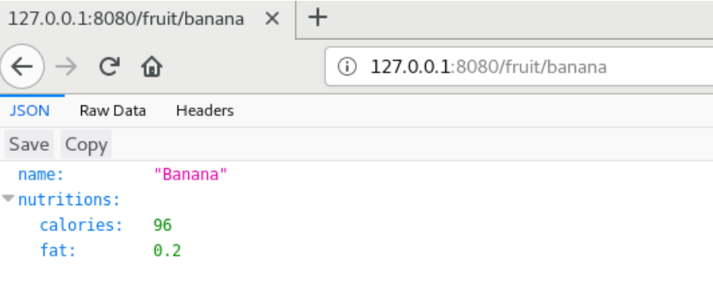

至此，我们成功验证了为 Quarkus 应用添加 Rest Client 扩展。

## Quarkus 应用的容错能力

在微服务中，容错是非常重要的。在以往的方法中，我可以通过微服务治理框架来实现（如 Spring Cloud）；在 Quarkus 应用中，Quarkus 与 MicroProfile Fault Tolerance 规范集成提供原生的容错功能。

我们为 Quarkus 应用程序添加 Fault Tolerance 扩展（quarkus-smallrye-fault-tolerance），执行如下命令，执行结果如图 19 所示：

```
./mvnw quarkus:add-extension -Dextension="quarkus-smallrye-fault-tolerance"

```

Show moreShow more icon

图 19\. 为 Quarkus 添加 Fault Tolernace 扩展

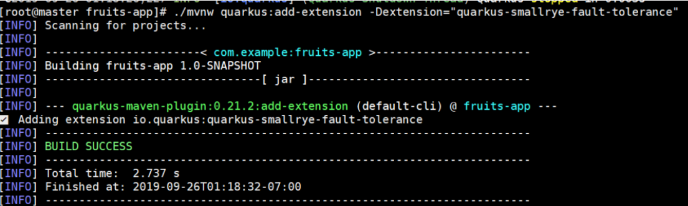

接下来在 FruityViceService 中添加重试策略。添加 `org.eclipse.microprofile.faulttolerance.Retry` 到源码文件 `src/main/java/java/com/example/FruityViceService.java` 中，并添加错误重试的次数和时间（maxRetries = 3, delay = 2000）如清单 21 所示：

清单 21\. 修改应用源码文件

```
package com.example;
import java.util.List;

import javax.ws.rs.GET;
import javax.ws.rs.Path;
import javax.ws.rs.PathParam;
import javax.ws.rs.Produces;
import javax.ws.rs.core.MediaType;

import org.eclipse.microprofile.faulttolerance.Retry;
import org.eclipse.microprofile.rest.client.inject.RegisterRestClient;

@Path("/api")
@RegisterRestClient
public interface FruityViceService {

    @GET
    @Path("/fruit/all")
    @Produces(MediaType.APPLICATION_JSON)
    public List<FruityVice> getAllFruits();

    @GET
    @Path("/fruit/{name}")
    @Produces(MediaType.APPLICATION_JSON)
    @Retry(maxRetries = 3, delay = 2000)
    public FruityVice getFruitByName(@PathParam("name") String name);

}

```

Show moreShow more icon

完成配置后，如果访问应用出现任何错误，将自动执行 3 次重试，两次重试之间等待 2 秒钟。

接下来，我们以开发模式编译并加载应用。

```
./mvnw compile quarkus:dev

```

Show moreShow more icon

应用启动后，将实验环境访问外部互联网的连接断掉，并再次对应用发起请求：`http://localhost:8080/fruit/banana`。在等待大约 6 秒后（3 次重试，每次等待 2 秒）后，将会出发异常报错，这符合我们的预期，如清单 22 所示：

清单 22\. 访问应用异常报错

```
Caused by: javax.ws.rs.ProcessingException: RESTEASY004655: Unable to invoke request: java.net.UnknownHostException: www.fruityvice.com
Caused by: java.net.UnknownHostException: www.fruityvice.com

```

Show moreShow more icon

有时候，我们并不需要在应用前台报错时显示代码内部内容。出于这个目的，我们修改源 `FruityViceService`，添加 `org.eclipse.microprofile.faulttolerance.Fallback`，使用 MicroProfile 的 Fallback 框架，这样当应用无法访问时，返回空`（return FruityVice.EMPTY_FRUIT;）`，如清单 23 所示：

清单 23\. 访问应用异常报错

```
package com.example;

import java.util.List;

import javax.ws.rs.GET;
import javax.ws.rs.Path;
import javax.ws.rs.PathParam;
import javax.ws.rs.Produces;
import javax.ws.rs.core.MediaType;

import org.eclipse.microprofile.faulttolerance.ExecutionContext;
import org.eclipse.microprofile.faulttolerance.Fallback;
import org.eclipse.microprofile.faulttolerance.FallbackHandler;
import org.eclipse.microprofile.faulttolerance.Retry;
import org.eclipse.microprofile.rest.client.inject.RegisterRestClient;

@Path("/api")
@RegisterRestClient
public interface FruityViceService {

    @GET
    @Path("/fruit/all")
    @Produces(MediaType.APPLICATION_JSON)
    public List<FruityVice> getAllFruits();

    @GET
    @Path("/fruit/{name}")
    @Produces(MediaType.APPLICATION_JSON)
    @Retry(maxRetries = 3, delay = 2000)
    @Fallback(value = FruityViceRecovery.class)
    public FruityVice getFruitByName(@PathParam("name") String name);

    public static class FruityViceRecovery implements FallbackHandler<FruityVice> {

    @Override
    public FruityVice handle(ExecutionContext context) {
        return FruityVice.EMPTY_FRUIT;
}

}

}

```

Show moreShow more icon

我们断开对外部互联网的访问，再次访问应用，当超时以后，返回空值，如图 20 所示：

图 20\. 应用访问返回空值

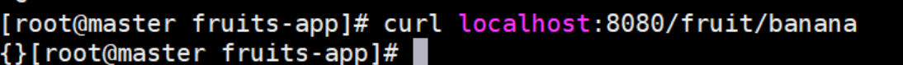

截止到目前，我们验证完了 Quarkus 应用的容错能力。

## 结束语

通过本文，相信您对 Quarkus 架构有了一定的理解。随着云原生的理念不断普及，相信越来越多的 Java 开发者会关注 Quarkus 架构。而 Quarkus 的轻量级和性能高的优势，也势必会在未来云原生应用中大放异彩！