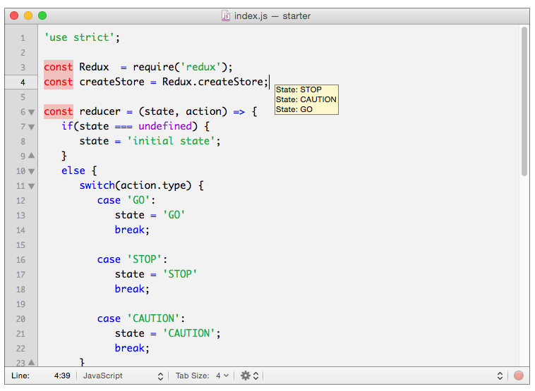
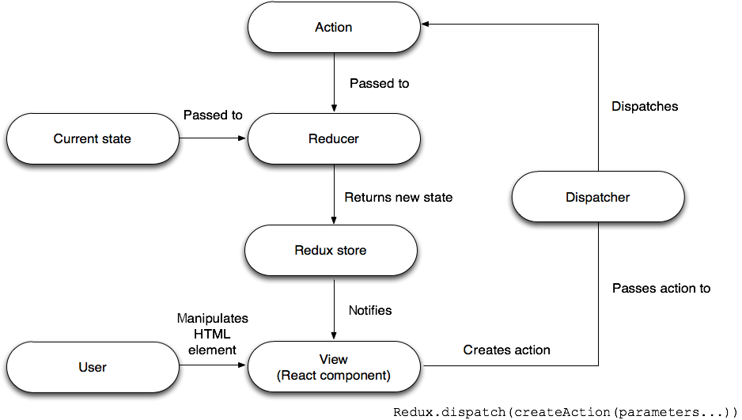
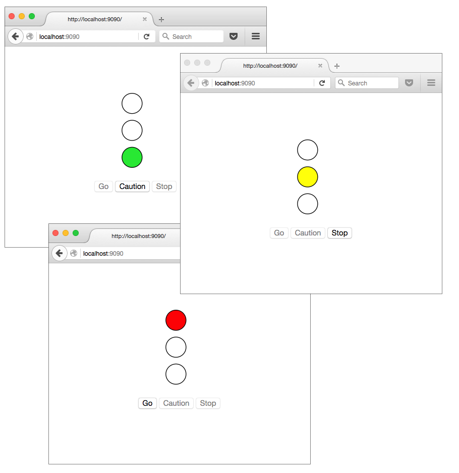

# Redux 简介
掌握 JavaScript 应用程序的状态

**标签:** JavaScript,React,Web 开发

[原文链接](https://developer.ibm.com/zh/articles/wa-manage-state-with-redux-p1-david-geary/)

David Geary

发布: 2016-10-12

* * *

状态管理是软件开发的最困难方面之一，这使得状态管理错误成为了几乎所有 bug 的源头。本系列将探索 [Redux](http://redux.js.org/index.html) ，这是一个针对 JavaScript 应用程序的 _可预测的状态容器_ 。Redux 不仅有助于状态管理，还使得实现一些高级特性变得很简单，比如无限撤销/重做和实时编辑时间旅行 (live-editing time travel)。

尽管 Redux 来自 [React](https://facebook.github.io/react/) 社区，但它并不依赖于 React。无论有没有 JavaScript 框架，比如 React、Angular、Backbone 或 Cycle.js，都可以使用 Redux。在第一期文章中，首先将了解 Redux 基础知识，学习如何使用它作为独立的状态容器；然后继续探索如何结合使用 Redux 和 React。后续几期文章将介绍更高级的 Redux 场景，在最后一期文章中，将学习如何结合使用 Redux 和 Angular。

## Redux 的工作原理

**安装 Redux**

可通过克隆 GitHub [存储库](https://github.com/reactjs/redux.git) 或通过 npm 来安装 Redux：`npm install redux`

Redux 是 Facebook 的 [Flux](https://facebook.github.io/flux/) 架构的一种简化实现。（ _Redux_ 既是一个表示 “已返回” 的英文单词，也是 _reducer_ \+ _flux_ 的混合词。）Flux 在本质上采用了模型-视图-控制器 (MVC) 的结构，但引入了很高的复杂性。Redux 从 [Elm](http://elm-lang.org/) 借用了 _缩减程序 (reducer)_ 的概念来降低了这一复杂性，Elm 是一个基于不可变数据结构和纯函数的强大的反应式函数编程语言。纯函数是没有副作用的函数，Redux 缩减程序是计算应用程序状态的纯函数。

Redux 有 3 条原则：

- 应用程序状态存储在单个对象中。
- 应用程序状态不可变，只能通过描述状态更改的 _操作_ 彻底替换。
- 缩减程序根据当前状态和某个操作来创建下一个状态。

### 应用程序状态存储在单个对象中

Redux 通过一个 JavaScript 对象管理状态，该对象称为 _数据存储_ ，包含应用程序的所有状态。将状态集中保存在一个对象中，这使得在阅读代码时推断应用程序数据变得更容易。另外，当所有数据都在一个位置时，应用程序更容易调试和测试。将应用程序状态存储在一个对象中，还使持久保存应用程序的整体状态变得更容易。

### 应用程序状态不可变

对于 Redux，您不能修改应用程序状态。而需要使用新状态替换现有状态。新状态由操作指定，操作也是不可变的 JavaScript 对象，用于描述状态更改。

将状态更改封装在不可变的对象中有许多优点。尽管封装状态更改时使用了模式，但封装状态更改远不止使用模式那么简单，所以最好连同引用一起删除。您在本系列文章中将会看到，其中一个优点是能够实现无限撤销和重做 — 实际上类似于时光机。操作也按严格的顺序执行，所以不会发生竞争条件。

### 缩减程序创建一种新状态

缩减程序是纯 JavaScript 函数，它们：

- 根据当前状态和某个操作来创建一个新状态
- 集中化数据变化
- 可处理所有或部分状态
- 可组合和重用

因为它们是纯函数，缩减程序没有副作用 — 所以它们很容易读取、测试和调试。您可以构造缩减程序，轻松实现仅关注整体应用程序状态的一部分的简单缩减程序。

因为应用程序状态不可变，而且因为缩减程序是没有副作用的纯函数，所以 Redux 是一个 _可预测的_ 状态容器：给定任何状态和任何操作，您就可以非常肯定地预测应用程序的下一个状态。Redux 的这种可预测元素是一个非常好的特性，使实现无限撤销/重做和实时编辑时间旅行成为可能。

我们接下来将通过两个示例演示一下 Redux 的基础原理。

## 操作、缩减程序和存储

在图 1 中，一个简单的 Redux 示例（一个交通信号灯模拟器）的代码在 TextMate 文本编辑器中运行。图中 TextMate 生成的工具提示显示了应用程序的输出，其中显示了应用程序的状态（ `STOP` 、 `CAUTION` 或 `GO` ）。

##### 图 1\. 使用 Redux 的交通信号灯状态



图 1 中的代码首先要求使用 Redux 并创建 Redux 存储：

```
const Redux = require('redux');
const createStore = Redux.createStore;
const store = createStore(reducer);

```

Show moreShow more icon

使用 `Redux.createStore()` 函数创建应用程序的存储。每个 Redux 应用程序仅有一个存储，每个存储仅有一个缩减程序。将该缩减程序传递给 `Redux.createStore()` 函数。

应用程序的状态（在本例中为一个具有值 `GO` 、 `STOP` 或 `CAUTION` 的字符串）由 `reducer()` 函数创建。 `reducer()` 函数根据当前状态和某个描述状态更改的操作来返回一个新状态。清单 1 给出了交通信号灯应用程序的缩减程序。请注意，在状态未定义时（也就是初始状态）， `reducer()` 函数将返回 `GO` 。

##### 清单 1\. 交通信号灯应用程序的缩减程序

```
const reducer = (state = 'GO', action) => {
switch(action.type) {
     case 'GO':
        state = 'GO'
        break;

     case 'STOP':
        state = 'STOP'
        break;

     case 'CAUTION':
        state = 'CAUTION';
        break;
}
return state;
}

```

Show moreShow more icon

接下来，该代码定义了 3 个操作对象，每个对应于一个状态，如清单 2 所示。

##### 清单 2\. 交通信号灯操作

```
const cautionAction = {
type: 'CAUTION'
};

const goAction = {
type: 'GO'
};

const stopAction = {
type: 'STOP'
}

```

Show moreShow more icon

最后，如清单 3 所示，应用程序分派操作，通过 Redux 存储的 `getState()` 方法获取当前状态的引用，并将该状态的值打印到控制台。

##### 清单 3\. 分配交通信号灯操作

```
// Dispatch actions....................................................

store.dispatch(stopAction);
console.log('State: ' + store.getState());

store.dispatch(cautionAction);
console.log('State: ' + store.getState());

store.dispatch(goAction);
console.log('State: ' + store.getState());

```

Show moreShow more icon

## 数据流

使用 Redux `store.dispatch()` 函数分派操作时，Redux 将该操作和当前状态一起传递给应用程序的缩减程序。缩减程序创建一个新状态并返回给 Redux。图 2 描绘了该数据流。

##### 图 2\. Redux 数据流



在图 2 中，操作首先调用示意图右下角的 `Redux.dispatch()` 。Redux 分派器将操作分配给应用程序的缩减程序，并将当前状态和操作传递给缩减程序。缩减程序创建新状态并返回给 Redux。最后，Redux 向所有视图组件告知状态已更改，这将导致应用程序被重绘。Redux 通过特定于框架的绑定向视图组件（比如 React 或 Angular 组件）告知状态更改。

## Redux API

整个 Redux API 很简单，仅包含 5 个顶级函数（您已经知道其中一个函数 `Redux.createStore()` ）：

- `Object createStore(_reducer_, _initialState_)` – 创建 Redux 存储。
- `Object combineReducers(_reducers_)` – 将多个缩减程序组合为一个。
- `Object compose(_...functions_)` – 从左向右构造函数。
- `void applyMiddleware(_...middlewares_)` – 应用 Redux 中间件。
- `Object bindActionCreators(_actionCreators_, dispatch)` – 将多个操作创建器绑定到分派函数。

回想一下，Redux 维护着单一缩减程序的引用，该缩减程序负责计算应用程序的整体状态。但在复杂应用程序中维护单个缩减程序函数可能不太实用，尤其是在开发团队协同工作时。顾名思义， `combineReducers()` 函数将多个缩减程序函数组合为一个。然后，您可以控制缩减程序函数的精细水平，各个开发人员可以独立处理这些函数。

借助 Redux `applyMiddleware()` 函数，可以通过拦截分派调用的中间件来扩展 Redux。这个方便的工具使实现各种各样的横切关注点成为可能，从日志记录到异步操作。

在下一期中将会看到，Redux 支持 _操作创建器_ — 创建操作的函数。 `bindActionCreators()` 函数将操作创建器绑定到 Redux `dispatch()` 函数，使构造操作创建器变得很容易。

您已经看到， `createStore()` 函数根据应用程序的缩减程序来创建 Redux 存储。请注意，也可以向 `createStore()` 函数传递初始应用程序状态。拥有存储的引用后，可以调用对象的方法：

- `Object getState()` 返回应用程序的当前状态。
- `void dispatch(_Object action_)` 分派一个操作，触发一次状态更改。
- `replaceReducer(nextReducer)` 替换状态树的缩减程序。
- `subscribe(_Function callback_)` 导致 Redux 调用每次分派的回调方法。

Redux API 就是如此简单。

## 结合使用 Redux 和 React

现在您已经知道了如何在没有框架的情况下使用 Redux，已为学习如何将它与 React 结合使用做好了准备。

图 3 中所示的交通信号灯应用程序使用与前一个版本相同的状态、缩减程序和操作 — 但在本例中它是一个 React 应用程序。

##### 图 3\. 一个交通信号灯



该应用程序表示美国的一处交通信号灯。当信号灯为绿色时，如图 3 中顶部图片中所示，唯一可能的下一个状态是 Caution，所以 Go 和 Stop 按钮被禁用。当信号灯为黄色时，唯一可能的下一个状态是 Stop。当信号灯为红色时，唯一可能的下一个状态是 Go。

应用程序缩减程序和它的操作的代码未更改，但现在分别位于自己的文件中。清单 4 给出了应用程序的入口点的代码。

##### 清单 4\. 入口点 (index.js)

```
import React from 'react';
import ReactDOM from 'react-dom';
import Redux, { createStore } from 'redux';

import { reducer } from './reducer';
import { App } from './app';

const store = createStore(reducer);

const render = () => (
ReactDOM.render(<App store={store}/>,
    document.getElementById('example'))
)

store.subscribe(render);

render(); // initial render

```

Show moreShow more icon

清单 4 的代码使用 ECMAScript 6 (ES6) 导入函数来导入 `React`、`ReactDOM`、`Redux` 和 Redux `createStore()` 函数。

当应用程序启动时，它使用应用程序的缩减程序创建一个 Redux 存储（如 [清单 1](#交通信号灯应用程序的缩减程序) 所示）。接下来，应用程序使用 Redux 存储的 `subscribe()` 方法订阅该存储。当 Redux 存储中的状态更改时，Redux 会调用 `render()` 函数，该函数将呈现 `App` 组件。请注意， 清单 4 中的代码将 Redux 存储设置为一个同名的 `App` 属性。

清单 5 给出了 `App` 组件。

##### 清单 5\. 应用程序 (app.js)

```
import React, { Component } from 'react';
import { Stoplight } from './stoplight';
import { Buttons } from './buttons';

export class App extends Component {
render() {
    return(
      <div>
        <Stoplight store={this.props.store} />
        <Buttons   store={this.props.store} />
      </div>
    )
}
}

```

Show moreShow more icon

`App` 组件进而导入和呈现两个其他的组件（ `Stoplight` 和 `Buttons` ），并将 Redux 存储传递给这些子组件。

清单 6 显示了 `Stoplight` 组件。

##### 清单 6\. stoplight (stoplight.js)

```
import React, { Component } from 'react';

const stopColor = (state) => {
return state == 'STOP' ? 'red' : 'white';
}

const cautionColor = (state) => {
return state == 'CAUTION' ? 'yellow' : 'white';
}

const goColor = (state) => {
return state == 'GO' ? 'rgb(39,232,51)' : 'white';
}

export const Stoplight = ({
store
}) => {
const state = store.getState();

return(
    <div style={{textAlign: 'center'}}>
      <svg height='170'>
        <circle cx='145' cy='60' r='15'
                fill={stopColor(state)}
                stroke='black'/>

        <circle cx='145' cy='100' r='15'
                fill={cautionColor(state)}
                stroke='black'/>

        <circle cx='145' cy='140' r='15'
                fill={goColor(state)}
                stroke='black'/>

      </svg>
    </div>
)
}

```

Show moreShow more icon

`Stoplight` 是一个 React 无状态功能组件，依据应用程序的状态来呈现不同颜色的 SVG 圆圈。该组件从存储的 `getState()` 方法获取状态，随后使用 3 个帮助器方法之一将状态转换为一种颜色。

通过调用 [清单 4](#入口点-index-js) 中 Redux 存储的 `subscribe()` 方法，React 在 Redux 状态更改时呈现交通信号灯。这些状态更改由应用程序的按钮发起。在清单 7 中（ `Buttons` 组件的代码），可以看到按钮如何发起状态更改。

##### 清单 7\. 按钮 (buttons.js)

```
import React, { Component } from 'react';
import { goAction, cautionAction, stopAction } from './actions';

export const Buttons = ({
store
}) => {
const state = store.getState();

return(
    <div style={{textAlign: 'center'}}>
      <button onClick={() => {store.dispatch(goAction)}}
              disabled={state == 'GO' || state == 'CAUTION'}
              style={{cursor: 'pointer'}}>
        Go
      </button>

      <button onClick={() => {store.dispatch(cautionAction)}}
              disabled={state == 'CAUTION' || state == 'STOP'}
              style={{cursor: 'pointer'}}>
        Caution
      </button>

      <button onClick={() => {store.dispatch(stopAction)}}
              disabled={state == 'STOP' || state == 'GO'}
              style={{cursor: 'pointer'}}>
        Stop
      </button>
    </div>

)
}

```

Show moreShow more icon

按钮被呈现时，它调用 Redux 存储的 `getState()` 方法来获取应用程序状态的引用。然后 `Buttons` 组件使用该状态配置按钮的已禁用状态。

当用户单击按钮时，该按钮的 `onClick()` 回调会调用 Redux 存储的 `dispatch()` 方法，并传递一个合适的操作。

## 无状态和相连组件

示例应用程序通过注册一个回调来订阅 Redux 存储，只要存储状态发生更改，Redux 就会调用该回调。该回调呈现整个应用程序。实际上，用户会将整个应用程序连接到 Redux 存储。对于演示用途，连接整个应用程序已足够了，但最好通过 React 的 `forceUpdate()` 函数将 Redux 存储连接到单个组件。

清单 8 给出了交通信号灯应用程序的一个改良的入口点。

##### 清单 8\. 交通信号灯应用程序的改良后的入口点 (index.js)

```
'use strict';

import React from 'react';
import ReactDOM from 'react-dom';
import Redux, { createStore } from 'redux';

import { reducer } from './reducer';
import { App } from './app';

ReactDOM.render(<App store={createStore(reducer)}/>,
                document.getElementById('root'))

```

Show moreShow more icon

将清单 8 与 [清单 4](#入口点-index-js) 比较，可以看到代码不再在应用程序级别上订阅 Redux 存储。

清单 9 是一个实现 `componentWillMount()` 的经过改良的 `Stoplight` 组件。该方法会订阅 Redux 存储，在存储发生更改时调用该组件的 `forceUpdate()` 方法。

##### 清单 9\. 改良后的 stoplight (stoplight.js)

```
'use strict';

import React, { Component } from 'react';

const stopColor = (store) => {
return store.getState() == 'STOP' ? 'red' : 'white';
}

const cautionColor = (store) => {
return store.getState() == 'CAUTION' ? 'yellow' : 'white';
}

const goColor = (store) => {
return store.getState() == 'GO' ? 'rgb(39,232,51)' : 'white';
}

export class Stoplight extends Component {
componentWillMount() {
    this.props.store.subscribe(() => {
      this.forceUpdate();
    });
}

render() {
    return(
      <div style={{textAlign: 'center'}}>
        <svg height='170'>
          <circle cx='145' cy='60' r='15'
                  fill={stopColor(this.props.store)}
                  stroke='black'/>

          <circle cx='145' cy='100' r='15'
                  fill={cautionColor(this.props.store)}
                  stroke='black'/>

          <circle cx='145' cy='140' r='15'
                  fill={goColor(this.props.store)}
                  stroke='black'/>
        </svg>
      </div>
    )
}
}

```

Show moreShow more icon

清单 10 给出了一个改良后的 `Buttons` 组件，它经过了类似的改良，实现 `componentWillMount()` 来订阅 Redux 存储。

##### 清单 10\. 改良后的按钮 (buttons.js)

```
'use strict';

import React, { Component } from 'react';
import { goAction, cautionAction, stopAction } from './actions';

export class Buttons extends Component {
componentWillMount() {
    this.props.store.subscribe(() => {
      this.forceUpdate();
    });
}

render() {
    const state = this.props.store.getState();

    return(
      <div style={{textAlign: 'center'}}>
        <button onClick={() => {this.props.store.dispatch(goAction)}}
                disabled={state == 'GO' || state == 'CAUTION'}
                style={{cursor: 'pointer'}}>
          Go
        </button>

        <button onClick={() => {this.props.store.dispatch(cautionAction)}}
                disabled={state == 'CAUTION' || state == 'STOP'}
                style={{cursor: 'pointer'}}>
          Caution
        </button>

        <button onClick={() => {this.props.store.dispatch(stopAction)}}
                disabled={state == 'STOP' || state == 'GO'}
                style={{cursor: 'pointer'}}>
          Stop
        </button>
      </div>
    )
}
}

```

Show moreShow more icon

将 [清单 9](#改良后的-stoplight-stoplight-js) 中的 `Stoplight` 组件和清单 10 中的 `Buttons` 组件的实现与它们的原始实现比较一下（ [清单 6](#stoplight-stoplight-js) 和 [清单 7](#按钮-buttons-js) ）。可以看到，除了添加了 `componentWillMount()` 方法之外，两个组件都从无状态功能组件更改成了类。这是因为 React 无状态功能组件不支持 React 生命周期方法。

其他所有方面均类似，无状态组件最适合维护状态的组件，这也是 Redux 很有用的原因：维护状态容易出错，这是大部分 bug 的源头。在下一期文章中，将学习如何通过使用 Redux React 绑定，将 `Stoplight` 和 `Buttons` 组件恢复为无状态组件。

## 结束语

**获取源代码**

可从 GitHub 上的 [redux-book-search 项目](https://github.com/davidgearyauthor/redux-book-search) 获取该应用程序的完整源代码。

管理状态对任何非平凡的应用程序都至关重要。尽管状态管理可能不是一个很吸引力的主题，但 Redux（在编写本文时在 GitHub 上已有 20,000 个明星项目和 2,700 个分支）是最流行的 JavaScript 库之一。它流行的原因不仅在于 Redux 可管理状态，还在于它使用不可变的数据和纯函数来可预测地管理状态。这种可预测性使得实现平时通常很难实现的某个特性类别变得很容易，比如无限撤销/重做。

在本期文章中，了解了如何单独使用 Redux 以及如何将它与 React 结合使用。 [下一期文章](http://www.ibm.com/developerworks/cn/web/wa-manage-state-with-redux-p2-david-geary/index.html) 将更深入介绍如何结合使用 Redux 和 React，并开始探索高级 Redux 特性。

本文翻译自： [Introducing Redux](https://developer.ibm.com/tutorials/wa-manage-state-with-redux-p1-david-geary/)（2016-07-18）