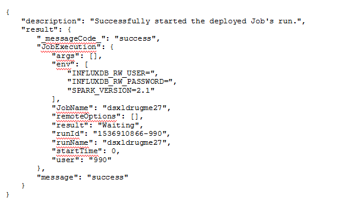
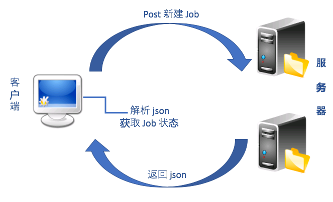
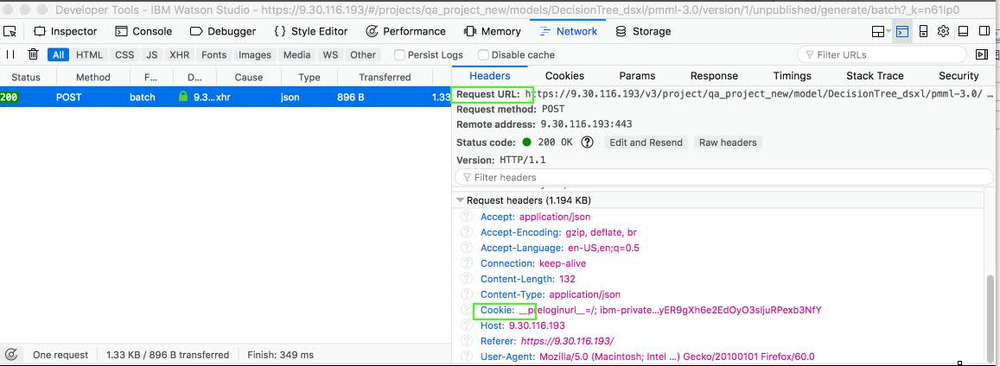
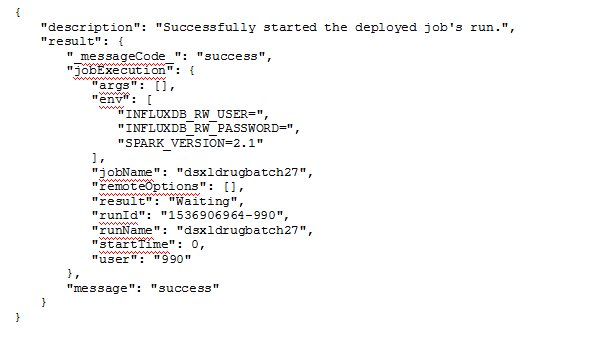

# Restful API 监控实践
Restful API 实践

**标签:** 分析

[原文链接](https://developer.ibm.com/zh/articles/ba-lo-base-restapi-monitoring-practice/)

刘 际洲, 贺 敏, 康 维珊

发布: 2018-11-21

* * *

## 概述

随着 docker 等技术的兴起，”微服务”的概念也越来越受青睐，日益增多的 Web Service 逐渐统一于 RESTful 架构风格，使得增量开发的代价越来越小。对于众多同时运行在 RESTful 架构下的服务而言，各种状态的管理及监控成为必然。与 SOAP 服务的复杂协议架构相比，RESTful 的风格是轻量级的 Web Service 架构，其实现和操作比 SOAP 和 XML-RPC 更为简洁，可以完全通过 HTTP 协议实现，并利用缓存 Cache 来提高响应速度，在性能、效率和易用性上都优于 SOAP 协议。

## RESTful 协议架构和特点

REST 即 Representational State Transfer 的缩写，可译为”表现层状态转化”。REST 最大的几个特点为：资源、统一接口、URI 和无状态。

所谓”资源”，就是网络上的一个实体，或者说是网络上的一个具体信息。在实际开发中，资源多数是以 JSON(或其他 Representation)为载体的、面向用户的一组数据集，资源对信息的表达倾向于概念模型中的数据。

“统一接口”是指 RESTful 架构中定义了的与 HTTP 方法相对应的数据元操作，也就是 CRUD(create、read、update 和 delete，即数据的增删查改)操作，这样就统一了数据操作的接口，使得开发者仅通过 HTTP 方法，就可以完成对数据的所有工作，如下：

- GET（SELECT）：从服务器取出资源（一项或多项）。
- POST（CREATE）：在服务器新建一个资源。
- PUT（UPDATE）：在服务器更新资源（客户端提供完整资源数据）。
- PATCH（UPDATE）：在服务器更新资源（客户端提供需要修改的资源数据）。
- DELETE（DELETE）：从服务器删除资源。

“URI” 标示每一个资源的地址或识别符。每个资源至少有一个 URI 与之对应，最典型的 URI 即 URL。

“无状态”是指所有的资源通过 URI 定位，且这个定位与其他资源无关，也不会因为其他资源的变化而改变。

一个典型的 RESTful 请求通常为以下格式：

$ curl -i -H “Content-Type: application/json” -X POST -d “{“””key”””:”””value”””}” yourApi

而返回值通常为如下的 JSON 格式：



## 监控框架基本功能初模型

一个 RESTful 架构下实现的应用程序必然具有天然的 RESTful 架构的特点，那么能不能通过解析获取每个 Job 资源的返回值，达到监控管理 Job 资源的目的呢？为此，我们建立了如图 1 所示的初模型：

#### 图 1 . 监控框架初模型



Job 是由一个或多个步骤组成，每个步骤都是运行一个特定程序的请求。 例如，图中提交的 Job 包括了以下几个步骤：上传 Data、build model、scoring nugget 等一系列请求。

在此框架下，只需要模拟客户端发出 post 命令，同时将返回的 JSON 文件重定向到本地进行解析，获取 Job 状态即可。相关的 shell 代码如下：

#### 清单 1\. 获取 Job 状态

```
evokeJob(){
curl -k -X POST -H "$session" -H 'Cache-Control: no-cache' -H
    'Content-Type: application/json' $RequestURL/trigger -d "{\"env\":
    [\"SPARK_VERSION=2.1\"], \"args\": []}"| python -m json.tool
    >$outputPath/tempJobID.txt
}

```

Show moreShow more icon

其中，需要在网页浏览器中的开发者模式下获得相应的”session”和”RequestURL”参数，如图 2 所示：

#### 图 2 . 网页中获取参数信息



实例： 通过调用此方法，会将如下的 JSON 文件导出：



一般而言，服务器端的 Job 有如下几种状态：

- Pending
- Waiting
- Running
- Succeeded
- Failed

只有最后两种是 Job 的最终状态，因此，监控过程期间返回值为中间状态下的 Job 仍需继续运行，监控过程也需持续。提取 Job 状态可以简单的用 shell 脚本中的 sed 方法结合 cut 方法，执行命令脚本如下：

#### 清单 2\. 提取 Job 状态

```
sub2=`cat $outputPath/tempJobstatus.txt |sed 's/\"//g' | grep result`
            JobStatus=$(echo $sub2| cut -f 4 -d :| cut -f 1 -d ,)

```

Show moreShow more icon

实例：对前文中的 JSON 文件进行解析，可以得到”Waiting”这样一个 job 状态。

通常一个 Job 会在经历了几个中间状态后才会返回最终状态，因此需要通过选取适当时间间隔来监控模型，并不断解析获取到的状态，直到得到最终的那两种状态。最后的结果可以写入 report 文件中进行后续的统计整理。要实现多次重复获取解析可以使用如下的方式：

#### 清单 3\. 多次重复解析

```
CheckStatus(){
            JobStatus="JobStarting..."
             until [ $JobStatus = "Succeeded" ] || [ $JobStatus = "Failed" ]
            do
             echo "Job Current Status is $JobStatus"
             sleep 5
             curl -k -X POST -H "$session" -H 'Cache-Control: no-cache' -H
                'Content-Type: application/json' $RequestURL/trigger -d "{\"args\": []}"|
                python -m json.tool >$outputPath/tempJobstatus.txt
             sub2=`cat $outputPath/tempJobstatus.txt |sed 's/\"//g' | grep result`
            JobStatus=$(echo $sub2| cut -f 4 -d :| cut -f 1 -d ,)
            done
             report="Job Final Status is $JobStatus"
             echo $report
             echo $report >> $outputPath/Report.txt
            }

```

Show moreShow more icon

实例：通过调用以上的方法 report 中最终只会出现如下两种结果：

Job Final Status is Succeeded

或者

Job Final Status is Failed

## 监控框架中关键步骤的处理策略

大型的应用系统往往比上面说的情况复杂，例如多 Job 同时运行并且处于不同的状态；每个 Job 启动后资源的调度竞争使得运行状态不一定持续稳定；服务器稳定性、网络稳定性都会对监控系统的鲁棒性提出要求和挑战。因此，如何处理众多的非功能性问题就成为考量监控框架稳定性的重要指标。

多 Job 并发管理思路

实际的应用系统中 Job 往往是并发的，怎样既能同时监控多个 Job 的状态，又不增加框架的复杂性呢？这里要有一个很好的处理方式才能达到平衡。我们注意到通常返回的 JSON 文件中有”runId”这一项，这是在 Job 创建时服务器端赋予 Job 的唯一标识符，所以可以利用这一项作为区分不同 Job 的标记。我们使用如下的方式：将第一次返回的 JSON 文件进行解析，然后保存 runId 项。在后续持续监控时，只需获取相应 runId 项的状态（status）。由此，我们只需要把 CheckStatus 方法中的实现按照如下方法，加以改造：

#### 清单 4\. runId 状态获取

```
sub1=`cat $outputPath/tempJobID.txt |sed 's/\"//g' | grep runId`
            JobRunId=$(echo $sub1| cut -f 2 -d :| cut -f 1 -d ,| cut -f 2 -d " ")
            CheckStatus(){
             JobStatus="JobStarting..."
             until [ $JobStatus = "Succeeded" ] || [ $JobStatus = "Failed" ]
             do
             echo "Job Current Status is $JobStatus"
             sleep 5
             curl -k -X POST -H "$session" -H 'Cache-Control: no-cache' -H
                'Content-Type: application/json'
                    $RequestURL/status/$JobRunId -d "{\"args\": []}"|
                python -m json.tool >$outputPath/tempJobstatus.txt
             sub2=`cat $outputPath/tempJobstatus.txt |sed 's/\"//g' | grep result`
             JobStatus=$(echo $sub2| cut -f 4 -d :| cut -f 1 -d ,)
             done
             report="Job Final Status is $JobStatus"
             echo $report
             echo $report >> $outputPath/Report.txt
            }

```

Show moreShow more icon

实例：若对上文的 JSON 文件运行此方法，用户可以解析出此时的 JobRunId 为”1536906964-990″,在此后的 CheckStatus()方法中仅仅会去获取此 ID 的 Job 的状态。首先拿到的状态同样为”Waiting”。

### 交互延迟时策略及分析

延迟往往发生在 Job 启动时期。如果监控系统没有考虑到与系统交互时可能产生的时延，那么返回的 JSON 文件中就不会包含完整的 Job info，因此需要一个有效且代价较小的方式，那就是适时的添加一些 sleep()。

### 服务器稳定性差时策略及分析

运行时服务器稳定性直接影响着整个系统的反应速度，同时加载在其上的监控系统更是对服务器稳定性有着强依赖。如何结合这样的强相关性、强依赖性，并且在服务器网络稳定性不高的运行环境中稳定地监控 Job 状态呢？我们采用了一种循环等待的方式。

简单来说，就是在服务器端没有返回正确响应的时候，由监控系统发出一次 sleep() 指令，之后重新再发起一次 post 请求获取 Job 状态，若仍然无法得到返回值，则加倍 sleep()的时常，之后发起第三次 post 请求。如果三次请求均失败，则认为该项 Job 启动失败。具体的实现可以用以下方式：

#### 清单 5\. 持续监控 Job 状态

```
parse_json(){
             sub1=`cat $outputPath/tempJobID.txt |sed 's/\"//g' | grep runId`
             JobRunId=$(echo $sub1| cut -f 2 -d :| cut -f 1 -d ,| cut -f 2 -d " ")
             echo $JobRunId
             if [ "$JobRunId"x = ""x ];then
             j=3
             for ((i=1; i<=j; i++))
             do
             stop=$[$i*5]
             echo "Job not evoked, sleep $stop s' and try again"
             sleep $stop
             evokeJob
             sub1=`cat $outputPath/tempJobID.txt |sed 's/\"//g' | grep runId`
             JobRunId=$(echo $sub1| cut -f 2 -d :| cut -f 1 -d ,| cut -f 2 -d " ")
             echo $JobRunId
             if [ "$JobRunId"x != ""x ];then
             break
             fi
             done
             if [ "$JobRunId"x = ""x ];then
             report="Job cannot start 3 times!"
             echo $report >> $outputPath/Report.txt
             else
             CheckStatus
             fi
             else
             CheckStatus
             fi
            }

```

Show moreShow more icon

实例：在最差情况下，一个 Job 将会启动三次，若最终也没有能启动成功则会有如下的 report 输出：

Job not evoked, sleep 5 s’ and try again

Job not evoked, sleep 10 s’ and try again

Job not evoked, sleep 15 s’ and try again

Job cannot start 3 times!

经过循环处理，基本上涵盖了可能出现的运行问题。一个完整的 Job 监控框架如下，通过调用以上几个 method 就可以获得：

#### 清单 6\. Job 监控框架

```
executeJob(){
evokeJob
parse_json
}

```

Show moreShow more icon

## 结束语

RESTful 协议为服务器客户端应用开创了一个完整丰富的解决平台。运行其上的众多 Job，可以通过统一的调用接口，获取管理监控所需的一切状态信息，使得简单实现成为可能。同时在功能之上还可以并行监控，容错率高的系统将会更可靠，并能广泛地应用到实际工作中。本文通过浅显易懂的方式构建了一个轻量级的基于 RESTful API 下 Job 监控管理的框架，对现实应用中可能会出现的交互延迟、服务器端不稳定做出相应调整，大大提高了框架的鲁棒性。

## 参考资料

- 参考 [RESTful](https://baike.baidu.com/item/RESTful/4406165?fr=aladdin) ，查看 RESTful 的相关背景。
- 查看 Shell ，获得更多关于 sed、cut 方法。