# Robot Framework 的安装配置和简单的实例介绍
一款 Python 编写的功能自动化测试框架

**标签:** DevOps,Python

[原文链接](https://developer.ibm.com/zh/articles/os-cn-robot-framework/)

阮高远, 鲍立珠, 刘波

发布: 2015-09-15

* * *

## Robot Framework 介绍

Robot Framework 是一款基于 Python 的功能自动化测试框架。它具备良好的可扩展性，支持关键字驱动，可以同时测试多种类型的客户端或者接口，可以进行分布式测试执行。主要用于轮次很多的验收测试和验收测试驱动开发（ATDD）。

在我们进行全球化测试的时候可以用此框架来编写一些脚本任务，如定时下载 daily build , 配合 Selenium 完成自动化截图等，来方便我们的测试。

## Robot Framework 的安装和配置

在使用 RF（Rebot framework）的时候需要 Python 或 Jython 环境，具体可根据自己的需求来确定。本文以在有 Python 的环境的机器上安装和使用 RF 为例。

在配置过程中需要安装如下包：python 2.7、wxPython、robot framework、robot framework ride、robot framework selenium library。

### 安装 Python 2.7

RF 框架是基于 Python 语言的，所以一定要有 Python 环境。可以通过下面的下载页面下载对应的 Python 版本。

下载页面： [https://www.python.org/downloads/](https://www.python.org/downloads/) 。

下载完成后，选择默认项进行安装。

安装完后，需要设置环境变量：计算机—属性—高级系统设置—环境变量—系统变量—Path，写入 C:\\Python27 和 C:\\Python27\\Scripts（更改为您指定路径即可）。

同时我们也可以通过 DOS 环境来验证安装的 Python 信息。

### 安装 WxPython

下载页面： [http://wxpython.org/download.php#stable](http://wxpython.org/download.php) 。

在选择版本下载的时候要注意选择与 Python 版本对应的版本，并且选择 unicode 版本，比如版本：wxPython2.8-win32-unicode-py26.exe，否则安装完成后不能支持中文。

下载完成后，选择默认项进行安装即可。

### 安装 PyCrypto

下载页面： [http://www.voidspace.org.uk/python/modules.shtml#pycrypto](http://www.voidspace.org.uk/python/modules.shtml) 。

选择对应的 pycrypto installer 版本，进行默认安装。需要在安装库（如 SHHLibrary）之前进行安装，否则会出现 错误”Can’t find vcvarsal.bat”。

### 安装 Robot Framwork

进入 Python 的安装路径，执行命令”pip install robotframework”或者通过下载页面 [https://pypi.python.org/pypi/robotframework](https://pypi.python.org/pypi/robotframework) 下载源码。

解压后，执行命令”python setup.py install”进行安装。进入 Python 的安装路径，执行命令”pip install robotframework”。

### 安装 robotframework-ride

进入 Python 的安装路径，执行命令”pip install robotframework-ride”。

### 安装需要的 Library

如 selenium2library ,archivelibrary,SSHLibrary ,ftplibrary 等。进入 Python 的安装路径，分别执行以下命令：

##### 清单 1\. 安装 Test Library

```
pip install robotframework-selenium2library
pip install robotframework-archivelibrary
pip install robotframework-SSHLibrary
pip install robotframework-ftplibrary

```

Show moreShow more icon

完成以上步骤后，RobotFramework 的安装工作已经完成，可以通过执行命令”pip list”查看已经安装的产品，如图 1 所示：

##### 图 1.RobotFramework 安装产品列表

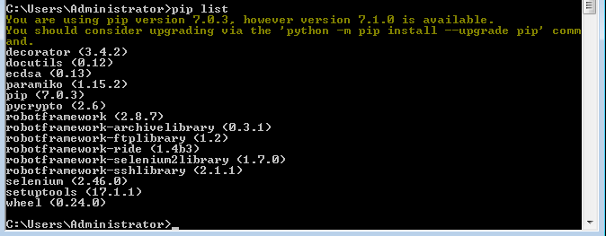

## RIDE 编辑器介绍

RF 是通过 RIDE 编辑器进行工作的，安装成功后，执行命令”[PythonDir]\\Scripts\\ride.py”，就可以打开 RIDE 编辑器，如图 2 所示。打开之后就可以进行创建测试项目，创建测试用例等操作，在后面的实例讲解中有具体步骤。

##### 图 2.RIDE 编辑器启动界面

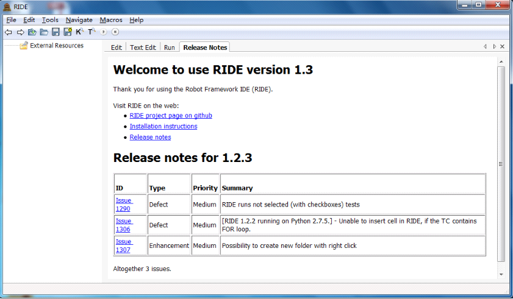

## 创建测试项目

选择菜单栏 File —>New Project，输入项目名称，选择 Directory type，选择目录。

##### 图 3\. 创建测试项目

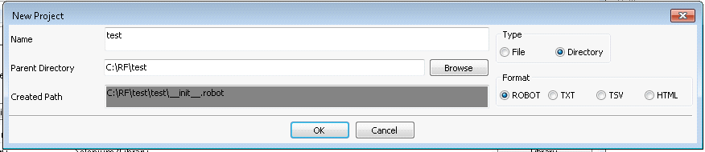

### 创建测试套件

右键点击刚创建的测试项目，选择 New Suit，输入 name , 选择 File type。

##### 图 4\. 创建测试套件

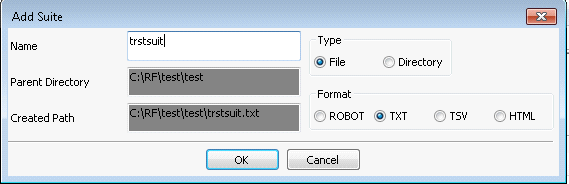

### 创建测试用例

右键点击刚创建的测试套件，选择 New TestCase，输入名称。

##### 图 5\. 创建测试用例

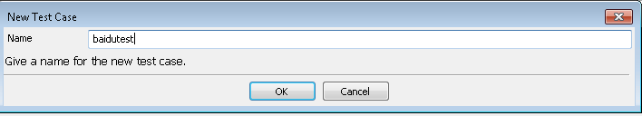

### 导入库

在实际项目中，我们需要运用 RF 框架编写基于 web 的测试用例，我们需要 Selenium 的库支持。所以，我们在使用的过程中需要加载 selenium2library 库。

##### 图 6\. 导入测试库

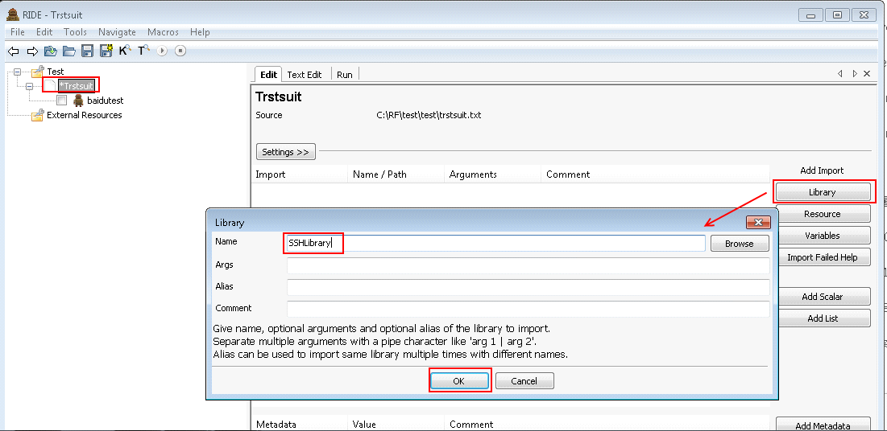

在”测试套件”的 Edit 标签页，点击”Library”按钮，弹出输入框，Name 输入：Selenium2Library ，点击 OK 完成。

如果导入的库显示为红色，表示导入的库不存在。如果是黑色则表示导入成功。

### 编写测试用例

可以通过快捷键 F5 来查询脚本的关键字。以打开浏览器为例，输入关键字”open”进行搜索，查询到一个”Open Browser”的关键字，点击这个关键字，就出现了它的用法和说明，如图 7。

##### 图 7.Search Keywords

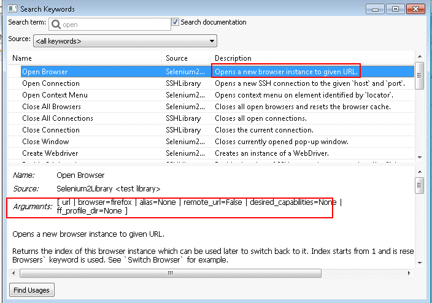

熟悉这个关键字用法之后，可以在 test case 里面进行尝试。”Open Browser”显示蓝色，说明它是一个合法的关键字，后面为红色说明需要输入一个参数，从其用法可知，需要输入 URL。更多关键字的用法可以熟悉 API 文件。

##### 图 8.keywords 实例

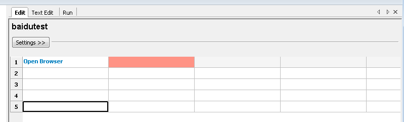

编写测试用例的时候还可以选择添加变量。变量是 RF 的常用的功能，它能在测试数据的大多数地方使用。主要有以下几种：

- 标量变量：语法 ${scalar }。当在测试数据中使用标量变量时，它们将被分配的值所代替。

- 列表变量：语法 @{LIST}。列表变量是复合变量，可以分配多个值给它。

- 数字变量：变量语法可以用来创建一个全是整型和浮点型的数字：整型${80}、浮点型${3.14}。

- Boolean 变量：${true/false}。

- Null/None 变量：${null/None}。

- 空格${SPACE} 和空${EMPTY} 变量等。


##### 图 9\. 添加变量

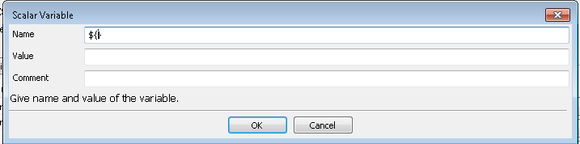

### 运行测试用例

以上几步完成后，就可以在 Run 页面，进行运行，并查看结果，具体如图 10 所示：

在运行完测试之后，也可以进行查看 log 文件等操作。

##### 图 10\. 运行测试用例

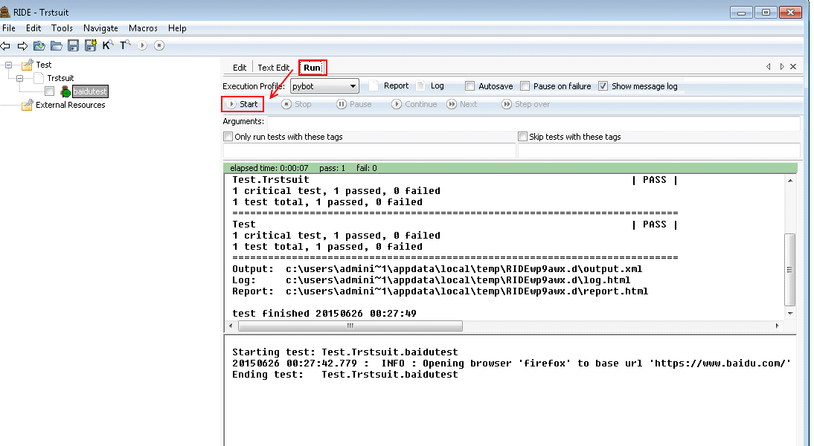

## 简单的测试用例的编写

安装完成 RF 之后，通过 RIDE 编辑器的介绍，对 RF 的工作原理有一定了解之后，在这一部分主要给大家介绍一个简单的实例：从服务器上下载指定的文件。

首先按照上面的步骤来进行：创建项目—->创建 Test Suite—->创建 Test Case。

### 创建项目

菜单 File -> New Project，在弹出”New Project”对话框选择 Type 为 Directory，然后填写 Name，点击 OK 按钮。

### 创建 Test Suite

在已创建的项目上点击鼠标右键，选择 New Suite，在弹出”Add Suite”对话框中选择 Type 为 File，然后填写 Name，点击 OK 按钮。

添加所需的库文件，选定 Suite 然后点击右边 Library 按钮，在弹出对话框的 Name 后输入 FtpLibrary 并点击 OK 按钮，添加其他 Library 也是如此，具体如图 11 所示：

##### 图 11\. 添加 Library

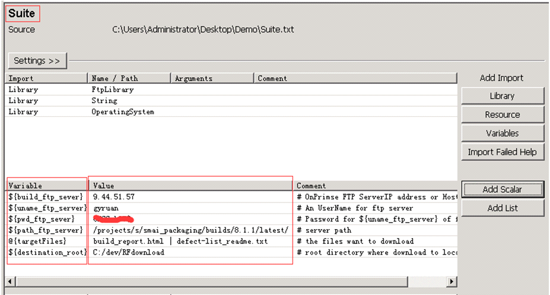

添加所需的变量，选定 Suite 然后点击右边 Add Scalar 按钮，在弹出对话框的 Name 后输入变量名，注意变量的结构是${name}or @{name}，在 Value 后输入变量的值。

##### 图 12\. 添加变量

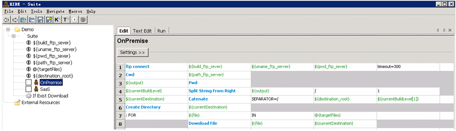

### 创建 Test Case

在已创建的 suite 点击鼠标右键选择 New Test Case，在弹出对话框的 Name 填写 Name，点击 OK 按钮。

至此，项目已经创建好了，Suite 创建了也添加了所需要的 Library，Test Case 也创建好了，接下来就可以在 Test Case 里编写测试用例了，也就是在表格输入关键字和参数或变量。

##### 图 13.TestCase 实例

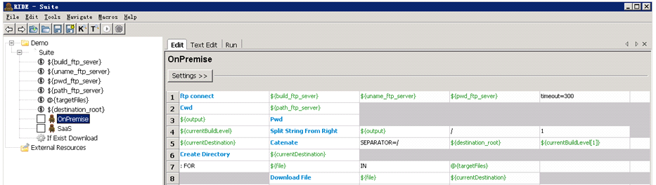

注：在图中表格里的蓝色字体是库中的关键字，绿色字体是变量，黑色字体是系统自带关键字。

下面对 OnPremise 这个 test case 进行解释。

##### 图 14.OnPremise–连接 FTP 服务器


目的：连接 FTP 服务器。

通过关键字 ftp connect 以及参数，包括用户名${uname\_ftp\_server} 和密码${pwd\_ftp\_sever}，来连接 FTP 服务器${build\_ftp\_sever}，并设定超时时间为 300 秒。

##### 图 15.OnPremise–记录当前路径


目的：记录当前路径。

Cwd 关键字切换并进入所需路径${path\_ftp\_server}，然后通过 Pwd 输出当前路径并保存到变量${output} 中。

##### 图 16.OnPremise–创建本地文件夹


目的：创建本地文件夹，用来存放下载的文件。

由于服务器路径目录是以日期结束，将此通过 Split String From Right 关键字分离出来并保存到${currentBuildLevel}，最后生成完整路径${currentDestination}，并通过 Create Directory 关键字来创建目标文件夹。

##### 图 17.OnPremise–下载所有所需的文件


目的：下载所有所需的文件。

需要下载的文件不止一个，可通过 FOR 循环在列表变量 @{targetFiles} 中分别取出目标文件名，再通过 Download File 关键字来逐一下载并保存到${currentDestination} 路径下。

## 结束语

Robot framework 关键字自动化框架，它拥有强大而丰富的 Library，以及简单易用的关键字方式的使用，可以很好地支持全球化测试部门的测试工作，从而减少编写代码的时间同时也大大地提高了工作效率。相信通过对 Robot framework 关键字自动化框架更深的使用和了解，将不仅仅只是帮助自动下载文件，也会在更多更广的方面带来越来越多的益处。