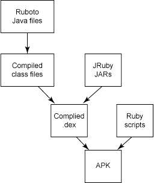
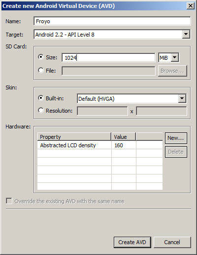
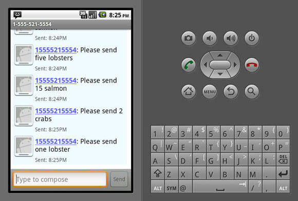

# Ruboto：Android 之上的 Ruby
通往 Dalvik 虚拟机的一条灵活的脚本途径

**标签:** Android,移动开发

[原文链接](https://developer.ibm.com/zh/articles/wa-ruby/)

Chris King

发布: 2012-04-01

* * *

## 简介

今天，软件开发中的大部分有趣工作都出现在两个极端上：巨型云服务器和微型移动设备。这些领域解决完全不同的问题，相应地，也就拥有不同的工具支持。服务器开发往往使用脚本语言将不同的组件捆绑在一起并完成复杂的自动化任务，而移动开发主要关注某个特殊设备和用户的特定功能和需求。

但是，这两个极端共享一种常用语言：Java™ 。无论 Android 还是 Spring 框架，当今许多最流行的技术都采用一种全世界广泛理解和支持的语言。这种常用语言可能会导致一些您原以为存在天壤之别的领域之间出现令人惊讶的交集。Java 编程打开了许多跨平台选项的大门，比如将服务器代码轻松移植到 Android 设备上，或从现有组件绑定原生平台功能。

本文将探索 Ruboto 项目，该项目致力于在脚本语言和 Android 之间搭建一座桥梁。您将了解到 Ruby 和 Android 相关信息，它们如何在 Dalvik 虚拟机中协同工作，如何构建和部署您的脚本，以及这种技术提高程序员生产力和应用程序灵活性的潜力。

## Ruby 背景知识

许多脚本语言都想获得程序员的青睐，但 Ruby 目前处于有利位置。最著名的是，它支持 Rails web 框架，但很多开发人员还喜欢 Ruby 的简洁性和优雅。作为一种拥有 duck typing 和元编程（metaprogramming）等现代功能的面向对象脚本语言，Ruby 不仅很强大，足以支持各种复杂架构；而且还很简单，能执行各种特殊任务。

Ruby 有几种衍生版本，包括流行的 JRuby。JRuby 是一个功能齐备的 Ruby 解释器，用 Java 语言编写，可以在 Java Virtual Machine (JVM) 中运行。与官方 Ruby 不同，JRuby 支持从 Java 代码中调用 Ruby 脚本和从 Ruby 脚本中调用 Java API。

## Android 背景知识

Android 由 Open Handset Alliance 开发，但经常被视为一个 Google 项目。今天，Android 几乎驱动所有新智能手机的四分之一，它的市场份额持续增长。

在内部，Android 在一个经过修改的 Linux 内核上运行。大多数应用程序都在 Dalvik 虚拟机上运行，这个虚拟机完全由 Google 设计开发，旨在优化移动设备上的性能。要了解更多 Dalvik 信息，请参见 参考资料 。

许多新 Android 开发人员忽略的一点是他们编写的 Java 源代码并不作为 Java 字节码运行。相反，Android 工具包将 Java 字节码转换为 Dalvik 字节码。这些经过转换的文件（扩展名为 .dex）被打包到部署到设备上的应用程序中。等到设备运行您的程序时，将不会留下任何 Java 字节码。

## Android + Ruby = Ruboto

JRuby 团队成员 Charles Nutter 有一天突然意识到：既然 Android 工具包能将编译后的 Java 代码转换为 Dalvik 文件，而且由于 JRuby 在编译后的 Java 字节码中有一个 Ruby 解释器，那么应该能够在 Android 上运行 Ruby。在极短的时间内，他执行了这个任务，Ruboto 随之诞生了。 在其他几位开发人员的共同努力下，Ruboto 成为了一个活跃的项目，Android 和 Ruby 开发人员对该项目的兴趣与日俱增。

今天，Ruboto 具有两种版本：ruboto-irb 和 ruboto-core。ruboto-irb 是在 Android 上运行的一个交互式 Ruby shell。这个项目允许运行任何能访问 Android API 的 Ruby 脚本。这个工具对于想在他们的设备上运行测试或执行任务的开发人员而言非常有用，但可能不适合编写今后用于分发的应用程序。

相比之下，ruboto-core 提供一个允许创建 Ruboto 项目的框架。使用 ruboto-core，可以向您的项目添加强大灵活的脚本支持，同时保留对 Android API 的访问能力。图 1 展示 ruboto-core 构建过程：自动生成的 Java 源文件和定制编写的 Ruby 脚本打包到一个将在设备上运行的 Android APK 中。

##### 图 1\. 构造一个 Ruboto 应用程序



本文余下部分主要关注创建一个基于 Ruboto 的自定义项目。Ruboto 还是一个早期软件，在本文撰写之时，它的版本编号是 0.0.2。该项目发展很快，等到您阅读本文之时，它可能已经发生了轻微的变化。如果您在运行下面的命令时遇到问题，请参见 参考资料 获取关于 Ruboto 和 Android 的最新信息。

## 编写 SMS

将 Ruby 和 Android 结合起来，就能创建能访问 Android 的强大功能的简单脚本。我们将编写一个 Ruboto 脚本，允许用户从一家快递服务公司预订海鲜。这个简单的应用程序将利用每个平台的优点。在 Android 端，您拥有一种简单的方法来创建一个包含您的订单的 SMS 消息，应用程序甚至无需请求服务器就可以下订单。在 Ruby 端，您将重用一个现有的语言处理库，该库将您的订单规范化为一种可阅读格式。

## 开始

要构建 Ruby 脚本并将其部署到 Android 上，需要几个组件。您可能已经安装了部分组件，如果是这样，您可以继续使用它们。

由于 Android 和 Ruby 是多平台的，因此可以在 Linux® 、Mac OS X 或 Windows® 上运行 Ruboto。本文完全使用命令行。

如果您在 Windows 上使用 `cygwin` ，则可能会在运行某些 JRuby 命令时遇到问题。为安全起见，如果您在运行 Windows，请务必严格遵守标准 Windows CMD shell。

### Java

您的开发机器上需要一个 Java Development Kit (JDK)。要检查该工具包是否已安装，请输入以下命令：

```
$ javac -version

```

Show moreShow more icon

如果此命令发现一个 JDK 版本，那么可以继续使用。否则，请参见 参考资料 中的链接安装最新版 JDK。安装完成后，将 JDK 的 bin 文件夹添加到您的 PATH 并重复上述命令。

### Ant

Android 附带了自己的 Ant 版本，但 Ruboto 还需要从它自己的脚本访问 Ant。如果您没有安装独立版 Ant，请通过 参考资料 中的链接下载，并将其解压缩到任何文件夹。同样，将它的 bin 文件夹添加到您的 PATH。确保能够运行 Ant 命令。

## Android

访问 Android Developer Site，安装适用于您的操作系统的 Android SDK（参见 参考资料 ）。安装完成后，运行 Android 的 tools 文件夹中的 `android` 命令。这将启动 SDK 管理器，如图 2 所示。您可能想安装以下包，它们列示在 Available packages 下方。

1. SDK Platform Android 2.2, API 8
2. Android SDK Tools（修订版 8）
3. Android SDK Platform-tools（修订版 1）

##### 图 2\. Android SDK and AVD Manager


打开 Android SDK and AVD Manager 的 Virtual devices 部分，创建一个用于开发的 Android 映像。如图 3 所示，创建一个针对 Android 2.2 – API Level 8 的虚拟设备 Froyo。如果愿意，也可以创建一个虚拟 SD Card。

##### 图 3\. 创建一个模拟器



Ruboto 将在您的设备上运行，但是，如果您拥有对任何文件夹的写权限，那么开发工作将会轻松得多，这就需要使用模拟器或 root 设备。本文余下部分将讨论如何使用模拟器。这个项目完成后，它在运行软件版本 2.2 或更高版本的 Android 设备上的效果一样好。

将 Android 的 platform-tools 和 tools 目录添加到您的 PATH。现在，您应该能在命令提示中运行清单 1 中的命令。

##### 清单 1\. 从您的命令提示运行命令

```
$ aapt version
$ adb --version

```

Show moreShow more icon

### JRuby

JRuby 提供一个非常简单的安装方法：只需访问 [http://jruby.org/getting-started](http://jruby.org/getting-started) 并遵循安装说明即可。通过运行以下命令验证安装是否成功：

```
$ jruby -v

```

Show moreShow more icon

由于 Ruboto 被托管在一个安全服务器上，因此需要安装 jruby-openssl gem 以下载它。为此，执行以下命令：

```
$ gem install jruby-openssl

```

Show moreShow more icon

您可能还想安装 rake，这是 make 或 ant 的 Ruby 对等物。输入以下命令：

```
$ gem install rake

```

Show moreShow more icon

最后，是时候安装 Ruboto 本身了。Ruboto 被打包为一个 gem，因此安装很容易。输入以下命令：

```
$ gem install ruboto-core

```

Show moreShow more icon

## 创建 Ruboto 项目

Ruboto 将为您从头创建一个 Android 项目，这将确保您的清单文件（manifest）正确设置，脚本被放置到正确的集合中，且您能访问必要的库。您应该采用这种方法，而不是试图自己创建或修改一个现有 Android 项目。

要创建项目，切换到 project 文件夹，输入以下命令：

`$ ruboto gen app --package us.cirion.ruboto.demo --path fishmonger --name Fishmonger --target android-8 --activity Fishmonger`

这条命令将执行以下操作：

- `gen app` 告知 Ruboto 从头开始创建一个新 Android 项目。
- `--package` 提供唯一的 Android 包名。
- `--path` 告知 Ruboto 将项目存储在哪里；这必须是一个新文件夹名。
- `--name` 定义用户可见的应用程序名；这不需要是唯一的。
- `--target` 指定针对哪个 Android 版本编译项目。对于本文，您必须使用 `android-8` 。一个可选参数 `--min_sdk` 声明您的应用程序可以在较早的 Android 版本上运行，这里省略此参数。
- `--activity` 是一个可选参数，它告知 Ruboto 生成一个新的 Android Activity 并初始化它。

您可以探索 fishmonger 目录的内容。Ruboto 已经自动生成了构建和运行一个基本 Activity 所需的所有 Android 文件。由于此应用程序将发送 SMS 消息，您需要在 AndroidManifest.xml 文件中进行一个更改。在该文件中，将下面这个标记插入为 `<manifest>` 元素的第一个子元素：

```
<uses-permission android:name="android.permission.SEND_SMS" />

```

Show moreShow more icon

如果您省略这个权限，您仍然能够构建并加载您的脚本，当您的应用程序试图发送一条 SMS 消息时，您将遇到一个运行时错误。

## 运行默认项目

Ruboto 以开箱即用的方式生成了一个 Activity 和脚本，它们将在设备或模拟器上安装和运行。如果您的模拟器还没有运行，可以使用以下命令启动它：

```
$ emulator -avd Froyo

```

Show moreShow more icon

等待模拟器启动到主屏幕。要确保所有 Ruboto 文件正确构建并部署， `cd` 到 fishmonger 目录并运行以下命令：

```
$ rake install

```

Show moreShow more icon

如果遇到错误，尝试再次运行此命令；有时连接在构建过程中会超时。最初构建需要一些时间，但后续更新速度就快得多。安装完成后，在您的模拟器中查找标签为 Fishmonger 的图标。启动它并等待一会儿。在本文撰写之时，Ruboto 引擎加载需要一点时间。最终，您将看到与图 4 类似的屏幕。

##### 图 4\. 模板 Ruboto 活动


## 定制项目

现在我们设置 Fishmonger 应用程序。首先，您将添加自然语言支持。Ruby 拥有一个名为 linguistics 的优秀 gem，提供许多英语语言功能。在本文撰写之时，Ruboto 还不能处理 linguistics 库的嵌套目录结构，因此，请您 [下载](http://public.dhe.ibm.com/software/dw/web/wa-ruby/fishmonger.zip) 本文的 linguistics zip 文件，将其内容解压到 fishmonger\\assets\\scripts 中。这是一个库存 linguistics gem，被修改来扁平化目录结构。将来，您应该能够只绑定这个 gem 和您的 Ruboto 脚本。

### 编写脚本

现在您准备好处理项目核心部分了。Ruboto 框架负责处理所有 Java 代码和 Android 基础架构，因此，您的所有工作都可以在 fishmonger.rb 中完成。清除该文件的默认内容。首先添加清单 2 中的文本。

##### 清单 2\. 脚本依赖项

```
require 'ruboto.rb'
require 'linguistics'
include Linguistics::EN

import "android.telephony.SmsManager"

ruboto_import_widgets :Button, :EditText, :LinearLayout, \
:RadioGroup, :RadioButton, :TextView

```

Show moreShow more icon

前两行加载 ruboto 和 linguisitics 库。include 命令将使英语语法在您的模块中可用。

第一个导入对于 JRuby 用户比较眼熟：您正在添加对另一个库的支持。注意，在本例中，您实际上正在使用一个 Android Dalvik 库，而不是标准 Java 库的一部分。Ruboto 将在运行时使用反射（reflection）来加载这个类并使其对您可用。

`ruboto_import_widgets` 的功能与 import 相似。在本例中，您正在添加一些 Android 特有 UI 小部件。这些小部件通常用于 Android 活动中，Ruboto 添加一些方便的方法，便于您轻松配置 UI。

下面，定义脚本的 `handle_create` 方法，如清单 3 所示。

##### 清单 3\. 配置屏幕

```
$activity.handle_create do |bundle|
setTitle 'Freddy\'s Fresh Fish'

setup_content do
    linear_layout :orientation => LinearLayout::VERTICAL do
      text_view :text => "What would you like to order?"
      @group = radio_group do
        radio_button :text => "Tuna", :id => 0
        radio_button :text => "Trout", :id=> 1
        radio_button :text => "Salmon", :id => 2
        radio_button :text => "Crab", :id => 3
        radio_button :text => "Lobster", :id => 4
      end
      @quantity = edit_text :hint => "Quantity"
      button :text => "Place Order"
    end
end

```

Show moreShow more icon

`handle_create` 在用户启动应用程序时调用。在 Android 中，这是您处理必要设置的地方。标准 Android 应用程序通常使用 XML 定义布局，但在 Ruboto 中，需要通过脚本定义布局。

Ruboto 的功能在您的脚本和 Android 之间架起一座桥梁。无论您拥有 Ruby 背景还是 Android 背景，您都应该能够明白 `setup_content` 中发生的事。您正在创建一个垂直布局，将几个小部件堆叠在一起。这些小部件包括文本，几个用于选择要预订的鱼类种类的单选按钮，一个用于输入数量的可编辑文本字段，以及一个用于下订单的按钮。可以使用 Ruby 语法来配置您的小部件，而不是 Android 中通常使用的更繁琐的 Java 语法。

设置每个 `radio_button` 上的 `id` 属性有好处，它向您提供一种简单方法，以便稍后查看选中了哪个按钮。

Android 将自动处理与单选按钮和可编辑文本字段之间的所有用户交互。唯一剩下的工作是定义如何处理 **Place Order** 按钮，如清单 4 所示。

##### 清单 4\. 下订单

```
handle_click do |view|
    if view.text == "Place Order"
      count = @quantity.text
      food = @group.child_at(@group.checked_radio_button_id).\
        text.downcase
      order = Linguistics::EN::plural(food,count)
      SmsManager.default.send_text_message("4155551234", \
        nil, "Please send #{count} #{order}", nil, nil)
      finish
    end
end
end

```

Show moreShow more icon

如果您以前编写过 Android 应用程序，您可能会注意到，您正在使用一种不同的范式来处理选择。Android 开发人员倾向于为每个可选项目编写一些独特的单击处理程序。但是，在 Ruboto 中，更简单的方法是为您的 `Activity` 创建一个全局单击处理程序，在那里测试用户单击了哪个项目。

您提取用户选择的鱼的数量和种类。如果用户没有选中一个单选按钮，Ruboto 将在内部优雅地处理这个运行时错误。否则，您将把文本传递到 linguistics 库并请求它为您创建适当的名词形式。这个库能处理不同的复数规则，因此它将生成 `1 salmon` 、 `2 salmon` 、 `1 crab` 、 `2 crabs` 之类的值。它甚至能识别手写的数字，因此它还将生成 `one lobster` 和 `three lobsters` 之类的词组。对于一行代码来说，这是令人非常印象深刻的行为，展示了它利用现有脚本向您的应用程序轻松添加功能的能力。

类似地，发送一条 SMS 消息只需一行调用，调用一个方便的 Android 方法。Ruboto 允许您使用 Ruby 式语法调用这个方法；对等的 Java 代码将是 `SmsManager.getDefault().sendTextMessage()` 。您提供接收者的电话号码和要发送的消息，并为可选参数传递 `nil` 。如果您 正在一个设备上运行并想实际发送一条 SMS 消息，可以替换为一个实际电话号码。如果您想在模拟器中测试，则可以替换为模拟器的端口号，比如 “5554”。

### 运行脚本

Ruboto 最强大的一个方面是允许通过简单地加载一个已更新脚本来更改功能。即使您已经完全更改了这个应用程序的功能，也不需要重新构建应用程序或重新加载 APK。相反，只需在命令行输入以下命令：

```
$ rake update_scripts

```

Show moreShow more icon

这条命令将把 linguistics 脚本和您的新 fishmonger 脚本复制到模拟器或一个已连接设备。当您重新启动应用程序时，将看到您的新屏幕，如图 5 所示。

##### 图 5\. Android 预订页面


如果您正在运行一个非根设备（non-rooted device）或正在更改 Java 文件或 Android 清单文件，可以通过再次输入 `rake` 安装命令来加载更新。注意，即使是非根设备也可以实时更新它们的脚本；例如，您可以从 Internet 下载新脚本并在运行时生成它们。固件限制仅适用于通过您的 USB 连接推送文件。

继续试验这个应用程序。当您进行了一个有效选择并按下预订按钮后，屏幕将自动关闭。如果您使用一个有效的接收者地址，他们将很快收到您的消息。图 6 显示了一个非常繁忙的海鲜店的最新订单列表。

##### 图 6\. 来自 Ruboto 脚本的标准化订单



## 结束语

Ruboto 仍然是一个早期项目，但即使处于现在的状态，它已经能提供一种非常灵活有用的方法来编写和分发 Android 软件。Ruboto 的成功归功于 JRuby 和 Android 的优势：JRuby 已经完成了以 Java 语言编写一个功能齐备的 Ruby 解释器的艰巨工作，Android 的 Dalvik 工具集提供了一种令人印象深刻的从标准 Java 字节码到它的自定义 Dalvik 字节码的转换。

如您所见，Ruboto 脚本可能会非常短，但提供来自 Ruby 和 Android 的强大功能。混合和匹配 Ruby 脚本、Ruby 和 Java 语法以及 Android API 的能力向您提供了许多提高生产力的选项。

Ruboto 是位于客户端和服务器两端的开发人员之间的一个有用桥梁。Android 开发人员将欣赏它的反射功能，该功能向他们提供实时大幅更新应用程序功能的能力。Ruby 开发人员将拥有一种相当便捷的方法来结合他们的脚本技术和移动平台，利用现有 Ruby 代码来创建新应用程序。这两类开发人员都将怀着极大兴趣，密切关注这个项目的进展。

本文翻译自： [Ruboto: Ruby on Android](https://developer.ibm.com/articles/wa-ruby/)（2011-03-22）