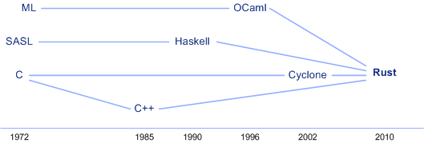

# Rust 编程语言入门
您是开发人员吗？如果是，您需要知道 Rust。

**标签:** Web 开发

[原文链接](https://developer.ibm.com/zh/articles/os-developers-know-rust/)

M. Tim Jones

发布: 2018-04-10

* * *

最近的一项 [Stack Overflow 调查](https://insights.stackoverflow.com/survey/2017?utm_source=so-owned&utm_medium=hero&utm_campaign=dev-survey-2017&utm_content=hero-questions#most-loved-dreaded-and-wanted) 发现，许多开发者都喜欢或希望使用 Rust 语言进行开发。这个数字令人难以置信！那么 Rust 有什么益处呢？本文探讨这种类似 `C` 的语言的精彩亮点，演示为什么它应该是您要学习的下一种语言。

## Rust 及其家谱

首先，让我们快速了解一下它的发展历史。相对于前辈产品（最重要的是 `C` ，它比 Rust 早了 38 年），Rust 是一种较新的语言，但它的血统造就了它的多模式方法。Rust 被视为一种类似 `C` 的语言，但它包含的其他特性带来了相较其前辈产品的优势（参见 [图 1](#图-1-rust-及其家谱) ）。

首先，Rust 受到了 Cyclone（ `C` 的一种安全方言，一种命令式语言）的重大影响，包含来自 `C++` 的面向对象特性的一些方面。但是，它也包含来自 Haskell 和 OCaml 等语言的函数特性。结果，我们获得了一种支持多模式编程（命令、函数和面向对象）的类似 `C` 的语言。

##### 图 1\. Rust 及其家谱



## Rust 中的关键概念

Rust 有许多特性，这些特性让它变得很有用，但开发人员及他们的需求各不相同。我将介绍让 Rust 值得学习的 5 个关键概念，并在 Rust 源代码中展示这些概念。

首先，为了感受一下 Rust 的代码，让我们看看仅向用户发出一条消息的最简洁的“Hello World”程序（参见清单 1）。

##### 清单 1\. Rust 中的“Hello World”

```
fn main()
{
println!( "Hello World.");
}

```

Show moreShow more icon

类似于 `C` ，这个简单程序定义了一个 main 函数，该函数是该程序的指定入口点（而且每个程序都有一个）。该函数使用 `fn` 关键字后跟括号 (`()`) 中的一组可选参数来定义。花括号 (`{}`) 标示该函数的边界，这个函数包含对 `println!` 宏的一次调用，根据该字符串参数的定义，这会向控制台发出格式化的文本 (`stdout`)。

Rust 包含各种各样的特性，这使它变得很重要，值得投入精力来学习。您会发现诸如可重用模块、内存安全和保证（安全的操作与不安全的操作）、不可恢复和可恢复的错误处理特性，并发性支持，以及复杂的数据类型（称为集合）等概念。

### 通过模块实现可重用的代码

Rust 允许通过一种方便重用的方式来组织代码。可以使用模块实现此组织结构，模块包含您可以设置为公有（即对模块的用户公开）或私有（即仅在模块内使用，无法被模块用户使用 – 至少无法直接使用）的函数、结构，甚至其他模块。模块将代码组织为其他模块可以使用的包。

可以使用 3 个关键字来创建模块，使用模块，并修改模块中的元素的可视性。

- `mod` 关键字创建一个新模块
- `use` 关键字允许您使用模块（在要使用这些定义的范围内公开它们）
- `pub` 关键字将模块的元素设置为公有（否则它们是私有的）。

[清单 2](#清单-2-rust-中的简单模块示例) 提供了一个简单示例。该示例首先创建一个名为 `bits` 的新模块，其中包含 3 个函数。第一个函数名为 `pos` ，是一个私有函数，它接受一个 `u32` 参数并返回一个 `u32` （由 `->` 箭头指示），这是一个左移了 `bit` 次的 1 值。请注意，这里不需要 `return` 关键字。该值通过两个公有函数调用（请注意 `pub` 关键字）： `decimal` 和 `hex` 。这些函数调用私有的 `pos` 函数并以十进制或十六进制格式输出 bit 位置的值（请注意，这里使用了 `:x` 来表示十六进制格式）。最后，它声明一个 `main` 函数来调用 `bits` 模块的两个公有函数，输出以注解形式显示在清单 2 的末尾处。

##### 清单 2\. Rust 中的简单模块示例

```
mod bits {
fn pos(bit: u32) -> u32 {
      1 << bit
}

pub fn decimal(bit: u32) {
      println!("Bits decimal {}", pos(bit));
}

pub fn hex(bit: u32) {
      println!("Bits decimal 0x{:x}", pos(bit));
}
}

fn main( ) {
bits::decimal(8);
bits::hex(8);
}

// Bits decimal 256
// Bits decimal 0x100

```

Show moreShow more icon

模块使您能以公有或私有方式收集功能，但也可以使用 `impl` 关键字将方法与对象相关联。

### 执行安全检查来获得更干净的代码

Rust 编译器执行内存安全保证和其他检查，让该编程语言变得很安全（不同于可能不安全的 `C` ）。所以，在 Rust 中，永远不必担心悬空指针，或者担心在释放对象后使用它。这些是核心 Rust 语言的一部分。但是，在嵌入式开发等领域中，执行一些操作很重要，比如在一个地址上放入一个结构来表示一组硬件寄存器。

Rust 包含一个 `unsafe` 关键字，您可以通过它禁用通常会导致编译错误的检查。如 [清单 3](#清单-3-rust-中的不安全操作) 所示，可以使用 `unsafe` 关键字来声明一个不安全的代码块。在这个示例中，我声明了一个不可变的变量 `x` ，然后声明了一个指向该变量的名为 `raw` 的指针。然后，为了取消引用 `raw` （它在本例中会向控制台输出 1），我使用 `unsafe` 关键字来允许执行此操作，否则此操作会在编译时标记出来。

##### 清单 3\. Rust 中的不安全操作

```
fn main() {
let a = 1;
let rawp = &a as *const i32;

unsafe {
      println!("rawp is {}", *rawp);
}
}

```

Show moreShow more icon

可以向函数以及一个 Rust 函数中的代码块应用 `unsafe` 关键字。该关键字在编写与非 Rust 函数的绑定时最常见。此特性使得 Rust 对操作系统开发或嵌入式（裸机）编程等领域很有用。

### 更好的错误处理

无论您使用何种编程语言，都会发生错误。在 Rust 中，错误分为两个阵营：不可恢复的错误（坏的种类）和可恢复的错误（不太坏的种类）。

#### 不可恢复的错误

Rust `panic!` 函数类似于 `C` 的 `assert` 宏。它生成输出来帮助用户调试问题（并在发生更多灾难事件前停止执行）。 `panic!` 函数如 [清单 4](#清单-4-在-rust-中使用-panic-处理无法恢复的错误) 所示，它的可执行输出包含在注解中。

##### 清单 4\. 在 Rust 中使用 panic! 处理无法恢复的错误

```
fn main() {
panic!("Bad things happening.");
}

// thread 'main' panicked at 'Bad things happening.', panic.rs:2:4
// note: 使用 RUST_BACKTRACE=1 运行，以便实现反向跟踪。

```

Show moreShow more icon

从输出可以看到，Rust 运行时准确指出了发生问题的位置（第 2 行），而且发出了所提供的消息（它可以发出更多描述性信息）。输出消息表明，您可以使用名为 `RUST_BACKTRACE` 的特殊环境变量来运行，以便生成一个堆栈反向跟踪。也可以基于可检测的错误（比如访问一个矢量的无效索引）在内部调用 `panic!` 。

#### 可恢复的错误

处理可恢复的错误是编程过程的一个标准部分，Rust 包含一个很好的错误检查特性（参见清单 5）。让我们在文件操作的上下文中查看此特性。 `File::open` 函数返回一种 `Result<T, E>` 类型，其中 _T_ 和 _E_ 表示通用的类型参数（在本上下文中，它们表示 `std::fs::File` 和 `std::io::Error` ）。所以，当您调用 `File::open` 而且未发生错误（ `E` 为 `Ok` ）时， `T` 将表示返回类型 (`std::fs::File`)。如果发生错误， `E` 表示发生的错误的类型（使用类型 `std::io::Error` ）。（请注意，我的文件变量 `_f` 使用一个下划线 [`_`] 来省略编译器生成的无用变量警告。）

然后,我使用了 Rust 中一个名为 `match` 的特殊特性，该特性类似于 `C` 中的 `switch` 语句，但更强大。在本上下文中，我将 `_f` 与可能的错误值（ `Ok` 和 `Err` ）进行匹配。对于 `Ok` ，我返回了要分配的文件；对于 `Err` ，我使用了 `panic!` 。

##### 清单 5\. 在 Rust 中使用 Result<t, e> 处理可恢复的错误

```
use std::fs::File;

fn main() {
let _f = File::open("file.txt");

let _f = match _f {
      Ok(file) => file,
      Err(why) => panic!("Error opening the file {:?}", why),
};
}

// thread 'main' panicked at 'Error opening the file Error { repr: Os
// { code: 2, message: "No such file or directory" } }', recover.rs:8:23
// note: 使用 RUST_BACKTRACE=1 运行，以便实现反向跟踪。

```

Show moreShow more icon

Rust 中可使用 `Result` 枚举类型来简化可恢复的错误；还可以通过使用 `match` 进一步简化它们。另请注意，本示例中缺少一个 `File::close` 操作：该文件已在 `_f` 范围结束时自动关闭。

### 对并发性和线程的支持

并发性通常会带来问题（数据争用和死锁只是其中两种）。Rust 使用原生操作系统来大量生成线程，但也会尝试减轻线程的负面影响。Rust 包含消息传递功能，允许线程相互通信（通过 `send` 和 `recv` ，并通过互斥来实现锁定）。Rust 还允许一个线程借用一个值，这会为该线程提供该值的所有权并实际将值的范围（及其所有权）转交给新线程。因此，Rust 提供了内存安全和没有数据争用的并发性。

考虑 Rust 中的一个简单的线程示例，该示例介绍了一些新元素（矢量操作）并回顾了前面讨论的一些概念（模式匹配）。在 [清单 6](#清单-6-rust-中的线程) 中，我首先将 `thread` 和 `Duration` 名称空间导入我的程序中。然后，我声明了一个名为 `my_thread` 的新函数，该函数表示我稍后将创建的线程。在这个线程中，我仅发出该线程的标识符，然后睡眠较短时间，让调度程序允许运行另一个线程。

我的 `main` 函数是这个示例的核心。我首先创建一个空的可变矢量，我可以使用它存储相同类型的值。然后使用 `spawn` 函数创建 10 个线程，并将结果连接句柄推送到该矢量中（稍后会更详细地介绍）。这个 `spawn` 示例与当前线程分离，这使该线程能生存到父线程退出之后。从父线程发出一条短消息后，我最后迭代了 `JoinHandle` 类型的矢量，并等待每个子线程退出。对于矢量中的每个 `JoinHandle` ，我调用了 `join` 函数，该函数等待该线程退出后再继续处理。如果 `join` 函数返回一个错误，我会通过 `match` 调用来公开该错误。

##### 清单 6\. Rust 中的线程

```
use std::thread;
use std::time::Duration;

fn my_thread() {
println!("Thread {:?} is running", std::thread::current().id());
thread::sleep(Duration::from_millis(1));
}

fn main() {
let mut v = vec![];

for _i in 1..10 {
      v.push( thread::spawn(|| { my_thread(); } ) );
}

println!("main() waiting.");

for child in v {
      match child.join() {
         Ok(_) => (),
         Err(why) => println!("Join failure {:?}", why),
      };
}
}

```

Show moreShow more icon

在执行时，我看到了 [清单 7](#清单-7-来自清单-6-中的示例代码的线程输出) 中提供的输出。在这里可以注意到，主线程继续执行到连接过程开始。然后，这些线程在不同的时间执行和退出，并标识线程的异步性质。

##### 清单 7\. 来自清单 6 中的示例代码的线程输出

```
main() waiting.
Thread ThreadId(7) is running
Thread ThreadId(9) is running
Thread ThreadId(8) is running
Thread ThreadId(6) is running
Thread ThreadId(5) is running
Thread ThreadId(4) is running
Thread ThreadId(3) is running
Thread ThreadId(2) is running
Thread ThreadId(1) is running

```

Show moreShow more icon

### 对复杂数据类型（集合）的支持

Rust 标准库包含多种可在开发中使用的、流行的、有用的数据结构，包括 4 种类型的数据结构：序列、映射、集和一种附加类型。

对于序列，可以使用矢量类型 (`Vec`)，我在线程示例中就使用了它。此类型提供一个可动态调整的数组，对收集数据供以后处理很有用。 `VecDeque` 结构类似于 `Vec` ，但您可以将它插入到序列的两端。 `LinkedList` 结构也类似于 `Vec` ，但通过它，您可以拆分和附加列表。

对于映射，为您提供了 `HashMap` 和 `BTreeMap` 结构。可以使用 `HashMap` 结构创建键值对，可以按照它们的键来引用元素（用于检索值）。 `BTreeMap` 类似于 `HashMap` ，但它可以对键进行排序，而且您可以轻松迭代所有条目。

对于集，为您提供了 `HashSet` 和 `BTreeSet` 结构（您会在映射结构后注意到它）。这些结构在没有值（仅有键）时很有用，而且可以轻松地撤销已插入的键。

最后，附加结构目前为 `BinaryHeap` 。此结构是一个包含二进制堆的优先级队列。

## 安装 Rust 及其工具

安装 Rust 的一个最简单方法是，通过安装脚本使用 `curl` 进行安装。从 Linux® 命令行执行以下字符串：

```
curl -sSf https://static.rust-lang.org/rustup.sh | sh

```

Show moreShow more icon

此字符串将 `rustup` shell 脚本从 rust-lang.org 传递到 shell，以便执行它们。完成时，您可以执行 `rustc -v` 来显示所安装的 Rust 版本。安装 Rust 后，可以使用 `rustup` 实用程序来维护它，也可以使用该实用程序来更新 Rust 安装。

Rust 编译器名为 `rustc` 。在这里显示的示例中，构建过程被简单地定义为：

```
rustc threads.rs

```

Show moreShow more icon

……其中 Rust 编译器生成了一个名为 `threads` 的原生可执行文件。您可以使用 `rust-lldb` 或 `rust-gdb` 对 Rust 程序进行象征性的调试。

您或许已经注意到，我在这里演示的 Rust 程序有着一种独特的风格。您可以使用 `rustfmt` 实用程序，通过自动 Rust 源代码格式化来学习这种风格。这个实用程序以源文件名执行，将采用一致的标准化风格来自动格式化您的源代码。

最后，尽管 Rust 对源代码的接受程度非常严格，但可以使用 `rust-clippy` 程序进一步剖析源代码，识别具有不良实践的元素。可以将 `rust-clippy` 看作 `C lint` 实用程序。

### Windows 考虑因素

在 Windows 上，Rust 还需要用于 Visual Studio 2013 或更高版本的 `C++` 构建工具。获取这些构建工具的最简单方法是安装 [Microsoft Visual C++ Build Tools 2017](https://visualstudio.microsoft.com/downloads/) ，其中提供了 Visual C++ 构建工具。也可以 [安装](https://www.rust-lang.org/en-US/install.html) Visual Studio 2017、Visual Studio 2015 或 Visual Studio 2013，并在安装期间选择 **C++ tools** 。

要获得关于在 Windows 上配置 Rust 的更多信息，请参阅 [特定于 Windows 的 rustup 文档](https://github.com/rust-lang-nursery/rustup.rs/blob/master/README.md#working-with-rust-on-windows) 。

## 结束语

在 2018 年 2 月中旬，Rust 团队发布了 1.24 版本。这个版本包含增量编译、使用 `rustfmt` 的自动源代码格式化、新优化，以及库稳定化。可以在 [Rust 博客](https://blog.rust-lang.org/) 上进一步了解 Rust 及其演化，并从 [Rust Language 网站](https://www.rust-lang.org/) 下载 Rust。您可以在这里了解 Rust 提供的其他许多特性，包括模式匹配、迭代器、闭包和智能指针。

本文翻译自： [Why you should learn the Rust programming language](https://developer.ibm.com/articles/os-developers-know-rust/)（2018-03-08）