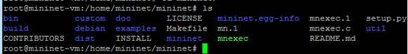
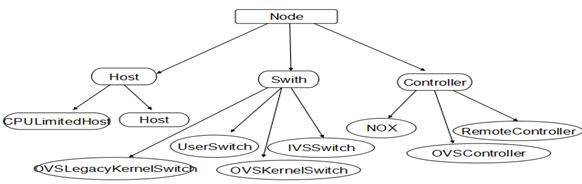

# SDN 网络系统之 Mininet 与 API 详解
轻量级的软件定义网络系统平台

**标签:** 云计算

[原文链接](https://developer.ibm.com/zh/articles/1404-luojun-sdnmininet/)

罗俊, 赵祎, 陈玺

发布: 2014-04-09

* * *

## SDN 与 Mininet 概述

SDN 全名为（Software Defined Network）即软件定义网络，是现互联网中一种新型的网络创新架构,其核心技术 OpenFlow 通过网络设备控制面与数据面分离开来,从而实现网络流量的灵活控制,为网络及应用提供了良好的平台。而 Mininet 是一个轻量级软件定义网络和测试平台；它采用轻量级的虚拟化技术使一个单一的系统看起来像一个完整的网络运行想过的内核系统和用户代码，也可简单理解为 SDN 网络系统中的一种基于进程虚拟化平台，它支持 OpenFlow、OpenvSwith 等各种协议，Mininet 也可以模拟一个完整的网络主机、链接和交换机在同一台计算机上且有助于互动开发、测试和演示，尤其是那些使用 OpenFlow 和 SDN 技术；同时也可将此进程虚拟化的平台下代码迁移到真实的环境中。

## Mininet 实现的特性

- 支持 OpenFlow、OpenvSwitch 等软定义网路部件
- 支持系统级的还原测试，支持复杂拓扑，自定义拓扑等
- 提供 Python API, 方便多人协作开发
- 很好的硬件移植性与高扩展性
- 支持数千台主机的网络结构

## Miniet 实现与工作流程

Mininet 的安装方式比较简单通过 Git 源码和自带的安装脚本方式即可安装在 Linux 系统中，这里我采用了默认安装所有 Mininet 相关的相关套件，如：OpenFlow、POX 等工具会默认保存在当前用户的家目录。

```
# git clone git://github.com/mininet/mininet
# cd mininet/util/
# ./install.sh -a
# ls
mininet  of-dissector  oflops  oftest  openflow  pox

```

Show moreShow more icon

### 创建网络

##### 图 1.简单网络示例图


由于 Mininet 支持自定义网络，这里先引用一个简单网络示例如图 1，在 Mininet 网络系统中直接输入 mn 命令，可以在此系统中创建单层的拓扑网络，从中默认创建了两台 host 和一个交换机，并且激活了控制器和交换机。同时也可以通过命令 net 查看到链路情况，先简单列出了示例，如在 Mininet 系统中启用 Web 服务器与客户端。

```
# mn
*** Creating network
*** Adding controller
*** Adding hosts:
h1 h2
*** Adding switches:
s1
*** Adding links:
(h1, s1) (h2, s1)
*** Configuring hosts
h1 h2
*** Starting controller
*** Starting 1 switches
s1
*** Starting CLI:
mininet>

```

Show moreShow more icon

**启用与关闭 Web 服务**

在 Mininet 环境中可方便建立一个 Web 服务器，从下面示例中可以看到从 host1 建立了一个 Web 服务器，并从另外一台 Host 主机想 Web 服务器获取 HTTP 请求。

```
mininet> h1 python -m SimpleHTTPServer 80 &     #在主机 h1 开启 Web 服务
mininet> h2 wget -O - h1                           #主机 h2 上下载 h1 web 站点内容
--2013-11-04 00:05:40--  http://10.0.0.1/
Connecting to 10.0.0.1:80... connected.
HTTP request sent, awaiting response... 200 OK
............
Length: 760 [text/html
<!DOCTYPE html PUBLIC "-//W3C//DTD HTML 3.2 Final//EN"><html>
<title>Directory listing for /</title>
<li><a href=".bash_history">.bash_history</a>
<li><a href=".wireshark/">.wireshark/</a>
<li><a href="install-mininet-vm.sh">install-mininet-vm.sh</a>
<li><a href="mininet/">mininet/</a>
<li><a href="of-dissector/">of-dissector/</a>
<li><a href="oflops/">oflops/</a>
<li><a href="oftest/">oftest/</a>
<li><a href="openflow/">openflow/</a>
<li><a href="pox/">pox/</a>
</ul>
<hr>
</body>
</html>

     0K                                           100% 1.65M=0s
2013-11-04 00:05:40 (1.65 MB/s) - written to stdout [760/760]

mininet> h1 kill %python                       # 杀掉 web 进程
10.0.0.2 - - [04/Nov/2013 00:05:40] "GET / HTTP/1.1" 200 -
bash: line 23: kill: python: ambiguous job spec
Ping 测试

```

Show moreShow more icon

在 Mininet 系统上，实现两主机互连测试。

```
mininet> h1 ping -c4 h2
PING 10.0.0.2 (10.0.0.2) 56(84) bytes of data.
64 bytes from 10.0.0.2: icmp_req=1 ttl=64 time=1.55 ms
64 bytes from 10.0.0.2: icmp_req=2 ttl=64 time=0.094 ms
64 bytes from 10.0.0.2: icmp_req=3 ttl=64 time=0.075 ms
64 bytes from 10.0.0.2: icmp_req=4 ttl=64 time=0.071 ms

--- 10.0.0.2 ping statistics ---
4 packets transmitted, 4 received, 0% packet loss, time 3006ms
rtt min/avg/max/mdev = 0.071/0.448/1.553/0.638 ms

```

Show moreShow more icon

##### 查看节点与链接

```
mininet> nodes
available nodes are:
c0 h1 h2 s1
mininet> net
h1 h1-eth0:s1-eth1
h2 h2-eth0:s1-eth2
s1 lo:  s1-eth1:h1-eth0 s1-eth2:h2-eth0
c0

```

Show moreShow more icon

### 自定义拓扑

Mininet 支持自定义拓扑结构，在 mininet/custom 目录下给出了一个实例，如在 topo-2sw-2host.py 文件中定义了一个 mytopo，则可以通过–topo 选项来指定使用这一拓扑:

##### 图 2\. 自定拓扑示例


由于 Mininet 也支持参数化拓扑，通过 Python 代码也可以创建一个灵活的拓扑结构,也可根据自定义传递进去的参数进行配置，并且可重用到多个环境中，下面简短列出其代码的大致结构及含义。

```
#!/usr/bin/python

from mininet.topo import Topo
from mininet.net import Mininet
from mininet.util import dumpNodeConnections
from mininet.log import setLogLevel

class SingleSwitchTopo(Topo):
def __init__(self, n=2, **opts):
Topo.__init__(self, **opts)
switch = self.addSwitch('s1')     #添加一个交换机在拓扑中
for h in range(n):
host = self.addHost('h%s' % (h + 1))   #添加主机到拓扑中
self.addLink(host, switch)   #添加双向连接拓扑

def simpleTest():
topo = SingleSwitchTopo(n=4)
net = Mininet(topo)    #主要类来创建和管理网络
net.start()    #启动您的拓扑网络
print "Dumping host connections"
dumpNodeConnections(net.hosts)       #转存文件连接
print "Testing network connectivity"
net.pingAll()    #所有节点彼此测试互连
net.stop()       #停止您的网络

if __name__ == '__main__':
setLogLevel('info')  # 设置 Mininet 默认输出级别，设置 info 它将提供一些有用的信息
simpleTest()

```

Show moreShow more icon

### 验证参数化拓扑结构

```
# python test-single.py
*** Creating network
*** Adding controller
*** Adding hosts:
h1 h2 h3 h4
*** Adding switches:
s1
*** Adding links:
(h1, s1) (h2, s1) (h3, s1) (h4, s1)
*** Configuring hosts
h1 h2 h3 h4
*** Starting controller
*** Starting 1 switches
s1
Dumping host connections
h1 h1-eth0:s1-eth1
h2 h2-eth0:s1-eth2
h3 h3-eth0:s1-eth3
h4 h4-eth0:s1-eth4
Testing network connectivity
*** Ping: testing ping reachability
h1 -> h2 h3 h4
h2 -> h1 h3 h4
h3 -> h1 h2 h4
h4 -> h1 h2 h3
*** Results: 0% dropped (12/12 received)

```

Show moreShow more icon

### 名字空间 namespace

通常情况下，主机界面有用独立的名字空间 namespace，而控制节点跟交换节点都在根名字空间（root namespace）中。如果想要让所有节点拥有各自的名字空间，需要添加 –innamespace 参数，即执行： `mn --innamespace`

```
# mn --innamespace --switch user
*** Creating network
*** Adding controller
*** Adding hosts:
h1 h2
*** Adding switches:
s1
*** Adding links:
(h1, s1) (h2, s1)
c0 <-> s1
*** Testing control network
s1 -> c0
c0 -> s1
*** Results: 0% dropped (2/2 received)

*** Configuring hosts
h1 h2
*** Starting controller
*** Starting 1 switches
s1
*** Starting CLI:

```

Show moreShow more icon

### Mininet 常用操作

**表 1.Mininet 常用指令**

名称作用nodes查看全部节点net查看链路信息dump输出各节点的信息h1 ping -c 4 h2测试主机之间的连通性iperf两个节点之间用指定简单的 TCP 测试iperfudp两个节点之间用指定款单 udp 进行测试noecho运行交互窗口，关闭回应pingpair两个主机将互 pinghelp列出命令文档，查看命令帮助： help commanddpctl在所有叫交换机exit/quit退出 mininet 命令行hX ifconfig查看当前那主机的 ip 地址，如： h1 ifconfigpy/sh执行 python 表达式或运行外部 shell 程序

### dpctl 命令实践

dpctl 程序是一个命令行工具用来检测和管理 OpenFlow 数据通路，它能够显示当前的状态数据通路，包括功能配置和表中的条目，以及合适使用 OpenFlow 的内核模块，可以用来添加，删除，修改和监视 datapaths。

查看交换机端口信息基本情况（TCP 端口 6634 是默认交换机监听端口）。

```
# dpctl show tcp:9.123.137.25:6634
features_reply (xid=0x94af8117): ver:0x1, dpid:1
n_tables:255, n_buffers:256
features: capabilities:0xc7, actions:0xfff
1(s1-eth1): addr:2e:d1:ca:aa:af:67, config: 0, state:0
     current:    10GB-FD COPPER
2(s1-eth2): addr:66:93:32:1e:9b:9e, config: 0, state:0
     current:    10GB-FD COPPER
LOCAL(s1): addr:5e:bc:ab:cc:dc:43, config: 0x1, state:0x1
get_config_reply (xid=0x92fc9e48): miss_send_len=0

```

Show moreShow more icon

查看流表信息：

```
# dpctl dump-flows tcp:9.123.137.25:6634
stats_reply (xid=0xe2c7ea1e): flags=none type=1(flow)

```

Show moreShow more icon

此时，流表为空，执行 h1 ping h2 无法得到响应。因此我们需要通过 dpctl 手动添加流表项，实现转发。

手动添加流表项：

```
# dpctl add-flow tcp:9.123.137.25:6634 in_port=1,actions=output:2
# dpctl add-flow tcp:9.123.137.25:6634 in_port=2,actions=output:1
# dpctl dump-flows tcp:9.123.137.25:6634
stats_reply (xid=0x131ed782): flags=none type=1(flow)
cookie=0, duration_sec=13s, duration_nsec=401000000s, table_id=0, priority=32768, \
n_packets=0, n_bytes=0,idle_timeout=60,hard_timeout=0,in_port=1,actions=output:2
cookie=0, duration_sec=5s, duration_nsec=908000000s, table_id=0, priority=32768, \
n_packets=0, n_bytes=0,idle_timeout=60,hard_timeout=0,in_port=2,actions=output:1

```

Show moreShow more icon

此时查看流表可以看到新的转发信息，同时可以在 h1 和 h2 之间可以相互连通。

### dpctl 其他常用操作

创建 datapath 编号为 0

```
#dpctl adddp n1:0

```

Show moreShow more icon

增加两个网络设备到新的 datapath

```
#dpctl adddp n1:0 eth0
#dpctl adddp n1:0 eth1

```

Show moreShow more icon

检测数据通路接收的流量

```
#dpctl monitor n1:0

```

Show moreShow more icon

在数据通路中删除网络设备

```
#dpctl delif nl:0 eth0

```

Show moreShow more icon

## Mininet Python API

### OpenFlow 与自定义路由机制

Mininet 的最强大和最有用的功能之一是它使用的软件定义网络（Software Defined Network).使用的 OpenFlow 协议和相关工具，您可以设定程序开关去做几乎任何您想要与之输入的数据包，OpenFlow 使得 Mininet 更加高效，因为网络的系统设计，包括自定义的数据包转发与 OpenFlow 可以轻松转移到硬件 OpenFlow 交换机线路速率操作等。

**OpenFlow 控制器**

在您执行 mn 命令未指定一个控制器的话，它会默认采用 ovsc 控制，ovs-controller，如下命令：

```
# mn --controller ovsc
*** Creating network
*** Adding controller
当然您也根据上面的 mininet 参数化拓扑方式进行自定义控制器的创建与设计，代码格式如表 1 参数化拓扑

```

Show moreShow more icon

**外部 OpenFlow 控制器**

通常自定义 controller 子类是最方便的方法来自动启动和关闭您的控制器，很容易创建 start 和 stop 类在参数拓扑中,便于 Mininet 控制器将自动启动和停止。从而，您可能会发现它有用 Mininet 连接到一个现有的控制器已经运行在其他地方,例如在某个地方上运行您的 LAN 或 VM 上。通常可以在代码中定义一个 RemoteController 类作为一个代理控制器，运行在控制网络的任何地方，但必须通过 Mininet 收到直接控制它们的启动和关闭操作。需要在您的参数拓扑中增加一小段代码：

```
Miniet( topo=topo，controller=lambda name: RemoteController( name，ip='192.168.1.101') )

```

Show moreShow more icon

当然也可以指定外部已存在的控制器通过以下命令

```
#mn --controller remote,192.168.1.102

```

Show moreShow more icon

### 代码分析

**MininetRunner 类分析**

Mininet 安装后会在当前目录下会生成 10 个子目录分别为： `bin、build、custom、debian、dist、doc、example、mininet、mininet.egg-info、util` 和几个文件。

##### 图 3.Mininet 相关文件示例



- `mn 执行文件`


    ```
    mn 是一个 Python 代码文件是程序执行的解释器，定义 MininetRunner 类，为整个测试创建基础平台。主要执行 3 大步骤有

    ```


    Show moreShow more icon

    1. `parseArgs() ： 解析参数`
    2. Setup(): 调用 mininet.net.init()
    3. 1. Begin(): 执行执行给定参数，包括创建拓扑、地址分配等；调用 mininet.net.Mininet()创建网络平台 mn；调用 mininet.cli.CLI()创建 CLI 对象；调用 mn.start()启动网络；执行指定的测试命令，默认为 cli，即调用 CLI(mn)进入交互环境；执行结束后调用 mn.stop()退出
- mnexec 文件 完成一些 python 代码执行起来比较慢或者难以实现的功能，包括关闭文件描述、使用 setsid 从控制 tty 剥离、在网络空间运行、打印 pid 等。

### Mininet 子目录及节点代码详解

mininet 相关实现的主代码目录，包括若干.py 源文件。

- **init**.py： python 代码导入控制文件。
- clean.py： 提供两个函数 sh(cmd) 调用 shell 来执行 cmd；cleanup() 清理残余进程或临时文件。
- cli.py： 定义 CLI 类，在 mn 运行后提供简单的命令行接口，解析用户键入的各项命令。
- log.py： 实现日志记录等功能， 定义三个类 MininetLogger 、Singleton 和 StreamHandlerNoNewLine。
- moduledeps.py： 模块依赖相关处理。定义 5 个函数：lsmod() 、rmmod(mod) 、modprobe(mod) 、 moduleDeps(subtract=None, add=None)、pathCheck( _args,\*_ kwargs)。
- net.py： mn 网络平台的主类。完成包括节点管理、基本测试等功能。
- node.py： 实现网络节点功能的几个类。包括主机、交换机、控制器等，各个类的集成关系如下图。

##### 图 4\. 网络节点示例



各个类功能为：

- Host：等同于 Node。
- KernelSwitch：内核空间的交换机，仅能在 root 名字空间中执行。
- OVSLegacyKernelSwith：内核兼容模式交换机，仅能 root 名字空间中执行。
- UserSwitch：用户空间的交换机。
- OVSKernelSwitch：Open vSwitch 的内核空间交换机，仅能在 root 名字空间中执行。
- NOX：NOX 控制器。
- RemoteController：mininet 外的控制，通过指定 IP 地址等进行连接。
- term.py： 实现在每个节点上运行 terminal 的功能。
- topolib.py： 实现可能需要的拓扑结构。包括一个 TreeTopo 类和 TreeNet 函数。前者提供给定深度和 fanout 的树状结构，后者返回一个树状结构的 Mininet 网络。
- topo.py： 创建网络拓扑的主文件。包括一些常见拓扑，例如线型、星型等。
- util.py： mininet 的一些辅助功能，包括调用 shell 执行命令，网络地址格式的解析等。

## 总结

通过本文的阐述及实践，我们了解 Mininet 以及 OpenFlow 的基本概念。通过 Mininet 网络系统去仿真网络拓扑和自定义参数网络拓扑的实现，并且采用 dpctl 命令实现 OpenFlow 协议修改了流表项及其他常用的操作，最后对 Mininet 网络系统几个重要的执行文件进行了代码分析。