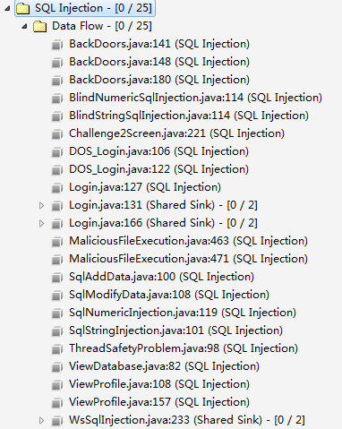
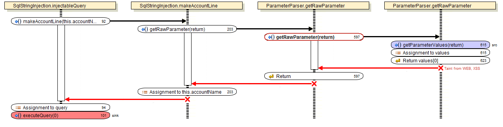
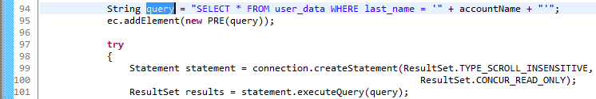
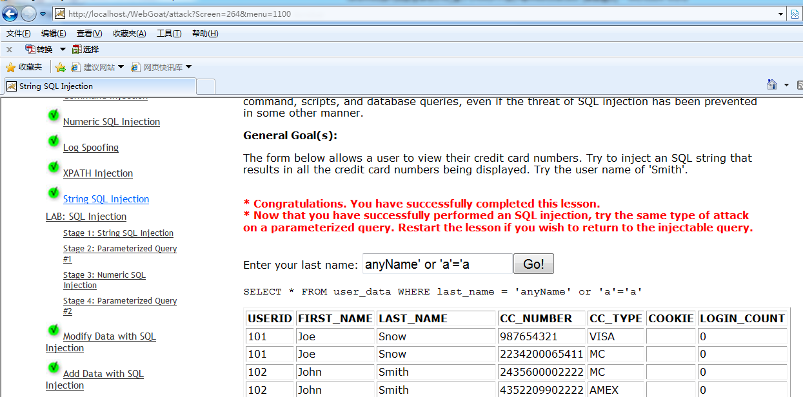
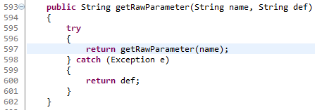
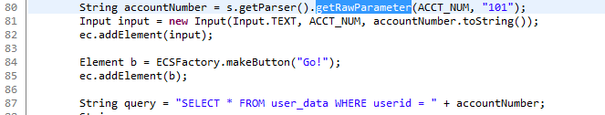
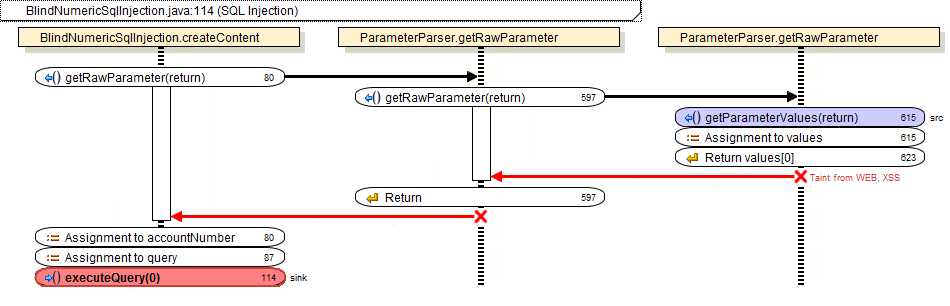
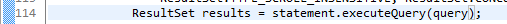
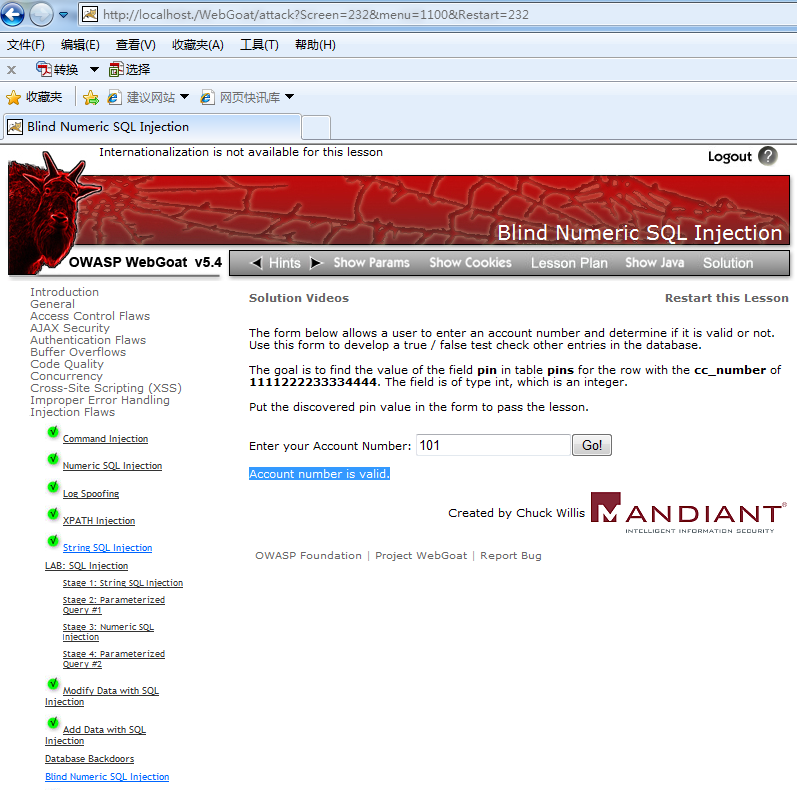
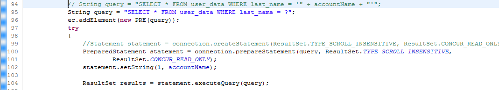

# SQL 注入
WebGoat 工程的 SQL 注入源码审计思路和攻防演练

**标签:** Java,Web 开发

[原文链接](https://developer.ibm.com/zh/articles/j-lo-audit-sql-injection/)

叶林, 张东升, 贺新朋

发布: 2015-11-12

* * *

## 前言

本文是 Java Web 工程源代码安全审计实战的第 2 部分，主要讲解 WebGoat 工程的 SQL 注入源码审计思路和攻防演练。包括普通的 SQL 字符注入和 SQL 盲注两个案例，并扩展讨论了 NoSQL 注入的审计思路。

##### 图 1.WebGoat 源代码中存在多个 SQL 注入问题

## Web 应用威胁之 SQL 注入

### 技术原理

SQL 注入错误发生的必要条件有两个，首先是程序使用来自不可信赖的数据源的数据，其次是程序中动态拼接字符串构造 SQL 查询语句。

例如以下代码，第一句动态构造，第二句执行了一个 SQL 查询，搜索和指定用户名相匹配的用户数据条目。

String query = “SELECT \* FROM user\_data WHERE last\_name = ‘” + accountName + “‘”;

ResultSet results = statement.executeQuery(query);

动态构造的查询语句拼接了用户输入的字符串 accountName。如果攻击者输入字符串”anyName’ OR ‘a’=’a”，那么构造的查询语句就会变成：

SELECT \* FROM user\_data WHERE last\_name = ‘anyName’ OR ‘a’=’a’;

附加条件 OR ‘a’=’a’ 使 WHERE 从句永真，逻辑上等同于：

SELECT \* FROM user\_data;

这样攻击者绕过用户名验证，查询结果能返回表格所有用户条目。

### 问题分析之 SQL 字符注入 SqlStringInjection.java：101

源代码审计发现 SqlStringInjection.java 第 101 行 injectableQuery() 方法使用动态拼接字符串进行 SQL 查询。攻击者可以构造恶意字符串。本例中，完成一次完整的污染传播 source-path-sink 三步骤如下：

##### 图 2\. 污染数据来自不可信任的数据源 (Source)

##### 图 3\. 污染数据在程序体内部沿路径传播（Path）

上图来自 Fortify 分析工具，红色箭头指示传播路径，右紫色框代表 Source，左红色框代表 Sink。

SqlStringInjection.java 第 101 行 injectableQuery() 方法，使用了来自不可信数据源的污染数据，代码片段如下：

##### 图 4\. 污染数据被用来构造 SQL 执行语言 (Sink)

**攻击场景**

在已部署的 WebGoat 工程，打开生产环境，在左侧导航目录下点选”Injection Flaws -> String SQL Inject”, 在右侧页面文本框输入字符串”anyName’ OR ‘a’=’a”，点击’Go’提交页面。

##### 图 5.SQL 字符注入攻击场景

WebGoat 工程本例页面设计为服务器返回执行结果搜索内容，由浏览器刷新页面显示表格。攻击者可以从页面越权直接获取后台数据库信息。现实工程中，即便浏览器不直接显示 SQL 注入查询的内容，攻击者也可以通过 SQL 盲注，猜测感兴趣的内容。这将在下一个审计案例中演示。

### 问题分析之 SQL 盲注 BlindNumericSqlInjection.java：114

源代码静态扫描发现 BlindNumericSqlInjection.java 第 114 行 createContent() 方法使用动态拼接字符串进行 SQL 查询。攻击者可以构造恶意字符串。

本例中完成一次完整的污染传播 Source-Path-Sink 三步骤。

首先 ParameterParser.java 第 615 行使用 getParameterValues() 从网页用户请求 request 获取数据，代码片段：

##### 图 6\. 污染数据来自不可信任的数据源 (Source)

ParameterParser.java 第 597 行使用 getRawParameter() 传播污染数据，代码段如下：

##### 图 7\. 传递污染数据

BlindNumericSqlInjection.java 第 80 行使用污染数据对 accountNumber 赋值，并用 accountNumber 拼接 query 字符串，代码段如下：

##### 图 8\. 拼接字符串代码片段

下图来自 Fortify 分析工具，红色箭头指示传播路径，右紫色框代表 Source，左红色框代表 Sink。

##### 图 9\. 污染数据在程序体内部沿路径传播（Path）

BlindNumericSqlInjection.java 第 114 行 createContent() 方法，使用了来自不可信数据源的污染数据 query，代码片段如下：

##### 图 10\. 污染数据被用来构造页面元素 (Sink)

至此污染源，路径，爆发点（Source-Path-Sink）确定。注意到程序上下文，没有对 query 的校验过滤。代码审计逻辑判断 SQL 注入漏洞成立。

**攻击场景**

部署 WebGoat 工程，启动生产环境，在左侧导航目录下点选”Blind Numeric SQL Inject”。

假设攻击者已知数据库表名和表结构信息，攻击目的是猜测表中 cc\_number==1111222233334444 的 pin 值。WebGoat 工程，本例页面逻辑不直接显示 pin 值，但是页面显示提交的页面输入是否为真。攻击者先查询 pin，再把 pin 和某个猜测值进行比较，最后观察页面显示得知提交的比较条件是否为真。

本例 SQL 盲注攻击具体做法是：

1. 在右侧页面文本框输入字符串”101 AND ((SELECT pin FROM pins WHERE cc\_number=’1111222233334444′) > 2363 )”，点击’Go’提交页面。观察页面提示可知该条件为真。

2. 再次输入字符串，把”>2363″改为”<2365″，点击’Go’提交页面。观察页面提示可知该查询条件为真。

3. 综合这两次盲注查询 2363<pin<2364 可知 pin=2364。

##### 图 11.SQL 盲注攻击场景

SQL 盲注攻击要向服务器发送系列请求，逐步缩小猜测范围，非常耗时，一般采用自动工具进行盲注。

其他 SQL 注入审计案例：WebGoat 工程设计了多个 SQL 注入案例，除了 query，还有 modify data, add data 等等涵盖了数据库操作’增删改查’四大场景。静态代码审计查出的其他 SQL 注入问题分析，攻击场景和前述的类似，不赘述。

### 解决方案

**快速修复**

修复第一个例子中的 SQL 注入。SqlStringInjection.java 第 94、99 行 injectableQuery() 方法，注释掉原来代码，替代之后代码片段如下：

##### 图 12\. 整改 SQL 注入的代码

整改代码编译通过后，在已部署启动的 WebGoat 工程中，攻击不可重现。具体做法如下：打开生产环境，在左侧导航目录下点选 “Injection Flaws -> String SQL Inject”, 在右侧页面文本框输入字符串 “anyName’ OR ‘a’=’a”，点击’Go’提交页面，没有向攻击者提交数据库查询内容。

以上思路是 SQL 语句预编译。下面系统地论述不同应用场景下其他可能的整改方案。

### 举一反三

SQL 注入是传统手法，攻防技术都比较成熟。以下提供三种防御思路。首先最简单有效的方法是 SQL 命令行预编译解析器。开发者也可以自定义数据库访问策略进行数据消毒。如果工程中使用到 SQL 持久化框架比如 iBATIS，要根据不同数据库类型对框架进行加固。

**SQL 命令行解析**

SQL 命令行解析器提供了自己的数据净化和验证的方法。当存在这样的方法的时候，应当优先考虑它们，因为自定义的方法会忽略一些特殊情况，会忽略解析器自身所隐含的复杂性。除了性能和安全性，使用 SQL 命令行解释器还能提高代码的可读性和可维护性。

用 PreparedStatement 代替 Statement, 通过使用 PreparedStatement 类的 set\*() 方法，可以进行强制类型检查，会自动转义引号内的输入数据。减少 SQL 注入漏洞。具体代码片段形如：

1) paramerize the Query，//先用? 替代用户输入

2) PrepareStatement

3) add the parameters to the query：

statement.setString(1, userId);

statement.setString(2, password);

**开发者自定义数据库访问策略和数据消毒**

虽然首选 SQL 预编译解析器，开发者还是可以根据实际情况，自行灵活编程防御 SQL 注入。

1. 编程手动替代单引号，删除连字符。这两个符号是攻击者拼接恶意 SQL 代码的关键。假定合法用户不会在查询输入中使用这两个符号进行 SQL 代码拼接。单引号的替代方法是：单独出现的单引号替代为两个单引号。连字符是用于注释，可以直接删除连字符。

2. 使用存储过程执行查询。存储过程 SQL 传参过滤单引号和连字符。这防止了攻击者使用单引号和连字符进行 SQL 注入。

3. 编程使用 Apache commons-lang.jar 提供的系统库函数。

StringEscapeUtils.escapeSql(string);

1. 限制查询字段的长度。这将增加攻击者插入恶意代码的难度。

2. 输入数据消毒。加密输入的用户名密码，再把它们和数据库中保存的数据进行比较。推荐使用 System.Web.Security.FormsAuthentication.HashPasswordForStoringInConfigFile(password.Text, hashMethod)。这相当于对输入数据进行了消毒，用户输入的数据对数据库不再有特殊意义，从而防止了攻击者 SQL 注入。

开发者选择以上自编程方式时，要考虑到工程性能和易实现性。比如加密输入数据，由于要在后台数据库维护密文信息以供比对，所以往往只应用在用户名和密码这样的关键敏感信息，而不普遍使用。

**加固 SQL 持久化框架**

大规模的工程项目往往使用数据库 ORM(Object Relation Mapping) 对象关系映射框架，其基本思想是要通过配置文件来减少编程代码，达到协助数据库开发的目的。例如 iBATIS 就是一个常用的支持 Java 的 SQL 的持久化框架。iBATIS 中的 like 查询，要使用$写法。如果采用$写法，则相当于拼接字符串，会出现注入问题。

解决方法 iBATIS 框架下的注入，要根据不同数据库类型，重写 like 查询，用不同符号写法代替使用$符号的地方。比如对于 DB2，可以使用’%’\|\|’#param#’\|\|’%’或者 CONCAT(‘%’, #param#, ‘%’) 来避免$ param$；对于 Oracle，可以通过’%’\|\|’#param#’\|\|’%’避免；对于

MySQL，可以通过 CONCAT(‘%’, #param#, ‘%’) 避免；对于 SQLServer，可以通过’%’+#param#+’%’避免。

**讨论 NoSQL 注入**

非关系数据库 (NoSQL) 结构相对简单，性能较高，能动态增加表格属性，扩展性好，所以在大数据分布式场景下广泛应用于大型 Web 电商。

目前对 NoSQL 的注入攻击研究虽然不常见，可预见在将来会随着 NoSQL 的发展而相应发展。例举两个 NoSQL 注入案例：

Hacking NodeJS and MongoDB

展示了用 NoSQL 数据库 MongoDB 的 [$ne] 操作符，进行注入攻击的例子：

如果用户正确传参 username=test&password=test 那么 MongoDB 执行 db.test.find({username：’test’,password：’test’});

如果用户恶意传参 username[$ne]=test&password[$ne]=test 那么 MongoDB 执行 db.test.find({username：{‘$ne’：’test’},password：{‘$ne’：’test’}});

因为传入的$ne 是 mongodb 的一个操作符，代表不等于。所以对应的 SQL 语义是：

select \* from test where username!=’test’ and password!=’test’;

条件从句总是为真，攻击者绕过用户名密码验证，成功查询数据库所有用户条目。

OWASP Testing for NoSQL injection

展示了用 MongoDB 的$where 关键字实现 NoSQL 注入例子：

$where： function() { //arbitrary JavaScript here }

NoSQL 数据库注入的主要问题，目前看来是混沌的语言设计。各个数据库各自使用自己的关键字和语法。比如 MongoDB 使用繁琐的 JSON 来直接表示对数据的查询，而另外一款 NoSQL 数据库 Neo4j 设计了新查询语言叫 Cypher。

这些语言设计在满足功能需求后，缺乏对安全历史教训的认识，目前没有设计出如 SQL preparedStatement 这样的安全预编译措施。注入的本质是运行时编译，如果能像 SQL 一样做预编译，情况会好很多。

数据库框架的引入也不能解决注入问题。大规模项目使用数据库 ORM(Object Relation Mapping) 框架协助数据库开发。比如 iBATIS 框架支持 SQL DB。mongoengine 框架和 mjorm 框架支持 NoSQL 的 MongoDB。但是就像 iBATIS 执行时存在 like 语句配置$问题引起 SQL 注入。各个 NoSQL 框架都有自己的设计薄弱点引起 NoSQL 注入。

NoSQL 在很长一段时间将处于这个混沌状态之中。开发者需要手工进行输入数据校验，例如不允许查询语句输入中出现$ne 等保留字，来规避数据库注入风险。静态代码审计 NoSQL 注入和 SQL 注入的思路是一致的：程序使用来自不可信赖的数据源的数据，动态构造查询语句，结合分析 source-path-sink，就可以从逻辑上判断存在数据库注入攻击。

## 结束语

本文是 Java Web 工程源代码安全审计实战的第 2 部分，主要针对 SQL 注入攻击，讲解审计逻辑，用 WebGoat 工程实现攻防演练。Java Web 工程源代码安全审计实战的第 3 部分，将审计文件路径操纵、系统日志欺骗、线程安全和资源未释放，欢迎阅读。