# Salesforce DX 在项目中的应用
Salesforce DX 对传统 Salesforce 开发模式的改变

**标签:** DevOps,Web 开发,持续集成,软件开发

[原文链接](https://developer.ibm.com/zh/articles/wa-salesforce-development-1-salesforcedx/)

杨 卓, 吴 涛

发布: 2019-10-30

* * *

## Salesforce 简介

Salesforce 包含 Sales cloud、Service cloud、Commerce cloud、Marketing cloud 四个模块，模块之间相对独立，并且相互协助，从而建立了基于云的 Salesforce 平台。当前 Salesforce 主要业务是面向客户服务，善于抓住市场走向及客户心理，尽最大的能力满足客户的需求，改变传统的客户维护及管理方式，创造简便、敏捷、有效的客户关系管理平台，因此也造就了 Salesforce 平台在 CRM（客户管理系统）行业中独占鳌头的地位。所以 Salesforce 平台其核心功能是 CRM，系统默认提供大多数 CRM 需要的功能。

Salesforce 依照 SaaS（软件即服务）的概念，将系统完全架构在云端，从而免去了用户下载、安装、配置环境变量等一切繁杂的过程，用户只需使用浏览器即可进入系统进行工作和开发，基于 Metadata（元数据）系统将服务层和元数据层分离，使得架构更加灵活，且易于拓展。除此之外，Salesforce 适用于多平台，为移动办公提供了便利，对外开放的 API 接口，方便开发者对系统进行定制。下图是 Salesforce 的系统框架：

##### 图 1\. Salesforce 系统框架

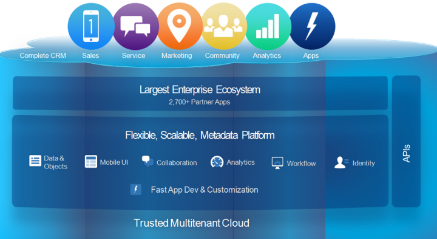

Salesforce 系统完全架设在云端，并且基于 Metadata。服务层和元数据层分离的设计增加了灵活性、拓展性，多平台的适配以及无需下载的特性极大的方便了移动办公者的使用。同时 Salesforce 具有很强的可拓展性，管理员可以通过设置界面进行自定义配置，开发者可与基于 Apex 语言、Visualforce 框架、Lightning 框架等进行二次开发。但是在软件行业，没有一个平台或者系统无论在架构的灵活性、可维护性、拓展性及开发测试部署的便捷性是完美的，难免会存在局限性，这很好地印证了”事物发展具备两面性”那句话。同样，看似完美的 Salesforce 平台也是如此。

## 目前 Salesforce 开发的痛点

常见的项目开发的流程一般是需求分析、设计、开发、测试、部署、上线等一系列流程。Salesforce 是基于云平台进行开发的，在沙盒（Sandbox）上可进行 Apex Class、Apex Trigger、Visualforce Page、Lightning Application、Lightning Component 等相关项目的开发，集成化的开发平台在一定程度上加快了开发的速度、缩短了项目迭代的周期。但看似完美的平台在项目的开发中却仍然存在问题。

目前开发者主要是通过部署不同类型的沙盒进行开发，如图 2 所示:

##### 图 2\. 沙盒开发

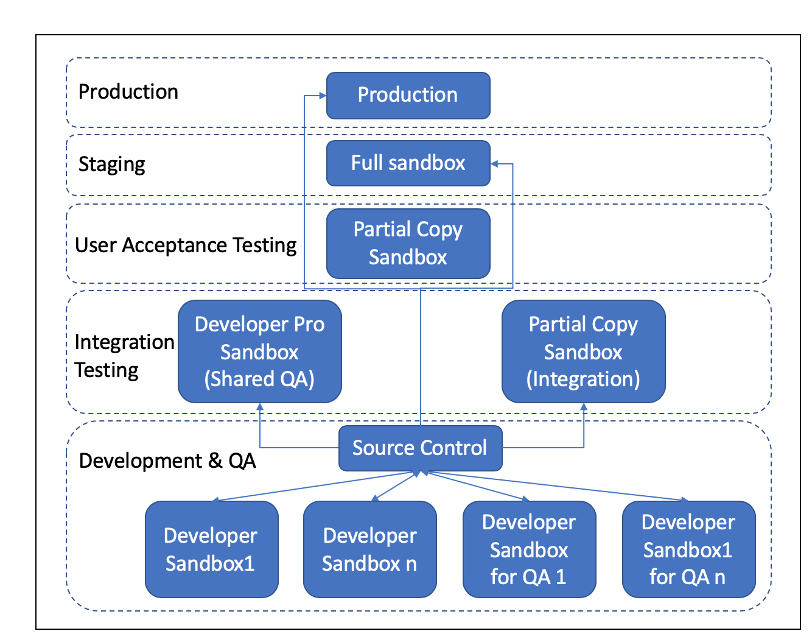

如上图所示，我们会发现，当同时开发多个功能时，为了保证代码的互不干扰，相互独立，需要同时拥有多个开发的沙盒。这就造成了沙盒环境搭建的缺陷之一——局限性，每个沙盒不能够同时拥有所有已开发功能。每当需求结束或有了新的需求，我们需要消耗大量时间成本来刷新已有沙盒甚至创建新的沙盒，这同时还存在着安全隐患。不恰当的操作可能会引起连锁反应，不仅仅影响到一个单独的功能，这种损坏对于平台会造成极大的损失，另外也会浪费相当大的人力物力、时间成本来修复问题，这将会严重影响项目的进度，对于 Agile 是极其不利的。

抛弃传统的瀑布式开发模式，敏捷模式开发使得各个模块之间的开发、测试、部署、上线步骤得到了极大地简化，高效率地缩短了迭代周期。当前 Salesforce 的开发环境主要是 Developer Console 或者 VS Code，开发者可以在上面编写、提交自己的代码，保存的时候 Salesforce 对其进行编译，编译通过后可直接在云端上运行代码，这看似快速有效的开发模式，但是会存在这样令人头疼的问题：多个项目组在同时进行开发时，由于各个模块间共同实现整体功能，开发过程中会难以避免的产生相互影响、链式依赖、部署时间太长（至少 2.5 小时）等问题，严重降低了项目交付的速度。那么能否针对当前存在的弊端，改变传统的的开发部署方式的同时，又能像 Git 一样具备版本管理系统的功能呢？答案就是 Salesforce 平台推出的 Salesforce DX。

## Salesforce DX 简介

Salesforce DX（Salesforce Developer Experience）是 Salesforce 推出的一个新的开发和部署模式，通过在 Lightning 平台上管理和开发应用程序来简化开发生命周期。Salesforce DX 还支持驱动开发（Driven Developing），通过在 Salesforce 上自定义应用程序开发提高敏捷性；此外，Salesforce DX 加入了团队协作功能，促进了自动化测试和持续集成，并使发布周期更加高效和灵活，从而给予了开发者最佳体验。Salesforce DX 拥有非常多的工具和功能，提供可以选择的个性化构建团队工作流程，从而帮助开发者实现技术的提升。

对于 Salesforce DX 的开发，我们最常用的编辑器还是 VS Code。通过 CLI 能够自动化构建开发环境并灵活地配置 Scratch org，这就减少了人工操作，大幅度提高了开发效率，并保证代码的持续集成以及最后的部署。通过版本控制，在不同 org 开发代码，保证代码库中代码为可信源码来将每次可信的交付 merge 进入版本库中实现版本控制。此外，VS Code 对 Salesforce DX 有一些开发插件，如 Salesforce Extensions 可加速应用程序开发，而且它能够支持 Apex、Lightning、Visualforce 等的开发。

### Salesforce DX 的优点

Salesforce DX（下文简称 SFDX）符合快速迭代的开发模式，它提供了统一的命令行工具在代码库和服务器之间进行通信和同步。

#### 对快速迭代的支持

为了改进基于沙盒开发这种缺陷，SFDX 提供了一种新的概念：Scratch org，一种可以快速搭建的”沙盒”，只包含了特定的功能。开发者可以通过 SFDX 中的设置快速创建 Scratch org，在上面开发新的功能，然后将所做的更改直接提取出来放到代码库中进行整合。于是，之前笨重的”开发沙盒”就被轻盈的 Scratch org 所取代，为快速迭代和持续集成提供了更好的支持。

#### 统一的命令行工具

Salesforce 随着 SFDX 一起推出了命令行工具（下面简称 CLI）。在此之前，开发者一般使用官方的 Force.com IDE 或其他第三方插件（比如 MavensMate）来进行本地代码和服务器之间的通信。CLI 作为整合这些功能的工具而出现。它可以和各种代码编辑器结合使用，包含了在开发中需要的各种操作和命令，让开发者可以更方便地将本地修改上传到各种 Scratch org 中或者将 Scratch org 中的修改同步到本地代码库。

## Salesforce DX 在实际项目中的应用

下面通过一些简单的例子来介绍关于 SFDX 的工作流程。

### 前提条件

在使用 SFDX 开发之前，您需要先完成以下几个要求：

1. 拥有一个 Salesforce 环境作为建立 Scratch org 的基础（在 SFDX 中被称为 “Dev Hub”）。
2. 在第一步中的 Salesforce 环境中通过”设置（Setup）界面”搜索 Dev Hub 来启用 Dev Hub 功能。
3. [安装 Salesforce CLI 工具](http://www.salesforce.com/) 。

### 登录 Dev Hub 环境

在进行开发之前，先要登录 Dev Hub 环境。打开命令行，输入以下命令：

```
sfdx force:auth:web:login -d -a CRMDevHub

```

Show moreShow more icon

`sfdx force:auth:web:login` 是 SDFX 开发的基础命令，用来登录 Salesforce 开发环境; 参数 `-d` 表示接下来登录的 Dev Hub 是默认设置。系统中可以同时拥有多个 Dev Hub。要注意的是，当创建了 Scratch org 后，该命令也可以用来登录 Scratch org。此时不要使用参数 `-d`; 参数 `-a` 是为这个 Dev Hub 设定一个好记的别名。在这里我们使用 `CRMDevHub` 。回车此命令之后，系统会自动打开浏览器，跳转至 Salesforce 的登录页面。在此页面中像平时一样登录要作为 Dev Hub 的 Salesforce 环境即可。在登录之后，该 Dev Hub 就被作为接下来创建 Scratch org 的基础，记录在系统中。

在命令行中输入以下命令即可打开浏览器直接进入刚才建立的以 `CRMDevHub` 为别名的 Dev Hub 环境，当创建了 Scratch org 后，该命令可以用来打开浏览器直接进入 Scratch org。

```
sfdx force:org:open -u CRMDevHub

```

Show moreShow more icon

### 建立 SFDX 项目

在使用 SFDX 之前，需要先建立一个项目。在命令行中使用以下命令建立一个名为 `CRMProject` 的项目：

```
sfdx force:project:create -n CRMProject

```

Show moreShow more icon

该命令会构建以下目录结构：

##### 图 3\. SFDX 项目目录

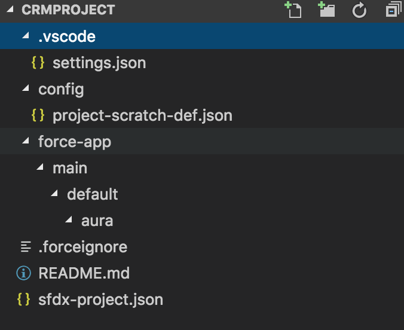

其中， `sfdx-project.json` 文件包含了该项目的基本信息， `config` 文件夹下的 `project-scratch-def.json` 文件包含了建立 Scratch org 的基本配置信息， `force-app` 目录则用来存放代码。

### 建立 Scratch org

使用命令行进入 SFDX 项目的目录，然后输入以下命令即可建立一个 Scratch org：

```
sfdx force:org:create -s -f config/project-scratch-def.json -a CRMScratchOrg

```

Show moreShow more icon

以下是部分参数解释：

- `-s` ：把即将建立的 Scratch org 作为该项目默认的 Scratch org。
- `-f` ：声明了即将建立的 Scratch org 是基于哪一个配置文件。
- `-a` ：参数是设定别名。

成功后，命令行会出现以下提示信息：

##### 图 4\. Scratch Org 建立成功提示信息

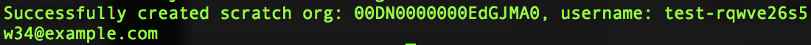

接下来使用命令 `sfdx force:org:open -u CRMScratchOrg` 即可打开浏览器直接进入刚才建立的以 `CRMScratchOrg` 为别名的 Scratch org。使用命令 `sfdx force:org:list` 可以查看当前系统中已经记录的 Dev Hub 环境和已经建立的 Scratch org 列表。

##### 图 5\. Scratch Org 列表

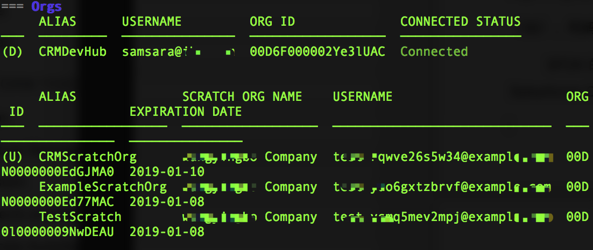

### 使用 Scratch org

在 Scratch org 中，开发者（或管理员）可以和使用真正的 Salesforce 环境一样开发或配置功能。与此同时，Salesforce CLI 工具也提供了一系列的命令来进行相关的操作，比如建立 Apex 类、Visualforce Page、Lightning 组件等。

### 代码库与 Scratch org 同步

SFDX 的一个重要功能就是将代码库与 Scratch org 同步。Salesforce CLI 提供了两个重要的命令来实现这些操作： `sfdx force:source:pull` 和 `sfdx force:source:push` 。

开发者可以登录 Scratch org 进行开发和配置。当完成开发后，可以在 SFDX 中使用命令 `sfdx force:source:pull` 来将更改同步到本地的代码库。比如：在上面建立的 Scratch org 中建立一个新的自定义对象 `IBM_Entitlements` ，API 名字叫 `IBM_Entitlements__c` 。要将此更改同步到本地代码库，可以在命令行中运行 `sfdx force:source:pull` 。运行的结果如图：

##### 图 6\. 同步代码运行结果

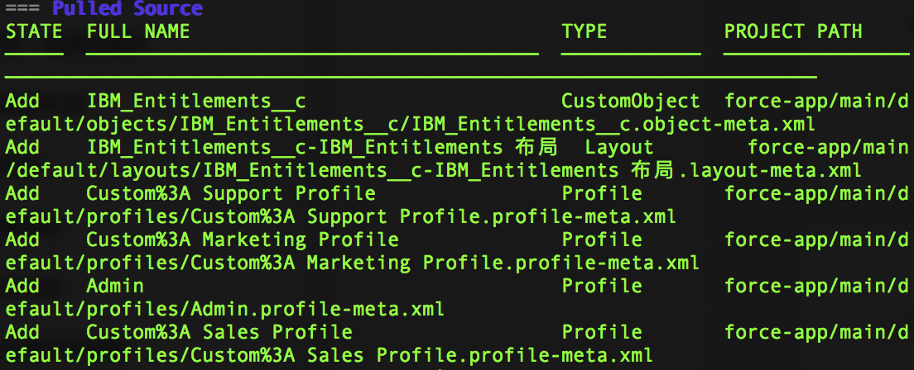

可以看到，刚才建立的新的自定义对象，包括随之生成的页面布局，以及相关的简单设置都以元数据的形式保存到了 `force-app` 文件夹中。

##### 图 7\. 元数据形式保存

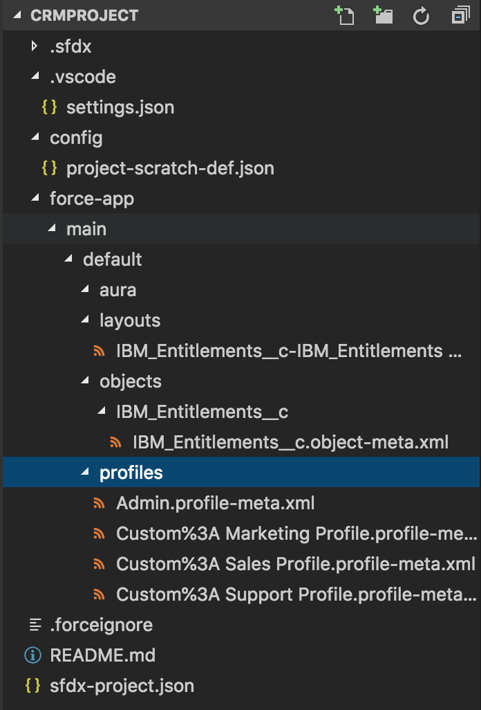

接下来开发者可以将此更改拷贝到 Git 或其他代码库中进行提交。

### 将更改从本地代码库同步到 Scratch org

在本地代码库中，也可以新建一些组件，比如 Apex 类或 Lightning 组件，然后通过命令 `sfdx force:source:push` 将其同步到 Scratch org 中。比如，在之前建立的 Scratch org 中并没有任何 Apex 类，我们在命令行中运行：

```
sfdx force:apex:class:create -n IBMEntitlementController -d force-app/main/default/classes

```

Show moreShow more icon

这条命令就在本地代码库的文件夹 `force-app/main/default/classes` 下面建立了一个名叫 `IBMEntitlementController` 的 Apex 类。执行结果如图 8 所示：

##### 图 8\. 建立 Apex 类

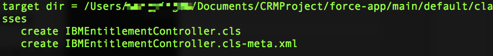

然后在命令行中运行 `sfdx force:source:push`，\_ 运行的结果如图 9 所示：

##### 图 9\. 同步代码至 Scratch

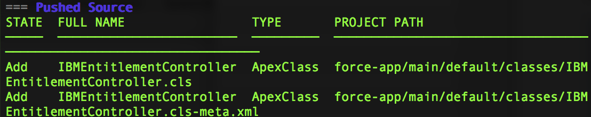

接下来，我们登录 Scratch org，进入 Developer Console，可以看到刚才建立的 Apex 类 `IBMEntitlementController` 已经被同步过来了。

##### 图 10\. 在 Scratch org 中查看代码

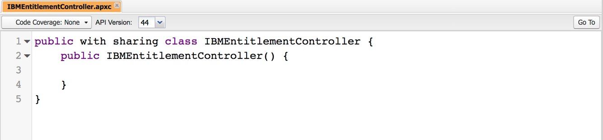

### 使用 Salesforce DX 创建 Salesforce DevOps 流程

相比于其他平台，Salesforce 的 DevOps 有所不同。它可以归结为开发-发布周期中的任何部分，虽然这些部分仍然是手动的，但是可以自动化。主要通过四个方面提高自动化：发布、追踪变化、单元测试以及备份。那么 Salesforce DX 又是通过什么来帮助 Salesforce 的 DevOps 呢？

SFDX 提供了一些模块来帮助用户整合工作流。因此开发人员可以在各自的 scratch org 中进行开发，并 commit 到代码库中，然后代码可以被部署到其他 sandbox 来进行测试以及 UAT，最后部署至生产（Production）环境。部署的方式就是把所有的元文件（Metadata）打包到一个 Package 里，然后通过 Metadata API 部署到其他环境，无论是 Sandbox 还是 Production。

##### 图 11\. 使用 Salesforce DX 创建 Salesforce DevOps 流程

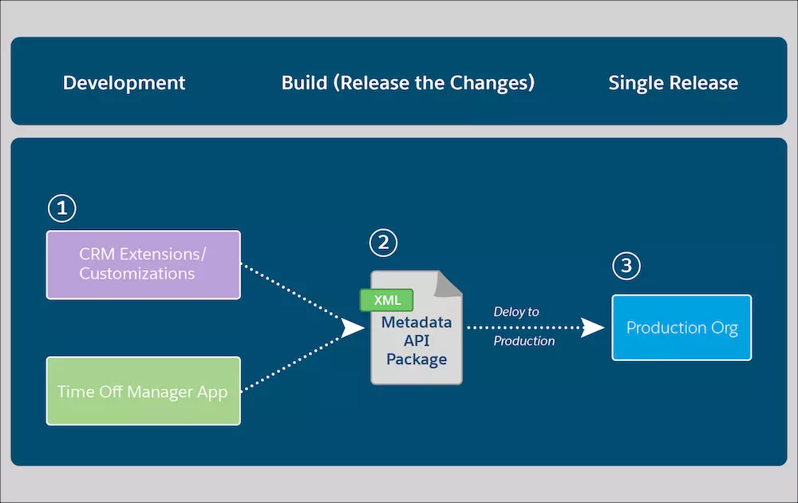

## 结束语

通过以上介绍，我们了解了 Salesforce DX 是什么以及 Salesforce DX 在项目中的应用，从环境登录、创建项目到项目的部署整个过程，并进一步了解了 Salesforce DX 为实际项目的快速迭代开发所带来的便捷。