# Salesforce 的未来 — Lightning 初体验
Salesforce 开发之前端框架

**标签:** Web 开发,前端开发,软件开发

[原文链接](https://developer.ibm.com/zh/articles/wa-salesforce-development-4-lightning/)

杨卓

发布: 2020-08-18

* * *

## Classic 和 Lightning 模式

对于 Salesforce 来说，分为 Lightning 和 Classic 两套系统，即 Lightning Experience 和 Salesforce Classic。Classic 与 Lightning 都能够应用于移动端、PC 端的程序，用来响应式构建单页面应用程序。但与 Classic 相比，Lightning 在界面和开发上都做出了很大的改变。首先在 UI 上，Lightning 让 Salesforce 的 UI 增强了用户体验，增加性能图表（Performance Chart）、Assistant（用来展示 Task），为 Chart 增加 filter，增加销售路径（Sales Path），加强版仪表板（dashboard）等。其次，在模式方面，想必大家对 MVC、MVVM 等模式有所耳闻，而 Lightning 使用的则是 VCCM 模式（View-Controller(js)-Controller(Apex)-Database(Model)），相比于 Classic 的 VCD（View-Controller-Database）模式，Lightning 的模式将前端的 JavaScript 单独拿出来放置于一个控制器（Controller）中，而视图（View）中则不必存在任何 JavaScript。由于 Lightning 的组件化开发，组件能够得到更高的利用率。

下面为大家介绍一下怎样切换到 Lightning，一般对于有 Standard Profile 的用户来说，会自动被赋予 Lightning 的权限，而对于 Custom Profile 的用户来说往往是没有权限的。如果 Custom Profile 的用户希望使用 Lightning，那么可以通过创建一个具有 Lightning 权限的 Permission Set，并应用到用户来获取权限。一旦获取了 Lightning 的权限，用户每次登录都会默认到 Lightning 的版本，当然也可以切换到 Classic 的版本，如图所示：

**图 1\. Classic 模式及 Lightning 模式的切换**

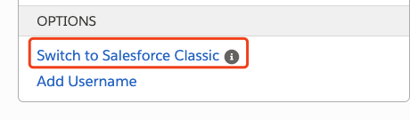

## Lightning 的两种编程模式

Lightning 开发有两种编程模式，Aura 和 LWC（Lightning Web Components）。初期的 Lightning 都是由 Aura 进行开发的，现在是两种模式并行开发，因为最开始 LWC 的模式不符合 Web 标准。相比于 Aura，LWC 使用了 JavaScript、HTML、CSS 等更符合 Web 标准，所以对于开发人员来说更加容易上手。虽然两者的开发方式不同，但是并非水火不容，您同样可以在一个应用程序中同时使用 Aura 和 LWC，要注意的是 Aura 的组件能够包含 LWC 的组件，但是 LWC 的组件不能够包含 Aura 的组件，所以如果您要构建一个 Lightning 的组件，一定要确认一旦 LWC 作为根节点，那么中间嵌套的任何组件都不能是 Aura 的。下文将分别介绍这两种编程模式。

## Lightning 的一代框架 — Aura

首先来详细介绍一下 Lightning 的 Aura 开发。在 [Salesforce DX 在项目中的应用](/zh/articles/wa-salesforce-development-1-salesforcedx) 中已经介绍过了怎样使用 VS Code 来运行 Salesforce 程序，这里就不再赘述了，下面直接通过 Developer Console 为大家介绍 Aura 的开发知识。

### 创建 Aura 组件

首先进入 Developer Console，这里管理着我们所有的代码。

**图 2\. 进入 Developer Console**

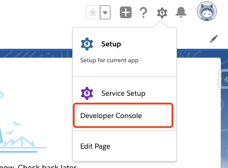

进入 Developer Console 面板就可以创建 Lightning 组件了。

**图 3\. 新建 Lightning 组件**

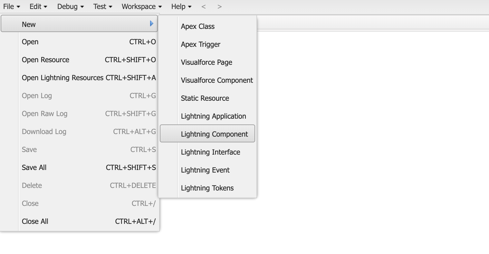

然后，新建一个 Lightning 的 Bundle。

**图 4\. 创建 Lightning Bundle**

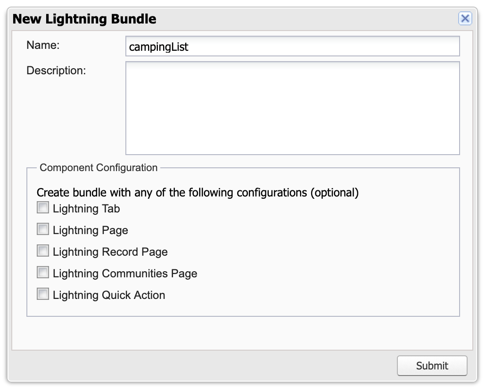

可以看见生成了一个 Lightning Component Bundle，其实一个 Component 就是一个包括定义资源以及其它可选资源的 Bundle。

**图 5\. 生成的 Lightning Bundle**

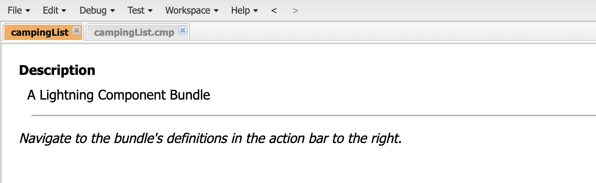

文件已经自动生成了最外层节点，接着需要向节点中间插入要开发的内容。打开 `.cmp` 文件，编辑 Component。

**图 6\. 编辑 Component 代码图**

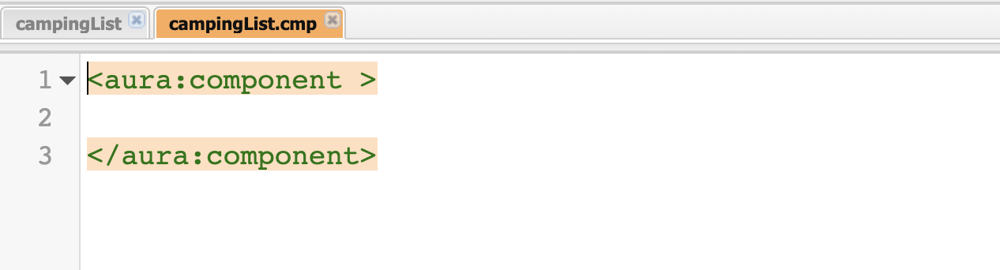

这里假设插入了一个名为 `campingList` 的订单列表。我们现在拥有了一个 Lightning 的组件，但是还需要一个容器来盛装组件才能看到组件，所以要再创建一个 Application 来向其中添加组件：

**图 7\. 创建 Lightning Application**

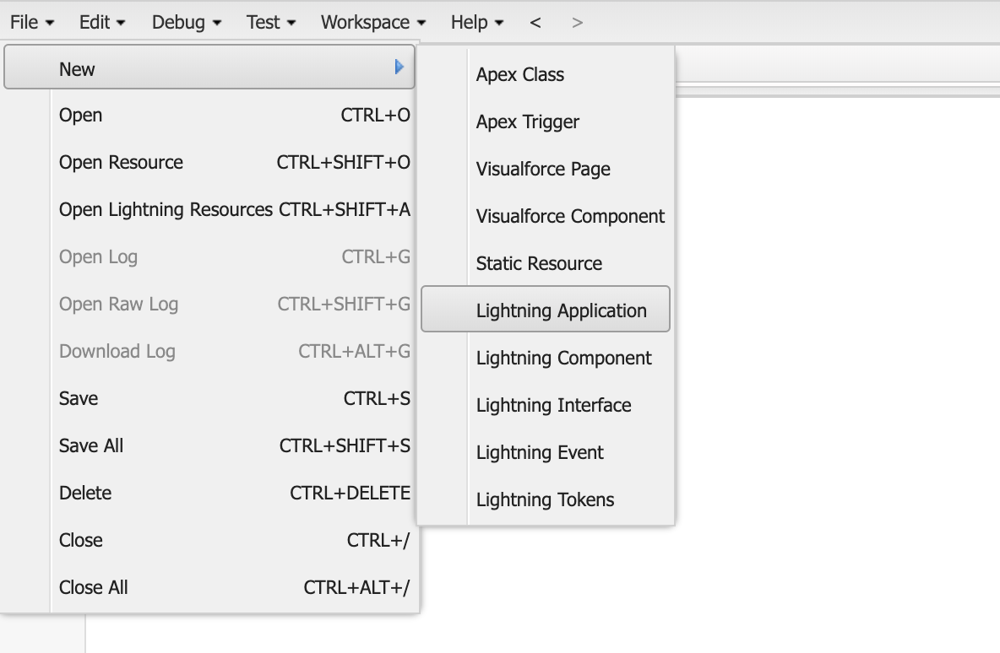

**图 8\. 将 Component 插入 Application 代码图**

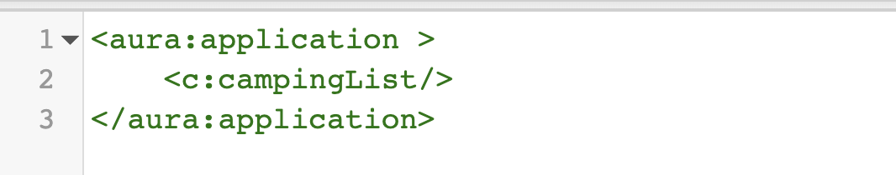

现在通过 Preview 按钮就可以查看结果了。App 具有一个独立的 URL，用来测试开发结果并发给用户，App 本质可以理解为一种特殊的 Component，但是与 Component 不同的有以下几点：

- 标签：Component 是 `<aura:component>`，而 App 则是 `<aura:application>`。
- 只有 App 才有 Preview 来查看开发效果。
- 可以将 Component 插入 App，或者插入其他 Component，但是不能够在 App 中插入 App。

所以 App 不能够被添加到 Lightning Experience 或 Salesforce App 中，能够添加的只有 Component。

**图 9\. 查看 Bundle**

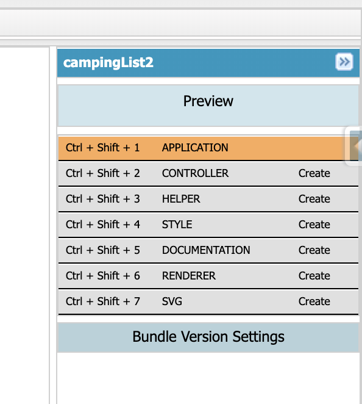

这就是组件的输出效果：

**图 10\. 查看组件输出结果**

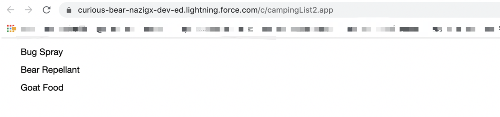

## 设置组建的属性、表达式

至此我们已经可以成功的创建 Component 了，但是作为开发者不能够满足于纯静态的组件，这时候就需要通过属性（`attribute`）来为 Component 设置值了。组件的属性可以类比对象的实例变量来理解，它可以用来存储数据值，如 `<c:campingList message="Camp."/>`；通过 `attribute` 可以保存更改后的值，下面介绍一下怎样添加 `attribute`。

首先要定义属性，例如：`<aura:attribute name="whom" type="String" default="world"/>`

可以接收以下三个可选属性：

- `default`：定义了默认属性，在需要引用属性但是并没有设置属性的时候使用。
- `required`：指定了是否为必须字段，默认为 `false`。
- `description`：定义了该属性的简要用法和介绍。

**图 11\. 为 attribute 设置数据类型代码图**

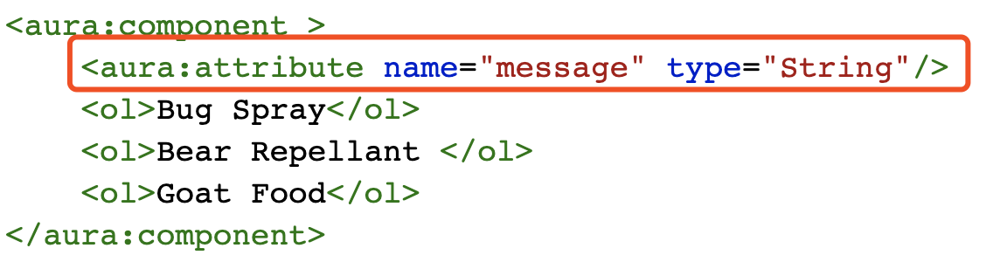

下面来说明一下 Attribute 所支持的数据类型。上文中的 message 是 String 类型，事实上 Attribute 不仅支持原始数据类型如：Boolean, Date, DateTime, Decimal, Integer, Long, String 还支持集合如：List, Map, Set；自定义的 Apex 类；以及标准的或自定义的 Salesforce 对象，如 Account 等。

完成填加 Attribute 后，就可以通过 `{{!v.message}}` 在 HTML 中调用。`v` 代表了值的提供者，也就是对数据进行分组、封装以及获取的方法。同样，您可以以相同的方法去获取嵌套值的属性，如：`{{!v.account.Id}}`。

### 通过 Controller 为程序添加事件

现在可以通过 XML 来获取更改变量了，但是仍然不能够对一些用户操作做出响应，这就要 JavaScript 来实现一些事件了。我们很容易就能够添加两个按钮：

**图 12\. 向 Component 中添加 Button 代码图**

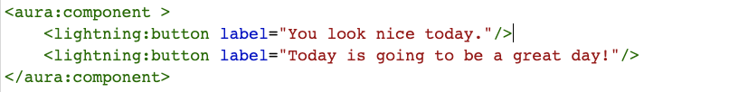

效果如下图所示：

**图 13\. 查看 Component 效果**

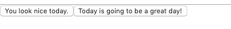

但是这两个按钮点击了也没有响应，可以通过 onclick 事件来为按钮绑定事件：`onclick="{!c.handleClick}"`，这个时候代码就变成这样了。

**图 14\. 为 Component 绑定事件代码图**


但是按钮仍然不能点，点了会报错，因为我们需要声明所绑定的事件。`c` 与 `v` 类似，都是值提供者，`c` 就是组件客户端 controller 的值提供者，而 handleClick 则是在 controller 中定义的方法。所以需要创建一个 controller 去声明绑定的事件。对于 Lightning 组件来说，controller 在 Bundle 中的作用就是集中管理用户事件如 input、click 等，action handler 作为事件的处理函数是要写在 controller 中。那么定义一个 action handler 需要哪几部分呢？如图 15 所示，与其他组件一样，通过 `action 名 + ：+ {}` 中间写入具体的动作代码，首先获取点击对象，而后设置交互内容、更新值，最后通过 `attribute` 进行更新。注意不同 action 之间要用 , 隔开。

**图 15\. 向 Controller 中添加 action handler 代码图**

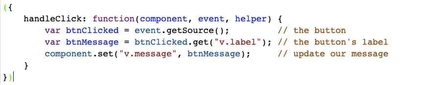

定义 action handler 后，在 component 中通过 `{{!c.actionHandler}}` 来调用它。

### 通过服务器端的 Controller 来连接到 Salesforce

现在我们已经能够成功地给程序添加事件，但是始终是在前端（客户端）做事情，我们还要做的事情是将数据存回服务端。前面提到过 Lightning 是 VCCM 模式的，其中 XML 格式的 component 是 View，服务端的 Controller 是一个 C，另一个 C 就是后端的 Controller，而 M 就是 Model 即与数据库的交互。

**图 16\. VCCM 模式交互图**


#### 从 Salesforce 查询数据

那么现在就看看怎样从 Salesforce 读取数据。首先要创建一个 Apex Controller，在其中编写前端 Lightning 组件调用的方法接口。创建一个 `ExpensesController.apxc`，如下图所示：

**图 17\. 创建 Controller.apxc 代码图**

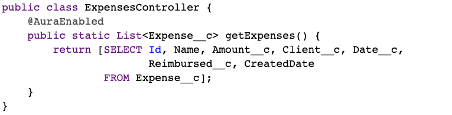

在这个方法中包含了一个 SQL 语句，用来从数据库中查找数据。这个接口函数包括了`@AuraEnable`，我们这里介绍的框架就是 Aura，所以这里用了 AuraEnable 用来声明；另一个就是方法是 static 的，这是因为@AuraEnable 的 controller 方法必须是静态的。至此我们完成了从 Salesforce 查询数据。

#### 加载 Salesforce 数据

完成数据查询，就要将结果加载出来，换做 Web 开发，也可以说是前后端联调。首先要将 Component 与 Apex 的 Controller 绑定，也就是在 component 的标签内加上 controller 的名称就可以了：

`<aura:component controller="ExpensesController">`

然后通过 `<aura:handler>` 来加载数据：

`<aura:handler name="init" action="{!c.doInit}" value="{!this}"/>`

再来分析一下 handler 的结构，`<aura:handler>` 与 `<aura:component>` 等其实就是一个标志，用来处理事件的；`init` 是 event 的名字，在组件初始化之后渲染之前被触发，而 `doinit` 则是对应的 JavaScript Controller 中的事件。而后在客户端要通过调用客户端的 Controller 来获取加载的值。

**图 18\. 调用客户端获取加载值代码图**

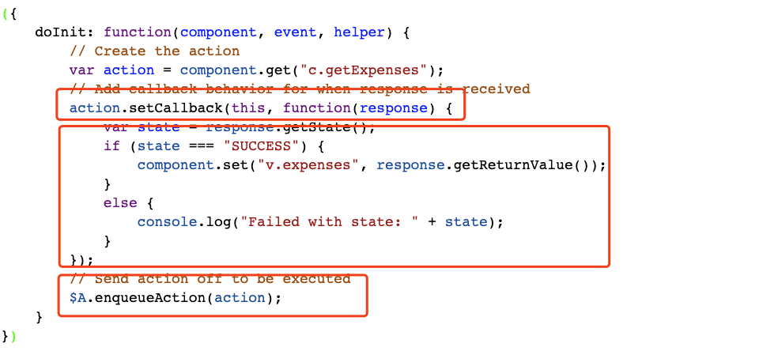

可见写法与 Ajax 很相似，这个名称对应了上面 `<aura:handler>` 中的 action，等于在 handler 中对这个 `doInit` 方法进行调用。每一次的调用分为三步，首先通过 `setCallback()` 创建远程调用，而后调用得到结果后去做需要做的工作，最后将远程调用放在队列中，即完成调用。

#### 向 Salesforce 保存数据

能够接收数据，最后就是向 Salesforce 保存数据了，其实与加载数据类似，不同的是要将需要存的数据写入一个 JSON 对象，通过 `action.setParams` 传递给服务器端。

**图 19\. 向 Server 端发送数据代码图**

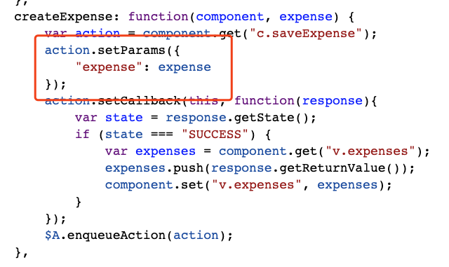

#### 通过 Event 连接组件

因为组件之间是相互独立的，那么组件之间要怎样互相影响呢？可以如前面所讨论的方法，或在组件的标签上设置公共属性，这就需要通过 event 来达成。Event 分为 component events 和 application events，这里主要介绍前者。首先还是从创建开始。

**图 20\. 创建 Lightning Event**

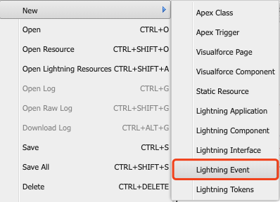

然后我们就可以创建一个 event 了。

**图 21\. 创建 Event 代码图**

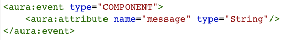

然后在 component 中注册 event，才能够使用它。

**图 22\. 注册事件代码图**

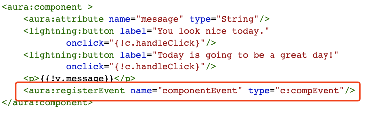

事件被注册完成后，被触发即可作用了。首先配置一些 handler，保证事件被触发后能够调用到 controller 中的方法来执行业务逻辑。

**图 23\. 触发事件**

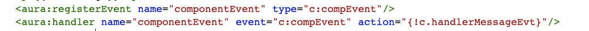

最后让 event 执行，我们还需要触发它并在 Controller 中加入业务逻辑，controller 中对应方法的名称即为 action 中所调用的名称。

**图 24\. 向 controller 中添加业务逻辑代码图**

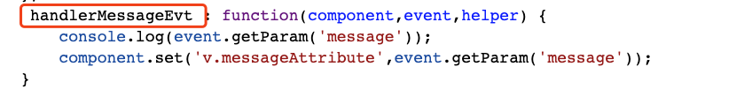

以上就是 Aura 的一些基础知识，它作为 Lightning 的前端框架之一，为开发者提供了很多方便，也相对比较容易上手学习。

## Lightning 的新一代框架 — LWC

LWC 是 Lightning Web Component 的简称，顾名思义它是 Salesforce 平台推出的最新 Lightning 前端开发组件。LWC 在 Salesforce 平台 2019 年春季版正式上线，用来构建 Lightning 组件，而 Lightning 前端的展现无疑是 Salesforce 的界面标准，很快也会是唯一标准。相信在不远的将来，Lightning 的大部分开发工作，都会以 LWC 的形式展开。接下来 VF page 页面的开发也会逐渐走向末路，LWC 会成为新一代 Salesforce 界面开发的主流框架。可以说，LWC 是 VF page 的终结者，也是 Lightning 的播种机。

LWC 最大程度的借用现有的 Web 最新标准，而且在它之上还做了必要的扩展：Security（安全），Lightning Data Service（Lightning 数据服务），Base Lightning Components（基本 Lightning 组件）。所以做 LWC 开发您不用学太多 Salesforce 平台定制的框架及组件，而是学会更多的复用编写其他前端组件的经验，而能复用的知识才更有推广的意义且更有价值。

### 揭秘 Lightning Web Component

Salesforce 公司为什么推出 Lightning Web Component？现代浏览器都是基于 Web 标准的，不断发展的标准不断地改进浏览器可以呈现给用户更优质的内容。用户希望自己的产品能够利用这一点。

万维网联盟(W3C)为 Web 组件发展了一个新的标准。Salesforce 公司正在调整组件以适应新的标准 — LWC 组件是 W3C Web 组件标准的一个实现。随着 Web 组件标准的成熟，LWC 模型将寻求与这些标准的一致，以提供向后兼容性和渐进增强。组件使用了更多的本地浏览器特性，因此它们非常快速和可移植。您的 HTML 和 JavaScript 技能将直接转移到组件开发中。

LWC 组件编程模型同时关注开发者和用户体验。它打开了现有技术的大门，可以使用在 Salesforce 之外开发的技能来构建更高性能的 Lightning Web 组件。所有这些都是可用的，而不必放弃您已经完成的 Aura 组件。

您可以在不放弃现有组件的情况下使用 Lightning Web 组件。最终可能会将现有组件迁移到 Lightning Web 组件模型，但是我们将引入 Lightning Web 组件，而不会从 Aura 组件的现有支持中删除任何内容。Aura 组件和 Lightning Web 组件可以很好地共存。

事实上，Aura 组件可以包含 Lightning web 组件，反之则不然。但是，一个纯粹的 Lightning Web 组件实现提供了完整的封装，并遵循通用标准。

### LWC 开发工具

LWC 与很多开发工具有较好的集成，以下是常用的八种工具介绍。

**Dev Hub 和 Scratch Orgs**

Scratch Orgs 是一次性的 Salesforce 组织，用于支持开发和测试。Dev Hub 是一个管理 scratch 组织的功能。它们都是 Salesforce DX 工具集的一部分。Salesforce DX 是一个由 Salesforce 构建和支持的集成开发工具集。

Salesforce 命令行接口(CLI) 提供了一种快速的方法来运行创建和配置 scratch 组织以及部署组件的操作。它也是 Salesforce DX 工具集的一部分。

**Lightning Component Library**

关于 Aura 和 Lightning Web 组件以及如何使用它们的参考 [这里](https://developer.salesforce.com/docs/componentlibrary/overview/components)。您也可以通过 [Org 的实例](https://developer.salesforce.com/docs/component-library/overview/components) 来查看这个库。

通过实例查看库，您只能看到组织的正确版本。而且，当您创建自己的自定义组件时，它们也会出现在库中。

**GitHub**

通过 GitHub repo 共享扩展、示例和更多内容。注册一个 GitHub 账户，确保您可以利用这些服务。

**Visual Studio Code Extension**

将 Visual Studio 作为一种开发工具，为您提供一个集成的环境来构建组件。Visual Studio 的 [Salesforce 扩展提供代码提示、lint 警告和内置命令](https://marketplace.visualstudio.com/items?itemName=salesforce.salesforcedx-vscode-lwc)。

**Lightning Web Components Recipes**

提供了一个 GitHub repo 来帮助您了解 Lightning Web 组件是如何工作的。您可以克隆、修补和发布这些混合的示例到您自己的 scratch org 中，并查看它们的运行情况。点击 [此处](https://github.com/trailheadapps/lwc-recipes) 获得它。

**E-Bikes Demo**

这个 GitHub repo 是查看 Lightning Web 组件工作方式的另一个好方法。电动自行车演示是一个端到端实现的 Lightning 网络组件创建一个应用程序。登录 [此处](https://github.com/trailheadapps/ebikes-lwc) 获取。

**Lightning Data Service (LDS)**

通过 Lightning Data Service 来处理自 Salesforce 的数据和元数据。处理数据的基本 Lightning 组件建立在 LDS 上。定制您自己的组件，以利用 LDS 缓存、更改跟踪、性能等等。

**Lightning Locker**

属于一个名称空间的 Lightning Web 组件通过使用 Lightning Locker 的安全性来保护不同名称空间中的组件。Lightning Locker 还通过只允许访问受支持的 API 和消除对非发布框架内部的访问，促进了提高代码可移植性的最佳实践。

以上都 Salesforce 平台对 LWC 开发者提供的开发工具，想要更好的掌握 LWC 的知识和开发技能，就要掌握以上的技术和工具，并且要花更多的时间去钻研和练习。

接下来带大家快速创建 Lightning Web Component，一起感受下 LWC 的魅力。

### LWC Trail 介绍

Lightning Web 组件是一种新的构建 Lightning 组件的编程模型。它使用 Web 标准，可以与 Aura 编程模型共存和互操作，并提供无与伦比的性能。

**图 25\. LWC Trail**


要创建和开发 Lightning Web 组件并使用它们强大的功能和性能优势，需要设置 Salesforce DX。为了快速入门，还需要使用 VS Code，这是在 Salesforce 平台上开发的推荐代码编辑器。开发环境准备好之后，您将学习如何编写一个简单的 Lightning Web 组件并将其添加到一个页面中。

#### 创建您的第一个 Lightning Web Component

前文已经介绍过关于 VS Code,、Salesforce CLI 等开发工具的安装配置及注意事项，在此不再赘述，默认您的环境都准备好了。JDK 的版本请选择 JDK 8。

首先，在 VS Code 里用 Ctrl+Shift+P (Windows) 或 Cmd+Shift+P (macOS) 调出命令板输入 `sfdx` ,并选 `SFDX: Create Project`。

**图 26\. VS Code 调出命令板**

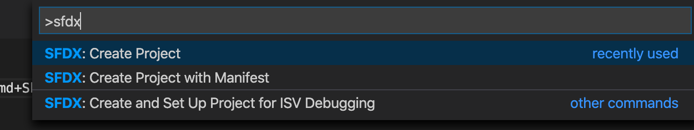

然后选择 `Standard`。

**图 27\. 命令板选项**

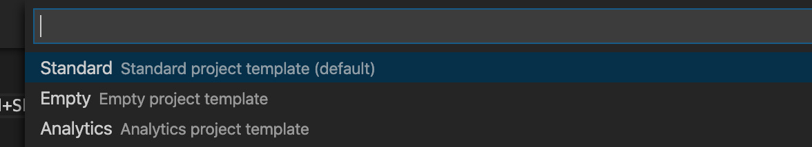

接着，输入一个项目名并回车，找一个本地的文件夹保存项目。这样项目就创建成功了。

第二步，在 VS Code 中认证一个 Org，使用 `SFDX: Authorize an Org` 命令完成，刚才创建的项目想在哪一个 SFDE 环境上使用，就认证相应环境的 Org。

第三步，创建一个 Lightning Web Component, 在 VS Code 里调出命令板输入 `sfdx`，选择 `SFDX: Create Lightning Web Component`。这里需要注意的是 SFDX: Create Lightning Component 与上述命令相似，但却用于创建 Aura 组件，使用错误的命令将导会致后面遇到各种问题。

选择 `SFDX: Create Lightning Web Component` 后输入一个组件名称如 `helloWorld`, 按回车键。

**图 28\. 在 VS Code 中新创建的文件**

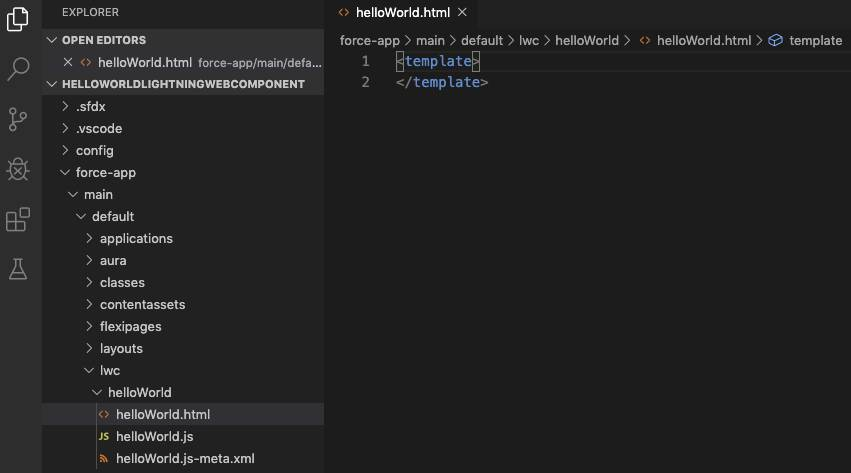

#### Lightning Web Component 的开发

至此 LWC 组件创建成功，接着一起看下 LWC 组件的具体开发。

在这个实例中的 LWC 由三个主要的文件组成：`helloWorld.html`，`helloWorld.js`，`helloWorld.js-meta.xml`。下是三个组成部分的具体内容：

在 `helloWorld.html` 里，粘贴下面的代码并保存：

```
<template>
    <lightning-card title="HelloWorld" icon-name="custom:custom14">
        <div class="slds-m-around_medium">
            <p>Hello, {greeting}!</p>
            <lightning-input label="Name" value={greeting} onchange={changeHandler}></lightning-input>
        </div>
    </lightning-card>
    </template>

```

Show moreShow more icon

在 `helloWorld.js` 里，粘贴下面的代码并保存：

```
import { LightningElement, track } from 'lwc';
    export default class HelloWorld extends LightningElement {
        @track greeting = 'World';
        changeHandler(event) {
            this.greeting = event.target.value;
        }
    }

```

Show moreShow more icon

在 `helloWorld.js-meta.xml`，粘贴下面的代码并保存：

```
<?xml version="1.0" encoding="UTF-8"?>
    <LightningComponentBundle xmlns="http://soap.sforce.com/2006/04/metadata" fqn="helloWorld">
      <apiVersion>45.0</apiVersion>
      <isExposed>true</isExposed>
      <targets>
        <target>lightning__AppPage</target>
        <target>lightning__RecordPage</target>
        <target>lightning__HomePage</target>
      </targets>
    </LightningComponentBundle>

```

Show moreShow more icon

这样 LWC 组件就创建完成了，通过 `SFDX: Deploy Source to Org` 命令部署到之前认证的环境上即可。

#### Lightning Web Component 的配置

我们要把刚创建并部署的 LWC 组件，填加到 Lightning Experience 上。
在 VS Code 里，调出命令板并输入 `sfdx`，选择 `SFDX：Open Default Org`。这时浏览器就会打开我们使用的 Org，然后在 **All Apps** 里，选择 **Sales**。

**图 29\. All Apps 应用展示**

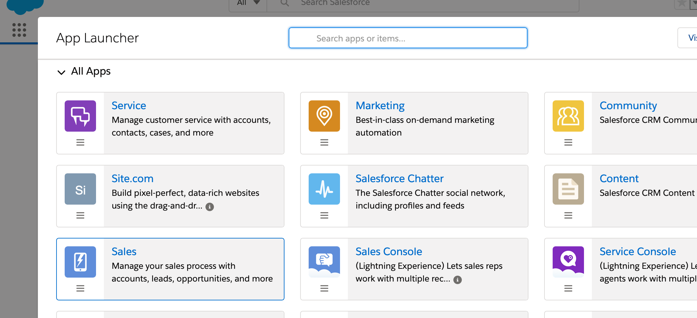

接着在 **Setup** 中，选择 **Edit Page**。

**图 30\. Setup 中选项**

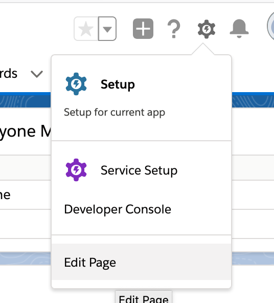

这时在 **Pages** 画面的左侧 **Custom** 里可以看到之前创建的 **helloWorld** 组件，用拖拽的方式可以放置到 Page 上。

**图 31\. Pages 的编辑页**

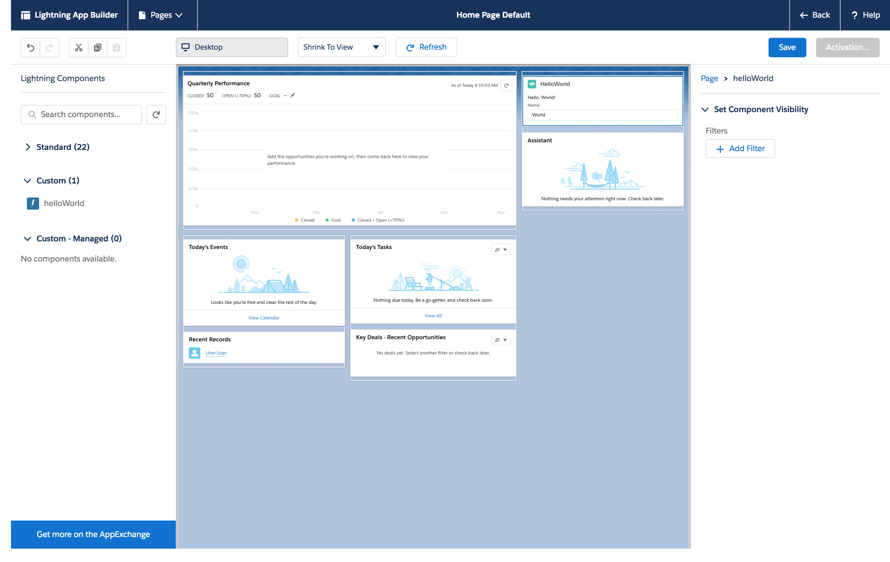

放置好后，点击 **Save**，然后点击 **Activate**，接着点击 **Assign as Org Default**，再点击 **Save**，最后点 **Back** 返回到 **Home** 页面。刷新后就可以看到新组件已经在页面上了。

**图 32\. Home 页面中 LWC 组件展示**

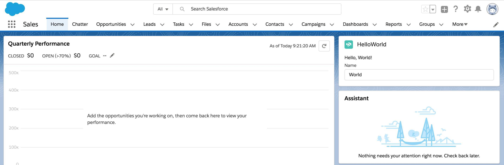

至此，LWC 从创建、开发、配置到 SFDC 页面的应用上，全部过程已经顺利完成，您觉得怎么样呢？是不是已经跃跃欲试想要亲手实践一下了？相信您试过后，对 LWC 的理解会更深刻。

### LWC 使用感受

LWC 整套开发体验真的非常棒，一气呵成就把这个项目做完了。从而也更坚定对 LWC 持续学习的决心。不要犹豫，是时候开始增长新技能了，希望这篇文章可以抛砖引玉，帮大家在 LWC 的学习道路上稳步起航。

## 结束语

综上所述则是 Salesforce Lightning 模式下的前端开发方式，Aura 为初代前端框架，随着 Web 标准的改变，LWC 因为更加符合 Web 标准并且更容易上手逐渐成为了更加主要的 Salesforce 前端开发框架，但是由于新老框架使用者都不在少数，大家可以通用。