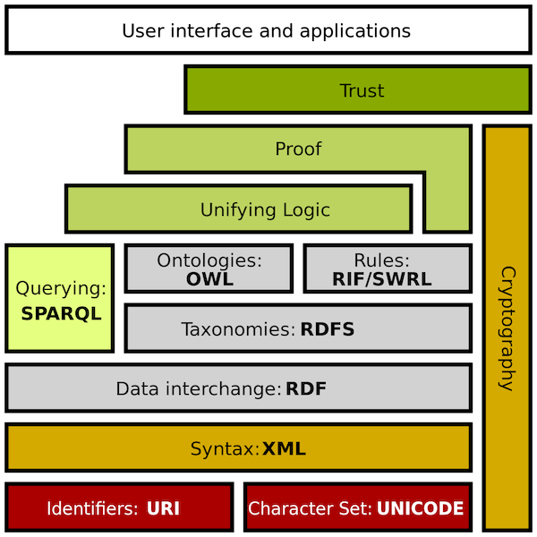
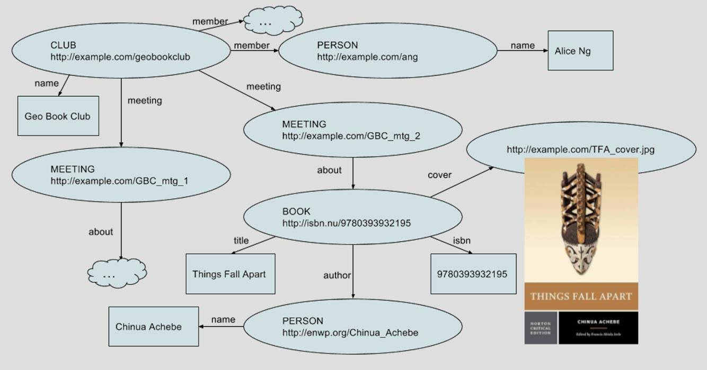
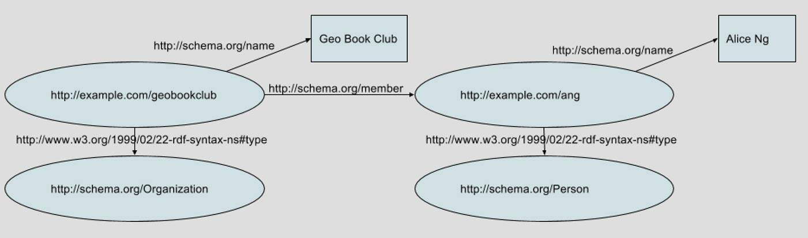
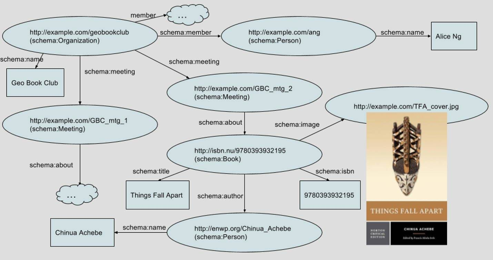

# Schema.org 信息模型简介
让数据在自动化应用程序中更有用

**标签:** Web 开发

[原文链接](https://developer.ibm.com/zh/articles/wa-schemaorg1/)

Uche Ogbuji

发布: 2018-02-07

* * *

随着人工智能 (AI) 和认知计算的兴起，对其他计算机可以轻松理解的结构化数据格式的需求与日俱增。为了满足这一需求，在 2011 年，一些搜索引擎公司和大型 Web 发布者创建了一个名为 [Schema.org](http://www.schema.org) 的项目，以便描述网页实际涉及的对象。

在这个包含 4 个部分的系列中，我将介绍 Schema.org，展示如何使用它创建更容易搜索的网页。在第 1 部分，我们首先将介绍该项目的历史。

## Schema.org 的好处

首先，让我们看看 Schema.org 的一些好处。为什么要将 Schema.org 标记添加到您的页面中？最重要的是，这样做可以使您的页面更容易访问，更容易通过搜索引擎、AI 助手和相关 Web 应用程序找到。您不需要学习任何新的开发系统或工具来使用标记，而且在几小时内就可以快速上手。其他好处包括：

- **为上下文搜索提供帮助** 。搜索引擎公司和专家开始越来越多地根据特定兴趣来引导用户，而不是通过地毯式的搜索进行引导。他们正在理解用户 _意图_ 并提供满足用户意图的内容。用户是否在购物？正想找一部电影来看？通过搜索来解决一个技术问题？如果使用 Schema.org 标记，就会允许搜索引擎根据上下文特征来提供您搜索的网站。如果用户通过语音或在移动设备上搜索，更是如此。
- **标明已更新的、高质量的内容** 。在提高搜索引擎排名方面，创建大量高质量的内容并培养您的内容的合法链接，这是其他方法无法替代的。但是使用 Schema.org 标记会告诉搜索引擎，您的内容经常更新且具有良好品质。
- **提高点击率** 。当您经过 Schema.org 扩充的网站在搜索引擎排名中有所上升时，他们在包含现代上下文特征的清单（称为富摘要）中的排名位置也会上升。富摘要从其他搜索结果中脱颖而出，能得到更高的用户点击率。
- **改进内容的可维护性** 。在规划网站内容时，许多人忘了规划如何处理过时或无关的内容。拥有包含 Schema.org 标记的页面，会使得用户在过渡期间更容易识别这些页面并实施相应计划。添加 Schema.org 标记后，会让用户更容易开发工具来处理现有页面，并将它们合并到后续网站和软件项目中。还使得您更容易与合作伙伴基于现有网站的新联合项目开展合作。

## 吸引眼球的主页

在 Web 诞生之初，您想查看的所有内容都在一个主页上。最初的这些网页就像贴在公告板上的个人公告，但包含一些超链接。Web 的目的是让人们查看这些页面。

不久以后，Mosaic 浏览器实现了在文本间嵌入图像，这使 Web 变得对用户更具吸引力。嵌入式媒体对象向音频、视频和应用程序对象敞开了大门。很快，除了信息和通信行业，其他行业也开始使用（并最终主导）Web。

> 如果有了一种通用语言，我们将能达到更高的自动化程度。Web 似乎是一个令人惊艳的创新之地，但我们错失了更多的可能性。

随着互联网数据的爆炸性增长，人们很快就必须对内容进行分类和标记，以便更容易地找到他们想要寻找的信息。

早期的 Web 发明者希望在 Web 上更广泛地传播组织工具。在 20 世纪 90 年代，”Web 数据”技术的研究工作就开始了。人们对 Web 上数据的最初预期是非常高的。2001 年 5 月，Sir Tim Berners-Lee 和同事在 _科学美国人_ 上发表了一篇名为《语义网》的文章，阐述了他们对一种新技术的雄心，该技术将为 Web 上的数据提供一种通用语言，使自动化变得更容易。

尽管所构想的这种自动化如今在很大程度上已成为现实，但这主要归功于大型搜索引擎和科技公司大量处理数据的卓越功绩，而不是由于针对 Web 上的数据的通用语言的诞生。结果，由于没有通用语言，我们现在拥有的自动化并不是很有用。Web 似乎是一个令人惊艳的创新之地，但我们错过了更多的可能性。

Schema.org 的诞生为语义网带来了生机。通过一些大型企业的努力，即使较小的企业现在也能从 Web 中获益。

## RDF、链接数据、微格式等

在 2000 年，我为 IBM Developer 编写了一篇名为”RDF 简介”的文章，解释了万维网联盟 (W3C) 提倡的这种技术，该技术旨在为 Web 上的数据提供一种通用语言。Resource Description Framework (RDF) 是一组用于在网络上对数据进行建模的规范，旨在让自主代理的工作更轻松，并改进搜索引擎和服务目录。RDF 最初被构想为一种简单模型，用于表示 Web 上的大量数据。

不幸的是，W3C 最终在 RDF 上堆叠了如此多的复杂规范（包括成熟的 AI 工具），以至于他们从未真正弄清楚如何将语义网简化为一个典型 Web 开发人员可以轻松学习的足够简单的东西。

##### 图 1\. 语义网堆栈

为了抵消这些复杂规范，一个名为”Linked Open Data”的项目开始推行一组简化的原则。该规范的名称简称为”Linked Data”，并且很明显，这些原则甚至对于企业和私有上下文也很有用。Linked Data 主要推荐使用 HTTP URL 来标识 _事物_ ，而不是纯文本字符串，并使用简单 RDF 之类的约定来提供所识别事物的相关信息。例如，此信息可能包括使用了纯文本字符串的标签。

最初，此元数据是与网页本身分开提供的，但 Web 开发人员很快开始提倡使用简单 HTML 约定将元数据编码到网页中。这些约定称为 _微格式_ 。

十年来取得的所有这些进展都在 2011 年浓缩为 Schema.org。人们寄予厚望的语义网被简化为 Linked Data，而使用微格式技术消除了对单独文件表示的需求。

## 网页的一种信息模型

那么，所有这些对今天的 Web 开发人员意味着什么？一方面，它意味着您必须问：”我的内容到底是关于什么的？”

假设您在维护一个读书俱乐部的网站。您的页面是关于什么的？它们可能是关于图书、会议和会员的，而且您通过一套常规的描述来描述这些事物。例如：

- _图书_ 用标题、作者、ISBN、封面图片等词汇来描述。
- _会议_ 用时间/日期、地点和与会者来描述。
- _会员_ 通过他们的姓名、联系人信息和照片来描述。

一个人可能是俱乐部的会员，也可能是一本书的作者。在这种情况下，会员身份描述中的一些元素可能与作者身份的元素相同。考虑到这一点，您就可以对描述您的俱乐部的数据执行可视化，类似于面向对象编程中的数据组织方式。

图 2 显示了这个思维图的一部分，我在其中虚构了一个叫做 Geo Book Club 的俱乐部。

##### 图 2\. 读书俱乐部原始信息模型

那么，我们看到了什么？

### Web 资源

椭圆形代表 Web 资源（有点类似于面向对象的实例）。这种思维模式最重要的特征是，您可以从他们所描述的事物的角度 和他们提供的内容来考虑 URL。 `http://example.com/geobookclub` 是 Geo Book Club 的网站。在这个模型中，我将它也视为一个事物，即一个俱乐部。 _资源类型_ 描述了该事物所属的类型，我使用了一个用大写字母表示的前导行，在图中表明了这一点。

资源类型组织与特定事物相关的属性的约定。例如，某个人不会与 ISBN 联系在一起。资源类型对数据模式进行控制，使应用程序能够更有效地理解数据。

### 关系

箭头显示了对象之间的关系或链接。将您希望提升为明确关系的每个链接都标出来很重要。您并不只是想要表明图书”Things Fall Apart”与作者”Chinua Achebe” _相关_ 。而是更加明确地表明：图书”Things Fall Apart”由作者”Chinua Achebe” _所著_ 。因为一本书可能有其他相关人员，比如编辑或插画家，标出明确的关系有助于 Web 应用程序准确地处理数据。

有时，某个关系的值仅是文本，而不是另一种 Web 资源。该图将这些值显示在矩形中，并将其称为 _文字_ 。文字也可以是数字、日期、布尔值和其他类型的基本数据。

### 额外信息

图中云状图形只是对本教程不需要的细节的一种方便的标记。我使用它们来表明一个俱乐部可以有多场会议，但在本系列中，我们只关心第二场会议的细节。云状图形意味着可以有多场会议，每场会议都有一个单独的关系。

您可以设想一种使用某种容器对象来建模此情形的方法，比如使用”membership”来保存会员，或者使用”schedule”来保存事件。但是，容器很快会变得很复杂。Schema.org 注重简单性，所以约定通常只是表示一个关系的多个实例。

图书封面是一个有趣的特例。首先，它是一个链接到图像文件的 Web URL。Schema.org 允许您在关系中包含不同类型的 Web URL，包括图像和其他非文本媒体对象。而且这里还有未指定资源类型。在诸如此类的情况下，虽然 Schema.org 也提供了一种更全面的方法来表达这些媒体关系，但在需要时，您可以为关系赋予权重值。

## 模型的 RDF 版本

如果您能理解上述模型，那么您对 RDF 的理解就差不多足以让您开始使用 Schema.org 了。请记住两个考虑因素。

- 所有关系都必须是 URL，而不是简单的字符串，比如”member”和”author”。这些 URL 在 RDF 中的正式名称是 _谓词_ ，但 Schema.org 采用了术语”属性”，并为它定义的每个属性都提供一个网页。这样，一个人（甚至一台机器）可以直接访问关系的 URL，并看到一段可读的描述。
- 资源类型是使用一个特殊的 RDF 谓词 `http://www.w3.org/1999/02/22-rdf-syntax-ns#type` 来表达的，这个谓词通常缩写为 rdf:type。此关系的值称为 RDF 类。

图 3 显示了 Geo Book Club 模型的子集，演示了完整表达的谓词和类型/类关系。可以想象，如果我将所有数据都放在整个图中，它会有多乱。

##### 图 3\. 包含完整 RDF 谓词和类型信息的读书俱乐部信息模型摘要

没有专门针对一个读书俱乐部的 Schema.org 类，所以我使用了一个针对组织的类。顺便说一下，Schema.org 没有打算为每个人可能希望在 Web 上表达的任何事物都提供一个全面模型。但是，如果足够多的读书俱乐部组织者聚集在一起，并决定设计 Schema.org 扩展来满足他们的需求，这些扩展最终可能被整合到核心 Schema.org 模型中。大致共识和实际用途是 Schema.org 变革过程中最重要的推动因素。

### 让模型适合 Schema.org

下图显示了一个与 Schema-org 一致的模型。我使用两个缩写词来减少杂乱：

- 来自 RDF 的 URL 缩写约定：一个前缀后跟一个冒号，并以 URL 结尾。 `http://www.w3.org/1999/02/22-rdf-syntax-ns#type` 变成 `rdf:type` ， `http://schema.org/member` 变成 `schema:member` 。
- 资源类型缩写词：第二个缩写词用于指定位于资源标识符下方括号内的资源类型。

##### 图 4\. 读书俱乐部 Schema.org 信息模型

除了更改为 `schema:Organization` 之外，还有另一个为了与 Schema.org 匹配而执行的词汇表更改。 `cover` 关系表示为 `schema:image` 。

Schema.org 支持一种与面向对象编程类似的类继承能力。它有一个祖先类 `schema:Thing` ，所有类都源自这个类。

- `schema:Organization` 是 `schema:Thing` 的子类。
- `schema:Book` 是 `schema:CreativeWork` 的子类，后者又是 `schema:Thing` 的子类

甚至属性也是 `schema:Thing` 的子类，但这涉及到一些难懂的细节。

更有趣的是，Schema.org 大量使用了子属性，子属性类似于子类。例如，Schema.org 模型没有直接将 `schema:isbn` 指定为 `schema:Book` 上被认可的属性。而是指定了 `schema:identifier` 。但是， `schema:identifier` 有多个子属性，包括：

- `schema:sku`
- `schema:flightNumber`
- `schema:isbn`

这些不同类型的标识符在特定上下文中是有意义的。

子属性遵循 [里氏代换原则](https://en.wikipedia.org/wiki/Liskov_substitution_principle) ，您可能还记得面向对象编程中的这一原则。基本上讲，这意味着您可以替换父属性的任何子属性。因此，由于 `schema:identifier` 已在 `schema:Book` 上被识别，您可以自由地代换 `schema:isbn` ，就像我在 Geo Book Club 示例中所做的那样。

## 结束语

如果您运行着一个网站，那么您已经处理了网页应有的外观和行为的模型和框架。定义内容的含义，尤其是描述 Web 中讨论的内容，变得越来越重要。Schema.org 提供了一个表达这类信息的框架，这个框架正变得越来越受欢迎。

在这一部分，您了解了如何创建模型，朝 Schema.org 迈出了第一步。理解这里介绍的基于 Schema.org 的示意图后，您就可以在自己的 HTML 网页中实现这个模型。为此，有多个语法选项可供选择，我将在下一部分中介绍这些选项。

本文翻译自： [Introduction to the Schema.org information model](https://developer.ibm.com/articles/wa-schemaorg1/)（2017-12-05）