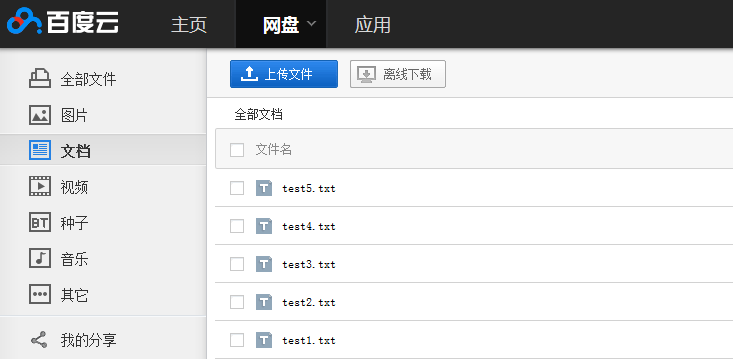

# Selenium WebDriver 中鼠标和键盘事件分析及扩展
组合键的使用以及对于 Keys 类型没有覆盖到的组合键的扩展

**标签:** Java,Web 开发

[原文链接](https://developer.ibm.com/zh/articles/j-lo-keyboard/)

罗小双, 熊虎

发布: 2014-04-03

* * *

## 概念

在使用 Selenium WebDriver 做自动化测试的时候，会经常模拟鼠标和键盘的一些行为。比如使用鼠标单击、双击、右击、拖拽等动作；或者键盘输入、快捷键使用、组合键使用等模拟键盘的操作。在 WebDeriver 中，有一个专门的类来负责实现这些测试场景，那就是 Actions 类，在使用该类的过程中会配合使用到 Keys 枚举以及 Mouse、 Keyboard、CompositeAction 等类。

其次，在实际测试过程中，可能会遇到某些按键没办法使用 Actions、Keys 等类来实现的情况。 比如通过使用 Alt+PrtSc 组合键来实现截取屏幕当前活动窗口的图像，在 Keys 枚举中，因为没有枚举出 PrtSc 键，所以没办法通过 Action 的 KeyDown(Keys) 来模拟按下这个动作。

再次是在自动化测试中，可能会遇到一些附件、文件上传的场景，或者是多文件上传，这些在 Selenium2.0 之后，可以直接使用 WebElement 类的 sendKeys() 方法来实现。

下面就分别介绍这些情况的具体使用。

## 鼠标点击操作

鼠标点击事件有以下几种类型：

##### 清单 1\. 鼠标左键点击

```
Actions action = new Actions(driver);action.click();// 鼠标左键在当前停留的位置做单击操作
action.click(driver.findElement(By.name(element)))// 鼠标左键点击指定的元素

```

Show moreShow more icon

##### 清单 2\. 鼠标右键点击

```
Actions action = new Actions(driver);
action.contextClick();// 鼠标右键在当前停留的位置做单击操作
action.contextClick(driver.findElement(By.name(element)))// 鼠标右键点击指定的元素

```

Show moreShow more icon

##### 清单 3\. 鼠标双击操作

```
Actions action = new Actions(driver);
action.doubleClick();// 鼠标在当前停留的位置做双击操作
action.doubleClick(driver.findElement(By.name(element)))// 鼠标双击指定的元素

```

Show moreShow more icon

##### 清单 4\. 鼠标拖拽动作

```
Actions action = new Actions(driver);
// 鼠标拖拽动作，将 source 元素拖放到 target 元素的位置。
action.dragAndDrop(source,target);
// 鼠标拖拽动作，将 source 元素拖放到 (xOffset, yOffset) 位置，其中 xOffset 为横坐标，yOffset 为纵坐标。
action.dragAndDrop(source,xOffset,yOffset);

```

Show moreShow more icon

在这个拖拽的过程中，已经使用到了鼠标的组合动作，首先是鼠标点击并按住 (click-and-hold) source 元素，然后执行鼠标移动动作 (mouse move)，移动到 target 元素位置或者是 (xOffset, yOffset) 位置，再执行鼠标的释放动作 (mouse release)。所以上面的方法也可以拆分成以下的几个执行动作来完成：

```
action.clickAndHold(source).moveToElement(target).perform();
action.release();

```

Show moreShow more icon

##### 清单 5\. 鼠标悬停操作

```
Actions action = new Actions(driver);
action.clickAndHold();// 鼠标悬停在当前位置，既点击并且不释放
action.clickAndHold(onElement);// 鼠标悬停在 onElement 元素的位置

```

Show moreShow more icon

action.clickAndHold(onElement) 这个方法实际上是执行了两个动作，首先是鼠标移动到元素 onElement，然后再 clickAndHold, 所以这个方法也可以写成 action.moveToElement(onElement).clickAndHold()。

##### 清单 6\. 鼠标移动操作

```
Actions action = new Actions(driver);
action.moveToElement(toElement);// 将鼠标移到 toElement 元素中点
// 将鼠标移到元素 toElement 的 (xOffset, yOffset) 位置，
//这里的 (xOffset, yOffset) 是以元素 toElement 的左上角为 (0,0) 开始的 (x, y) 坐标轴。
action.moveToElement(toElement,xOffset,yOffset)
// 以鼠标当前位置或者 (0,0) 为中心开始移动到 (xOffset, yOffset) 坐标轴
action.moveByOffset(xOffset,yOffset);

```

Show moreShow more icon

action.moveByOffset(xOffset,yOffset) 这里需要注意，如果 xOffset 为负数，表示横坐标向左移动，yOffset 为负数表示纵坐标向上移动。而且如果这两个值大于当前屏幕的大小，鼠标只能移到屏幕最边界的位置同时抛出 MoveTargetOutOfBoundsExecption 的异常。

鼠标移动操作在测试环境中比较常用到的场景是需要获取某元素的 flyover/tips，实际应用中很多 flyover 只有当鼠标移动到这个元素之后才出现，所以这个时候通过执行 moveToElement(toElement) 操作，就能达到预期的效果。但是根据我个人的经验，这个方法对于某些特定产品的图标，图像之类的 flyover/tips 也不起作用，虽然在手动操作的时候移动鼠标到这些图标上面可以出现 flyover, 但是当使用 WebDriver 来模拟这一移动操作时，虽然方法成功执行了，但是 flyover 却出不来。所以在实际应用中，还需要对具体的产品页面做相应的处理。

##### 清单 7\. 鼠标释放操

```
Actions action = new Actions(driver);
action.release();// 释放鼠标

```

Show moreShow more icon

## 键盘模拟操作

对于键盘的模拟操作，Actions 类中有提供 keyUp(theKey)、keyDown(theKey)、sendKeys(keysToSend) 等方法来实现。键盘的操作有普通键盘和修饰键盘（Modifier Keys, 下面的章节将讲到修饰键的概念）两种 :

1. 对于普通键盘，使用 sendKeys(keysToSend) 就可以实现，比如按键 TAB、Backspace 等。

##### 清单 8\. 普通键盘模拟 sendKeys(keysToSend)

```
Actions action = new Actions(driver);
action.sendKeys(Keys.TAB);// 模拟按下并释放 TAB 键
action.sendKeys(Keys.SPACE);// 模拟按下并释放空格键
/***
针对某个元素发出某个键盘的按键操作，或者是输入操作，
比如在 input 框中输入某个字符也可以使用这个方法。这个方法也可以拆分成:
action.click(element).sendKeys(keysToSend)。
*/
action.sendKeys(element,keysToSend);

```

Show moreShow more icon

注意除了 Actions 类有 sendKeys（keysToSend）方法外，WebElement 类也有一个 sendKeys（keysToSend）方法，这两个方法对于一般的输入操作基本上相同，不同点在于以下几点：

- Actions 中的 sendKeys(keysToSend) 对于修饰键 (Modifier Keys) 的调用并不会释放，也就是说当调用 actions.sendKeys(Keys.ALT); actions.sendKeys(Keys.CONTROL); action.sendKeys(Keys.SHIFT); 的时候，相当于调用 actions.keyDown(keysToSend)，而如果在现实的应用中想要模拟按下并且释放这些修饰键，应该再调用 action.sendKeys(keys.NULL) 来完成这个动作。

- 其次就是当 Actions 的 sendKeys(keysToSend) 执行完之后，焦点就不在当前元素了。所以我们可以使用 sendKeys(Keys.TAB) 来切换元素的焦点，从而达到选择元素的作用，这个最常用到的场景就是在用户名和密码的输入过程中。

- 第三点，在 WebDriver 中，我们可以使用 WebElement 类的 sendKeys(keysToSend) 来上传附件，比如 element.sendKeys(“C:\\test\\uploadfile\\test.jpg”); 这个操作将 test.jpg 上传到服务器，但是使用：

```
Actions action = New Actions(driver);
action.sendKeys(element,"C：\\test\\upload\\test.jpg”);
action.click(element).sendKeys("C：\\test\\upload\\test.jpg”);

```

Show moreShow more icon

这种方式是上传不成功的，虽然 WebDriver 在执行这条语句的时候不会出错，但是实际上并没有将文件上传。所以要上传文件，还是应该使用前面一种方式。

2.对于修饰键（Modifier keys），一般都是跟普通键组合使用的。比如 Ctrl+a、Alt+F4、 Shift+Ctrl+F 等等。

- 这里先解释一下修饰键的概念，修饰键是键盘上的一个或者一组特别的键，当它与一般按键同时使用的时候，用来临时改变一般键盘的普通行为。对于单独按下修饰键本身一般不会触发任何键盘事件。在个人计算机上的键盘上，有以下几个修饰键：Shift、Ctrl、Alt(Option)、AltGr、Windows logo、Command、FN(Function)。但是在 WebDriver 中，一般的修饰键指前面三个。你可以点击下面的 Wiki 链接去了解更多有关修饰键的信息， [Modifier key](http://en.wikipedia.org/wiki/Modifier_key) 。
- 回到上面的话题，在 WebDriver 中对于修饰键的使用需要用到 KeyDown(theKey)、keyUp(theKey) 方法来操作。

##### 清单 9\. 修饰键方法 KeyDown(theKey)、keyUp(theKey)

```
Actions action = new Actions(driver);
action.keyDown(Keys.CONTROL);// 按下 Ctrl 键
action.keyDown(Keys.SHIFT);// 按下 Shift 键
action.keyDown(Key.ALT);// 按下 Alt 键
action.keyUp(Keys.CONTROL);// 释放 Ctrl 键
action.keyUp(Keys.SHIFT);// 释放 Shift 键
action.keyUp(Keys.ALT);// 释放 Alt 键

```

Show moreShow more icon

所以要通过 Alt+F4 来关闭当前的活动窗口，可以通过下面语句来实现：action.keyDown(Keys.ALT).keyDown(Keys.F4).keyUp(Keys.ALT).perform();

而如果是对于像键盘上面的字母键 a,b,c,d… 等的组合使用，可以通过以下语句实现 :action.keyDown(Keys.CONTROL).sednKeys(“a”).perform();

在 WebDriver API 中，KeyDown(Keys theKey)、KeyUp(Keys theKey) 方法的参数只能是修饰键：Keys.SHIFT、Keys.ALT、Keys.CONTROL, 否者将抛出 IllegalArgumentException 异常。 其次对于 action.keyDown(theKey) 方法的调用，如果没有显示的调用 action.keyUp(theKey) 或者 action.sendKeys(Keys.NULL) 来释放的话，这个按键将一直保持按住状态。

## 使用 Robot 类来操作 Keys 没有枚举出来的按键操作

1.在 WebDriver 中，Keys 枚举出了键盘上大多数的非字母类按键，从 F1 到 F10，NUMPAD0 到 NUMPAD9、ALT\\TAB\\CTRL\\SHIFT 等等，你可以通过以下链接查看 Keys 枚举出来的所有按键， [Enum Keys](https://selenium.dev/selenium/docs/api/java/org/openqa/selenium/Keys.html) 。 但是并没有列出键盘上的所有按键，比如字母键 a、b、c、d… z，一些符号键比如：“ {}[] ”、“ \ ”、“。”、“ ? ”、“：”、“ + ”、“ – ”、“ = ”、’“”’，还有一些不常用到的功能键如 PrtSc、ScrLk/NmLk。对于字母键和符号键，前面我们已经提到可以直接使用 sendKeys(“a”)，sendKeys(“/”) 的方式来触发这些键盘事件。而对于一些功能组合键，如 Fn + NmLk 来关闭或者打开数字键，或者 Alt+PrtSC 来抓取当前屏幕的活动窗口并保存到图片，通过 WebDriver 的 Keys 是没办法操作的。 这个时候我们就需要用到 Java 的 Robot 类来实现对这类组合键的操作了。

2.下面就以对 Alt+PrtSc 为例介绍一下 Robot 对键盘的操作。如代码清单 10。

##### 清单 10\. 通过 Robot 发出组合键动作

```
/**
*
* @Description: 这个方法用来模拟发送组合键 Alt + PrtSc, 当组合键盘事件执行之后，屏幕上的活动窗口
* 就被截取并且存储在剪切板了。 接下来就是通过读取剪切板数据转换成 Image 图像对象并保存到本地。
* @param filename ： 要保存的图像的名称
*/
public static void sendComposeKeys(String fileName) throws Exception {
         // 构建 Robot 对象，用来操作键盘
         Robot robot = new Robot();
         // 模拟按下键盘动作，这里通过使用 KeyEvent 类来获取对应键盘（ALT）的虚拟键码
robot.keyPress(java.awt.event.KeyEvent.VK_ALT);
         // 按下 PrtSC 键
         robot.keyPress(java.awt.event.KeyEvent.VK_PRINTSCREEN);
         // 释放键盘动作，当这个动作完成之后，模拟组合键 Alt + PrtSC 的过程就已经完成，
//此时屏幕活动窗口就一被截取并存入到剪切板
         robot.keyRelease(java.awt.event.KeyEvent.VK_ALT);
         // 获取系统剪切板实例
Clipboard sysc = Toolkit.getDefaultToolkit().getSystemClipboard();
         // 通过 getContents() 方法就可以将剪切板内容获取并存入 Transferable 对象中
         Transferable data = sysc.getContents(null);
         if (data != null) {
/***
判断从剪切板获取的对象内容是否为 Java Image 类， 如果是将直接转化为 Image 对象。
到此为止，我们就从发出组合键到抓取活动窗口，再读取剪切板并存入 Image 对象的过程
就完成了，接下来要做的就是需要将 Image 对象保存到本地。
*/
             if (data.isDataFlavorSupported(DataFlavor.imageFlavor)) {
                 Image image = (Image) data
                         .getTransferData(DataFlavor.imageFlavor);
                 writeImageToFile(image, fileName);
             }
         }
     }

```

Show moreShow more icon

Robot 类对键盘的处理是通过 keyPress(int keycode)、keyRelease(int keycode) 方法来实现的，其中他们需要的参数是键盘按键对应的虚拟键码，虚拟键码的值可以通过 KeyEvent 类来获取。在 Java API 中对于虚拟键码的解释如下： 虚拟键码用于报告按下了键盘上的哪个键，而不是一次或多次键击组合生成的字符（如 “A” 是由 shift ＋ “a” 生成的）。 例如，按下 Shift 键会生成 keyCode 为 VK\_SHIFT 的 KEY\_PRESSED 事件，而按下 ‘a’ 键将生成 keyCode 为 VK\_A 的 KEY\_PRESSED 事件。释放 ‘a’ 键后，会激发 keyCode 为 VK\_A 的 KEY\_RELEASED 事件。另外，还会生成一个 keyChar 值为 ‘A’ 的 KEY\_TYPED 事件。 按下和释放键盘上的键会导致（依次）生成以下键事件：

KEY\_PRESSED

KEY\_TYPED（只在可生成有效 Unicode 字符时产生。）

KEY\_RELEASED

所以当测试中需要用到按下键盘 Alt+PrtSc 键的时候，只需要执行代码清单 10 中两个 keyPress() 和一个 keyRelease() 方法即可。

3.当这两个按键执行结束之后，屏幕上面的活动窗口已经保存到剪切板中。如果需要将其保存本地图片，只需要从剪切板读取并通过 JPEGImageEncoder 类或者 ImageIO 类将其写入本地即可。

##### 清单 11\. 使用 JPEGImageEncoder 将 Image 对象保存到本地

```
/**
*
* @Description: 这个方法用来将 Image 对象保存到本地，主要是通过 JPEGImageEncoder 类来实现图像的
* 保存
* @param image ： 要保存的 Image 对象
* @param filename ： 保存图片的文件名称
*/
public static void writeImageToFile(Image image, String fileName) {
         try {
             // 获取 Image 对象的宽度和高度， 这里的参数为 null 表示不需要通知任何观察者
int width = image.getWidth(null);
             int height = image.getHeight(null);
             BufferedImage bi = new BufferedImage(width, height,
                     BufferedImage.TYPE_INT_RGB);
// 通过 BufferedImage 绘制图像并保存在其对象中
             bi.getGraphics().drawImage(image, 0, 0, null);
             // 构建图像名称及保存路径
             String name = Const.DIRECTORY + fileName + Const.FORMAT;
             File dir = new File(Const.DIRECTORY);
             if (!dir.exists()) {
                 dir.mkdir();
             }
             FileOutputStream out = new FileOutputStream(name);
             @SuppressWarnings("restriction")
             JPEGImageEncoder encoder = JPEGCodec.createJPEGEncoder(out);
encoder.encode(bi);
             out.flush();
out.close();
         } catch (Exception e) {
             e.printStackTrace();
         }
     }

```

Show moreShow more icon

代码清单 11 是通过 JPEGImageEncoder 类将 Image 对象写到本地文件流，注意 Image 对象是在代码清单 10 中的如下语句获取到的：

```
Clipboard sysc = Toolkit.getDefaultToolkit().getSystemClipboard();
         Transferable data = sysc.getContents(null);
         if (data != null) {
             if (data.isDataFlavorSupported(DataFlavor.imageFlavor)) {
                 Image image = (Image) data
                         .getTransferData(DataFlavor.imageFlavor);
                 writeImageToFile(image, fileName);
             }
         }

```

Show moreShow more icon

##### 清单 12\. 使用 ImageIO 将 Image 对象保存到本地

```
/**
*
* @Description: 通过使用 ImageIO 类来保存 Image 对象为本地图片
* @param image ： 需要保存的 Image 对象
* @param filename ： 文件名
*/
public static void saveImage(Image image, String fileName) throws Exception {
     // 获取 Image 对象的高度和宽度
     int width = image.getWidth(null);
     int height = image.getHeight(null);
     BufferedImage bi = new BufferedImage(width, height,
             BufferedImage.TYPE_INT_RGB);
     Graphics g = bi.getGraphics();
     //通过 BufferedImage 绘制图像并保存在其对象中
     g.drawImage(image, 0, 0, width, height, null);
     g.dispose();
     File f = new File(fileName);
     // 通过 ImageIO 将图像写入到文件
     ImageIO.write(bi, "jpg", f);
     }

```

Show moreShow more icon

## 使用 sendKeys(keysToSend) 批量上传文件

在 Selenium2.0 之前，要上传文件是比较麻烦的一件事件，因为点击 Upload File 控件会弹出 Windows 窗口以提供用户选择文件，但是 Window 窗口已经是浏览器之外的组件，所以 Selenium 本身没办法控制， 而必须使用 Java Robot 类来模拟键盘去操作剪切板实现上传功能，而且及其不稳定。 在 Selenium 2.0 之后，WebDriver 解决了这个问题。前面已经谈到过，直接使用 WebElement 类的 sendKeys(keysToSend) 方法就可以实现文件上传了。但是如果想批量上传文件，使用 element.sendKeys(“C：\\test\\upload\\test1.txt”, “C:\\test\\upload\\test2.txt”…) 方法也是不行的，它能通过执行，但是实际上没有上传成功。这时可以通过循环的方式来实现文件的批量上传，代码清单 13 是我在百度云上面批量上传文件的测试。

##### 清单 13\. 批量上传文件

```
/**
*
* @Description: 在百度云上测试文件批量上传功能，主要是通过循环的方式去做单一
* 的上传动作 , 登陆过程已经去掉
*/
@Test
public void test_mutilUploadFile() throws Exception {
System.out.println("upload start");
         // 获取上传控件元素
WebElement uploadButton = driver.findElement(By.name("html5uploader"));
// 构建上传文件路径，将需要上传的文件添加到 CharSequence 数组
CharSequence[] files = new CharSequence[5];
         files[0] = "C:\\test\\test1.txt";
         files[1] = "C:\\test\\test2.txt";
         files[2] = "C:\\test\\test3.txt";
         files[3] = "C:\\test\\test4.txt";
         files[4] = "C:\\test\\test5.txt";
         // 循环列出每支需要上传的文件路径，做单一上传动作
         for(CharSequence file: files){
uploadButton.sendKeys(file);
         }
         Thread.sleep(2000);
System.out.println("upload end");
     }

```

Show moreShow more icon

当执行结束后，效果如图 1。

##### 图 1\. 批量上传文件



## 结束语

在 Selenium WebDriver 中，有了 Actions 类和 Keys 枚举对键盘和鼠标的操作已经做的非常到位，再结合 Java 本身 Robot、KeyEvent 等类的使用，基本上可以满足工作中遇到的对鼠标键盘操作的应用了。

其次要注意的地方是 WebDriver 对浏览器的支持问题，Selenium WebDriver 支持的浏览器非常广泛，从 IE、Firefox、Chrome 到 Safari 等浏览器， WebDriver 都有相对应的实现：InterntExplorerDriver、FirefoxDriver、ChromeDriver、SafariDriver、AndroidDriver、 IPhoneDriver、HtmlUnitDriver 等。根据个人的经验，Firefox 以及 Chrome 浏览器对 WebDriver 的支持最好了，Firefox 搭上 Firebug 以及 Firepath, 在写脚本的过程中非常方便，而 ChromeDriver 是 Google 公司自己支持与维护的项目。HtmlUnitDriver 速度最快，一个纯 Java 实现的浏览器。IE 比较慢，而且对于 Xpath 等支持不是很好。更多关于 Selenium WebDriver 的知识，大家可以从下面的链接去访问 Selenium 官方文档。