# Servlet 工作原理解析
认识 Java Web 技术是如何基于 Servlet 工作

**标签:** Java,Web 开发

[原文链接](https://developer.ibm.com/zh/articles/j-lo-servlet/)

许 令波

发布: 2011-02-24

* * *

## 从 Servlet 容器说起

要介绍 Servlet 必须要先把 Servlet 容器说清楚，Servlet 与 Servlet 容器的关系有点像枪和子弹的关系，枪是为子弹而生，而子弹又让枪有了杀伤力。虽然它们是彼此依存的，但是又相互独立发展，这一切都是为了适应工业化生产的结果。从技术角度来说是为了解耦，通过标准化接口来相互协作。既然接口是连接 Servlet 与 Servlet 容器的关键，那我们就从它们的接口说起。

前面说了 Servlet 容器作为一个独立发展的标准化产品，目前它的种类很多，但是它们都有自己的市场定位，很难说谁优谁劣，各有特点。例如现在比较流行的 Jetty，在定制化和移动领域有不错的发展，我们这里还是以大家最为熟悉 Tomcat 为例来介绍 Servlet 容器如何管理 Servlet。Tomcat 本身也很复杂，我们只从 Servlet 与 Servlet 容器的接口部分开始介绍，关于 Tomcat 的详细介绍可以参考我的另外一篇文章《 Tomcat 系统架构与模式设计分析》。

Tomcat 的容器等级中，Context 容器是直接管理 Servlet 在容器中的包装类 Wrapper，所以 Context 容器如何运行将直接影响 Servlet 的工作方式。

##### 图 1 . Tomcat 容器模型

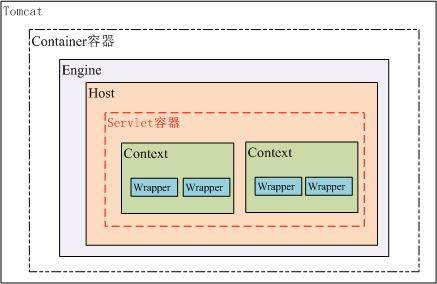

从上图可以看出 Tomcat 的容器分为四个等级，真正管理 Servlet 的容器是 Context 容器，一个 Context 对应一个 Web 工程，在 Tomcat 的配置文件中可以很容易发现这一点，如下：

##### 清单 1 Context 配置参数

```
<Context path="/projectOne " docBase="D:\projects\projectOne"
reloadable="true" />

```

Show moreShow more icon

下面详细介绍一下 Tomcat 解析 Context 容器的过程，包括如何构建 Servlet 的过程。

### Servlet 容器的启动过程

Tomcat7 也开始支持嵌入式功能，增加了一个启动类 org.apache.catalina.startup.Tomcat。创建一个实例对象并调用 start 方法就可以很容易启动 Tomcat，我们还可以通过这个对象来增加和修改 Tomcat 的配置参数，如可以动态增加 Context、Servlet 等。下面我们就利用这个 Tomcat 类来管理新增的一个 Context 容器，我们就选择 Tomcat7 自带的 examples Web 工程，并看看它是如何加到这个 Context 容器中的。

##### 清单 2 . 给 Tomcat 增加一个 Web 工程

```
Tomcat tomcat = getTomcatInstance();
File appDir = new File(getBuildDirectory(), "webapps/examples");
tomcat.addWebapp(null, "/examples", appDir.getAbsolutePath());
tomcat.start();
ByteChunk res = getUrl("http://localhost:" + getPort() +
               "/examples/servlets/servlet/HelloWorldExample");
assertTrue(res.toString().indexOf("<h1>Hello World!</h1>") > 0);

```

Show moreShow more icon

清单 1 的代码是创建一个 Tomcat 实例并新增一个 Web 应用，然后启动 Tomcat 并调用其中的一个 HelloWorldExample Servlet，看有没有正确返回预期的数据。

Tomcat 的 addWebapp 方法的代码如下：

##### 清单 3 .Tomcat.addWebapp

```
public Context addWebapp(Host host, String url, String path) {
        silence(url);
        Context ctx = new StandardContext();
        ctx.setPath( url );
        ctx.setDocBase(path);
        if (defaultRealm == null) {
            initSimpleAuth();
        }
        ctx.setRealm(defaultRealm);
        ctx.addLifecycleListener(new DefaultWebXmlListener());
        ContextConfig ctxCfg = new ContextConfig();
        ctx.addLifecycleListener(ctxCfg);
        ctxCfg.setDefaultWebXml("org/apache/catalin/startup/NO_DEFAULT_XML");
        if (host == null) {
            getHost().addChild(ctx);
        } else {
            host.addChild(ctx);
        }
        return ctx;
}

```

Show moreShow more icon

前面已经介绍了一个 Web 应用对应一个 Context 容器，也就是 Servlet 运行时的 Servlet 容器，添加一个 Web 应用时将会创建一个 StandardContext 容器，并且给这个 Context 容器设置必要的参数，url 和 path 分别代表这个应用在 Tomcat 中的访问路径和这个应用实际的物理路径，这个两个参数与清单 1 中的两个参数是一致的。其中最重要的一个配置是 ContextConfig，这个类将会负责整个 Web 应用配置的解析工作，后面将会详细介绍。最后将这个 Context 容器加到父容器 Host 中。

接下去将会调用 Tomcat 的 start 方法启动 Tomcat，如果你清楚 Tomcat 的系统架构，你会容易理解 Tomcat 的启动逻辑，Tomcat 的启动逻辑是基于观察者模式设计的，所有的容器都会继承 Lifecycle 接口，它管理者容器的整个生命周期，所有容器的的修改和状态的改变都会由它去通知已经注册的观察者（Listener），关于这个设计模式可以参考《 Tomcat 的系统架构与设计模式，第二部分：设计模式》。Tomcat 启动的时序图可以用图 2 表示。

##### 图 2\. Tomcat 主要类的启动时序图）

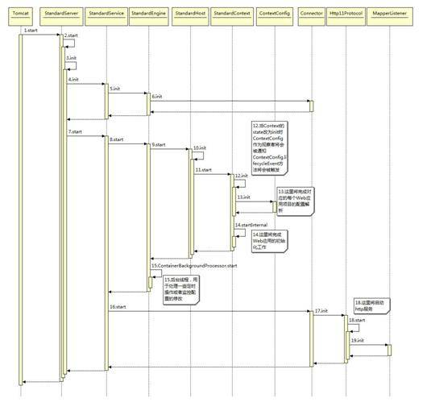

上图描述了 Tomcat 启动过程中，主要类之间的时序关系，下面我们将会重点关注添加 examples 应用所对应的 StandardContext 容器的启动过程。

当 Context 容器初始化状态设为 init 时，添加在 Contex 容器的 Listener 将会被调用。ContextConfig 继承了 LifecycleListener 接口，它是在调用清单 3 时被加入到 StandardContext 容器中。ContextConfig 类会负责整个 Web 应用的配置文件的解析工作。

ContextConfig 的 init 方法将会主要完成以下工作：

1. 创建用于解析 xml 配置文件的 contextDigester 对象
2. 读取默认 context.xml 配置文件，如果存在解析它
3. 读取默认 Host 配置文件，如果存在解析它
4. 读取默认 Context 自身的配置文件，如果存在解析它
5. 设置 Context 的 DocBase

ContextConfig 的 init 方法完成后，Context 容器的会执行 startInternal 方法，这个方法启动逻辑比较复杂，主要包括如下几个部分：

1. 创建读取资源文件的对象
2. 创建 ClassLoader 对象
3. 设置应用的工作目录
4. 启动相关的辅助类如：logger、realm、resources 等
5. 修改启动状态，通知感兴趣的观察者（Web 应用的配置）
6. 子容器的初始化
7. 获取 ServletContext 并设置必要的参数
8. 初始化”load on startup”的 Servlet

### Web 应用的初始化工作

Web 应用的初始化工作是在 ContextConfig 的 configureStart 方法中实现的，应用的初始化主要是要解析 web.xml 文件，这个文件描述了一个 Web 应用的关键信息，也是一个 Web 应用的入口。

Tomcat 首先会找 globalWebXml 这个文件的搜索路径是在 engine 的工作目录下寻找以下两个文件中的任一个 org/apache/catalin/startup/NO\_DEFAULT\_XML 或 conf/web.xml。接着会找 hostWebXml 这个文件可能会在 System.getProperty(“catalina.base”)/conf/${EngineName}/${HostName}/web.xml.default，接着寻找应用的配置文件 examples/WEB-INF/web.xml。web.xml 文件中的各个配置项将会被解析成相应的属性保存在 WebXml 对象中。如果当前应用支持 Servlet3.0，解析还将完成额外 9 项工作，这个额外的 9 项工作主要是为 Servlet3.0 新增的特性，包括 jar 包中的 META-INF/web-fragment.xml 的解析以及对 annotations 的支持。

接下去将会将 WebXml 对象中的属性设置到 Context 容器中，这里包括创建 Servlet 对象、filter、listener 等等。这段代码在 WebXml 的 configureContext 方法中。下面是解析 Servlet 的代码片段：

##### 清单 4\. 创建 Wrapper 实例

```
for (ServletDef servlet : servlets.values()) {
            Wrapper wrapper = context.createWrapper();
            String jspFile = servlet.getJspFile();
            if (jspFile != null) {
                wrapper.setJspFile(jspFile);
            }
            if (servlet.getLoadOnStartup() != null) {
                wrapper.setLoadOnStartup(servlet.getLoadOnStartup().intValue());
            }
            if (servlet.getEnabled() != null) {
                wrapper.setEnabled(servlet.getEnabled().booleanValue());
            }
            wrapper.setName(servlet.getServletName());
            Map<String,String> params = servlet.getParameterMap();
            for (Entry<String, String> entry : params.entrySet()) {
                wrapper.addInitParameter(entry.getKey(), entry.getValue());
            }
            wrapper.setRunAs(servlet.getRunAs());
            Set<SecurityRoleRef> roleRefs = servlet.getSecurityRoleRefs();
            for (SecurityRoleRef roleRef : roleRefs) {
                wrapper.addSecurityReference(
                        roleRef.getName(), roleRef.getLink());
            }
            wrapper.setServletClass(servlet.getServletClass());
            MultipartDef multipartdef = servlet.getMultipartDef();
            if (multipartdef != null) {
                if (multipartdef.getMaxFileSize() != null &&
                        multipartdef.getMaxRequestSize()!= null &&
                        multipartdef.getFileSizeThreshold() != null) {
                    wrapper.setMultipartConfigElement(new
MultipartConfigElement(
                            multipartdef.getLocation(),
                            Long.parseLong(multipartdef.getMaxFileSize()),
                            Long.parseLong(multipartdef.getMaxRequestSize()),
                            Integer.parseInt(
                                    multipartdef.getFileSizeThreshold())));
                } else {
                    wrapper.setMultipartConfigElement(new
MultipartConfigElement(
                            multipartdef.getLocation()));
                }
            }
            if (servlet.getAsyncSupported() != null) {
                wrapper.setAsyncSupported(
                        servlet.getAsyncSupported().booleanValue());
            }
            context.addChild(wrapper);
}

```

Show moreShow more icon

这段代码清楚的描述了如何将 Servlet 包装成 Context 容器中的 StandardWrapper，这里有个疑问，为什么要将 Servlet 包装成 StandardWrapper 而不直接是 Servlet 对象。这里 StandardWrapper 是 Tomcat 容器中的一部分，它具有容器的特征，而 Servlet 为了一个独立的 web 开发标准，不应该强耦合在 Tomcat 中。

除了将 Servlet 包装成 StandardWrapper 并作为子容器添加到 Context 中，其它的所有 web.xml 属性都被解析到 Context 中，所以说 Context 容器才是真正运行 Servlet 的 Servlet 容器。一个 Web 应用对应一个 Context 容器，容器的配置属性由应用的 web.xml 指定，这样我们就能理解 web.xml 到底起到什么作用了。

## 创建 Servlet 实例

前面已经完成了 Servlet 的解析工作，并且被包装成 StandardWrapper 添加在 Context 容器中，但是它仍然不能为我们工作，它还没有被实例化。下面我们将介绍 Servlet 对象是如何创建的，以及如何被初始化的。

### 创建 Servlet 对象

如果 Servlet 的 load-on-startup 配置项大于 0，那么在 Context 容器启动的时候就会被实例化，前面提到在解析配置文件时会读取默认的 globalWebXml，在 conf 下的 web.xml 文件中定义了一些默认的配置项，其定义了两个 Servlet，分别是：org.apache.catalina.servlets.DefaultServlet 和 org.apache.jasper.servlet.JspServlet 它们的 load-on-startup 分别是 1 和 3，也就是当 Tomcat 启动时这两个 Servlet 就会被启动。

创建 Servlet 实例的方法是从 Wrapper. loadServlet 开始的。loadServlet 方法要完成的就是获取 servletClass 然后把它交给 InstanceManager 去创建一个基于 servletClass.class 的对象。如果这个 Servlet 配置了 jsp-file，那么这个 servletClass 就是 conf/web.xml 中定义的 org.apache.jasper.servlet.JspServlet 了。

创建 Servlet 对象的相关类结构图如下：

##### 图 3\. 创建 Servlet 对象的相关类结构

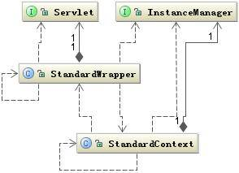

### 初始化 Servlet

初始化 Servlet 在 StandardWrapper 的 initServlet 方法中，这个方法很简单就是调用 Servlet 的 init 的方法，同时把包装了 StandardWrapper 对象的 StandardWrapperFacade 作为 ServletConfig 传给 Servlet。Tomcat 容器为何要传 StandardWrapperFacade 给 Servlet 对象将在后面做详细解析。

如果该 Servlet 关联的是一个 jsp 文件，那么前面初始化的就是 JspServlet，接下去会模拟一次简单请求，请求调用这个 jsp 文件，以便编译这个 jsp 文件为 class，并初始化这个 class。

这样 Servlet 对象就初始化完成了，事实上 Servlet 从被 web.xml 中解析到完成初始化，这个过程非常复杂，中间有很多过程，包括各种容器状态的转化引起的监听事件的触发、各种访问权限的控制和一些不可预料的错误发生的判断行为等等。我们这里只抓了一些关键环节进行阐述，试图让大家有个总体脉络。

下面是这个过程的一个完整的时序图，其中也省略了一些细节。

##### 图 4\. 初始化 Servlet 的时序图{: \#图-4-初始化-servlet-的时序图}

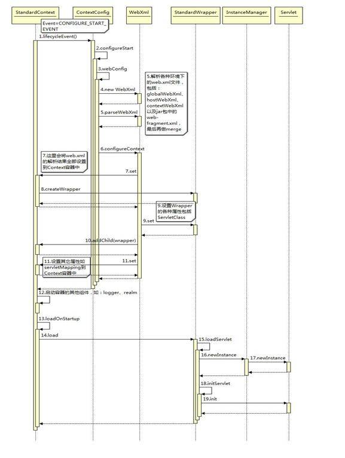

## Servlet 体系结构

我们知道 Java Web 应用是基于 Servlet 规范运转的，那么 Servlet 本身又是如何运转的呢？为何要设计这样的体系结构。

##### 图 5.Servlet 顶层类关联图

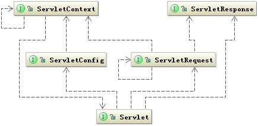

从上图可以看出 Servlet 规范就是基于这几个类运转的，与 Servlet 主动关联的是三个类，分别是 ServletConfig、ServletRequest 和 ServletResponse。这三个类都是通过容器传递给 Servlet 的，其中 ServletConfig 是在 Servlet 初始化时就传给 Servlet 了，而后两个是在请求达到时调用 Servlet 时传递过来的。我们很清楚 ServletRequest 和 ServletResponse 在 Servlet 运行的意义，但是 ServletConfig 和 ServletContext 对 Servlet 有何价值？仔细查看 ServletConfig 接口中声明的方法发现，这些方法都是为了获取这个 Servlet 的一些配置属性，而这些配置属性可能在 Servlet 运行时被用到。而 ServletContext 又是干什么的呢？ Servlet 的运行模式是一个典型的”握手型的交互式”运行模式。所谓”握手型的交互式”就是两个模块为了交换数据通常都会准备一个交易场景，这个场景一直跟随个这个交易过程直到这个交易完成为止。这个交易场景的初始化是根据这次交易对象指定的参数来定制的，这些指定参数通常就会是一个配置类。所以对号入座，交易场景就由 ServletContext 来描述，而定制的参数集合就由 ServletConfig 来描述。而 ServletRequest 和 ServletResponse 就是要交互的具体对象了，它们通常都是作为运输工具来传递交互结果。

ServletConfig 是在 Servlet init 时由容器传过来的，那么 ServletConfig 到底是个什么对象呢？

下图是 ServletConfig 和 ServletContext 在 Tomcat 容器中的类关系图。

##### 图 6\. ServletConfig 在容器中的类关联图

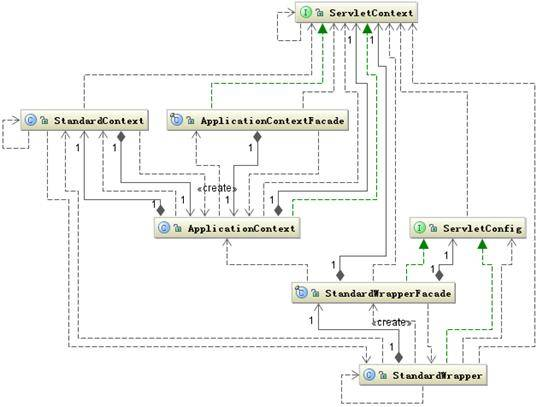

上图可以看出 StandardWrapper 和 StandardWrapperFacade 都实现了 ServletConfig 接口，而 StandardWrapperFacade 是 StandardWrapper 门面类。所以传给 Servlet 的是 StandardWrapperFacade 对象，这个类能够保证从 StandardWrapper 中拿到 ServletConfig 所规定的数据，而又不把 ServletConfig 不关心的数据暴露给 Servlet。

同样 ServletContext 也与 ServletConfig 有类似的结构，Servlet 中能拿到的 ServletContext 的实际对象也是 ApplicationContextFacade 对象。ApplicationContextFacade 同样保证 ServletContex 只能从容器中拿到它该拿的数据，它们都起到对数据的封装作用，它们使用的都是门面设计模式。

通过 ServletContext 可以拿到 Context 容器中一些必要信息，比如应用的工作路径，容器支持的 Servlet 最小版本等。

Servlet 中定义的两个 ServletRequest 和 ServletResponse 它们实际的对象又是什么呢？，我们在创建自己的 Servlet 类时通常使用的都是 HttpServletRequest 和 HttpServletResponse，它们继承了 ServletRequest 和 ServletResponse。为何 Context 容器传过来的 ServletRequest、ServletResponse 可以被转化为 HttpServletRequest 和 HttpServletResponse 呢？

##### 图 7.Request 相关类结构图

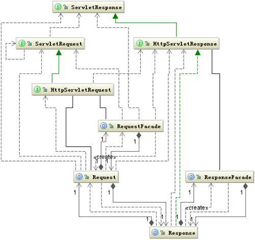

上图是 Tomcat 创建的 Request 和 Response 的类结构图。Tomcat 一接受到请求首先将会创建 org.apache.coyote.Request 和 org.apache.coyote.Response，这两个类是 Tomcat 内部使用的描述一次请求和相应的信息类它们是一个轻量级的类，它们作用就是在服务器接收到请求后，经过简单解析将这个请求快速的分配给后续线程去处理，所以它们的对象很小，很容易被 JVM 回收。接下去当交给一个用户线程去处理这个请求时又创建 org.apache.catalina.connector. Request 和 org.apache.catalina.connector. Response 对象。这两个对象一直穿越整个 Servlet 容器直到要传给 Servlet，传给 Servlet 的是 Request 和 Response 的门面类 RequestFacade 和 RequestFacade，这里使用门面模式与前面一样都是基于同样的目的——封装容器中的数据。一次请求对应的 Request 和 Response 的类转化如下图所示：

##### 图 8.Request 和 Response 的转变过程

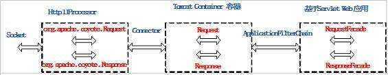

## Servlet 如何工作

我们已经清楚了 Servlet 是如何被加载的、Servlet 是如何被初始化的，以及 Servlet 的体系结构，现在的问题就是它是如何被调用的。

当用户从浏览器向服务器发起一个请求，通常会包含如下信息：`http://hostname: port /contextpath/servletpath`，hostname 和 port 是用来与服务器建立 TCP 连接，而后面的 URL 才是用来选择服务器中那个子容器服务用户的请求。那服务器是如何根据这个 URL 来达到正确的 Servlet 容器中的呢？

Tomcat7.0 中这件事很容易解决，因为这种映射工作有专门一个类来完成的，这个就是 org.apache.tomcat.util.http.mapper，这个类保存了 Tomcat 的 Container 容器中的所有子容器的信息，当 org.apache.catalina.connector. Request 类在进入 Container 容器之前，mapper 将会根据这次请求的 hostnane 和 contextpath 将 host 和 context 容器设置到 Request 的 mappingData 属性中。所以当 Request 进入 Container 容器之前，它要访问那个子容器这时就已经确定了。

##### 图 9.Request 的 Mapper 类关系图

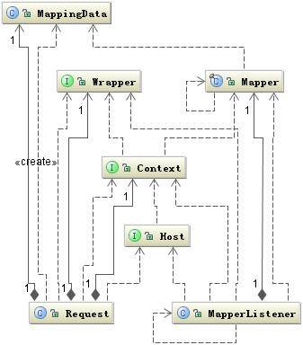

可能你有疑问，mapper 中怎么会有容器的完整关系，这要回到图 2 中 19 步 MapperListener 类的初始化过程，下面是 MapperListener 的 init 方法代码 :

##### 清单 5\. MapperListener.init

```
public void init() {
        findDefaultHost();
        Engine engine = (Engine) connector.getService().getContainer();
        engine.addContainerListener(this);
        Container[] conHosts = engine.findChildren();
        for (Container conHost : conHosts) {
            Host host = (Host) conHost;
            if (!LifecycleState.NEW.equals(host.getState())) {
                host.addLifecycleListener(this);
                registerHost(host);
            }
        }
}

```

Show moreShow more icon

这段代码的作用就是将 MapperListener 类作为一个监听者加到整个 Container 容器中的每个子容器中，这样只要任何一个容器发生变化，MapperListener 都将会被通知，相应的保存容器关系的 MapperListener 的 mapper 属性也会修改。for 循环中就是将 host 及下面的子容器注册到 mapper 中。

##### 图 10.Request 在容器中的路由图

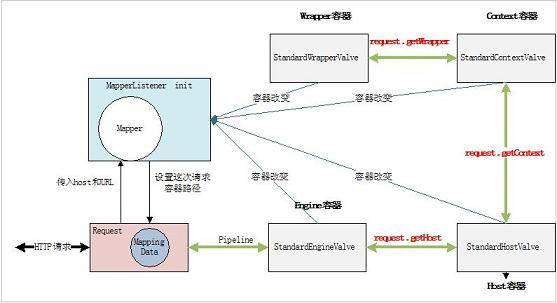

上图描述了一次 Request 请求是如何达到最终的 Wrapper 容器的，我们现正知道了请求是如何达到正确的 Wrapper 容器，但是请求到达最终的 Servlet 还要完成一些步骤，必须要执行 Filter 链，以及要通知你在 web.xml 中定义的 listener。

接下去就要执行 Servlet 的 service 方法了，通常情况下，我们自己定义的 servlet 并不是直接去实现 javax.servlet.servlet 接口，而是去继承更简单的 HttpServlet 类或者 GenericServlet 类，我们可以有选择的覆盖相应方法去实现我们要完成的工作。

Servlet 的确已经能够帮我们完成所有的工作了，但是现在的 web 应用很少有直接将交互全部页面都用 servlet 来实现，而是采用更加高效的 MVC 框架来实现。这些 MVC 框架基本的原理都是将所有的请求都映射到一个 Servlet，然后去实现 service 方法，这个方法也就是 MVC 框架的入口。

当 Servlet 从 Servlet 容器中移除时，也就表明该 Servlet 的生命周期结束了，这时 Servlet 的 destroy 方法将被调用，做一些扫尾工作。

## Session 与 Cookie

前面我们已经说明了 Servlet 如何被调用，我们基于 Servlet 来构建应用程序，那么我们能从 Servlet 获得哪些数据信息呢？

Servlet 能够给我们提供两部分数据，一个是在 Servlet 初始化时调用 init 方法时设置的 ServletConfig，这个类基本上含有了 Servlet 本身和 Servlet 所运行的 Servlet 容器中的基本信息。根据前面的介绍 ServletConfig 的实际对象是 StandardWrapperFacade，到底能获得哪些容器信息可以看看这类提供了哪些接口。还有一部分数据是由 ServletRequest 类提供，它的实际对象是 RequestFacade，从提供的方法中发现主要是描述这次请求的 HTTP 协议的信息。所以要掌握 Servlet 的工作方式必须要很清楚 HTTP 协议，如果你还不清楚赶紧去找一些参考资料。关于这一块还有一个让很多人迷惑的 Session 与 Cookie。

Session 与 Cookie 不管是对 Java Web 的熟练使用者还是初学者来说都是一个令人头疼的东西。Session 与 Cookie 的作用都是为了保持访问用户与后端服务器的交互状态。它们有各自的优点也有各自的缺陷。然而具有讽刺意味的是它们优点和它们的使用场景又是矛盾的，例如使用 Cookie 来传递信息时，随着 Cookie 个数的增多和访问量的增加，它占用的网络带宽也很大，试想假如 Cookie 占用 200 个字节，如果一天的 PV 有几亿的时候，它要占用多少带宽。所以大访问量的时候希望用 Session，但是 Session 的致命弱点是不容易在多台服务器之间共享，所以这也限制了 Session 的使用。

不管 Session 和 Cookie 有什么不足，我们还是要用它们。下面详细讲一下，Session 如何基于 Cookie 来工作。实际上有三种方式能可以让 Session 正常工作：

1. 基于 URL Path Parameter，默认就支持
2. 基于 Cookie，如果你没有修改 Context 容器个 cookies 标识的话，默认也是支持的
3. 基于 SSL，默认不支持，只有 connector.getAttribute(“SSLEnabled”) 为 TRUE 时才支持

第一种情况下，当浏览器不支持 Cookie 功能时，浏览器会将用户的 SessionCookieName 重写到用户请求的 URL 参数中，它的传递格式如 /path/Servlet;name=value;name2=value2? Name3=value3，其中”Servlet；”后面的 K-V 对就是要传递的 Path Parameters，服务器会从这个 Path Parameters 中拿到用户配置的 SessionCookieName。关于这个 SessionCookieName，如果你在 web.xml 中配置 session-config 配置项的话，其 cookie-config 下的 name 属性就是这个 SessionCookieName 值，如果你没有配置 session-config 配置项，默认的 SessionCookieName 就是大家熟悉的”JSESSIONID”。接着 Request 根据这个 SessionCookieName 到 Parameters 拿到 Session ID 并设置到 request.setRequestedSessionId 中。

请注意如果客户端也支持 Cookie 的话，Tomcat 仍然会解析 Cookie 中的 Session ID，并会覆盖 URL 中的 Session ID。

如果是第三种情况的话将会根据 javax.servlet.request.ssl\_session 属性值设置 Session ID。

有了 Session ID 服务器端就可以创建 HttpSession 对象了，第一次触发是通过 request. getSession() 方法，如果当前的 Session ID 还没有对应的 HttpSession 对象那么就创建一个新的，并将这个对象加到 org.apache.catalina. Manager 的 sessions 容器中保存，Manager 类将管理所有 Session 的生命周期，Session 过期将被回收，服务器关闭，Session 将被序列化到磁盘等。只要这个 HttpSession 对象存在，用户就可以根据 Session ID 来获取到这个对象，也就达到了状态的保持。

##### 图 11.Session 相关类图

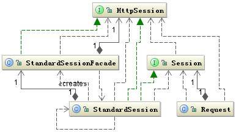

上从图中可以看出从 request.getSession 中获取的 HttpSession 对象实际上是 StandardSession 对象的门面对象，这与前面的 Request 和 Servlet 是一样的原理。下图是 Session 工作的时序图：

##### 图 12.Session 工作的时序图）

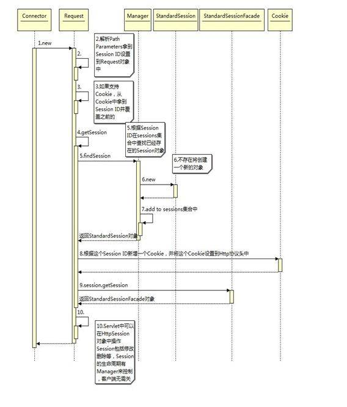

还有一点与 Session 关联的 Cookie 与其它 Cookie 没有什么不同，这个配置的配置可以通过 web.xml 中的 session-config 配置项来指定。

## Servlet 中的 Listener

整个 Tomcat 服务器中 Listener 使用的非常广泛，它是基于观察者模式设计的，Listener 的设计对开发 Servlet 应用程序提供了一种快捷的手段，能够方便的从另一个纵向维度控制程序和数据。目前 Servlet 中提供了 5 种两类事件的观察者接口，它们分别是：4 个 EventListeners 类型的，ServletContextAttributeListener、ServletRequestAttributeListener、ServletRequestListener、HttpSessionAttributeListener 和 2 个 LifecycleListeners 类型的，ServletContextListener、HttpSessionListener。如下图所示：

##### 图 13.Servlet 中的 Listener

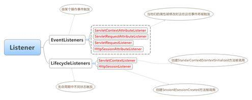

它们基本上涵盖了整个 Servlet 生命周期中，你感兴趣的每种事件。这些 Listener 的实现类可以配置在 web.xml 中的  标签中。当然也可以在应用程序中动态添加 Listener，需要注意的是 ServletContextListener 在容器启动之后就不能再添加新的，因为它所监听的事件已经不会再出现。掌握这些 Listener 的使用，能够让我们的程序设计的更加灵活。

## 结束语

本文涉及到内容有点多，要把每个细节都说清楚，似乎不可能，本文试着从 Servlet 容器的启动到 Servlet 的初始化，以及 Servlet 的体系结构等这些环节中找出一些重点来讲述，目的是能读者有一个总体的完整的结构图，同时也详细分析了其中的一些难点问题，希望对大家有所帮助。