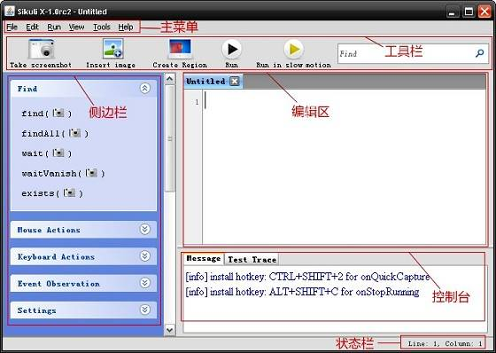
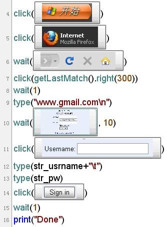
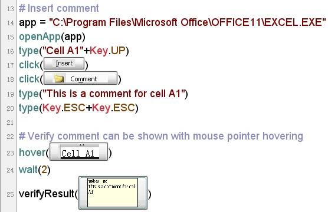
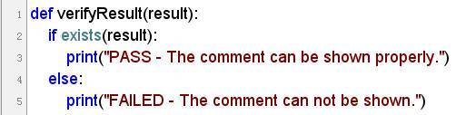
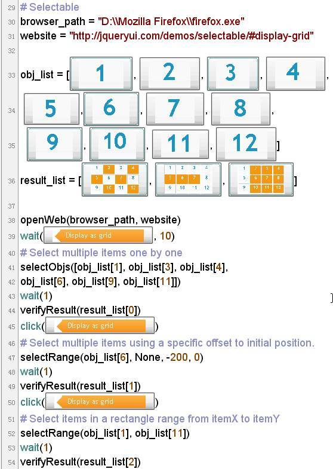
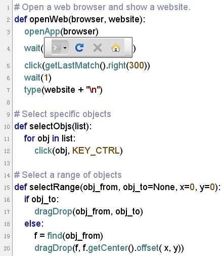
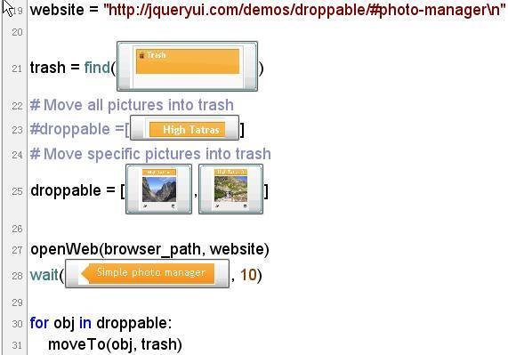
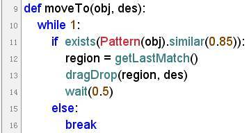
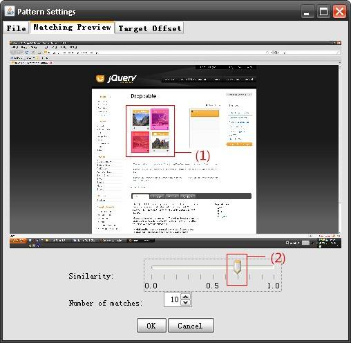

# Sikuli — 创新的图形化编程技术
由 MIT 研究团队发布的图形化编程技术 Sikuli

**标签:** DevOps,Java,Python,Web 开发,视觉识别

[原文链接](https://developer.ibm.com/zh/articles/os-cn-sikuli/)

朱杉

发布: 2011-06-09

* * *

## 引言

在 GUI 测试中，识别个性化控件、模拟用户行为及对校验屏幕显示结果常常成为自动化测试的瓶颈，此类测试场景大多数情况下仍然依赖于手工测试。本文介绍一种新兴的图形化编程技术 Sikuli，它摆脱了对控件 API 的依赖，通过当前屏幕的实时图像检索获取操作对象，模拟用户行为，匹配屏幕区域以校验真实的视觉显示结果。文中将通过其在 GUI 自动化测试中的实际应用分析及程序示例，阐述其带来的应用思路。

Sikuli 创始于 2009 年，是麻省理工学院用户界面设计小组的一个开源研究项目。2012 年由 RaiMan 接管开发和支持并将其命名为 SikuliX。

## Sikuli 是什么

Sikuli 是由 MIT 的研究团队发布的新型图形化编程技术。它以图像检索技术为基础，提供了一套基于 Jython 的脚本语言以及集成开发环境。使用者可利用屏幕截图直接引用 GUI 元素进行编程，完成交互操作。Sikuli 一词取自墨西哥 Huichol Indian 土著语，意为”上帝之眼”，正如其开发者张琮翔所说—— Sikuli 让电脑能像人一样”看”这个”真实世界”。

## Sikuli 的安装与 IDE 使用

目前 Sikuli 的最新版本为 Sikuli X-1.0rc2。在其 [官方网站下载区](http://sikuli.org/) 可获得为 Mac OS X、Windows 和 Linux 操作系统所提供的安装文件及安装方法简介。

需注意的是，在 Windows 平台下，要求有 Java 6 的运行环境支持，若要正常使用 1.0rc2 版本中新增的扩展组件 Sikuli Guide，还需更新 Java 至当前最新版本。在 Linux 平台上，除了要安装 Java6 的运行环境之外，还需安装 wmctl 和 opencv2.0 的 libcv4, libcvaux4, libhighgui4 包。

Sikuli 提供了一个简易的脚本开发环境。缺省界面由菜单栏、工具栏、侧边栏、编辑区、控制台和状态栏六部分组成，如图 1 所示。

##### 图 1\. Sikuli-IDE 界面组成

工具栏中提供了两组共计 5 个常用工具按钮及文本搜索框：

- [常用工具按钮及文本搜索框1](https://developer.ibm.com/developer/default/articles/os-cn-sikuli/images/image002.jpg) 屏幕截图（Take screenshot）：点击该按钮，进入屏幕截图状态，拖拽辅助线选取需要截取的界面元素，释放鼠标左键的同时，自动将该截图插入到编辑区中光标当前位置。使用快捷键 Ctrl+Shift+2（Command+Shift+2）也可激活截图状态，以完成对于弹出菜单、下拉框一类的控件的实时截图。该快捷键亦可通过主菜单 File->Preferences 进行自定义。
- [常用工具按钮及文本搜索框2](https://developer.ibm.com/developer/default/articles/os-cn-sikuli/images/image003.jpg) 插入图片（Insert image）：除直接截图外，用户也可通过点击该按钮导入已有的 PNG 格式图片文件。
- [常用工具按钮及文本搜索框3](https://developer.ibm.com/developer/default/articles/os-cn-sikuli/images/image004.jpg) 建立屏幕区域（Create region）：点击该按钮，进入屏幕区域选择状态，拖拽定位十字线选取屏幕区域。释放鼠标左键，即可将当前选中区域的屏幕坐标信息插入到编辑区中。
- [常用工具按钮及文本搜索框4](https://developer.ibm.com/developer/default/articles/os-cn-sikuli/images/image005.jpg) 运行（Run）：点击执行当前脚本。快捷键为 Ctrl+R（Command+R）。
- [常用工具按钮及文本搜索框5](https://developer.ibm.com/developer/default/articles/os-cn-sikuli/images/image006.jpg) 慢速运行（Run in slow motion）：点击后以较慢的速度执行当前脚本，以红色圆形外框显式标识每一次图像查找定位动作，便于程序调试中进行焦点追踪。快捷键为 Ctrl+Alt+R（Command+Alt+R）。

左侧侧边栏中分类列出了部分常用函数，点击函数名可快速将其插入到编辑区，若该函数需截图作为参数，则自动转入屏幕截图状态。下方的状态栏可用于查看当前行号，与行首 Tab 缩进的层级 ( 列号 )。

## Sikuli 脚本

Sikuli 的脚本编写遵循 Python 语法规范，其本身提供了多种自定义类及其自定义方法，其详细介绍可参见其 [官方网站文档](https://sikulix-2014.readthedocs.io/en/latest/) 。由于 Sikuli 基于 Jython，其核心代码由 Java 编写，可在用户自定义的 Java 工程中将其作为 Java 标准类库进行引用。

这里先通过一个自动打开 Firefox 浏览器，并登录 Gmail 的简单实例来快速一览 Sikuli 脚本的独特之处。

##### 图 2\. 自动登录 Gmail

上图所示的 Sikuli 脚本首先单击展开开始菜单，接着单击 Firefox 图标启动浏览器。待 Firefox 的工具栏出现后，以工具栏位置为基准，向右偏移 300 的距离以定位到地址栏并鼠标单击将光标置入地址栏，然后在地址栏中输入 gmail 网址。待登录界面出现，单击用户名输入框并输入用户名信息，然后键入 Tab 键，使密码输入框获得焦点并输入密码信息，最后单击 Sign in 按钮完成登录。

从该示例脚本中不难发现 Sikuli 最显著的特色——将 GUI 对象的屏幕截图作为函数的参数直接引用，整个代码的语义清晰明了，可读性极强。脚本执行过程中，利用图像检索算法分析匹配当前屏幕中对应的控件，并对其应用相应的鼠标或键盘操作。这种方式使得我们在脚本编写时，既无需关心繁琐的应用程序相关 API 亦不用获取 Web 内容对象。

编辑完成的 Sikuli 脚本可通过 File -> Save 进行保存。在 Windows 平台上将保存为一个后缀为 .sikuli 的文件夹，其中包括脚本中所使用到的所有 PNG 图片、.py 后缀的源代码以及一份显示源码的 HTML 文件。

编写调试完成的 Sikuli 脚本最终可通过菜单 File->Export executable 生成以 .skl 为后缀的可执行文件。生成这种格式的可执行文件后，使用命令行工具或直接双击该文件即可便捷地运行该脚本了。

## Sikuli 的应用实例

Sikuli 的出现，给 GUI 自动化测试提供了新的思路。通常情况下针对 GUI 的自动化测试多通过其 API 识别并获取 GUI 对象，进而对其进行操作；对于 GUI 显示的校验则通过指定其在屏幕上的绝对位置坐标并匹配对应位置上的实际像素来完成。前者精准但复杂度相对较高，其局限在于需要了解 GUI 内部的代码实现，依赖于 API 的开放性，所要验证的对象未必能够被成功获取；后者则对 GUI 元素本身的绝对位置有着严格的要求，缺乏灵活度和对 GUI 位移的包容能力，一个细微的对象位置变化即可能严重影响校验的结果，但在实际应用场景下，GUI 对象大小、位置变化和 UI 的重排的情况较为常见，使得这种验证方式的稳定性和可靠性随之降低。而 Sikuli 的工作方式完全契合了这两类场景下的需求，可大幅地简化操作和验证过程。接下来通过几个实例来展示如何在一些典型用例中使用 Sikuli 快速完成 GUI 自动化。

### 实例一 Excel 中验证鼠标悬停时的单元格注释显示

在通常的 GUI 自动化测试中，要完成这一验证，需要编写代码以定位控件、模拟鼠标事件、捕获对象、判断显示结果，实现起来并不轻松。而使用 Sikuli，仅使用下列的简短脚本即可完成这一任务。

##### 图 3\. 显示并验证单元格注释

图 3 中所示脚本片段中，从 15-19 行完成了打开 Excel 并创建单元格注释的过程。单元格注释的显示触发和显示验证仅占用了 22-24 三行代码。所调用的 hover() 方法从当前屏幕显示上自动匹配截图参数所示区域，获取其位置，将鼠标指针悬停于该矩形区域的中心位置，激活注释显示。而在 Sikuli”视觉”能力的支持下，验证注释是否正确显示只需用 verifyResult() 方法”一瞥”即可。该方法的实现如图 4 所示，调用 exists() 方法，即能判断当前屏幕中是否显示有相应注释。

##### 图 4\. verifyResult() 方法的实现

类似的应用还有控件注释信息的弹出及校验、Web 应用中悬停效果的校验等。

### 实例二 Web 页面中的多对象选择

本例中，实现了对 Web 页面中多个对象的间隔选取和批量框选。其脚本片段如图 5 所示。

##### 图 5\. Web 页面中的多对象选取

该脚本以页面中 12 个数字对象的截图创建带选择对象数组，在 result\_list 中列出了期望的选取结果显示。运行时使用 openWeb() 方法自动打开浏览器，进入指定页面。调用 selectObjs() 与 selectRange() 方法的实现 3 种不同的多选方式。脚本中自定义方法的实现，如图 6 所示。

##### 图 6\. 自定义方法的实现

selectObjs() 方法中调用 Sikuli 的 click() 方法，以传入的对象截图列表和 Sikuli 定义的 Key Modifier 为参数，实现了按下 Ctrl 键后逐个点击对象完成多选的动作。

SelectRange() 方法则实现了区域性选取。以 obj\_from 和 obj\_to 参数指定选区的起始位置和结束位置；或仅使用 obj\_from 指定起始位置，同时设定水平和垂直方向的偏移量 x、y 来指定选区。调用 dragDrop() 方法，传入起始、结束位置，即可完成区域选择。

验证方式同实例一所述。

### 实例三 Web 页面中的对象拖拽移位

本例主要应用 Sikuli 的 dragDrop() 方法，实现对象的拖拽移位操作。图 7 中代码所完成的任务即为通过拖拽的方式，将指定的图片移动到 Trash 区域中。

##### 图 7\. 拖拽图片至 Trash 区域

该脚本中，在 droppable 数组中定义需要被移入 Trash 的图片，以 Trash 区域的标题栏为搜索目标，用 find() 方法获得 Trash 区域的 Match 类型对象，作为目标区域参数传入 moveTo() 方法。其中 moveTo() 方法查找当前屏幕显示中所有与 obj 参数所传入的图形相匹配的对象，将其拖拽至 des 所指定的区域。其实现如图 8 所示。

##### 图 8\. moveTo() 方法的实现

在该方法中，对于图片缩略图应用 exists() 方法进行检索时，进行了图像相似度（取值区间为 0~1）的调整，Sikuli 中缺省情况下的相似度设置为 0.7，为了在图片内容类似的情况下进行正确的区分，可用到 similar() 方法适当提高检索时的相似度，以避免匹配到其他类似区域。

若需确认当前相似度设置下，图像的匹配情况，可在脚本中单击截图对象，激活 Pattern Settings 对话框。在本例中，如单击第 25 行 droppable 中的第二张截图，则弹出对话框如图 9 所示。图中（1）中所标识区域中，有两幅图片分别被红色和紫红色高亮显示。表示在当前的相似度下，这两幅图片均被识别为要寻找的对象。颜色越偏红，则图片与截图的相似度越高，越近似紫色则相似程度越低。调节（2）所标示的 Similarity 滑块，改变相似度设置，则可看到预览区域中的匹配区域的数量及颜色变化，从而以此为依据选择适当的相似度设置，使得程序可以精准唯一地定位目标区域。

##### 图 9\. Pattern Settings 对话框

## Sikuli 的优势及局限

Sikuli 为脚本赋予了人类的视角，让计算机不单能够去捕捉后台的接口数据和返回值，而且能如同人眼一般，”看”到一个真实的 GUI 展现。使用者直接在脚本中引用目标 GUI 元素的截图来获取该对象，并指定对其所进行的操作，简单高效。使得 GUI 自动化摆脱了对应用的内部程序实现的依赖，无需获取 API，亦无须了解 GUI 的内部代码实现；忽略了标准控件和非标准控件在操作和获取上的差异性；普遍适用于所有运行在有图形用户界面的操作系统之上的应用，有 GUI 显示的地方即可被获取和操作。实时的图形检索定位，避免了位移和 UI 重排等位置变化造成的无法准确定位并获取控件的问题。Python 语法兼容 +Java 内核，为其赋予了很强的扩展性，同时，Open Source 也让 Sikuli 本身获得了更多的发展机会和空间。使用 GUI 元素截图所编制的 Sikuli 脚本具有良好的代码可读性，这一点从上述实例场景中能够有所体会——在这种简短的脚本中，已基本接近自然语言的表述方式。这样的一种展现形式和特性使得手工测试用例与自动化测试脚本的距离大大缩小，使得这两者之间的自动转化和整合成为可能。

另外，利用 GUI 截图进行编程的这种特性使得使用者只需要具有基本的程序设计知识即可快速上手，轻松地创建自动化脚本操作 GUI 界面完成各种操作，大大降低了程序设计的门槛。使得更多的人可以定制个性化的桌面应用。

但在实际应用中，我们也同样发现，在现阶段 Sikuli 仍具有一定的局限性：

- 依赖屏幕截图，使其在不同的操作系统上，不同的浏览器中，甚至是不同的显示分辨率下，需要独立维护一套图形源文件，对于其跨平台的能力造成障碍。
- 由于对于截图的检索依赖于实时的桌面显示，若出现程序逻辑之外的意外界面遮挡或焦点切换（如，弹出窗口等），则会对程序执行造成影响。
- IDE 处于开发初级阶段，稳定性和易用性存在一定问题。其本身仅支持初级的代码编辑功能，对于规模较大的代码开发和调试工作仍存在不便之处。其在 Windows 平台和 Linux 平台上的运行稳定性也稍逊于在 MacOSX 上的表现。

因此，现阶段若要使用 Sikuli 独立完成具有一定规模的程序还有些困难，但作为现有自动化测试工具的有效补充，已可以很好的发挥其自身的优势，为日常工作带来便利。

## 结束语

本文介绍了图形化编程技术 Sikuli，使测试人员对 Sikuli 脚本的特点和使用方法有初步的了解。同时通过实例展示如何应用 Sikuli 编写自动化脚本进行 GUI 交互操作及验证，分析目前 Sikuli 在应用上所具有的优势和局限。