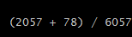
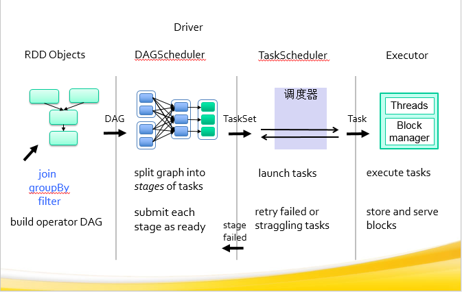
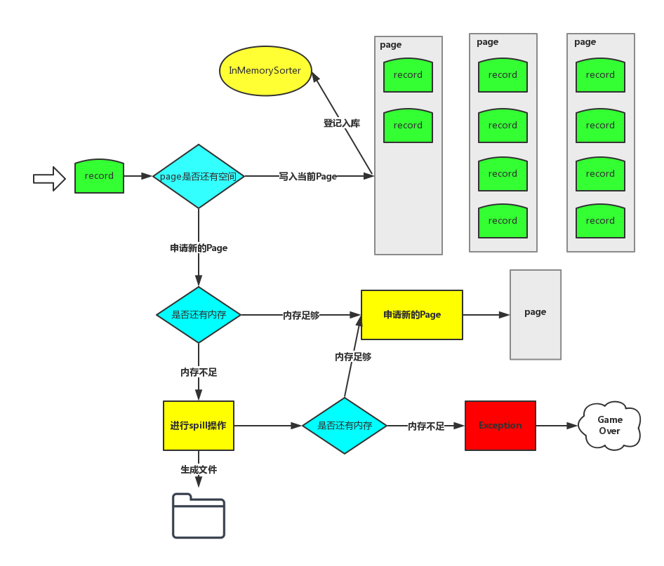

# Spark Core 问题详解
Spark 生产环境中遇到的运维、任务调度、安全问题

**标签:** 分析

[原文链接](https://developer.ibm.com/zh/articles/os-cn-spark-core/)

岑玉海

发布: 2015-11-17

* * *

## 背景介绍

Apache Spark 是加州大学伯克利分校的 AMP Labs 开发的开源分布式轻量级通用计算框架。由于 Spark 基于内存设计，使得它拥有比 Hadoop 更高的性能（极端情况下可以达到 100x），并且对多语言（Scala、Java、Python）提供支持。其一栈式的设计特点使得我们的学习和维护成本大大地减少，而且其提供了很好的容错解决方案。

我们使用 Spark 有超过一年的时间了，现在大部分的批处理任务和机器学习的任务都是运行在 Spark 平台之上。目前生产环境使用的是最新版 Spark1.4.1，运行在 Standalone 模式下，没有运行在 Yarn 上面的原因是希望给机器学习的任务分配更多的内存，用户根据任务需要的 cores 数来抢占机器，避免自己的任务和其他任务运行在同一台机器，有效地隔离任务之间的相互影响。

本文将从 Spark 生产环境中遇到的运维、任务调度、安全的问题出发，分享一下 Master 对 Event Log 的管理方式、任务的本地性调度机制、多用户的实现方式以及对 Spark 1.5 的 Tungsten-sort 等的理解。

## 运维

### Master 挂掉了，Standby 的 Master 也访问超时

升级到 Spark 1.4.1 之后，发现运行一段时间之后 Master 就会挂掉，而且 Standby 的 Master 也无法访问，一直处于访问超时的状态，最后把 Master 都杀掉，把 zookeeper 里面的状态全部删掉，再启动就好了。通过查看 log，我们发现原来是内存不足导致的。Master 的内存默认配置是 512M 的内存，尝试着把它的内存调大到 2G，发现还是挂，在日志里面发现每次挂的时候，几乎都有同一个任务在跑，仔细观察了一下这个任务，它居然有 300 多万个 Tasks，在 HDFS 上查看它的 Event log 日志，有好几个 G 的大小。看到这里，果断的把内存调到 10G。

问题倒是解决了，可为什么会是这样呢？从 log 里面它无法完成主从切换的时候，把它杀死最后都是卡在 rebuildUI 这个方法上面了，打开 Master 这个类仔细一看，它会去读取每一行的 event log 日志，遇到大任务的时候，这是一个很恐怖的事情。

再继续查看，rebuildUI 方法是在 finishApplication 方法里面调用的，每次有任务完成，它都会把任务的 Event log 读到内存当中来，然后在完成列表里面就可以点击看到作业的相关信息，这部分信息原来是保存在 driver 端的。所以需要减少 Master 保存在内存当中的作业的信息，历史任务到 History server 当中查看。

对比了 Spark 1.3 的代码，发现 Spark1.3 里也有这个逻辑，为什么 Spark1.3 没有发生这个问题呢？Spark 1.4 在 UI 上增加了很酷的图表，需要消耗多一点内存也可以理解，但是为什么会多那么多呢？和同事交流得知，升级到 Spark 1.4 之后，原来的程序在 Shuffle 的时候经常报错，他们就通过调大 partition 数的方法来避免，有的程序一直调整到 10 倍于以前的 partition 数才可以正常运行。partition 数太大还会引发别的问题，Job UI 的界面很卡，甚至是打不开，Akka 的线程数也需要调整，默认值是 4。

```
spark.akka.threads 10

```

Show moreShow more icon

Worker 时不时也会挂掉或者没有心跳，但是出问题的周期要长一点，发现还是内存的原因，把 Worker 的内存调成 1G，并且减少保存在内存当中的 Executor 和 Driver 的信息，默认都是 1000 个。

```
spark.worker.ui.retainedExecutors 5
spark.worker.ui.retainedDrivers5

```

Show moreShow more icon

### 当 SQL 遇到 Hive 的 Bug

Spark 的 jar 包里面自带了一个 Hive 版本，在 Spark 1.3 版本上遇到 Hive 的 bug，需要把 bug 修改好编译之后才替换掉 Spark 的 jar 包内部的 class 类，非常的痛苦。比如之前遇到一个很严重的问题，在一张分区表上新增列，插入数据之后，发现新增的列查出来全是 NULL，这是 Hive 0.13 的已知 Bug：

[https://issues.apache.org/jira/browse/HIVE-6131](https://issues.apache.org/jira/browse/HIVE-6131)

Spark 1.4 支持使用外置的 Hive 的 Metastore 的 jar 包，这样可以很方便的修改 hive 的代码，而不去影响 Spark 的代码。配置下面的一句就可以使用外置的 hive 的 jar 包了（注意：这里的 jar 包不仅包括 hive 依赖的所有 jar 包，包括 hadoop 的 jar 包。此外还需要把 guava-11.0.2.jar 添加到 SPARK\_CLASSPATH 里面）。

```
spark.sql.hive.metastore.jars=/data/spark-1.4.1/hive/*

```

Show moreShow more icon

由于采用了直接连接 Hive 的元数据库读取元数据的方式，在 Spark1.3 版本上使用 HiveContext 偶尔会发生以下 Hive 的经典问题：

1. DELETEME 表不存在，该问题会导致程序退出。
2. 角色 admin 已存在，该问题会导致程序退出。
3. 往 Hive 的元数据库的 Version 表插入一条记录，该问题会导致所有的 Hive 客户端都无法使用！如果该问题发生在夜间，会影响所有的 Hive 例行任务。

在 Spark1.4 版本，上面的问题出现的频率变得很高。这些是 Hive 的问题，但是严重影响了 Spark 的使用。有两种处理方法：

1. 采用连接 Hive 的 Metastore 服务的方式读取元数据。
2. 修改代码，去掉一些不必要的操作。


    - 修改 ObjectStore 类 verifySchema 的方法，直接返回，禁止它检查 Hive 的版本。
    - 修改 HiveMetaStore 类，删除下面这段代码。


    ```
    synchronized (HMSHandler.class) {
    createDefaultDB(); # 创建默认数据库
    createDefaultRoles(); # 创建默认角色
    addAdminUsers(); # 创建默认用户
    }

    ```


    Show moreShow more icon

3. 修改 MetaStoreDirectSql 类的构造方法，删除掉该构造方法里的 120 行之后关于查询数据库的代码。


### Streaming 程序已失败，进程不退出

用户提交到 Yarn 上的 Spark Streaming 程序容易受到别的因素影响而导致程序失败，有时候程序失败之后 driver 进程不退出，这样无法通过监控 driver 的进程来重启 Streaming 程序。推荐将 Streaming 程序运行在 Standalone 模式的集群之上，使用 cluster 部署模式，并启用 supervise 功能。使用这种方式的好处是 Streaming 程序非正常退出之后，Spark 集群会自动重启 Streaming 的程序，无须人为干预。

## 任务调度

### Executor 长时间空闲

经常会碰到一种现象：只有少数 Executor 在运行，别的 Executor 长时间空闲。这种现象比较常见的原因是数据的分区比较少，可以使用 repartition 来提高并行度。

另外一种原因和数据的本地性有关，请看下面的例子：

用户的任务申请了 100 个 executors，每个 executor 的 cores 为 6，那么最多会有 600 个任务同时在运行，刚开始是 600 个任务在运行，接着正在运行的任务越来越少，只剩下 78 个任务在运行，像下图所示：



这个问题会导致 Spark 基于 yarn 的动态分配功能也无法使用了，Executor 长时间空闲之后会被杀死，然后报一大堆让人心烦的 Error 信息。

先回顾一下 Spark 作业提交的流程，如下图所示：



1. 首先 DAGSchedular 会把作业划分成多个 Stage，划分的依据：是否需要进行 shuffle 操作。
2. 每个 Stage 由很多的 Tasks 组成，Tasks 的数量由这个 Stage 的 partition 数决定。Stage 之间可能有依赖关系，先提交没有前置依赖的 Stage。把 Stage 里的任务包装成一个 TaskSet，交给 TaskScheduler 提交。
3. 把 Task 发送给 Executor，让 Executor 执行 Task。

这个问题是出在第二步，TaskScheduler 是怎么提交任务的。这块的逻辑主要是在 CoarseGrainedSchedulerBackend 和 TaskSchedulerImpl。

下面是 CoarseGrainedSchedulerBackend 里面的 makeOffer 方法的主要逻辑：

1. CoarseGrainedSchedulerBackend 筛选出来活跃的 Executors，交给 TaskSchedulerImpl。
2. TaskSchedulerImpl 返回一批 Task 描述给 CoarseGrainedSchedulerBackend。
3. 序列化之后的任务的大小没有超过 spark.akka.frameSize 就向 Executor 发送该任务。

问题是出在第二步，根据活跃的 Executors，返回可以执行的 Tasks。具体查看 TaskSchedulerImpl 的 resourceOffers 方法。

1. 在内存当中记录传入的 Executor 的映射关系，记录是否有新的机器加入。
2. 如果有新的机器加入，要对所有的 TaskSetManager 重新计算本地性。
3. 遍历所有的 TaskSetManager，根据 TaskSetManager 计算得出的任务的本地性来分配任务:

    1. 同一个 Executor
    2. 同一个节点
    3. 没有优先节点
    4. 同一个机架
    5. 任务节点

如果上一个优先级的任务的最后发布时间不满足下面这个条件，任务将不会被分发出去，导致出现上面的现象。

判断条件是：curTime – lastLaunchTime >= localityWaits(currentLocalityIndex)

这样设计的初衷是好的，希望先让本地性更好的任务先运行，但是这里没有考虑到 Executor 的空闲时间以及每个 Task 的空闲时间。跳过了这个限制之后，它还是会按照优先级来分配任务的，所以不用担心本地性的问题。

下面这几个参数在官方的配置介绍当中有，但是没介绍清楚，默认都是 3 秒，减小这几个参数就可以绕过限制了。

```
spark.locality.wait.process 1ms # 超过这个时间，可以执行 NODE_LOCAL 的任务
spark.locality.wait.node 3ms # 超过这个时间，可以执行 RACK_LOCAL 的任务
spark.locality.wait.rack 1s # 超过这个时间，可以执行 ANY 的任务

```

Show moreShow more icon

实践测试，问题解决了，并且速度快了 20%以上。

### Task 在同一棵树上连续吊死

Spark 的任务在失败之后还在同一台机器上不断的重试，直至超过了设置的重试次数之后。在生产环境当中，因为各种各样的原因，比如网络原因、磁盘满了等原因会使任务挂掉，在这个时候，在同一台机器上重试几乎没有成功的机会，把任务发到别的机器上运行是最明智的选择。

Spark 是有任务的黑名单机制的，但是这个配置在官方文档里面并没有写，可以设置下面的参数，比如设置成一分钟之内不要再把任务发到这个 Executor 上了，单位是毫秒。

```
spark.scheduler.executorTaskBlacklistTime 60000

```

Show moreShow more icon

## 安全

## 如何支持多用户

Spark 运行的时候使用的是同一个账户，但是在某些场景下需要支持多用户，比如 Spark SQL 的 ThriftServer 服务要面向所有用户开放，如果都使用一个账户执行任务，数据的安全就无法保障了。尝试过创建多个 SparkContext，但是 Spark 目前的实现是不支持在同一个 JVM 里创建多个 SparkContext。下面介绍一种基于 Task 的实现方式，它需要注意以下两点：

1. 能够模拟某个用户操作，并且这个操作是线程安全的，避免影响到别的任务。
2. 执行某个任务时，driver 端和 executor 端都要同时使用该模拟用户执行。

Hadoop 本身提供了一个线程安全的模拟其他用户的方法（UserGroupInformation 的 doAs 方法），具体的实现有三点：

1. 在 driver 端使用 UserGroupInformation 的 doAs 方法模拟用户操作。
2. 给 Task 类添加 user 属性，在 DAGSchedular 创建 Task 的时候把当前模拟用户传给 Task 的 user 属性。
3. 在 Task 的 run 方法里使用 UserGroupInformation 的 doAs 方法模拟该用户的操作。

## 展望 Spark 1.5 的 Tungsten-sort

升级到 1.4.1 之后，在 Shuffle 的时候大任务总是时不时挂掉一批任务，运行时间大大延长了。除了增加 partition、在某些场景下用 reduceByKey 代替 groupByKey 等一些常见的方法之后，貌似也没什么好的方法，而且 partition 数增大到一定数量之后弊端很大。

Databricks 之前发布了一个”钨丝计划”，号称要榨干 JVM 的性能。现在 Spark 1.5 已经发布了，它会引入一种新的 Shuffle 方式，不过暂时只在使用 Spark-SQL 的时候才默认开启。现在一起来看看新的 Shuffle 方式 tungsten-sort 它是怎么实现的。

要查看 Shuffle 的过程可以直接找到 ShuffleMapTask 这个类，它是 Shuffle 的起点。

下图是整个 tungsten-sort 的写入每条记录的过程：



1. Record 的 key 和 value 会以二进制的格式存储写入到 ByteArrayOutputStream 当中，用二进制的形式存储的好处是可以减少序列化和反序列化的时间。然后判断当前 Page 是否有足够的内存，如果有足够的空间就写入到当前 Page（注：Page 是一块连续的内存）。写入 Page 之后，会把内存地址 address 和 partitionId 编码成一个 8 字节的长整形记录在 InMemorySorter 当中。

2. 当前 Page 内存不够的时候会去申请新的 Page，如果内存不够就要把当前数据 Spill 到磁盘了。Shuffle 可以利用的内存默认是 Executor 内存的 0.2\*0.8=0.16，它是由下面两个参数来决定的，如果数据量比较大，建议增大下面两个值，减少 Spill 的次数。


    ```
    spark.shuffle.memoryFraction 0.2
    spark.shuffle.safetyFraction 0.8

    ```


    Show moreShow more icon

3. Spill 的过程，从 InMemorySorter 反编码出来内存地址，按照 partitionId 的顺序把数据从内存写入到一个文件当中，不会对同一个 partition 的数据做排序。

4. Spill 完了内存足够就申请新的 Page，内存不够就要报错了！因为内存不够就直接抛异常的做法是无法在生产环境运行。Bug 产生的原因和它为每个任务平均分配内存的机制有关系，在数据倾斜的场景很容易复现该问题，并且这个异常不应该抛，内存不足就继续 Spill。请关注下面这个 Bug。

    [https://issues.apache.org/jira/browse/SPARK-10474](https://issues.apache.org/jira/browse/SPARK-10474)

    实践的时候发现有两个方法可以降低它产生的几率，增加 partition 数量和减小 Page 的大小。Page 的大小通过参数 spark.buffer.pageSize 来设置，单位是 bytes，最小是 1MB，最大是 64MB。默认的计算公式是：nextPowerOf2(maxMemory / cores / 16) （注：maxMemory 指的是上面提到的 Shuffle 可用内存，nextPowerOf2 是 2 的次方）。

5. 所有数据写入完毕之后，会把 Spill 产生的所有文件合并成一个数据文件，并生成一个索引文件，如果 map 数是 M，那生成的文件个数就是 2M。Shuffle Writer 的工作到这里就结束了，Shuffle Reader 沿用了 Sort-based 的 Reader 来读取 Shuffle 产生的数据。合并的过程有个优化点，它会使用 NIO 的 FileChannel 去合并文件，不过使用条件比较苛刻，必须设置以下参数并且 Kernel 内核不能是 2.6.32 版本。


    ```
    spark.shuffle.compress true
    spark.io.compression.codec org.apache.spark.io.LZFCompressionCodec
    spark.file.transferTo true

    ```


    Show moreShow more icon


## 结束语

本文介绍了几类常见问题的解决方法以及 Spark1.5 引进的 Shuffle 方式 Tungsten-sort。从官方的宣传来看，Spark 1.5 的性能提升是巨大的，鉴于目前 Tungsten-sort 的实现方式仍然存在问题，想要在生产环境使用 Tungsten-sort，还需要耐心等待。