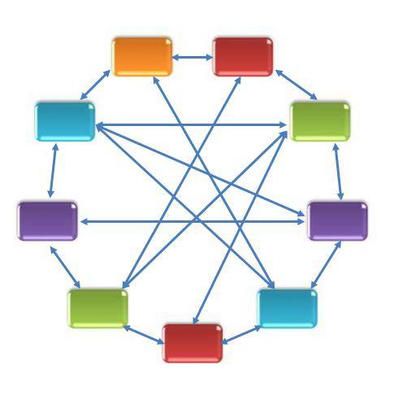
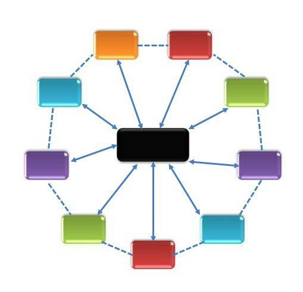
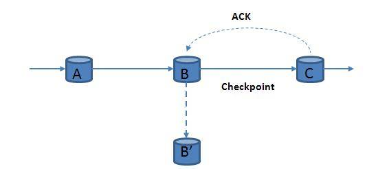
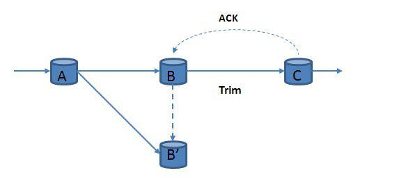
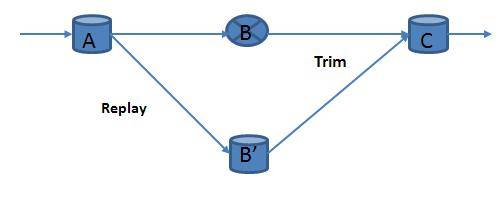
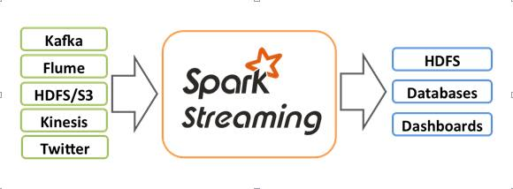
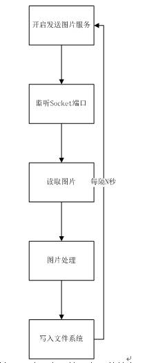

# Spark Streaming 图片处理案例介绍
基于 Spark Streaming 编写的读取、分析、写入图片

**标签:** 数据存储

[原文链接](https://developer.ibm.com/zh/articles/os-cn-spark-streaming-picture/)

周明耀

发布: 2015-08-10

* * *

## 前文回顾

前文 [Spark Streaming 新手指南](https://www.ibm.com/developerworks/cn/opensource/os-cn-spark-streaming/index.html) 介绍了 Spark Streaming 的基本工作原理，并以 WordCount 示例进行解释。此外，针对 Spark Streaming 的优缺点也做了一些描述。

本文重点主要是解释流式处理架构的工作原理，让读者对 Spark Streaming 的整体设计原理及应用场景有所了解。

## 流式处理框架特征

流式处理框架的特征主要有以下五个方面。

1. 强实时处理

    流式处理需要确保数据的实时产生、实时计算，此外，也需要确保处理结果的实时发送。大多数流式处理架构多采用内存计算方式，即当数据到达后直接在内存中计算，只有少量数据会被保存到硬盘，或者干脆不保存数据。这样的系统架构可以确保我们能够提供低延迟计算能力，可以快速地进行数据计算，在数据较短的时间内完成计算，体现数据的有用性。对于时效性特别短、潜在价值又很大的数据可以优先计算。

2. 高容错能力

    由于数据很容易丢失，这就需要系统具有一定的容错能力，要充分地利用好仅有的一次数据计算机会，尽可能全面、准确、有效地从数据流中得出有价值的信息。

3. 动态变化

    一般采用流式处理架构的应用场景都存在数据速率不固定的情况，即可能存在前一时刻数据速率和后一时刻数据速率有较大的差异。这样的需求要求系统具有很好的可伸缩性，能够动态适应流入的数据流，具有很强的系统计算能力和大数据流量动态匹配的能力。一方面，在高数据流速的情况下，保证不丢弃数据，或者识别并选择性地丢弃部分不重要的数据；另一方面，在低数据速率的情况下，保证不会太久或过多地占用系统资源。

4. 多数据源

    由于可能存在很多的数据源，而且各数据源、数据流之间又可能是相互独立的，所以无法保证数据是有序的，这就需要系统在数据计算过程中具有很好的数据分析和发现规律的能力，不能过多地依赖数据流间的内在逻辑或者数据流内部的内在逻辑。

5. 高可扩展

    由于数据是实时产生、动态增加的，即只要数据源处于活动状态，数据就会一直产生和持续增加下去。可以说，潜在的数据量是无限的，无法用一个具体确定的数据实现对其进行量化。系统在数据计算过程中，无法保存全部数据。由于硬件中没有足够大的空间来存储这些无限增长的数据，也没有合适的软件来有效地管理这么多数据。


## 流式处理框架技术需求

针对具有强实时处理、高容错能力、动态变化、多数据源、高可扩展等特征的流式处理框架需求，那么理想的流式处理框架应该表现出低延迟、高吞吐、持续稳定运行和弹性可伸缩等特性，这需要系统设计架构、任务执行方式、高可用性技术等关键技术的合理规划和良好设计。

### 系统设计架构

系统架构是系统中各子系统间的组合方式，流式处理框架需要选择特定的系统架构进行流式计算任务的部署。当前，针对流式处理框架较为流行的系统架构主要有无中心节点的 point-point 架构和有中心节点的 Master-Slaves 架构两种。

**对称式架构。** 如图 1 所示，系统中各个节点的作用是完全相同的，即所有节点之间互相可以做备份，这样整个系统具有良好的可伸缩性。但是由于不存在中心节点，因此在资源调度、系统容错、负载均衡等方面需要通过分布式协议帮助实现。目前商业产品 S4、Puma 属于这类架构，S4 通过 Zookeeper 实现系统容错、负载均衡等功能。

##### 图 1\. 无中心节点架构



**主从式系统架构。** 如图 2 所示，系统存在一个主节点和多个从节点。主节点负责系统资源的管理和任务的协调，并完成系统容错、负载均衡等方面的工作，从节点负责接收来自于主节点的任务，并在计算完成后进行反馈。各从节点间可以选择是否数据往来，但是系统的整体运行状态依赖主节点控制。Storm、Spark Streaming 属于这种架构。

##### 图 2\. 有中心节点架构



### 任务执行方式

任务执行方式是指完成有向任务图到物理计算节点的部署之后，各个计算节点之间的数据传输方式。数据的传输方式分为主动推送方式和被动拉取方式两种。

1. 主动推送方式。在上游节点产生或计算完数据后，主动将数据发送到相应的下游节点，其本质是让相关数据主动寻找下游的计算节点，当下游节点报告发生故障或负载过重时，将后续数据流推送到其他相应节点。主动推送方式的优势在于数据计算的主动性和及时性，但由于数据是主动推送到下游节点，往往不会过多地考虑到下游节点的负载状态、工作状态等因素，可能会导致下游部分节点负载不够均衡；

2. 被动拉取方式。只有下游节点显式进行数据请求，上游节点才会将数据传输到下游节点，其本质是让相关数据被动地传输到下游计算节点。被动拉取方式的优势在于下游节点可以根据自身的负载状态、工作状态适时地进行数据请求，但上游节点的数据可能未必得到及时的计算。


大数据流式计算的实时性要求较高，数据需要得到及时处理，往往选择主动推送的数据传输方式。当然，主动推送方式和被动拉取方式不是完全对立的，也可以将两者进行融合，从而在一定程度上实现更好的效果。

### 高可用性技术

流式计算框架的高可用性是通过状态备份和故障恢复策略实现的。当故障发生后，系统根据预先定义的策略进行数据的重放和恢复。按照实现策略，可以被细分为被动等待 (passive standby)、主动等待 (active standby) 和上游备份 (upstream backup) 这 3 种策略。

#### 被动等待策略

图 3 所示，主节点 B 进行数据计算，副本节点 B’处于待命状态，系统会定期地将主节点 B 上的最新的状态备份到副本节点 B’上。出现故障时，系统从备份数据中进行状态恢复。被动等待策略支持数据负载较高、吞吐量较大的场景，但故障恢复时间较长，可以通过对备份数据的分布式存储缩短恢复时间。该方式更适合于精确式数据恢复，可以很好地支持不确定性应用计算，在当前流式数据计算中应用最为广泛。

##### 图 3\. 被动等待策略



#### 主动等待策略

图 4 所示，系统在为主节点 B 传输数据的同时，也为副本节点 B’传输一份数据副本。以主节点 B 为主进行数据计算，当主节点 B 出现故障时，副本节点 B’完全接管主节点 B 的工作，主副节点需要分配同样的系统资源。该种方式故障恢复时间最短，但数据吞吐量较小，也浪费了较多的系统资源。在广域网环境中，系统负载往往不是过大时，主动等待策略是一个比较好的选择，可以在较短的时间内实现系统恢复。

##### 图 4\. 主动等待策略



#### 上游备份策略

每个主节点均记录其自身的状态和输出数据到日志文件，当某个主节点 B 出现故障后，上游主节点会重放日志文件中的数据到相应副本节点 B’中进行数据的重新计算。上游备份策略所占用的系统资源最小，在无故障期间，由于副本节点 B’保持空闲状态，数据的执行效率很高。但由于其需要较长的时间进行恢复状态的重构，故障的恢复时间往往较长，如需要恢复时间窗口为 30 分钟的聚类计算，就需要重放该 30 分钟内的所有元组。可见，于系统资源比较稀缺、算子状态较少的情况，上游备份策略是一个比较好的选择方案。如图 5 和图 6 所示。

##### 图 5\. 上游备份策略 1


##### 图 6\. 上游备份策略 2



## Spark Streaming 所处地位

Spark Streaming 是 Spark 的扩展，专门用来实现流式分析方式处理数据。Spark Streaming 支持 Kafka、Flume、Twitter、ZeroMQ、Kinesis、TCP Sockets 等多种数据源。此外，也可以使用一个复杂的算法，如 map、reduce、join、window，这些来处理数据。处理完的数据可以被发送给文件系统、数据库、其他第三方。图 7 引用自 Spark Streaming 官网，比较好地描述了 Spark Streaming 的地位。

##### 图 7\. Spark Streaming 地位



Spark Streaming 接收输出数据流，然后将这些数据分割后放入批处理流程 (batches)，Spark 引擎稍后会处理这些数据，最终生成计算结果并发送到外部系统。

笔者的前一篇文章已经详细地通过 WordCount 示例介绍了 Spark Streaming 的运行次序、基本架构、RDD 概念，请读者参阅文章《Spark Streaming 新手指南》。

## Spark Streaming 应用实例

我们以一个流式处理图片的例子作为本文的实例。我们把图片文件通过基于 Spark Streaming 的程序读取成数据流，重新将数据流写成图片文件并存储在文件系统上。

整个程序的流程图如图 8 所示。

##### 图 8\. 图片处理程序流程图



如图 8 所示，第一步我们需要实现一个服务，该服务不停地向 HDFS 文件系统里写入图片文件，这些图片文件后续会被用来当作数据源的原始数据，并被进行处理。代码如清单 1 所示。

##### 清单 1\. 循环写入图片文件代码

```
public ServerSocket getServerSocket(int port){
ServerSocket server=null;
try {
server = new ServerSocket();
} catch (IOException e) {
// TODO Auto-generated catch block
e.printStackTrace();
}
return server;
}

public void sendData(String path,ServerSocket server){
OutputStream out=null;
FileInputStream in=null;
BufferedOutputStream bf =null;
try {
out = server.accept().getOutputStream();
File file = new File(path);
in = new FileInputStream(file);
bf = new BufferedOutputStream(out);
byte[] bt = new byte[(int)file.length()];
in.read(bt);
bf.write(bt);
} catch (IOException e) {
e.printStackTrace();
}finally{
if(in!=null){
try {
in.close();
} catch (IOException e) {
// TODO Auto-generated catch block
e.printStackTrace();
}
}
if(bf!=null){
try {
bf.close();
} catch (IOException e) {
// TODO Auto-generated catch block
e.printStackTrace();
}
}
if(out!=null){
try {
out.close();
} catch (IOException e) {
// TODO Auto-generated catch block
e.printStackTrace();
}
}
if(!server.isClosed()){
try {
server.close();
} catch (IOException e) {
// TODO Auto-generated catch block
e.printStackTrace();
}
}
}
}

public static void main(String[] args) {
if(args.length<4){
System.err.println("Usage:server3 <port> <file or dir> <send-times> <sleep-time(ms)>");
System.exit(1);
}

Map<Integer, String> fileMap = null;

Server s = new Server();
for (int i = 0; i < Integer.parseInt(args[2]) ; i++) {
ServerSocket server =null;
while(server==null){
server = s.getServerSocket(Integer.parseInt(args[0]));
try {
Thread.sleep(Integer.parseInt(args[3]));
} catch (InterruptedException e) {
// TODO Auto-generated catch block
e.printStackTrace();
}
}
while(!server.isBound()){
try {
server.bind(new InetSocketAddress(Integer.parseInt(args[0])));
System.out.println("第"+(i+1)+"个服务端绑定成功");
Thread.sleep(Integer.parseInt(args[3]));
} catch (NumberFormatException | IOException | InterruptedException e) {
// TODO Auto-generated catch block
e.printStackTrace();
}
}

fileMap = s.getFileMap(args[1]);

System.out.println("fileMap.size="+fileMap.size());
//System.out.println("fileMap="+fileMap);

s.sendData(fileMap.get(s.getNum(0, fileMap.size()-1)), server);
//s.sendData(args[1], server);
}
}

public Map<Integer, String> getMap(String dir,Map<Integer, String> fileMap){
File file = new File(dir);
if(file.isFile()){
if(file.getName().endsWith(".jpg")||file.getName().endsWith(".bmp")|file.getName().
                                            endsWith(".JPG")||file.getName().endsWith(".BMP")){
if(file.length()<1024*1024*2){
fileMap.put(fileMap.size(),file.getAbsolutePath());
}
}else{
}
}
if(file.isDirectory()){
File[] files = file.listFiles();
for (int j = 0; j < files.length; j++) {
getMap(files[j].getAbsolutePath(), fileMap);
}
}
return fileMap;
}

public Map<Integer, String> getFileMap(String dir){
Map<Integer, String> fileMap = new HashMap<Integer, String>();
return getMap(dir, fileMap);
}

public int getNum(int offset,int max){
int i = offset+(int)(Math.random()*max);
if(i>max){
return i-offset;
}else{
return i;
}
}

```

Show moreShow more icon

接下来开启一个程序，实现开启 Socket 监听，从指定端口读取图片文件，这里使用的是 Spark Streaming 的 socketStream 方法获取数据流。程序代码是用 Scala 语言编写的，如清单 4 所示。

##### 清单 2\. 读取文件

```
val s = new SparkConf().setAppName("face")
val sc = new SparkContext(s)
val ssc = new StreamingContext(sc, Seconds(args(0).toInt))
val img = new ImageInputDStream(ssc, args(1), args(2).toInt,
                   StorageLevel.MEMORY_AND_DISK_SER)//调用重写的 ImageInputDStream 方法读取图片
val imgMap = img.map(x => (new Text(System.currentTimeMillis().toString), x))
imgMap.saveAsNewAPIHadoopFiles("hdfs://spark:9000/image/receiver/img", "", classOf[Text],
           classOf[BytesWritable], classOf[ImageFileOutputFormat],
                       ssc.sparkContext.hadoopConfiguration)//调用 ImageFileOutputFormat 方法写入图片

imgMap.map(x => (x._1, {
if (x._2.getLength > 0) imageModel(x._2) else "-1"
}))//获取 key 的值，即图片
.filter(x => x._2 != "0" && x._2 != "-1")
.map(x => "{time:" + x._1.toString +","+ x._2 + "},").print()

ssc.start()
ssc.awaitTermination()

```

Show moreShow more icon

清单 2 代码设置 Spark 上下文环境，设置了每隔多少时间 (用户输入的第一个参数，单位：秒) 读取一次数据源，然后开始调用重写的方法读入图片，我们需要对图片进行分析，分析过程不是本程序关注的重点，这里忽略，读者可以自己网上搜索图片分析的开源库，导入即可实现图片分析功能。

清单 3 当中自己定义了一个 Scala 类 ImageInputDStream，用于加载 Java 的读入图片类。

##### 清单 3\. Scala 实现读取文件

```
class ImageInputDStream(@transient ssc_: StreamingContext,host: String,port:
                          Int,storageLevel: StorageLevel) extends
                                                ReceiverInputDStream[BytesWritable](ssc_) with Logging{
override def getReceiver(): Receiver[BytesWritable] = {
new ImageRecevier(host,port,storageLevel)
}
}

class ImageRecevier(host: String,port: Int,storageLevel: StorageLevel) extends
                                        Receiver[BytesWritable](storageLevel) with Logging{
override def onStart(): Unit = {
new Thread("Image Socket"){
setDaemon(true)
override def run(): Unit = {
receive()
}
}.start()
}

override def onStop(): Unit = {

}

def receive(): Unit ={
var socket:Socket=null
var in:InputStream =null
try{
logInfo("Connecting to " + host + ":" + port)
socket = new Socket(host, port)
logInfo("Connected to " + host + ":" + port)
in= socket.getInputStream
val buf = new ArrayBuffer[Byte]()
var bytes = new Array[Byte](1024)
var len = 0
while(-1 < len){
len=in.read(bytes)
if(len > 0){
buf ++=bytes
}
}
val bw = new BytesWritable(buf.toArray)
logError("byte:::::"+ bw.getLength)
store(bw)
logInfo("Stopped receiving")
restart("Retrying connecting to " + host + ":" + port)
}catch {
case e: java.net.ConnectException =>
restart("Error connecting to " + host + ":" + port, e)
case t: Throwable =>
restart("Error receiving data", t)
}finally {
if(in!=null){
in.close()
}
if (socket != null) {
socket.close()
logInfo("Closed socket to " + host + ":" + port)
}
}
}

```

Show moreShow more icon

清单 2 里面定义了写回图片文件时需要调用 ImageFileOutputFormat 类，这个类继承了 org.apache.hadoop.mapreduce.lib.output.FileOutputFormat 类，通过缓冲读取的方式加快数据读取。代码如清单 4 所示。

##### 清单 4\. 写入文件

```
public class ImageFileOutFormat extends FileOutputFormat<Text,BytesWritable> {
@Override
public RecordWriter<Text, BytesWritable> getRecordWriter(TaskAttemptContext taskAttemptContext)
                                                 throws IOException, InterruptedException {
Configuration configuration = taskAttemptContext.getConfiguration();
Path path = getDefaultWorkFile(taskAttemptContext, "");
FileSystem fileSystem = path.getFileSystem(configuration);
FSDataOutputStream out = fileSystem.create(path,false);
return new ImageFileRecordWriter(out);
}

protected class ImageFileRecordWriter extends RecordWriter<Text, BytesWritable>{

protected DataOutputStream out;
private final byte[] keyValueSeparator;
private static final String colon=",";

public ImageFileRecordWriter(DataOutputStream out){
this(colon,out);
}

public ImageFileRecordWriter(String keyValueSeparator,DataOutputStream out) {
this.out=out;
this.keyValueSeparator = keyValueSeparator.getBytes();
}

@Override
public void write(Text text, BytesWritable bytesWritable) throws IOException, InterruptedException {
if(bytesWritable!=null){
out.write(bytesWritable.getBytes());
}
}

@Override
public void close(TaskAttemptContext taskAttemptContext) throws IOException, InterruptedException {
out.close();
}
}
}

```

Show moreShow more icon

通过清单 1-4 的程序，我们可以实现读入图片文件->对图片进行一些业务处理->写回分析成果物 (文本信息、图片)。

## 结束语

通过本文的学习，读者可以大致了解流式处理框架的设计原理、Spark Streaming 的工作原理，并通过一个读取、分析、写入图片的示例帮助读者进行加深了解。目前市面上发布的 Spark 中文书籍对于初学者来说大多较为难读懂，更没有专门针对 Spark Streaming 的文章。作者力求推出一系列 Spark 文章，让读者能够从实际入手的角度来了解 Spark Streaming。后续除了应用之外的文章，还会致力于基于 Spark 及 Spark Streaming 的系统架构、源代码解释等方面的文章发布。