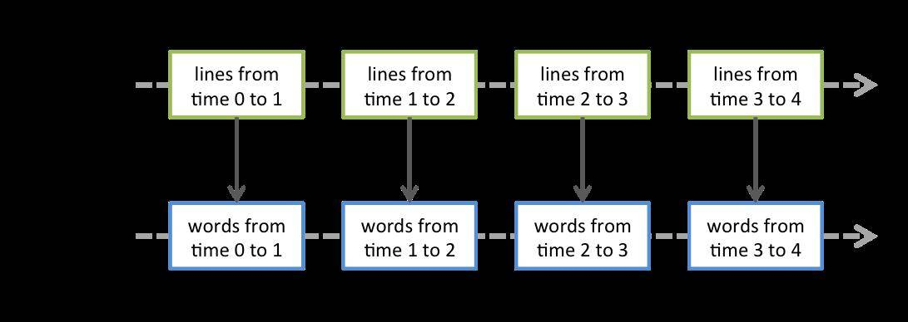

# Spark Streaming 新手指南
了解 Spark Streaming 的一些特性和优缺点

**标签:** 分析

[原文链接](https://developer.ibm.com/zh/articles/os-cn-spark-streaming/)

周明耀

发布: 2015-08-03

* * *

随着大数据技术的不断发展，人们对于大数据的实时性处理要求也在不断提高，传统的 MapReduce 等批处理框架在某些特定领域，例如实时用户推荐、用户行为分析这些应用场景上逐渐不能满足人们对实时性的需求，因此诞生了一批如 S3、Samza、Storm 这样的流式分析、实时计算框架。Spark 由于其内部优秀的调度机制、快速的分布式计算能力，所以能够以极快的速度进行迭代计算。正是由于具有这样的优势，Spark 能够在某些程度上进行实时处理，Spark Streaming 正是构建在此之上的流式框架。

## 流式大数据处理框架介绍

### Samza

Samza 是一个分布式的流式数据处理框架（streaming processing），Linkedin 开源的产品， 它是基于 Kafka 消息队列来实现类实时的流式数据处理的。更为准确的说法是，Samza 是通过模块化的形式来使用 Apache Kafka 的，因此可以构架在其他消息队列框架上，但出发点和默认实现是基于 Apache Kafka。

本质上说，Samza 是在消息队列系统上的更高层的抽象，是一种应用流式处理框架在消息队列系统上的一种应用模式的实现。

总的来说，Samza 与 Storm 相比，传输上完全基于 Apache Kafka，集群管理基于 Hadoop YARN，即 Samza 只负责处理这一块具体业务，再加上基于 RocksDB 的状态管理。由于受限于 Kafka 和 YARN，所以它的拓扑结构不够灵活。

### Storm

Storm 是一个开源的、大数据处理系统，与其他系统不同，它旨在用于分布式实时处理且与语言无关。Storm 不仅仅是一个传统的大数据分析系统，它可以被用于构建复杂事件处理 (CEP) 系统。CEP 系统从功能上来说，通常被分类为计算和面向检测两类，两者都可通过用户定义的算法在 Storm 中实现。举例而言，CEP 可用于识别事件洪流中有意义的事件，然后实时地处理这些事件。

Storm 框架与其他大数据解决方案的不同之处，在于它的处理方式。Apcahe Hadoop 本质上来说是一个批处理系统，即目标应用模式是针对离线分析为主。数据被引入 Hadoop 的分布式文件系统 (HDFS)，并被均匀地分发到各个节点进行处理，HDFS 的数据平衡规则可以参照本文作者发表于 IBM 的文章《 [HDFS 数据平衡规则及实验介绍](http://www.ibm.com/developerworks/cn/data/library/bd-1506-hdfsdatabalance/index.html) 》，进行深入了解。当处理完成时，结果数据返回到 HDFS，然后可以供处理发起者使用。Storm 则支持创建拓扑结构来转换没有终点的数据流。不同于 Hadoop 作业，这些转换从不会自动停止，它们会持续处理到达的数据，即 Storm 的流式实时处理方式。

### Spark Streaming

Spark Streaming 类似于 Apache Storm，用于流式数据的处理。根据其官方文档介绍，Spark Streaming 有高吞吐量和容错能力强这两个特点。Spark Streaming 支持的数据输入源很多，例如：Kafka、Flume、Twitter、ZeroMQ 和简单的 TCP 套接字等等。数据输入后可以用 Spark 的高度抽象原语如：map、reduce、join、window 等进行运算。而结果也能保存在很多地方，如 HDFS，数据库等。另外 Spark Streaming 也能和 MLlib（机器学习）以及 Graphx 完美融合。

在 Spark Streaming 中，处理数据的单位是一批而不是单条，而数据采集却是逐条进行的，因此 Spark Streaming 系统需要设置间隔使得数据汇总到一定的量后再一并操作，这个间隔就是批处理间隔。批处理间隔是 Spark Streaming 的核心概念和关键参数，它决定了 Spark Streaming 提交作业的频率和数据处理的延迟，同时也影响着数据处理的吞吐量和性能。

我们可以通过如下命令启动 WordCount 程序，如清单 1 所示。

## Spark Streaming 示例

##### 清单 1\. 运行 WordCount 程序

```
./bin/run-example org.apache.spark.examples.streaming.JavaRecoverableNetworkWordCount
                                                localhost 9999 wordcountdata wordcountdata

```

Show moreShow more icon

作为构建于 Spark 之上的应用框架，Spark Streaming 承袭了 Spark 的编程风格。

##### 清单 2\. WordCount 示例源代码

```
JavaStreamingContextFactory factory = new JavaStreamingContextFactory() {
@Override
public JavaStreamingContext create() {
return createContext(ip, port, checkpointDirectory, outputPath);
}
};

SparkConf sparkConf = new SparkConf().setAppName("JavaRecoverableNetworkWordCount");
// Create the context with a 1 second batch size
//首先通过 JavaStreamingContextFactory 创建 Spark Streaming 过程。
JavaStreamingContext ssc = new JavaStreamingContext(sparkConf, Durations.seconds(1));
ssc.checkpoint(checkpointDirectory);

// Create a socket stream on target ip:port and count the
// words in input stream of \n delimited text (eg. generated by 'nc')
JavaReceiverInputDStream<String> lines = ssc.socketTextStream(ip, port);
JavaDStream<String> words = lines.flatMap(new FlatMapFunction<String, String>() {
@Override
public Iterable<String> call(String x) {
return Lists.newArrayList(SPACE.split(x));
}
});
JavaPairDStream<String, Integer> wordCounts = words.mapToPair(
new PairFunction<String, String, Integer>() {
@Override
public Tuple2<String, Integer> call(String s) {
return new Tuple2<String, Integer>(s, 1);
}
}).reduceByKey(new Function2<Integer, Integer, Integer>() {
@Override
public Integer call(Integer i1, Integer i2) {
return i1 + i2;
}
});

wordCounts.foreachRDD(new Function2<JavaPairRDD<String, Integer>, Time, Void>() {
@Override
public Void call(JavaPairRDD<String, Integer> rdd, Time time) throws IOException {
String counts = "Counts at time " + time + " " + rdd.collect();
System.out.println(counts);
System.out.println("Appending to " + outputFile.getAbsolutePath());
Files.append(counts + "\n", outputFile, Charset.defaultCharset());
return null;
}
});

JavaStreamingContextFactory factory = new JavaStreamingContextFactory() {
@Override
public JavaStreamingContext create() {
return createContext(ip, port, checkpointDirectory, outputPath);
}
};
JavaStreamingContext ssc = JavaStreamingContext.getOrCreate(checkpointDirectory, factory);
ssc.start();
ssc.awaitTermination();

```

Show moreShow more icon

如清单 2 所示，构建一个 Spark Streaming 应用程序一般来说需要 4 个步骤。

1. 构建 Streaming Context 对象

    与 Spark 初始需要创建 SparkContext 对象一样，使用 Spark Streaming 就需要创建 StreamingContext 对象。创建 StreamingContext 对象所需的参数与 SparkContext 基本一致，包括指明 master、设定名称等。需要注意的是参数 Second(1)，Spark Streaming 需要制定处理数据的时间间隔，如 1s，那么 Spark Streaming 会以 1s 为时间窗口进行数据处理。此参数需要根据用户的需求和集群的处理能力进行适当的设置，它的生命周期会伴随整个 StreamingContext 的生命周期且无法重新设置。因此，用户需要从需求和集群处理能力出发，设置一个合理的时间间隔。

2. 创建 InputDStream

    如同 Strom 的 Spout 一样，Spark Streaming 需要指明数据源。例如 socketTextStream，Spark Streaming 将以套接字连接作为数据源读取数据。当然，Spark Streaming 支持多种不同的数据源，包括 kafkaStream、flumeStream、fileStream、networkStream 等。

3. 操作 DStream

    对于从数据源得到的 DStream，用户可以在其基础上进行各种操作，如 WordCount 的操作就是一个典型的单词计数执行流程，即对当前时间窗口内从数据源得到的数据进行分词，然后利用 MapReduce 算法映射和计算，最后使用 print() 输出结果。

4. 启动 Spark Streaming

    之前的所有步骤只创建了执行流程，程序没有有真正连接上数据源，也没有对数据进行任何操作，只是设定好了所有的执行计算，当 ssc.start() 启动后，程序才真正进行所有预期的操作。


上面第一步提到了时间窗口，Spark Streaming 有特定的窗口操作，窗口操作涉及两个参数：一个是滑动窗口的宽度（Window Duration）；另一个是窗口滑动的频率（Slide Duration），这两个参数必须是 batch size 的倍数。例如以过去 5 秒钟为一个输入窗口，每 1 秒统计一下 WordCount，那么我们会将过去 5 秒钟的每一秒钟的 WordCount 都进行统计，然后进行叠加，得出这个窗口中的单词统计。

从上面的步骤可以看出，一个 Spark Streaming 应用程序与 Spark 应用程序非常相似，用户构建执行逻辑，内部主驱动程序来调用用户实现的逻辑，持续不断地以并行的方式对输入的流式数据进行处理。Spark Streaming 抽象了离散数据流 (Discretized Stream，即 DStream) 这个概念，它包含了一组连续的 RDD，这一组连续的 RDD 代表了连续的流式数据。DStream 可以通过实时的输入数据，例如从套接字接口或者 Kafka 消息队列中得到的数据创建，也可以通过现有的 DStream 转换得到，这些转换操作包括 map、reduce、window 等。

离散数据流 (DStream) 作为 Spark Streaming 中的一个基本抽象，代表了一个数据流，这个数据流既可以从外部输入源获得，也可以通过对输入流的转换获得。在其内部，DStream 是通过一组时间序列上连续的 RDD 来表示的，每一个 RDD 都包含了特定时间间隔内的数据流。

在 DStream 内部维护了一组离散的以时间轴为键的 RDD 序列，这些 RDD 序列分别代表着不同时间段内的数据集，而我们对于 DStream 的各种操作最终都会映射到内部的 RDD 上。

如清单 3 所示代码是将基于行的数据流按照预先设置好的规则 (SPACE 关键字)，本示例是空格，清单 1 可以看到具体的设置方式，切分为基于词的数据流，即通过 flatMap 将一个 DStream 转换成另一个 DStream。对于 DStream 的转换操作，最终会被映射到内部基于 RDD 的操作，操作结束后我们将得到一个新的 DStream，我们可以再次 DStream 上继续进行操作。

##### 清单 3\. 切分数据流

```
JavaDStream<String> words = lines.flatMap(new FlatMapFunction<String, String>() {
@Override
public Iterable<String> call(String x) {
return Lists.newArrayList(SPACE.split(x));
}
});

```

Show moreShow more icon

这些内部的 RDD 序列最终会提交到 Spark 上进行处理。DStream 操作提升了抽象程度，隐藏了具体的实现细节，使得用户能够专注在 DStream 上进行操作而无须关心内部实现的细节。

清单 2 所示程序里面使用到了几个函数，这里做一一解释。

map(func) 方法返回一个新 DStream，其中的每一个元素都是通过将原 DStream 的每个元素作用于函数 func 得到的。

flatMap(func) 方法与 map 相似，不同之处在于每一个元素通过函数 func 可以产生出 0 个或多个新元素。

reduceByKey(func,numTasks) 方法将 DStream[(K,V)] 中的值 V 按键 K 使用聚合函数 func 聚合。默认情况下，将采用 Spark 的默认任务并行的提交任务 (本地环境下是 2，集群环境下是 8)，可以通过配置 numTasks 设置不同的任务数量。

foreachRDD(func) 方法是基本的输出操作，将 DStream 中的每个 RDD 作用于函数 func 上，如输出每个 RDD 内的元素、将 RDD 保存到外部文件中。

## Spark Streaming DStream

在内部实现上，DStream 由连续的序列化 RDD 来表示。每个 RDD 含有一段时间间隔内的数据，如图 1 所示。

##### 图 1\. 序列化 RDD


对数据的操作也是按照 RDD 为单位来进行的，如图 2 所示。

##### 图 2\. 以 RDD 为单位处理数据



图 2 下方的 RDD 都是通过 Spark 高级原语转换而来，计算过程由 Spark Engine 来完成。

DStream 上的原语与 RDD 的类似，分为 Transformations（转换）和 Output Operations（输出）两种，此外转换操作中还有一些比较特殊的原语，如：updateStateByKey()、transform() 以及各种 Window 相关的原语。

UpdateStateByKey 原语用于记录历史记录，上文中 Word Count 示例中就用到了该特性。若不用 UpdateStateByKey 来更新状态，那么每次数据进来后分析完成，结果输出后将不再保存。如，若将上文清单 2 中的第 15 行替换为：

JavaPairDStream<string, integer> counts = pairs.reduceByKey((i1, i2) -> (i1 + i2));

那么输入：hellow world，结果则为：(hello,1)(world,1)，然后输入 hello spark，结果则为 (hello,1)(spark,1)。也就是不会保留上一次数据处理的结果。

使用 UpdateStateByKey 原语用于需要记录的 State，可以为任意类型，如上例中即为 Optional类型。

Transform() 原语允许 DStream 上执行任意的 RDD-to-RDD 函数，通过该函数可以方便的扩展 Spark API。

## Spark Streaming 优缺点

与传统流式框架相比，Spark Streaming 最大的不同点在于它对待数据是粗粒度的处理方式，即一次处理一小批数据，而其他框架往往采用细粒度的处理模式，即依次处理一条数据。Spark Streaming 这样的设计实现既为其带来了显而易见的优点，又引入了不可避免的缺点。

### 优点

1. Spark Streaming 内部的实现和调度方式高度依赖 Spark 的 DAG 调度器和 RDD，这就决定了 Spark Streaming 的设计初衷必须是粗粒度方式的，同时，由于 Spark 内部调度器足够快速和高效，可以快速地处理小批量数据，这就获得准实时的特性。

2. Spark Streaming 的粗粒度执行方式使其确保”处理且仅处理一次”的特性，同时也可以更方便地实现容错恢复机制。

3. 由于 Spark Streaming 的 DStream 本质是 RDD 在流式数据上的抽象，因此基于 RDD 的各种操作也有相应的基于 DStream 的版本，这样就大大降低了用户对于新框架的学习成本，在了解 Spark 的情况下用户将很容易使用 Spark Streaming。

4. 由于 DStream 是在 RDD 上的抽象，那么也就更容易与 RDD 进行交互操作，在需要将流式数据和批处理数据结合进行分析的情况下，将会变得非常方便。


### 缺点

1. Spark Streaming 的粗粒度处理方式也造成了不可避免的延迟。在细粒度处理方式下，理想情况下每一条记录都会被实时处理，而在 Spark Streaming 中，数据需要汇总到一定的量后再一次性处理，这就增加了数据处理的延迟，这种延迟是由框架的设计引入的，并不是由网络或其他情况造成的。

2. Spark Streaming 当前版本稳定性不是很好。


总而言之，Spark Streaming 为我们提供了一种崭新的流式处理框架，相信未来随着 Spark Streaming 会在易用性、稳定性以及其他方面有很大的提升。

## 结束语

通过本文的学习，读者可以大致了解 Spark Streaming 程序的运行方式、如何编写 Spark Streaming 程序、Spark Streaming 的优缺点。目前市面上发布的 Spark 中文书籍对于初学者来说大多较为难读懂，作者力求推出一系列 Spark 文章，让读者能够从实际入手的角度来了解 Spark。后续除了应用之外的文章，还会致力于基于 Spark 的系统架构、源代码解释等方面的文章发布。