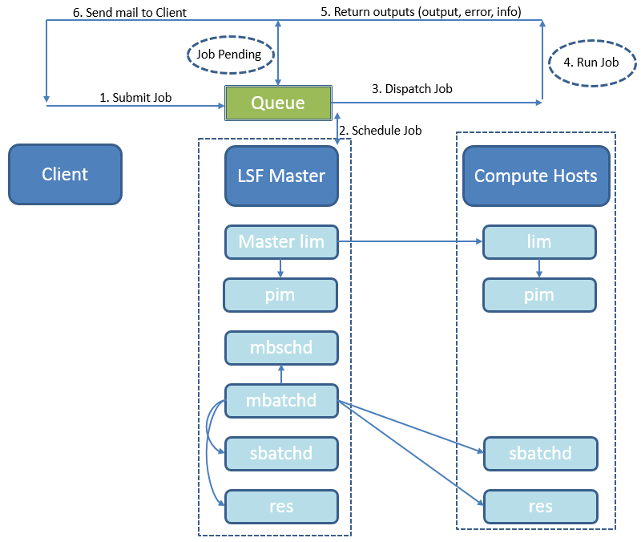
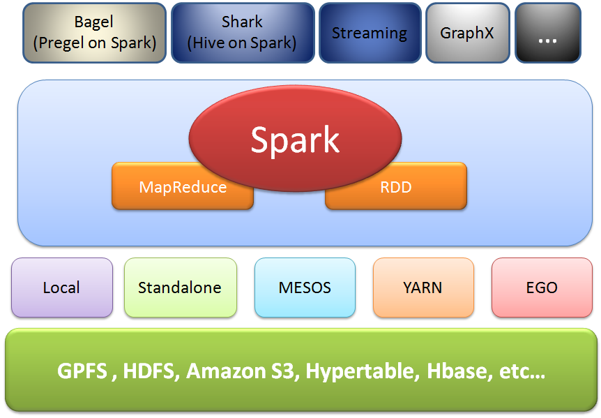

# Spark 和 IBM LSF 深度集成与实战
Spark 和 IBM LSF 实用

**标签:** 分析

[原文链接](https://developer.ibm.com/zh/articles/ba-cn-spark-ibm-lsf-integration/)

何金池, 张帅, 李峰

发布: 2017-06-27

* * *

大数据，已经不是 IT 界的专有名词了，而是和每个人的生活息息相关的事物，比如大数据辅助医疗，大数据协助购物，大数据让我们避免堵车。那么如何才能从各种各样类型的数据中，快速获得有价值的信息呢？这就需要大数据处理技术。正如维克托•迈尔•舍恩伯格教授在《大数据时代》中指出，大数据不用随机分析法（抽样调查）这样的捷径，而采用所有数据进行分析处理。

那么如何将浩瀚的数据全部处理呢？一个关键的知道思想是并行方法，那么什么是并行方法呢？有句俗语，“三个臭皮匠赛过诸葛亮”，这句古语其实就有并行计算的概念在里面，诸葛军师虽然可以神机妙算，也比不过三个臭皮匠并行思考。同样的道理，三个性能一般的机器，其并行的计算速度也可能超多一台强悍的机器的速度。在并行计算中，一次可执行多个指令，可以提高计算速度，进而解决大型而复杂的计算问题。并行计算的基本思想是用多个处理器来协同求解同一问题，即将被求解的问题分解成若干个部分，各部分均由一个独立的处理机来并行计算。并行计算系统既可以是含有多个处理器的超级计算机，也可以是以某种方式互连的若干台的独立计算机构成的集群。通过并行计算集群完成数据的处理，再将处理的结果返回给用户。

在本文中，Apache Spark 技术和 IBM LSF(Load Sharing Facility)技术都使用到了并行计算的理念。尤其是 IBM LSF 技术，萌发与 25 年前，堪称并行计算中的鼻祖。本文将就这两门技术分别做了分析和对比，并提供了二者的集成方法。

## IBM LSF 的原理与简介

IBM LSF 是一种强大的工作负载管理平台，提供基于各种策略的智能调度功能，利用分布式的基础架构资源来提高整体的系统性能。同时，IBM LSF 支持跨集群工作，用户可以通过 LSF，来实现集群间的负载均衡，扩展集群构架和资源，最大限度的提高集群的使用效率。

那么 IBM LSF 的初衷是什么呢？在当下，许多企业都面临一个头疼的问题，那就是如何管理各种各样的计算资源(如：CPU 时间、内存空间、网络带宽、应用程序等)，尤其是对于那些员工遍布全球的公司而言，如何充分利用有限的计算资源是非常关键的问题。由 IBM 公司开发的 Platform LSF 多集群系统,使多个异构的计算机能够通过局域网或广域网共享计算资源，并能够为用户提供对资源的透明访问。

IBM LSF 将多个集群连接在一起，一个集群往往是企业中的一个部门，每个集群中有一个主控机，此主控机负责收集该集群系统中的各台主机的负载信息，并且根据各主机的负载信息情况对作业进行调度。各个集群系统之间根据一定的策略进行资源共享。在每个主控机上定义了该集群能共享哪些集群系统中的资源。当用户发送了一个任务请求时，LSF 系统能将此任务发送到对应的资源所在地，并根据调度策略选择负载较轻的机器对此任务进行处理。当多个用户请求同一个资源时，根据用户的请求优先级来确保优先级高的用户的紧急任务能首先得到满足。

LSF 系统支持多种操作系统平台。支持的平台有：Sun Solaris、 HP-UX、 IBM AIX、以及 Red hat Linux、 Windows NT、Windows Server 等。LSF 的构架图如下所示。

##### 图一. LSF 架构和作业处理流程



在上图中体现了 LSF 的作业处理流程，大致如下:

1. 提交一份作业

     从 LSF 客户端，或者是一个运行 bsub 命令的服务器上提交一份作业，当提交这份作业时，如果不指定哪个队列，这份作业就会被提交到系统默认的队列中，作业在队列中等待安排，这些作业处于等待状态。

2. 调度作业

     后台的主进程 mbatchd 将处理队列中的作业，在一个预定的时间间隔里将这些作业按设定的计划，传递给主调度进程 mbschd。主调度进程 mbschd 评估这份工作时，根据作业的优先权制定调度决策、调度机制和可利用资源。主调度进程选择最佳的主机，在哪里作业可以运行，并将它的决策返回给后台主进程 mbatchd。主负载信息管理进程（LIM：Load Information Manager）收集资源信息，主 LIM 与 mbatchd 主进程交流这些信息，反过来 mbatchd 主进程使用之前交流信息支持调度决定。

3. 分配作业

     mbatchd 主进程一收到 mbschd 发过来的决定，立即分配作业到主机。

4. 运行作业

     从属批处理进程（sbatchd），从 mbatchd 主进程接到要求，为这份作业创建一个子 sbatchd 和一个执行环境，通过使用一个远程执行服务器开始这个作业。

5. 返回输出

     当一个作业完成时，如果这个作业没有任何问题，它处于一个完成状态。如果有错误作业无法完成，这份作业处于退出状态。sbatchd 传达作业信息，包括错误提示和给 mbatchd 的输出信息。

6. 反馈

     最后，mbatchd 给提交主机反馈作业输出信息、作业错误、提示信息、作业信息。


## Spark 的原理与简介

Spark 由加州大学伯克利分校 AMP 实验室所开发，可用来构建大型的、低延迟的数据分析应用程序。Spark 的创建初衷是为了支持分布式数据集上的迭代作业，它是与 Hadoop 相似的开源集群计算环境。Spark 启用了弹性内存分布数据集（RDD），所以，除了能够提供交互式查询外，它能够优化迭代工作负载。Spark 在 Scala 语言中实现，它将 Scala 用作其应用程序框架。Spark 和 Scala 能够紧密集成，其中的 Scala 可以像操作本地集合对象一样轻松地操作分布式数据集。

Spark 的优势不仅体现在性能提升上，Spark 框架为批处理(Spark Core)，交互式(Spark SQL)，流式(Spark Streaming)，机器学习(MLlib)，图计算(GraphX)提供一个统一的数据处理平台。在新一代的大数据处理平台中，Spark 得到了最广泛的认可和支持。Spark 的生态架构如下图所示。

##### 图二. Spark 生态构架



从整个构架来看，在最底层是存储类产品，比如 HDFS，亚马逊的云存储服务 S3,以及 IBM 的 GPFS 等。Spark Cluster 可以通过各种 RESTful API 以编程方式实现与 S3 服务的交互。Spark 所用的存储类技术可以说到处开花，不同的云平台提高不同的技术支持。有关 Spark 运行模式多种多样，依靠的资源分配技术也灵活多变。主要的运行模式有 Local 模式、Standalone 模式、Spark on Mesoes 模式、Spark on YARN 模式、Spark on EGO 模式等。

RDD 可以说是 Spark 的心脏，也是最主要的创新点。RDD 一种只读的、分区记录的集合，每次对 RDD 数据集的操作之后的结果，都可以存放到内存中，下一个操作可以直接从内存中输入，省去了 MapReduce 大量的磁盘 IO 操作。Bagel(Pregel on Spark) 是 Google 鼎鼎有名的图计算框架。Spark SQL 其实是 Shark 的发展，而 Shark 基本上就是在 Spark 的框架基础上提供和 Hive 一样的 HiveQL 命令接口。Spark streaming 是构建在 Spark 上处理流数据的框架，基本的原理是将 Stream 数据分成小的时间片断（秒级），以类似 batch 批量处理的方式来处理这小部分数据。

## Spark 与 IBM LSF 的区别和联系

IBM LSF 相对于 Apache Spark 来说，大概要早 20 年左右。Apache Spark 作为后起之秀，在大数据处理行业起到了中流砥柱的作用。那么这二者之前有什么区别和联系呢？

首先，从设计思想上，二者最大的相同点是，都应用到了并行的思想。如前文所述，IBM LSF 是强大的工作负载管理平台，常常用于要求较高的高性能（HPC）。LSF 提高基于并行策略的计算构架，来协调和管理分布式计算资源，并让其资源最大化。Spark 是一个通用的并行计算框架, 是一种快速处理大规模数据的通用引擎, 正是由于这种并行计算框架和高内存利用率，使得 Spark 在大数据处理领域如日中天。

其次，出发点相同，都是为了解决大批量的数据分析和复杂的计算问题。但二者的偏重点不同，LSF 偏重于负载分配和执行，提供一个高性能负载管理平台，这个平台有一套综合的基于智能的，策略驱动的调度策略，方便用户使用所有运算基础设施资源，帮助保障最佳的应用性能。Spark 是基于内存的迭代计算框架，启用了内存分布数据集，除了能够提供交互式查询外，它还可以优化迭代工作负载。Spark 是在 [Scala](http://baike.baidu.com/item/Scala) 语言中实现的，它将 Scala 用作其应用程序框架。

再次，二者都有相应的资源管理器。LSF 主要靠 LIM 来收集资源的使用情况，也可以选择资源管理器 Platform EGO（Enterprise Grid Orchestrator），Platform EGO 是一种资源管理和调度、监控、用户管理、服务管理等功能于一身的工具。Spark 目前支持 Standalone 模式、YARN、MESOS 等模式的资源管理和调度模块。

最后，使用场景有所不同。IBM LSF 平台适用于管理批处理负载，它将一个分布式计算网络平台作为一个超级计算机，将用户对资源的请求匹配，这个平台智能地将合适的工作分给正确的资源，使资源有效利用，减少浪费并实现最佳性能。LSF 用户希望在任何地方都能灵活使用应用程序，并自动操控数据流，管理者希望能够监督集群的资源和负载，确定瓶颈问题。而对于 Spark,从其设计理念（基于内存的迭代计算框架）角度出发，最适合处理有迭代运算的，或者需要多次操作特定数据集的应用场合。并且迭代次数越多，读取的数据量越大，Spark 的应用效果就越明显，反之，则收益较小。所以对于机器学习之类的“迭代式”应用，Spark 可谓是拿手好戏。另外，Spark Streaming 因为其内存存储中间数据的特性，处理速度非常快，也可以应用于需要实时处理大数据的场合。

## IBM LSF 与 Spark 的集成实战

1

### 环境的搭建

1. 从 IBM 官方网站下载 IBM platform LSF，并按照指导文档安装。
2. 从 Apache Spark 官方网站下载最新的 Spark 包，并参照 Spark 的安装文档来部署 Spark。部署方法相对简单，不在此赘述。
3. 登录 LSF Master，并初始化环境变量。 #source /conf/profile.lsf
4. 进入$LSF\_BINDIR 文件夹 cd $LSF\_BINDIR
5. 编辑 lsf-spark-submit.sh 和 lsf-spark-shell.sh, 在这两个文件中修改 SPARK\_HOME 和 SPARK\_MASTER\_PORT 值。其中 SPARK\_HOME 为 Apache Spark 的安装目录，SPARK\_MASTER\_PORT 是 Spark Master 的端口。
6. 编辑 lsf-stop-spark.sh，设置 SPARK\_HOME 为 Spark 的安装目录。

2

### 在 LSF 上运行 Spark 应用

1.准备一个 Spark 应用。在此文档中，一个 Scala 应用的例子如下。

````
##### 清单 1. Spark 应用 {: #清单-1-spark-应用}

```
/* SimpleApp.scala */
import org.apache.spark.SparkContext
import org.apache.spark.SparkContext._
import org.apache.spark.SparkConf
object SimpleApp {
def main(args: Array[String]) {
    val dataFile = args(0) // the filename is specified by the first command argument
    val conf = new SparkConf().setAppName("Simple Application")
    val sc = new SparkContext(conf)
    val logData = sc.textFile(dataFile, 2).cache()
    val numAs = logData.filter(line => line.contains("a")).count()
    val numBs = logData.filter(line => line.contains("b")).count()
    println("Lines with a: %s, Lines with b: %s".format(numAs, numBs))
}
}
```

````

Show moreShow more icon

1. 按照 Spark 的快速入门指南来编译成 Spark 应用,不在此赘述。

2. 使用 bsub 命令，通过 lsf-spark-submit.sh 来提交 Spark 应用。举例如下：


    ```
    #bsub -m "hostA! others" -n16 -R "span[ptile=8]" -I lsf-spark-submit.sh --class "SimpleApp" target/scala-2.10/simple-project_2.10-1.0.jar ../myfile.txt

    ```


    Show moreShow more icon

3. 通过 Spark GUI 来查看 Job 的运行情况。在浏览器中输入：

    [http://first\_execution\_hostname:port\_number](../../analytics/local/ba-cn-spark-ibm-lsf-integration/(Opens%20in%20a%20new%20tab%20or%20window))

     其中，first\_execution\_hostname 是第一个运行机器的 IP 或者机器名，port\_number 为前文中设置的 SPARK\_MASTER\_PORT。


3

### 在 LSF 上运行 Spark Shell

1. 可以使用 bsub -I 命令,来通过 lsf-spark-shell.sh 提交一个交互式的 Job，举例如下：


    ```
    #bsub -I -m "hostA! others" -R "span[ptile=4]" -n 8 lsf-spark-shell.sh

    ```


    Show moreShow more icon

     这个命令行可以启动一个 Spark shell,用户可以使用其指定 Spark 环境和运行 Spark 命令行。

2. 可以通过 Spark GUI 界面来查看 Job 的运行状态。方法同上。


## 结束语

近两年，Spark 技术发展速度惊人，用户越来越多，社区也愈加活跃，生态更加丰富，这些都证明了 Spark 的魅力。越来越多的企业正将注意力转向 Spark 以帮助对大数据处理工作进行加速。特别是对于众多的 LSF 用户，也往往试图引入 Spark，来更加高效的处理数据。Spark 和 LSF 的结合，二者相互互补和促进，有效的提高大数据处理的效率。

本文通过实践的方式，探讨了二者的区别的联系，并有效的将二者集成起来，使得更多的 LSF 用户可以使用 Spark，同时，Spark 用户也可以使用 LSF。