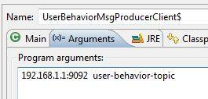
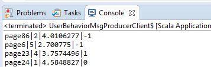
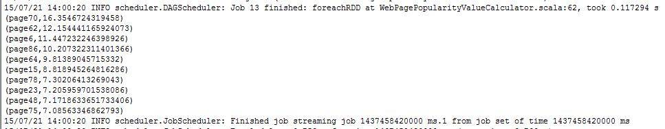
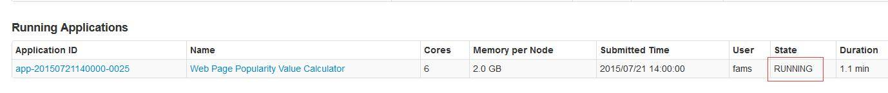

# Spark 实战, 第 2 部分:使用 Kafka 和 Spark Streaming 构建实时数据处理系统
开始 Spark 应用程序的开发之旅

**标签:** 分析,消息传递

[原文链接](https://developer.ibm.com/zh/articles/os-cn-spark-practice2/)

王龙

发布: 2015-07-27

* * *

## 引言

在很多领域，如股市走向分析, 气象数据测控，网站用户行为分析等，由于数据产生快，实时性强，数据量大，所以很难统一采集并入库存储后再做处理，这便导致传统的数据处理架构不能满足需要。流计算的出现，就是为了更好地解决这类数据在处理过程中遇到的问题。与传统架构不同，流计算模型在数据流动的过程中实时地进行捕捉和处理，并根据业务需求对数据进行计算分析，最终把结果保存或者分发给需要的组件。本文将从实时数据产生和流向的各个环节出发，通过一个具有实际意义的案例，向读者介绍如何使用 Apache Kafka 和 Spark Streaming 模块构建一个实时的数据处理系统，当然本文只是抛砖引玉，因为构建一个良好健壮的实时数据处理系统并不是一篇文章可以说清楚的。在阅读本文前，假设您已经对 Apache Kafka 分布式消息系统有了基本的了解，并且可以使用 Spark Streaming API 进行简单的编程。接下来，就让我们一起看看如何构建一个简易的实时数据处理系统吧。

## 关于 Kafka

Kafka 是一个分布式的，高吞吐量，易于扩展地基于主题发布/订阅的消息系统，最早是由 Linkedin 开发，并于 2011 年开源并贡献给 Apache 软件基金会。一般来说，Kafka 有以下几个典型的应用场景:

- 作为消息队列。由于 Kafka 拥有高吞吐量，并且内置消息主题分区，备份，容错等特性，使得它更适合使用在大规模，高强度的消息数据处理的系统中。
- 流计算系统的数据源。流数据产生系统作为 Kafka 消息数据的生产者将数据流分发给 Kafka 消息主题，流数据计算系统 (Storm,Spark Streaming 等) 实时消费并计算数据。这也是本文将要介绍的应用场景。
- 系统用户行为数据源。这种场景下，系统将用户的行为数据，如访问页面，停留时间，搜索日志，感兴趣的话题等数据实时或者周期性的发布到 Kafka 消息主题，作为对接系统数据的来源。
- 日志聚集。Kafka 可以作为一个日志收集系统的替代解决方案，我们可以将系统日志数据按类别汇集到不同的 Kafka 消息主题中。
- 事件源。在基于事件驱动的系统中，我们可以将事件设计成合理的格式，作为 Kafka 消息数据存储起来，以便相应系统模块做实时或者定期处理。由于 Kafka 支持大数据量存储，并且有备份和容错机制，所以可以让事件驱动型系统更加健壮和高效。

当然 Kafka 还可以支持其他的应用场景，在这里我们就不一一罗列了。关于 Kafka 更详细的介绍，请读者参考 [Kafka 官网](https://kafka.apache.org/) 。需要指出的是，本文使用的 Kafka 版本是基于 Scala 2.10 版本构建的 0.8.2.1 版本。

## 关于 Spark Steaming

Spark Streaming 模块是对于 Spark Core 的一个扩展，目的是为了以高吞吐量，并且容错的方式处理持续性的数据流。目前 Spark Streaming 支持的外部数据源有 Flume、 Kafka、Twitter、ZeroMQ、TCP Socket 等。

Discretized Stream 也叫 DStream) 是 Spark Streaming 对于持续数据流的一种基本抽象，在内部实现上，DStream 会被表示成一系列连续的 RDD(弹性分布式数据集)，每一个 RDD 都代表一定时间间隔内到达的数据。所以在对 DStream 进行操作时，会被 Spark Stream 引擎转化成对底层 RDD 的操作。对 Dstream 的操作类型有:

- **Transformations:** 类似于对 RDD 的操作，Spark Streaming 提供了一系列的转换操作去支持对 DStream 的修改。如 map,union,filter,transform 等
- **Window Operations:** 窗口操作支持通过设置窗口长度和滑动间隔的方式操作数据。常用的操作有 reduceByWindow,reduceByKeyAndWindow,window 等
- **Output Operations:** 输出操作允许将 DStream 数据推送到其他外部系统或存储平台, 如 HDFS, Database 等，类似于 RDD 的 Action 操作，Output 操作也会实际上触发对 DStream 的转换操作。常用的操作有 print,saveAsTextFiles,saveAsHadoopFiles, foreachRDD 等。

关于 DStream Operations 的更多信息，请参考 Spark 官网的 [Spark Streaming Programing Guide](http://spark.apache.org/docs/latest/streaming-programming-guide.html) 。

## Kafka 集群搭建步骤

### 第 1 步. 机器准备

本文中，我们将准备三台机器搭建 Kafka 集群，IP 地址分别是 192.168.1.1，192.168.1.2，192.168.1.3，并且三台机器网络互通。

### 第 2 步. 下载并安装 kafka\_2.10-0.8.2.1

下载地址: [https://kafka.apache.org/downloads.html](https://kafka.apache.org/downloads.html)

下载完成后，上传到目标机器中的一个，如 192.168.1.1 , 使用以下命令解压：

##### 清单 1\. Kafka 安装包解压命令

```
tar –xvf kafka_2.10-0.8.2.1

```

Show moreShow more icon

安装完成。

### 第 3 步. 创建 zookeeper 数据目录并设定服务器编号

在所有三台服务器上执行下面操作。

切换到当前用户工作目录，如/home/fams , 创建 zookeeper 保存数据的目录, 然后在这个目录下新建服务器编号文件。

##### 清单 2\. 创建数据目录和服务器编号文件命令

```
mkdir zk_data
cat N > myid

```

Show moreShow more icon

注意需要保证 N 在三台服务器上取不同值，如分别取 1,2,3。

### 第 4 步. 编辑 zookeeper 配置文件

Kafka 安装包中内置 zookeeper 服务。进入 Kafka 安装目录, 如/home/fams/kafka\_2.10-0.8.2.1, 编辑 config/zookeeper.properties 文件，增加以下配置：

##### 清单 3\. zookeeper 配置项

```
tickTime=2000
dataDir=/home/fams/zk_data/
clientPort=2181
initLimit=5
syncLimit=2
server.1=192.168.1.1:2888:3888
server.2=192.168.1.2:2888:3888
server.3=192.168.1.3:2888:3888

```

Show moreShow more icon

这些配置项的解释如下:

- tickTime：zookeeper 服务器之间的心跳时间间隔，以毫秒为单位。
- dataDir：zookeeper 的数据保存目录，我们也把 zookeeper 服务器的 ID 文件保存到这个目录下，下文会介绍。
- clientPort：zookeeper 服务器会监听这个端口，然后等待客户端连接。
- initLimit：zookeeper 集群中 follower 服务器和 leader 服务器之间建立初始连接时所能容忍的心跳次数的极限值。
- syncLimit：zookeeper 集群中 follower 服务器和 leader 服务器之间请求和应答过程中所能容忍的心跳次数的极限值。
- server.N：N 代表的是 zookeeper 集群服务器的编号。对于配置值，以 192.168.1.1:2888:3888 为例，192.168.1.1 表示该服务器的 IP 地址，2888 端口表示该服务器与 leader 服务器的数据交换端口，3888 表示选举新的 leader 服务器时候用到的通信端口。

### 第 5 步. 编辑 Kafka 配置文件

**a**. 编辑 config/server.properties 文件

添加或修改以下配置。

##### 清单 4\. Kafka Broker 配置项

```
broker.id=0
port=9092
host.name=192.168.1.1
zookeeper.contact=192.168.1.1:2181,192.168.1.2:2181,192.168.1.3:2181
log.dirs=/home/fams/kafka-logs

```

Show moreShow more icon

这些配置项解释如下：

- broker.id：Kafka broker 的唯一标识，集群中不能重复。
- port: Broker 的监听端口，用于监听 Producer 或者 Consumer 的连接。
- host.name:当前 Broker 服务器的 IP 地址或者机器名。
- zookeeper.contact:Broker 作为 zookeeper 的 client，可以连接的 zookeeper 的地址信息。
- log.dirs：日志保存目录。

**b**. 编辑 config/producer.properties 文件

添加或者修改以下配置：

##### 清单 5\. Kafka Producer 配置项

```
broker.list=192.168.1.1:9092,192.168.1.2:9092,192.168.1.3:9092
producer.type=async

```

Show moreShow more icon

这些配置项解释如下：

- broker.list：集群中 Broker 地址列表。
- producer.type: Producer 类型,async 异步生产者，sync 同步生产者。

**c**. 编辑 config/consumer.properties 文件

##### 清单 6\. Kafka Consumer 配置项

```
zookeeper.contact=192.168.1.1:2181,192.168.1.2:2181,192.168.1.3:2181

```

Show moreShow more icon

配置项解释如下：

- zookeeper.contact: Consumer 可以连接的 zookeeper 服务器地址列表。

### 第 6 步. 上传修改好的安装包到其他机器

至此，我们已经在 192.168.1.1 机器上修改好了所有需要的配置文件，那么接下来请用以下命令打包该 Kafka 安装包，并上传至 192.168.1.2 和 192.168.1.3 两台机器上。

##### 清单 7\. 打包并上传 Kafka 安装包的命令

```
tar –cvf kafka_2.10-0.8.2.1.tar ./kafka_2.10-0.8.2.1
scp ./kafka_2.10-0.8.2.1.tar fams@192.168.1.2:/home/fams
scp ./kafka_2.10-0.8.2.1.tar fams@192.168.1.3:/home/fams

```

Show moreShow more icon

上传完成后，我们需要到 192.168.1.2 和 192.168.1.3 两台机器上解压刚才上传的 tar 包，命令如清单一。之后需要分别在两台机器上修改 config/server.properties 文件中的 broker.id 和 host.name. broker.id，可以分别复制 1 和 2，host.name 需要改成当前机器的 IP。

### 第 7 步. 启动 zookeeper 和 Kafka 服务

分别在三台机器上运行下面命令启动 zookeeper 和 Kafka 服务。

##### 清单 8\. 启动 zookeeper 服务

```
nohup bin/zookeeper-server-start.sh config/zookeeper.properties &

```

Show moreShow more icon

##### 清单 9\. 启动 kafka 服务

```
nohup bin/kafka-server-start.sh config/server.properties &

```

Show moreShow more icon

### 第 8 步. 验证安装

我们的验证步骤有两个。

第 1 步，分别在三台机器上使用下面命令查看是否有 Kafka 和 zookeeper 相关服务进程。

##### 清单 10\. 查看 Kafka 和 zookeeper 服务进程

```
ps –ef | grep kafka

```

Show moreShow more icon

第 2 步，创建消息主题，并通过 console producer 和 console consumer 验证消息可以被正常的生产和消费。

##### 清单 11\. 创建消息主题

```
bin/kafka-topics.sh --create \
--replication-factor 3 \
--partition 3 \
--topic user-behavior-topic \
--zookeeper 192.168.1.1:2181,192.168.1.2:2181,192.168.1.3:2181

```

Show moreShow more icon

运行下面命令打开打开 console producer。

##### 清单 12\. 启动 Console Producer

```
bin/kafka-console-producer.sh --broker-list 192.168.1.1:9092 --topic user-behavior-topic

```

Show moreShow more icon

在另一台机器打开 console consumer。

##### 清单 13\. 启动 Console Consumer

```
./kafka-console-consumer.sh --zookeeper 192.168.1.2:2181 --topic user-behavior-topic --from-beginning

```

Show moreShow more icon

然后如果在 producer console 输入一条消息，能从 consumer console 看到这条消息就代表安装是成功的。

## 案例介绍与编程实现

### 案例介绍

该案例中，我们假设某论坛需要根据用户对站内网页的点击量，停留时间，以及是否点赞，来近实时的计算网页热度，进而动态的更新网站的今日热点模块，把最热话题的链接显示其中。

### 案例分析

对于某一个访问论坛的用户，我们需要对他的行为数据做一个抽象，以便于解释网页话题热度的计算过程。

首先，我们通过一个向量来定义用户对于某个网页的行为即点击的网页，停留时间，以及是否点赞，可以表示如下：

`(page001.html, 1, 0.5, 1)`

向量的第一项表示网页的 ID，第二项表示从进入网站到离开对该网页的点击次数，第三项表示停留时间，以分钟为单位，第四项是代表是否点赞，1 为赞，-1 表示踩，0 表示中立。

其次，我们再按照各个行为对计算网页话题热度的贡献，给其设定一个权重，在本文中，我们假设点击次数权重是 0.8，因为用户可能是由于没有其他更好的话题，所以再次浏览这个话题。停留时间权重是 0.8，因为用户可能同时打开多个 tab 页，但他真正关注的只是其中一个话题。是否点赞权重是 1，因为这一般表示用户对该网页的话题很有兴趣。

最后，我们定义用下列公式计算某条行为数据对于该网页热度的贡献值。

`f(x,y,z)=0.8x+0.8y+z`

那么对于上面的行为数据 (page001.html, 1, 0.5, 1)，利用公式可得：

`H(page001)=f(x,y,z)= 0.8x+0.8y+z=0.8*1+0.8*0.5+1*1=2.2`

读者可以留意到，在这个过程中，我们忽略了用户本身，也就是说我们不关注用户是谁，而只关注它对于网页热度所做的贡献。

### 生产行为数据消息

在本案例中我们将使用一段程序来模拟用户行为，该程序每隔 5 秒钟会随机的向 user-behavior-topic 主题推送 0 到 50 条行为数据消息，显然，这个程序扮演消息生产者的角色，在实际应用中，这个功能一般会由一个系统来提供。为了简化消息处理，我们定义消息的格式如下：

网页 ID\|点击次数\|停留时间 (分钟)\|是否点赞

并假设该网站只有 100 个网页。以下是该类的 Scala 实现源码。

##### 清单 14\. UserBehaviorMsgProducer 类源码

```
import scala.util.Random
import java.util.Properties
import kafka.producer.KeyedMessage
import kafka.producer.ProducerConfig
import kafka.producer.Producer

class UserBehaviorMsgProducer(brokers: String, topic: String) extends Runnable {
private val brokerList = brokers
private val targetTopic = topic
private val props = new Properties()
props.put("metadata.broker.list", this.brokerList)
props.put("serializer.class", "kafka.serializer.StringEncoder")
props.put("producer.type", "async")
private val config = new ProducerConfig(this.props)
private val producer = new Producer[String, String](this.config)

private val PAGE_NUM = 100
private val MAX_MSG_NUM = 3
private val MAX_CLICK_TIME = 5
private val MAX_STAY_TIME = 10
//Like,1;Dislike -1;No Feeling 0
private val LIKE_OR_NOT = Array[Int](1, 0, -1)

def run(): Unit = {
val rand = new Random()
while (true) {
//how many user behavior messages will be produced
val msgNum = rand.nextInt(MAX_MSG_NUM) + 1
try {
//generate the message with format like page1|2|7.123|1
for (i <- 0 to msgNum) {
var msg = new StringBuilder()
msg.append("page" + (rand.nextInt(PAGE_NUM) + 1))
msg.append("|")
msg.append(rand.nextInt(MAX_CLICK_TIME) + 1)
msg.append("|")
msg.append(rand.nextInt(MAX_CLICK_TIME) + rand.nextFloat())
msg.append("|")
msg.append(LIKE_OR_NOT(rand.nextInt(3)))
println(msg.toString())
//send the generated message to broker
sendMessage(msg.toString())
}
println("%d user behavior messages produced.".format(msgNum+1))
} catch {
case e: Exception => println(e)
}
try {
//sleep for 5 seconds after send a micro batch of message
Thread.sleep(5000)
} catch {
case e: Exception => println(e)
}
}
}
def sendMessage(message: String) = {
try {
val data = new KeyedMessage[String, String](this.topic, message);
producer.send(data);
} catch {
case e:Exception => println(e)
}
}
}
object UserBehaviorMsgProducerClient {
def main(args: Array[String]) {
if (args.length < 2) {
println("Usage:UserBehaviorMsgProducerClient 192.168.1.1:9092 user-behavior-topic")
System.exit(1)
}
//start the message producer thread
new Thread(new UserBehaviorMsgProducer(args(0), args(1))).start()
}
}

```

Show moreShow more icon

### 编写 Spark Streaming 程序消费消息

在弄清楚了要解决的问题之后，就可以开始编码实现了。对于本案例中的问题，在实现上的基本步骤如下:

- 构建 Spark 的 StreamingContext 实例，并且开启 checkpoint 功能。因为我们需要使用 updateStateByKey 原语去累计的更新网页话题的热度值。
- 利用 Spark 提供的 KafkaUtils.createStream 方法消费消息主题，这个方法会返回 ReceiverInputDStream 对象实例。
- 对于每一条消息，利用上文的公式计算网页话题的热度值。
- 定义一个匿名函数去把网页热度上一次的计算结果值和新计算的值相加，得到最新的热度值。
- 调用 updateStateByKey 原语并传入上面定义的匿名函数更新网页热度值。
- 最后得到最新结果后，需要对结果进行排序，最后打印热度值最高的 10 个网页。

源代码如下。

##### 清单 15\. WebPagePopularityValueCalculator 类源码

```
import org.apache.spark.SparkConf
import org.apache.spark.streaming.Seconds
import org.apache.spark.streaming.StreamingContext
import org.apache.spark.streaming.kafka.KafkaUtils
import org.apache.spark.HashPartitioner
import org.apache.spark.streaming.Duration

object WebPagePopularityValueCalculator {
private val checkpointDir = "popularity-data-checkpoint"
private val msgConsumerGroup = "user-behavior-topic-message-consumer-group"

def main(args: Array[String]) {
if (args.length < 2) {
println("Usage:WebPagePopularityValueCalculator zkserver1:2181,
                    zkserver2:2181,zkserver3:2181 consumeMsgDataTimeInterval(secs)")
System.exit(1)
}
val Array(zkServers,processingInterval) = args
val conf = new SparkConf().setAppName("Web Page Popularity Value Calculator")
val ssc = new StreamingContext(conf, Seconds(processingInterval.toInt))
//using updateStateByKey asks for enabling checkpoint
ssc.checkpoint(checkpointDir)
val kafkaStream = KafkaUtils.createStream(
//Spark streaming context
ssc,
//zookeeper quorum. e.g zkserver1:2181,zkserver2:2181,...
zkServers,
//kafka message consumer group ID
msgConsumerGroup,
//Map of (topic_name -> numPartitions) to consume. Each partition is consumed in its own thread
Map("user-behavior-topic" -> 3))
val msgDataRDD = kafkaStream.map(_._2)
//for debug use only
//println("Coming data in this interval...")
//msgDataRDD.print()
// e.g page37|5|1.5119122|-1
val popularityData = msgDataRDD.map { msgLine =>
{
val dataArr: Array[String] = msgLine.split("\\|")
val pageID = dataArr(0)
//calculate the popularity value
val popValue: Double = dataArr(1).toFloat * 0.8 + dataArr(2).toFloat * 0.8 + dataArr(3).toFloat * 1
(pageID, popValue)
}
}
//sum the previous popularity value and current value
val updatePopularityValue = (iterator: Iterator[(String, Seq[Double], Option[Double])]) => {
iterator.flatMap(t => {
val newValue:Double = t._2.sum
val stateValue:Double = t._3.getOrElse(0);
Some(newValue + stateValue)
}.map(sumedValue => (t._1, sumedValue)))
}
val initialRDD = ssc.sparkContext.parallelize(List(("page1", 0.00)))
val stateDstream = popularityData.updateStateByKey[Double](updatePopularityValue,
new HashPartitioner(ssc.sparkContext.defaultParallelism), true, initialRDD)
//set the checkpoint interval to avoid too frequently data checkpoint which may
//may significantly reduce operation throughput
stateDstream.checkpoint(Duration(8*processingInterval.toInt*1000))
//after calculation, we need to sort the result and only show the top 10 hot pages
stateDstream.foreachRDD { rdd => {
val sortedData = rdd.map{ case (k,v) => (v,k) }.sortByKey(false)
val topKData = sortedData.take(10).map{ case (v,k) => (k,v) }
topKData.foreach(x => {
println(x)
})
}
}
ssc.start()
ssc.awaitTermination()
}
}

```

Show moreShow more icon

## 部署和测试

读者可以参考以下步骤部署并测试本案例提供的示例程序。

第 1 步，启动行为消息生产者程序, 可以直接在 Scala IDE 中启动，不过需要添加启动参数，第一个是 Kafka Broker 地址，第二个是目标消息主题的名称。

##### 图 1\. UserBehaviorMsgProducer 类启动参数



启动后，可以看到控制台有行为消息数据生成。

##### 图 2\. 生成的行为消息数据预览



第 2 步，启动作为行为消息消费者的 Spark Streaming 程序，需要在 Spark 集群环境中启动，命令如下：

##### 清单 16\. WebPagePopularityValueCalculator 类启动命令

```
bin/spark-submit \
--jars $SPARK_HOME/lib/spark-streaming-kafka_2.10-1.3.1.jar, \
$SPARK_HOME/lib/spark-streaming-kafka-assembly_2.10-1.3.1.jar, \
$SPARK_HOME/lib/kafka_2.10-0.8.2.1.jar, \
$SPARK_HOME/lib/kafka-clients-0.8.2.1.jar \
--class com.ibm.spark.exercise.streaming.WebPagePopularityValueCalculator
--master spark://<spark_master_ip>:7077 \
--num-executors 4 \
--driver-memory 4g \
--executor-memory 2g \
--executor-cores 2 \
/home/fams/sparkexercise.jar \
192.168.1.1:2181,192.168.1.2:2181,192.168.1.3:2181 2

```

Show moreShow more icon

由于程序中我们要用到或者间接调用 Kafka 的 API，并且需要调用 Spark Streaming 集成 Kafka 的 API(KafkaUtils.createStream), 所以需要提前将启动命令中的 jar 包上传到 Spark 集群的每个机器上 (本例中我们将它们上传到 Spark 安装目录的 lib 目录下，即$SPARK\_HOME/lib)，并在启动命令中引用它们。

启动后，我们可以看到命令行 console 下面有消息打印出来，即计算的热度值最高的 10 个网页。

##### 图 3\. 网页话题热度当前排序预览



我们也可以到 Spark Web Console 上去查看当前 Spark 程序的运行状态, 默认地址为: `http://spark_master_ip:8080`。

##### 图 4\. 查看 Spark Streaming 程序的运行状态



## 注意事项

利用 Spark Streaming 构建一个高效健壮的流数据计算系统，我们还需要注意以下方面。

- 需要合理的设置数据处理的间隔，即需要保证每一批数据的处理时间必须小于处理间隔，保证在处理下一批数据的时候，前一批已经处理完毕。显然这需要由您的 Spark 集群的计算能力还有 input 数据的量决定。
- 需要尽可能的提升读取 input 数据的能力。在 Spark Streaming 与外部系统如 Kafka，Flume 等集成时，为了避免接收数据环节成为系统的瓶颈，我们可以启动多个 ReceiverInputDStream 对象实例。
- 虽然本文案例中，我们只是把 (近) 实时计算结果打印出来，但是实际上很多时候这些结果会被保存到数据库,HDFS, 或者发送回 Kafka, 以供其他系统利用这些数据做进一步的业务处理。
- 由于流计算对实时性要求很高，所以任何由于 JVM Full GC 引起的系统暂停都是不可接受的。除了在程序中合理使用内存，并且定期清理不需要的缓存数据外，CMS(Concurrent Mark and Sweep) GC 也是被 Spark 官方推荐的 GC 方式，它能有效的把由于 GC 引起的暂停维持在一个在很低的水平。我们可以在使用 spark-submit 命令时通过增加 –driver-java-options 选项来添加 CMS GC 相关的参数。
- 在 Spark 官方提供关于集成 Kafka 和 Spark Streaming 的指导文档中，提到了两种方式，第一种是 Receiver Based Approach，即通过在 Receiver 里实现 Kafka consumer 的功能来接收消息数据;第二种是 Direct Approach, 即不通过 Receiver，而是周期性的主动查询 Kafka 消息分区中的最新 offset 值，进而去定义在每个 batch 中需要处理的消息的 offset 范围。本文采用的是第一种方式，因为目前第二种方式还处于试验阶段。
- 如果采用 Receiver Based Approach 集成 Kafka 和 Spark Streaming，就需要考虑到由于 Driver 或者 Worker 节点宕机而造成的数据丢失的情况，在默认配置下，是有可能造成数据丢失的，除非我们开启 Write Ahead Log(WAL) 功能。在这种情况下，从 Kafka 接收到的消息数据会同步的被写入到 WAL 并保存到可靠的分布式文件系统上，如 HDFS。可以通过在 Spark 配置文件中 (conf/spark-defaults.conf) 把 spark.streaming.receiver.writeAheadLog.enable 配置项设置成 true 开启这个功能。当然在开启 WAL 的情况下，会造成单个 Receiver 吞吐量下降，这时候，我们可能需要并行的运行多个 Receiver 来改善这种情况。
- 由于 updateStateByKey 操作需要开启 checkpoint 功能，但是频繁的 checkpoint 会造成程序处理时间增长，也会造成吞吐量下降。默认情况下，checkpoint 时间间隔会取 steaming 程序数据处理间隔或者 10 秒两者中较大的那个。官方推荐的间隔是 streaming 程序数据处理间隔的 5-10 倍。可以通过 dsteam.checkpoint(checkpointInterval) 来设置，参数需要用样本类 Duration 包装下，单位是毫秒。

## 结束语

本文包含了集成 Spark Streaming 和 Kafka 分布式消息系统的基本知识，但是需要指出的是，在实际问题中，我们可能面临更多的问题，如性能优化，内存不足，以及其他未曾遇到的问题。希望通过本文的阅读，读者能对使用 Spark Streaming 和 Kafka 构建实时数据处理系统有一个基本的认识，为读者进行更深入的研究提供一个参考依据。读者在阅读本文的时候发现任何问题或者有任何建议，请不吝赐教，留下您的评论，我会及时回复。希望我们可以一起讨论，共同进步。