# Spark 技术在基因序列分析中的应用
Spark 实战

**标签:** 分析

[原文链接](https://developer.ibm.com/zh/articles/ba-cn-spark-genesequencing-application/)

于若信

发布: 2016-11-09

* * *

## 引言

生命科学方兴未艾， 从食品工业中的细菌培养鉴定到癌症快速诊断，基于 DNA 分析的应用不断出现，但同时基因分析应用也面临着很大挑战；许多新技术、新方法被应用到基因序列分析应用中，包括 Spark、FPGA 以及 GPU 协处理器加速等，这些技术的应用不仅能够使大部分生命科学领域的应用，包括开源和 ISV 软件，在不需要复杂的 MPI 编程情况下实现并行化处理，同时 Spark 内存内计算技术也能够提高分析效率，加速工作流程， 缩短分析时间，从而有更多新的发现。本文将介绍如何利用 Spark 技术运行常用的基因序列分析应用，包括在 Spark 不同模式下的运行方法， 运行过程以及运行结果分析，并比较在不同运算平台以及不同运行参数情况下的性能和加速比。

## 1\. 基因序列分析工作流

基因序列分析工作流以 GATK 的最佳实践为标准。它以最初的 FASTQ 文件为输入，从 BWA-mem 测序到 GATK 的 HaploTyperCaller，完成对整个样板的测序分析。

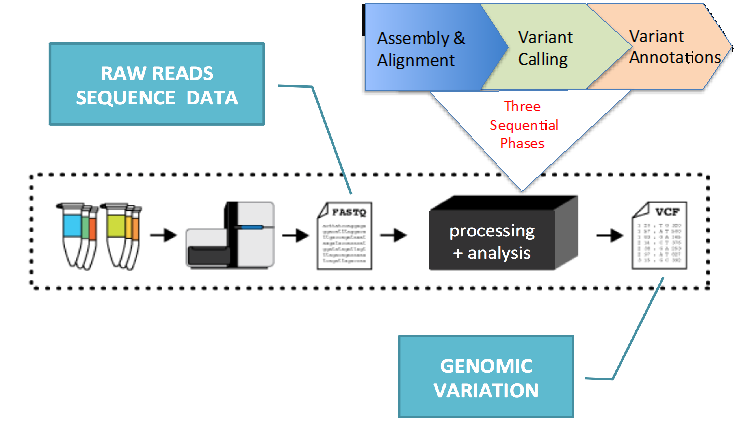

图 1、GATK 最佳实践

在测序工作流的第一阶段，BWA-mem 对输入文件 FASTQ 执行比对，生成序列比对和映射文件 SAM，然后通过 SortSam 生成一个经过排序的 BAM 文件，实际上，BAM 文件是 SAM 文件的二进制形式，此后的处理均基于 BAM 二进制文件。

BAM 文件传送给 Picard 工具 MarkDuplicates, 去除重复的片段，并生成一个合并的、去除重复片段的 BAM 文件。以下的几步，RealignerTargetCreator、IndelRealigner、BaseRecalibrator、PrintReads 和 HaplotypeCaller 都是 GATK 的一部分，是对高吞吐序列数据进行分析的软件包。

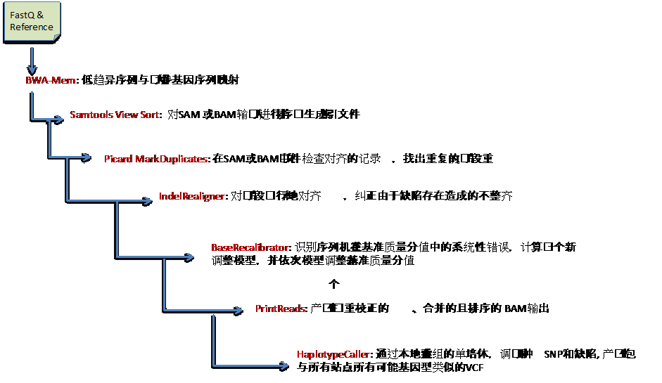

图 2、基因测序工作流分解

序列分析的主要工作是数据前处理，经过处理的数据可以为后续的分析工作所调用。前处理阶段，比对和排序是计算密集且比较耗费时间的过程，尽管通过多处理器或多线程的方式可以提高效率，但是在实际工作中由于计算方法的复杂程度以及需要分析的数据量迅速增加，当前一个分析过程仍然可能花费超过 1 天时间，费用从 200 美元到 600 美元不等。Spark 技术可以将串行的分析并行化，将数据分段优化并进行动态负载均衡以提高效率。

GATK4 就是 Broad 推出的基于 Spark 技术的基因序列分析软件包。GATK4 数据前处理的流程是：

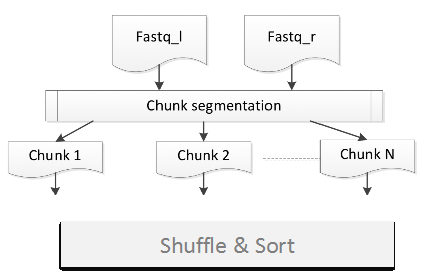

图 3、基于 Spark 技术数据前处理

- 合并输入文件和参考文件
- 分成数据块
- 数据块的数量取决于集群大小和可用资源
- 工作流分为多级，在数据处理之前只划分一次
- 分级类似于 Mapreduce
- TaskManager 分配任务给 executor
- BlockManager 利用 s _park.broadcast.blockSize_ 设置块的每一个片的大小；数值太大，在广播过程中会减小并发（使运行变慢），但是，数值太小时，BlockManager 的性能会受影响，缺省是 4M
- 剩余内存空间不断减少，当剩余内存太小时，任务会中断并被踢出。Spark 会尝试重启任务，当超过设定的重启次数仍无法成功时，作业就非正常结束。

GATK4 仍处在不断开发、不断完善的过程中，其所提供的工具和工作流也在不断增加，目前最新版本的 GATK4 提供的工作流包括：

- BQSRPipelineSpark

    在 Spark 上执行 BQSR 的两个步骤(BaseRecalibrator 和 ApplyBQSR)

- BwaAndMarkDuplicatesPipelineSpark

    以名称排序的文件为输入运行 BWA 和 MarkDuplicates.

- ReadsPipelineSpark

    以 BWA 的校正片段为输入运行 MarkDuplicates 和 BQSR，其输出用于后续的分析


图 4 是 ReadsPipelineSpark 工作流示意图。

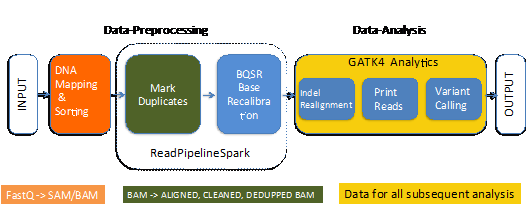

图 4、 ReadsPipelineSpark 工作流

## 2\. 序列分析优化方法

序列分析中的不同应用对系统资源有同步的需求。从图 5 可以看到，有的应用占用 CPU 资源比较高，如 BWA 不仅占用大量处理器资源，且运行时间长，而有的应用则需要大量内存，处理时间同样比较长，如 HaploTyperCaller。

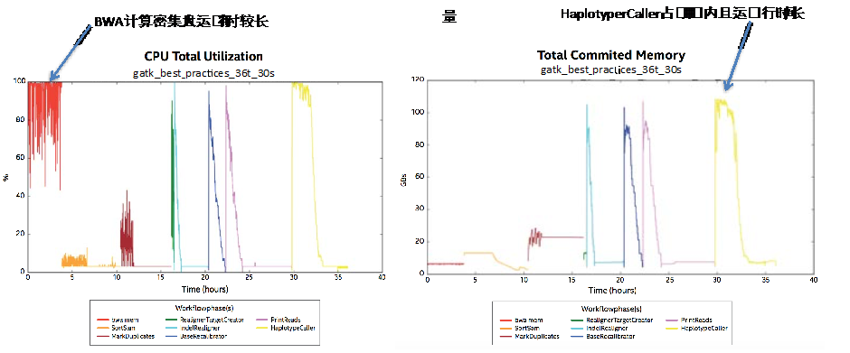

图 5、不同应用对系统资源的需求

一般地，有四种方法对基因处理过程进行优化和加速：

1. -nt 在引擎 engine 级别进行并行，并行处理基因序列的不同部分
2. -nct 在 walker 级别进行并行，加速处理基因序列每个单独区域
3. MapReduce 同时生成许多实例，每个实例处理基因序列的不同的（任意的）部分
4. 利用科学库优化

在 GATK 工作流中可以通过设置-nt 和-nct 参数，提高作业运行效率。

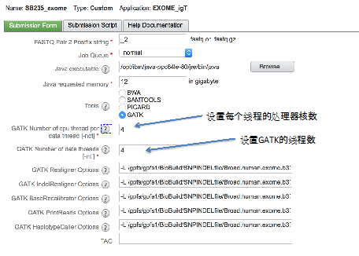

GATK4 是 GATK 基于 Spark 开发的版本，它有很多可以在 Spark 环境中运行的工具和工作流，它采用分级的方式运行作业，其工作工程类似于 Mapreduce 。有 3 种运行模式：

- None-spark standalone 模式
- Spark standalone 模式
- Spark cluster 模式

在输入数据和参考文件设置正确的情况下，大部分 GATK4 工具都可以在 Spark 集群模式下成功运行。 有些应用在集群模式下的运行结果可以得到显著的提升，如 CountReadsSpark，有的应用，特别是当工作流则需要更多的系统资源时，在 spark standalone 模式下无法运行，会报告”Not enough space to cache RDD in memory”错误，而在 Spark Cluster 模式下则能顺利运行， 如 CollectInsertSizeMetricsSpark 。

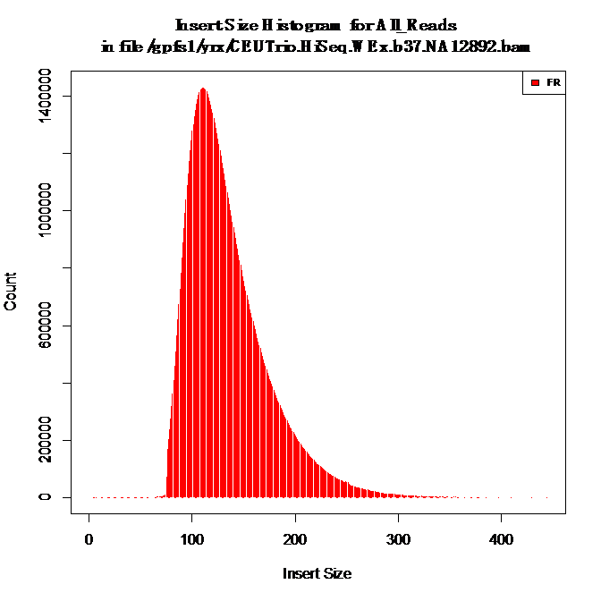

图 6、CollectInsertSizeMetricsSpark 结果

对序列分析应用加速的另一种方法是提供基于 POWER8 处理器的优化科学库。以 HaplotypeCaller 分析为例，它在分析过程中占用大量的内存，运行时间最长。不同厂家也在开发基于自己软件栈的加速库，如 Intel GKL 基因内核库。

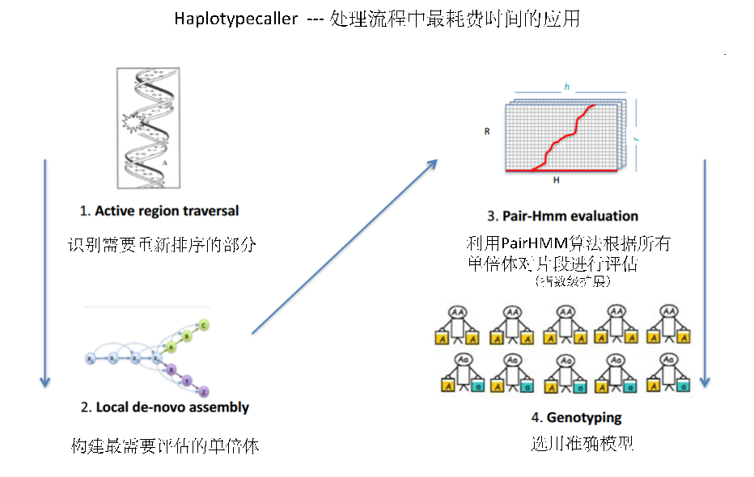

IBM 提供一个在 POWER8 系统上优化的 PairHMM 算法，它充分发挥了 POWER8 系统上新的软件、硬件特性，目前，该优化科学库可以运行在 POWER8 Ubuntu14 和 RHEL7 操作系统上。

最新版本的科学库利用与 POWER8 上 Java 相同的浮点精度对 HaplotyperCaller 进行加速，同时它充分利用并发多线程 SMT 以及向量指令集，对 HaplotypeCaller 的加速性能超过以前的版本，特别是在单线程模式（即 –nct 选项未指定）。在单线程模式下，利用 PairHMM 加速，HaplotypeCaller 消耗的时间只有一半，加速比达到 1.88 倍。

在 P8 系统上调用 PairHMM：

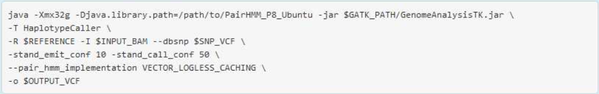

加速基因测序应用的其他方法还包括 FPGA、GPGPU 计算以及全硬件加速的 Edico Dragon Solution 等，不在本文档讨论范围。

## 3\. Spark 技术介绍

Spark 是一种与 [Hadoop](http://baike.baidu.com/view/908354.htm) 相似的集群计算环境， 但 Spark 启用了内存分布数据集， 在某些工作负载方面表现得更加优越，除了能够提供交互式查询外，Spark 还可以优化迭代工作负载。

Spark 的主要特点包括：

- 速度快

    Spark 具有先进的 DAG 执行引擎，支持迭代数据流和内存内计算，应用程序执行速度是 Hadoop 在内存内 MapReduce 的 100 倍，或在磁盘上的 10 倍；

    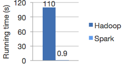

- 易于使用

    用 Java、Scala、Python 和 R 快速编写应用， Spark 提供超过 80 种高级操作，构建并行应用非常方便，而且可以与 Scala 、Python 和 R 进行交互；

- 通用

    Spark 支撑一系列函数库和软件栈，包括 SQL、DataFrames、机器学习 MLlib、GraphX 和 Spark Streaming，可以将这些库无缝地集成到同一个应用，将 SQL、流以及复杂分析结合在一起。

    

- 运行在任何地方

    Spark 可以运行在 Hadoop、Mesos、standalone 模式或云。它可以访问多种多样的数据，包括 HDFS、Cassandra、HBase 和 S3。可以以不同模式运行 Spark，包括本地模式、Standalone 模式、Mesoes 模式和 yarn 模式。


IBM Spectrum Conductor with Spark 能够简化开源大数据分析平台 Apache Spark 的部署，将其分析速度提升近 60%。作为一种开源大数据分析框架，Apache Spark 提供令人信服的性能优势。 实施 Spark 极具挑战性，包括投资新的专业能力、工具和工作流等。设置临时 Spark 集群可能导致无法高效利用资源，并带来管理和安全挑战。IBM Spectrum Conductor with Spark 可帮助解决这些问题。它将 Spark 发行与资源、基础架构和数据生命周期管理集成，以精简的方式创建企业级多租户 Spark 环境。为了帮助管理快速变迁的 Spark 生命周期，IBM Spectrum Conductor with Spark 支持同 时运行 Spark 的多种实例和版本。

本文档所做的测试，是基于 IBM Conductor with Spark 架构，它包含 3 台 Firestone 服务器，1 台 Driver 节点，2 台 Worker 节点，即 1+2 结构。如图 6 所示：

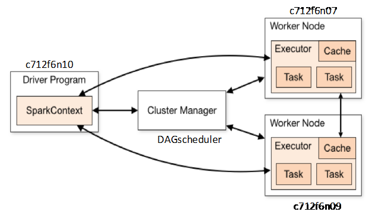

图 6、Conductor with spark 集群架构

运行环境是 Conductor with spark, Spark 版本是 1.6.1, 采用 Spark 缺省的 DAGScheduler 调度软件，运行 gatk-launch 的选项是 –sparkRunner SPARK –sparkMaster spark://c712f6n10:7077。

## 4\. 利用 Spark 技术进行基因序列分析处理

以 ReadsPipelineSpark 工作流为例，它是 GATK4 预定义的一个工作流，用 BAM 文件为输入，运行 MarkDuplicate 和 BQSR ，其输出文件将用于下一阶段分析。

重复是指一组基因片段有相同的、未修饰的起始和结束，MarkDuplicate 就是要挑选出”最佳的”复制，从而减缓错误效应。

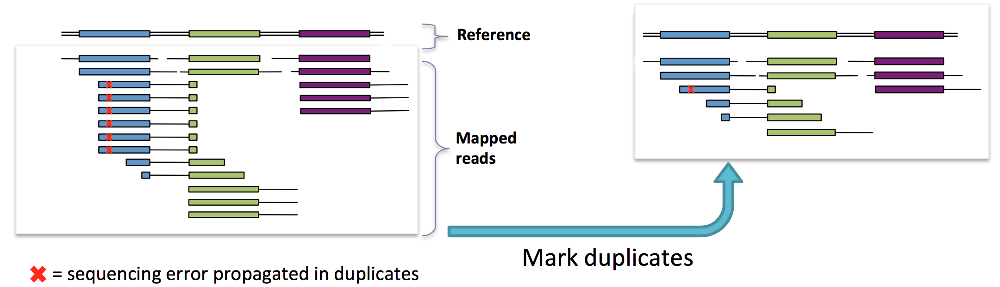

- BQSR 对一个已经排序过的 BAM 文件的合成测序数据基础质量数值进行重新调整，重新调整后，在 BAM 输出中每个片段在 QUAL 域中更精确，其报告的质量数值更接近于参考基因的实际可能性。

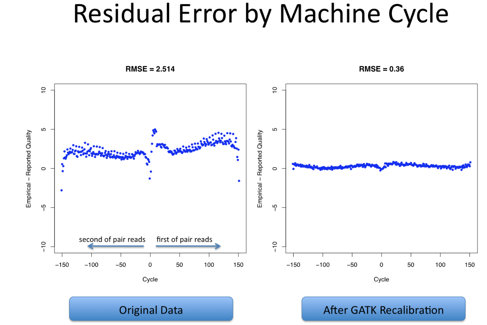

运行命令：

##### 清单 1.

```
    ./gatk/gatk-launch \
    ReadsPipelineSpark \                                             # Pipeline name
    -I $bam \                                                                  # Input file
    -R $ref \                                                                   # Reference file
    -O $bamout \                                                          # Output file
    –bamPartitionSize 134217728 \                        # maximum number of bytes to read from a file into each partition of reads.
    –knownSites $dbsnp \                                          # knownSites (see notes)
    –shardedOutput true \                                         # Write output to multiple pieces
    –duplicates_scoring_strategy                             # MarkDuplicatesScoringStrategy
    SUM_OF_BASE_QUALITIES \
    –sparkRunner SPARK \                                          # Run mode
    –sparkMaster spark://c712f6n10:7077           # Spark cluster
             --conf spark.driver.memory=5g --conf spark.executor.memory=16g

```

Show moreShow more icon

输入文件：

```
    -I CEUTrio.HiSeq.WEx.b37.NA12892.bam
    -R human_g1k_v37.2bit
    -knownSites dbsnp_138.b37.excluding_sites_after_129.vcf

```

Show moreShow more icon

利用不同的资源管理器，还可以定义–num-executors, –executor-mem, –executor-cores，从而根据计算资源的大小合理分配和调度资源。

## 5\. 性能和加速比分析

本文档以 CountReadsSpark 为例，对比分析在不同模式下的运行结果。

- 单机、非 Spark 模式下运行 CountReads:

##### 清单 2.

```
#./gatk-launch CountReads -I /home/dlspark/SRR034975.Sort_all.bam

Running:
    /home/dlspark/gatk/build/install/gatk/bin/gatk CountReads -I /home/dlspark/SRR034975.Sort_all.bam
[May 31, 2016 9:52:01 PM EDT] org.broadinstitute.hellbender.tools.CountReads  --input /home/dlspark/SRR034975.Sort_all.bam  --disable_all_read_filters false --interval_set_rule UNION --interval_padding 0 --readValidationStringency SILENT --secondsBetweenProgressUpdates 10.0 --disableSequenceDictionaryValidation false --createOutputBamIndex true --createOutputBamMD5 false --addOutputSAMProgramRecord true --help false --version false --verbosity INFO --QUIET false

Output:  34929382
Elapsed time:  12.14 minutes

```

Show moreShow more icon

- 在 Spark Standalone 模式下运行 CountReadsSpark

##### 清单 3.

```
# ./gatk-launch CountReadsSpark -I /home/dlspark/SRR034975.Sort_all.bam
Running:
    /home/dlspark/gatk/build/install/gatk/bin/gatk CountReadsSpark -I /home/dlspark/SRR034975.Sort_all.bam
[June 1, 2016 1:11:34 AM EDT] org.broadinstitute.hellbender.tools.spark.pipelines.CountReadsSpark  --input /home/dlspark/SRR034975.Sort_all.bam  --readValidationStringency SILENT --interval_set_rule UNION --interval_padding 0 --bamPartitionSize 0 --disableSequenceDictionaryValidation false --shardedOutput false --numReducers 0 --sparkMaster local[*] --help false --version false --verbosity INFO --QUIET false

Output:  34929382
Elapsed time:  9.50 minutes

```

Show moreShow more icon

- 在 Spark Cluster 模式下运行 CountReadsSpark

##### 清单 4.

```
# ./gatk-launch CountReadsSpark -I /gpfs1/yrx/SRR034975.Sort_all.bam -O /gpfs1/yrx/gatk4-test.output --sparkRunner SPARK --sparkMaster spark://c712f6n10:7077
Running:
    spark-submit --master spark://c712f6n10:7077 --conf spark.kryoserializer.buffer.max=512m --conf spark.driver.maxResultSize=0 --conf spark.driver.userClassPathFirst=true --conf spark.io.compression.codec=lzf --conf spark.yarn.executor.memoryOverhead=600 --conf spark.yarn.dist.files=/home/dlspark/gatk/build/libIntelDeflater.so --conf spark.driver.extraJavaOptions=-Dsamjdk.intel_deflater_so_path=libIntelDeflater.so -Dsamjdk.compression_level=1 -DGATK_STACKTRACE_ON_USER_EXCEPTION=true  --conf spark.executor.extraJavaOptions=-Dsamjdk.intel_deflater_so_path=libIntelDeflater.so -Dsamjdk.compression_level=1 -DGATK_STACKTRACE_ON_USER_EXCEPTION=true

Output:  34929382
Elapsed time:  0.60 minutes

```

Show moreShow more icon

图 7 是三种不同运算模式结果的比较，从运行时间看，在 Spark Cluster 模式下，CountReadsSpark 的运行效率比 Spark Standalone 模式提高了 15 倍。

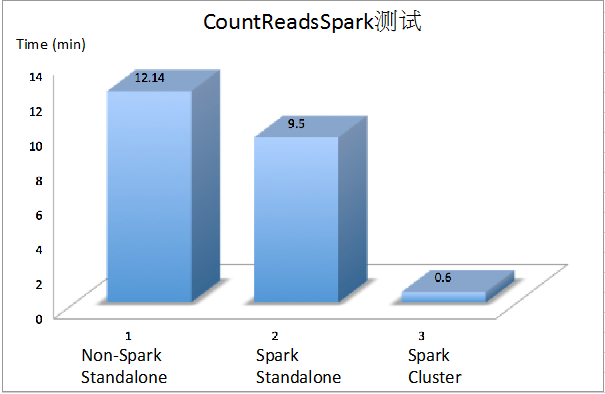

图 7、3 种运算模式结果比较

## 结束语

通过以上的分析，基于 Spark 技术的生命科学解决方案，能够使原来串行的应用在不修改代码或修改少量代码的情况下就可以实现并行化、内存内计算，或使用几条 Java 代码即可在集群上处理大量的数据，不需要复杂的 MPI 或 OpenMP 编程，使科学家将精力更多集中于新方法的研究和新的发现。随着基于 Spark 的生命科学解决方案的不断成熟和完善，越来越多的工具和工作流可以运行在 Spark 计算平台，它具有容错功能，扩展性也不断提高，并行化的生命科学应用将会使序列分析时间从目前的十几个小时缩短到 1 个小时之内，同时利用分布式作业调度和低成本集群，也会极大地降低分析成本。

## 参考资源：

- 参考 IBM IDEG Runbook, 了解基因测序流程和方法
- 参考 GATK Best Practice, 了解 GATK4 在 spark 环境中的使用方法和最佳实践
- 参考 Apache Spark 官方文档，了解 Spark 计算技术