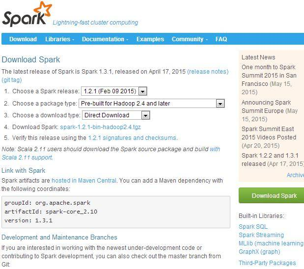
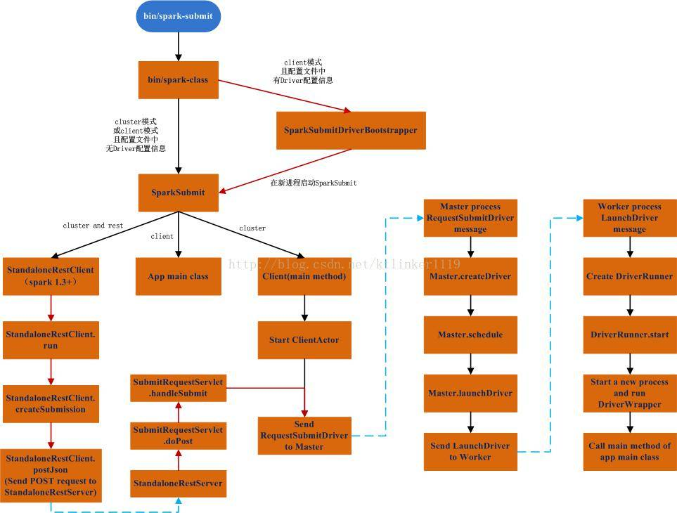

# Spark 部署及示例代码讲解
从实际入手的角度来了解 Spark

**标签:** Java,分析

[原文链接](https://developer.ibm.com/zh/articles/os-cn-spark-deploy1/)

周明耀

发布: 2015-06-11

* * *

## Spark 部署

考虑到读者可能使用 “ssh secure shell” 这样的工具登录 Linux，所以解释一下如何设置工具支持中文。

### 如何设置 ssh secure shell 支持中文

只需要设置下/etc/sysconfig/i18n 文件内容如清单 1 所示。

##### 清单 1\. 文件内容

```
LANG="zh_CN.GB18030"
SUPPORTED="zh_CN.GB18030:zh_CN:zh:en_US.UTF-8:en_US:en"
SYSFONT="latarcyrheb-sun16"

```

Show moreShow more icon

保存之后,SSH 重新登录或运行命令 source ./i18n 就可以显示中文。

如果想要支持用户登录后自动支持中文，可以把 source /etc/sysconfig/i18n 这一行代码加入到/etc/profile 这个文件内，这样可以确保 root 账户登录时自动加载中文设置。

注意：本文所涉及的 Linux 操作系统是 CentosV6.5 版本，JDK 为 JDK7 版本，Spark 版本为 v1.2.1。

### Spark 下载及安装

去 Apache Spark 官网下载 Spark 源代码、编译好的安装文件，Apache 官方的下载地址为 `http://spark.apache.org/downloads.html`。

##### 图 1\. 下载网站截图



如图 1 所示，选择的是 v1.2.1 的源代码，由于是针对 Hadoop2.4 编译的安装文件，所以还需要下载 Hadoop2.4 的安装包。除此之外，Spark 依赖于 Java 和 Python，需要确保 Linux 服务器上安装了这两个软件的开发包。清单 2 所示代码可以查看两个软件的版本。

##### 清单 2\. 查看版本

```
[root@localhost:3 spark]# java -version
\java version "1.7.0_65"
OpenJDK Runtime Environment (rhel-2.5.1.2.el6_5-x86_64 u65-b17)
OpenJDK 64-Bit Server VM (build 24.65-b04, mixed mode)
[root@localhost:3 spark]# python -v
# installing zipimport hook
import zipimport # builtin
# installed zipimport hook
# /usr/lib64/python2.6/site.pyc matches /usr/lib64/python2.6/site.py
import site # precompiled from /usr/lib64/python2.6/site.pyc
# /usr/lib64/python2.6/os.pyc matches /usr/lib64/python2.6/os.py
import os # precompiled from /usr/lib64/python2.6/os.pyc
import errno # builtin
import posix # builtin

```

Show moreShow more icon

清单 2 所示，Java 版本是 1.7.0\_65，Python 的版本是 2.6，自动进入到 Python 命令模式，可以通过按 Ctrl+D 退出刚才进入的 Python 命令模式。

Spark 文件下载完毕后，通过清单 3 所示命令解压缩文件。

##### 清单 3\. 解压缩文件

```
gunzip spark-1.2.1-bin-hadoop2.4.tgz
tar xvf spark-1.2.1-bin-hadoop2.4.tar

```

Show moreShow more icon

这样基本上就可以算部署完毕了，对，就这么简单。

## Spark 运行模式

Spark 的运行模式多种多样、灵活多变，部署在单机上时，既可以用本地模式运行，也可以用伪分布式模式运行，而当以分布式集群的方式部署时，也有众多的运行模式可以供选择，这取决于集群的实际情况，底层的资源调度既可以依赖于外部的资源调度框架，也可以使用 Spark 内建的 Standalone 模式。对于外部资源调度框架的支持，目前的实现包括相对稳定的 Mesos 模式，以及还在持续开发更新中的 Hadoop YARN 模式。

在实际应用中，Spark 应用程序的运行模式取决于传递给 SparkContext 的 MASTER 环境变量的值，个别模式还需要依赖辅助的程序接口来配合使用，目前所支持的 MASTER 环境变量由特定的字符串或 URL 所组成。例如：

Local[N]：本地模式，使用 N 个线程。

Local Cluster[Worker,core,Memory]：伪分布式模式，可以配置所需要启动的虚拟工作节点的数量，以及每个工作节点所管理的 CPU 数量和内存尺寸。

Spark://hostname:port:Standalone 模式，需要部署 Spark 到相关节点，URL 为 Spark Master 主机地址和端口。

Mesos://hostname:port:Mesos 模式，需要部署 Spark 和 Mesos 到相关节点，URL 为 Mesos 主机地址和端口。

YARN standalone/Yarn cluster:YARN 模式一，主程序逻辑和任务都运行在 YARN 集群中。

YARN client:YARN 模式二，主程序逻辑运行在本地，具体任务运行在 YARN 集群中。

## 运行 Spark 示例

本文所有的例子都是在单机环境下运行的，选择的都是本地模式。随 Spark 安装包下载的示例代码都在 examples/src/main 目录下面，可以通过运行 bin/run-example[params] 命令方式运行示例程序。例如，运行 SparkPI 的程序，该程序会计算出一个 PI 值，并打印结果在控制台上。

我们这里把输出日志重定向到当前目录下的 Sparkpilong.txt 日志文件。

##### 清单 4\. 运行代码

```
[root@localhost:3 spark-1.2.1-bin-hadoop2.4]# ./bin/run-example SparkPi 10 > Sparkpilog.txt

```

Show moreShow more icon

输出的日志分为两部分，一部分是通用日志信息，它由后面会介绍的一系列脚本及程序产生，另一部分是运行程序的输出结果，此处是计算 PI 的输出结果。清单 5 所示是通用日志信息，清单 6 所示是 SparkPI 程序的运算结果。

##### 清单 5\. 通用日至信息

```
Spark assembly has been built with Hive, including Datanucleus jars on classpath
Using Spark's default log4j profile: org/apache/spark/log4j-defaults.properties
15/05/19 09:58:38 WARN Utils: Your hostname, localhost.localdomain resolves
to a loopback address: 127.0.0.1; using 10.10.19.186 instead (on interface eth0)
15/05/19 09:58:38 WARN Utils: Set SPARK_LOCAL_IP if you need to bind to another address
15/05/19 09:58:38 INFO SecurityManager: Changing view acls to: root
15/05/19 09:58:38 INFO SecurityManager: Changing modify acls to: root
15/05/19 09:58:38 INFO SecurityManager: SecurityManager: authentication disabled;
ui acls disabled; users with view permissions: Set(root); users with modify permissions: Set(root)

15/05/19 09:58:43 INFO DAGScheduler: Stopping DAGScheduler
15/05/19 09:58:44 INFO MapOutputTrackerMasterActor: MapOutputTrackerActor stopped!
15/05/19 09:58:44 INFO MemoryStore: MemoryStore cleared
15/05/19 09:58:44 INFO BlockManager: BlockManager stopped
15/05/19 09:58:44 INFO BlockManagerMaster: BlockManagerMaster stopped
15/05/19 09:58:44 INFO SparkContext: Successfully stopped SparkContext
15/05/19 09:58:44 INFO RemoteActorRefProvider$RemotingTerminator: Shutting down remote daemon.
15/05/19 09:58:44 INFO RemoteActorRefProvider$RemotingTerminator:
Remote daemon shut down; proceeding with flushing remote transports.
15/05/19 09:58:44 INFO RemoteActorRefProvider$RemotingTerminator: Remoting shut down.

```

Show moreShow more icon

##### 清单 6\. 计算结果

```
Pi is roughly 3.142888

```

Show moreShow more icon

上面针对输入参数 10 的 PI 计算结果为 3.142888。

清单 7 所示代码是 Spark 安装包里自带的 SparkPI 类的源代码。

##### 清单 7\. SparkPI 程序源代码

```
public final class JavaSparkPi {

public static void main(String[] args) throws Exception {
SparkConf sparkConf = new SparkConf().setAppName("JavaSparkPi");
JavaSparkContext jsc = new JavaSparkContext(sparkConf);

int slices = (args.length == 1) ? Integer.parseInt(args[0]) : 2;
int n = 100000 * slices;
List<Integer> l = new ArrayList<Integer>(n);
for (int i = 0; i < n; i++) {
l.add(i);
}

JavaRDD<Integer> dataSet = jsc.parallelize(l, slices);

int count = dataSet.map(new Function<Integer, Integer>() {
@Override
public Integer call(Integer integer) {
double x = Math.random() * 2 - 1;
double y = Math.random() * 2 - 1;
return (x * x + y * y < 1) ? 1 : 0;
}
}).reduce(new Function2<Integer, Integer, Integer>() {
@Override
public Integer call(Integer integer, Integer integer2) {
return integer + integer2;
}
});

System.out.println("Pi is roughly " + 4.0 * count / n);

jsc.stop();
}
}

```

Show moreShow more icon

一个 Spark 的任务对应一个 RDD，RDD 是弹性分布式数据集，即一个 RDD 代表一个被分区的只读数据集。一个 RDD 的生成只有两种途径，一是来自于内存集合和外部存储系统，另一种是通过转换操作来自于其他 RDD，比如 map、filter、join，等等。清单 7 所示程序定义了一个名为 dataSet 的 RDD。

清单 5 输出的大量信息都是计算机信息、Spark 信息，这些信息都是通过内部调用的若干脚本输出的，我们来看看具体运行示例代码的脚本。我们首先运行脚本 run-example，它的核心代码如清单 8-10 所示。

##### 清单 8\. run-example 脚本源代码

```
FWDIR="$(cd "`dirname "$0"`"/..; pwd)"
export SPARK_HOME="$FWDIR"
EXAMPLES_DIR="$FWDIR"/examples

```

Show moreShow more icon

清单 8 所示代码设置了示例代码目录，这里是当前目录下的 examples 文件夹。接下来指定第一个参数是运行的类名称，如清单 9 所示。

##### 清单 9\. run-example 脚本源代码

```
if [ -n "$1" ]; then
EXAMPLE_CLASS="$1"
Shift

```

Show moreShow more icon

脚本调用 spark-submit 脚本进入下一执行层级。

##### 清单 10\. run-example 脚本源代码

```
"$FWDIR"/bin/spark-submit \
 --master $EXAMPLE_MASTER \
 --class $EXAMPLE_CLASS \
"$SPARK_EXAMPLES_JAR" \
"$@"

```

Show moreShow more icon

接下来我们来看看 spark-submit 脚本里面的内容。

##### 清单 11\. spark-submit 脚本源代码

```
while (($#)); do
if [ "$1" = "--deploy-mode" ]; then
SPARK_SUBMIT_DEPLOY_MODE=$2
elif [ "$1" = "--properties-file" ]; then
SPARK_SUBMIT_PROPERTIES_FILE=$2
elif [ "$1" = "--driver-memory" ]; then
export SPARK_SUBMIT_DRIVER_MEMORY=$2
elif [ "$1" = "--driver-library-path" ]; then
export SPARK_SUBMIT_LIBRARY_PATH=$2
elif [ "$1" = "--driver-class-path" ]; then
export SPARK_SUBMIT_CLASSPATH=$2
elif [ "$1" = "--driver-java-options" ]; then
export SPARK_SUBMIT_OPTS=$2
elif [ "$1" = "--master" ]; then
export MASTER=$2
fi
shift
done

```

Show moreShow more icon

上面代码通过用户从 run-example 脚本里传入的参数，此处为 master，来确定运行模式，然后调用 spark-class 脚本，如清单 12 所示。

##### 清单 12\. spark-class 脚本源代码

```
exec "$SPARK_HOME"/bin/spark-class org.apache.spark.deploy.SparkSubmit "${ORIG_ARGS[@]}"

```

Show moreShow more icon

清单 12 所示代码调用了 Spark-Class 运行程序 SparkSubmit。

具体介绍 Spark-Class 程序代码之前，我们来尝试运行 WordCount 实验，假设已经创建了一个名为 wordcountdata.txt 的文本文件，该文件被放置在目录 (/home/zhoumingyao/spark/spark-1.2.1-bin-hadoop2.4/spark-1.2.1-bin-hadoop2.4)，接着如清单 13 所示，开始运行程序。

##### 清单 13\. 运行 WordCount 程序

```
root@localhost:3 spark-1.2.1-bin-hadoop2.4]# ./bin/run-example JavaWordCount ./wordcountdata.txt

```

Show moreShow more icon

输出如清单 14 所示，这里忽略了与清单 5 相同输出的内容，以及大部分清单 13 的计算结果，只列出少量结果。统计字符出现次数的详细信息如清单 14 所示。

##### 清单 14\. 输出结果

```
For: 4
SQLMLlib: 1
subfolder: 1
OS).: 1
Streaming,: 1
APIs: 1
full: 1
--master: 3
through: 1
Provisioning3rd-Party: 1
applications: 4
graph: 3
over: 1

```

Show moreShow more icon

## 解释示例运行过程

##### 图 2\. Spark 示例代码运行过程描述图



图 2 所示是整个程序执行的路线图，具体我们下面一点点解释。

通过上面的介绍，我们可以大致看到，示例代码的运行顺序是依次从左向右的，

Run-example.sh->load-spark-env.sh->lib 目录下的 jar 包文件->spark-submit.sh->spark-class

清单 15 所示是 lib 目录下的文件。

##### 清单 15\. 文件内容

```
[root@localhost:3 bin]# ls -lrt ../lib
总用量 236232
-rw-rw-r--. 1 1000 1000 87065934 2 月 3 11:45 spark-examples-1.2.1-hadoop2.4.0.jar
-rw-rw-r--. 1 1000 1000 148865850 2 月 3 11:45 spark-assembly-1.2.1-hadoop2.4.0.jar
-rw-rw-r--. 1 1000 1000 1916671 2 月 3 11:45 spark-1.2.1-yarn-shuffle.jar
-rw-rw-r--. 1 1000 1000 1809447 2 月 3 11:45 datanucleus-rdbms-3.2.9.jar
-rw-rw-r--. 1 1000 1000 1890075 2 月 3 11:45 datanucleus-core-3.2.10.jar
-rw-rw-r--. 1 1000 1000 339666 2 月 3 11:45 datanucleus-api-jdo-3.2.6.jar

```

Show moreShow more icon

spark-examples 脚本里面有清单 16 所示代码，主要是用于加载类。

##### 清单 16\. spark-examples 代码 1

```
for f in ${JAR_PATH}/spark-examples-*hadoop*.jar; do
if [[ ! -e "$f" ]]; then
echo "Failed to find Spark examples assembly in $FWDIR/lib or $FWDIR/examples/target" 1>&2
echo "You need to build Spark before running this program" 1>&2
exit 1
fi
SPARK_EXAMPLES_JAR="$f"
JAR_COUNT=$((JAR_COUNT+1))
done

```

Show moreShow more icon

清单 17 所示代码做了一层保护，如果发现超过 1 个以上的 spark-example 包文件，抛出错误。

##### 清单 17\. spark-examples 代码 2

```
if [ "$JAR_COUNT" -gt "1" ]; then
echo "Found multiple Spark examples assembly jars in ${JAR_PATH}" 1>&2
ls ${JAR_PATH}/spark-examples-*hadoop*.jar 1>&2
echo "Please remove all but one jar." 1>&2
exit 1
fi

```

Show moreShow more icon

清单 11 和清单 12 已经介绍过，最终程序由 spark-class 执行。Client 模式会运行 Spark 驱动在同一个 JVM 里面，然后调用 spark-class 运行程序。清单 12 运行的输出如清单 18 所示。

##### 清单 18\. 运行输出

```
master local[*] --class org.apache.spark.examples.SparkPi
/home/zhoumingyao/spark/spark-1.2.1-bin-hadoop2.4/spark-1.2.1-bin-hadoop2.4/
lib/spark-examples-1.2.1-hadoop2.4.0.jar 10

```

Show moreShow more icon

spark-class 脚本首先确定运行模式，如清单 19 所示。

##### 清单 19\. 目录列表

```
case "$1" in
# Master, Worker, and HistoryServer use SPARK_DAEMON_JAVA_OPTS (and specific opts) +
        SPARK_DAEMON_MEMORY. 'org.apache.spark.deploy.master.Master')
OUR_JAVA_OPTS="$SPARK_DAEMON_JAVA_OPTS $SPARK_MASTER_OPTS"
OUR_JAVA_MEM=${SPARK_DAEMON_MEMORY:-$DEFAULT_MEM}
;;

```

Show moreShow more icon

对于 JDK8 有特殊的设置，JDK8 开始不再支持 MaxPermSize 等参数设置 JVM。

##### 清单 20\. JDK8

```
# Set JAVA_OPTS to be able to load native libraries and to set heap size
if [ "$JAVA_VERSION" -ge 18 ]; then
JAVA_OPTS="$OUR_JAVA_OPTS"
else
JAVA_OPTS="-XX:MaxPermSize=128m $OUR_JAVA_OPTS"
fi
JAVA_OPTS="$JAVA_OPTS -Xms$OUR_JAVA_MEM -Xmx$OUR_JAVA_MEM"

```

Show moreShow more icon

绕了一大圈，最终的启动程序如清单 21 所示。

##### 清单 21\. 启动程序

```
if [ -n "$SPARK_SUBMIT_BOOTSTRAP_DRIVER" ]; then
# This is used only if the properties file actually contains these special configs
# Export the environment variables needed by SparkSubmitDriverBootstrapper
export RUNNER
export CLASSPATH
export JAVA_OPTS
export OUR_JAVA_MEM
export SPARK_CLASS=1
shift # Ignore main class (org.apache.spark.deploy.SparkSubmit) and use our own
exec "$RUNNER" org.apache.spark.deploy.SparkSubmitDriverBootstrapper "$@"
else
# Note: The format of this command is closely echoed in SparkSubmitDriverBootstrapper.scala
if [ -n "$SPARK_PRINT_LAUNCH_COMMAND" ]; then
echo -n "Spark Command: " 1>&2
echo "$RUNNER" -cp "$CLASSPATH" $JAVA_OPTS "$@" 1>&2
echo -e "========================================\n" 1>&2
fi
exec "$RUNNER" -cp "$CLASSPATH" $JAVA_OPTS "$@"
fi

```

Show moreShow more icon

最终执行示例的容器是由 org.apache.spark.deploy.SparkSubmitDriverBootstrapper 类产生的，参数为清单 22 所示。

##### 清单 22\. 设置运行参数

```
org.apache.spark.deploy.SparkSubmit --master local[*] --class
org.apache.spark.examples.SparkPi /home/zhoumingyao/spark/spark-1.2.1-bin-hadoop2.4/
                  spark-1.2.1-bin-hadoop2.4/lib/spark-examples-1.2.1-hadoop2.4.0.jar 10

```

Show moreShow more icon

##### 清单 23\. SparkSubmitDriverBootstrapper 代码

```
private[spark] object SparkSubmitDriverBootstrapper {
// Start the driver JVM
val filteredCommand = command.filter(_.nonEmpty)
val builder = new ProcessBuilder(filteredCommand)
val env = builder.environment()

if (submitLibraryPath.isEmpty && confLibraryPath.nonEmpty) {
val libraryPaths = confLibraryPath ++ sys.env.get(
                                Utils.libraryPathEnvName)
env.put(Utils.libraryPathEnvName, libraryPaths.mkString(
                                sys.props("path.separator")))
}

val process = builder.start()

// If we kill an app while it's running, its sub-process should be killed too.
Runtime.getRuntime().addShutdownHook(new Thread() {
override def run() = {
if (process != null) {
process.destroy()
process.waitFor()
}
}
})

// Redirect stdout and stderr from the child JVM
val stdoutThread = new RedirectThread(process.getInputStream,
                     System.out, "redirect stdout")
val stderrThread = new RedirectThread(process.getErrorStream,
                      System.err, "redirect stderr")
stdoutThread.start()
stderrThread.start()

// Redirect stdin to child JVM only if we're not running Windows. This is because the
// subprocess there already reads directly from our stdin, so we should avoid spawning a
// thread that contends with the subprocess in reading from System.in.
val isWindows = Utils.isWindows
val isSubprocess = sys.env.contains("IS_SUBPROCESS")
if (!isWindows) {
val stdinThread = new RedirectThread(System.in, process.getOutputStream,
              "redirect stdin",propagateEof = true)
stdinThread.start()
// Spark submit (JVM) may run as a subprocess,and so this JVM should terminate on
// broken pipe, signaling that the parent process has exited.
//This is the case if the application is launched directly from python,
//as in the PySpark shell. In Windows,the termination logic is handled in java_gateway.py
if (isSubprocess) {
stdinThread.join()
process.destroy()
}
}
val returnCode = process.waitFor()
sys.exit(returnCode)
}

}

```

Show moreShow more icon

从上面的 Scala 代码里面可以看到，Scala 最终启动的是 JVM 线程，所以它可以访问 Java 的库文件，例如 java.io.File。通过 Main 函数的方式启动了一个 JVM 进程，随后针对该进程又托管了一系列线程级别的操作。

## WordCount 的 Java 和 Scala 实现

```
WordCount 的 Java 代码如清单 24 所示。

```

Show moreShow more icon

##### 清单 24\. WordCount 的 Java 实现代码

```
public final class JavaWordCount {
private static final Pattern SPACE = Pattern.compile(" ");

public static void main(String[] args) throws Exception {

if (args.length < 1) {
System.err.println("Usage: JavaWordCount <file>");
System.exit(1);
}
//对于所有的 Spark 程序而言，要进行任何操作，首先要创建一个 Spark 的上下文，
//在创建上下文的过程中，程序会向集群申请资源以及构建相应的运行环境。
SparkConf sparkConf = new SparkConf().setAppName("JavaWordCount");
JavaSparkContext ctx = new JavaSparkContext(sparkConf);
//利用 textFile 接口从文件系统中读入指定的文件，返回一个 RDD 实例对象。
//RDD 的初始创建都是由 SparkContext 来负责的，将内存中的集合或者外部文件系统作为输入源
JavaRDD<String> lines = ctx.textFile(args[0], 1);

JavaRDD<String> words = lines.flatMap(
                                new FlatMapFunction<String, String>() {
@Override
public Iterable<String> call(String s) {
return Arrays.asList(SPACE.split(s));
}
});

JavaPairRDD<String, Integer> ones = words.mapToPair(
               new PairFunction<String, String, Integer>() {
@Override
public Tuple2<String, Integer> call(String s) {
return new Tuple2<String, Integer>(s, 1);
}
});

JavaPairRDD<String, Integer> counts = ones.reduceByKey(
               new Function2<Integer, Integer, Integer>() {
@Override
public Integer call(Integer i1, Integer i2) {
return i1 + i2;
}
});

List<Tuple2<String, Integer>> output = counts.collect();
for (Tuple2<?,?> tuple : output) {
System.out.println(tuple._1() + ": " + tuple._2());
}
ctx.stop();
}
}

```

Show moreShow more icon

这里有必要介绍一下这里用到的几个函数。首先是 map 函数，它根据现有的数据集返回一个新的分布式数据集，由每个原元素经过 func 函数转换后组成，这个过程一般叫做转换（transformation）；flatMap 函数类似于 map 函数，但是每一个输入元素，会被映射为 0 到多个输出元素，因此，func 函数的返回值是一个 Seq，而不是单一元素，可以从上面的代码中看出；reduceByKey 函数在一个（K，V) 对的数据集上使用，返回一个（K，V）对的数据集，key 相同的值，都被使用指定的 reduce 函数聚合到一起。 对应的 Scala 版本代码如清单 25 所示。

##### 清单 25\. WordCount 的 Scala 实现代码

```
import org.apache.spark.SparkConf
import org.apache.spark.SparkContext
import org.apache.spark.SparkContext._
//统计字符出现次数
object WordCount {
def main(args: Array[String]) {
if (args.length < 1) {
System.err.println("Usage: <file>")
System.exit(1)
}
val conf = new SparkConf()
val sc = new SparkContext(conf)
val line = sc.textFile(args(0))

line.flatMap(_.split(" ")).map((_, )).reduceByKey(_+_).
         collect().foreach(println)
sc.stop()
}
}

```

Show moreShow more icon

从清单 24 和 25 对比可以看出，Scala 语言及其简单、轻巧，相对于 Java 语言而言，非常适合于并行计算框架的编写，这也是为什么 Spark 框架是用函数式语言 Scala 写的，而不是 Java 这样的面向对象语言。

运行模式总体上来说，都基于一个相似的工作流程。根本上都是将 Spark 的应用分为任务调度和任务执行两个部分。无论本地模式 or 分布式模式，其内部程序逻辑结构都是类似的，只是其中部分模块有所简化，例如本地模式中，集群管理模块被简化为进程内部的线程池。

所有的 Spark 应用程序都离不开 SparkContext 和 Executor 两部分，Executor 负责执行任务，运行 Executor 的机器称为 Worker 节点，SparkContext 由用户程序启动，通过资源调度模块和 Executor 通信。SparkContext 和 Executor 这两部分的核心代码实现在各种运行模式中都是公用的，在它们之上，根据运行部署模式的不同，包装了不同调度模块以及相关的适配代码。具体来说，以 SparkContext 为程序运行的总入口，在 SparkContext 的初始化过程中，Spark 会分别创建 DAGScheduler 作业调度和 TaskScheduler 任务调度两极调度模块。其中，作业调度模块是基于任务阶段的高层调度模块，它为每个 Spark 作业计算具有依赖关系的多个调度阶段 (通常根据 Shuffle 来划分)，然后为每个阶段构建出一组具体的任务 (通常会考虑数据的本地性等)，然后以 TaskSets(任务组) 的形式提交给任务调度模块来具体执行。而任务调度模块则负责具体启动任务、监控和汇报任务运行情况。

本文是部署及示例代码解释的上篇，在系统文章的中篇会对 Scala 语言进行解释，用 Java 和 Scala 实现相同功能的方式让读者快速掌握 Scala 语言。

## 结束语

通过本文的学习，读者了解了如何下载、部署 Spark、运行示例代码。此外，深入介绍了运行代码的过程、脚本内容，通过这些介绍力求让读者可以快速地上手 Spark。目前市面上发布的 Spark 中文书籍对于初学者来说大多较为难读懂，作者力求推出一系列 Spark 文章，让读者能够从实际入手的角度来了解 Spark。后续除了应用之外的文章，还会致力于基于 Spark 的系统架构、源代码解释等方面的文章发布。