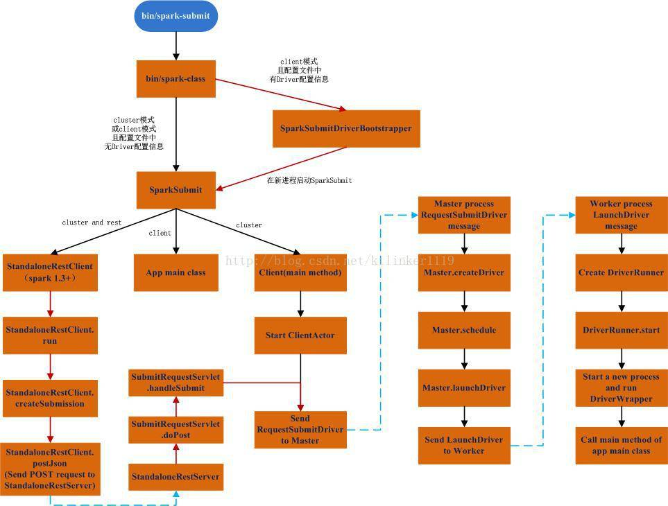

# Spark 附带示例完整解释
从运行、输出结果、源代码解释、涉及知识面拓展解释等多方位开始讲解

**标签:** Linux

[原文链接](https://developer.ibm.com/zh/articles/os-cn-spark-code-samples/)

周明耀

发布: 2015-07-27

* * *

## 前文回顾

从上一篇本文作者的文章《Spark 部署及示例代码讲解》已经可以知道示例代码的执行顺序是依次从左向右的，Run-example.sh->load-spark-env.sh->lib 目录下的 jar 包文件->spark-submit.sh->spark-class，图 1 给出了整体脚本调用顺序。

##### 图 1\. Spark 示例代码运行过程描述图



## SCP 命令

由于涉及到 Linux 操作系统，可能读者需要在多台机器间进行数据拷贝，所以列举了 SCP 命令的使用方式。Linux 的 SCP 命令可以被用于在 Linux 之间复制文件和目录。

从本地复制到远程

复制文件：

命令格式：

`scp local_file remote_username@remote_ip:remote_folder`

或者

`scp local_file remote_username@remote_ip:remote_file`

或者

`scp local_file remote_ip:remote_folder`

或者

`scp local_file remote_ip:remote_file`

复制目录：

命令格式：

`scp -r local_folder remote_username@remote_ip:remote_folder`

或者

`scp -r local_folder remote_ip:remote_folder`

从远程复制到本地

从远程复制到本地，只要从本地复制到远程的命令的后 2 个参数调换顺序。

例如：

`scp root@www.cumt.edu.cn:/home/root/others/music /home/space/music/1.mp3`

`scp -r www.cumt.edu.cn:/home/root/others/ /home/space/music/`

## 分析日志文件例子

我们可以通过命令./bin/run-example JavaLogQuery 来运行程序，如果不清楚具体如何运行 Spark 内置示例程序，请参考《Spark 部署及示例代码讲解》。运行结果如清单 1 所示。

##### 清单 1\. 日志分析程序运行输出

```
(10.10.10.10,"FRED",GET http://images.com/2013/Generic.jpg HTTP/1.1) bytes=621 n=2

```

Show moreShow more icon

日志分析程序的完整源代码如清单 2 所示。

##### 清单 2\. 日志分析示例代码

```
public static final List<String> exampleApacheLogs = Lists.newArrayList(
"10.10.10.10 - \"FRED\" [18/Jan/2013:17:56:07 +1100] \"GET http://images.com/2013/Generic.jpg " +
"HTTP/1.1\" 304 315 \"http://referall.com/\" \"Mozilla/4.0 (compatible; MSIE 7.0; " +
"Windows NT 5.1; GTB7.4; .NET CLR 2.0.50727; .NET CLR 3.0.04506.30; .NET CLR 3.0.04506.648; " +
".NET CLR 3.5.21022; .NET CLR 3.0.4506.2152; .NET CLR 1.0.3705; .NET CLR 1.1.4322; .NET CLR " +
"3.5.30729; Release=ARP)\" \"UD-1\" - \"image/jpeg\" \"whatever\" 0.350 \"-
              \" - \"\" 265 923 934 \"\" " +
"62.24.11.25 images.com 1358492167 - Whatup",
"10.10.10.10 - \"FRED\" [18/Jan/2013:18:02:37 +1100] \"GET http://images.com/2013/Generic.jpg " +
"HTTP/1.1\" 304 306 \"http:/referall.com\" \"Mozilla/4.0 (compatible; MSIE 7.0; Windows NT 5.1; " +
"GTB7.4; .NET CLR 2.0.50727; .NET CLR 3.0.04506.30; .NET CLR 3.0.04506.648; .NET CLR " +
"3.5.21022; .NET CLR 3.0.4506.2152; .NET CLR 1.0.3705; .NET CLR 1.1.4322; .NET CLR " +
"3.5.30729; Release=ARP)\" \"UD-1\" - \"image/jpeg\" \"whatever\" 0.352 \"-
            \" - \"\" 256 977 988 \"\" " +
"0 73.23.2.15 images.com 1358492557 - Whatup");

public static final Pattern apacheLogRegex = Pattern.compile(
"^([\\d.]+) (\\S+) (\\S+) \\[([\\w\\d:/]+\\s[+\\-]\\d{4})\\] \
                      "(.+?)\" (\\d{3}) ([\\d\\-]+) \"([^\"]+)\" \"([^\"]+)\".*");

/** Tracks the total query count and number of aggregate bytes for a particular group. */
public static class Stats implements Serializable {

private final int count;
private final int numBytes;

public Stats(int count, int numBytes) {
this.count = count;
this.numBytes = numBytes;
}
public Stats merge(Stats other) {
return new Stats(count + other.count, numBytes + other.numBytes);
}

public String toString() {
return String.format("bytes=%s\tn=%s", numBytes, count);
}
}

public static Tuple3<String, String, String> extractKey(String line) {
Matcher m = apacheLogRegex.matcher(line);
if (m.find()) {
String ip = m.group(1);
String user = m.group(3);
String query = m.group(5);
if (!user.equalsIgnoreCase("-")) {
return new Tuple3<String, String, String>(ip, user, query);
}
}
return new Tuple3<String, String, String>(null, null, null);
}

public static Stats extractStats(String line) {
Matcher m = apacheLogRegex.matcher(line);
if (m.find()) {
int bytes = Integer.parseInt(m.group(7));
return new Stats(1, bytes);
} else {
return new Stats(1, 0);
}
}

public static void main(String[] args) {

SparkConf sparkConf = new SparkConf().setAppName("JavaLogQuery");
JavaSparkContext jsc = new JavaSparkContext(sparkConf);

JavaRDD<String> dataSet = (args.length == 1) ? jsc.
                              textFile(args[0]) : jsc.parallelize(exampleApacheLogs);

JavaPairRDD<Tuple3<String, String, String>, Stats> extracted =
                dataSet.mapToPair(new PairFunction<String,
                                  Tuple3<String, String, String>, Stats>() {
@Override
public Tuple2<Tuple3<String, String, String>, Stats> call(String s) {
return new Tuple2<Tuple3<String, String, String>,
                                Stats>(extractKey(s), extractStats(s));
}
});

JavaPairRDD<Tuple3<String, String, String>, Stats> counts =
              extracted.reduceByKey(new Function2<Stats, Stats, Stats>() {
@Override
public Stats call(Stats stats, Stats stats2) {
return stats.merge(stats2);
}
});

List<Tuple2<Tuple3<String, String, String>, Stats>> output = counts.collect();
for (Tuple2<?,?> t : output) {
System.out.println(t._1() + "\t" + t._2());
}
jsc.stop();
}

```

Show moreShow more icon

下面开始对清单 2 所述程序逐一进行解释，日志文件字符串类型的集合对象申明代码如清单 3 所示。

##### 清单 3\. 集合对象申明

```
public static final List<String> exampleApacheLogs = Lists.newArrayList(
"10.10.10.10 - \"FRED\" [18/Jan/2013:17:56:07 +1100] \"GET http://images.com/2013/Generic.jpg " +
"HTTP/1.1\" 304 315 \"http://referall.com/\" \"Mozilla/4.0 (compatible; MSIE 7.0; " +
"Windows NT 5.1; GTB7.4; .NET CLR 2.0.50727; .NET CLR 3.0.04506.30; .NET CLR 3.0.04506.648; " +
".NET CLR 3.5.21022; .NET CLR 3.0.4506.2152; .NET CLR 1.0.3705; .NET CLR 1.1.4322; .NET CLR " +
"3.5.30729; Release=ARP)\" \"UD-1\" - \"image/jpeg\" \"whatever\" 0.350 \"-
                                    \" - \"\" 265 923 934 \"\" " +
"62.24.11.25 images.com 1358492167 - Whatup",
"10.10.10.10 - \"FRED\" [18/Jan/2013:18:02:37 +1100] \"GET http://images.com/2013/Generic.jpg " +
"HTTP/1.1\" 304 306 \"http:/referall.com\" \"Mozilla/4.0 (compatible; MSIE 7.0; Windows NT 5.1; " +
"GTB7.4; .NET CLR 2.0.50727; .NET CLR 3.0.04506.30; .NET CLR 3.0.04506.648; .NET CLR " +
"3.5.21022; .NET CLR 3.0.4506.2152; .NET CLR 1.0.3705; .NET CLR 1.1.4322; .NET CLR " +
"3.5.30729; Release=ARP)\" \"UD-1\" -
                        \"image/jpeg\" \"whatever\" 0.352 \"-\" - \"\" 256 977 988 \"\" " +
"0 73.23.2.15 images.com 1358492557 - Whatup");

```

Show moreShow more icon

这里通过引入 Google 的 Guava 开源包，Guava 工程包含了若干被 Google 的 Java 项目广泛依赖的核心库，例如：集合 [collections]、缓存 [caching]、原生类型支持 [primitives support]、并发库 [concurrency libraries]、通用注解 [common annotations]、字符串处理 [string processing]、I/O 等等。这样的创建方式简化了 JDK 集合库 ArrayList 的创建过程，同时，Google 也提供了针对集合功能较好的性能，相关内容可以关注作者的 Guava 文章。

接下来程序里面定义了正则表达式对象，这个用途是为了后续过滤日志信息用的，具体代码如清单 4 所示。

##### 清单 4\. 正则表达式定义

```
public static final Pattern apacheLogRegex = Pattern.compile(
"^([\\d.]+) (\\S+) (\\S+) \\[([\\w\\d:/]+\\s[+\\-]\\d{4})\\] \"(.+?)\" (\\d{3})
                              ([\\d\\-]+) \"([^\"]+)\" \"([^\"]+)\".*");

```

Show moreShow more icon

接下来程序定义了两个变量 count 和 numBytes，它们被用来对符合正则表达式规则的日志信息进行计数和统计。接下来程序定义的 merge 方法被用来叠加统计信息，它会在 Spark RDD 内部被调用。

##### 清单 5\. merge 方法

```
public Stats merge(Stats other) {
return new Stats(count + other.count, numBytes + other.numBytes);
}

```

Show moreShow more icon

最终输出的是 bytes 和 count，如清单 6 所示，程序重写了 `toString()` 方法。

##### 清单 6\. toString 方法

```
public String toString() {
return String.format("bytes=%s\tn=%s", numBytes, count);
}

```

Show moreShow more icon

现在可以进入到负责运行程序的 Main 函数里面。Main 函数首先通过清单 7 所示代码设置了 Spark 应用程序名称为 “JavaLogQuery”。

##### 清单 7\. 设置 Spark 应用程序名称

```
SparkConf sparkConf = new SparkConf().setAppName("JavaLogQuery");

```

Show moreShow more icon

设置完毕后，Spark 程序需要做的第一件事就是创建一个 `JavaSparkContext` 对象，它将告诉 Spark 怎么样访问一个集群。创建一个 `SparkContext`，你首先必须创建 `SparkConf` 对象，它包含关于你的应用程序的信息。

##### 清单 8\. Spark 环境创建

```
SparkConf conf=new SparkConf().setAppName(appName).setMaster(master);
JavaSparkContext sc=new JavaSparkContext(conf);

```

Show moreShow more icon

AppName 参数是你的应用程序的名字，你可以在 Spark 内置 UI 上看到它。Master 是 Spark、Mesos、或者 YARN 集群的 URL，或者使用一个专用的字符串 “Local” 设定其在本地模式下运行。实际应用过程中，当运行在一个集群上时，我们不会把 Master 硬编码到程序中，而是通过使用 `spark-submit` 运行程序并且接受 Master，但是在本地测试或者单元测试时，你可以传递 “local” 在进程内运行 Spark。

关于 Spark 属性配置方式，Spark 提供了大部分应用程序的控制项，并且可以单独为每个应用程序进行配置。

Spark 提供了 3 种方式的属性配置：

- `SparkConf` 方式

`SparkConf` 方式可以直接将属性值传递到 `SparkContext`；

`SparkConf` 可以对某些通用属性直接配置，如 Master 使用 `setMaster`，AppName 使用 `setAppName`；

也可以使用 `set()` 方法对属性进行键-值对配置，如 `set("spark.executor.memory"，"2g")`。

- 命令行参数方式

这种方式是在使用 spark-submit 或 spark-shell 提交应用程序的时候，用命令行参数提交；

这种方式可以比较灵活的配置各个应用程序的运行环境；

可以通过 spark-submit –help 或 spark-shell –help 显示出属性的完整列表。

- 文件配置方式

该方式是将属性配置项以键值对方式写入文本文件中，一个配置项占一行；

该文件默认为 conf/spark-defaults.conf，spark-submit 在提交应用程序的时候会检查是否存在该文件，有的话就将相关的属性配置载入；

该文件可以在 spark-submit 的命令参数–properties-file 处定义不同的位置。

一般的推荐顺序是：SparkConf 方式 > 命令行参数方式 >文件配置方式。

SparkContext 是 Spark 的程序入口，相当于熟悉的”main”函数。它负责链接 Spark 集群、创建 RDD、创建累加计数器、创建广播变量。

##### 清单 9\. 设置 SparkContext

```
JavaSparkContext jsc = new JavaSparkContext(sparkConf);

```

Show moreShow more icon

清单 9 创建的 sarpkContext 唯一需要的参数就是 sparkConf，它是一组 K-V 属性对。

RDD 解释

Spark 反复围绕的一个概念是弹性分布式数据集。它是一个有容错机制的元素集合，并且可以被并行操作。有两种创建 RDDs 的方法。并行化你的驱动程序中已存在的集合，或者引用一个外部存储系统的数据集，例如一个共享文件系统，HDFS、HBase，或者任何可以提供一个 Hadoop InputFormat 的数据源。

总的来说，每一个 Spark 应用程序，都是由一个驱动程序组成，它运行用户的 Main 函数，并且在一个集群上执行各种各样的并行操作。Spark 提供的主要的抽象概念是一个弹性分布式数据集，它是一个元素集合，划分到集群的不同节点上，可以被并行操作。RDDs 的创建可以从 Hadoop 文件系统（或者任何支持 Hadoop 的文件系统）上的一个文件开始，或者通过转换这个驱动程序中已存在的 Scala 集合而来。用户也可以使 Spark 持久化一个 RDD 到内存中，使其能在并行操作中被有效的重用。最后，RDDs 能自动从节点故障中恢复。

Spark 中的第二个抽象概念是共享变量。它可以在并行操作中使用，默认情况下，Spark 通过不同节点上的一系列任务来并行运行一个函数，它将每一个函数中用的到变量的拷贝传递到每一个任务中。有时候，一个变量需要在不同的任务之间，或者任务和驱动程序之间共享。Spark 支持两种类型的共享变量，即广播变量和累加器。广播变量可以在所有节点的内存中缓存一个值，累加器支持一个只能做加法的变量，例如计数器和求和。

RDD：弹性分布式数据集，即一个 RDD 代表一个被分区的只读数据集。一个 RDD 的生成只有两种途径，一是来自于内存集合和外部存储系统，另一种是通过转换操作来自于其他 RDD，比如 Map、Filter、Join，等等。

RDD 没有必要随时被实时化，由于 RDD 的接口只支持粗粒度的操作 (即一个操作会被应用在 RDD 的所有数据上)，所有只要通过记录下这些作用在 RDD 之上的转换操作，来构建 RDD 的继承关系 (lineage)，就可以有效地进行容错处理，而不需要将实际的 RDD 数据进行记录拷贝。这对于 RDD 来说是一项非常强大的功能，也即是在一个 Spark 程序中，我们所用到的每一个 RDD，在丢失或者操作失败后都是可以重建的。

应用程序开发者还可以对 RDD 进行另外两个方面的控制操作：持久化和分区。

##### 清单 10\. 初始化 RDD

```
JavaRDD<String> dataSet = (args.length == 1) ? jsc.textFile(args[0]) :
jsc.parallelize(exampleApacheLogs);

```

Show moreShow more icon

清单 10 所示代码演示了并行集合通过调用 `JavaSparkContext` 的 `parallelize` 方法，在你的驱动程序中已存在的 Collection 上创建。集合的元素将会拷贝组成一个可以被并行操作的分布式数据集。例如，下面是如何创建一个包含数字 1 到 5 的并行集合，如清单 11 所示。

##### 清单 11\. 创建并行集合

```
List data=Arrays.asList(1,2,3,4,5);
JavaRDD distData=sc.parallelize(data);

```

Show moreShow more icon

一旦创建，分布式数据集（distData）就可以并行操作。例如，我们可以调用 `distData.reduce((a,b)->a+b)` 来将列表中的元素相加。

并行集合的另一个重要的参数是数据集被切分成切片（slices）的数量。Spark 将会为集群中的每一个 slice 运行一个 task。通常情况下，你要为集群中的每个 CPU2-4 个 slice。通常，Spark 会尝试根据你的集群自动设置 slice 的数量。然而，你可以手动的设置它，把它作为第二个参数传递给 `parallelize`（例如：`sc.parallelize(data,10))`。

##### 清单 12\. 创建 Tuple

```
JavaPairRDD<Tuple3<String, String, String>, Stats> extracted =
          dataSet.mapToPair(new PairFunction<String, Tuple3<String, String, String>, Stats>() {
@Override
public Tuple2<Tuple3<String, String, String>, Stats> call(String s) {
return new Tuple2<Tuple3<String, String, String>, Stats>(extractKey(s), extractStats(s));
}
});

```

Show moreShow more icon

清单 12 所示代码介绍了另一种有用的容器对象是元组：Tuple。与列表一样，元组也是不可变的，但与列表不同，元组可以包含不同类型的元素。而列表应该是 `List[Int]` 或 `List[String]` 的样子，元组可以同时拥有 Int 和 String。元组很有用，比方说，如果你需要在方法里返回多个对象。Java 里我们会经常创建一个 JavaBean 样子的类去载入多个返回值，Scala 里你可以简单地返回一个元组。而且这么做的确简单：实例化一个装有一些对象的新元组，只要把这些对象放在括号里，并用逗号分隔即可。一旦你已经实例化了一个元组，你可以用点号，下划线和一个基于 1 的元素索引访问它。

在 Java 中，Key-Value 对使用 Scala 标准包下的 Scala Tuple2 类表示。你可以简单的调用 New Tuple2(a,b) 去创建一个 Tuple，并且通过 tuple.1() 和 `tuple.2()` 访问它的字段。Key-Value 对的 RDDs 通过 `JavaPairRDD` 表示。你可以通过 `JavaRDDs` 构建 `JavaPairRDDs`，使用指定的 map 操作版本，如清单 12 所示，使用 `mapToPair` 和 `flatMapToPair` 这两个方法。`JavaPair` 不仅拥有标准 RDD 函数，还有特殊的 Key-Value 函数。

##### 清单 13\. 计算次数

```
JavaPairRDD<Tuple3<String, String, String>, Stats> counts =
          extracted.reduceByKey(new Function2<Stats, Stats, Stats>() {
@Override
public Stats call(Stats stats, Stats stats2) {
return stats.merge(stats2);
}
});

```

Show moreShow more icon

在 Key-Value 对上使用 `reduceByKey` 操作来计算在一个文件中每行文本出现的次数和。最后，调用 `counts.collect()` 作为一个对象数组返回给驱动程序。

##### 清单 14\. 返回客户端

```
List<Tuple2<Tuple3<String, String, String>, Stats>> output = counts.collect();

```

Show moreShow more icon

## 分析网页计分例子

##### 清单 15\. 测试数据

```
http://spark.apache.org/docs/0.6.1/api/core/spark/api/java/JavaPairRDD.html 2
http://spark.apache.org/docs/latest/api/scala/index.html#org.apache.spark.api.java.JavaPairRDD 3
http://book.51cto.com/art/201409/451627.htm 3
http://bbs.csdn.net/topics/390920010 1
http://duyunfei.iteye.com/blog/1532798 2

```

Show moreShow more icon

运行程序 `bin/run-example JavaPageRank ./webpage.txt 1 > JavaPageRank.txt`，输出结果如清单 16 所示。

##### 清单 16\. 输出结果

```
2 has rank: 1.8499999999999999.
3 has rank: 1.8499999999999999.
1 has rank: 1.0.

```

Show moreShow more icon

这个示例代码中和前面的日志分析例子重复的代码不再做解释，我们先来看清单 17 所示 RDD 读入文本文件。

##### 清单 17\. RDD 读入文本文件

```
JavaRDD<String> lines = ctx.textFile(args[0], 1);

```

Show moreShow more icon

Spark 可以通过任何 Hadoop 支持的存储源创建分布式数据集。包括你的本地文件系统、HDFS、Cassandra、HBase、Amazon S3 等等。Spark 支持 text files(文本文件)，SequenceFiles(序列化文件)，和任何其他的 Hadoop InputFormat(输入格式)。Text File 可以通过使用 SparkContext 的 TextFile 方式创建。这个方法接受一个文件的 URI（或者机器上的一个本地路径, 或者 hdfs://,s3n:// 等 URI）并且把这个文件读成一个行的集合。清单 17 所示代码不会对读入的文本进行切分，可以通过更改”1”这个注入值来设置 minPartition 值。

清单 18 所示代码读入文件中的每一个 URL 及对应评分，形成 key-value 键值对。

##### 清单 18\. 读入所有 URL

```
JavaPairRDD<String, Iterable<String>> links =
              lines.mapToPair(new PairFunction<String, String, String>() {
@Override
public Tuple2<String, String> call(String s) {
String[] parts = SPACES.split(s);
return new Tuple2<String, String>(parts[0], parts[1]);
}
}).distinct().groupByKey().cache();

```

Show moreShow more icon

JavaPairRDD 的 distinct 方法返回一个全新的 RDD，该 RDD 只包含唯一的 key。groupByKey 方法针对每一个 key 进行聚合操作，最后汇总到一个队列。cache 方法把内存里面的内容持久化。

##### 清单 19\. 执行 Map 操作

```
JavaPairRDD<String, Double> ranks = links.mapValues(new Function<Iterable<String>, Double>() {
@Override
public Double call(Iterable<String> rs) {
return 1.0;
}
});
清单 20 所示代码使用算法对每个 URL 的值进行计算。

```

Show moreShow more icon

##### 清单 20\. 计算 URL 的分值

```
public Iterable<Tuple2<String, Double>> call(Tuple2<Iterable<String>, Double> s) {
int urlCount = Iterables.size(s._1);
List<Tuple2<String, Double>> results = new ArrayList<Tuple2<String, Double>>();
for (String n : s._1) {
results.add(new Tuple2<String, Double>(n, s._2() / urlCount));
}
return results;
}
清单 21 所示代码基于相邻的分区重新计算分值。

```

Show moreShow more icon

##### 清单 21\. 重计算分值

```
ranks = contribs.reduceByKey(new Sum()).mapValues(new Function<Double, Double>() {
@Override
public Double call(Double sum) {
return 0.15 + sum * 0.85;
}
});
最后一段代码收集了所有的 URL 分值，然后打印出来。

```

Show moreShow more icon

##### 清单 22\. 输出分值

```
List<Tuple2<String, Double>> output = ranks.collect();
for (Tuple2<?,?> tuple : output) {
System.out.println(tuple._1() + " has rank: " + tuple._2() + ".");
}

```

Show moreShow more icon

## Spark 作业调度模块

在 Spark 应用程序中，用户代码基本是基于 RDD 的一系列计算操作。在实际运行过程中，这些计算操作是延迟执行的，并不是所有的 RDD 操作都会触发 Spark 向集群提交实际作业，只有一些需要返回数据或者向外部输出数据的操作才会触发实际的计算工作，其他的变换操作只是生成对应的 RDD 关系链，或者用来记录依赖关系和所需执行的计算。

我们在上面两个例子运行过程中都可以看到 DAGScheduler 的影子。DAGScheduler 接收 SparkContext 内部提交的作业，它最重要的任务之一就是计算作业和任务的依赖关系、制定调度逻辑。DAGScheduler 中作业调度的法器，对外暴露的两个主要入口分别是 SubmitJob 和 RunJob。两者的区别在于前者返回一个 JobWriter 对象，可以用在异步调用中，用来判断作业完成或者取消作业，而后者则在内部调用 submitJob，阻塞等待直到作业完成或失败。

作业调度的基本工作流程是提交作业相关操作-〉拆分 Stage-〉生成作业-〉提交任务集-〉提交任务-〉任务执行-〉跟踪结果。从这个过程可以看出，每个作业从提交到完成，都要经历多个步骤，拆分成以任务为最小单位，按照一定的逻辑依赖关系依次提交执行，并返回结果。如果从具体类模块角度来看，整个过程经历了 SparkContext-〉DAGScheduler-〉TaskScheduler-〉TaskSetManager。

具体关于 Spark 作业调度模块的工作原理及示范案例请关注本文作者后续发表的专题文章。

## 结束语

通过本文的学习，读者可以大致了解 Spark 自带的一些示例代码的含义。我们不可能在一篇文章里覆盖所有的示例程序，致力于通过这些知识点帮助读者自学其他的示例。目前市面上发布的 Spark 中文书籍对于初学者来说大多较为难读懂，作者力求推出一系列 Spark 文章，让读者能够从实际入手的角度来了解 Spark。后续除了应用之外的文章，还会致力于基于 Spark 的系统架构、源代码解释等方面的文章发布。