# Spring Boot 架构中的国际化支持实践
Spring Boot 全球化解决方案，让您的产品成功势在必行

**标签:** Java,Spring,微服务

[原文链接](https://developer.ibm.com/zh/articles/j-globalization-practice-in-springboot-framework/)

夏 怀英, 林 志远

发布: 2019-12-17

* * *

## 背景

Spring Boot 主要通过 Maven 或 Gradle 这样的构建系统以继承方式添加依赖，同时继承了 Spring 框架中的优秀元素，减少了 Spring MVC 架构中的复杂配置，内置 Tomcat，Jetty 容器，使用 Java application 运行程序，而不是传统地把 WAR 包置于 Tomcat 等容器中运行，从而简化加速开发流程。此外，Spring Boot 学习简单、轻量级、容易扩展。基于这些优秀的特点，Spring Boot 成为了蓬勃发展的快速应用开发领域的领导者。

在互联网日益发展的当今时代，一个应用程序需要在全球范围内使用势在必然。传统的程序设计方法将可翻译信息如菜单按钮的标签、提示信息、帮助文档等文字信息硬编码在程序代码中，但这些已经不能很好的适应全球化发展，而且程序的扩展性差，维护成本高。一个能支持全球化的应用程序，必须实现单一可执行的程序，动态地使用资源（Single Source Single Executable）。

对于一个能支持全球化的应用程序来说，需要考虑下面三方面的设计，如图 1 所示。

##### 图 1\. 多语言应用程序模型

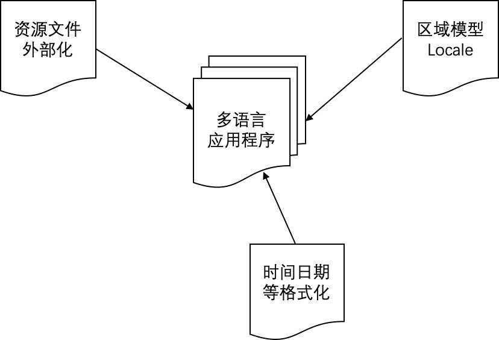

- **区域模型的定制化（Locale Model）**：Locale 模型是一个多语言应用程序的基础，用来确定界面语言以及日期时间等的格式化方式，通常包括语言环境（Language Locale）和文化环境（Cultural Locale）。一个应用程序的 Locale 获取有下面几种常见的方式：
    - 取自用户当前操作系统的区域设置：`Locale.getDefault();`。
    - 取自用户浏览器设定的语言区域。
    - 应用程序自定义的语言选择界面。
    - 其他更高级的方式，例如根据用户输入法自动选择语言区域，从而显示对应的界面语言等。
        一个应用程序具体选择哪种方式获取区域信息（Locale），这需要取决于该应用程序的用户需求。
- **资源文件的外部化**：这里主要指界面语言，根据用户选择的 Locale 模型，自动地显示与之对应的界面语言，让客户感觉这个产品是为他们而设计的。
- **日期时间等多元文化的支持**：包括货币、日历、时间、日期、排序、界面方向性（Bi-directional) 等符合各个国家自己习惯的显示方式。

下面主要从上述三方面分别介绍基于 Spring Boot 应用程序如何支持多语言的，包括 RESTful 消息和内容的国际化支持。

## Spring Boot 中的区域模型介绍

在自定义应用程序区域模型（Locale）之前，需要了解一下 Spring Boot 中区域解析器的原理。基于 Spring 框架的应用程序中，用户的区域信息是通过区域解析器 LocaleResolver 来识别的，LocaleResolver 是 Spring 框架基于 Web 提供的区域解析器接口，允许通过 HTTP 请求和响应修改区域设置，如清单 1 所示。

##### 清单 1\. Spring 框架中的区域解析器

```
public interface LocaleResolver {
    Locale resolveLocale(HttpServletRequest request);
    void setLocale(HttpServletRequest request, @Nullable HttpServletResponse response, @Nullable Locale locale);
}

```

Show moreShow more icon

LocaleResolver 在 Spring 框架中有四种具体的实现：

- 按 HTTP 请求头部解析区域(AcceptHeaderLocaleResolver)：Spring 采用的默认区域解析器就是基于请求头部，它通过检验 HTTP 请求的 accept-language 头部来解析区域，这个头部是由用户的 Web 浏览器设定决定的。
- 按会话属性解析区域(SessionLocaleResolver)：它通过检验用户会话中预置的属性来解析区域。如果该会话属性不存在，它会根据 accept-language HTTP 头部确定默认区域。
- 按 Cookie 解析区域(CookieLocaleResolver): 如果 Cookie 不存在，它会根据 accept-language HTTP 头部确定默认区域。
- FixedLocaleResolver：此解析器始终返回固定的默认区域设置，通常取自 JVM 的默认区域设置。

除了 Spring 框架中提供的四种实现外，还可以创建自定义的区域解析器。在 Spring Boot 自动配置中可以看到清单 2 的代码。

##### 清单 2\. 自定义 Spring 框架中的区域解析器

```
//向容器中加入了 LocaleResolver 对象
    @Bean
    @ConditionalOnMissingBean
    @ConditionalOnProperty(
        prefix = "spring.mvc",
        name = {"locale"}
    )
    public LocaleResolver localeResolver() {
        if (this.mvcProperties.getLocaleResolver() == org.springframework.boot.autoconfigure.web.servlet.WebMvcProperties.LocaleResolver.FIXED) {
            return new FixedLocaleResolver(this.mvcProperties.getLocale());
     } else {
            AcceptHeaderLocaleResolver localeResolver = new AcceptHeaderLocaleResolver();
            localeResolver.setDefaultLocale(this.mvcProperties.getLocale());
            return localeResolver;
        }
    }

```

Show moreShow more icon

当我们的应用程序需要自定义区域解析器（LocaleResovler）的时候，可以通过下面几个步骤实现。

### 第一步：自定义区域解析器

自定义区域解析器是对 Spring 中 LocaleResolver 接口的实现，可以基于应用程序的实际需求，取自于用户自定义的语言选择界面、用户操作系统或者浏览器的语言设定。清单 3 是一个示例，首先判断用户请求中是否含有 lang 这个参数，如果有，就使用这个参数所带的区域信息；如果没有，就取自浏览器请求头部中的 `accept-language` 信息。

##### 清单 3\. 自定义区域解析器

```
public class CustomLocaleResolver implements LocaleResolver{

@Override
public Locale resolveLocale(HttpServletRequest request) {
        String paramLanguage = request.getParameter("lang");
        if(!StringUtils.isEmpty(paramLanguage)){
            String[] splits = paramLanguage.split("-");
            return new Locale(splits[0], splits[1]);
        }else{
            String acceptLanguage = request.getHeader("Accept-Language").split(",")[0];
            String[] splits = acceptLanguage.split("-");
            return new Locale(splits[0], splits[1]);
        }
        // 如果想使用当前系统的语言，则使用 Locale.getDefault()
}

@Override
public void setLocale(HttpServletRequest request, HttpServletResponse response, Locale locale) {
    }
}

```

Show moreShow more icon

### 第二步： 将自定义的区域解析器添加到 IOC 容器中

通常添加在自定义的 config 文件中，下面的例子将自定义的 CustomLocaleResolver 通过`@Bean` 标注添加到 IOC 容器，如清单 4 所示。

##### 清单 4\. 自定义区域解析器添加到 IOC

```
@Configuration
public class CustomMvcConfigure extends WebMvcConfigurationSupport {

@Bean
public LocaleResolver localeResolver(){
return new CustomLocaleResolver();
}
}

```

Show moreShow more icon

如此，在程序中就可以调用我们自定义的区域解析器。

## Thymeleaf 模板引擎对多语言的支持

Thymeleaf 是一个基于 Apache License 2.0 许可，支持 XML、XHTML、HTML5 的开源模板引擎，主要用于 Web 或者非 Web 环境中的应用开发，在有网络和无网络的环境下皆可运行，它既可以在浏览器端查看静态页面，也可以显示动态页面。这是由于它支持 HTML 原型，然后在 HTML 标签里增加额外的属性来达到模板+数据的展示方式。浏览器解析 HTML 时会忽略未定义的标签属性，所以 Thymeleaf 模板可以静态地运行；当有数据返回到页面时，Thymeleaf 标签会动态地替换掉静态内容，使页面动态显示。

在 Spring MVC 框架中，通常我们用 JSP 来展示 Web 前端，JSP 本质上也是模板引擎，然而 Spring Boot 官方推荐使用 Thymeleaf 模板引擎，Thymeleaf 完全可以替代 JSP 或者其他模板引擎如 Velocity、FreeMarker 等。虽然 Spring 官方推荐使用 Thymeleaf，但是并不是说 Spring Boot 不支持 JSP。

在 Spring Boot 项目中使用 Thymeleaf 模板支持多语言的步骤如下：

### 第一步: 封装用户语言环境

在我们的实验中，设计一个简单的登录页面，登录页面有个语言选择下拉列表，将使用用户选的语言来显示登录页面上的标签，如图 2 所示。

##### 图 2\. 资源文件组织结构

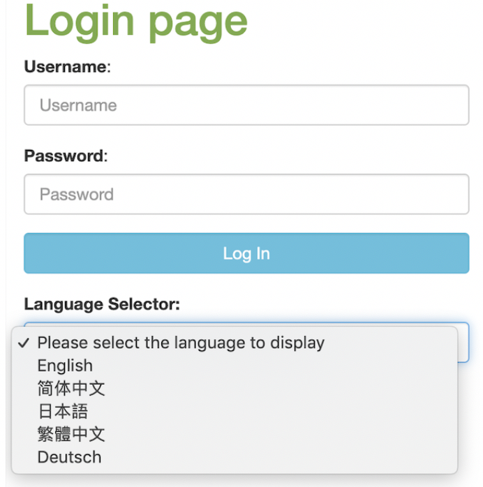

为了使我们的程序能够使用指定的 Locale，首先需要添加 LocaleResolver Bean。在我们的示例中，使用了用户选择的 Locale，所以需要配置 LocaleChangeInterceptor 拦截器，主要用来检查传入的请求，如果请求中有 `lang` 的参数(可配置），如 `http://localhost:8089/login?lang=zh_CN`，那么该 Interceptor 将使用 localResolver 改变当前用户的默认 Locale。清单 5 为示例代码，根据用户选择的语言显示对应的界面。

##### 清单 5\. 自定义 LocaleResolver

```
@Configuration
@ComponentScan(basePackages = "com.example.config")
public class MvcConfig implements WebMvcConfigurer {
     @Bean
        public LocaleResolver localeResolver() {
            SessionLocaleResolver slr = new SessionLocaleResolver();
            slr.setDefaultLocale(Locale.US);
            return slr;
        }

        @Bean
        public LocaleChangeInterceptor localeChangeInterceptor() {
            LocaleChangeInterceptor lci = new LocaleChangeInterceptor();
            lci.setParamName("lang");
            return lci;
        }

        @Override
        public void addInterceptors(InterceptorRegistry registry) {
            registry.addInterceptor(localeChangeInterceptor());
        }
}

```

Show moreShow more icon

### 第二步: 定义多语言资源文件

默认情况下，资源文件是直接放在 `src/main/resource` 目录下，为了实现代码的结构化，我们在 `resource` 目录下创建 `i18n` 文件夹，然后在 `i18n` 目录下创建资源文件（当然也可以在 i18n 目录下创建不同的子目录，在子目录下再创建资源文件），这种情况下，我们需要在配置文件 `application.properties` 中重新指定资源文件的 `basename：spring.messages.basename`。资源文件名可以根据自己的项目定义，但是通常的规范是：`模块名_语言_国家.properties`，在本实例中我们命名为如 `log_zh_CN.properties` 资源文件的目录结构如图 3 所示。

##### 图 3\. 资源文件组织结构

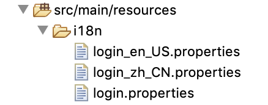

对应资源文件中的每一个 `property key`，一般都是小写字母开头，用下划线表示这个 `key` 在程序中的层级结构，并且按照字母顺序排序，便于管理和查找，如清单 6 所示。

##### 清单 6\. 英文资源文件示例

```
login_home=Home
login_login=Log In
login_login_page=Login page
login_languge_selector=Language Selector
login_please_select_language_to_display=Please select the language to display
login_password=Password
login_username=Username

```

Show moreShow more icon

### 第三步：在 Thymeleaf 模板引擎中调用多语言资源

在 Spring Boot 架构中使用 Thymeleaf 模板，首先需要在 `pom.xml` 中引入 Thymeleaf 模板依赖 `pring-boot-starter-thymeleaf`，如清单 7 所示。

##### 清单 7\. pom.xml 引入依赖

```
<dependency>
      <groupId>org.springframework.boot</groupId>
      <artifactId>spring-boot-starter-thymeleaf</artifactId>
</dependency>

```

Show moreShow more icon

此外，还需要在 `application.properties` 中配置 Thymeleaf 视图解析器，如清单 8 所示。

##### 清单 8\. 配置 Thymeleaf

```
#============ thymeleaf ====================================
spring.thymeleaf.mode=HTML
spring.thymeleaf.encoding=UTF-8
spring.thymeleaf.servlet.content-type=text/html
spring.thymeleaf.prefix=classpath:/templates/
spring.thymeleaf.cache=false

```

Show moreShow more icon

根据业务需求编写 Thymeleaf 模板 HTML 文件，默认的模板映射路径是: `src/main/resources/templates`，也可以在 `application.properties` 中配置自定义的模板路径 `spring.thymeleaf.prefix=classpath:/templates/myTemplates/`。

在 Thymeleaf 模板文件中，将所有的硬编码字符串抽取出来放到资源文件中，然后用资源文件中的键值 `#{Property Key}` 来表示界面显示的标签信息：

- 普通的标签字符串：用 `th:text= "#{login_login}"`表示。
- 作为赋值的字符串，如 `value=”Login”`，表示成 `th:value="#{login_login}"`；如: `placeholder=”Login”`，表示成 `th:placeholder="#{login_login}"`。

清单 9 是一个简单登录页面的 Thymeleaf 模板内容(只列出了部分关键代码)，其中所有显示的标签信息都抽取到资源文件中，如 `th:text=”#(login_login_page)”`，从而根据用户选择的语言自动读取对应的资源文件中的字符串来显示。

##### 清单 9\. 编写 Thymeleaf 模板文件

```
<body>
<div layout:fragment="content" th:remove="tag">
<div class="row">
    <div class="col-md-6 col-md-offset-3">
       <h1 th:text="#{login_login_page}"></h1>
          <form th:action="@{/login}" method="post">
          <div class="form-group">
          <label for="username" th:text="#{login_username}"></label>:
          <input type="text" id="username" name="username" class="form-control" autofocus="autofocus" th:placeholder="#{login_username}">
          </div><div class="form-group">
           <label for="password" th:text="#{login_password}"></label>:
           <input type="password" id="password" name="password"
               class="form-control" th:placeholder="#{login_password}">
           </div> <div class="form-group">
           <div class="row">
              <div class="col-sm-6 col-sm-offset-3">
              <input type="submit" name="login-submit" id="login-submit"
               class="form-control btn btn-info" th:value="#{login_login}">
            </div></div></div>
           </form></div></div>

        <div class="row"><div class="col-md-6 col-md-offset-3">
          <div class="form-group">
           <label th:text="#{login_languge_selector}"></label>
            <select class="form-control" id ="locales">
<option  value="" th:text="#{login_please_select_language_to_display}"></option>
<option th:selected="${displayLang=='en_US'}" value="en_US">English</option>
     <option th:selected="${displayLang=='zh_CN'}" value="zh_CN">简体中文</option>
     <option th:selected="${displayLang=='ja_JP'}" value="ja_JP">日本語</option>
     <option th:selected="${displayLang=='zh_TW'}" value="zh_TW">繁體中文</option>
</select>
    </div></div><div></div></div></div>
</body>

```

Show moreShow more icon

在实验中遇到一个问题，界面字符串全部显示为 `??Properties_Key_语言??`，如图 4 所示。

##### 图 4\. 不能正确读取 properties 文件

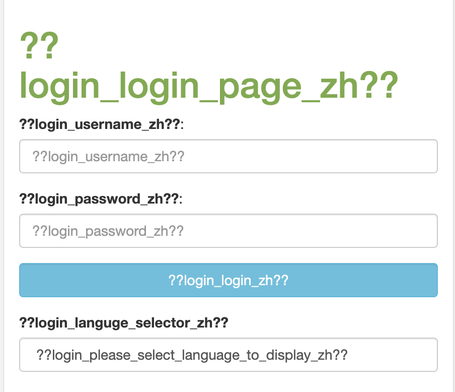

经过一步步排查，原因是在配置文件 `application.properties` 错误配置了资源文件的路径如图 5 所示。正确的路径为 `spring.messages.basename=i18n/login`。

##### 图 5\. spring.messages.basename 路径不正确

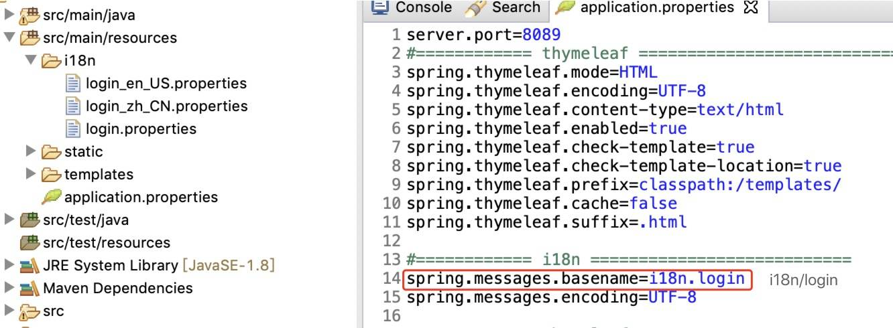

## Spring Boot 中时间日期格式化

Java 8 提供了更便捷的日期时间 API 如 LocalDate、LocalTime 和 LocalDateTime，Spring Boot 架构中推荐使用 Java 8 中新的时间日期 API。LocalDate 较 Date 类的优点体现在以下几个方面:

- Date 类打印出来的日期可读性差，通常需要使用 `SimpleDateFormat` 进行格式化，而 LocalDate 默认的格式为 `YYYY-MM-DD`。
- LocalDate 较 Date 在日期计算及格式化方面更简单易用。
- Date 类同时包括了日期和时间，而 LocalDate、LocalTime 和 LocalDateTime 分别表示日期、时间、日期和时间，使用起来非常灵活。
- Date 类不支持多线程安全，LocalDate 等新的接口是线程安全的。

对于后台 Java 程序中的时间日期格式化问题，通常会重新定制化时间日期格式化接口，比如将 Locale 参数、想要显示的样式参数传入进去。清单 10 是格式化时间日期的接口示例代码，清单 11 是具体实现的示例代码，这里只列举了几种典型的格式化情况。

##### 清单 10\. 时间日期格式化接口

```
import java.time.LocalDate;
import java.time.LocalDateTime;
import java.time.LocalTime;
import java.util.Locale;
public interface I18nFormatter {
    String formaFullDateTime(LocalDateTime date, Locale locale);
    String formatFullDate(LocalDate originalDate, Locale locale);

    String formatMediumDateTime(LocalDateTime date, Locale locale);
    String formatMediumDate(LocalDate originalDate, Locale locale);
    String formatMediumDateShortTime(LocalDateTime date, Locale locale);
    String formatMediumTime(LocalTime originalDate, Locale locale);

    String formatShortDateTime(LocalDateTime originalDate, Locale locale);
    String formatShortDate(LocalDate originalDate, Locale locale);
    String formatShortTime(LocalTime originalDate, Locale locale);
    String formatShortDateMediumTime(LocalDateTime originalDate, Locale locale);
}

```

Show moreShow more icon

##### 清单 11\. 时间日期格式化实现

```
@Service("I18nFormatter")
public class I18nFormatterImpl implements I18nFormatter {

@Override
public String formatFullDate(LocalDate originalDate, Locale locale) {
DateTimeFormatter dateFormat =DateTimeFormatter.ofLocalizedDate(FormatStyle.FULL).withLocale(locale);
    return dateFormat.format(originalDate);
}

@Override
public String formatMediumDateTime(LocalDateTime date, Locale locale) {
DateTimeFormatter dateFormat = DateTimeFormatter.ofLocalizedDateTime(FormatStyle.MEDIUM, FormatStyle.MEDIUM).withLocale(locale);
    return dateFormat.format(date);
}

@Override
public String formatShortTime(LocalTime originalDate, Locale locale) {
DateTimeFormatter dateFormat = DateTimeFormatter.ofLocalizedTime(FormatStyle.SHORT).withLocale(locale);
    return dateFormat.format(originalDate);
}
}

```

Show moreShow more icon

在 Spring Boot 架构中接口与接口之间、前后端之间都使用 JSON 格式传输数据。对于日期格式的数据，如果采用默认方式不做处理，易读性和可用性不是很好。如清单 12 就是默认 JSON 格式的日期。请求得到的 JSON 格式日期可读性很差，如图 6 所示。

##### 清单 12\. 默认的时间日期

```
@RestController
public class LocalDateTimeController {

    @GetMapping("/time")
    public DateTime timeMapping() {
        return new DateTime();
    }

public class DateTime {

    protected LocalDate localDate;
    protected LocalDateTime localDateTime;
    protected LocalTime localTime;

    public DateTime() {
        localDate = LocalDate.now();
        localDateTime = LocalDateTime.now();
        localTime = LocalTime.now();
    }

    public LocalDate getLocalDate() {
        return localDate;
    }

    public LocalDateTime getLocalDateTime() {
        return localDateTime;
    }

    public LocalTime getLocalTime() {
        return localTime;
    }
}

```

Show moreShow more icon

##### 图 6\. 默认格式返回的 JSON 格式日期

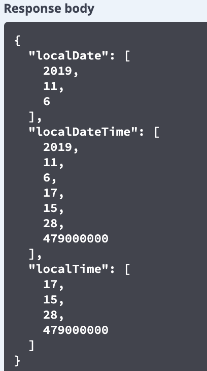

下面我们采用 `@JsonFormat` 序列化属性值，如清单 13 所示。

##### 清单 13\. 使用 @JsonFormat 进行标注

```
public class JsonDateTime extends DateTime {

    @Override
    @JsonFormat(pattern="yyyy-MM-dd")
    public LocalDate getLocalDate() {
        return super.localDate;
    }

    @Override
    @JsonFormat(pattern="yyyy-MM-dd HH:mm")
    public LocalDateTime getLocalDateTime() {
        return super.localDateTime;
    }

    @Override
    @JsonFormat(pattern="HH:mm")
    public LocalTime getLocalTime() {
        return localTime;
    }

```

Show moreShow more icon

##### 图 7\. @JsonFormat 格式化后的 Json 格式日期

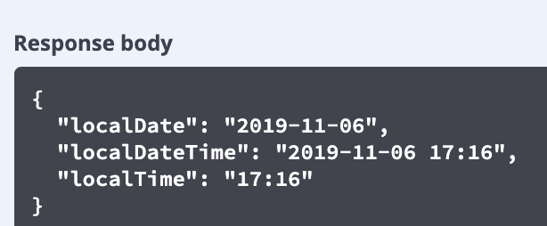

清单 13 我们只是对 JSON 格式的日期进行了格式化，但是还没有实现多语言化。我们采用 [清单 10](#清单-10-时间日期格式化接口) 中定义的多语言格式化方法对 JSON 格式日期进行格式化，将日期参数定义为 String 类型。如清单 14 所示。

##### 清单 14 使用多语言格式化方法

```
@RestController
public class LocalDateTimeController{

@GetMapping("/g11nDateTime")
    public G11nDateTime g11nDateTimeMapping(@RequestParam(value = "language") String language) {
        Locale locale = new Locale("en", "US");
        if(!StringUtils.isEmpty(language)){
                String[] splits = language.split("_");
                locale = new Locale(splits[0], splits[1]);
        }
        return new G11nDateTime(locale);

    }

public class G11nDateTime {

     protected String localDate;
     protected String localDateTime;
     protected String localTime;

     public G11nDateTime(Locale locale) {
        I18nFormatterImpl formatter = new I18nFormatterImpl();

        localDate = formatter.formatFullDate(LocalDate.now(), locale);
        localDateTime = formatter.formatMediumDateShortTime(LocalDateTime.now(), locale);
        localTime = formatter.formatShortTime(LocalTime.now(), locale);
    }

     public String getLocalDate() {
        return localDate;
    }

    public String getLocalDateTime() {
        return localDateTime;
    }

    public String getLocalTime() {
        return localTime;
    }
}

```

Show moreShow more icon

当传入的语言参数为 `zh_CN` 时，响应的日期如图 8 所示。

##### 图 8\. 多语言的 JSON 格式日期

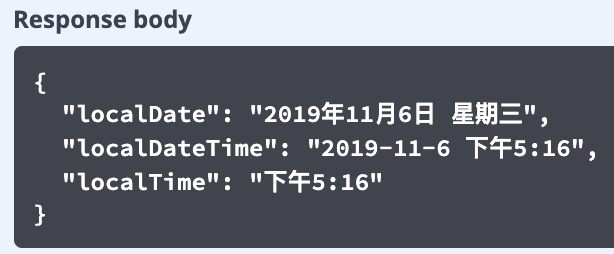

## Spring Boot RESTful API 多语言支持

随着 Spring Boot 的快速发展，基于 RESTful 标准的微服务接口应用也越来越广泛，RESTful API 使用 HTTP 协议来表示创建、检索、更新和删除 (CRUD) 操作。下面主要介绍在 Spring Boot 框架下，如何实现服务器端 RESTful API 的多语言支持，主要涉及到返回的内容和消息。通常有以下几方面需要考虑，如图 9 所示。

##### 图 9\. RESTful API 多语言支持

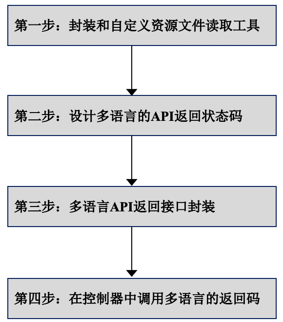

### 第一步: 封装和自定义资源文件读取工具

现行的开发框架大部分都会提供接口读取资源文件。涉及到资源文件读取时，ResourceBundle 是一个机制，主要用来根据不同的用户区域信息自动地读取对应的资源文件，ResourceBundle 是 Java 中的资源文件读取接口，图 10 总结了 Java 程序中 ResourceBundle 的管理机制。

##### 图 10\. Java 程序 Resource Bundle 管理流程

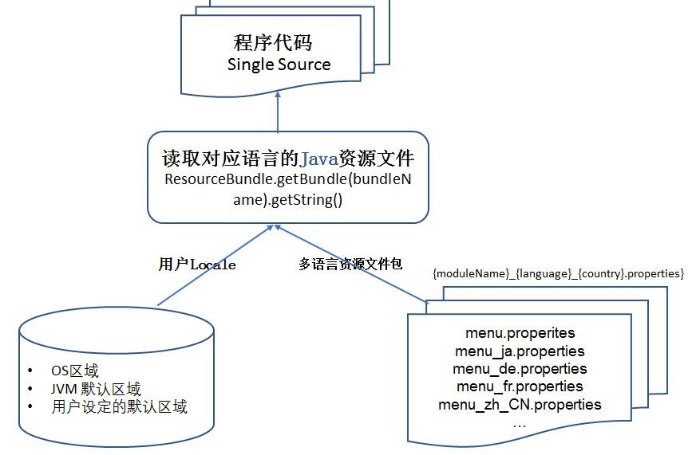

Spring 定义了访问资源文件的 MessageSource 接口，该接口有几个重要的方法用来读取资源文件，如表 1 所示。

##### 表 1\. MessageSource 接口说明

**方法名****说明**`String getMessage(String code, Object[] args, String defaultMessage, Locale locale)``code`：表示资源文件中的 Property Key。`args`：用于传递占位符所代表的运行期参数。`defaultMessage`：当在资源找不到对应属性名时，返回参数所指定的默认值。`locale`：表示区域信息。`String getMessage(String code, Object[] args, Locale locale)throws NoSuchMessageException`找不到资源中对应的属性名时，直接抛出 NoSuchMessageException 异常。`String getMessage(MessageSourceResolvable resolvable, Locale locale) throws NoSuchMessageException`将属性名、参数数组以及默认信息封装起来，它的功能和第一个接口方法相同。

MessageSource 被 HierarchicalMessageSource 和 ApplicationContext 两个接口继承，如图 11 所示。

##### 图 11\. MessageSource 类图

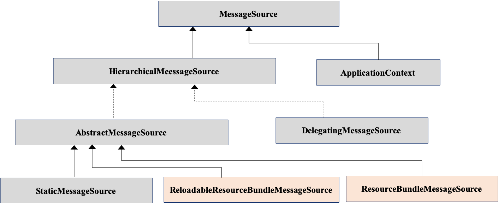

`ResourceBundleMessageSource` 和 `ReloadableResourceBundleMessageSource` 是在 Java ResourceBundle 基础上 `HierarchicalMessageSource` 的两个具体实现类。他们与 ResourceBundle 的区别是不需要分别加载不同语言的资源文件，通过资源文件名（`baseName`）就可以加载整套的国际化资源文件；同时不再需要显示的调用 `MessageFormat` 方法，使用起来更加简单便捷；还可以读取 XML 格式的资源文件。

`ReloadableResourceBundleMessageSource` 可以定时刷新资源文件，以便在应用程序不重启的情况下感知资源文件的更新，还可以设置读取资源文件的编码方式。`cacheSeconds` 属性让 `ReloadableResourceBundleMessageSource` 根据设定的时间刷新监测资源文件是否有更新，但是刷新周期不能太短，否则影响应用程序的性能。如果 `cacheSeconds` 设置 `-1`，表示永远不刷新，这个时候 `ReloadableResourceBundleMessageSource` 和 `ResourceBundleMessageSource` 功能等同。

清单 15 在 `ReloadableResourceBundleMessageSource` 类的基础上，自定义资源文件读取接口，读取自定路径的资源文件。

##### 清单 15\. 自定义资源文件读取接口

```
public class CustomizeMessageResource {

private final static Logger logger = LoggerFactory.getLogger(CustomizeMessageResource.class);
    private static MessageSourceAccessor accessor;
    private static final String PATH_PARENT = "classpath:i18n/";
    private static final String SUFFIX = ".properties";

    public CustomizeMessageResource() {}

    private void initMessageSourceAccessor() throws IOException{
        logger.info("init initMessageSourceAccessor...");

        ResourcePatternResolver resourcePatternResolver = new PathMatchingResourcePatternResolver();
        Resource resource = resourcePatternResolver.getResource(PATH_PARENT + "message" + SUFFIX);
        String fileName = resource.getURL().toString();
        int lastIndex = fileName.lastIndexOf(".");
        String baseName = fileName.substring(0,lastIndex);

        ReloadableResourceBundleMessageSource reloadableResourceBundleMessageSource = new ReloadableResourceBundleMessageSource();
reloadableResourceBundleMessageSource.setBasename(baseName);
reloadableResourceBundleMessageSource.setCacheSeconds(1800);
reloadableResourceBundleMessageSource.setDefaultEncoding("UTF-8");
      accessor = new MessageSourceAccessor(reloadableResourceBundleMessageSource);
    }

    public String getMessage(String key, String lang) throws IOException {
        initMessageSourceAccessor();
        Locale locale = new Locale("en", "US");
         if (!lang.isEmpty()) {
               locale = new Locale(lang.split("_")[0], lang.split("_")[1]);
         }
         return accessor.getMessage(key, null, "No such Property key", locale);
      }

    public String getMessage(String key, String lang, Object... parameters) throws IOException {
        initMessageSourceAccessor();
        Locale locale = new Locale("en", "US");
        if (!lang.isEmpty()) {
            locale = new Locale(lang.split("_")[0], lang.split("_")[1]);
        }
        return accessor.getMessage(key, parameters, "No such Property key", locale);
    }

```

Show moreShow more icon

### 第二步: 设计多语言的 API 返回状态码

RESTful API 都会有返回状态码，为了支持多语言，在设计返回状态码接口的时候也需要考虑多语言的支持，下面以上传文件为例来说明如何设计反馈状态码以及返回接口的封装。在设计返回状态码的时候，涉及到显示的消息内容，这里用资源文件里的 `Property Key` 来表示，这样在返回状态封装类中比较容易动态地读取不同语言的返回消息，如清单 16 所示。

##### 清单 16\. 多语言 API 返回状态码

```
public enum G11nUploadCode {

OK(200, "OK", "api_upload_response_ok"),
ERROR(400, "WRONG REQUEST", "api_upload_response_wrong_request"),
CREATED(201, "CREATED", "api_upload_response_create"),
UNAUTHORIZED(401, "UNAUTHORIZED", "api_upload_response_unauthorized"),
FORBIDDEN(403, "FORBIDDEN", "api_upload_response_forbidden"),
NOT_FOUND(404, "NOT FOUND", "api_upload_response_not_found");

    private int code;
    private String status;
    private String propertyKey;

    private G11nUploadCode(int code, String status, String propertyKey) {
        this.code = code;
        this.status= status;
        this.propertyKey = propertyKey;
    }

    public void seCode(int code) {
        this.code = code;
    }

    public int getCode() {
        return this.code;
    }

    public String getStatus() {
        return this.status;
    }

    public void seStatus(String status) {
        this.status = status;
    }

    public void setPropertyKey(String propertyKey) {
        this.propertyKey = propertyKey;
    }

    public String getPropertyKey() {
        return this.propertyKey;
    }
}

```

Show moreShow more icon

### 第三步: 多语言 API 返回接口封装

利用第一步中自定义的资源文件读取工具，动态的读取多余的返回信息，如清单 17 所示。

##### 清单 17\. 多语言 API 返回状态码

```
public class G11nUploadResult implements Serializable {

private static final long serialVersionUID = 1L;
private int code;
private String status;
private Object data;

public void setCode(int code) {
        this.code = code;
    }

public int getCode() {
    return this.code;
}

public void setStatus(String status) {
    this.status = status;
}

public String getStatus() {
    return this.status;
}

public void setData(Object data) {
    this.data = data;
}

public Object getData() {
    return this.data;
}

public G11nUploadResult() {}

public G11nUploadResult(int code, String status, Object data) {
this.code = code;
    this.status = status;
this.data = data;
}

public G11nUploadResult(G11nUploadCode responseCodeI18n, String language) throws IOException{
    CustomizeMessageResource customizeMessageResource = new CustomizeMessageResource();

    this.code = responseCodeI18n.getCode();
    this.status = responseCodeI18n.getStatus();
    System.out.println("Status: " + this.status);
    this.data = customizeMessageResource.getMessage(responseCodeI18n.getPropertyKey(), language);
}
}

```

Show moreShow more icon

### 第四步: 在控制器中调用多语言的返回码

本步操作如清单 18 所示。

##### 清单 18\. 控制器中调用多语言返回码

```
@RestController
@Api(value="uploadFiles")
public class UploadFilesController {

    private final Logger logger = LoggerFactory.getLogger(UploadFilesController.class);

    private static String UPLOADED_FOLDER = "/users/tester/upload/";

@PostMapping("/uploadfiles")
    public G11nUploadResult uploadFile(@RequestParam("file") MultipartFile uploadfile) throws IOException {
        logger.debug("Single file uploa!");

G11nUploadResult result = new G11nUploadResult();
        CustomizeMessageResource customizeMessageResource = new CustomizeMessageResource();

       if (uploadfile.isEmpty()) {
        return new G11nUploadResult(G11nUploadCode.ERROR, "zh_CN");
}

    try {
        saveUploadedFiles(Arrays.asList(uploadfile));
    } catch (IOException e) {
        return new G11nUploadResult(G11nUploadCode.NOT_FOUND, "zh_CN");
    }
    logger.info("Successfully uploaded - " + uploadfile.getOriginalFilename());
    result.setStatus("OK");
    result.setData(customizeMessageResource.getMessage("success_upload", "zh_CN", uploadfile.getOriginalFilename()));
    return result;
    }
}

```

Show moreShow more icon

图 12 是测试上传文件的结果，在调用 API 的时候，传递的参数是简体中文(zh\_CN)，返回的状态和信息显示为中文信息，使用开发者熟悉的语言显示返回信息便于读取查看。

##### 图 12\. MessageSource 类图

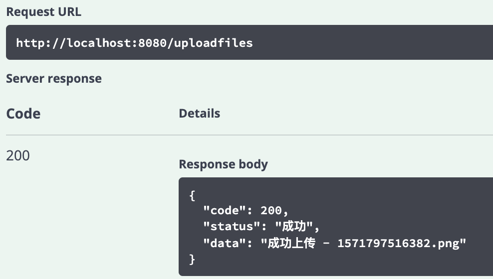

## 结束语

本文总结了在 Spring Boot 框架下，如何开发一个多语言的应用程序及 RESTful API。阐述了 Spring Boot 架构下区域模型的原理，基于已有的区域模型定制化应用程序自己的区域模型；Thymeleaf 模板引擎对多语言的支持；Spring Boot 中时间日期格式化；以及 Spring Boot RESTful API 多语言支持实践。希望这篇文章能为正在开发国际化应用程序和微服务的您提供一定的参考。