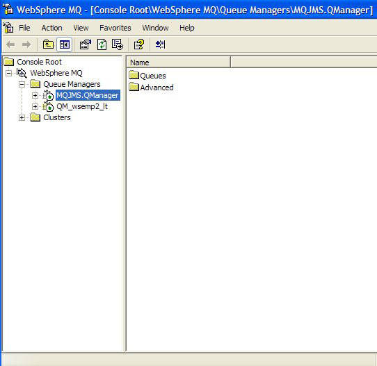
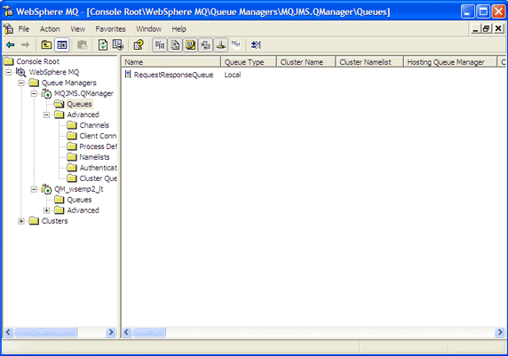

# Spring JMS 消息处理 1-2-3
Spring JMS 把企业消息处理变得轻而易举

**标签:** Java,Spring,消息传递

[原文链接](https://developer.ibm.com/zh/articles/wa-spring4/)

Naveen Balani

发布: 2005-11-07

* * *

在 _Spring 系列_ 的第 4 期也是最后一期中，我将介绍 Spring JMS（Java 消息服务）框架的特性。JMS PG 定义了 Java 应用程序通过面向消息的中间件（MOM）创建和交换消息的标准途径。

就像在这个系列前面的文章中一样，我将使用一个简单的示例来演示 Spring JMS 的特性。您将随我一道开发一个点对点的（P2P）基于消息的系统，使用 Spring JMS 框架通过 JMS 接口与 IBM MQ (注意：IBM MQ 前称是 IBM WebSphere MQ，本文图片截取自 IBM WebSphere MQ 5.3 版本) 集成。完成练习后，将可以通过这个系统发送和接收简单的文本消息。

在开始之前，请 [下载这篇文章的源代码](http://www.ibm.com/developerworks/apps/download/index.jsp?contentid=94734&filename=wa-spring2-SpringProjectPart2.zip&method=http&locale=zh_CN)。请参阅参考资源部分访问 Spring 框架和 IBM MQ 5.3。还需要 Apache Ant 来运行示例应用程序。

## Spring JMS

Spring 的 JMS 抽象框架简化了 JMS API 的使用，并与 JMS 提供者（比如 IBM MQ 5.3）平滑地集成。 _org.springframework.jms.core_ 包提供了在 Spring 中使用 JMS 的核心功能。它的模板类处理资源的创建和释放，简化了 JMS 的使用。

像其他大多数 Spring 模板类一样，JMS 模板类提供了执行公共操作的 helper 方法。在需要更复杂应用的情况下，类把处理任务的核心委托给用户实现的回调接口。JMS 类提供了方便的方法，用来发送消息、同步地使用消息以及向用户公开 JMS 会话和消息的制作者。

以下 JMS 包和 _org.springframework.jms.core_ 一起构成了 Spring JMS 的功能：

- **org.springframework.jms.support**: 提供转换 `JMSException` 的功能。转换代码把检测到的 `JMSException` 层次结构转换成未检测到异常的镜像层次结构。
- **org.springframework.jms.support.converter**: 提供 `MessageConverter` 抽象，以在 Java 对象和 JMS 消息之间进行转换。
- **org.springframework.jms.support.destination**: 提供管理 JMS 目标的不同策略，比如针对 JNDI 中保存的目标的服务定位器。
- **org.springframework.jms.connection**: 提供适合在独立应用程序中使用的 `ConnectionFactory` 实现。connection 还包含针对 JMS 的 Spring `PlatformTransactionManager` 实现。它允许把 JMS 作为事务性资源集成到 Spring 的事务管理机制中。

## IBM MQ

就像前面提到的，示例应用程序会用 Spring 的 JMS 框架通过 JMS 接口与 IBM MQ 集成。通过在应用程序和 Web 服务之间传递消息，IBM MQ 提供了可靠的、有恢复能力的应用程序集成。它使用队列和事务性工具帮助保持消息跨网络的完整性。IBM MQ 降低了信息丢失的风险和调和通信 IT 系统的需要。

IBM MQ 在它所支持的所有平台上提供了一致的应用程序编程接口，这有助于让集成的程序可移植。除了标准接口外，IBM MQ 还完整实现了JMS 接口，包括对发布-订阅消息传递的支持。IBM MQ Explorer 工具可以远程地管理和配置整个 MQ 网络。管理和配置工具基于开放源码的 Eclipse 框架，而且是可扩展的。

## Spring JMS 模板

Spring 框架提供了 `JmsTemplate` 的两个实现。 `JmsTemplate` 类使用 JMS 1.1 API，子类 `JmsTemplate102` 则使用 JMS 1.0.2 API。我的示例应用程序使用的是 `JmsTemplate102` 。

JMS 模板被用来发送和接收 JMS 消息。Spring 采用回调机制对 JMS 信息传递进行协调。 `MessageCreator` 回调接口用 `JmsTemplate` 中的调用代码提供的 `Session` 创建消息。为了支持 JMS API 更复杂的应用，回调 `SessionCallback` 向用户提供了 JMS 会话，而 `callback ProducerCallback` 则公开了 `Session` 和 `MessageProducer` 组合。

清单 1 显示了示例应用程序使用的 JMS 模板的配置。清单摘自 _spring-mqseries-jms.xml_ 文件。

##### 清单 1\. JMS 模板配置

```
<!-- JMS Queue Template -->
<bean id="jmsQueueTemplate"
          class="org.springframework.jms.core.JmsTemplate102">
    <property name="connectionFactory">
      <ref bean="jmsQueueConnectionFactory"/>
    </property>
    <property name="destinationResolver">
      <ref bean="jmsDestinationResolver"/>
    </property>
    <property name="pubSubDomain">
      <value>false</value>
    </property>
    <property name="receiveTimeout">
      <value>20000</value>
    </property>
</bean>

```

Show moreShow more icon

`jmsQueueTemplate` bean 与 JMS 连接工厂和 JMS 目标解析器绑定在一起，用于解析 JMS 客户机通过 JNDI 提供的目标队列名。`connectionFactory` 属性指定了如何获得到 JMS 提供者的连接。在本例中，清单 2 显示了如何从 JNDI 检索连接工厂。

##### 清单 2\. 通过 JNDI 配置 JMS 连接工厂

```
<!-- JMS Queue Connection Factory -->
<bean id="internalJmsQueueConnectionFactory"
          class="org.springframework.jndi.JndiObjectFactoryBean">
    <property name="jndiTemplate">
      <ref bean="jndiTemplate"/>
    </property>
    <property name="jndiName">
      <value>MQ_JMS_MANAGER</value>
    </property>
</bean>

```

Show moreShow more icon

可以看到，`JndiObjectFactoryBean` 被绑定到 `internalJmsQueueConnectionFactory`。`JndiObjectFactoryBean` 用 `JndiTemplate` 属性进行 JNDI 查询。Spring 将用 `JndiTemplate` 中指定的环境属性和初始上下文在 JNDI 中查询连接工厂。清单 3 显示了 `JndiTemplate` 配置 bean 的配置。

##### 清单 3\. JNDI 查询的 JNDI 模板配置

```
<bean id="jndiTemplate" class="org.springframework.jndi.JndiTemplate">
    <property name="environment">
      <props>
        <prop key="java.naming.factory.initial">
            com.sun.jndi.fscontext.RefFSContextFactory
        </prop>
        <prop key="java.naming.provider.url">
            file:/C:/JNDI-Directory
        </prop>
      </props>
    </property>
</bean>

```

Show moreShow more icon

以上配置进行 JNDI 查询时用 `com.sun.jndi.fscontext.RefFSContextFactory` 指定初始上下文工厂，用基于文件的 _file:/C:/JNDI-Directory_ 作为提供者 URL。根据示例应用程序的意图，JNDI 访问会采用基于文件的 `FSContext` 版本（请参阅参考资源）的配置把 MQ 队列绑定到 JNDI。

有了定义好的 JMS 模板，下一步就是把它绑定到示例应用程序中，然后就可以用它发送和接收消息了。

## Spring JMS 实现

JMS 模板可以绑定到应用程序中，以发送和接收 JMS 消息。在清单 4 中可以看出我如何把 [清单 1](#清单-1-jms-模板配置) 中的 JMS 模板绑定到示例应用程序中。

##### 清单 4\. 把 JmsTemplate 绑定到应用程序中

```
<bean id="jmsSender"
          class="springexample.client.JMSSender">
    <property name="jmsTemplate102">
      <ref bean="jmsQueueTemplate"/>
    </property>
    </bean>
    <bean id="jmsReceiver"
          class="springexample.client.JMSReceiver">
    <property name="jmsTemplate102">
        <ref bean="jmsQueueTemplate"/>
      </property>
    </bean>

```

Show moreShow more icon

可以看到，我把 `jmsQueueTemplate` 绑定到用来发送和接收消息的 `JmsSender` 应用程序 bean 和 `JmsReceiver` bean。清单 5 显示了与 `JMSSender` 类有关的代码。

##### 清单 5\. 用 JmsTemplate 发送 JMS 消息的 JMSSender

```
public class JMSSender {
private JmsTemplate102 jmsTemplate102;
public JmsTemplate102 getJmsTemplate102() {
     return jmsTemplate102;
}
public void setJmsTemplate102(JmsTemplate102 jmsTemplate102) {
     this.jmsTemplate102 = jmsTemplate102;
}
public void sendMesage(){
     jmsTemplate102.send("JMS_RequestResponseQueue",
                  new MessageCreator() {
        public Message createMessage(Session session)
                  throws JMSException {
          return session.createTextMessage("This is a sample message");
        }
      });
}

```

Show moreShow more icon

`JMSSender` 类用 `jmsTemplate102.send()` 方法发送 JMS 消息。 `send()` 方法的第一个参数是 JNDI 队列名，队列名指定了消息应当发送到哪里。（很快就会看到如何把 IBM MQ 的队列名绑定到 JNDI。） `send()` 方法的第二个参数是 `MessageCreator` 类。 `JmsTemplate` 中的调用代码提供了 `Session` 类，这个类提供了一个创建 JMS 消息的回调接口。

下一步是用 JMS 的 `Session` 类创建一个简单的文本消息。在代码执行时，消息会传递给 IBM MQ 服务器的队列。清单 6 显示了使用 `JmsTemplate` 检索 JMS 消息的 `JMSReceiver` 应用程序 bean 的代码。

##### 清单 6\. 用 JmsTemplate 检索 JMS 消息的 JMSReceiver

```
public class JMSReceiver {
    private JmsTemplate102 jmsTemplate102;
    public JmsTemplate102 getJmsTemplate102() {
      return jmsTemplate102;
    }
    public void setJmsTemplate102(JmsTemplate102 jmsTemplate102) {
     this.jmsTemplate102 = jmsTemplate102;
    }
    public void processMessage(){
      Message msg = jmsTemplate102.receive("JMS_RequestResponseQueue");
      try{
        TextMessage textMessage = (TextMessage) msg;
        if( msg!=null){
        System.out.println(" Message Received -->" +
                    textMessage.getText());
        }
      }catch(Exception e){
            e.printStackTrace();
      }
    }
}

```

Show moreShow more icon

`JMSReceiver` 类用 `jmsTemplate102.receive()` 方法同步地接收 JMS 消息。 `receive()` 方法指定 JNDI 队列名，并从中检索消息。 `JMSTemplate` 类的 `processMessage()` 方法由接收 JMS 客户机调用。 `JSMTemplate` bean 的属性 _receiveTimeout_ （列在 `JMSTemplate` 配置中）指定接收客户机同步地从队列中接收消息时要等候的时间。

现在应用程序的代码已完成！下一步就是配置 IBM MQ 队列并把它们绑定到 JNDI 对象。

## 队列管理器的设置

在运行应用程序之前，需要设置 IBM MQ 的队列管理器和队列，并把它们绑定到 JNDI。如果喜欢的话，可以按照这部分的示例做：只需 [下载](#artdownload) 设置 IBM MQ 队列的批文件和应用程序的源代码和部署描述符即可。把 zip 文件解压到驱动器 C:。

**设置队列**

运行 _C:\\SpringSeriesPart4JMS\\batch_ 文件夹中的 _mqsetup.bat_ 文件。这个批文件要求在 path 环境变量中设置好 MQ 安装的 bin 文件夹（例如 _C:\\mqseries\\bin_ ）。运行了批文件之后，应当看到消息 “`All valid MQSC commands were processed` ”。要打开 MQ Explorer 并检查已经创建的队列管理器和队列，请选择 **Start -> Programs -> IBM MQSeries -> MQSeriesExplorer** 。图 1 显示出示例应用程序 `QueueManager MQJMS.QManager` 已经创建并正在运行。

##### 图 1\. IBM MQ 的 QueueManager 配置



请在应用程序屏幕左侧面板上点击 `MQJMS.QManager` 下的 **Queues** 文件夹。应当看到已经创建了一个队列 `RequestResponseQueue`，如图 2 所示。

##### 图 2\. IBM MQ 的请求/响应队列配置



这就完成了队列的设置。

**设置 JMS 和 JNDI 管理**

在示例应用程序中，JNDI 的访问利用了可以从 JNDI 主页得到的基于文件的 `FSContext` 版本（请参阅 [结束语](#结束语) ）。 _FSContext.jar_ 文件也包含在 IBM MQ 的 JMS 支持当中。请添加文件夹 _\\MQSeriesInstallable\\MQSeries\\Java\\lib_ 和 _\\MQSeriesInstallable\\MQSeries\\Java\\bin_ 到系统的 PATH 环境变量中。而且，请把 _\\MQSeriesInstallable\\MQSeries\\Java\\lib_ 文件夹中的所有 jar 文件添加到系统的 CLASSPATH 环境变量中。还可以运行 _C:\\SpringSeriesPart4JMS\\batch_ 文件夹中的 _classpath.cmd_ 文件，它会设置必要的 path 和 CLASSPATH 变量。要做到这点，只需要修改 _classpath.cmd_ 文件中的 `MQ_JAVA_INSTALL_PATH` ，把它指到 IBM MQ JMS 的安装目录。

接下来，修改 _\\MQSeriesInstallableDirectory\\Java\\bin_ 中的 _JMSAdmin.config_ 配置文件，MQSeries JMS 管理程序用它指明应用程序要使用的上下文工厂和 JNDI 实现的地址。请取消以下行的注释：

```
INITIAL_CONTEXT_FACTORY=com.sun.jndi.fscontext.RefFSContextFactory

```

Show moreShow more icon

并注释掉其余两个 `INITIAL_CONTEXT_FACTORY` 变量。还要取消以下行的注释：

```
PROVIDER_URL=file:/C:/JNDI-Directory

```

Show moreShow more icon

并注释掉其余两个 `PROVIDER_URL` 变量。

可以在 _C:\\SpringSeriesPart4JMS\\batch_ 文件夹中发现参考的示例配置文件。

为了保存 JNDI 对象，请在驱动器 C: 上创建名为 _JNDI-Directory_ 的目录。切换到 _\\MQSeriesInstallableDirectory\\Java\\bin_ 目录并运行 _JMSAdmin_ 批文件，应当看到 _InitCtx_ 变量。

逐个输入以下内容：

```
def qcf(MQ_JMS_MANAGER) qmgr(MQJMS.QManager)
按回车
def q(JMS_RequestResponseQueue) qmgr(MQJMS.QManager)
               queue(RequestResponseQueue)
按回车

```

Show moreShow more icon

现在已经把 IBM MQ 队列绑定到 JNDI 对象，作为应用程序客户可以通过 JNDI 查询对象。现在剩下的就是看代码的实际作用了！

## 运行示例

要运行示例，请 [下载 Spring 框架](https://sourceforge.net/projects/springframework/files/springframework/1.2%20RC2/spring-framework-1.2-rc2-with-dependencies.zip/download?use_mirror=master&download=) 和它的所有依赖文件并解压，例如解压到 c:\\。会创建文件夹 _C:\\spring-framework-1.2-rc2_ （或最新版本）。

要运行 Spring 应用程序，请把本文的源代码解压到任意文件夹，例如 _c:\_ 。会创建文件夹 _SpringSeriesPart4JMS_ 。就像前面提到过的，还需要安装 Apache Ant 和它的 Spring 依赖 jar 文件。请把 Spring 库 —— 即 _spring.jar_ （在 _C:\\spring-framework-1.2-rc2\\dist_ 中）和 _commons-logging.jar_ （在 _C:\\spring-framework-1.2-rc2\\lib\\jakarta-commons_ 中）拷贝到 _SpringSeriesPart4JMS\\lib_ 文件夹。还要把所有的 jar 库从 _\\MQSeriesInstallableDirectory\\Java\\lib_ 目录拷贝到 _SpringSeriesPart4JMS\\lib_ 文件夹。其中包含 MQseries 和 JMS 的相关库。现在就拥有了构建的依赖集。

接下来，打开命令提示符，切换到 _SpringProject4_ 目录，并在命令提示符下输入以下命令：

```
> ant -f build-jmssender.xml.

```

Show moreShow more icon

这会构建并运行 `SendMQSpringJMS` 类，它会调用 `JMSSender` 类，发送消息到 IBM MQ `RequestResponse` 队列。 `SendMQSpringJMS` 还会通过它的 `ClassPathXmlApplicationContext` 装入 spring 配置文件。一旦 bean 全部装载，就可以通过 Spring 的 ApplicationContext 的 `getBean()` 方法访问 JMSSender（请参阅清单 7）。

##### 清单 7\. 装入示例应用程序的 Spring 配置

```
ClassPathXmlApplicationContext appContext =
                   new ClassPathXmlApplicationContext(new String[] {
     "spring-mqseries-jms.xml"
    });
JMSSender jmsSender = (JMSSender)
        appContext.getBean("jmsSender");

```

Show moreShow more icon

消息传递到队列上之后，请运行 JMS 接收方客户机以检索消息。请打开命令提示符，切换到目录 _SpringProject4_ ，并输入：

```
> ant -f build-jmsreceiver.xml

```

Show moreShow more icon

这会构建并运行 `ReceiveMQSpringJMS` 类，该类会调用 `JMSReceiver` 类，以从 IBM MQ 的 `RequestResponse` 队列接收文本消息。在控制台上会打印出以下消息：

```
Message Received --> This is a sample message.

```

Show moreShow more icon

### 结束语

在 Spring 系列的最后这篇文章中，您学习了 Spring JMS 框架的基础。我首先介绍了示例应用程序的核心组件 —— Spring JMS 框架和 IBM MQ 5.3，然后介绍了如何用 Spring JMS 模板向 IBM MQ 队列发送消息和从中接收消息。虽然这个示例非常简单，但是可以把这里介绍的步骤应用到更复杂的应用程序。

我希望介绍 Spring 框架核心模块的这一系列对您有所帮助。请参阅参考资源学习更多有关 Spring 框架和 Spring JMS 的内容。