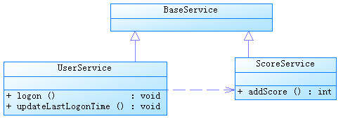

# Spring 事务管理高级应用难点剖析，第 1 部分
走出迷茫：DAO 和事务管理、应用分层、事务方法嵌套调用、多线程

**标签:** Spring

[原文链接](https://developer.ibm.com/zh/articles/j-lo-spring-ts1/)

陈雄华

发布: 2010-03-19

* * *

## 概述

Spring 最成功，最吸引人的地方莫过于轻量级的声明式事务管理，仅此一点，它就宣告了重量级 EJB 容器的覆灭。Spring 声明式事务管理将开发者从繁复的事务管理代码中解脱出来，专注于业务逻辑的开发上，这是一件可以被拿来顶礼膜拜的事情。但是，世界并未从此消停，开发人员需要面对的是层出不穷的应用场景，这些场景往往逾越了普通 Spring 技术书籍的理想界定。因此，随着应用开发的深入，在使用经过 Spring 层层封装的声明式事务时，开发人员越来越觉得自己坠入了迷雾，陷入了沼泽，体会不到外界所宣称的那种畅快淋漓。本系列文章的目标旨在整理并剖析实际应用中种种让我们迷茫的场景，让阳光照进云遮雾障的山头。

## DAO 和事务管理的牵绊

很少有使用 Spring 但不使用 Spring 事务管理器的应用，因此常常有人会问：是否用了 Spring，就一定要用 Spring 事务管理器，否则就无法进行数据的持久化操作呢？事务管理器和 DAO 是什么关系呢？

也许是 DAO 和事务管理如影随行的缘故吧，这个看似简单的问题实实在在地存在着，从初学者心中涌出，萦绕在开发老手的脑际。答案当然是否定的！我们都知道：事务管理是保证数据操作的事务性（即原子性、一致性、隔离性、持久性，也即所谓的 ACID），脱离了事务性，DAO 照样可以顺利地进行数据的操作。

下面，我们来看一段使用 Spring JDBC 进行数据访问的代码：

##### 清单 1\. UserJdbcWithoutTransManagerService.java

```
package user.withouttm;

import org.springframework.beans.factory.annotation.Autowired;
import org.springframework.jdbc.core.JdbcTemplate;
import org.springframework.stereotype.Service;
import org.springframework.context.ApplicationContext;
import org.springframework.context.support.ClassPathXmlApplicationContext;
import org.apache.commons.dbcp.BasicDataSource;

@Service("service1")
public class UserJdbcWithoutTransManagerService {
    @Autowired
    private JdbcTemplate jdbcTemplate;

    public void addScore(String userName,int toAdd){
        String sql = "UPDATE t_user u SET u.score = u.score + ? WHERE user_name =?";
        jdbcTemplate.update(sql,toAdd,userName);
    }

    public static void main(String[] args) {
        ApplicationContext ctx =
        new ClassPathXmlApplicationContext("user/withouttm/jdbcWithoutTransManager.xml");
        UserJdbcWithoutTransManagerService service =
            (UserJdbcWithoutTransManagerService)ctx.getBean("service1");
        JdbcTemplate jdbcTemplate = (JdbcTemplate)ctx.getBean("jdbcTemplate");
        BasicDataSource basicDataSource = (BasicDataSource)jdbcTemplate.getDataSource();

        //①.检查数据源autoCommit的设置
        System.out.println("autoCommit:"+ basicDataSource.getDefaultAutoCommit());

        //②.插入一条记录，初始分数为10
        jdbcTemplate.execute(
        "INSERT INTO t_user(user_name,password,score) VALUES('tom','123456',10)");

        //③.调用工作在无事务环境下的服务类方法,将分数添加20分
        service.addScore("tom",20);

         //④.查看此时用户的分数
        int score = jdbcTemplate.queryForInt(
        "SELECT score FROM t_user WHERE user_name ='tom'");
        System.out.println("score:"+score);
        jdbcTemplate.execute("DELETE FROM t_user WHERE user_name='tom'");
    }
}

```

Show moreShow more icon

jdbcWithoutTransManager.xml 的配置文件如下所示：

##### 清单 2\. jdbcWithoutTransManager.xml

```
<?xml version="1.0" encoding="UTF-8" ?>
<beans xmlns="http://www.springframework.org/schema/beans"
       xmlns:xsi="http://www.w3.org/2001/XMLSchema-instance"
       xmlns:context="http://www.springframework.org/schema/context"
       xmlns:p="http://www.springframework.org/schema/p"
       xsi:schemaLocation="http://www.springframework.org/schema/beans
           http://www.springframework.org/schema/beans/spring-beans-3.0.xsd
           http://www.springframework.org/schema/context
           http://www.springframework.org/schema/context/spring-context-3.0.xsd">
    <context:component-scan base-package="user.withouttm"/>

    <!-- 数据源默认将autoCommit设置为true -->
    <bean id="dataSource"
        class="org.apache.commons.dbcp.BasicDataSource"
        destroy-method="close"
        p:driverClassName="oracle.jdbc.driver.OracleDriver"
        p:url="jdbc:oracle:thin:@localhost:1521:orcl"
        p:username="test"
        p:password="test"/>

    <bean id="jdbcTemplate"
        class="org.springframework.jdbc.core.JdbcTemplate"
        p:dataSource-ref="dataSource"/>
</beans>

```

Show moreShow more icon

运行 UserJdbcWithoutTransManagerService，在控制台上打出如下的结果：

```
defaultAutoCommit:true
score:30

```

Show moreShow more icon

在 jdbcWithoutTransManager.xml 中，没有配置任何事务管理器，但是数据已经成功持久化到数据库中。在默认情况下，dataSource 数据源的 autoCommit 被设置为 true ―― 这也意谓着所有通过 JdbcTemplate 执行的语句马上提交，没有事务。如果将 dataSource 的 defaultAutoCommit 设置为 false，再次运行 UserJdbcWithoutTransManagerService，将抛出错误，原因是新增及更改数据的操作都没有提交到数据库，所以 ④ 处的语句因无法从数据库中查询到匹配的记录而引发异常。

对于强调读速度的应用，数据库本身可能就不支持事务，如使用 MyISAM 引擎的 MySQL 数据库。这时，无须在 Spring 应用中配置事务管理器，因为即使配置了，也是没有实际用处的。

不过，对于 Hibernate 来说，情况就有点复杂了。因为 Hibernate 的事务管理拥有其自身的意义，它和 Hibernate 一级缓存有密切的关系：当我们调用 Session 的 save、update 等方法时，Hibernate 并不直接向数据库发送 SQL 语句，而是在提交事务（commit）或 flush 一级缓存时才真正向数据库发送 SQL。所以，即使底层数据库不支持事务，Hibernate 的事务管理也是有一定好处的，不会对数据操作的效率造成负面影响。所以，如果是使用 Hibernate 数据访问技术，没有理由不配置 HibernateTransactionManager 事务管理器。

但是，不使用 Hibernate 事务管理器，在 Spring 中，Hibernate 照样也可以工作，来看下面的例子：

##### 清单 3\. UserHibernateWithoutTransManagerService.java

```
package user.withouttm;

import org.springframework.beans.factory.annotation.Autowired;
import org.springframework.jdbc.core.JdbcTemplate;
import org.springframework.stereotype.Service;
import org.springframework.context.ApplicationContext;
import org.springframework.context.support.ClassPathXmlApplicationContext;
import org.springframework.orm.hibernate3.HibernateTemplate;
import org.apache.commons.dbcp.BasicDataSource;
import user.User;

@Service("service2")
public class UserHibernateWithoutTransManagerService {
    @Autowired
    private HibernateTemplate hibernateTemplate;

    public void addScore(String userName,int toAdd){
        User user = (User)hibernateTemplate.get(User.class,userName);
        user.setScore(user.getScore()+toAdd);
        hibernateTemplate.update(user);
    }

    public static void main(String[] args) {
        //参考UserJdbcWithoutTransManagerService相应代码
       ...
    }
}

```

Show moreShow more icon

此时，采用 hiberWithoutTransManager.xml 的配置文件，其配置内容如下：

##### 清单 4\. hiberWithoutTransManager.xml

```
<?xml version="1.0" encoding="UTF-8" ?>
<beans xmlns="http://www.springframework.org/schema/beans"
    xmlns:xsi="http://www.w3.org/2001/XMLSchema-instance"
    xmlns:context="http://www.springframework.org/schema/context"
    xmlns:p="http://www.springframework.org/schema/p"
    xsi:schemaLocation="http://www.springframework.org/schema/beans
        http://www.springframework.org/schema/beans/spring-beans-3.0.xsd
        http://www.springframework.org/schema/context
        http://www.springframework.org/schema/context/spring-context-3.0.xsd">

<!--省略掉包扫描，数据源，JdbcTemplate配置部分，参见jdbcWithoutTransManager.xml -->
...

    <bean id="sessionFactory"
        class=
            "org.springframework.orm.hibernate3.annotation.AnnotationSessionFactoryBean"
            p:dataSource-ref="dataSource">
        <property name="annotatedClasses">
            <list>
                <value>user.User</value>
            </list>
        </property>
        <property name="hibernateProperties">
            <props>
                <prop key="hibernate.dialect">
                    org.hibernate.dialect.Oracle10gDialect
                </prop>
                <prop key="hibernate.show_sql">true</prop>
            </props>
        </property>
    </bean>

    <bean id="hibernateTemplate"
          class="org.springframework.orm.hibernate3.HibernateTemplate"
          p:sessionFactory-ref="sessionFactory"/>
</beans>

```

Show moreShow more icon

运行 UserHibernateWithoutTransManagerService，程序正确执行，并得到类似于 UserJdbcWithoutTransManagerService 的执行结果，这说明 Hibernate 在 Spring 中，在没有事务管理器的情况下，依然可以正常地进行数据的访问。

## 应用分层的迷惑

Web、Service 及 DAO 三层划分就像西方国家的立法、行政、司法三权分立一样被奉为金科玉律，甚至有开发人员认为如果要使用 Spring 的事务管理就一定先要进行三层的划分。这个看似荒唐的论调在开发人员中颇有市场。更有甚者，认为每层必须先定义一个接口，然后再定义一个实现类。其结果是：一个很简单的功能，也至少需要 3 个接口，3 个类，再加上视图层的 JSP 和 JS 等，打牌都可以转上两桌了，这种误解贻害不浅。

对将”面向接口编程”奉为圭臬，认为放之四海而皆准的论调，笔者深不以为然。是的，”面向接口编程”是 Martin Fowler，Rod Johnson 这些大师提倡的行事原则。如果拿这条原则去开发架构，开发产品，怎么强调都不为过。但是，对于我们一般的开发人员来说，做的最多的是普通工程项目，往往最多的只是一些对数据库增、删、查、改的功能。此时，”面向接口编程”除了带来更多的类文件外，看不到更多其它的好处。

Spring 框架提供的所有附加的好处（AOP、注解增强、注解 MVC 等）唯一的前提就是让 POJO 的类变成一个受 Spring 容器管理的 Bean，除此以外没有其它任何的要求。下面的实例用一个 POJO 完成所有的功能，既是 Controller，又是 Service，还是 DAO：

##### 清单 5\. MixLayerUserService.java

```
package user.mixlayer;
import org.springframework.beans.factory.annotation.Autowired;
import org.springframework.jdbc.core.JdbcTemplate;
import org.springframework.stereotype.Controller;
import org.springframework.web.bind.annotation.RequestMapping;
//①.将POJO类通过注解变成Spring MVC的Controller
@Controller
public class MixLayerUserService {

    //②.自动注入JdbcTemplate
    @Autowired
    private JdbcTemplate jdbcTemplate;

    //③.通过Spring MVC注解映URL请求
    @RequestMapping("/logon.do")
    public String logon(String userName,String password){
        if(isRightUser(userName,password)){
            String sql = "UPDATE t_user u SET u.score = u.score + ? WHERE user_name =?";
            jdbcTemplate.update(sql,20,userName);
            return "success";
        }else{
            return "fail";
        }
    }
    private boolean isRightUser(String userName,String password){
        //do sth...
        return true;
    }
}

```

Show moreShow more icon

通过 @Controller 注解将 MixLayerUserService 变成 Web 层的 Controller，同时也是 Service 层的服务类。此外，由于直接使用 JdbcTemplate 访问数据，所以 MixLayerUserService 还是一个 DAO。来看一下对应的 Spring 配置文件：

##### 清单 6\. applicationContext.xml

```
<?xml version="1.0" encoding="UTF-8" ?>
<beans xmlns="http://www.springframework.org/schema/beans"
    xmlns:xsi="http://www.w3.org/2001/XMLSchema-instance"
    xmlns:context="http://www.springframework.org/schema/context"
    xmlns:p="http://www.springframework.org/schema/p"
    xmlns:aop="http://www.springframework.org/schema/aop"
    xmlns:tx="http://www.springframework.org/schema/tx"
    xsi:schemaLocation="http://www.springframework.org/schema/beans
    http://www.springframework.org/schema/beans/spring-beans-3.0.xsd
    http://www.springframework.org/schema/context
    http://www.springframework.org/schema/context/spring-context-3.0.xsd
    http://www.springframework.org/schema/aop
    http://www.springframework.org/schema/aop/spring-aop-3.0.xsd
    http://www.springframework.org/schema/tx
    http://www.springframework.org/schema/tx/spring-tx-3.0.xsd">
    <!--扫描Web类包，通过注释生成Bean-->
    <context:component-scan base-package="user.mixlayer"/>
    <!--①.启动Spring MVC的注解功能，完成请求和注解POJO的映射-->
    <bean class="org.springframework.web.servlet.mvc.annotation
        .AnnotationMethodHandlerAdapter"/>

    <!--模型视图名称的解析，即在模型视图名称添加前后缀 -->
    <bean class="org.springframework.web.servlet.view
        .InternalResourceViewResolver"
         p:prefix="/WEB-INF/jsp/" p:suffix=".jsp"/>

    <!--普通数据源　-->
    <bean id="dataSource"
        class="org.apache.commons.dbcp.BasicDataSource"
        destroy-method="close"
        p:driverClassName="oracle.jdbc.driver.OracleDriver"
        p:url="jdbc:oracle:thin:@localhost:1521:orcl"
        p:username="test"
        p:password="test"/>

    <bean id="jdbcTemplate"
          class="org.springframework.jdbc.core.JdbcTemplate"
          p:dataSource-ref="dataSource"/>

    <!--事务管理器 -->
    <bean id="jdbcManager"
        class="org.springframework.jdbc.datasource.DataSourceTransactionManager"
        p:dataSource-ref="dataSource"/>

    <!--②使用aop和tx命名空间语法为MixLayerUserService所有公用方法添加事务增强 -->
    <aop:config proxy-target-class="true">
        <aop:pointcut id="serviceJdbcMethod"
            expression="execution(public * user.mixlayer.MixLayerUserService.*(..))"/>
        <aop:advisor pointcut-ref="serviceJdbcMethod"
            advice-ref="jdbcAdvice" order="0"/>
    </aop:config>
    <tx:advice id="jdbcAdvice" transaction-manager="jdbcManager">
        <tx:attributes>
            <tx:method name="*"/>
        </tx:attributes>
    </tx:advice>
</beans>

```

Show moreShow more icon

在 ① 处，我们定义配置了 AnnotationMethodHandlerAdapter，以便启用 Spring MVC 的注解驱动功能。而②和③处通过 Spring 的 aop 及 tx 命名空间，以及 Aspject 的切点表达式语法进行事务增强的定义，对 MixLayerUserService 的所有公有方法进行事务增强。要使程序能够运行起来还必须进行 web.xml 的相关配置：

##### 清单 7\. web.xml

```
<?xml version="1.0" encoding="GB2312"?>
<web-app version="2.4" xmlns="http://java.sun.com/xml/ns/j2ee"
    xmlns:xsi="http://www.w3.org/2001/XMLSchema-instance"
    xsi:schemaLocation="http://java.sun.com/xml/ns/j2ee
    http://java.sun.com/xml/ns/j2ee/web-app_2_4.xsd">
    <context-param>
        <param-name>contextConfigLocation</param-name>
        <param-value>classpath*:user/mixlayer/applicationContext.xml</param-value>
    </context-param>
    <context-param>
        <param-name>log4jConfigLocation</param-name>
        <param-value>/WEB-INF/classes/log4j.properties</param-value>
    </context-param>

    <listener>
        <listener-class>
            org.springframework.web.util.Log4jConfigListener
        </listener-class>
    </listener>
    <listener>
        <listener-class>
            org.springframework.web.context.ContextLoaderListener
        </listener-class>
    </listener>

    <servlet>
        <servlet-name>user</servlet-name>
        <servlet-class>
            org.springframework.web.servlet.DispatcherServlet
        </servlet-class>
        <!--①通过contextConfigLocation参数指定Spring配置文件的位置 -->
        <init-param>
            <param-name>contextConfigLocation</param-name>
            <param-value>classpath:user/mixlayer/applicationContext.xml</param-value>
        </init-param>
        <load-on-startup>1</load-on-startup>
    </servlet>
    <servlet-mapping>
        <servlet-name>user</servlet-name>
        <url-pattern>*.do</url-pattern>
    </servlet-mapping>
</web-app>

```

Show moreShow more icon

这个配置文件很简单，唯一需要注意的是 DispatcherServlet 的配置。默认情况下 Spring MVC 根据 Servlet 的名字查找 WEB-INF 下的 -servlet.xml 作为 Spring MVC 的配置文件，在此，我们通过 contextConfigLocation 参数显式指定 Spring MVC 配置文件的确切位置。

将 org.springframework.jdbc 及 org.springframework.transaction 的日志级别设置为 DEBUG，启动项目，并访问 `http://localhost:8088/logon.do?userName=tom` 应用，MixLayerUserService#logon 方法将作出响应，查看后台输出日志：

##### 清单 8\. 执行日志

```
13:24:22,625 DEBUG (AbstractPlatformTransactionManager.java:365) -
    Creating new transaction with name
    [user.mixlayer.MixLayerUserService.logon]: PROPAGATION_REQUIRED,ISOLATION_DEFAULT
13:24:22,906 DEBUG (DataSourceTransactionManager.java:205) -
    Acquired Connection [org.apache.commons.dbcp.PoolableConnection@6e1cbf]
    for JDBC transaction
13:24:22,921 DEBUG (DataSourceTransactionManager.java:222) -
    Switching JDBC Connection
    [org.apache.commons.dbcp.PoolableConnection@6e1cbf] to manual commit
13:24:22,921 DEBUG (JdbcTemplate.java:785) -
    Executing prepared SQL update
13:24:22,921 DEBUG (JdbcTemplate.java:569) -
    Executing prepared SQL statement
    [UPDATE t_user u SET u.score = u.score + ? WHERE user_name =?]
13:24:23,140 DEBUG (JdbcTemplate.java:794) -
    SQL update affected 0 rows
13:24:23,140 DEBUG (AbstractPlatformTransactionManager.java:752) -
    Initiating transaction commit
13:24:23,140 DEBUG (DataSourceTransactionManager.java:265) -
    Committing JDBC transaction on Connection
    [org.apache.commons.dbcp.PoolableConnection@6e1cbf]
13:24:23,140 DEBUG (DataSourceTransactionManager.java:323) -
    Releasing JDBC Connection [org.apache.commons.dbcp.PoolableConnection@6e1cbf]
    after transaction
13:24:23,156 DEBUG (DataSourceUtils.java:312) -
    Returning JDBC Connection to DataSource

```

Show moreShow more icon

日志中粗体部分说明了 MixLayerUserService#logon 方法已经正确运行在事务上下文中。

Spring 框架本身不应该是复杂化代码的理由，使用 Spring 的开发者应该是无拘无束的：从实际应用出发，去除掉那些所谓原则性的接口，去除掉强制分层的束缚，简单才是硬道理。

## 事务方法嵌套调用的迷茫

Spring 事务一个被讹传很广说法是：一个事务方法不应该调用另一个事务方法，否则将产生两个事务。结果造成开发人员在设计事务方法时束手束脚，生怕一不小心就踩到地雷。

其实这种是不认识 Spring 事务传播机制而造成的误解，Spring 对事务控制的支持统一在 TransactionDefinition 类中描述，该类有以下几个重要的接口方法：

- int getPropagationBehavior()：事务的传播行为
- int getIsolationLevel()：事务的隔离级别
- int getTimeout()：事务的过期时间
- boolean isReadOnly()：事务的读写特性。

很明显，除了事务的传播行为外，事务的其它特性 Spring 是借助底层资源的功能来完成的，Spring 无非只充当个代理的角色。但是事务的传播行为却是 Spring 凭借自身的框架提供的功能，是 Spring 提供给开发者最珍贵的礼物，讹传的说法玷污了 Spring 事务框架最美丽的光环。

所谓事务传播行为就是多个事务方法相互调用时，事务如何在这些方法间传播。Spring 支持 7 种事务传播行为：

- PROPAGATION\_REQUIRED 如果当前没有事务，就新建一个事务，如果已经存在一个事务中，加入到这个事务中。这是最常见的选择。
- PROPAGATION\_SUPPORTS 支持当前事务，如果当前没有事务，就以非事务方式执行。
- PROPAGATION\_MANDATORY 使用当前的事务，如果当前没有事务，就抛出异常。
- PROPAGATION\_REQUIRES\_NEW 新建事务，如果当前存在事务，把当前事务挂起。
- PROPAGATION\_NOT\_SUPPORTED 以非事务方式执行操作，如果当前存在事务，就把当前事务挂起。
- PROPAGATION\_NEVER 以非事务方式执行，如果当前存在事务，则抛出异常。
- PROPAGATION\_NESTED 如果当前存在事务，则在嵌套事务内执行。如果当前没有事务，则执行与 PROPAGATION\_REQUIRED 类似的操作。

Spring 默认的事务传播行为是 PROPAGATION\_REQUIRED，它适合于绝大多数的情况。假设 ServiveX#methodX() 都工作在事务环境下（即都被 Spring 事务增强了），假设程序中存在如下的调用链：Service1#method1()->Service2#method2()->Service3#method3()，那么这 3 个服务类的 3 个方法通过 Spring 的事务传播机制都工作在同一个事务中。

下面，我们来看一下实例，UserService#logon() 方法内部调用了 UserService#updateLastLogonTime() 和 ScoreService#addScore() 方法，这两个类都继承于 BaseService。它们之间的类结构说明如下：

##### 图 1\. UserService 和 ScoreService



具体的代码如下所示：

##### 清单 9\. UserService.java

```
@Service("userService")
public class UserService extends BaseService {
    @Autowired
    private JdbcTemplate jdbcTemplate;
    @Autowired
    private ScoreService scoreService;

    public void logon(String userName) {
        updateLastLogonTime(userName);
        scoreService.addScore(userName, 20);
    }

    public void updateLastLogonTime(String userName) {
        String sql = "UPDATE t_user u SET u.last_logon_time = ? WHERE user_name =?";
        jdbcTemplate.update(sql, System.currentTimeMillis(), userName);
    }
}

```

Show moreShow more icon

UserService 中注入了 ScoreService 的 Bean，ScoreService 的代码如下所示：

##### 清单 10\. ScoreService.java

```
@Service("scoreUserService")
public class ScoreService extends BaseService{
    @Autowired
    private JdbcTemplate jdbcTemplate;
    public void addScore(String userName, int toAdd) {
        String sql = "UPDATE t_user u SET u.score = u.score + ? WHERE user_name =?";
        jdbcTemplate.update(sql, toAdd, userName);
    }
}

```

Show moreShow more icon

通过 Spring 的事务配置为 ScoreService 及 UserService 中所有公有方法都添加事务增强，让这些方法都工作于事务环境下。下面是关键的配置代码：

##### 清单 11\. 事务增强配置

```
<!-- 添加Spring事务增强 -->
<aop:config proxy-target-class="true">
    <aop:pointcut id="serviceJdbcMethod"
        <!-- 所有继承于BaseService类的子孙类的public方法都进行事务增强-->
        expression="within(user.nestcall.BaseService+)"/>
    <aop:advisor pointcut-ref="serviceJdbcMethod"
        advice-ref="jdbcAdvice" order="0"/>
</aop:config>
<tx:advice id="jdbcAdvice" transaction-manager="jdbcManager">
    <tx:attributes>
        <tx:method name="*"/>
    </tx:attributes>
</tx:advice>

```

Show moreShow more icon

将日志级别设置为 DEBUG，启动 Spring 容器并执行 UserService#logon() 的方法，仔细观察如下的输出日志：

##### 清单 12\. 执行日志

```
16:25:04,765 DEBUG (AbstractPlatformTransactionManager.java:365) -
    Creating new transaction with name [user.nestcall.UserService.logon]:
    PROPAGATION_REQUIRED,ISOLATION_DEFAULT  ①为UserService#logon方法启动一个事务

16:25:04,765 DEBUG (DataSourceTransactionManager.java:205) -
    Acquired Connection [org.apache.commons.dbcp.PoolableConnection@32bd65]
    for JDBC transaction

logon method...

updateLastLogonTime... ②直接执行updateLastLogonTime方法

16:25:04,781 DEBUG (JdbcTemplate.java:785) - Executing prepared SQL update

16:25:04,781 DEBUG (JdbcTemplate.java:569) - Executing prepared SQL statement
    [UPDATE t_user u SET u.last_logon_time = ? WHERE user_name =?]

16:25:04,828 DEBUG (JdbcTemplate.java:794) - SQL update affected 0 rows

16:25:04,828 DEBUG (AbstractPlatformTransactionManager.java:470) - Participating
    in existing transaction   ③ScoreService#addScore方法加入到UserService#logon的事务中

addScore...

16:25:04,828 DEBUG (JdbcTemplate.java:785) - Executing prepared SQL update

16:25:04,828 DEBUG (JdbcTemplate.java:569) - Executing prepared SQL statement
    [UPDATE t_user u SET u.score = u.score + ? WHERE user_name =?]

16:25:04,828 DEBUG (JdbcTemplate.java:794) - SQL update affected 0 rows

16:25:04,828 DEBUG (AbstractPlatformTransactionManager.java:752) -
    Initiating transaction commit

④提交事务

16:25:04,828 DEBUG (DataSourceTransactionManager.java:265) - Committing JDBC transaction
    on Connection [org.apache.commons.dbcp.PoolableConnection@32bd65]

16:25:04,828 DEBUG (DataSourceTransactionManager.java:323) - Releasing JDBC Connection
    [org.apache.commons.dbcp.PoolableConnection@32bd65] after transaction

16:25:04,828 DEBUG (DataSourceUtils.java:312) - Returning JDBC Connection to DataSource

```

Show moreShow more icon

从上面的输入日志中，可以清楚地看到 Spring 为 UserService#logon() 方法启动了一个新的事务，而 UserSerive#updateLastLogonTime() 和 UserService#logon() 是在相同的类中，没有观察到有事务传播行为的发生，其代码块好像”直接合并”到 UserService#logon() 中。接着，当执行到 ScoreService#addScore() 方法时，我们就观察到了发生了事务传播的行为：Participating in existing transaction，这说明 ScoreService#addScore() 添加到 UserService#logon() 的事务上下文中，两者共享同一个事务。所以最终的结果是 UserService 的 logon(), updateLastLogonTime() 以及 ScoreService 的 addScore 都工作于同一事务中。

## 多线程的困惑

由于 Spring 的事务管理器是通过线程相关的 ThreadLocal 来保存数据访问基础设施，再结合 IOC 和 AOP 实现高级声明式事务的功能，所以 Spring 的事务天然地和线程有着千丝万缕的联系。

我们知道 Web 容器本身就是多线程的，Web 容器为一个 Http 请求创建一个独立的线程，所以由此请求所牵涉到的 Spring 容器中的 Bean 也是运行于多线程的环境下。在绝大多数情况下，Spring 的 Bean 都是单实例的（singleton），单实例 Bean 的最大的好处是线程无关性，不存在多线程并发访问的问题，也即是线程安全的。

一个类能够以单实例的方式运行的前提是”无状态”：即一个类不能拥有状态化的成员变量。我们知道，在传统的编程中，DAO 必须执有一个 Connection，而 Connection 即是状态化的对象。所以传统的 DAO 不能做成单实例的，每次要用时都必须 new 一个新的实例。传统的 Service 由于将有状态的 DAO 作为成员变量，所以传统的 Service 本身也是有状态的。

但是在 Spring 中，DAO 和 Service 都以单实例的方式存在。Spring 是通过 ThreadLocal 将有状态的变量（如 Connection 等）本地线程化，达到另一个层面上的”线程无关”，从而实现线程安全。Spring 不遗余力地将状态化的对象无状态化，就是要达到单实例化 Bean 的目的。

由于 Spring 已经通过 ThreadLocal 的设施将 Bean 无状态化，所以 Spring 中单实例 Bean 对线程安全问题拥有了一种天生的免疫能力。不但单实例的 Service 可以成功运行于多线程环境中，Service 本身还可以自由地启动独立线程以执行其它的 Service。下面，通过一个实例对此进行描述：

##### 清单 13\. UserService.java 在事务方法中启动独立线程运行另一个事务方法

```
@Service("userService")
public class UserService extends BaseService {
    @Autowired
    private JdbcTemplate jdbcTemplate;

    @Autowired
    private ScoreService scoreService;
    //① 在logon方法体中启动一个独立的线程，在该独立的线程中执行ScoreService#addScore()方法
    public void logon(String userName) {
        System.out.println("logon method...");
        updateLastLogonTime(userName);
        Thread myThread = new MyThread(this.scoreService,userName,20);
        myThread.start();
    }

    public void updateLastLogonTime(String userName) {
        System.out.println("updateLastLogonTime...");
        String sql = "UPDATE t_user u SET u.last_logon_time = ? WHERE user_name =?";
        jdbcTemplate.update(sql, System.currentTimeMillis(), userName);
    }
    //② 封装ScoreService#addScore()的线程
    private class MyThread extends Thread{
        private ScoreService scoreService;
        private String userName;
        private int toAdd;
        private MyThread(ScoreService scoreService,String userName,int toAdd) {
            this.scoreService = scoreService;
            this.userName = userName;
            this.toAdd = toAdd;
        }
        public void run() {
            scoreService.addScore(userName,toAdd);
        }
    }
}

```

Show moreShow more icon

将日志级别设置为 DEBUG，执行 UserService#logon() 方法，观察以下输出的日志：

##### 清单 14\. 执行日志

```
[main] (AbstractPlatformTransactionManager.java:365) - Creating new transaction with name
    [user.multithread.UserService.logon]: PROPAGATION_REQUIRED,ISOLATION_DEFAULT ①

[main] (DataSourceTransactionManager.java:205) - Acquired Connection
    [org.apache.commons.dbcp.PoolableConnection@1353249] for JDBC transaction

logon method...

updateLastLogonTime...

[main] (JdbcTemplate.java:785) - Executing prepared SQL update

[main] (JdbcTemplate.java:569) - Executing prepared SQL statement
    [UPDATE t_user u SET u.last_logon_time = ? WHERE user_name =?]

[main] (JdbcTemplate.java:794) - SQL update affected 0 rows

[main] (AbstractPlatformTransactionManager.java:752) - Initiating transaction commit

[Thread-2](AbstractPlatformTransactionManager.java:365) -
    Creating new transaction with name [user.multithread.ScoreService.addScore]:
    PROPAGATION_REQUIRED,ISOLATION_DEFAULT ②

[main] (DataSourceTransactionManager.java:265) - Committing JDBC transaction
    on Connection [org.apache.commons.dbcp.PoolableConnection@1353249] ③

[main] (DataSourceTransactionManager.java:323) - Releasing JDBC Connection
    [org.apache.commons.dbcp.PoolableConnection@1353249] after transaction

[main] (DataSourceUtils.java:312) - Returning JDBC Connection to DataSource

[Thread-2] (DataSourceTransactionManager.java:205) - Acquired Connection
    [org.apache.commons.dbcp.PoolableConnection@10dc656] for JDBC transaction

addScore...

[main] (JdbcTemplate.java:416) - Executing SQL statement
    [DELETE FROM t_user WHERE user_name='tom']

[main] (DataSourceUtils.java:112) - Fetching JDBC Connection from DataSource

[Thread-2] (JdbcTemplate.java:785) - Executing prepared SQL update

[Thread-2] (JdbcTemplate.java:569) - Executing prepared SQL statement
    [UPDATE t_user u SET u.score = u.score + ? WHERE user_name =?]

[main] (DataSourceUtils.java:312) - Returning JDBC Connection to DataSource

[Thread-2] (JdbcTemplate.java:794) - SQL update affected 0 rows

[Thread-2] (AbstractPlatformTransactionManager.java:752) - Initiating transaction commit

[Thread-2] (DataSourceTransactionManager.java:265) - Committing JDBC transaction
    on Connection [org.apache.commons.dbcp.PoolableConnection@10dc656] ④

[Thread-2] (DataSourceTransactionManager.java:323) - Releasing JDBC Connection
    [org.apache.commons.dbcp.PoolableConnection@10dc656] after transaction

```

Show moreShow more icon

在 ① 处，在主线程（main）执行的 UserService#logon() 方法的事务启动，在 ③ 处，其对应的事务提交，而在子线程（Thread-2）执行的 ScoreService#addScore() 方法的事务在 ② 处启动，在 ④ 处对应的事务提交。

所以，我们可以得出这样的结论：在 **相同线程中** 进行相互嵌套调用的事务方法工作于相同的事务中。如果这些相互嵌套调用的方法工作在不同的线程中，不同线程下的事务方法工作在独立的事务中。

## 结束语

Spring 声明式事务是 Spring 最核心，最常用的功能。由于 Spring 通过 IOC 和 AOP 的功能非常透明地实现了声明式事务的功能，一般的开发者基本上无须了解 Spring 声明式事务的内部细节，仅需要懂得如何配置就可以了。

但是在实际应用开发过程中，Spring 的这种透明的高阶封装在带来便利的同时，也给我们带来了迷惑。就像通过流言传播的消息，最终听众已经不清楚事情的真相了，而这对于应用开发来说是很危险的。本系列文章通过剖析实际应用中给开发者造成迷惑的各种难点，通过分析 Spring 事务管理的内部运作机制将真相还原出来。

在本文中，我们通过剖析了解到以下的真相：

- 在没有事务管理的情况下，DAO 照样可以顺利进行数据操作；
- 将应用分成 Web，Service 及 DAO 层只是一种参考的开发模式，并非是事务管理工作的前提条件；
- Spring 通过事务传播机制可以很好地应对事务方法嵌套调用的情况，开发者无须为了事务管理而刻意改变服务方法的设计；
- 由于单实例的对象不存在线程安全问题，所以进行事务管理增强的 Bean 可以很好地工作在多线程环境下。

在 [下一篇](https://www.ibm.com/developerworks/cn/java/j-lo-spring-ts2/) 文章中，笔者将继续分析 Spring 事务管理的以下难点：

- 混合使用多种数据访问技术（如 Spring JDBC + Hibernate）的事务管理问题；
- 进行 Spring AOP 增强的 Bean 存在哪些特殊的情况。