# Spring 框架的设计理念与设计模式分析
找出一些好的设计思想启发我们的程序设计

**标签:** Java,Spring

[原文链接](https://developer.ibm.com/zh/articles/j-lo-spring-principle/)

许令波

发布: 2010-06-10

* * *

## Spring 的骨骼架构

Spring 总共有十几个组件，但是真正核心的组件只有几个，下面是 Spring 框架的总体架构图：

##### 图 1 .Spring 框架的总体架构图

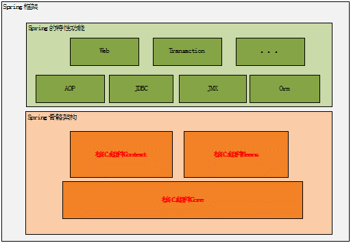

从上图中可以看出 Spring 框架中的核心组件只有三个：Core、Context 和 Beans。它们构建起了整个 Spring 的骨骼架构。没有它们就不可能有 AOP、Web 等上层的特性功能。下面也将主要从这三个组件入手分析 Spring。

### Spring 的设计理念

前面介绍了 Spring 的三个核心组件，如果再在它们三个中选出核心的话，那就非 Beans 组件莫属了，为何这样说，其实 Spring 就是面向 Bean 的编程（BOP,Bean Oriented Programming），Bean 在 Spring 中才是真正的主角。

Bean 在 Spring 中作用就像 Object 对 OOP 的意义一样，没有对象的概念就像没有面向对象编程，Spring 中没有 Bean 也就没有 Spring 存在的意义。就像一次演出舞台都准备好了但是却没有演员一样。为什么要 Bean 这种角色 Bean 或者为何在 Spring 如此重要，这由 Spring 框架的设计目标决定，Spring 为何如此流行，我们用 Spring 的原因是什么，想想你会发现原来 Spring 解决了一个非常关键的问题他可以让你把对象之间的依赖关系转而用配置文件来管理，也就是他的依赖注入机制。而这个注入关系在一个叫 Ioc 容器中管理，那 Ioc 容器就是被 Bean 包裹的对象。Spring 正是通过把对象包装在 Bean 中而达到对这些对象的管理以及一些列额外操作的目的。

它这种设计策略完全类似于 Java 实现 OOP 的设计理念，当然了 Java 本身的设计要比 Spring 复杂太多太多，但是都是构建一个数据结构，然后根据这个数据结构设计他的生存环境，并让它在这个环境中按照一定的规律在不停的运动，在它们的不停运动中设计一系列与环境或者与其他个体完成信息交换。这样想来我们用到的其他框架都是大慨类似的设计理念。

### 核心组件如何协同工作

前面说 Bean 是 Spring 中关键因素，那 Context 和 Core 又有何作用呢？前面把 Bean 比作一场演出中的演员的话，那 Context 就是这场演出的舞台背景，而 Core 应该就是演出的道具了。只有他们在一起才能具备演出一场好戏的最基本条件。当然有最基本的条件还不能使这场演出脱颖而出，还要他表演的节目足够的精彩，这些节目就是 Spring 能提供的特色功能了。

我们知道 Bean 包装的是 Object，而 Object 必然有数据，如何给这些数据提供生存环境就是 Context 要解决的问题，对 Context 来说他就是要发现每个 Bean 之间的关系，为它们建立这种关系并且要维护好这种关系。所以 Context 就是一个 Bean 关系的集合，这个关系集合又叫 Ioc 容器，一旦建立起这个 Ioc 容器后 Spring 就可以为你工作了。那 Core 组件又有什么用武之地呢？其实 Core 就是发现、建立和维护每个 Bean 之间的关系所需要的一些列的工具，从这个角度看来，Core 这个组件叫 Util 更能让你理解。

它们之间可以用下图来表示：

##### 图 2\. 三个组件关系

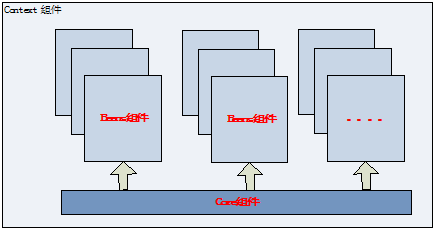

### 核心组件详解

这里将详细介绍每个组件内部类的层次关系，以及它们在运行时的时序顺序。我们在使用 Spring 是应该注意的地方。

**Bean 组件**

前面已经说明了 Bean 组件对 Spring 的重要性，下面看看 Bean 这个组件式怎么设计的。Bean 组件在 Spring 的 org.springframework.beans 包下。这个包下的所有类主要解决了三件事：Bean 的定义、Bean 的创建以及对 Bean 的解析。对 Spring 的使用者来说唯一需要关心的就是 Bean 的创建，其他两个由 Spring 在内部帮你完成了，对你来说是透明的。

Spring Bean 的创建时典型的工厂模式，它的顶级接口是 BeanFactory，下图是这个工厂的继承层次关系：

##### 图 3\. Bean 工厂的继承关系

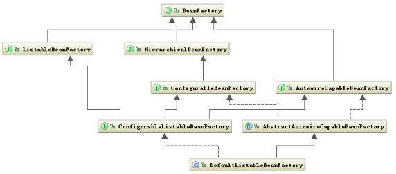

BeanFactory 有三个子类：ListableBeanFactory、HierarchicalBeanFactory 和 AutowireCapableBeanFactory。但是从上图中我们可以发现最终的默认实现类是 DefaultListableBeanFactory，实现了所有的接口。那为何要定义这么多层次的接口呢？查阅这些接口的源码和说明发现，每个接口都有使用的场合，它主要是为了区分在 Spring 内部对象的传递和转化过程中，对对象的数据访问所做的限制。例如 ListableBeanFactory 接口表示这些 Bean 是可列表的，而 HierarchicalBeanFactory 表示的这些 Bean 是有继承关系的，也就是每个 Bean 有可能有父 Bean。AutowireCapableBeanFactory 接口定义 Bean 的自动装配规则。这四个接口共同定义了 Bean 的集合、Bean 之间的关系、以及 Bean 行为。

Bean 的定义主要有 BeanDefinition 描述，如下图说明了这些类的层次关系：

##### 图 4\. Bean 定义的类层次关系图

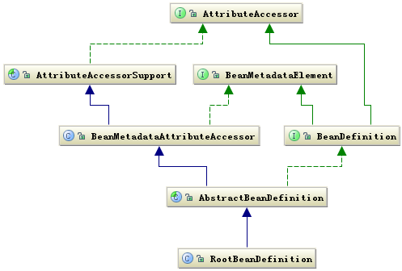

Bean 的定义就是完整的描述了在 Spring 的配置文件中你定义的  节点中所有的信息，包括各种子节点。当 Spring 成功解析你定义的一个  节点后，在 Spring 的内部就被转化成 BeanDefinition 对象。以后所有的操作都是对这个对象完成的。

Bean 的解析过程非常复杂，功能被分的很细，因为这里需要被扩展的地方很多，必须保证有足够的灵活性，以应对可能的变化。Bean 的解析主要就是对 Spring 配置文件的解析。这个解析过程主要通过下图中的类完成：

##### 图 5\. Bean 的解析类

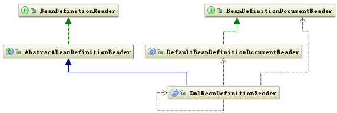

当然还有具体对 tag 的解析这里并没有列出。

**Context 组件**

Context 在 Spring 的 org.springframework.context 包下，前面已经讲解了 Context 组件在 Spring 中的作用，他实际上就是给 Spring 提供一个运行时的环境，用以保存各个对象的状态。下面看一下这个环境是如何构建的。

ApplicationContext 是 Context 的顶级父类，他除了能标识一个应用环境的基本信息外，他还继承了五个接口，这五个接口主要是扩展了 Context 的功能。下面是 Context 的类结构图：

##### 图 6\. Context 相关的类结构图

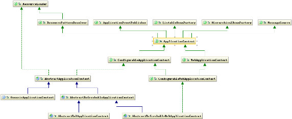

从上图中可以看出 ApplicationContext 继承了 BeanFactory，这也说明了 Spring 容器中运行的主体对象是 Bean，另外 ApplicationContext 继承了 ResourceLoader 接口，使得 ApplicationContext 可以访问到任何外部资源，这将在 Core 中详细说明。

ApplicationContext 的子类主要包含两个方面：

1. ConfigurableApplicationContext 表示该 Context 是可修改的，也就是在构建 Context 中用户可以动态添加或修改已有的配置信息，它下面又有多个子类，其中最经常使用的是可更新的 Context，即 AbstractRefreshableApplicationContext 类。
2. WebApplicationContext 顾名思义，就是为 web 准备的 Context 他可以直接访问到 ServletContext，通常情况下，这个接口使用的少。

再往下分就是按照构建 Context 的文件类型，接着就是访问 Context 的方式。这样一级一级构成了完整的 Context 等级层次。

总体来说 ApplicationContext 必须要完成以下几件事：

- 标识一个应用环境
- 利用 BeanFactory 创建 Bean 对象
- 保存对象关系表
- 能够捕获各种事件

Context 作为 Spring 的 Ioc 容器，基本上整合了 Spring 的大部分功能，或者说是大部分功能的基础。

**Core 组件**

Core 组件作为 Spring 的核心组件，他其中包含了很多的关键类，其中一个重要组成部分就是定义了资源的访问方式。这种把所有资源都抽象成一个接口的方式很值得在以后的设计中拿来学习。下面就重要看一下这个部分在 Spring 的作用。

下图是 Resource 相关的类结构图：

##### 图 7\. Resource 相关的类结构图

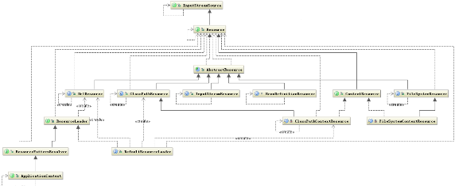

从上图可以看出 Resource 接口封装了各种可能的资源类型，也就是对使用者来说屏蔽了文件类型的不同。对资源的提供者来说，如何把资源包装起来交给其他人用这也是一个问题，我们看到 Resource 接口继承了 InputStreamSource 接口，这个接口中有个 getInputStream 方法，返回的是 InputStream 类。这样所有的资源都被可以通过 InputStream 这个类来获取，所以也屏蔽了资源的提供者。另外还有一个问题就是加载资源的问题，也就是资源的加载者要统一，从上图中可以看出这个任务是由 ResourceLoader 接口完成，他屏蔽了所有的资源加载者的差异，只需要实现这个接口就可以加载所有的资源，他的默认实现是 DefaultResourceLoader。

下面看一下 Context 和 Resource 是如何建立关系的？首先看一下他们的类关系图：

##### 图 8\. Context 和 Resource 的类关系图

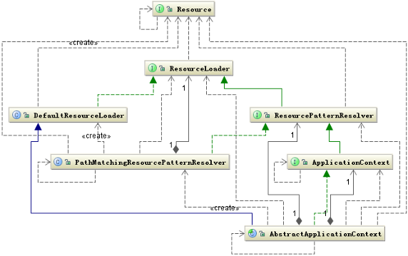

从上图可以看出，Context 是把资源的加载、解析和描述工作委托给了 ResourcePatternResolver 类来完成，他相当于一个接头人，他把资源的加载、解析和资源的定义整合在一起便于其他组件使用。Core 组件中还有很多类似的方式。

**Ioc 容器如何工作**

前面介绍了 Core 组件、Bean 组件和 Context 组件的结构与相互关系，下面这里从使用者角度看一下他们是如何运行的，以及我们如何让 Spring 完成各种功能，Spring 到底能有那些功能，这些功能是如何得来的，下面介绍。

**如何创建 BeanFactory 工厂**

正如图 2 描述的那样，Ioc 容器实际上就是 Context 组件结合其他两个组件共同构建了一个 Bean 关系网，如何构建这个关系网？构建的入口就在 AbstractApplicationContext 类的 refresh 方法中。这个方法的代码如下：

##### 清单 1\. AbstractApplicationContext.refresh

```
public void refresh() throws BeansException, IllegalStateException {
    synchronized (this.startupShutdownMonitor) {
        // Prepare this context for refreshing.
        prepareRefresh();
        // Tell the subclass to refresh the internal bean factory.
        ConfigurableListableBeanFactory beanFactory = obtainFreshBeanFactory();
        // Prepare the bean factory for use in this context.
        prepareBeanFactory(beanFactory);
        try {
            // Allows post-processing of the bean factory in context subclasses.
            postProcessBeanFactory(beanFactory);
            // Invoke factory processors registered as beans in the context.
            invokeBeanFactoryPostProcessors(beanFactory);
            // Register bean processors that intercept bean creation.
            registerBeanPostProcessors(beanFactory);
            // Initialize message source for this context.
            initMessageSource();
            // Initialize event multicaster for this context.
            initApplicationEventMulticaster();
            // Initialize other special beans in specific context subclasses.
            onRefresh();
            // Check for listener beans and register them.
            registerListeners();
            // Instantiate all remaining (non-lazy-init) singletons.
            finishBeanFactoryInitialization(beanFactory);
            // Last step: publish corresponding event.
            finishRefresh();
        }
        catch (BeansException ex) {
            // Destroy already created singletons to avoid dangling resources.
            destroyBeans();
            // Reset 'active' flag.
            cancelRefresh(ex);
            // Propagate exception to caller.
            throw ex;
        }
    }
}

```

Show moreShow more icon

这个方法就是构建整个 Ioc 容器过程的完整的代码，了解了里面的每一行代码基本上就了解大部分 Spring 的原理和功能了。

这段代码主要包含这样几个步骤：

- 构建 BeanFactory，以便于产生所需的”演员”
- 注册可能感兴趣的事件
- 创建 Bean 实例对象
- 触发被监听的事件

下面就结合代码分析这几个过程。

第二三句就是在创建和配置 BeanFactory。这里是 refresh 也就是刷新配置，前面介绍了 Context 有可更新的子类，这里正是实现这个功能，当 BeanFactory 已存在是就更新，如果没有就新创建。下面是更新 BeanFactory 的方法代码：

##### 清单 2\. AbstractRefreshableApplicationContext. refreshBeanFactory

```
protected final void refreshBeanFactory() throws BeansException {
    if (hasBeanFactory()) {
        destroyBeans();
        closeBeanFactory();
    }
    try {
        DefaultListableBeanFactory beanFactory = createBeanFactory();
        beanFactory.setSerializationId(getId());
        customizeBeanFactory(beanFactory);
        loadBeanDefinitions(beanFactory);
        synchronized (this.beanFactoryMonitor) {
            this.beanFactory = beanFactory;
        }
    }
    catch (IOException ex) {
        throw new ApplicationContextException(
            "I/O error parsing bean definition source for "
            + getDisplayName(), ex);
    }
}

```

Show moreShow more icon

这个方法实现了 AbstractApplicationContext 的抽象方法 refreshBeanFactory，这段代码清楚的说明了 BeanFactory 的创建过程。注意 BeanFactory 对象的类型的变化，前面介绍了他有很多子类，在什么情况下使用不同的子类这非常关键。BeanFactory 的原始对象是 DefaultListableBeanFactory，这个非常关键，因为他设计到后面对这个对象的多种操作，下面看一下这个类的继承层次类图：

##### 图 9\. DefaultListableBeanFactory 类继承关系图

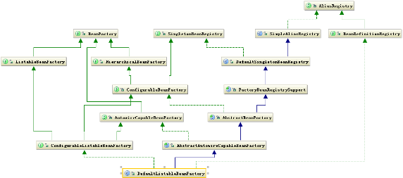

从这个图中发现除了 BeanFactory 相关的类外，还发现了与 Bean 的 register 相关。这在 refreshBeanFactory 方法中有一行 loadBeanDefinitions(beanFactory) 将找到答案，这个方法将开始加载、解析 Bean 的定义，也就是把用户定义的数据结构转化为 Ioc 容器中的特定数据结构。

这个过程可以用下面时序图解释：

##### 图 10\. 创建 BeanFactory 时序图

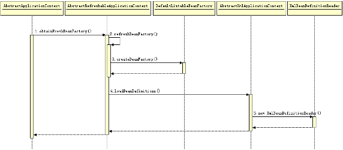

Bean 的解析和登记流程时序图如下：

##### 图 11\. 解析和登记 Bean 对象时序图

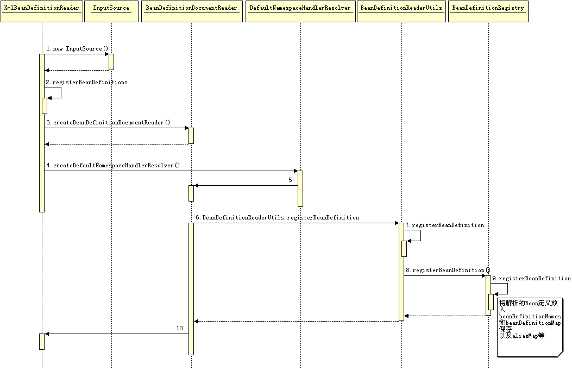

创建好 BeanFactory 后，接下去添加一些 Spring 本身需要的一些工具类，这个操作在 AbstractApplicationContext 的 prepareBeanFactory 方法完成。

AbstractApplicationContext 中接下来的三行代码对 Spring 的功能扩展性起了至关重要的作用。前两行主要是让你现在可以对已经构建的 BeanFactory 的配置做修改，后面一行就是让你可以对以后再创建 Bean 的实例对象时添加一些自定义的操作。所以他们都是扩展了 Spring 的功能，所以我们要学习使用 Spring 必须对这一部分搞清楚。

其中在 invokeBeanFactoryPostProcessors 方法中主要是获取实现 BeanFactoryPostProcessor 接口的子类。并执行它的 postProcessBeanFactory 方法，这个方法的声明如下：

##### 清单 3\. BeanFactoryPostProcessor.postProcessBeanFactory

```
void postProcessBeanFactory(ConfigurableListableBeanFactory beanFactory)
    throws BeansException;

```

Show moreShow more icon

它的参数是 beanFactory，说明可以对 beanFactory 做修改，这里注意这个 beanFactory 是 ConfigurableListableBeanFactory 类型的，这也印证了前面介绍的不同 BeanFactory 所使用的场合不同，这里只能是可配置的 BeanFactory，防止一些数据被用户随意修改。

registerBeanPostProcessors 方法也是可以获取用户定义的实现了 BeanPostProcessor 接口的子类，并执行把它们注册到 BeanFactory 对象中的 beanPostProcessors 变量中。BeanPostProcessor 中声明了两个方法：postProcessBeforeInitialization、postProcessAfterInitialization 分别用于在 Bean 对象初始化时执行。可以执行用户自定义的操作。

后面的几行代码是初始化监听事件和对系统的其他监听者的注册，监听者必须是 ApplicationListener 的子类。

**如何创建 Bean 实例并构建 Bean 的关系网**

下面就是 Bean 的实例化代码，是从 finishBeanFactoryInitialization 方法开始的。

##### 清单 4\. AbstractApplicationContext.finishBeanFactoryInitialization

```
protected void finishBeanFactoryInitialization(
    ConfigurableListableBeanFactory beanFactory) {

    // Stop using the temporary ClassLoader for type matching.
    beanFactory.setTempClassLoader(null);

    // Allow for caching all bean definition metadata, not expecting further changes.
    beanFactory.freezeConfiguration();

    // Instantiate all remaining (non-lazy-init) singletons.
    beanFactory.preInstantiateSingletons();
}

```

Show moreShow more icon

从上面代码中可以发现 Bean 的实例化是在 BeanFactory 中发生的。preInstantiateSingletons 方法的代码如下：

##### 清单 5\. DefaultListableBeanFactory.preInstantiateSingletons

```
public void preInstantiateSingletons() throws BeansException {
    if (this.logger.isInfoEnabled()) {
        this.logger.info("Pre-instantiating singletons in " + this);
    }
    synchronized (this.beanDefinitionMap) {
        for (String beanName : this.beanDefinitionNames) {
            RootBeanDefinition bd = getMergedLocalBeanDefinition(beanName);
            if (!bd.isAbstract() && bd.isSingleton()
                && !bd.isLazyInit()) {
                if (isFactoryBean(beanName)) {
                    final FactoryBean factory =
                        (FactoryBean) getBean(FACTORY_BEAN_PREFIX+ beanName);
                    boolean isEagerInit;
                    if (System.getSecurityManager() != null
                        && factory instanceof SmartFactoryBean) {
                        isEagerInit = AccessController.doPrivileged(
                            new PrivilegedAction<Boolean>() {
                            public Boolean run() {
                                return ((SmartFactoryBean) factory).isEagerInit();
                            }
                        }, getAccessControlContext());
                    }
                    else {
                        isEagerInit = factory instanceof SmartFactoryBean
                            && ((SmartFactoryBean) factory).isEagerInit();
                    }
                    if (isEagerInit) {
                        getBean(beanName);
                    }
                }
                else {
                    getBean(beanName);
                }
            }
        }
    }
}

```

Show moreShow more icon

这里出现了一个非常重要的 Bean —— FactoryBean，可以说 Spring 一大半的扩展的功能都与这个 Bean 有关，这是个特殊的 Bean 是一个工厂 Bean，可以产生 Bean 的 Bean，这里的产生 Bean 是指 Bean 的实例，如果一个类继承 FactoryBean 用户只要实现他的 getObject 方法，就可以自己定义产生实例对象的方法。然而在 Spring 内部这个 Bean 的实例对象是 FactoryBean，通过调用这个对象的 getObject 方法就能获取用户自定义产生的对象，从而为 Spring 提供了很好的扩展性。Spring 获取 FactoryBean 本身的对象是在前面加上 & 来完成的。

如何创建 Bean 的实例对象以及如何构建 Bean 实例对象之间的关联关系式 Spring 中的一个核心关键，下面是这个过程的流程图。

##### 图 12.Bean 实例创建流程图

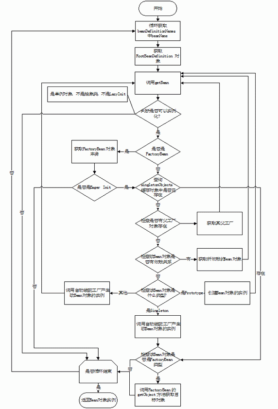

如果是普通的 Bean 就直接创建他的实例，是通过调用 getBean 方法。下面是创建 Bean 实例的时序图：

##### 图 13.Bean 实例创建时序图

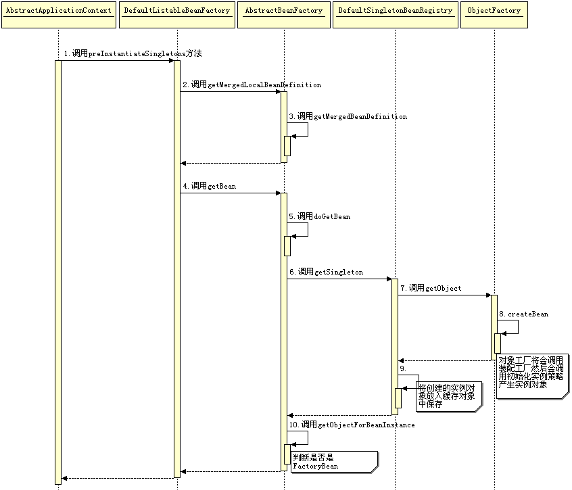

还有一个非常重要的部分就是建立 Bean 对象实例之间的关系，这也是 Spring 框架的核心竞争力，何时、如何建立他们之间的关系请看下面的时序图：

##### 图 14.Bean 对象关系建立

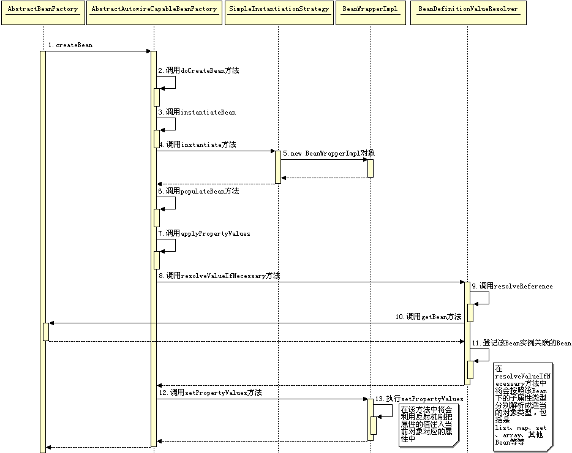

**Ioc 容器的扩展点**

现在还有一个问题就是如何让这些 Bean 对象有一定的扩展性，就是可以加入用户的一些操作。那么有哪些扩展点呢？ Spring 又是如何调用到这些扩展点的？

对 Spring 的 Ioc 容器来说，主要有这么几个。BeanFactoryPostProcessor， BeanPostProcessor。他们分别是在构建 BeanFactory 和构建 Bean 对象时调用。还有就是 InitializingBean 和 DisposableBean， 他们分别是在 Bean 实例创建和销毁时被调用。用户可以实现这些接口中定义的方法，Spring 就会在适当的时候调用他们。还有一个是 FactoryBean 他是个特殊的 Bean，这个 Bean 可以被用户更多的控制。

这些扩展点通常也是我们使用 Spring 来完成我们特定任务的地方，如何精通 Spring 就看你有没有掌握好 Spring 有哪些扩展点，并且如何使用他们，要知道如何使用他们就必须了解他们内在的机理。可以用下面一个比喻来解释。

我们把 Ioc 容器比作一个箱子，这个箱子里有若干个球的模子，可以用这些模子来造很多种不同的球，还有一个造这些球模的机器，这个机器可以产生球模。那么他们的对应关系就是：BeanFactory 是那个造球模的机器，球模就是 Bean，而球模造出来的球就是 Bean 的实例。那前面所说的几个扩展点又在什么地方呢？ BeanFactoryPostProcessor 对应到当造球模被造出来时，你将有机会可以对其做出适当的修正，也就是他可以帮你修改球模。而 InitializingBean 和 DisposableBean 是在球模造球的开始和结束阶段，你可以完成一些预备和扫尾工作。BeanPostProcessor 就可以让你对球模造出来的球做出适当的修正。最后还有一个 FactoryBean，它可是一个神奇的球模。这个球模不是预先就定型了，而是由你来给他确定它的形状，既然你可以确定这个球模型的形状，当然他造出来的球肯定就是你想要的球了，这样在这个箱子里你可以发现所有你想要的球。

**Ioc 容器如何为我所用**

前面的介绍了 Spring 容器的构建过程，那 Spring 能为我们做什么，Spring 的 Ioc 容器又能做什么呢？我们使用 Spring 必须要首先构建 Ioc 容器，没有它 Spring 无法工作，ApplicatonContext.xml 就是 Ioc 容器的默认配置文件，Spring 的所有特性功能都是基于这个 Ioc 容器工作的，比如后面要介绍的 AOP。

Ioc 它实际上就是为你构建了一个魔方，Spring 为你搭好了骨骼架构，这个魔方到底能变出什么好的东西出来，这必须要有你的参与。那我们怎么参与？这就是前面说的要了解 Spring 中有哪些扩展点，我们通过实现那些扩展点来改变 Spring 的通用行为。至于如何实现扩展点来得到我们想要的个性结果，Spring 中有很多例子，其中 AOP 的实现就是 Spring 本身实现了其扩展点来达到了它想要的特性功能，可以拿来参考。

## Spring 中 AOP 特性详解

### 动态代理的实现原理

要了解 Spring 的 AOP 就必须先了解动态代理的原理，因为 AOP 就是基于动态代理实现的。动态代理还要从 JDK 本身说起。

在 Jdk 的 java.lang.reflect 包下有个 Proxy 类，它正是构造代理类的入口。这个类的结构入下：

##### 图 15\. Proxy 类结构

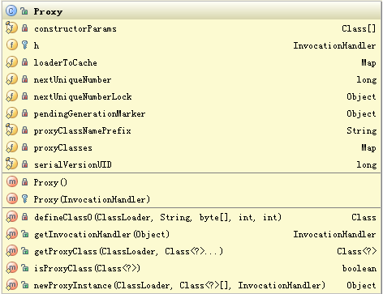

从上图发现最后面四个是公有方法。而最后一个方法 newProxyInstance 就是创建代理对象的方法。这个方法的源码如下：

##### 清单 6\. Proxy. newProxyInstance

```
public static Object newProxyInstance(ClassLoader loader,
    Class<?>[] interfaces,
    InvocationHandler h)
    throws IllegalArgumentException {

    if (h == null) {
        throw new NullPointerException();
    }
    Class cl = getProxyClass(loader, interfaces);
    try {
        Constructor cons = cl.getConstructor(constructorParams);
        return (Object) cons.newInstance(new Object[] { h });
    } catch (NoSuchMethodException e) {
        throw new InternalError(e.toString());
    } catch (IllegalAccessException e) {
        throw new InternalError(e.toString());
    } catch (InstantiationException e) {
        throw new InternalError(e.toString());
    } catch (InvocationTargetException e) {
        throw new InternalError(e.toString());
    }
}

```

Show moreShow more icon

这个方法需要三个参数：ClassLoader，用于加载代理类的 Loader 类，通常这个 Loader 和被代理的类是同一个 Loader 类。Interfaces，是要被代理的那些那些接口。InvocationHandler，就是用于执行除了被代理接口中方法之外的用户自定义的操作，他也是用户需要代理的最终目的。用户调用目标方法都被代理到 InvocationHandler 类中定义的唯一方法 invoke 中。这在后面再详解。

下面还是看看 Proxy 如何产生代理类的过程，他构造出来的代理类到底是什么样子？下面揭晓啦。

##### 图 16\. 创建代理对象时序图

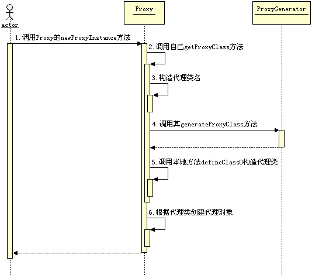

其实从上图中可以发现正在构造代理类的是在 ProxyGenerator 的 generateProxyClass 的方法中。ProxyGenerator 类在 sun.misc 包下，感兴趣的话可以看看他的源码。

假如有这样一个接口，如下：

##### 清单 7\. SimpleProxy 类

```
public interface SimpleProxy {

    public void simpleMethod1();

    public void simpleMethod2();

}

```

Show moreShow more icon

代理来生成的类结构如下：

##### 清单 8\. $Proxy2 类

```
public class $Proxy2 extends java.lang.reflect.Proxy implements SimpleProxy{
    java.lang.reflect.Method m0;
    java.lang.reflect.Method m1;
    java.lang.reflect.Method m2;
    java.lang.reflect.Method m3;
    java.lang.reflect.Method m4;

    int hashCode();
    boolean equals(java.lang.Object);
    java.lang.String toString();
    void simpleMethod1();
    void simpleMethod2();
}

```

Show moreShow more icon

这个类中的方法里面将会是调用 InvocationHandler 的 invoke 方法，而每个方法也将对应一个属性变量，这个属性变量 m 也将传给 invoke 方法中的 Method 参数。整个代理就是这样实现的。

### Spring AOP 如何实现

从前面代理的原理我们知道，代理的目的是调用目标方法时我们可以转而执行 InvocationHandler 类的 invoke 方法，所以如何在 InvocationHandler 上做文章就是 Spring 实现 Aop 的关键所在。

Spring 的 Aop 实现是遵守 Aop 联盟的约定。同时 Spring 又扩展了它，增加了如 Pointcut、Advisor 等一些接口使得更加灵活。

下面是 Jdk 动态代理的类图：

##### 图 17\. Jdk 动态代理的类图

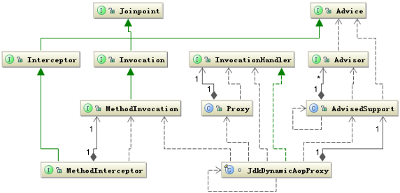

上图清楚的显示了 Spring 引用了 Aop Alliance 定义的接口。姑且不讨论 Spring 如何扩展 Aop Alliance，先看看 Spring 如何实现代理类的，要实现代理类在 Spring 的配置文件中通常是这样定一个 Bean 的，如下：

##### 清单 9\. 配置代理类 Bean

```
<bean id="testBeanSingleton"
    class="org.springframework.aop.framework.ProxyFactoryBean">
    <property name="proxyInterfaces">
        <value>
            org.springframework.aop.framework.PrototypeTargetTests$TestBean
        </value>
    </property>
    <property name="target"><ref local="testBeanTarget"></ref> </property>
    <property name="singleton"><value>true</value></property>
    <property name="interceptorNames">
        <list>
            <value>testInterceptor</value>
            <value>testInterceptor2</value>
        </list>
    </property>
</bean>

```

Show moreShow more icon

配置上看到要设置被代理的接口，和接口的实现类也就是目标类，以及拦截器也就在执行目标方法之前被调用，这里 Spring 中定义的各种各样的拦截器，可以选择使用。

下面看看 Spring 如何完成了代理以及是如何调用拦截器的。

前面提到 Spring Aop 也是实现其自身的扩展点来完成这个特性的，从这个代理类可以看出它正是继承了 FactoryBean 的 ProxyFactoryBean，FactoryBean 之所以特别就在于它可以让你自定义对象的创建方法。当然代理对象要通过 Proxy 类来动态生成。

下面是 Spring 创建的代理对象的时序图：

##### 图 18.Spring 代理对象的产生

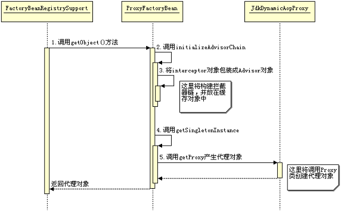

Spring 创建了代理对象后，当你调用目标对象上的方法时，将都会被代理到 InvocationHandler 类的 invoke 方法中执行，这在前面已经解释。在这里 JdkDynamicAopProxy 类实现了 InvocationHandler 接口。

下面再看看 Spring 是如何调用拦截器的，下面是这个过程的时序图：

##### 图 19.Spring 调用拦截器

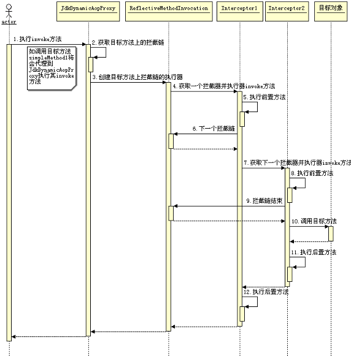

以上所说的都是 Jdk 动态代理，Spring 还支持一种 CGLIB 类代理，感兴趣自己看吧。

## Spring 中设计模式分析

Spring 中使用的设计模式也很多，比如工厂模式、单例模式、模版模式等，在《 Webx 框架的系统架构与设计模式》、《 Tomcat 的系统架构与模式设计分析》已经有介绍，这里就不赘述了。这里主要介绍代理模式和策略模式。

### 代理模式

**代理模式原理**

代理模式就是给某一个对象创建一个代理对象，而由这个代理对象控制对原对象的引用，而创建这个代理对象就是可以在调用原对象时增加一些额外的操作。下面是代理模式的结构：

##### 图 20\. 代理模式的结构

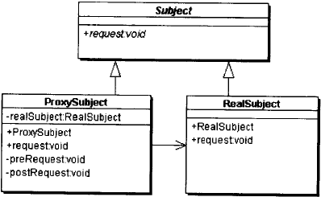

- Subject：抽象主题，它是代理对象的真实对象要实现的接口，当然这可以由多个接口组成。
- ProxySubject：代理类除了实现抽象主题定义的接口外，还必须持有所代理对象的引用
- RealSubject：被代理的类，是目标对象。

**Spring 中如何实现代理模式**

Spring Aop 中 Jdk 动态代理就是利用代理模式技术实现的。在 Spring 中除了实现被代理对象的接口外，还会有 org.springframework.aop.SpringProxy 和 org.springframework.aop.framework.Advised 两个接口。Spring 中使用代理模式的结构图如下：

##### 图 21\. Spring 中使用代理模式的结构图

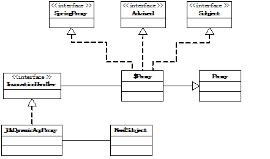

$Proxy 就是创建的代理对象，而 Subject 是抽象主题，代理对象是通过 InvocationHandler 来持有对目标对象的引用的。

Spring 中一个真实的代理对象结构如下：

##### 清单 10 代理对象 $Proxy4

```
public class $Proxy4 extends java.lang.reflect.Proxy implements
    org.springframework.aop.framework.PrototypeTargetTests$TestBean
    org.springframework.aop.SpringProxy
    org.springframework.aop.framework.Advised
{
    java.lang.reflect.Method m16;
    java.lang.reflect.Method m9;
    java.lang.reflect.Method m25;
    java.lang.reflect.Method m5;
    java.lang.reflect.Method m2;
    java.lang.reflect.Method m23;
    java.lang.reflect.Method m18;
    java.lang.reflect.Method m26;
    java.lang.reflect.Method m6;
    java.lang.reflect.Method m28;
    java.lang.reflect.Method m14;
    java.lang.reflect.Method m12;
    java.lang.reflect.Method m27;
    java.lang.reflect.Method m11;
    java.lang.reflect.Method m22;
    java.lang.reflect.Method m3;
    java.lang.reflect.Method m8;
    java.lang.reflect.Method m4;
    java.lang.reflect.Method m19;
    java.lang.reflect.Method m7;
    java.lang.reflect.Method m15;
    java.lang.reflect.Method m20;
    java.lang.reflect.Method m10;
    java.lang.reflect.Method m1;
    java.lang.reflect.Method m17;
    java.lang.reflect.Method m21;
    java.lang.reflect.Method m0;
    java.lang.reflect.Method m13;
    java.lang.reflect.Method m24;

    int hashCode();
    int indexOf(org.springframework.aop.Advisor);
    int indexOf(org.aopalliance.aop.Advice);
    boolean equals(java.lang.Object);
    java.lang.String toString();
    void sayhello();
    void doSomething();
    void doSomething2();
    java.lang.Class getProxiedInterfaces();
    java.lang.Class getTargetClass();
    boolean isProxyTargetClass();
    org.springframework.aop.Advisor; getAdvisors();
    void addAdvisor(int, org.springframework.aop.Advisor)
        throws org.springframework.aop.framework.AopConfigException;
    void addAdvisor(org.springframework.aop.Advisor)
        throws org.springframework.aop.framework.AopConfigException;
    void setTargetSource(org.springframework.aop.TargetSource);
    org.springframework.aop.TargetSource getTargetSource();
    void setPreFiltered(boolean);
    boolean isPreFiltered();
    boolean isInterfaceProxied(java.lang.Class);
    boolean removeAdvisor(org.springframework.aop.Advisor);
    void removeAdvisor(int)throws org.springframework.aop.framework.AopConfigException;
    boolean replaceAdvisor(org.springframework.aop.Advisor,
        org.springframework.aop.Advisor)
        throws org.springframework.aop.framework.AopConfigException;
    void addAdvice(org.aopalliance.aop.Advice)
        throws org.springframework.aop.framework.AopConfigException;
    void addAdvice(int, org.aopalliance.aop.Advice)
        throws org.springframework.aop.framework.AopConfigException;
    boolean removeAdvice(org.aopalliance.aop.Advice);
    java.lang.String toProxyConfigString();
    boolean isFrozen();
    void setExposeProxy(boolean);
    boolean isExposeProxy();
}

```

Show moreShow more icon

### 策略模式

**策略模式原理**

策略模式顾名思义就是做某事的策略，这在编程上通常是指完成某个操作可能有多种方法，这些方法各有千秋，可能有不同的适应的场合，然而这些操作方法都有可能用到。各一个操作方法都当作一个实现策略，使用者可能根据需要选择合适的策略。

下面是策略模式的结构：

##### 图 22\. 策略模式的结构

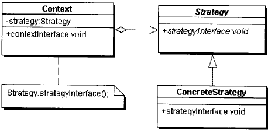

- Context：使用不同策略的环境，它可以根据自身的条件选择不同的策略实现类来完成所要的操作。它持有一个策略实例的引用。创建具体策略对象的方法也可以由他完成。
- Strategy：抽象策略，定义每个策略都要实现的策略方法
- ConcreteStrategy：具体策略实现类，实现抽象策略中定义的策略方法

**Spring 中策略模式的实现**

Spring 中策略模式使用有多个地方，如 Bean 定义对象的创建以及代理对象的创建等。这里主要看一下代理对象创建的策略模式的实现。

前面已经了解 Spring 的代理方式有两个 Jdk 动态代理和 CGLIB 代理。这两个代理方式的使用正是使用了策略模式。它的结构图如下所示：

##### 图 23\. Spring 中策略模式结构图

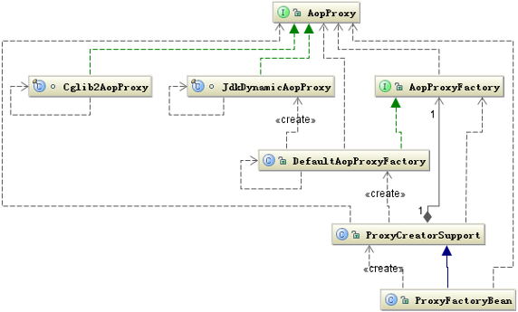

在上面结构图中与标准的策略模式结构稍微有点不同，这里抽象策略是 AopProxy 接口，Cglib2AopProxy 和 JdkDynamicAopProxy 分别代表两种策略的实现方式，ProxyFactoryBean 就是代表 Context 角色，它根据条件选择使用 Jdk 代理方式还是 CGLIB 方式，而另外三个类主要是来负责创建具体策略对象，ProxyFactoryBean 是通过依赖的方法来关联具体策略对象的，它是通过调用策略对象的 getProxy(ClassLoader classLoader) 方法来完成操作。

## 结束语

本文通过从 Spring 的几个核心组件入手，试图找出构建 Spring 框架的骨骼架构，进而分析 Spring 在设计时的一些设计理念，是否从中找出一些好的设计思想，对我们以后程序设计能提供一些思路。接着再详细分析了 Spring 中是如何实现这些理念的，以及在设计模式上是如何使用的。

通过分析 Spring 给我一个很大的启示就是这套设计理念其实对我们有很强的借鉴意义，它通过抽象复杂多变的对象，进一步做规范，然后根据它定义的这套规范设计出一个容器，容器中构建它们的复杂关系，其实现在有很多情况都可以用这种类似的处理方法。

虽然我很想把我对 Spring 的理解完全阐述清楚，但是所谓 “书不尽言，言不尽意。”，有什么不对或者不清楚的地方大家还是看看其源码吧。