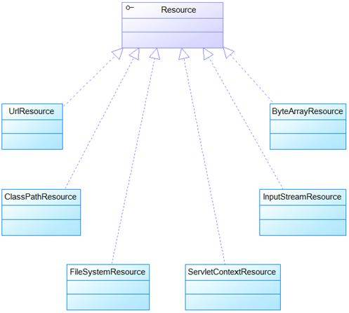

# Spring 资源访问剖析和策略模式应用
从策略模式的角度来深入分析 Spring 资源访问的源码实现

**标签:** Java

[原文链接](https://developer.ibm.com/zh/articles/j-lo-spring-resource/)

李刚

发布: 2011-05-19

* * *

## Spring 资源访问剖析和策略模式应用

Spring 把所有能记录信息的载体，如各种类型的文件、二进制流等都称为资源，对 Spring 开发者来说，最常用的资源就是 Spring 配置文件（通常是一份 XML 格式的文件）。

在 Sun 所提供的标准 API 里，资源访问通常由 java.net.URL 和文件 IO 来完成，尤其是当我们需要访问来自网络的资源时，通常会选择 URL 类。

URL 类可以处理一些常规的资源访问问题，但依然不能很好地满足所有底层资源访问的需要，比如，暂时还无法从类加载路径、或相对于 ServletContext 的路径来访问资源，虽然 Java 允许使用特定的 URL 前缀注册新的处理类（例如已有的 http: 前缀的处理类），但是这样做通常比较复杂，而且 URL 接口还缺少一些有用的功能，比如检查所指向的资源是否存在等。

Spring 改进了 Java 资源访问的策略。Spring 为资源访问提供了一个 Resource 接口，该接口提供了更强的资源访问能力，Spring 框架本身大量使用了 Resource 接口来访问底层资源。

Resource 接口是具体资源访问策略的抽象，也是所有资源访问类所实现的接口。Resource 接口主要提供了如下几个方法：

- getInputStream()：定位并打开资源，返回资源对应的输入流。每次调用都返回新的输入流。调用者必须负责关闭输入流。
- exists()：返回 Resource 所指向的资源是否存在。
- isOpen()：返回资源文件是否打开，如果资源文件不能多次读取，每次读取结束应该显式关闭，以防止资源泄漏。
- getDescription()：返回资源的描述信息，通常用于资源处理出错时输出该信息，通常是全限定文件名或实际 URL。
- getFile：返回资源对应的 File 对象。
- getURL：返回资源对应的 URL 对象。

**Resource 和策略模式** Resource 接口就是策略模式的典型应用，Resource 接口就代表资源访问策略，但具体采用哪种策略实现，Resource 接口并不理会。客户端程序只和 Resource 接口耦合，并不知道底层采用何种资源访问策略，这样应用可以在不同的资源访问策略之间自由切换。

最后两个方法通常无须使用，仅在通过简单方式访问无法实现时，Resource 提供传统的资源访问的功能。

Resource 接口本身没有提供访问任何底层资源的实现逻辑，针对不同的底层资源，Spring 将会提供不同的 Resource 实现类，不同的实现类负责不同的资源访问逻辑。

Resource 不仅可在 Spring 的项目中使用，也可直接作为资源访问的工具类使用。意思是说：即使不使用 Spring 框架，也可以使用 Resource 作为工具类，用来代替 URL。当然，使用 Resource 接口会让代码与 Spring 的接口耦合在一起，但这种耦合只是部分工具集的耦合，不会造成太大的代码污染。

## Resource 的实现类

Resource 接口是 Spring 资源访问策略的抽象，它本身并不提供任何资源访问实现，具体的资源访问由该接口的实现类完成——每个实现类代表一种资源访问策略。

Spring 为 Resource 接口提供了如下实现类：

- UrlResource：访问网络资源的实现类。
- ClassPathResource：访问类加载路径里资源的实现类。
- FileSystemResource：访问文件系统里资源的实现类。
- ServletContextResource：访问相对于 ServletContext 路径里的资源的实现类：
- InputStreamResource：访问输入流资源的实现类。
- ByteArrayResource：访问字节数组资源的实现类。

这些 Resource 实现类，针对不同的的底层资源，提供了相应的资源访问逻辑，并提供便捷的包装，以利于客户端程序的资源访问。

**使用 UrlResource 访问网络资源**

访问网络资源通过 UrlResource 类实现，UrlResource 是 java.net.URL 类的包装，主要用于访问之前通过 URL 类访问的资源对象。URL 资源通常应该提供标准的协议前缀。例如：file: 用于访问文件系统；http: 用于通过 HTTP 协议访问资源；ftp: 用于通过 FTP 协议访问资源等。

UrlResource 类实现 Resource 接口，对 Resource 全部方法提供了实现，完全支持 Resource 的全部 API。下面代码示范了使用 UrlResource 访问文件系统资源的示例。程序如下：

##### 清单 1\. UrlResourceTest.java

```
public class UrlResourceTest
{
public static void main(String[] args) throws Exception
{
// 创建一个 Resource 对象，指定从文件系统里读取资源
UrlResource ur = new UrlResource("file:book.xml");
// 获取该资源的简单信息
System.out.println(ur.getFilename());
System.out.println(ur.getDescription());
// 创建 Dom4j 的解析器
SAXReader reader = new SAXReader();
Document doc = reader.read(ur.getFile());
// 获取根元素
Element el = doc.getRootElement();
List l = el.elements();
// 此处省略了访问、输出 XML 文档内容的代码。
...
}
}

```

Show moreShow more icon

上面程序中粗体字代码使用 UrlResource 来访问本地磁盘资源，虽然 UrlResource 是为访问网络资源而设计的，但通过使用 file 前缀也可访问本地磁盘资源。如果需要访问网络资源，可以使用如下两个常用前缀：

- http:－该前缀用于访问基于 HTTP 协议的网络资源。
- ftp:－该前缀用于访问基于 FTP 协议的网络资源。

由于 UrlResource 是对 java.net.URL 的封装，所以 UrlResource 支持的前缀与 URL 类所支持的前缀完全相同。

将应用所需的 book.xml 访问放在应用的当前路径，运行该程序，即可看到使用 UrlResource 访问本地磁盘资源的效果。

**使用 ClassPathResource 访问类加载路径下的资源。**

ClassPathResource 用来访问类加载路径下的资源，相对于其他的 Resource 实现类，其主要优势是方便访问类加载路径里的资源，尤其对于 Web 应用，ClassPathResource 可自动搜索位于 WEB-INF/classes 下的资源文件，无须使用绝对路径访问。

下面示例程序示范了将 book.xml 放在类加载路径下，然后使用如下程序访问它：

##### 清单 2\. ClassPathResourceTest.java

```
public class ClassPathResourceTest
{
public static void main(String[] args) throws Exception
{
// 创建一个 Resource 对象，从类加载路径里读取资源
ClassPathResource cr = new ClassPathResource("book.xml");
// 获取该资源的简单信息
System.out.println(cr.getFilename());
System.out.println(cr.getDescription());
// 创建 Dom4j 的解析器
SAXReader reader = new SAXReader();
Document doc = reader.read(cr.getFile());
// 获取根元素
Element el = doc.getRootElement();
List l = el.elements();
// 此处省略了访问、输出 XML 文档内容的代码。
...
}
}

```

Show moreShow more icon

上面程序的粗体字代码用于访问类加载路径下的 book.xml 文件，对比前面进行资源访问的 2 个示例程序，我们发现两个程序除了进行资源访问的代码有所区别之外，其他程序代码基本一致，这就是 Spring 资源访问的优势：Spring 的资源访问消除了底层资源访问的差异，允许程序以一致的方式来访问不同的底层资源。

ClassPathResource 实例可使用 ClassPathResource 构造器显式地创建，但更多的时候它都是隐式创建的，当执行 Spring 的某个方法时，该方法接受一个代表资源路径的字符串参数，当 Spring 识别该字符串参数中包含 classpath: 前缀后，系统将会自动创建 ClassPathResource 对象。

**使用 FileSystemResource 访问文件系统资源**

Spring 提供的 FileSystemResource 类用于访问文件系统资源，使用 FileSystemResource 来访问文件系统资源并没有太大的优势，因为 Java 提供的 File 类也可用于访问文件系统资源。

当然使用 FileSystemResource 也可消除底层资源访问的差异，程序通过统一的 Resource API 来进行资源访问。下面程序是使用 FileSystemResource 来访问文件系统资源的示例程序。

##### 清单 3\. FileSystemResourceTest.java

```
public class FileSystemResourceTest
{
public static void main(String[] args) throws Exception
{
// 默认从文件系统的当前路径加载 book.xml 资源
FileSystemResource fr = new FileSystemResource("book.xml");
// 获取该资源的简单信息
System.out.println(fr.getFilename());
System.out.println(fr.getDescription());
// 创建 Dom4j 的解析器
SAXReader reader = new SAXReader();
Document doc = reader.read(fr.getFile());
// 获取根元素
Element el = doc.getRootElement();
List l = el.elements();
// 此处省略了访问、输出 XML 文档内容的代码。
...
}
}

```

Show moreShow more icon

与前两种 Resource 作资源访问的区别在于：资源字符串确定的资源，位于本地文件系统内 ，而且无须使用任何前缀。

FileSystemResource 实例可使用 FileSystemResource 构造器显式地创建。但更多的时候它都是隐式创建的，执行 Spring 的某个方法时，该方法接受一个代表资源路径的字符串参数，当 Spring 识别该字符串参数中包含 file: 前缀后，系统将会自动创建 FileSystemResource 对象。

通过上面代码不难发现，程序使用 UrlResource、FileSystemResource、ClassPathResource 三个实现类来访问资源的代码差异并不大，唯一的缺点在于客户端代码需要与 Resource 接口的实现类耦合，这依然无法实现高层次解耦。

这对于策略模式来说将没有任何问题，策略模式要解决的就是这个问题，策略模式将会提供一个 Context 类来为客户端代码”智能”地选择策略实现类。至此我们发现了 Spring 资源访问的两个重要部分：Resource 接口和多个实现类，它们之间有如图 1 所示

##### 图 1.Spring 资源访问的策略接口和策略实现类



图 1 所示的类图中提供了一个 Resouce 接口，这个接口就是 Spring 为资源访问所提供的策略接口，该接口下的大量实现类：UrlResource、ClassPathResource、FileSystemResource、ServletContextResource、ByteArrayResource、InputStreamReource 都实现了该策略接口，用于实现不同的资源访问策略。

下面我们将通过一个浅显的示例来讲解策略模式：

## 策略模式

策略模式用于封装系列的算法，这些算法通常被封装在一个被称为 Context 类中，客户端程序可以自由选择其中一种算法，或让 Context 为客户端选择一个最佳的算法——使用策略模式的优势是为了支持算法的自由切换。

考虑如下场景：现在我们正在开发一个网上书店，该书店为了更好地促销，经常需要对图书进行打折促销，程序需要考虑各种打折促销的计算方法。

为了实现书店现在所提供的各种打折需求，程序考虑使用如下方式来实现

// 一段实现 discount() 方法代码

```
public double discount(double price)
{
// 针对不同情况采用不同的打折算法
switch(getDiscountType()){case VIP_DISCOUNT:return vipDiscount(price);case OLD_DISCOUNT:return oldDiscount(price);case SALE_DISCOUNT:return saleDiscount(price);...}
}

```

Show moreShow more icon

上面粗体字代码会根据打折类型来决定使用不同的打折算法，从而满足该书店促销打折的要求。从功能实现的角度来看，这段代码没有太大的问题。但这段代码有一个明显的不足，程序中各种打折方法都被直接写入了 discount(double price) 方法中。如有一天，该书店需要新增一种打折类型呢？那开发人员必须修改至少三处代码：首先需要增加一个常量，该常量代表新增的打折类型；其次需要在 switch 语句中增加一个 case 语句；最后开发人员需要实现 xxxDiscount() 方法，用于实现新增的打折算法。

为了改变这种不好的设计，下面将会选择使用策略模式来实现该功能，下面先提供一个打折算法的接口，该接口里包含一个 getDiscount () 方法，该接口代码如下：

##### 清单 4\. DiscountStrategy.java

```
public interface DiscountStrategy
{
//定义一个用于计算打折价的方法
double getDiscount(double originPrice);
}

```

Show moreShow more icon

对于程序中这个 DiscountStrategy 接口而言，实现该接口的实现类就可以实现打折，但具体的打折策略与该接口无关，而是由具体的实现类来决定打折策略。由此可见，这个 DiscountStrategy 接口的作用和 Spring 框架中 Resource 接口的作用完全相同。

就像 Spring 框架必须为 Resource 接口提供大量实现类一样，我们此处也需要为 DiscountStrategy 接口提供两个实现类，每个实现类代表一种打折策略。

下面代表 VIP 打折策略

##### 清单 5\. VipDiscount.java

```
// 实现 DiscountStrategy 接口，实现对 VIP 打折的算法
public class VipDiscount
implements DiscountStrategy
{
// 重写 getDiscount() 方法，提供 VIP 打折算法
public double getDiscount(double originPrice)
{
System.out.println("使用 VIP 折扣 ...");
return originPrice * 0.5;
}
}

```

Show moreShow more icon

下面代表旧书打折策略

##### 清单 6\. OldDiscount.java

```
public class OldDiscount
implements DiscountStrategy
{
// 重写 getDiscount() 方法，提供旧书打折算法
public double getDiscount(double originPrice)
{
System.out.println("使用旧书折扣 ...");
return originPrice * 0.7;
}
}

```

Show moreShow more icon

此时遇到了与前面程序相同的问题，如果客户端代码直接与具体的策略类（如 VIPDiscount、OldDiscount）耦合，那客户端代码将无法实现解耦。因此策略模式需要为客户端代码提供了一个 Context 类，让它为客户端代码决定采用哪种策略。例如本示例程序提供一个 DiscountContext 类，该类用于为客户端代码选择合适折扣策略，当然也允许用户自由选择折扣策略。下面是该 DiscountContext 类的代码：

##### 清单 7\. DiscountContext.java

```
public class DiscountContext
{
// 组合一个 DiscountStrategy 对象
private DiscountStrategy strategy;
// 构造器，传入一个 DiscountStrategy 对象
public DiscountContext(DiscountStrategy strategy)
{
this.strategy  = strategy;
}
// 根据实际所使用的 DiscountStrategy 对象得到折扣价
public double getDiscountPrice(double price)
{
// 如果 strategy 为 null，系统自动选择 OldDiscount 类
if (strategy == null){strategy = new OldDiscount();}return this.strategy.getDiscount(price);
}
// 提供切换算法的方法
public void changeDiscount(DiscountStrategy strategy)
{
this.strategy = strategy;
}
}

```

Show moreShow more icon

从上面程序的粗体字代码可以看出，该 Context 类扮演了决策者的角色，它决定调用哪个折扣策略来处理图书打折。当客户端代码没有选择合适的折扣时，该 Context 会自动选择 OldDiscount 折扣策略；用户也可根据需要选择合适的折扣策略。

下面程序示范了客户端代码使用该 Contex 类来处理图书打折：

##### 清单 8\. StrategyTest.java

```
public class StrategyTest
{
public static void main(String[] args)
{
// 客户端没有选择打折策略类
DiscountContext dc = new DiscountContext(null);
double price1 = 79;
// 使用默认的打折策略
System.out.println("79 元的书默认打折后的价格是："
+ dc.getDiscountPrice(price1));
// 客户端选择合适的 VIP 打折策略
dc.changeDiscount(new VipDiscount());
double price2 = 89;
// 使用 VIP 打折得到打折价格
System.out.println("89 元的书对 VIP 用户的价格是："
+ dc.getDiscountPrice(price2));
}
}

```

Show moreShow more icon

上面程序第一行粗体字代码创建了一个 DiscountContext 对象，客户端并未指定实际所需的打折策略类，故程序将使用默认的打折策略类；程序第二行粗体字代码指定使用 VipDiscount 策略类，故程序将改为使用使用 VIP 打折策略。

再次考虑前面的需求：当业务需要新增一种打折类型时，系统只需要新定义一个 DiscountStrategy 实现类，该实现类实现 getDiscount() 方法，用于实现新的打折算法即可。客户端程序需要切换为新的打折策略时，则需要先调用 DiscountContext 的 setDiscount() 方法切换为新的打折策略。

从上面介绍中可以看出，使用策略模式可以让客户端代码在不同的打折策略之间切换，但也有一个小小的遗憾：客户端代码需要和不同的策略类耦合。

为了弥补这个不足，我们可以考虑使用配置文件来指定 DiscountContext 使用哪种打折策略——这就彻底分离客户端代码和具体打折策略——这正好是 Spring 框架的强项，Spring 框架采用配置文件来管理 Bean，当然也可以管理资源。

下面我们再回到 Spring 框架里，看看 Spring 框架的 Context 如何”智能”地选择资源访问策略，

## ResourceLoader 接口和 ResourceLoaderAware 接口

Spring 提供两个标志性接口：

- ResourceLoader：该接口实现类的实例可以获得一个 Resource 实例。
- ResourceLoaderAware：该接口实现类的实例将获得一个 ResourceLoader 的引用。

在 ResourceLoader 接口里有如下方法：

- Resource getResource(String location)：该接口仅包含这个方法，该方法用于返回一个 Resource 实例。ApplicationContext 的实现类都实现 ResourceLoader 接口，因此 ApplicationContext 可用于直接获取 Resource 实例。

**策略模式的优势** 当 Spring 应用需要进行资源访问时，实际上并不需要直接使用 Resource 实现类，而是调用 ApplicationContext 实例的 getResource() 方法来获得资源，ApplicationContext 将会负责选择 Resource 的实现类，也就是确定具体的资源访问策略，从而将应用程序和具体的资源访问策略分离开来，这就体现了策略模式的优势。

此处 Spring 框架的 ApplicationContext 不仅是 Spring 容器，而且它还是资源访问策略的”决策者”，也就是策略模式中 Context 对象，它将为客户端代码”智能”地选择策略实现。

当 ApplicationContext 实例获取 Resource 实例时，系统将默认采用与 ApplicationContext 相同的资源访问策略。对于如下代码：

`//` 通过 `ApplicationContext` 访问资源

```
Resource res = ctx.getResource("some/resource/path/myTemplate.txt);

```

Show moreShow more icon

从上面代码中无法确定 Spring 将哪个实现类来访问指定资源，Spring 将采用和 ApplicationContext 相同的策略来访问资源。也就是说：如果 ApplicationContext 是 FileSystemXmlApplicationContext，res 就是 FileSystemResource 实例；如果 ApplicationContext 是 ClassPathXmlApplicationContext，res 就是 ClassPathResource 实例；如果 ApplicationContext 是 XmlWebApplicationContext，res 是 ServletContextResource 实例。

看如下示例程序，下面程序将使用 ApplicationContext 来访问资源：

##### 清单 9\. ResourceAwareTest.java

```
public class ResourceAwareTest
{
public static void main(String[] args) throws Exception
{
// 创建 ApplicationContext 实例
ApplicationContext ctx = newClassPathXmlApplicationContext("bean.xml");Resource res = ctx.getResource("book.xml");
// 获取该资源的简单信息
System.out.println(res.getFilename());
System.out.println(res.getDescription());
// 创建 Dom4j 的解析器
SAXReader reader = new SAXReader();
Document doc = reader.read(res.getFile());
// 获取根元素
Element el = doc.getRootElement();
List l = el.elements();
// 此处省略了访问、输出 XML 文档内容的代码。
...
}
}

```

Show moreShow more icon

上面程序中第一行粗体字创建了一个 ApplictionContext 对象，第二行粗体字代码通过该对象来获取资源，由于程序中使用了 ClassPathApplicationContext 来获取资源，所以 Spring 将会从类加载路径下来访问资源，也就是使用 ClassPathResource 实现类。运行上面程序，看到如下运行结果：

程序中，并未指定采用哪一种 Resource 实现类，仅仅通过 ApplicactionContext 获得 Resource。程序执行结果如下：

```
book.xml
class path resource [book.xml]
疯狂 Java 讲义
李刚
Struts2 权威指南
李刚

```

Show moreShow more icon

从运行结果可以看出，Resource 采用了 ClassPathResource 实现类，如果将 ApplicationContext 改为使用 FileSystemXmlApplicationContext 实现类，运行上面程序，将看到如下运行结果：

```
book.xml
file [G:\publish\codes\ResouceAware\book.xml]
疯狂 Java 讲义
李刚
Struts2 权威指南
李刚

```

Show moreShow more icon

从上面的执行结果可以看出，程序的 Resource 实现类发了改变，变为 FileSystemResource 实现类。

备注：为了保证得到上面两次运行结果，我们应该分别在类加载路径下、当前文件路径下放置 bean.xml 和 book.xml 两个文件。

另一方面使用 ApplicationContext 来访问资源时，也可不理会 ApplicationContext 的实现类，强制使用指定的 ClassPathResource、FileSystemResource 等实现类，这可通过不同前缀来指定，如下代码所示：

```
// 通过 classpath: 前缀，强制使用 ClassPathResource
Resource r = ctx.getResource("classpath:bean.xml”);

```

Show moreShow more icon

类似地，还可以使用标准的 `java.net.URL` 前缀来强制使用 `UrlResource` ，如下所示：

```
// 通过标准 file: 前缀，强制使用 UrlResource 访问本地文件资源
Resource r = ctx.getResource("file:bean.xml);
// 通过标准 http: 前缀，强制使用 UrlResource 基于 HTTP 协议的网络资源
Resource r = ctx.getResource("http://localhost:8888/bean.xml);

```

Show moreShow more icon

以下是常见前缀及对应的访问策略：

- classpath:以 ClassPathResource 实例来访问类路径里的资源。
- file:以 UrlResource 实例访问本地文件系统的资源。
- http:以 UrlResource 实例访问基于 HTTP 协议的网络资源。
- 无前缀:由于 ApplicationContext 的实现类来决定访问策略。

ResourceLoaderAware 接口则用于指定该接口的实现类必须持有一个 ResourceLoader 实例。

类似于 Spring 提供的 BeanFactoryAware、BeanNameAware 接口，ResourceLoaderAware 接口也提供了一个 setResourceLoader() 方法，该方法将由 Spring 容器负责调用，Spring 容器会将一个 ResourceLoader 对象作为该方法的参数传入。

当我们把将 ResourceLoaderAware 实例部署在 Spring 容器中后，Spring 容器会将自身当成 ResourceLoader 作为 setResourceLoader() 方法的参数传入，由于 ApplicationContext 的实现类都实现了 ResourceLoader 接口，Spring 容器自身完全可作为 ResourceLoader 使用。

## 使用 Resource 作为属性

前面介绍了 Spring 提供的资源访问策略，但这些依赖访问策略要么需要使用 Resource 实现类，要么需要使用 ApplicationContext 来获取资源。实际上，当应用程序中的 Bean 实例需要访问资源时，Spring 有更好的解决方法：直接利用依赖注入。

从这个意义上来看，Spring 框架不仅充分利用了策略模式来简化资源访问，而且还将策略模式和 IoC 进行充分地结合，最大程度地简化了 Spring 资源访问。

归纳起来，如果 Bean 实例需要访问资源，有如下两种解决方案：

- 代码中获取 Resource 实例。
- 使用依赖注入。

对于第一种方式的资源访问，当程序获取 Resource 实例时，总需要提供 Resource 所在的位置，不管通过 FileSystemResource 创建实例，还是通过 ClassPathResource 创建实例，或者通过 ApplicationContext 的 getResource() 方法获取实例，都需要提供资源位置。这意味着：资源所在的物理位置将被耦合到代码中，如果资源位置发生改变，则必须改写程序。因此，通常建议采用第二种方法，让 Spring 为 Bean 实例依赖注入资源。

看如下 TestBean，它有一个 Resource 类型的 res Field，程序并为该 Field 提供了对应的 setter 方法，这就可以利用 Spring 的依赖注入了。

##### 清单 9\. TestBean.java

```
public class TestBean
{
private Resource res;
// 依赖注入 Resource 资源的 setter 方法
public void setResource(Resource res){this.res = res;}
public void parse()throws Exception
{
// 获取该资源的简单信息
System.out.println(res.getFilename());
System.out.println(res.getDescription());
// 创建 Dom4j 的解析器
SAXReader reader = new SAXReader();
Document doc = reader.read(res.getFile());
// 获取根元素
Element el = doc.getRootElement();
List l = el.elements();
// 此处省略了访问、输出 XML 文档内容的代码。
...
}
}

```

Show moreShow more icon

上面程序中粗体字代码定义了一个 Resource 类型的 res 属性，该属性需要可以接受 Spring 的依赖注入。除此之外，程序中的 parse() 方法用于解析 res 资源所代表的 XML 文件。

在容器中配置该 Bean，并为该 Bean 指定资源文件的位置，配置文件如下：

##### 清单 10\. bean.xml

```
<?xml version="1.0" encoding="GBK"?>
<!-- 指定 Spring 配置文件的 DTD 信息 -->
<!DOCTYPE beans PUBLIC "-//SPRING//DTD BEAN 2.0//EN"
"http://www.springframework.org/dtd/spring-beans-2.0.dtd">
<!-- Spring 配置文件的根元素 -->
<beans>
<bean id="test" class="lee.TestBean">
<!-- 注入资源 -->
<property name="resource"value="classpath:book.xml"/>
</bean>
</beans>

```

Show moreShow more icon

上面配置文件中粗体字代码配置了资源的位置，并使用了 classpath: 前缀，这指明让 Spring 从类加载路径里加载 book.xml 文件。与前面类似的是，此处的前缀也可采用 http:、ftp: 等，这些前缀将强制 Spring 采用怎样的资源访问策略（也就是指定具体使用哪个 Resource 实现类）；如果不采用任何前缀，则 Spring 将采用与该 ApplicationContext 相同的资源访问策略来访问资源。

采用依赖注入，允许动态配置资源文件位置，无须将资源文件位置写在代码中，当资源文件位置发生变化时，无须改写程序，直接修改配置文件即可。

## 访问 ApplicationContext 的配置文件

不管以怎样的方式创建 ApplicationContext 实例，都需要为 ApplicationContext 指定配置文件，Spring 允许使用一份或多份 XML 配置文件。

当程序创建 ApplicationContext 实例化时，通常也是以 Resource 的方式来访问配置文件的，所以 ApplicationContext 完全支持 ClassPathResource，FileSystemResource，ServletContextResouce 等资源访问方式。ApplicationContext 确定资源访问策略通常有两个方法：

- ApplicationContext 实现类指定访问策略。
- 前缀指定访问策略。

**ApplicationContext 实现类指定访问策略**

当我们创建 ApplicationContext 对象时，通常可以使用如下三个实现类：

- ClassPathXmlApplicatinContext：对应使用 ClassPathResource 进行资源访问。
- FileSystemXmlApplicationContext：对应使用 FileSystemResoure 进行资源访问。
- XmlWebApplicationContext：对应使用 ServletContextResource 进行资源访问。

从上面说明可以看出，当使用 ApplicationContext 的不同实现类时，就意味着 Spring 使用相应的资源访问策略。

当使用如下代码来创建 Spring 容器时，则意味着从本地文件系统来加载 XML 配置文件：

```
// 通过本地文件系统加载配置资源
ApplicationContext ctx = new FileSystemXmlApplicationContext("bean.xml");

```

Show moreShow more icon

程序将从本地文件系统中读取 bean.xml 文件，然后加载该资源，并根据该配置文件来创建 ApplicationContext 实例。相应地，采用 ClassPathApplicationContext 实现类则从类加载路径中加载 XML 配置文件。

**前缀指定访问策略**

Spring 也允许前缀来指定资源访问策略，例如采用如下代码来创建 ApplicationContext：

ApplicationContext ctx = new FileSystemXmlApplicationContext(“classpath:bean.xml”);

虽然上面代码采用了 FileSystemXmlApplicationContext 实现类，但程序将从类加载路径里搜索 bean.xml 配置文件，而不是相对当前路径搜索。相应的，还可以使用 http:、ftp: 等前缀，用来确定对应的资源访问策略。看如下代码：

##### 清单 11\. SpringTest.java

```
public class SpringTest
{
public static void main(String[] args) throws Exception
{
// 通过搜索类加载路径中的资源文件创建 ApplicationContext
// 而是通过指定 classpath: 前缀强制搜索类加载路径
ApplicationContext ctx = newFileSystemXmlApplicationContext("classpath:bean.xml");
System.out.println(ctx);
// 使用 ApplicationContext 的资源访问策略来访问资源，没有指定前缀
Resource r = ctx.getResource("book.xml");
// 输出 Resource 描述
System.out.println(r.getDescription());
}
}

```

Show moreShow more icon

Resource 实例的输出结果是：

```
file [G:\publish\codes\ApplicationContext\book.xml]

```

Show moreShow more icon

上面程序的粗体字代码创建 Spring 容器时，系统将从类加载路径来搜索 bean.xml；但使用 ApplicationContext 来访问资源时，依然采用的是 FileSystemResource 实现类，这与 FileSystemXmlApplicationContext 的访问策略是一致的。这表明：通过 classpath: 前缀指定资源访问策略仅仅对当次访问有效，程序后面进行资源访问时，还是会根据 AppliactionContext 的实现类来选择对应的资源访问策略。

因此如果程序需要使用 ApplicationContext 访问资源，建议显式采用对应的实现类来加载配置文件，而不是通过前缀来指定资源访问策略。当然，我们也可在每次进行资源访问时都指定前缀，让程序根据前缀来选择资源访问策略。

##### 清单 12\. SpringTest.java

```
public class SpringTest
{
public static void main(String[] args) throws Exception
{
// 通过搜索类加载路径中的资源文件创建 ApplicationContext
// 而是通过指定 classpath: 前缀强制搜索类加载路径
ApplicationContext ctx = new
FileSystemXmlApplicationContext("classpath:bean.xml");
System.out.println(ctx);
// 使用 ApplicationContext 加载资源，
// 通过 classpath: 前缀指定访问策略
Resource r = ctx.getResource("classpath:book.xml");
// 输出 Resource 描述
System.out.println(r.getDescription());
}
}

```

Show moreShow more icon

输出程序中的 Resource 实例看到如下输出结果：

class path resource [book.xml]

由此可见，如果每次进行资源访问时指定了前缀，则系统会采用前缀相应的资源访问策略。

**classpath\*: 前缀的用法**

classpath _: 前缀提供了装载多个 XML 配置文件的能力，当使用 classpath_: 前缀来指定 XML 配置文件时，系统将搜索类加载路径，找出所有与文件名的文件，分别装载文件中的配置定义，最后合并成一个 ApplicationContext。看如下代码：

##### 清单 13\. SpringTest.java

```
public class SpringTest
{
public static void main(String[] args) throws Exception
{
// 使用 classpath* 装载多份配置文件。
ApplicationContext ctx = newFileSystemXmlApplicationContext("classpath*:bean.xml");
输出 ApplicationContext 实例。
System.out.println(ctx);
}
}

```

Show moreShow more icon

将配置文件 bean.xml 分别放在应用的 classes 路径（该路径被设为类加载路径之一），并将配置文件放在 classes/aa 路径之下（该路径也被设为类加载路径之一），程序实例化 ApplicationContext 时显示：

```
Loading XML bean definitions from URL [file:/G:/publish/codes/
08/8.3/ApplicationContext/classes/bean.xml]
Loading XML bean definitions from URL [file:/G:/publish/codes/
08/8.3/ApplicationContext/classes/aa/bean.xml]

```

Show moreShow more icon

从上面执行结果可以看出，当使用 classpath\*: 前缀时，Spring 将会搜索类加载路径下所有满足该规则的配置文件。

如果不是采用 classpath\*: 前缀，而是改为使用 classpath: 前缀，Spring 只加载第一份符合条件的 XML 文件，例如如下代码：

```
ApplicationContext ctx = new
FileSystemXmlApplicationContext("classpath:bean.xml");

```

Show moreShow more icon

执行上面代码将只看到如下输出：

```
Loading XML bean definitions from class path resource [bean.xm]

```

Show moreShow more icon

**classpath _的限制_** classpath 前缀仅对 ApplicationContext 有效。实际情况是：创建 ApplicationContext 时，分别访问多个配置文件（通过 ClassLoader 的 getResources 方法实现）。因此，classpath _前缀不可用于 Reource，使用 classpath_: 前缀一次性访问多个资源是行不通的。

当使用 classpath: 前缀时，系统通过类加载路径搜索 bean.xml 文件，如果找到文件名匹配的文件，系统立即停止搜索，装载该文件，即使有多份文件名匹配的文件，系统只装载第一份文件。资源文件的搜索顺序则取决于类加载路径的顺序，排在前面的配置文件将优先被加载。

另外，还有一种可以一次性装载多份配置文件的方式：指定配置文件时指定使用通配符，例如如下代码：

```
ApplicationContext ctx = newClassPathXmlApplicationContext("bean*.xml");

```

Show moreShow more icon

上面粗体字代码指定从类加载路径搜索配置文件，且搜索所有以 bean 开头的 XML 配置文件。将 classses 下的 bean.xml 文件再复制两份，分别重命名为 bean1.xml，bean2.xml，执行上面代码代码，看到创建 ApplicationContext 有如下输出：

```
Loading XML bean definitions from file [
G:\publish\codes\ApplicationContext\classes\bean.xml]
Loading XML bean definitions from file [
G:\publish\codes\ApplicationContext\classes\bean1.xml]
Loading XML bean definitions from file [
G:\publish\codes\ApplicationContext\classes\bean2.xml]

```

Show moreShow more icon

从上面执行结果可以看出，位于类加载路径下所有以 bean 开头的 XML 配置文件都将被加载。

除此之外，Spring 甚至允许将 classpath\*: 前缀和通配符结合使用，如下语句也是合法的：

```
ApplicationContext ctx = new
FileSystemXmlApplicationContext("classpath*:bean*.xml");

```

Show moreShow more icon

上面语句创建 ApplicationContext 实例时，系统将搜索所有的类加载路径下，所有以 bean.xml 开头的 XML 配置文件，运行上面代码将看到如下输出：

```
Loading XML bean definitions from file [
G:\publish\codes\ApplicationContext\classes\bean.xml]
Loading XML bean definitions from file [
G:\publish\codes\ApplicationContext\classes\bean1.xml]
Loading XML bean definitions from file [
G:\publish\codes\ApplicationContext\classes\bean2.xml]
Loading XML bean definitions from file [
G:\publish\codes\ApplicationContext\classes\aa\bean.xml]

```

Show moreShow more icon

从上面运行结果来看，采用这种方式指定配置文件时将多加载位于 classes\\aa 下的 bean.xml 文件。

**file: 前缀的用法**

先看如下的代码：

##### 清单 14\. SpringTest.java

```
public class SpringTest
{
public static void main(String[] args) throws Exception
{
// 通过文件通配符来一次性装载多份配置文件
//ApplicationContext ctx = newFileSystemXmlApplicationContext("bean.xml");ApplicationContext ctx = newFileSystemXmlApplicationContext("/bean.xml");
System.out.println(ctx);
// 使用 ApplicationContext 的默认策略加载资源，没有指定前缀
Resource r = ctx.getResource("book.xml");
// 输出 Resource 描述
System.out.println(r.getDescription());
}
}

```

Show moreShow more icon

程序有两行粗体字代码用于创建 ApplicationContext，第一行粗体字代码指定资源文件时采用了相对路径的写法：

```
ApplicationContext ctx = new
FileSystemXmlApplicationContext("bean.xml");

```

Show moreShow more icon

第二行粗体字代码指定资源文件时采用了绝对路径的写法：

```
ApplicationContext ctx = new
FileSystemXmlApplicationContext("/bean.xml");

```

Show moreShow more icon

任意注释两条语句的其中之一，程序正常执行，没有任何区别，两句代码读取了相同的配置资源文件。问题是：如果程序中明明采用的一个是绝对路径、一个相对路径，为什么执行效果没有任何区别？

产生问题的原因：当 FileSystemXmlApplicationContext 作为 ResourceLoader 使用时，它会发生变化，FileSystemApplicationContext 会简单地让所有绑定的 FileSystemResource 实例把绝对路径都当成相对路径处理，而不管是否以斜杠开头，所以上面两行代码的效果是完全一样的。

如果程序中需要访问绝对路径，则不要直接使用 FileSystemResource 或 FileSystemXmlApplicationContext 来指定绝对路径。建议强制使用 file: 前缀来区分相对路径和绝对路径，例如如下两行代码：

```
ApplicationContext ctx = new
FileSystemXmlApplicationContext("file:bean.xml");
ApplicationContext ctx = new
FileSystemXmlApplicationContext("file:/bean.xml");

```

Show moreShow more icon

上面第一条语句访问相对路径下的 bean.xml，第二条语句访问绝对路径下 bean.xml。相对路径以当前工作路径为路径起点，而绝对路径以文件系统根路径为路径起点。

## 结束语

现在，Spring 框架已成为绝大部分框架都争相”拥抱”的对象（现在大部分 Java EE 框架都会提供与 Spring 整合的接口），Spring 框架能发展到今天绝非偶然，很大程度上来自于两方面原因：一方面 Spring 框架既提供了简单、易用的编程接口，因此深得用户拥护；另一方面 Spring 框架自身具有极为优秀的设计，这种优秀的设计保证了 Spring 框架具有强大生命力。对于一个有志于向架构师发展的软件工程师而言，精研 Spring 框架的源码，深入理解 Spring 框架的设计是一个不错的途径。本文主要从策略模式的角度来分析了 Spring 资源访问方面的设计，从而帮助读者更好地理解 Spring 框架。