# Stylus — 一剂 CSS 预处理的增强剂
快速处理 CSS

**标签:** JavaScript,Node.js,Web 开发

[原文链接](https://developer.ibm.com/zh/articles/wa-stylus-css-preprocessor-enhancer/)

杨 卓

发布: 2019-12-09

* * *

作为一个前端开发者，可能您每天都要与 CSS 打交道，但是 CSS 过于静态化，导致开发效率低下，那么如何操作才能提高效率呢？那就是采用 CSS 预处理器。我们知道现在的 Sass 和 Less 都使 CSS 在效率方面提高了，但是同样作为 CSS 的预处理框架的 Stylus 更加健壮、动态且富有表现力，且它最大好处是与 JavaScript 的结合非常紧密。

在这篇文章中，将为您介绍 Stylus 的使用语法，并通过实例，为大家展示 Stylus 如何提高 CSS 的开发效率。

## 为什么使用 Stylus？

您可能会问，Stylus 到底有什么好处，我们为什么要花时间去学它，我以前学过 Sass、Less，那还要学习 Stylus 吗？我认为学习 Stylus 是有必要的。

首先，相比于原生的 CSS，Stylus 能够通过嵌套减少模块开发中选择器的重复书写；通过变量、继承等机制，增强逻辑相关属性值的维护。

没错这些 CSS 预处理器如 Sass 和 Less 都能做到，那么 Stylus 与 Sass 和 Less 又有什么区别呢？

Sass 可以以 `*.sass` 和 `*.scss` 为扩展名，可以兼容 CSS。但是要依赖 Ruby 运行，这对很多前端开发者不是很友好，前端开发者最喜欢使用的还是 npm。

Less 是 Sass 之后的 CSS 预处理器，Less 相对于 Sass 更容易上手，但是存在一个问题，它没有如 Sass 的编程能力，很多功能是通过模拟实现的，比如条件、循环，需要通过 when 来模拟条件来实现等。

那么 Stylus 呢？它首先具有 CSS 预处理器的优势，相对 CSS 代码整洁、修改量小、更适宜阅读。Stylus 的扩展名是 `*.styl`。相对其他 CSS 预处理器，它来自于 Node.js 社区，依赖 Node 的环境支持。Stylus 仅在 Node 的环境下即可完成编译，更加方便使用。除此之外，Stylus 拥有更为强大的逻辑处理能力，这使得 Stylus 的语法更加精简、灵活。

## Stylus 的安装

因为 Stylus 是依赖于 Node.js 的，所以需要您保证电脑已经安装了 Node.js。

##### Node.js 学习路径

Node.js 学习教程，共 14 单元，查看 [学习 Node.js，第 1 单元：Node.js 学习路径的概述](https://www.ibm.com/developerworks/cn/opensource/os-learn-node-unit-1-overview-nodejs-learning-path/) 从头开始学习。

1. 通过 `node -v` 来检查是否已经安装 Node，如果出来的是版本号如 `v10.16.10` 等，则已经完成 Node 环境的安装；如果还没有安装，则去 [Node.js 官网](https://nodejs.org/en/) 下载适合您操作系统的安装包进行安装。
2. 检查一下 npm 的安装情况：`npm -v` 即可，一般安装 Node 就会一同安装成功 npm。
3. 安装 Stylus，通过 `$npm install stylus -g` 即可完成安装（这里 `-g` 指的是全局安装）。

## Stylus 的编译

首先建立一个文件夹，demo 中我直接直接命名为 `stylus`，然后通过 `cd` 命令进入文件夹并建立一个 `src` 文件夹用来存放源码文件，这时候可以在 `src` 文件夹中建立 `stylus` 文件，比如建立了一个 `test.styl` 文件，然后在 `stylus` 文件夹目录下执行命令：`$stylus –compress src/`（生成压缩版本的 CSS 文件）或 `$stylus src/`。编译成功则会出现以下效果：

**图 1\. Stylus 的编译**

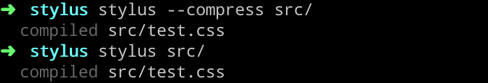

此时目录中便多了一个 `test.css` 文件，自此完成了通过 Stylus 编译后 CSS 文件的生成过程。

## Stylus 的语法

完成了安装和编译，我们现在就要通过使用 Stylus 来感受其强大之处！类似于 CSS 的学习，还是从选择器入手。

### 选择器

CSS 的选择器能够对 HTML 中的元素进行控制，从而实现 CSS 样式与 HTML 元素的绑定。下文将介绍选择器的使用方式，包括选择器以及属性间大的书写格式（缩进）、一次触发多个选择器的选择集和定位到付选择器的方法。

#### 缩进

首先不得不提的就是 Stylus 缩进的书写格式，在日常的 CSS 开发工作中最常写的就是 `{}` 和 `;` ，这是一种极为重复性的浪费时间与体力的工作，在 Stylus 里面这些都可以省去了，类似于 Python 的书写方式，只需要缩进即可。举个例子：

```
.item
width: 100px
height: 100px

```

Show moreShow more icon

**图 2\. 编译前后的比较**

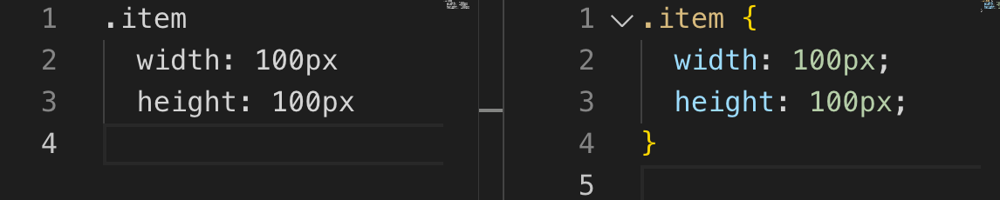

#### 规则集

Stylus 同 CSS 一样可以同时为多个选择器定义属性。Stylus 有两种方法来实现这个效果：一种是如 CSS 般通过，来同时选择多个选择器，另一种是通过 **换行** 来设置多个选择器，如：

```
.item1, .item2
border: 1px solid #ccc

```

Show moreShow more icon

等同于：

```
.item1
.item2
border: 1px solid #ccc

```

Show moreShow more icon

#### 父级引用

在 Stylus 中对于父级的引用，与 Less 语法相同，采用字符 `&` 来指向父选择器。如：

```
.item1
color dodgerblue
&:hover
color #000

```

Show moreShow more icon

我们来尝试编译一下看看效果：

**图 3\. 父级 `&` 的应用示例**

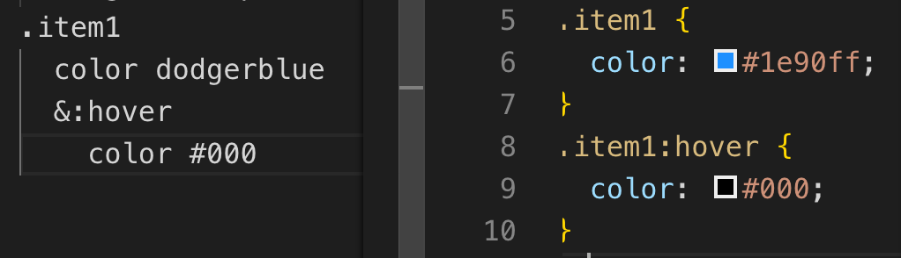

### 变量

下面我们来谈一下变量，这也是 Stylus 相对 CSS 更好的一个地方。

#### 定义变量

首先定义一个表达式变量，我们就可以在后续的样式中使用这个变量了。那么什么时候使用这个功能呢，其实场景很多，比如定义一个颜色变量，当很多地方要使用同一种颜色的时候，倘若颜色需要改变，我们便需要逐一改变，这时候如果定义了一个变量，我们便可以通过改变变量达到改变所有颜色的效果，不仅节约了时间，也会防止因为疏忽造成某些地方样式没有改变的样式 bug。又或者，我们需要对某些长度进行运算，我们也可以用到变量，这个会在后面函数的地方着重讲到。下面就是定义了一个颜色变量以及编译出来的效果代码对比图：

**图 4\. Stylus 定义变量示例**

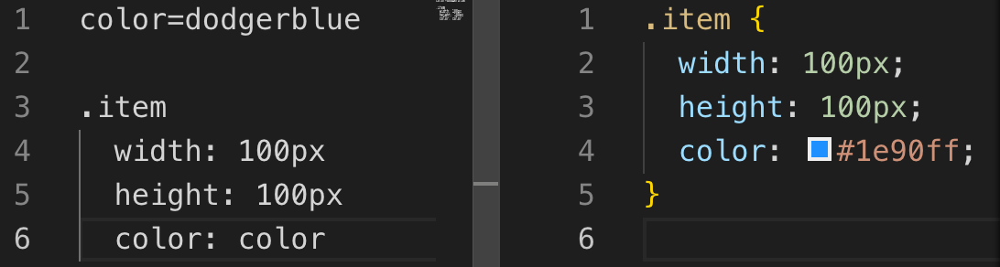

#### 查找属性值

再来介绍另一个和变量有关系的功能：查找属性值。有没有想过这样的场景，比如说某些属性和某些属性互相有关系。当然，可以通过定义一个变量来达到这个功能，那么如果不用变量直接引用这个属性值则又会省去不少麻烦。举个例子，比如我们想做到绝对定位元素的水平垂直居中会怎么做呢？很好的一个办法就是给 `top` 和 `left` 都设为 50%，然后设置 `margin-left`为宽度的 1/2，`margin-top` 是高度的 1/2。

**图 5\. Stylus 定义属性变量示例**

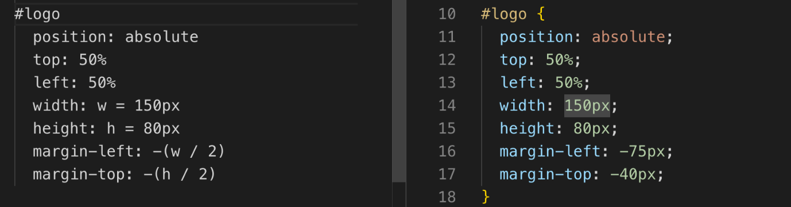

如果没有上面这个功能我们会怎样实现呢？如图所示，我们可以见到我们需要对 width 和 height 首先做个定义，而后再对其进行引用，如图 6 所示。那么有了这个功能有什么不同呢？

**图 6\. Stylus 定义属性值示例**

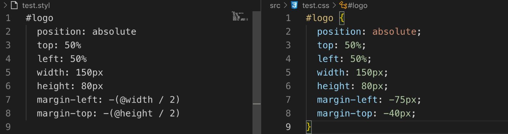

我们可以看出，通过 Stylus 设置属性值不用定义，直接通过 `@` 就可以引用！

### 插值

这个名词看起来很陌生，但是其实也不陌生，如果您用过 Vue 或者 JSP 者应该会使用过插值，就是通过 `{}` 来包围插入的值，从而使其变成标识符的一部分。这个可以用到一些需要拼接的选择器：比如 `nth-child()` 选择器，如果有很多同级标签，通过 `{}` 来将数值填充进去就能够大大简化代码，这个会与 for 的使用放在一起详细叙述。

### 运算符

同大多数编程语言一样，Stylus 也支持运算符。包含：

- **一元运算符**：`` `！，``not`，`–`，`+`，`～\`
- **二元运算符**：下标运算符 `[]`，范围 `..`或 `...`，加减，乘除 `/*%`，指数 `**`，相等与关系运算符 `== != >= <= > <`，真与假，逻辑操作符，存在操作符 `in`，条件赋值 `?= :?`
- **三元运算符**：`num ? unit(num, 'px'):20px`
- **其他**：`unit()`，颜色操作，格式化字符串等

### 方法和混合书写

方法和混合书写（Mixin）这两个功能的定义方法很相似，都是 Stylus 的强大功能点。不同的是，方法可以返回值，而 Mixin 不能。

先举个方法的例子：我们定义一个 `add` 函数来做加法，调用时直接加入参数，得到的返回值即可赋在属性中。

**图 7\. Stylus 函数方法示例**

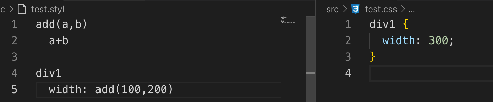

再举个混合书写的例子：混合书写看似和方法一致，但是用法并不同。方法可以返回一个值，作为表达式调用，而混合书写则是作为状态调用。

**图 8\. Stylus Mixins 示例**

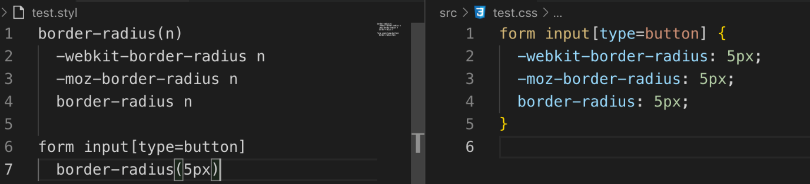

而且二者都可以使用 `arguments` 这个局部变量。上述写法也可以改变为：

```
border-radius()
  -webkit-border-radius arguments
  -moz-border-radius arguments
border-radius arguments

form input[type=button]
border-radius(5px)

```

Show moreShow more icon

### 条件语句

下面再来说一个与一般语言一致的功能——条件语句。即 `if/else if/else`。

**图 9\. Stylus 条件语句 if/else 示例**

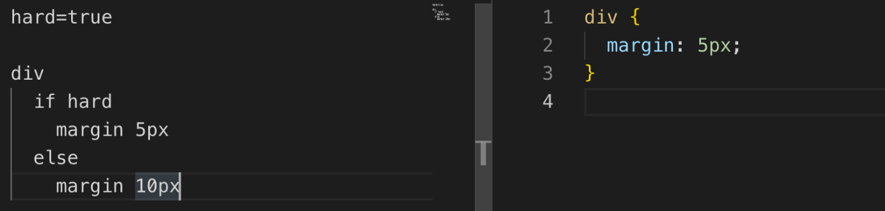

比较有特点的是 Stylus 的 `unless`，它的用法与 `if` 相反，正如翻译过来一样 `unless` 就是除非的意思。

**图 10\. Stylus 条件语句 unless 示例**

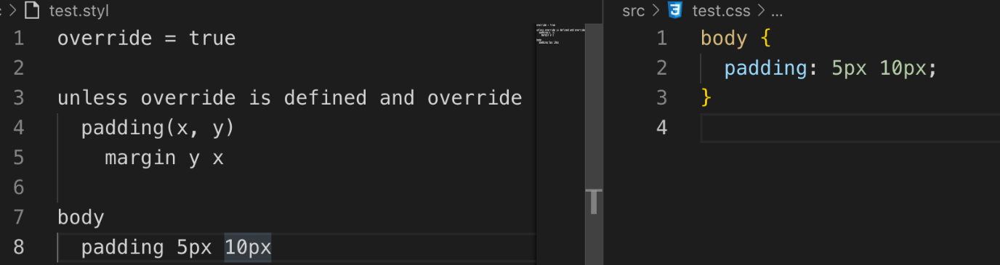

### 迭代

接下来就说到了迭代，我把前面插值的例子留在这里一起讲了。Stylus 允许我们使用 `for/in` 为表达式进行迭代。

**图 11\. Stylus 迭代示例**

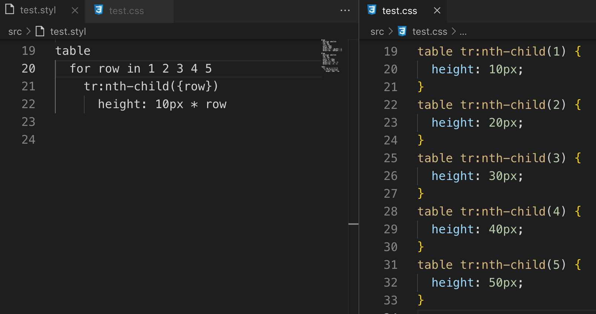

这样子代码就会非常简洁，不仅代码简介而且更加易懂、清晰。迭代功能与混合书写和方法相结合能够发挥更大的用途，您可以进行尝试，这里就不做赘述了。

### 继承 `@extend`

类似于 Sass，Stylus 也是支持 `extend` 功能的。为某个元素定义一个样式模型，在其他元素中使用的时候直接使用 `extend` 来继承该元素的属性，以此来减少代码的重复并且减轻维护所需要的代价。

**图 12\. Stylus 继承示例**

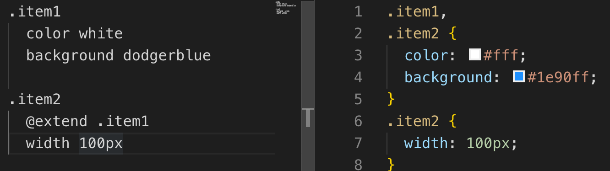

### 其他

最后，再介绍一些 Stylus 的其他功能。

#### 注释

Stylus 也包含三种类型的注释：单行、多行、多行缓冲。

```
//我是单行注释
/*
*我是多行注释
*/
/*！
*我是多行缓冲注释
*/

```

Show moreShow more icon

**图 13\. Stylus 三种类型注释未选择 compress 示例**

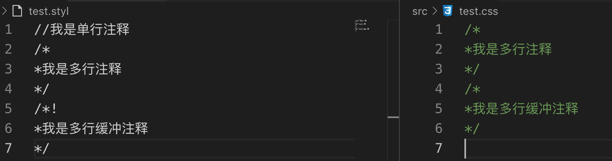

**图 14\. Stylus 三种类型选择 compress 示例**

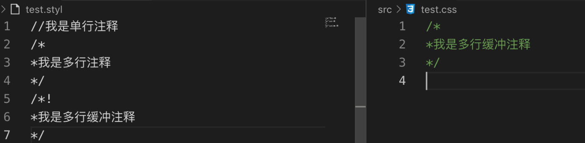

如上二图所示单行注释在编译的时候不会被编译出来，多行注释与多行缓冲注释的区别有些像 Python 的注释，多行注释是在没有选择 compress 的时候会被输出的，而多行缓冲注释则是无论哪种编译方法都会被输出的。

#### `@import`

Stylus 也支持动态导入，可以通过 `@import "test2.css"` 进行导入。

#### `@media`

`@media` 的使用与其在 CSS 中的使用相同，唯一需要注意的点是，要使用 Stylus 的块状符号。

**图 15\. Stylus 媒体查询示例**

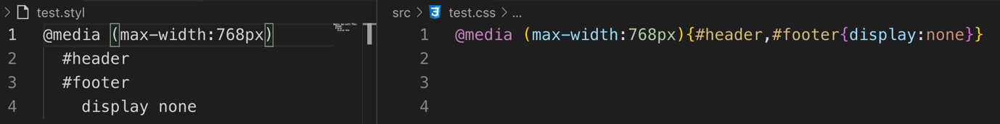

#### `@keyframe`

Stylus 也遵从 `@keyFrames` 的规则，渲染时则是自动转换为 `@-webkit-keyframes`。

```
@keyframes foo {
from {
    color: black
}
to {
    color: white
}
}

```

Show moreShow more icon

我们只需写入这样的语句，Stylus 则会自动添加各个浏览器内核相对应的配置前缀，达到兼容的效果。

图 16\. Stylus 自动添加前缀示例

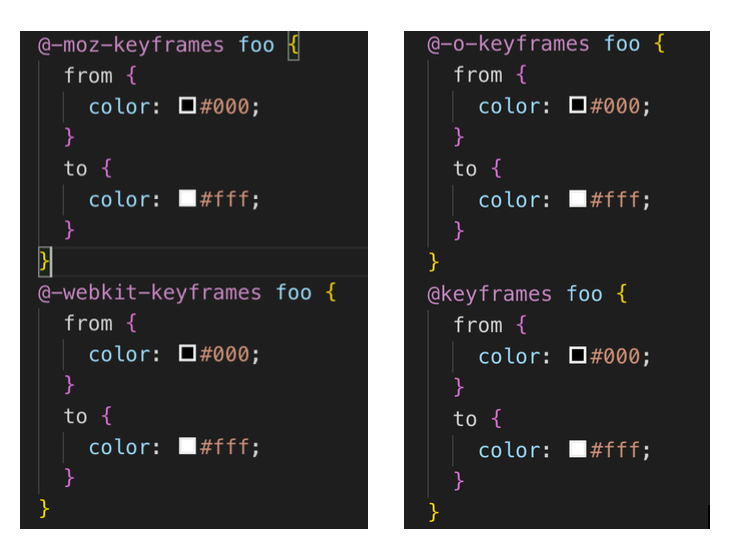

#### 内置方法

Stylus 中有一些方法可以返回颜色的比重值，这样在我们进行配色或者调色的时候就会变得更加方便。举几个例子：`red(color)`, `green(color)` 和 `blue(color)` 就可以分别返回红绿蓝的比重。通过 `dark(color)` 和 `light(color)` 我们可以知道颜色煮鱼亮色调还是暗色调，`alpha(color)` 和 `saturation(color)` 分别查看颜色的透明度和饱和度等方法，为页面的开发提供了极大的方便。

#### `@css`

虽然 Stylus 很强大，但是我们不可否认有的时候 Stylus 无法正确的处理 CSS 的选择器，这要怎么办呢，我们就可以将 CSS 属性放入 `@css` 标签中，就可以将其内部的类作为普通的 CSS 来处理。

#### 错误处理

最后再提一下错误处理，大多数的语言都有自己的错误处理，Stylus 也不例外，它提供了 Error Handle 来支持自定义的错误输出。以及 Introspection 来允许 Mixin 和 Function 使用反射获取对应的信息。

**图 17\. Stylus 错误处理示例**

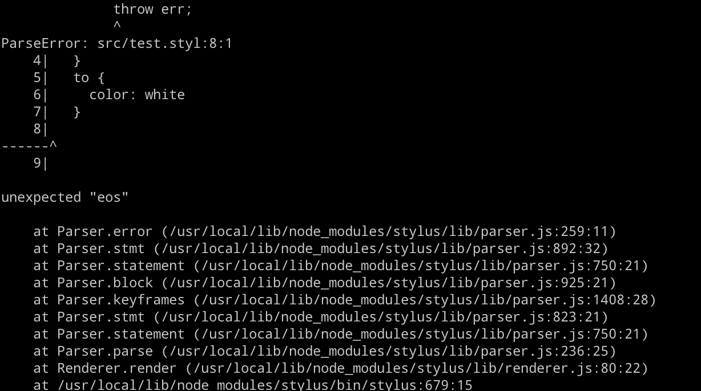

## 结束语

总的来说，Stylus 基本就是这些功能点，无论是 Sass、Less 还是 Stylus，在大的项目中笔者认为 CSS 的这些预处理器能够起到很大帮助，但是小项目其实使用的必要并不大，反而要多增加一个编译的麻烦。这篇文章提供的小例子也希望能够帮助到大家的理解。