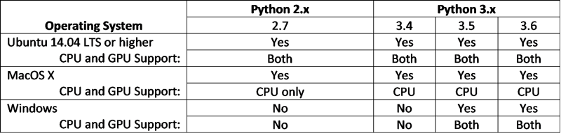

# TensorFlow 入门
探索这个用于机器学习的开源库

**标签:** TensorFlow,人工智能,数据科学,机器学习,深度学习

[原文链接](https://developer.ibm.com/zh/articles/cc-get-started-tensorflow/)

Vinay Rao

发布: 2018-01-18

* * *

在机器学习的领域中， _张量_ 指的是描述神经网络的数学模型中使用的多维数组。换言之，张量通常是一个矩阵或矢量的更高维泛化。

通过一种使用秩来显示维数的简单表示法，张量可以将复杂的 _n_ 维矢量和超形状表示为 _n_ 维数组。张量有两个属性：数据类型和形状。

## 关于 TensorFlow

TensorFlow 是一个开源的深度学习框架，于 2015 年末依据 Apache 2.0 许可进行发布。自那以后，它成为了在全球得到最广泛采用的深度学习框架之一（根据它的 GitHub 项目数量来判断）。

TensorFlow 的起源可以追溯到 Google DistBelief，它是由 Google Brain 项目开发的一个专用的生产深度学习系统。Google 针对分布式处理从头重新设计了 TensorFlow，帮助它在 Google 的生产数据中心内的 Google 定制专用集成电路 (ASIC) Tensor Processing Unit (TPU) 上实现最佳运行。这种设计使 TensorFlow 能高效处理深度学习应用。

该框架可以在服务器、桌面和移动设备上的 CPU、GPU 或 TPU 上运行。开发人员可以将 TensorFlow 部署在本地或云中的多个操作系统和平台上。许多开发人员认为，与类似的深度学习框架相比，比如 Torch 和 Theano（它们也具有硬件加速能力并在学术界得到广泛使用），TensorFlow 为分布式处理提供了更好的支持，并为商业应用提供了更高的灵活性和性能。

深度学习神经网络通常包含许多层。它们使用多维数组在不同层之间传输数据或执行操作。张量在神经网络的不同层之间流动 — TensorFlow 因此而得名。

TensorFlow 的主要编程语言是 Python。也可以使用 `C` ++、Java® 语言和 Go 应用编程接口 (API)，但不保证稳定性，许多针对 `C` #、Haskell、Julia、Rust、Ruby、Scala、R（甚至 PHP）的第三方绑定也是如此。Google 最近发布了一个移动优化的 TensorFlow-Lite 库，用于在 Android 上运行 TensorFlow 应用程序。

本教程将概述 TensorFlow 系统，包括该框架的好处、支持的平台、安装考虑因素，以及支持的语言和绑定。

## TensorFlow 的好处

TensorFlow 为开发人员提供了许多好处：

- 计算图模型。TensorFlow 使用称为定向图的数据流图来表达计算模型。这使得它对于开发人员非常直观，开发人员可以使用内置工具轻松地可视化神经网络层内的运行情况，并以交互方式调节参数和配置，从而完善他们的神经网络模型。
- 容易使用的 API。Python 开发人员可以使用 TensorFlow 的原始、低级的 API（或核心 API）来开发自己的模型，也可以使用高级 API 库来开发内置模型。TensorFlow 有许多内置库和分布式库，而且可以叠加一个高级深度学习框架（比如 Keras）来充当高级 API。
- 灵活的架构。使用 TensorFlow 的一个主要优势是，它拥有模块化、可扩展、灵活的设计。开发人员只需更改少量代码，就能轻松地在 CPU、GPU 或 TPU 处理器之间移植模型。尽管 TensorFlow 最初是为大规模分布式训练和推理而设计的，但开发人员也可以使用它来试验其他机器学习模型，并对现有模型进行系统优化。
- 分布式处理。Google Brain 在其自定义 ASIC TPU 上针对分布式处理从头重新设计了 TensorFlow。此外，TensorFlow 可以在多个 NVIDIA GPU 核心上运行。开发人员可以利用基于英特尔至强和至强融核的 x64 CPU 架构或 ARM64 CPU 架构。TensorFlow 能在多架构和多核心系统上运行，也可以在分布式进程上运行，将计算密集型处理作为工作者任务分发给各个系统。开发人员可以创建 TensorFlow 服务器集群，将计算图分布到这些集群上来进行训练。TensorFlow 可以在图内和图之间同步或异步执行分布式训练，还可以在内存中或跨联网的计算节点来共享通用数据。
- 性能。性能常常是一个有争议的主题，但大部分开发人员认为，任何深度学习框架都应该依靠底层硬件来实现最佳运行，从而以低能源成本实现高性能。通常，任何框架的原生开发平台都能实现最佳的优化。TensorFlow 能在 Google TPU 上获得最佳性能，但它还努力在各种平台上实现高性能 — 这些平台不仅包括服务器和桌面，还包括嵌入式系统和移动设备。该框架还支持数量惊人的编程语言。尽管 TensorFlow 的性能有时可能不如另一个原生运行的框架（比如 IBM 平台上的 IBM Watson® ），但它仍是开发人员的最爱，因为在多个最终应用都需要生成一致的结果时，人工智能项目可以针对所有这些应用跨平台和编程语言运行。

## TensorFlow 的应用

本节将分析 TensorFlow 擅长的应用。显然，由于 Google 使用了它的专用 TensorFlow 版本来执行文本和语音搜索、语言翻译和图像搜索应用，所以 TensorFlow 的主要优势在于分类和推理。例如，Google 在 TensorFlow 中实现了 RankBrain，这是对 Google 搜索结果进行排序的引擎。

在区分多种声音或在环境噪声很高的环境中过滤语音时，可使用 TensorFlow 改进语音识别和语音合成，模仿声音模式，以便将文本转换为听起来更自然的语音。此外，它还能处理不同语言中的句子结构，以生成更好的翻译结果。还可以将它用于图像和视频识别，以及物体、地标、人、情绪或活动的分类。TensorFlow 已为图像和视频搜索带来了重大改进。

由于 TensorFlow 灵活的、可扩展的、模块化的设计，它没有将开发人员限制于特定的模型或应用。开发人员不仅使用 TensorFlow 实现了机器学习和深度学习算法，还实现了统计和通用计算模型。要获得关于应用和分布式模型的更多信息，请参阅 [TensorFlow 用例](https://www.tensorflow.org/about/uses)。

## 哪些平台支持 TensorFlow？

支持 Python 开发环境的各种平台都能支持 TensorFlow。但是，要访问一个受支持的 GPU，TensorFlow 需要依赖其他软件，比如 NVIDIA CUDA 工具包和 cuDNN。为 TensorFlow V1.3（本文发表时的最新版本）预先构建的 Python 库可用于下表中列出的操作系统。

**备注：** Ubuntu 或 Windows 上的 GPU 支持需要 CUDA Toolkit 8.0 和 cuDNN 6 或更高版本，以及兼容该工具包版本和 CUDA Compute Capability 3.0 或更高版本的 GPU 卡。自 TensorFlow V1.2 以后，不再在 macOS 上提供 GPU 支持。

要获得有关细节，请参阅 [安装 TensorFlow](https://www.tensorflow.org/install)。

### 从源代码构建 TensorFlow

在 Ubuntu 和 macOS 上，官方构建流程使用 Bazel 构建系统从源代码构建 TensorFlow。使用 Bazel for Windows 或 CMake for Windows 的 Windows 构建流程是高度试验性的。要获得更多信息，请参阅 [从源代码安装 TensorFlow](https://www.tensorflow.org/install/install_sources)。

通过在两个 POWER8 处理器和 4 个 NVIDIA Tesla P100 GPU 卡之间使用 NVIDIA NVLink 互联，IBM 已针对 S822LC 高性能计算 (HPC) 系统上的深度学习优化了 PowerAI。开发人员可以在运行 OpenPOWER Linux 的 IBM Power Systems 上构建 TensorFlow。要获得更多信息，请参阅 [OpenPOWER 上的深度学习：在 OpenPOWER Linux 系统上构建 TensorFlow](https://www.ibm.com/developerworks/community/blogs/fe313521-2e95-46f2-817d-44a4f27eba32/entry/Building_TensorFlow_on_OpenPOWER_Linux_Systems?lang=en)。

还有许多受社区或供应商支持的构建过程。

## TensorFlow 如何使用硬件加速？

为了在更广泛的处理器和非处理器架构上支持 TensorFlow，Google 为供应商引入了一个新的抽象接口，以便为 Accelerated Linear Algebra (XLA) 实现新的硬件后端，XLA 是一个优化了 TensorFlow 计算的适用于线性代数的领域专用编译器。

### CPU

目前，由于 XLA 仍处于试验阶段，所以仅支持为 x64 和 ARM64 CPU 架构测试和构建 TensorFlow。在 CPU 架构上，TensorFlow 使用矢量处理扩展来加速线性代数。

以 CPU 为中心的英特尔 HPC 架构（比如英特尔至强和至强融核系列）使用用于深度神经网络的英特尔数学核心函数库 (Intel Math Kernel Library for Deep Neural Networks) 原语来加速线性代数。英特尔还提供了预先构建的、经过优化的 Python 发行版，这些版本拥有经过优化的线性代数库。

其他供应商（比如 Synopsys 和 CEVA）使用映射和分析器软件来转换 TensorFlow 图，并生成优化的代码，以便在其平台上运行它们。在使用此方法时，开发人员需要移植、剖析和调优获得的代码。

### GPU

TensorFlow 支持一些特定的 NVIDIA GPU，这些 GPU 兼容满足特定性能标准的相关 CUDA 工具包版本。OpenCL 支持只是发展路线图中的一项，尽管一些社区项目已经在兼容 OpenCL 1.2 的 GPU（比如 AMD）上运行 TensorFlow。

### TPU

依据 Google 的报道，基于 TPU 的图计算性能比在 CPU 或 GPU 上高 15-30 倍，而且非常节能。Google 将 TPU 设计为一种外部加速器，它可以插入串行 ATA 硬盘插槽中，并通过 PCI Express Gen3 x16 连接主机，这样就可以实现高带宽吞吐量。

Google TPU 是矩阵处理器而不是矢量处理器，而且它利用了神经网络不需要高精度算法而需要大规模并行、低精度整数算法的事实。毫不奇怪，矩阵处理器 (MXU) 架构拥有 65,536 个 8 位整数乘法器，可以通过一种脉动阵列架构来分阶段推送数据，这非常类似于血液通过心脏。

这种设计是复杂指令集计算 (CISC) 架构的一种形式，尽管是单线程的，但它允许一个高级指令在 MXU 上触发多个低级运算，从而允许在每个周期执行 128,000 个指令，而无需访问内存。

因此，与 GPU 阵列或多指令、多数据 CPU HPC 集群相比，TPU 带来了显著的性能提升和能效。与其他架构相比，TPU 通过在每个周期中评估一个 TensorFlow 图中的每个适合执行的节点，显著减少了深度学习神经网络的训练时间。

## TensorFlow 安装考虑因素

通常，TensorFlow 可以在任何支持 64 位 Python 开发环境的平台上运行。此环境已足以训练和测试大部分简单示例和教程。但是，大部分专家都认为，对于研究或专业开发，强烈推荐使用 HPC 平台。

### 处理器和内存需求

因为深度学习是高度计算密集型的，所以深度学习环境的标准如下：一个具有矢量扩展功能的快速、多核 CPU，以及一个或多个支持 CUDA 的高端 GPU 卡。大部分专家还推荐配备大量 CPU 和 GPU RAM，因为内存传输操作会消耗大量能量并对性能不利。

在深度学习网络的性能方面，可以考虑两种模式：

- 开发模式。通常，在此模式中，训练时间和性能以及样本和数据集大小决定了处理能力和内存需求。这些元素决定了神经网络的计算性能限制和训练时间。
- 应用模式。通常，训练后的神经网络的实时分类或推理性能决定了处理能力和内存需求。卷积网络需要更高的低精度算术能力，而全连接神经网络需要更多内存。

### 虚拟机选项

用于深度学习的虚拟机 (VM) 目前最适合有许多核心的以 CPU 为中心的硬件。因为主机操作系统控制着物理 GPU，所以在 VM 上实现 GPU 加速很复杂。有两种主要方法：

- GPU 直通：

    - 仅适用于 1 类管理程序，比如 Citrix Xen、VMware ESXi、Kernel Virtual Machine 和 IBM Power。
    - 基于 CPU、芯片集、管理程序和操作系统的特定组合，直通方法的开销可能会有所不同。通常，对于最新一代的硬件，开销要低得多。
    - 一种给定的管理程序-操作系统组合仅支持特定的 NVIDIA GPU 卡。
- GPU 虚拟化：

    - 受所有主要的 GPU 供应商支持 – NVIDIA (GRID)、AMD (MxGPU) 和 Intel (GVT-G)。
    - 最新版本可以在特定的较新 GPU 卡上支持 OpenCL（TensorFlow 上没有官方 OpenCL）。
    - 最新版的 NVIDIA GRID 可以在特定的较新 GPU 卡上支持 CUDA 和 OpenCL。

### Docker 安装选项

在 Docker 容器或 Kubernetes 集群中运行 TensorFlow 有许多优势。TensorFlow 可以将一个图作为执行任务分布到与容器集群对应的 TensorFlow 服务器集群。使用 Docker 的附加好处是，TensorFlow 服务器能访问物理 GPU 核心（设备），并为它们分配特定任务。

根据“ [通过使用 PowerAI 的 OpenPower 服务器上的 Kubernetes 来训练 TensorFlow](https://developer.ibm.com/linuxonpower/2017/04/21/tensorflow-training-kubernetes-openpower-servers-using-powerai)”中的介绍，开发人员也能通过安装社区构建的一个 Docker 映像，将 TensorFlow 部署在 PowerAI OpenPOWER 服务器上的 Kubernetes 集群中。

### 云安装选项

TensorFlow 有多种基于云的安装选项：

- Google Cloud TPU。针对研究人员，Google 在云 TPU 实例上提供了 TensorFlow 的一个 Alpha 版本，名为 TensorFlow Research Cloud。
- Google Cloud。Google 提供了一些自定义 TensorFlow 机器实例，它们能访问特定区域的 1、4 或 8 个 NVIDIA GPU 设备。
- IBM Cloud 数据科学和数据管理。IBM 提供了一个包含 Jupyter Notebook 和 Spark 的 Python 环境。已预先安装 TensorFlow。
- Amazon Web Services (AWS)。Amazon 提供了 AWS Deep Learning Amazon Machine Image (AMI)，以及可选的 NVIDIA GPU 支持，能在各种各样的 Amazon Elastic Compute Cloud 实例上运行。已预先安装 TensorFlow、Keras 和其他深度学习框架。AMI 可以支持多达 64 个 CPU 核心和多达 8 个 NVIDIA GPU (K80)。
- Azure。可以使用 Azure Container Service 在 Docker 实例上或在 Ubuntu 服务器上设置 TensorFlow。Azure 机器实例最多可以支持 24 个 CPU 核心和 4 个 NVIDIA GPU（M60 或 K80）。
- IBM Cloud Kubernetes 集群。IBM Cloud 上的 Kubernetes 集群可以运行 TensorFlow。社区已构建了一个 Docker 映像。PowerAI 服务器上提供了 GPU 支持。

## TensorFlow 支持哪些编程语言？

尽管 Google 使用 `C` \+\+ 实现了 TensorFlow 核心，但它的主要编程语言是 Python，而且该 API 最完整、最可靠且最易于使用。要获得更多信息，请参阅 [Python API 文档](https://www.tensorflow.org/api_docs/python)。Python API 还拥有最丰富的文档和可扩展性选项，以及广泛的社区支持。

除了 Python 之外，TensorFlow 还支持以下语言的 API，但不保证稳定性：

- `C` ++。TensorFlow `C` \+\+ API 是下一个最可靠的 API，既可用于构造和执行数据流图，也可用于 TensorFlow 服务。要获得关于 `C` \+\+ API 的更多信息，请参阅 [C++ API](https://www.tensorflow.org/api_guides/cc/guide)。要获得关于 `C` \+\+ Serving API 的更多信息，请参阅 [TensorFlow Servicing API 参考指南](https://www.tensorflow.org/api_docs/serving)。
- Java 语言。尽管这个 API 是试验性的，但最近宣布的 Android Oreo 对 TensorFlow 的支持可能使此 API 变得更出色。要获得更多信息，请参阅 [tensorflow.org](https://www.tensorflow.org/api_docs/java/reference/org/tensorflow/package-summary)。
- Go。这个 API 是与 Google Go 编程语言的一种高度试验性的绑定。要获得更多信息，请参阅 [tensorflow 包](https://godoc.org/github.com/tensorflow/tensorflow/tensorflow/go)。

### 第三方绑定

Google 定义了一个外来函数接口 (FFI) 来支持其他语言绑定。这个接口通过一个 `C` API 来公开 TensorFlow `C` \+\+ 核心功能。该 FFI 是新接口，现有的第三方绑定可能未使用它。

一项 GitHub 调查表明，社区或供应商为以下语言开发了第三方 TensorFlow 绑定： `C` #、Haskell、Julia、Node.js、PHP、R、Ruby、Rust 和 Scala。

### Android

现在，有一个新的、经过优化的 TensorFlow-Lite Android 库可用于运行 TensorFlow 应用程序。要获得更多信息，请参阅 [Android 中的新特性：O 开发人员预览版 2 及更多特性](https://android-developers.googleblog.com/2017/05/whats-new-in-android-o-developer.html)。

## 通过 Keras 简化 TensorFlow

Keras 层和模型完全兼容纯 TensorFlow 张量。因此，Keras 为 TensorFlow 创建了一个优秀的模型定义插件。开发人员甚至可以同时使用 Keras 和其他 TensorFlow 库。要获得有关细节，请参阅 [作为 TensorFlow 的简化接口的 Keras：教程](https://blog.keras.io/keras-as-a-simplified-interface-to-tensorflow-tutorial.html)。

## 结束语

TensorFlow 只是许多用于机器学习的开源软件库中的一个。但是，根据它的 GitHub 项目数量判断，它已成为了得到最广泛采用的深度学习框架之一。在本教程中，概述了 TensorFlow，了解了哪些平台支持它，还分析了安装考虑因素。

如果您已经看到一些使用 TensorFlow 的示例，可以查阅 [使用 TensorFlow 对艺术品进行分类](https://developer.ibm.com/cn/patterns/classify-art-using-tensorflow-model)。该 code pattern 演示如何从大都会艺术博物馆中提取数据和标签以训练图像分类系统。

本文翻译自： [Getting started with TensorFlow](https://developer.ibm.com/articles/cc-get-started-tensorflow/)（2017-11-16）