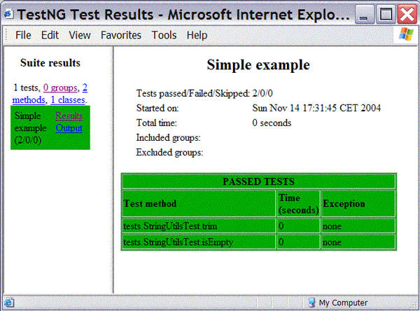
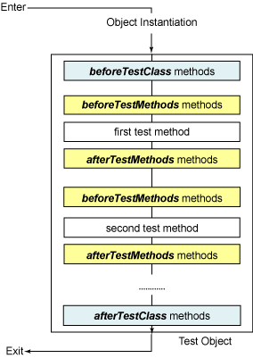

# TestNG 使 Java 单元测试轻而易举
试用这个测试框架，了解它对 JUnit 的超越

**标签:** DevOps,Java

[原文链接](https://developer.ibm.com/zh/articles/j-testng/)

Filippo Diotalevi

发布: 2005-01-06

* * *

在每个现代软件包的构造阶段，测试这一实践都扮演着中心角色。过去那种先编写代码，然后有空的时候再测试（或者根本不测试）的日子已经一去不返，因为大多数开发人员现在认识到需要采用编码和测试彼此交织、同步推进的软件方法论，以便尽早发现 bug，在开发过程开始的时候就识别出主要的风险。

JUnit 超过了其他测试框架，推动开发人员理解了测试尤其是单元测试的用途。利用一个相当简单、实用、严格的架构，JUnit 已经能够”传染”大量开发人员。（有关”被测试传染”的更多信息，请参阅 参考资料 。） JUnit 用户已经学会了单元测试的一些基本规则：

- 每段代码都必须经过测试。
- 只要有可能，代码的测试必须隔离进行（例如，使用像 _模拟对象_ 这样的技术 )。
- 软件必须容易测试 —— 也就是说， _在编写的时候要想着测试_ 。

但是，随着开发人员对测试的信任增长，JUnit 的简单性和严格性把他们分成两个相反的派别。一方面，有些人坚信 JUnit 的简单性对于不断地提醒程序员软件也必须保持简单来说是必不可少的（这称为 KISS 原则，代表 _keep it simple, stupid_ ）；另一方面，有些人认为 JUnit 不是简单而是简化，所以他们想要从测试框架得到新的高级特性、更大的灵活性和更强大的能力。JUnit 的一些特殊特性，就是为了满足这个群体的一些具体批评而推出的：

- 因为 Java 语言的单继承性，所以必须扩展 `TestCase` 类的限制很大。
- 无法向 JUnit 的测试方法传递参数，也无法向 `setUp()` 和 `tearDown()` 方法传递参数。
- 执行模型有点奇怪：每次执行一个测试方法的时候，都要重新实例化测试类。
- 管理复杂项目中的不同测试套件有可能非常复杂。

##### TestNG 的创造者

TestNG 的创造者是 Cedric Beust，他在 Java 编程领域非常出名，是 EJB 3 专家组的成员，也是其他一些流行的开源项目（例如 EJBGen 和 Doclipse）的创造者。TestNG 在 Apache 软件许可条款约束下发布，并可从其 Web 站点下载（请参阅参考资源中到该站点和 Cedric 站点的链接）。

在本文中，您将学习到如何用这个叫做 _TestNG_ 的新测试框架为应用程序编写单元测试。TestNG 的灵感来自 JUnit，同时尽量保持后者的简单性；但是，TestNG 消除了老框架的大多数限制，使开发人员可以编写更加灵活、更加强大的测试。由于 TestNG 大量借用 Java Annotation（随 JDK 5.0 引入；有关这个新特性的更多信息，请参阅 参考资料 ）来定义测试，所以本文也可以向您演示如何在实际的生产环境中使用 Java 语言的这个新特性。

## 关于代码

为了演示 TestNG 的用法，我要为叫做 Jakarta Common Lang 的这个广泛应用的开源库（其中包含一些处理和操纵字符串、数字和 Java 对象的有用的类）编写一些单元测试。在下面的 参考资料 一节中，您可以找到 TestNG 和 Jakarta Common Lang 库的链接；如果您想在自己的机器上随着本文一起练习，这二者都需要下载。

可以在两个不同的包中得到 TestNG：一个包要求 JDK 5.0，另一个包与 Java 语言 1.4 版本兼容。定义测试的时候，它们使用的语法略有差异：前者使用 JDK 5.0 标注，后者使用旧的 Javadoc 风格的标注。本文使用的是 JDK 5.0 版本，所以在继续阅读本文之前，需要对标注有基本的了解；您可以在 参考资料 中找到关于这个主题的 developerWorks 资源的链接。但是，您要知道 _只有在编译和运行测试的时候_ 才需要 JDK 5.0，所以您仍然可以用自己喜欢的编译器来构建应用程序。实际上，您将用从 Jakarata 项目的 Web 站点下载的相同 JAR 文件来测试 Jakarta Common Lang 库。关于使用 Java 平台 1.4 版本的 TestNG 的更多细节，可以在 TestNG 的 Web 站点上找到。

最后，请单击本文顶部或底部的 **Code** 图标，下载 j-testng-sample.zip 文件，其中包含一些示例，演示了如何用 TestNG 为 Jakarta Commons Lang 编写单元测试。在里面，可以找到这里给出的大多数代码，还有其他一些示例。阅读本文并不需要这些代码，但是它可以帮助您更加深入地理解在这里介绍的概念。

## TestNG 快速起步

TestNG 的测试类是普通的老式 Java 对象；您不需要扩展任何特殊的类，也不需要使用测试方法的任何命名约定：您只要用标注 `@Test` 通知框架这个类的方法是测试。清单 1 演示了实用类 `StringUtils` 的一个最简单的测试。它测试 `StringUtils` 的两个方法： `isEmpty()` 方法检测 `String` 是否为空； `trim()` 方法从 `String` 两端删除控制字符。请注意，其中使用了 Java 指令 `assert` 来检测错误情况。

##### 清单 1\. 针对类 StringUtils 的一个测试用例

```
package tests;
import com.beust.testng.annotations.*;
import org.apache.commons.lang.StringUtils;
public class StringUtilsTest
{
     @Test
     public void isEmpty()
     {
         assert StringUtils.isBlank(null);
         assert StringUtils.isBlank("");
     }
     @Test
     public void trim()
     {
         assert "foo".equals(StringUtils.trim("  foo   "));
     }
}

```

Show moreShow more icon

但是，在运行测试之前，必须用特殊的 XML 文件配置 TestNG，习惯上把这个文件命名为 testng.xml。这个文件的语法非常简单，如清单 2 所示。这个文件首先定义测试套件 _My test suite_ ，这个套件只包含一个测试 _First test_ ，这个测试由 `StringUtilsTest` 类完成。

##### 清单 2\. TestNG 的配置文件

```
<!DOCTYPE suite SYSTEM "http://beust.com/testng/testng-1.0.dtd" >
<suite name="My test suite">
<test name="First test">
    <classes>
       <class name="tests.StringUtilsTest" />
    </classes>
</test>
</suite>

```

Show moreShow more icon

如果这个示例 testng.xml 文件看起来没什么用处（只有一个测试类），那么好消息是：这实际上是您定义测试套件时 _惟一需要编写的文件_ 。还记得 JUnit 过去的日子么？在那些日子里，套件的定义可能分布在多个文件中：JUnit 的 `TestSuite` 文件，属性文件，还有当然缺不了的 Ant 构建文件。使用 TestNG，所有必需的数据都集中在 testng.xml 文件中。不需要额外的 `TestSuite` 文件和构建文件。

要运行测试，请用 `javac` 编译类，然后用以下命令调用 TestNG ：

```
java -ea -classpath .;testng.jar;commons-lang-2.0.jar com.beust.testng.TestNG testng.xml

```

Show moreShow more icon

在这里，选项 `-ea` 告诉 JVM 处理断言（在断言失败时抛出异常）；运行这个例子只需要 testng.jar 和 commons-lang-2.0.jar 这两个库，而 `com.beust.testng.TestNG` 是 TestNG 的主类。对于所有那些已经非常高兴地忘记了 `java` 和 `javac` 的神秘语法的开发人员来说，还提供了一个有用的 Ant 任务。作为例子，清单 3 演示了本文发布的示例应用程序的 Ant 构建文件。请注意与类 `com.beust.testng.TestNGAntTask` 关联的 `testng` 任务的定义，以及它在 _test_ 目标中相当简单的用法。

##### 清单 3\. 带有 TestNG 任务的 Ant 构建文件

```
<project name="sample" default="test" basedir=".">
<!-- COMPILE TESTS-->
<path id="cpath">
      <pathelement location="testng.jar"/>
      <pathelement location="commons-lang-2.0.jar"/>
</path>
<target name="compile">
      <echo message="compiling tests"/>
      <mkdir dir="classes"/>
      <javac   debug="true"
         source="1.5" classpathref="cpath"
         srcdir="src" destdir="classes"/>
</target>
<!-- RUN TESTS-->
<taskdef name="testng"
      classname="com.beust.testng.TestNGAntTask"
      classpathref="cpath"/>
<path id="runpath">
      <path refid="cpath"/>
      <pathelement location="classes"/>
</path>
<target name="test" depends="compile">
      <echo message="running tests"/>
      <testng fork="yes" classpathref="runpath" outputDir="test-output">
         <fileset dir="src" includes="testng.xml"/>
         <jvmarg value="-ea" />
      </testng>
</target>
</project>

```

Show moreShow more icon

如果一切正常，那么应当在控制台中看到测试结果。而且，TestNG 还在当前目录下自动创建了一个叫做 test-output 的文件夹，并在其中创建了一份非常好的 HTML 报告。如果打开该报告并装入 index.html，就可以看到与图 1 中的页面类似的页面。

##### 图 1\. TestNG 创建的 HTML 报告



## 定义测试组

TestNG 另外一个有趣的特性是其定义测试组的能力。每个测试方法都可以与一个或多个组相关联，但可以选择只运行某个测试组。要把测试加入测试组，只要把组指定为 `@Test` 标注的参数，使用的语法如下：

```
@Test(groups = {"tests.string"})

```

Show moreShow more icon

在这个具体的例子中，您声明：标注的方法属于 `tests.string` 组。因为参数 `groups` 是一个数组，所以可以指定多个组，组名之间用逗号分隔。例如，在示例应用程序中，您可以为 `String` 、Number 以及 boolean 创建不同的测试，然后如清单 4 所示配置 TestNG, 有选择地运行它们 .

##### 清单 4\. 带有不同组的配置文件

```
<!DOCTYPE suite SYSTEM "http://beust.com/testng/testng-1.0.dtd" >
<suite name="My suite">
<test name="Simple example">
    <groups>
      <run>
         <include name="tests.string" />
         <include name="tests.math" />
         <exclude name="tests.boolean"/>
      </run>
    </groups>
    <classes>
         .... list classes here....
    </classes>
</test>
</suite>

```

Show moreShow more icon

显然，当运行不同的测试组时，HTML 报告能够在单一列表中显示所有测试，也可以在独立的列表中显示每个组的测试，从而能够立即理解问题的来源。

## 配置方法

使用 TestNG，不仅可以指定测试方法，还可以用专门的标注 `@Configuration` 指定类中的其他特定方法，这些方法叫做 _配置方法_ 。配置方法有四种类型：

- `beforeTestClass` 方法在类实例化之后，但是在测试方法运行之前执行。
- `afterTestClass` 方法在类中的所有测试方法执行之后执行。
- `beforeTestMethod` 方法在类中的任何测试方法执行之前执行。
- `afterTestMethod` 方法在类中的每个测试方法执行之后执行。

图 2 进一步描述了测试类的生命周期。

##### 图 2\. 测试类的生命周期



清单 5 演示了配置方法的一些示例。请注意，如果您使用组，那么配置方法也必须属于某个组。而且，配置方法的四种类型彼此之间不是互斥的，所以可以把方法定义成同时属于一种或多种配置方法类型。（作为例子，请参阅清单 5 中的 `aroundTestMethods()` 方法）。

##### 清单 5\. 配置方法示例

```
@Configuration(beforeTestClass = true, groups = {"tests.workflow"})
public void setUp()
{
System.out.println("Initializing...");
}
@Configuration(afterTestMethod = true, beforeTestMethod = true
    , groups = {"tests.workflow"})
public void aroundTestMethods()
{
System.out.println("Around Test");
}

```

Show moreShow more icon

TestNG 中的配置方法是 JUnit 的 `setUp()` 和 `tearDown()` 方法的增强版；它们的主要目的是为测试创建正确的执行上下文，并在测试用例执行之后刷新数据。

## 异常检测

使用 TestNG，您可以非常简单、非常容易地检测异常的发生。很明显，用 JUnit 也可以做这件事，但是正如您在清单 6 中的示例中所看到的，使用 TestNG 的 `@ExpectedExceptions` 标注可以使代码编写惊人地容易和简单。 `@ExpectedExceptions` 标注指明框架能够容忍抛出的 `NumberFormatException` 异常，所以不应当被当作是故障。要查看在某行代码中是否抛出异常，您可以直接在这行代码之后加入 `assert false` 语句。这意味着 _只有_ 在指定行中抛出特定类型的异常的时候，您才会通过测试。

##### 清单 6\. 用 TestNG 进行异常检测

```
public class  NumberUtilsTest
{
     @Test(groups = {"tests.math"})
     @ExpectedExceptions(NumberFormatException.class)
     public void test()
     {
         NumberUtils.createDouble("12.23.45");
         assert false;  //shouldn't be invoked
     }
}

```

Show moreShow more icon

## 结束语

在本文中，我提供了 TestNG 的快速实用介绍，目的是展示如何开始编写单元测试。但是，它不是一份完整的参考手册。TestNG 还有许多其他非常有用的有趣特性：

- 可以向测试方法和配置方法传递参数，可以用标注或在 XML 配置文件中声明参数。
- 可以在 TestNG 下用”兼容模式”运行过去运行良好的 Junit 测试。
- 可以在测试组之间建立依赖性，决定它们的执行顺序。

要了解这个框架的所有潜力，有必要参阅 TestNG 的文档（参阅 参考资料 ）。

所有这些特性，与用于定义测试的 Java 标注一起，使整个测试过程更加简单、更加灵活。编写测试必须遵守的规则 很少；除此之外，您绝对可以自由选择自己喜欢的测试策略。

在使用 TestNG 时最明显的是，这个模板已经是编写单元测试的一个好选择了，而且，在设计上，它与其他库和工具的集成非常简单，所以它未来的发展会给开发人员带来一些有趣的新东西。

## 下载示例代码

[j-testng-sample.zip](http://download.boulder.ibm.com/ibmdl/pub/software/dw/library/j-testng-sample.zip)