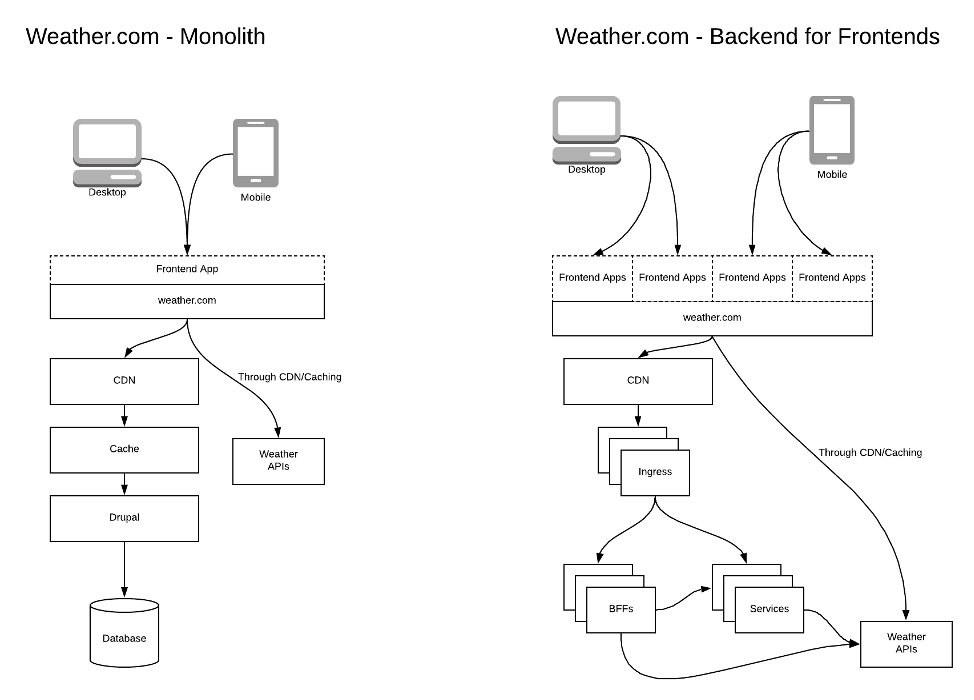
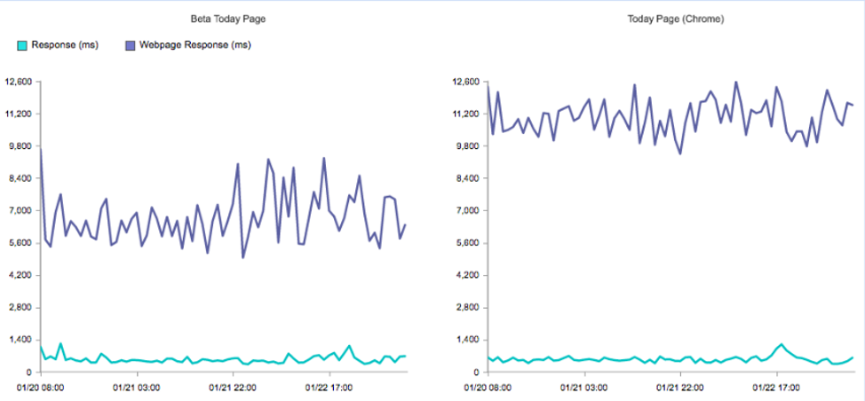
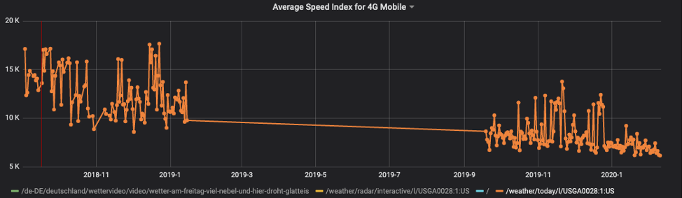

# The Weather Company 如何在生产环境中使用 Node.js
使用 Node.js 提高了网站速度、性能和可伸缩性

**标签:** Node.js

[原文链接](https://developer.ibm.com/zh/articles/nodejs-weather-company-success-story/)

Noel Madali

发布: 2020-07-07

* * *

The Weather Company 使用 Node.js 驱动其 [weather.com](https://weather.com/) 网站，这是一个跨国的天气信息和新闻网站，可在 230 多种语言环境中使用，并针对大约 60 种语言进行了本地化。作为受众群体覆盖率和准确性一流的行业领导者，weather.com 提供天气数据、预报、观测、历史数据、新闻报道和视频。

由于 weather.com 提供在全球范围内使用的基于位置的服务，因此其基础架构必须支持一致的正常运行时间、速度和精确的数据交付。将解决方案扩展到数十亿个唯一位置的工作，为技术团队带来了多种技术挑战和机遇。在本文中，我们介绍了在构建 weather.com 时必须克服的一些独特挑战，并讨论了我们如何最终选择使用 Node.js 来助力我们的国际化天气应用程序。

## Drupal ‘n Angular (DNA)：发展初期

2015 年，我们是一家 Drupal ‘n Angular (DNA) 商店。我们通过将 Drupal 和 Angular 结合在一起来构建一个基于内容的模块化网站，从而成为该行业的民间先驱。我们使用 Drupal 作为 CMS 来控制内容和页面配置，使用 Angular 对前端模块进行编程。

前端模块是带有数据和一些交互元素的小块用户界面。内容编辑会在各个模块之间移动，以可视方式创建页面，使用 Drupal 创建有关天气的文章并将其发布在网站上。

DNA 成功地快速扩展了网站的内容，并使编辑能够灵活地动态创建页面内容。

随着我们越来越多地使用 DNA，我们面临着许多技术问题，这些问题最终归结为三个主要主题：

- 性能不佳
- 稳定性不足
- 开发者修复、增强和部署代码（也称为速度）的时间缓慢

### 性能不佳

我们的网站性能不佳，加载时间非常缓慢，并且无法提供可靠的可用性。这进而直接影响了我们的广告收入，因为更快的页面加载速度才能转化为更快的广告可见度和更多的创收机会。

为了解决我们面临的某些性能问题，我们做了不同的前端试验。

- 我们分析并评估了模块，以确定我们可以在哪些方面做出改变。例如，我们评估了是彻底放弃某些不常使用的模块，还是重新编写这些模块，使其不再使用臃肿的 JS 库。
- 我们依据广告投放绩效评估了某个 [标签管理器](https://en.wikipedia.org/wiki/Tag_management_system) 的使用。
- 我们添加了延迟加载的模块，可在首次加载时删除该模块，以减少为客户端提供的 JavaScript 数量。

### 稳定性不足

将 Drupal 与 Angular 绑定使用的部署很脆弱，因此我们的网站频繁宕机。部署过程实际上就是获取 git 分支的名称并将其输入 UI 以便发布到不同环境中。没有真正的构建过程，只是版本控制。

最终，这导致了许多会影响开发者体验的不良实践，包括缺乏版本控制方法、不可复制的构建等。

### 开发者速度减慢

我们的大多数开发者都具有前端经验，但是很少有人了解 Drupal 和 PHP 的内部工作原理。因此，由于知识漏洞，与 PHP 相关的功能和错误修复没有得到快速解决。

大型部署导致速度降低以及稳定性问题，此时细微的变动都可能会破坏整个站点。由于部署是整个代码库（Drupal、Drupal 插件/模块、前端代码、PHP 脚本等），因此，发行版中的少量代码变动很容易被忽略并且未经适当测试，从而破坏了部署。

总体而言，尽管我们通过 DNA 取得了一些快速的成功，但设置所导致的反复回归迫使我们考虑架构的替代途径。

## 重新思考，将 Node.js 包含在我们的架构中

我们首次使用 Node.js 的尝试是一个一次性项目，旨在为 weather.com 创建精简体验（lite experience），也就是完全在服务器端呈现，并且使用极少的 JavaScript。受众的带宽有限且设备功能极少（例如，使用 [Facebook 的 Free Basics](https://info.internet.org/en/story/free-basics-from-internet-org/) 的低端智能手机）。

涉众对精简体验版感到满意，并评论说页面加载几乎瞬时完成。分析这种概念验证对于确定架构改造工作的后续步骤非常重要。

与 DNA 不同，精简体验版有如下特征：

- 仅在服务器端呈现页面
- 前端占用空间保持在 30KB 以下（几乎没有 JavaScript，CSS 和图像也极少）。

我们利用通过精简体验学到的经验来帮助提升网站的表现。首先要重新考虑我们的 DNA 架构。

### 衡量成功的指标

在开发新架构之前，我们必须向我们的企业证明的确需要重新设计架构。我们必须确定的第一件事是衡量成功的指标。

我们咨询了 Google 广告团队，了解高性能网页对业务结果的确切影响。Google 向我们证明了提高页面速度可以提高广告可见度，从而转化为收入。

掌握了这一点，每天我们都会在一组页面上进行测试以衡量以下指标：

- [速度指数](https://sites.google.com/a/webpagetest.org/docs/using-webpagetest/metrics/speed-index)
- 首次交互所需时间
- 传输的字节数
- 首次来电广告所需的时间

我们使用了多种工具来收集指标：WebPageTest、Lighthouse 和 sitespeed.io。

在编制这些指标的列表时，我们能够判断某些试验是否有益。我们使用分析来确定架构中需要进行哪些更改，以使网站更成功。

尽管我们打算完全重新编写我们的 DNA 网站，但我们承认需要采用一步一步对新架构进行试验的方法。使用上述方法，我们创建了一个 Beta 页面，并对其进行 A/B 测试以验证是否成功。

## 从创智赢家到我们架构的 Beta 版

最初的 Node.js 概念验证的性能得到认可之后，我们举办了“创智赢家”会议，提出并辩护了不同的理想架构。我们评估了整个框架或各种库组合，例如 Angular、React、Redux、Ember、lodash 等。

通过这个试验，我们一致同意从庞大单一的架构迁移到 Node.js 后端和崭新的 React 前端。我们计划在 9 个月到一年之间完成迁移。

最终，我们决定使用小型 JS 库和工具的模式，类似于 UNIX 操作系统的命令工具链的模式。这种模式使我们可以灵活地从整个应用程序中换掉一个组件，而不必重构大量代码以包含一个新功能。

在后端，我们需要分离页面创建和页面展示。我们保留 Drupal 作为 CMS，并创建了一种将文档发布到可扩展性更高的系统（可以被其他服务读取）的方法。我们遵循了后端服务于前端 (Backends for Frontends, BFF) 的模式，该模式使我们可以将页面前端分离，并允许后端下游系统具有更大的自治权。我们使用 CMS 发布的文档来交付内容页面（而不是传统的 CMS 整体服务页面的方法）。

尽管 Drupal 和 PHP 可以在服务器端进行渲染，但是我们的开发者对 JavaScript 更为熟悉，因此使用 Node.js 来实现站点的同构（通用）渲染可以提高我们的开发速度。

对于以前的面向前端的开发者而言，可以轻松转换为使用 Node.js 进行开发。由于我们的大多数开发者主要具备 JavaScript 背景，因此我们避开了围绕单独的服务器端语言进行渲染的解决方案。

经过一段时间之后，我们从第一个项目开始实施并改进了用法。在开发了最初的几个页面之后，我们决定从 ExpressJS 转到 Koa，以使用最新的 JS 标准，例如 async/await。我们一开始使用了纯 React，但后来切换到类似 React 的 Inferno.js。

在评估了许多不同的构建系统（gulp、grunt、browserify、systemjs 等）之后，我们决定使用 Webpack 加快构建过程。我们看到 Webpack 在快速发展的生态系统中日趋成熟，也看到其竞争对手的缺陷（甚至也可以说是没有竞争对手）。

Webpack 解决了 DNA JS 聚合和最小化的核心问题。通过集中式构建过程，我们可以使用标准化的模块系统构建 JS 代码，利用 npm 生态系统并最小化捆绑包（这一切均在构建过程中而不是运行时期间进行）。

将应用程序从客户端渲染切换为服务器端渲染，提高了我们的速度指数，并能够更快地向用户提供信息。React 在通用渲染的这一方面帮助了我们，能够在前端和后端共享代码对于服务器端渲染和代码复用至关重要。

我们首次推出的 Beta 版页面是一页式网站 (Single Page App，SPA)。传统上，我们必须将每个页面和位置呈现为对源服务器的反向点击。有了 SPA，借助于通用渲染，我们能够减少对源服务器的反向点击，并提高了渲染下一个视图的速度。

下图显示在引入 SPA 后，网页响应速度快得多。

由于我们的解决方案包含更多的是 Node.js，因此我们能够利用与 Node.js 生态系统相关的许多工具，包括用 ESLint 进行代码检查，用 Jest 测试，用 Yarn 管理程序包。

代码检查和测试以及更优化的 CI/CD流水线有助于减少生产环境中的错误。这使平台整体上更加成熟和稳定，提高了工程速度，并提升了开发者的满意度。

### 改变部署策略

认识到我们的 DNA 部署存在的问题之后，我们知道我们需要一个更好的解决方案来将代码交付到基架构。针对我们的 DNA 设置，我们使用了管理系统来部署 Drupal。而对于新解决方案，我们决定利用更新的基于容器的部署和基础架构方法。

通过迁移到 Docker 和 Kubernetes，我们实现了许多最佳实践：

- 将不同的页面分成不同的服务可减少故障
- 构建无状态服务可降低复杂性，简化测试和实现可扩展性
- 构建是可重复的（Docker 镜像可确保部署正确的工件并保持一致）
    我们的 Kubernetes 部署使我们能够真正分布在四个地区和七个集群中，数十个服务从 3 个副本扩展到 100 多个副本，运行在 400 多个工作节点上，这一切均在 IBM Cloud 上。

### 解决一组常见的性能问题

在运行成功的 beta 试验之后，我们继续将页面迁移到新架构。一段时间之后，一些常见的老问题浮出水面：

- 页面变得臃肿
- 构建速度变慢
- 开发者速度下降

我们必须推动架构的演变来解决这些问题。

## Beta v2：创建性能更高的页面

我们对架构的第二次演变是一次复兴（重生）。我们必须回到基础层面，重新审视我们的精简体验，探究一下成功的原因。我们分析了性能问题，得出的结论是 SPA 成了性能瓶颈。尽管 SPA 使第二次页面访问受益，但我们了解到，大多数用户在访问网站并获得所需信息后就离开了。

于是我们在不使用 SPA 的情况下设计并构建了该解决方案，但保留了 React “注水”，以确保服务器端和客户端之间的代码复用。我们在开发过程中更加关注工具，具体措施是确保 [代码覆盖率](https://developers.google.com/web/tools/chrome-devtools/coverage)（使用的 JS 客户端代码占交付的代码的百分比）更加高效。

整体上去除 SPA 也是降低构建时间的关键。由于不再从单个入口点将页面缝合在一起，因此我们拆分了 Webpack 构建，以便各个页面可以拥有自己的 JS 和资产集。

与 Beta 版站点相比，我们能够进一步让页面轻量化。
让页面轻量化会在总体上影响页面加载时间。下图显示了速度指数降低的程度。

注意：在 2019 年 1 月到 10 月之间丢失了一些数据。

现在，此架构是 [weather.com](https://weather.com) 上所有页面的基础。

## 结束语

weather.com 并非一夜之间就完成了转型，为了实现今天的成就，我们做了大量的工作。将 Node.js 添加到我们的生态系统中需要一些试错。

我们理解问题、收集指标并反复实施解决方案，最终取得了成功。这是一个演变的过程。这不仅改变了我们的后端，还使得我们必须改善前端才能获得最佳性能。通过更改部署策略和基础架构，我们能够实现多种最佳实践，减少宕机时间并提高整体系统稳定性。在后端和前端都使用 JavaScript，开发者的速度也得到了提高。

随着我们持续对解决方案进行架构设计、演变和扩展，我们一直在寻找改进的方法。在您的台式机上查看 weather.com，或者如果要查看最新/性能更高的版本，请在您的移动设备上查看我们的移动 Web 版本。

本文翻译自： [How The Weather Company uses Node.js in production](https://developer.ibm.com/articles/nodejs-weather-company-success-story)（2020-04-21）