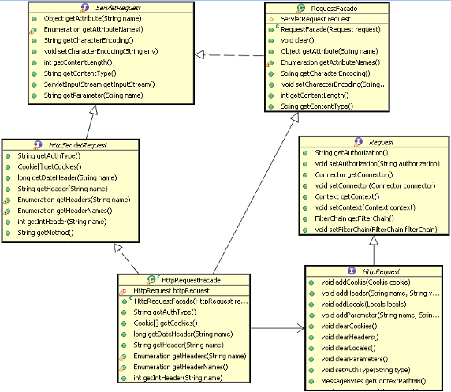
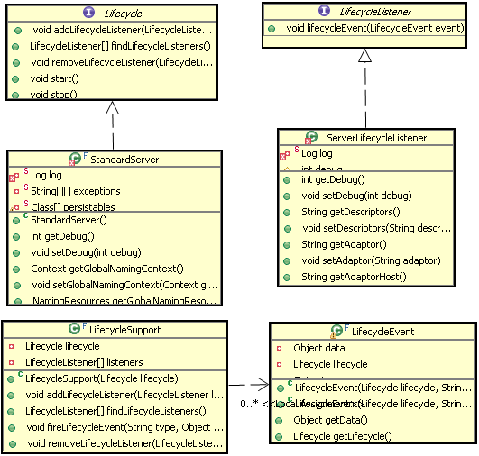
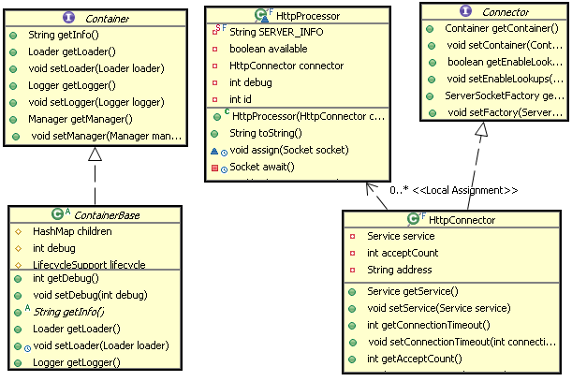
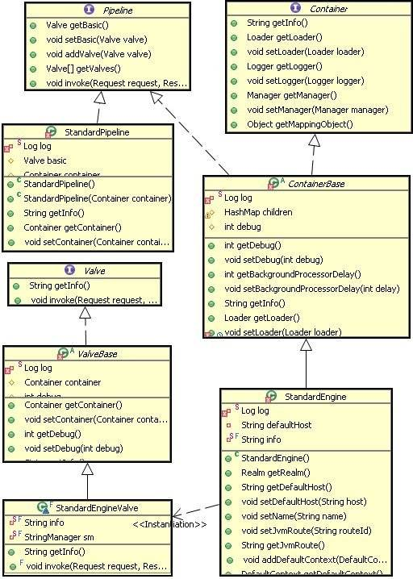

# Tomcat 设计模式分析
Tomcat 系统架构与设计模式，第 2 部分

**标签:** Java,Web 开发

[原文链接](https://developer.ibm.com/zh/articles/j-lo-tomcat2/)

许令波

发布: 2010-05-27

* * *

## 门面设计模式

门面设计模式在 Tomcat 中有多处使用，在 Request 和 Response 对象封装中、Standard Wrapper 到 ServletConfig 封装中、ApplicationContext 到 ServletContext 封装中等都用到了这种设计模式。

### 门面设计模式的原理

这么多场合都用到了这种设计模式，那这种设计模式究竟能有什么作用呢？顾名思义，就是将一个东西封装成一个门面好与人家更容易进行交流，就像一个国家的外交部一样。

这种设计模式主要用在一个大的系统中有多个子系统组成时，这多个子系统肯定要涉及到相互通信，但是每个子系统又不能将自己的内部数据过多的暴露给其它系统，不然就没有必要划分子系统了。每个子系统都会设计一个门面，把别的系统感兴趣的数据封装起来，通过这个门面来进行访问。这就是门面设计模式存在的意义。

门面设计模式示意图如下：

##### 图 1\. 门面示意图


Client 只能访问到 Façade 中提供的数据是门面设计模式的关键，至于 Client 如何访问 Façade 和 Subsystem 如何提供 Façade 门面设计模式并没有规定死。

### Tomcat 的门面设计模式示例

Tomcat 中门面设计模式使用的很多，因为 Tomcat 中有很多不同组件，每个组件要相互交互数据，用门面模式隔离数据是个很好的方法。

下面是 Request 上使用的门面设计模式：

##### 图 2\. Request 的门面设计模式类图



从图中可以看出 HttpRequestFacade 类封装了 HttpRequest 接口能够提供数据，通过 HttpRequestFacade 访问到的数据都被代理到 HttpRequest 中，通常被封装的对象都被设为 Private 或者 Protected 访问修饰，以防止在 Façade 中被直接访问。

## 观察者设计模式

这种设计模式也是常用的设计方法通常也叫发布 – 订阅模式，也就是事件监听机制，通常在某个事件发生的前后会触发一些操作。

### 观察者模式的原理

观察者模式原理也很简单，就是你在做事的时候旁边总有一个人在盯着你，当你做的事情是它感兴趣的时候，它就会跟着做另外一些事情。但是盯着你的人必须要到你那去登记，不然你无法通知它。观察者模式通常包含下面这几个角色：

- Subject 就是抽象主题：它负责管理所有观察者的引用，同时定义主要的事件操作。
- ConcreteSubject 具体主题：它实现了抽象主题的所有定义的接口，当自己发生变化时，会通知所有观察者。
- Observer 观察者：监听主题发生变化相应的操作接口。

### Tomcat 的观察者模式示例

Tomcat 中观察者模式也有多处使用，前面讲的控制组件生命周期的 Lifecycle 就是这种模式的体现，还有对 Servlet 实例的创建、Session 的管理、Container 等都是同样的原理。下面主要看一下 Lifecycle 的具体实现。

Lifecycle 的观察者模式结构图：

##### 图 3\. Lifecycle 的观察者模式结构图



上面的结构图中，LifecycleListener 代表的是抽象观察者，它定义一个 lifecycleEvent 方法，这个方法就是当主题变化时要执行的方法。 ServerLifecycleListener 代表的是具体的观察者，它实现了 LifecycleListener 接口的方法，就是这个具体的观察者具体的实现方式。Lifecycle 接口代表的是抽象主题，它定义了管理观察者的方法和它要所做的其它方法。而 StandardServer 代表的是具体主题，它实现了抽象主题的所有方法。这里 Tomcat 对观察者做了扩展，增加了另外两个类：LifecycleSupport、LifecycleEvent，它们作为辅助类扩展了观察者的功能。LifecycleEvent 使得可以定义事件类别，不同的事件可区别处理，更加灵活。LifecycleSupport 类代理了主题对多观察者的管理，将这个管理抽出来统一实现，以后如果修改只要修改 LifecycleSupport 类就可以了，不需要去修改所有具体主题，因为所有具体主题的对观察者的操作都被代理给 LifecycleSupport 类了。这可以认为是观察者模式的改进版。

LifecycleSupport 调用观察者的方法代码如下：

##### 清单 1\. LifecycleSupport 中的 fireLifecycleEvent 方法

```
public void fireLifecycleEvent(String type, Object data) {
    LifecycleEvent event = new LifecycleEvent(lifecycle, type, data);
    LifecycleListener interested[] = null;
    synchronized (listeners) {
        interested = (LifecycleListener[]) listeners.clone();
    }
    for (int i = 0; i < interested.length; i++)
        interested[i].lifecycleEvent(event);
}

```

Show moreShow more icon

主题是怎么通知观察者呢？看下面代码：

##### 清单 2\. 容器中的 start 方法

```
public void start() throws LifecycleException {
    lifecycle.fireLifecycleEvent(BEFORE_START_EVENT, null);
    lifecycle.fireLifecycleEvent(START_EVENT, null);
    started = true;
    synchronized (services) {
        for (int i = 0; i < services.length; i++) {
            if (services[i] instanceof Lifecycle)
                ((Lifecycle) services[i]).start();
            }
        }
    lifecycle.fireLifecycleEvent(AFTER_START_EVENT, null);
}

```

Show moreShow more icon

## 命令设计模式

前面把 Tomcat 中两个核心组件 Connector 和 Container，比作一对夫妻。男的将接受过来的请求以命令的方式交给女主人。对应到 Connector 和 Container，Connector 也是通过命令模式调用 Container 的。

### 命令模式的原理

命令模式主要作用就是封装命令，把发出命令的责任和执行命令的责任分开。也是一种功能的分工。不同的模块可以对同一个命令做出不同解释。

下面是命令模式通常包含下面几个角色：

- Client：创建一个命令，并决定接受者
- Command 命令：命令接口定义一个抽象方法
- ConcreteCommand：具体命令，负责调用接受者的相应操作
- Invoker 请求者：负责调用命令对象执行请求
- Receiver 接受者：负责具体实施和执行一次请求

### Tomcat 中的命令模式的示例

Tomcat 中命令模式在 Connector 和 Container 组件之间有体现，Tomcat 作为一个应用服务器，无疑会接受到很多请求，如何分配和执行这些请求是必须的功能。

下面看一下 Tomcat 是如何实现命令模式的，下面是 Tomcat 命令模式的结构图：

##### 图 4\. Tomcat 命令模式的结构图



Connector 作为抽象请求者，HttpConnector 作为具体请求者。HttpProcessor 作为命令。Container 作为命令的抽象接受者，ContainerBase 作为具体的接受者。客户端就是应用服务器 Server 组件了。Server 首先创建命令请求者 HttpConnector 对象，然后创建命令 HttpProcessor 命令对象。再把命令对象交给命令接受者 ContainerBase 容器来处理命令。命令的最终是被 Tomcat 的 Container 执行的。命令可以以队列的方式进来，Container 也可以以不同的方式来处理请求，如 HTTP1.0 协议和 HTTP1.1 的处理方式就会不同。

## 责任链模式

Tomcat 中一个最容易发现的设计模式就是责任链模式，这个设计模式也是 Tomcat 中 Container 设计的基础，整个容器的就是通过一个链连接在一起，这个链一直将请求正确的传递给最终处理请求的那个 Servlet。

### 责任链模式的原理

责任链模式，就是很多对象有每个对象对其下家的引用而连接起来形成一条链，请求在这条链上传递，直到链上的某个对象处理此请求，或者每个对象都可以处理请求，并传给下一家，直到最终链上每个对象都处理完。这样可以不影响客户端而能够在链上增加任意的处理节点。

通常责任链模式包含下面几个角色：

- Handler（抽象处理者）：定义一个处理请求的接口
- ConcreteHandler（具体处理者）：处理请求的具体类，或者传给下家

### Tomcat 中责任链模式示例

在 tomcat 中这种设计模式几乎被完整的使用，tomcat 的容器设置就是责任链模式，从 Engine 到 Host 再到 Context 一直到 Wrapper 都是通过一个链传递请求。

Tomcat 中责任链模式的类结构图如下：

##### 图 5\. Tomcat 责任链模式的结构图



上图基本描述了四个子容器使用责任链模式的类结构图，对应的责任链模式的角色，Container 扮演抽象处理者角色，具体处理者由 StandardEngine 等子容器扮演。与标准的责任链不同的是，这里引入了 Pipeline 和 Valve 接口。他们有什么作用呢？

实际上 Pipeline 和 Valve 是扩展了这个链的功能，使得在链往下传递过程中，能够接受外界的干预。Pipeline 就是连接每个子容器的管子，里面传递的 Request 和 Response 对象好比管子里流的水，而 Valve 就是这个管子上开的一个个小口子，让你有机会能够接触到里面的水，做一些额外的事情。

为了防止水被引出来而不能流到下一个容器中，每一段管子最后总有一个节点保证它一定能流到下一个子容器，所以每个容器都有一个 StandardXXXValve。只要涉及到这种有链式是处理流程这是一个非常值得借鉴的模式。