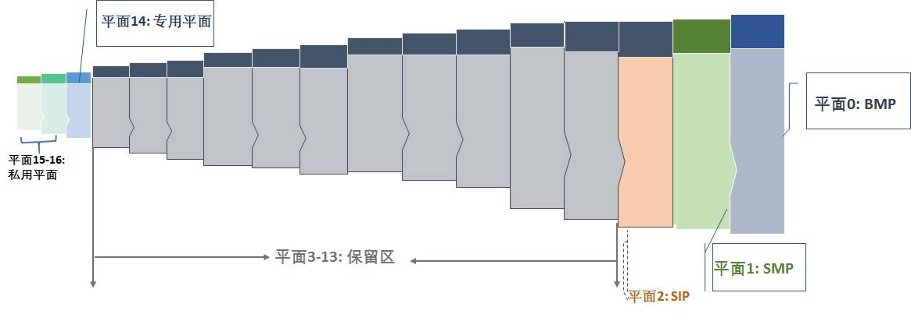
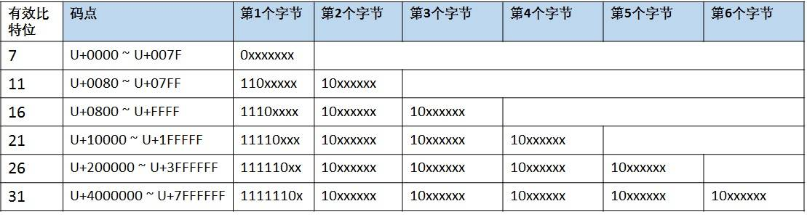
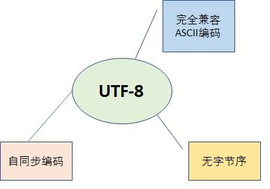
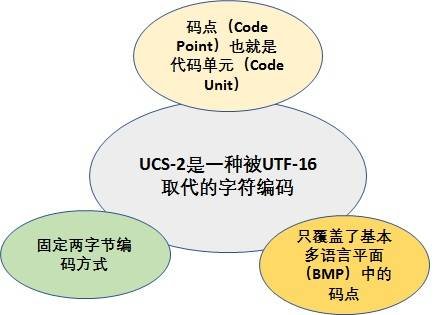
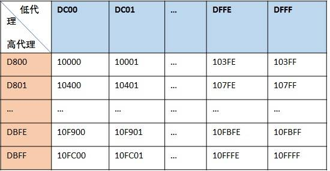
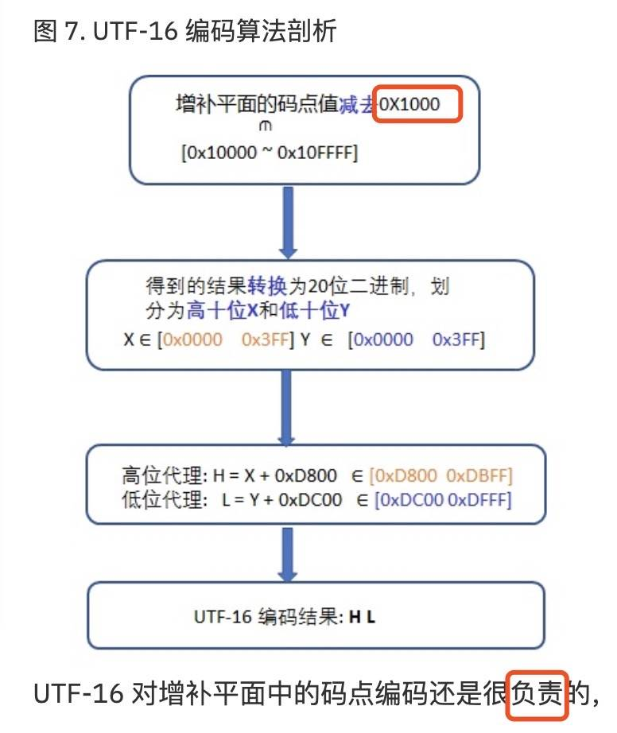
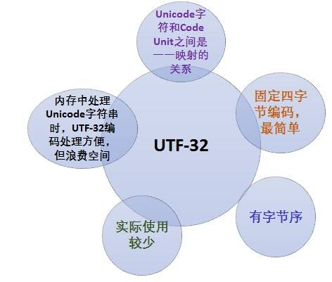
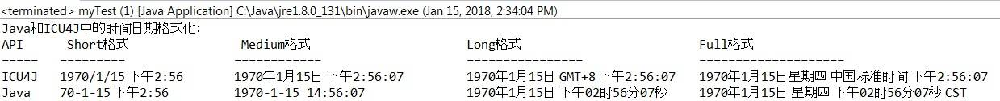
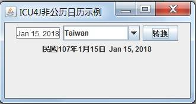
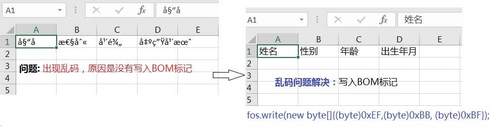

# Unicode 及编码方式概述
结合项目实践，从代码角度总结了如何保证一个 Java Web 应用程序更好的支持 Unicode 规范

**标签:** Java

[原文链接](https://developer.ibm.com/zh/articles/unicode-programming-language/)

夏怀英

发布: 2018-02-22

* * *

## 背景概述

我们都知道计算机是不能直接存储字母，数字，图片，符号等，计算机能处理和工作的唯一单位是”比特位（bit）”，一个比特位通常只有 0 和 1，是（yes）和否（no），真（true）或者假（false）等等我们喜欢的称呼。利用比特位序列来代表字母，数字，图片，符号等，我们就需要一个存储规则，不同的比特序列代表不同的字符，这就是所谓的”编码”。反之，将存储在计算机中的比特位序列（或者叫二进制序列）解析显示出来成对应的字母，数字，图片和符号，称为”解码”。提到编码不得不说到字符集，因为任何一种编码方式都会有一个字符集与之对应。

然而计算机领域通常所讲的字符集实际上是指字符编码集，而不是传统意义上的字符库，除了包括一个系统支持的所有抽象字符（如国家文字、标点符号、图形符号、数字等）外，还包括字符所对应的一个数值，所以通常是一个二维表，下文提到的字符集都是指字符编码集。常见字符集如 ASCII 字符集、ISO-8859-X、GB2312 字符集（简中）、BIG5 字符集（繁中）、GB18030 字符集、Shift-JIS 等等。之前的很长一段时间内，字符集和字符编码区分不是很严格，因为一般一种字符集只对应一种编码方式，但是这些编码方式存在下面的问题：

- 没有一种编码可以覆盖全世界所有国家的字符；
- 各种编码之间也会存在冲突的现象，两种不同编码方式可能使用同一个编码代表不同的字符，亦或用不同的编码代表同一个字符；
- 一个指定的机器（比如我们的服务器）将需要支持许多不同的编码方式，当数据在不同的机器之间传输或者在不同的编码之间转换时，很容易产生乱码问题。

多语言软件制造商组成的统一码联盟(The Unicode Consortium)于 1991 年发布的统一码标准（The Unicode Standard)，定义了一个全球统一的通用字符集即 Unicode 字符集解决了上述的问题。统一码标准为每个字符提供一个唯一的编号，旨在支持世界各地的交流，处理和显示现代世界各种语言和技术学科的书面文本。此外，它支持许多书面语言的古典和历史文本，不管是什么平台，设备，应用程序或语言，都不会造成乱码问题， 它已被所有现代软件供应商采用，是目前所有主流操作系统，搜索引擎，浏览器，笔记本电脑和智能手机以及互联网和万维网（URL，HTML，XML，CSS，JSON 等）中表示语言和符号的基础。统一码标准的一个版本由核心规范、Unicode 标准、代码图、Unicode 标准附件以及 Unicode 字符数据库（Unicode Character Database 简写成 UCD）组成，同时也是开发的字符集，在不断的更加和增加新的字符，最新的版本为 Unicode 10.0.0。

在 Unicode 字符集发布的第三年，ISO/IEC 联合发布了通用多八位编码字符集简称为 UCS(Universal Character Set 通用字符集)，也旨在使用全球统一的通用字符集。两套通用字符集使用起来又存在麻烦，后来统一码联盟与 ISO/IEC 经过协商，到到 Unicode 2.0 时，Unicode 字符集和 UCS 字符集基本保持了一致。现在虽然双方都发布各自的版本，但两套字符集是相互兼容的，Unicode 字符集使用比 UCS 字符集更加广泛。

## Unicode 介绍

世界经济日益全球化的同时，一个应用程序需要在全球范围内使用势在必然，基于 Unicode 的应用程序能够很好地处理来自世界各地的用户文本，并适应其文化习俗。 它通过消除每种语言的构建，安装和维护更新来最大限度地降低成本。Unicode（与其并行 ISO 10646 标准）标准除了覆盖全球所有地区国家使用的字符外，它还定义了一系列文本处理的数据和算法，极大简化了 Unicode 的应用，并确保所有遵守其标准的软件产生相同的结果。在过去十年的广泛应用中，Unicode 成为互联网的基石。

Unicode 编码字符集旨在收集全球所有的字符，为每个字符分配唯一的字符编号即代码点（Code Point），用 U+紧跟着十六进制数表示。所有字符按照使用上的频繁度划分为 17 个平面（编号为 0-16），即基本的多语言平面和增补平面。基本的多语言平面（英文为 Basic Multilingual Plane，简称 BMP）又称平面 0，收集了使用最广泛的字符，代码点从 U+0000 到 U+FFFF，每个平面有 216=65536 个码点；增补平面从平面 1~16，分为增补多语言平面（平面 1）、增补象形平面（平面 2）、保留平面（平 3~13）、增补专用平面等，每个增补平面也有 216=65536 个码点。所以 17 个平总计有 17 × 65,536 = 1,114,112 个码点。图 1 是 Unicode 平面分布图，图 2 是 Unicode 各个平面码点空间。

##### 图 1\. Unicode 17 个平面分布



##### 图 2\. Unicode 平面分布和码点空间


下面是一些相关术语的解释：

- **Coded Character Set（CCS）：** 即编码字符集，给字符表里的抽象字符编上一个数字，也就是字符集合到一个整数集合的映射。这种映射称为编码字符集，Unicode 字符集就是属于这一层的概念；

- **Character Encoding Form （CEF）** ：即字符编码表，根据一定的算法，将编码字符集（CCS） 中字符对应的码点转换成一定长度的二进制序列，以便于计算机处理，这个对应关系被称为字符编码表，UTF-8、 UTF-16 属于这层概念；

- **Code Point:** 码点，简单理解就是字符的数字表示。一个字符集一般可以用一张或多张由多个行和多个列所构成的二维表来表示。二维表中行与列交叉的点称之为码点，每个码点分配一个唯一的编号，称之为码点值或码点编号，除开某些特殊区域(比如代理区、专用区)的非字符码点和保留码点，每个码点唯一对应于一个字符。

- **Code Unit** ：代码单元，是指一个已编码的文本中具有最短的比特组合的单元。对于 UTF-8 来说，代码单元是 8 比特长；对于 UTF-16 来说，代码单元是 16 比特长。换一种说法就是 UTF-8 的是以一个字节为最小单位的，UTF-16 是以两个字节为最小单位的。

- **Code Space** ：码点空间，字符集中所有码点的集合。

- **BOM （ Byte Order Mark ）：** 字节序，出现在文件头部，表示字节的顺序，第一个字节在前，就是”大头方式”（Big-Endian），第二个字节在前就是”小头方式”（Little-Endian）。这两个古怪的名称来自英国作家斯威夫特的《格列佛游记》，在该书中，小人国里爆发了内战，战争起因是人们争论，吃鸡蛋时究竟是从大头(Big-Endian)敲开还是从小头(Little-Endian)敲开。为了这件事情，前后爆发了六次战争，一个皇帝送了命，另一个皇帝丢了王位。


## Unicode 几种常见编码方式

Unicode 字符集中的字符可以有多种不同的编码方式，如 UTF-8、UTF-16、UTF-32、压缩转换等。这里的 UTF 是 Unicode transformation format 的缩写，即统一码转换格式，将 Unicode 编码空间中每个码点和字节序列进行一一映射的算法。下面详细介绍一下这三种常见的 Unicode 编码方式。

**_UTF-8 编码方式_**

UTF-8 是一种变长的编码方式，一般用 1~4 个字节序列来表示 Unicode 字符，也是目前应用最广泛的一种 Unicode 编码方式，但是它不是最早的 Unicode 编码方式，最早的 Unicode 编码方式是 UTF-16。UTF-8 编码算法有以下特点：

1. **首字节码用来区分采用的编码字节数** ：如果首字节以 0 开头，表示单字节编码；如果首字节以 110 开头，表示双字节编码；如果首字节以 1110 开头，表示三字节编码，以此类推；
2. 除了首字节码外， **用 10 开头表示多字节编码的后续字节** ，图 3 列出 UTF-8 用 1~6 个字节所表示的编码方式和码点范围（实际上 1~4 个字节基本可以覆盖大部分 Unicode 码点）；
3. **与 A SCI I 编码方式完全兼容** ：U+0000 到 U+007F 范围内(十进制为 0~127)的 Unicode 码点值所对应的字符就是 ASCII 字符集中的字符，用一个字节表示，编码方式和 ASCII 编码一致；
4. **无字节序** ，在 UFT-8 编码格式的文本中，如果添加了 BOM，则标示该文本是由 UTF-8 编码方式编码的，而不用来说明字节序。

##### 图 3\. UTF-8 编码方式



在实际的解码过程中：

- **情况 1：** 读取到一个字节的首位为 0，表示这是一个单字节编码的 ASCII 字符；

- **情况 2：** 读取到一个字节的首位为 1，表示这是一个多字节编码的字符，如继续读到 1，则确定这是首字节，在继续读取直到遇到 0 为止，一共读取了几个 1，就表示在字符为几个字节的编码；

- **情况 3：** 当读取到一个字节的首位为 1，紧接着读取到一个 0，则该字节是多字节编码的后续字节。


图 4 概述了 UTF-8 编码方式的特点，其中的” **自同步**“表示在传输过程中如果有字节序列丢失，并不会造成任何乱码现象，或者存在错误的字节序列也不会影响其他字节的正常读取。例如读取了一个 10xxxxxx 开头的字节，但是找不到首字节，就可以将这个后续字节丢弃，因为它没有意义，但是其他的编码方式，这种情况下就很可能读到一个完全不同或者错误的字符。

##### 图 4\. UTF-8 编码方式



**_UTF-16 编码方式_**

UTF-16 是最早的 Unicode 字符集编码方式，在概述 UTF-16 之前，需要解释一下 USC-2 编码方式，他们有源远流长的关系，UTF-16 源于 UCS-2。UCS-2 将字符编号（同 Unicode 中的码点）直接映射为字符编码，亦即字符编号就是字符编码，中间没有经过特别的编码算法转换。图 5 对 UCS-2 编码方式的概括。

##### 图 5\. UCS-2 编码方式



由图 5 可知，UCS-2 编码方式只覆盖基本多语言平面的码点，因为 16 位二进制表示的最大值为 0xFFFF，而对于增补平面中的码点（范围为 0x10000~0x10FFFF，十进制为 65536~1114111），两字节的 16 位二进制是无法表示的。为了解决这个问题，The Unicode Consortium 提出了通过代理机制来扩展原来的 UCS-2 编码方式，也就是 UTF-16。其编码算法如下：

1. 基本多语言平面（BMP）中有效码点用固定两字节的 16 位代码单元为其编码，其数值等于相应的码点，桶 USC-2 的编码方式；
2. 辅助多语言平面 1-16 中的有效码点采用代理对（surrogate pair）对其编码：用两个基本平面中未定义字符的码点合起来为增补平面中的码点编码，基本平面中这些用作”代理”的码点区域就被称之为”代理区(Surrogate Zone)”，其码点编号范围为 0xD800~0xDFFF(十进制 55296~57343)，共 2048 个码点。代理区的码点又被分为高代理码点和低代理码点，高代理码点的取值范围为 0xD800~0xDBFF，低代理码点的取值范围为 0xDC00~0xDFFF，高代理码点和低代理码点合起来就是代理对，刚好可以表示增补平面内的所有码点，如图 6 所示。

##### 图 6\. UTF-16 代理对



但是在实际的编码过程中通过查表是很麻烦的，图 7 列出了 UTF-16 编码算法是如何对增补平面中的码点进行编码的。

##### 图 7\. UTF-16 编码算法剖析



UTF-16 对增补平面中的码点编码还是很负杂的，但是由于 UTF-16 是最早的 Unicode 编码方式，已经存在于很多程序中。

**_UTF-32(UCS-4) 编码方式_**

UTF-32 是一个以固定四字节编码方式，ISO 10646 中称其为 UCS-4 的编码机制的子集。优点是每一个 Unicode 码点都和 UTF-16 的 Code Unit 一一对应，程序中如果采用 UTF-32 处理起来比较简单，但是所有的字符都用四个字节，特别浪费空间，所以实际上使用比较少。其特性如图 6 所示。

##### 图 8\. UTF-32 编码



```
UTF-16 和 UTF-32 的最小 Code Unit（编码单元）是双字节即 16 个比特位，即多字节编码方式，因此这两种编码方式都存在字节序标记（BOM）问题。

```

Show moreShow more icon

- **Big-Endian （ BE ）即大端序 ：** 就是高位字节(即大端字节)存放在内存的低地址，低位字节(即小端字节)存放在内存的高地址。UTF-16(BE)以 FEFF 作为开头字节，UTF-32(BE)以 00 00 FE FF 作为开头字节；
- **Little-Endian (LE) 即小端序 ：** 低位字节(即小端字节)存放在内存的低地址，而高位字节(即大端字节)存放在内存的高地址。UTF-16(LE)以 FFFE 作为开头字节，UTF-32(LE)以 FF FE 00 00 作为开头字节。
- **UTF-8 不需要 BOM 来表明字节顺序：** 可以用 BOM（EF BB BF 称为零宽无间断间隔）来表明编码方式，如果接收者收到以 EF BB BF 开头的字节流，就知道这是 UTF-8 编码。

##### 表 1\. Unicode 编码方式中的 BOM

**UTF-8****UTF-16****U TF-16LE****U TF-16BE****UTF-32****UTF-32LE****U TF-16BE****最小 code point**0000000000000000000000000000**最大 c ode point**10FFFF10FFFF10FFFF10FFFF10FFFF10FFFF10FFFF**Code Unit**8 bits16 bits16 bits16 bits32 bits32 bits32 bits**字节序**N/ABOM小端序大端序BOM小端序大端序**编码最小字节数**1222444

备注：表 1 中标着 BOM 的地方表示根据文本头部的字节序确定，如果没有字节序，默认为 BE 即大端序编码。表 2 是几种 Unicode 编码方式示例对比：

##### 表 2\. Unicode 编码示例

**字符****码点 十六进制****码点 二进制****编码方式****编码序列 （二进制）****编码序列 （十六进制）****基本 平面**¢U+00A21010 0010UTF-8 UTF-16 UTF-16BE UTF-16LE UTF-32 UTF-32BE UTF-32LE1100 0010 1010 0010 0000 0000 1010 0010 1111 0000 1010 0100 1010 1101 1010 0010C2 A2 00 A2（默认） 00 A200 A2 00 00 00 00 A2（默认） 00 00 00 A2 00 00 A2 00**增补平面**U+24B620000 0010 0100 1011 0110 0010UTF-8 UTF-16 UTF-16BE UTF-16LE UTF-32 UTF-32BE UTF-32LE1111 0000 1010 0100 1010 1101 1010 0010 1101 1000 0101 0010 1101 1111 0110 0010 0000 0000 0000 0010 0100 1011 0110 0010F0 A4 AD A2 D8 52 DF 62（默认） D8 52 DF 62 52 D8 62 DF 00 02 4B 62（默认） 00 02 4B 62 00 02 4B 62

表 3 对三种编码方式从编码字节数，BOM 以及优缺点方面进行了对比。

##### 表 3\. 三种编码方式的比较

**编码方式****编码字节数****BOM****优点****缺点****UTF-8****不定长** 编码方式，单字节（ASCII 字符）或多字节（非 ASCII 字符）；最小 Code Unit 是 8 位**无字节序** ：如果一个文本的开头有字节流 EF BB BF，表示是 UTF-8 编码**较为理想的 U nicod e 编码方式：** 与 ASCII 编码完全兼容；无字节序；自同步和纠错能力强，适合网络传输和通信；扩展性好变长编码方式不利于程序内部处理，**UTF-16****双字节** （BMP 字符）或者 **四字节** （增补平面字符）；最小 Code Unit 是 16 位**有字节序** ：UTF-16LE（小端序）以 FF FE 代表，UTF-16BE（大端序）以 FE FF 代表最早的 Unicode 编码方式，已被应用于大量环境中；适合内存中 Unicode 处理；很多编程语言的 API 中作为 string 类型的编码方式无法兼容于 ASCII 编码；增补平面码点编码使用代理对，编码复杂；扩展性差**UTF-32**固定 **四字节；** 最小 Code Unit 是 16 位**有字节序：** UTF-16LE（小端序）以 FF FE 代表，UTF-16BE（大端序）以 FE FF 代表固定字节编码读取简单，编译程序内部处理；Unicode 码点和 Code Unit 一一对应关系所有字符以固定四字节编码，浪费存储空间和带宽；与 ASCII 编码不兼容；扩展性差；实际使用少

## ICU 及 ICU4J

ICU (International Components for Unicode) 是一套成熟的、功能强大、易用和跨平台支持 Unicode 标准的 C/C++和 Java 库，为软件应用程序提供 Unicode 和全球化支持。 并且是开放源代码的，IBM 与开源组织合作研究，由 IBM 发布和维护。软件开发者很容易利用 ICU 解决任何软件全球化的问题，根据各地的风俗语言习惯，实现对数字、货币、时间、日期等格式化和解析；对字符串进行转换、搜索和排序等功能，此外，ICU 也提供了对双向字符串（BIDI）算法，对如阿拉伯语和希伯来语有很好的支持。ICU 分为 ICU4C 和 ICU4J，分别对应 Java 和 C/C++平台。

对于 Java 应用程序，ICU4J 逐渐取代了 JDK 提供的相关功能，因为 ICU4J 提供了更多的功能，如基于 CLDR 数据库的 Locale 信息、最新 Unicode 标准的参考实现、实时的版本更新以及较高的性能。最新的 ICU4J 版本是 60.2，对最新的 Unicode 标准 Unicode 10.0，CLDR 32 有很好的支持，并且在 Java 9 上进行了测试，用于数字格式化的新 API 更加注重于可用性，健壮性，表 4 列出了 ICU4J 提供的常用功能及其 API。

##### 表 4\. ICU4J 功能列表

**功能列表****功能介绍****API**Unicode 文本 处理支持 Unicode 标准规定中的所有 Unicode 字符属性UCharacter, UCharacter,UnicodeBlock排序&查找根据特定语言，地区或国家的惯例和标准比较字符串。ICU 的排序规则是基于 Unicode 排序算法以及来自 Common Locale Data Repository 的语言环境特定比较规则CollationElementIterator, Collator RuleBasedCollator基于 CLDR 库的 LocaleUnicode 通用语言环境数据存储库。由 Unicode 联合会（`http://www.unicode.org/cldr/`）维护的 XML 格式的语言环境数据库。该存储库提供软件产品本地化所需的信息，包括日期，时间，数量和货币格式; 排序，搜索和匹配信息; 并翻译了语言，地区，脚本，货币和时区的名称。像苹果、谷歌、IBM、微软、Oracle 等等很多公司都在使用ULocaleResource Bundles资源文件管理UResourceBundle日历&时区在传统的公历日历之外提供了多种类型的日历。提供了一套完整的时区计算 API，比如中国的农历等；Calendar, GregorianCalendar, SimpleTimeZone, TimeZoneBidi支持处理包含从左到右（英文）和从右到左（阿拉伯文或希伯来文）数据混合的文本BidiUnicode 正则 表达式ICU 的正则表达式完全支持 Unicode，同时提供非常有竞争力的性能UnicodeMatcher文本边界在文本范围内查找单词，句子，段落的位置，或在显示文本时标识适合换行的位置BreakIterator, StringCharacterIterator, StringTokenizer格式化：时间&日期根据所选语言环境的风俗习惯格式化数字，日期，时间和货币金额，以及时间日期的缩写等DateFormat, DateFormat.Field, DateFormatSymbols, SimpleDateFormat格式化：数字&货币Currency, DecimalFomat, DecimalFormatSymbols, NumberFormat, NumberFormat.Field文本转换：规范化 Normalization将 Unicode 文本转成等价的规范化格式内容，从而更好的进行比较排序等Normalizer大小写转换大小写转换CaseInsensitiveString代码页转换和 Transliterations将文本数据转换为 Unicode 或其他字符集或编码。ICU 的转换表基于 IBM 在过去几十年中收集的字符集数据，相对是最全面的。Transliterator CharsetICU CharsetEncoderICU CharsetDecoderICU

下面将基于项目实践，列出几个 ICU4J API 应用实例。在支持多语言的应用程序中，根据用户 Locale 对日期时间的显示和解析是最基本的功能。清单 1 是 Java 和 ICU4J 中时间日期格式化显示对比。

##### 清单 1\. Java 和 ICU4J 中的时间日期格式化

```
private static void DateTimeFormat() throws ParseException {
    Date date = new Date(1234567890L);
    Locale locale = Locale.CHINA;
    //ICU4J DateFormat
    DateFormat dateFormatShort =
    com.ibm.icu.text.DateFormat.getDateTimeInstance(
    DateFormat.SHORT, DateFormat.SHORT, locale);
    DateFormat dateFormatMedium =
    com.ibm.icu.text.DateFormat.getDateTimeInstance(
    DateFormat.MEDIUM, DateFormat.MEDIUM, locale);
    DateFormat dateFormatLong =
    com.ibm.icu.text.DateFormat.getDateTimeInstance(
    DateFormat.LONG, DateFormat.LONG, locale);
    DateFormat dateFormatFull =
    com.ibm.icu.text.DateFormat.getDateTimeInstance(
    DateFormat.FULL, DateFormat.FULL, locale);
    //Java DateFormat
    java.text.DateFormat javaDateFormatShort =
        java.text.DateFormat.getDateTimeInstance(
    DateFormat.SHORT, DateFormat.SHORT, locale);
        DateFormat javaDateFormatMedium =
    java.text.DateFormat.getDateTimeInstance(
        DateFormat.MEDIUM, DateFormat.MEDIUM, locale);
    java.text.DateFormat javaDdateFormatLong =
        java.text.DateFormat.getDateTimeInstance(
    DateFormat.LONG, DateFormat.LONG, locale);
        java.text.DateFormat javaDateFormatFull =
    java.text.DateFormat.getDateTimeInstance(
        DateFormat.FULL, DateFormat.FULL, locale);
    String icu_Short = dateFormatShort.format(date);
    String icu_Medium = dateFormatMedium.format(date);
    String icu_long = dateFormatLong.format(date);
    String icu_full = dateFormatFull.format(date);
    String java_Short = javaDateFormatShort.format(date);
    String java_Medium = javaDateFormatMedium.format(date);
    String java_long = javaDdateFormatLong.format(date);
    String java_full = javaDateFormatFull.format(date);
    System.out.println("Java 和 ICU4J 中的时间日期格式化： \nAPI\t Short 格式\t\t Medium
    格式\t\t\tLong 格式\t\t\t\tFull 格式");
    System.out.println("=====\t=========\t\t============\t\t\t================\t\t====================");
    System.out.println("ICU4J\t" + icu_Short + "\t" + icu_Medium +"\t\t" +
    icu_long +"\t" + icu_full);
    System.out.println("Java \t" + java_Short + "\t\t" + java_Medium +"\t\t" +
    java_long +"\t" + java_full);
}

```

Show moreShow more icon

##### 图 9\. Java 和 ICU4J 中的时间日期格式化



根据对比结果可以看出，Java 和 ICU4J 对时间日期格式化的输出结果显示有一些不同，日期和时间格式取决于语言和文化偏好，有些用户可能更喜欢 Java 的格式显示，其他用户可能更喜欢 ICU 的格式显示。这些差异不会在显示输出结果时造成问题。但是格式化差异在解析时间日期字符串时可能会出现一些问题，ICU LONG FORMAT 日期和时间解析功能不能分析基于 Java 的 LONG FORMAT 日期。由于 ICU 解析器不是基于 Java 的日期和时间格式的规则，所以 ICU 解析器将拒绝分析基于 Java 格式的字符串，相反，Java 解析函数将无法分析基于 ICU 的格式。在解析和显示格式化时间日期的时候，需要注意几点：

- 解析器必须与显示格式化工具相同。例如，如果 ICU4J 用于显示格式，则必须使用 ICU 解析器；
- 解析格式样式（如 SHORT）必须与显示格式样式相同。例如，如果显示格式使用 SHORT 格式样式，解析器也需要使用 SHORT 格式；
- 解析器的语言环境必须与显示格式的语言环境相同。例如，如果显示格式使用”汉语中国”语言环境，那么解析器也必须使用”汉语中国”语言环境。

当我们需要创建日历组件的时候，可以使用 Java 库中的日历对象（java.util.Calendar），也可以使用 ICU4J 库中的日历，但是对于支持多语言的程序来说，最好使用 ICU4J 库中的日历空间，因为它支持的类型更多，对国际化支持更好，除了公历之外，还有佛教日历，中国的农历，台湾的民国日历，日本日历等等。ICU 还支持公历日历和其他非公历日历之间的转换，如清单 2 所示的代码片段。

##### 清单 2\. ICU4J 对非公历日历支持

```
public ULocale setLocale(ActionEvent ev) {
    int type = lcList.getSelectedIndex();
    ULocale lc = null;
    if (type == 0) {
        lc = new ULocale("ja_JP@calendar=japanese");
    } else if (type == 1) {
    lc = new ULocale("th_TH@calendar=buddhist");
    } else if (type == 2) {
    lc = new ULocale("ar_SA@calendar=islamic");
    } else if (type == 3) {
    lc = new ULocale("he_IL@calendar=hebrew");
    } else if (type == 4) {
    lc = new ULocale("hi_IN@calendar=indian");
    } else if (type == 5) {
    lc = new ULocale("zh_TW@calendar=roc");
    } else {
    lc = new ULocale("en_US@calendar=coptic");
    }
    return lc;
}
private Calendar setCalendar(ULocale lc, Date date) {
    int type = lcList.getSelectedIndex();
    Calendar ngCalendar;
    if (type == 0) {
        ngCalendar = JapaneseCalendar.getInstance(lc);
    } else if (type == 1) {
    ngCalendar = BuddhistCalendar.getInstance(lc);
    } else if (type == 2) {
    ngCalendar = IslamicCalendar.getInstance(lc);
    } else if (type == 3) {
    ngCalendar = HebrewCalendar.getInstance(lc);
    } else if (type == 4) {
    ngCalendar = IndianCalendar.getInstance(lc);
    } else if (type == 5) {
    ngCalendar = TaiwanCalendar.getInstance(lc);
    } else if (type == 6) {
    ngCalendar = CopticCalendar.getInstance(lc);
    } else {
    ngCalendar = GregorianCalendar.getInstance(lc);
    }
    ngCalendar.setTime(date);
    return ngCalendar;
}

```

Show moreShow more icon

##### 图 10\. ICU4J 对公历和非公历日历之间的转换



## Unicode 支持在 Java Web 程序中应用实践

Unicode 是互联网的基石，为了保证我们的 Web 应用程序很好的支持 Unicode 标准。从代码角度需要考虑 Unicode 支持的地方有（不限于这些，下面是基于笔者项目实践）：

**Java 默认字符集设定** ：通常情况下如 Windows 系统，我们会通过设置环境变量 JAVA\_TOOL\_OPTIONS 将默认编码更改为 UTF-8，下面是 Java 程序默认字符集的优先级顺序：

1. 程序执行时使用 Properties 指定的字符集，如 `System.getProperties().put("file.encoding","UTF-8);`
2. 参数-Dfile.encoding 指定的字符集，如 Windows 可以通过设置环境变量 `JAVA_TOOL_OPTIONS=-Dfile.encoding=UTF-8`
3. 操作系统默认的字符集；
4. JDK 中 JVM 默认的字符集。

**JSP：** 通过 JSP 页面命令<%@ page language=”java” contentType=”text/html; charset=UTF-8″ pageEncoding=”UTF-8″%>设置 JSP 页面的编码方式（pageEncoding）以及提交表单时所使用的编码方式（charset 属性）；

**HTML:**

设置 Content-Type 属性 `<meta http-equiv="Content-Type" content="text/html; charset=UTF-8">；`

**Servlet：** 设置 `response.setContentType("text/html;charset=UTF-8")`，即服务器端编码方式；

**POST 请求：**

通过 request.setCharacterEncoding (“UTF-8”)设置解码方式、response.setCharacterEncoding(“UTF-8”)设置服务器端响应数据的编码方式，如清单 3 所示；

##### 清单 3\. POST 请求字符编码设置

```
protected void service(HttpServletRequest request, HttpServletResponse
    response) throws ServletException, IOException {
    // TODO Auto-generated method stub
    request.setCharacterEncoding("UTF-8");
    response.setCharacterEncoding("UTF-8");
    }

```

Show moreShow more icon

**Get 请求：** Get 请求方式中请求参数会被附加到地址栏的 URL 之后，URL 组成：域名:端口/contextPath/servletPath/pathInfo?queryString，不同的服务器对 URL 中 pathInfo 和 queryString 解码方式设定不一样，比如 Tomcat 服务器一般在 server.xml 中设定的，Tomcat8 之前的版本默认使用的是 ISO-8859-1，但是 Tomcat 8 默认使用的是 UTF-8，如清单 4 所示；另外对于双字节字符如中日韩等作为 URL 的参数时，最好先 URI 编码后在放到 URL 中 URLEncoder.encode(String.valueOf(c),”UTF-8″)；

##### 清单 4\. Tomcat server.xml 设置

```
Tomcat server.xml
<Connector port="8080" protocol="HTTP/1.1"
    maxThreads="150"
    connectionTimeout="20000"
    redirectPort="8443"
    URIEncoding="UTF-8"
    useBodyEncodingForURI="true">

```

Show moreShow more icon

**XML文档：** 设置 `transformer.setOutputProperty(OutputKeys.ENCODING, "UTF-8");`

**调用 API 时指定字符集：** 调用字符串操作相关或者其他 I/O 操作 API 时，最好指定字符集，如 String.getBytes(“UTF-8”)，而不是 String.getBytes()；根据情况必要的时候需要写入 BOM 头，例如 Microsoft Office 在读取 csv 文件的时候，它将首先读取 BOM，然后使用 BOM 中的编码打开文件，这种情况下我们在创建或者导出到 CSV 文件的时候，我们需要在代码里面写入 BOM 头。图 10 所示的例子是创建一个 csv 文件的时候没有写入 BOM，用 Office 打开看到的都是乱码，但是用其他编辑器比如 notepad++显示是正常。当加上 BOM 文件头的时候 fos.write(new byte[]{(byte)0xEF,(byte)0xBB, (byte)0xBF}) 用 Office 再次打开就是正确的字符，代码如清单 5 所示。备注一下，UTF-8 虽然部分大端小端序，但是可以加 BOM 头，表示这个文本是 UTF-8 编码。

##### 图 11\. 缺少 BOM 标记乱码示例



##### 清单 5\. BOM 标记例子

```
private static void createCsvFile() {
    try {
        FileOutputStream fos = new FileOutputStream("c:\\test.csv");
        String str ="姓名,性别,年龄,出生年月";
    fos.write(new byte[]{(byte)0xEF,(byte)0xBB, (byte)0xBF});

        OutputStreamWriter osw = new OutputStreamWriter(fos, "UTF-8");
        BufferedWriter b_writer = new BufferedWriter(osw);
        b_writer.write(str);
        b_writer.close();
    } catch (IOException e) {
        System.out.println(e.toString());
    }
}

```

Show moreShow more icon

**Oracle 数据库：** Oracle 数据库从 7.2 开始支持 Unicode，为了让应用程序更好的支持多语言，当我们新建一个数据库的时候，最好使用 UTF-8 编码格式，从而可以对如 CHAR、VARCHAR2、CLOB、LONG 等 SQL 数据类型使用 UTF-8 进行编码；如果多语言数据可能只出现在某些字段中，那么也可以直接使用支持 Unicode 编码的 SQL 数据类型，如 NCHAR、NVARCHAR2 和 NCLOB，如表 4 列出的常用 SQL 数据类型介绍。

##### 表 5\. SQL 数据类型介绍

**SQL 数据类型****编码方式****内存分配****最大 字节数****Semantics****CHAR**数据库编码方式固定长度2000字节（Bytes）**NCHAR**Unicode固定长度2000字符（character）**VARCHAR2**数据库编码方式变长4000字节/字符(bytes/character）**NVARCHAR2**Unicode变长4000字符（character）

## 结束语

本文介绍了 Unicode 规范，详细概述了 Unicode 常用的三种编码方式编码算法、特点以及他们之间的区别和应用场景，介绍了 ICU4J 库，基于项目实践，终结了如何在 Java Web 程序中更好的支持 Unicode，从而实现应用程序的多语言化，希望能对读者深入理解 Unicode 规范、Unicode 编码方式以及如何让我们的 Web 程序更好的支持 Unicode 提供帮助。