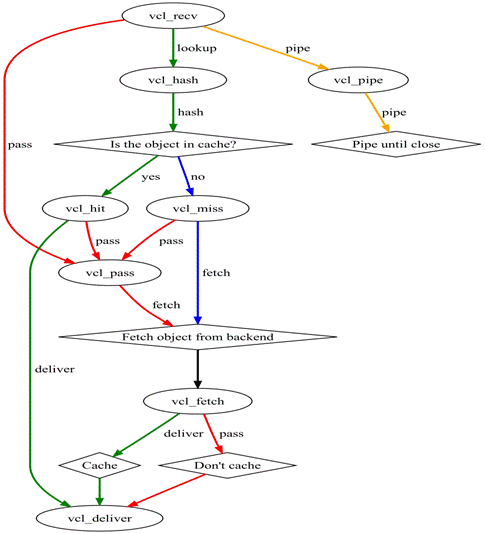
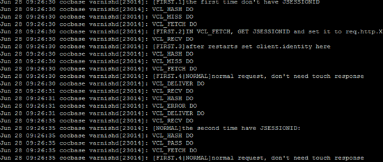
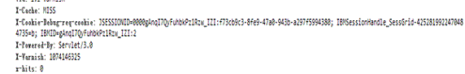

# Varnish 入门
Varnish 的工作流程、安装、配置

**标签:** Web 开发

[原文链接](https://developer.ibm.com/zh/articles/os-cn-varnish-intro/)

王俊峰

发布: 2012-11-01

* * *

本文将详细介绍 varnish 的工作流程、安装、配置三个方面。相信阅读完本文，读者能熟练掌握 varnish。

## Varnish 简介

Varnish 是一款高性能且开源的反向代理服务器和 HTTP 加速器，其采用全新的软件体系机构，和现在的硬件体系紧密配合，与传统的 squid 相比，varnish 具有性能更高、速度更快、管理更加方便等诸多优点，很多大型的网站都开始尝试使用 varnish 来替换 squid，这些都促进 varnish 迅速发展起来。

挪威的最大的在线报纸 Verdens Gang(vg.no) 使用 3 台 Varnish 代替了原来的 12 台 Squid，性能比以前更好，这是 Varnish 最成功的应用案例。

## Varnish 文件缓存的工作流程

Varnish 与一般服务器软件类似，分为 master 进程和 child 进程。Master 进程读入存储配置文件，调用合适的存储类型，然后创建 / 读入相应大小的缓存文件，接着 master 初始化管理该存储空间的结构体，然后 fork 并监控 child 进程。Child 进程在主线程的初始化的过程中，将前面打开的存储文件整个 mmap 到内存中，此时创建并初始化空闲结构体，挂到存储管理结构体，以待分配。Child 进程分配若干线程进行工作，主要包括一些管理线程和很多 worker 线程。

接着，开始真正的工作，varnish 的某个负责接收新 HTTP 连接线程开始等待用户，如果有新的 HTTP 连接过来，它总负责接收，然后唤醒某个等待中的线程，并把具体的处理过程交给它。Worker 线程读入 HTTP 请求的 URI，查找已有的 object，如果命中则直接返回并回复用户。如果没有命中，则需要将所请求的内容，从后端服务器中取过来，存到缓存中，然后再回复。

分配缓存的过程是这样的：它根据所读到 object 的大小，创建相应大小的缓存文件。为了读写方便，程序会把每个 object 的大小变为最接近其大小的内存页面倍数。然后从现有的空闲存储结构体中查找，找到最合适的大小的空闲存储块，分配给它。如果空闲块没有用完，就把多余的内存另外组成一个空闲存储块，挂到管理结构体上。如果缓存已满，就根据 LRU 机制，把最旧的 object 释放掉。

释放缓存的过程是这样的：有一个超时线程，检测缓存中所有 object 的生存期，如果超初设定的 TTL（Time To Live）没有被访问，就删除之，并且释放相应的结构体及存储内存。注意释放时会检查该存储内存块前面或后面的空闲内存块，如果前面或后面的空闲内存和该释放内存是连续的，就将它们合并成更大一块内存。

整个文件缓存的管理，没有考虑文件与内存的关系，实际上是将所有的 object 都考虑是在内存中，如果系统内存不足，系统会自动将其换到 swap 空间，而不需要 varnish 程序去控制。

## Varnish 安装

### 下载 varnish 安装包

建议下载最新稳定版本（现在最新 varnish 版本为 3.0.2），varnish 提供源代码安装包和可执行程序安装包，按照您的习惯下载适合您平台的任一安装包即可。

### 安装 varnish

#### 源代码安装包安装

首先安装 pcre 库，pcre 库是为兼容正则表达式，如果不安装，在安装 varnish2.0 版本以上时，会提示找不到 pcre 库。以下是 pcre 的安装过程，其代码如清单 1 所示：

##### 清单 1\. pcre 库安装代码

```
tar zxvf pcre.tar.gz
     cd pcre/
     ./configure --prefix=/usr/local/pcre/
     Make && make install

```

Show moreShow more icon

安装 varnish，其代码如清单 2 所示：

##### 清单 2\. varnish 安装代码

```
tar xzvf varnish-3.0.2.tar.gz
        cd varnish-3.0.2
        export PKG_CONFIG_PATH =/usr/local/pcre/lib/pkgconfig
        ./configure --prefix=/usr/local/varnish
        make
        make install

```

Show moreShow more icon

#### 可执行程序安装包安装

RedHat 系统环境下的安装 varnish，您需要安装以下软件：automake、autoconf、libtool、ncurses-devel、libxslt、groff、pcre-devel、pkgconfig，然后进行 varnish 的安装，安装代码如清单 3 所示：

##### 清单 3\. varnish 安装代码

```
rpm -i varnish-2.1.4-2.el5.x86_64.rpm

```

Show moreShow more icon

### 启动 varnish

##### 清单 4\. varnish 启动代码

```
varnishd -f /etc/varnish/default.vcl -s file,/var/varnish_cache,1G \
 -T 127.0.0.1:2000 -a 0.0.0.0:9082

```

Show moreShow more icon

各参数的含义如下：

- -f 指定 varnish 的配置文件位置
- -s 指定 varnish 缓存存放的方式，常用的方式有：”-s file,,”。
- -T address:port 设定 varnish 的 telnet 管理地址及其端口
- -a address:port 表示 varnish 对 http 的监听地址及其端口

## Varnish 配置

### VCL 简介

VCL（varnish configuration language）是 varnish 配置语言，其用来定义 varnish 的存取策略。VCL 语法比较简单，跟 C 和 Perl 比较相似。主要有以下几点：

- 块是由花括号分隔，语句以分号结束，使用’ # ‘符号可以添加注释。
- VCL 使用指定运算符”=”、比较运算符”==”、逻辑运算符”!,&&,!!”等形式，还支持正则表达式和用”~”进行 ACL 匹配运算。
- VCL 没有用户自己定义的变量，你可以在 backend、request 或 object 上设置变量值，采用 set 关键字进行设置。例如 set req.backend = director\_employeeui;
- 两个字符串的连接，他们之间没有任何运算符。代码如清单 5 所示：

##### 清单 5\. 字符串连接代码

```
set req.http.X-hit = " hit" "it";

```

Show moreShow more icon

- \\”字符在 VCL 里没有特别的含义，这点与其他语言略有不同。
- VCL 可以使用 set 关键字设置任何 HTTP 头，可以使用 remove 或是 unset 关键字移除 HTTP 头。
- VCL 有 if/else 的判断语句，但是没有循环语句。

### VCL backend

声明并初始化一个后端对象，代码如清单 6 所示

##### 清单 6\. backend 声明代码

```
backend www {
       .host = "www.example.com";
       .port = "9082";
     }

```

Show moreShow more icon

后端对象的使用，代码如清单 7 所示

##### 清单 7\. backend 的使用代码

```
if (req.http.host ~ "^(www.)?example.com$") {
        set req.backend = www;
     }

```

Show moreShow more icon

### VCL 后端的集合 director

VCL 可以把多个 backends 聚合成一个组，这些组被叫做 director，这样可以增强性能和弹力，当组里一个 backend 挂掉后，可以选择另一个健康的 backend。VCL 有多种 director，不同的 director 采用不同的算法选择 backend，主要有以下几种：

- The random director

    Random director 会根据所设置的权值（weight）来选择 backend，.retries 参数表示尝试找到一个 backend 的最大次数，.weight 参数表示权值

- The round-robin director

    Round-robin director 在选择 backend 时，会采用循环的方式依次选择。

- The client director

    Client director 根据 client.identity 来选择 backend，您可以设置 client.identity 的值为 session cookie 来标识 backend。


### backend probes

VCL 可以设置 probe 来检测一个 backend 是否健康，定义一个 backend probes 代码如清单 8 所示：

##### 清单 8\. 定义 backend probes 代码

```
backend www {
      .host = "www.example.com";
      .port = "9082";
      .probe = {
        .url = "/test.jpg";// 哪个 url 需要 varnish 请求
        .timeout = 1 s;// 等待多长时间超时
        .interval = 5s// 检查的时间间隔
             .window = 5;// 维持 5 个 sliding window 的结果
        .threshold = 3;// 至少有三次 window 是成功的，就宣告 backend 健康
      }
     }

```

Show moreShow more icon

### ACL

ACL 可创建一个客户端的访问控制列表，你可以使用 ACL 控制哪些客户端可以访问，哪些客户端禁止访问。定义 ACL 代码如清单 9 所示：

##### 清单 9\. ACL 定义代码

```
Acl local{
       "localhost";
       "192.0.2.0"/24;
       !"192.0.2.23";// 除去该 IP
     }

```

Show moreShow more icon

### VCL 内置函数

#### vcl\_recv 函数

用于接收和处理请求。当请求到达并成功接收后被调用，通过判断请求的数据来决定如何处理请求。例如如何响应、怎么响应、使用哪个后端服务器等。

此函数一般以如下几个关键字结束。

pass：表示进入 pass 模式，把请求控制权交给 vcl\_pass 函数。

pipe：表示进入 pipe 模式，把请求控制权交给 vcl\_pipe 函数。

lookup：表示进入 lookup 模式，把请求控制权交给 lookup 指令处理，在缓存中查找被请求的对象，并且根据查找的结果把控制权交给函数 vcl\_hit 或函数 vcl\_miss。

error code [reason]：表示返回”code”给客户端，并放弃处理该请求。”code”是错误标识，例如 200 和 405 等。”reason”是错误提示信息。

#### vcl\_pipe 函数

此函数在进入 pipe 模式时被调用，用于将请求直接传递至后端主机，在请求和返回的内容没有改变的情况下，将不变的内容返回给客户端，直到这个连接被关闭。

此函数一般以如下几个关键字结束。

error code [reason]。

pipe。

#### vcl\_pass 函数

此函数在进入 pass 模式时被调用，用于将请求直接传递至后端主机。后端主机在应答数据后将应答数据发送给客户端，但不进行任何缓存，在当前连接下每次都返回最新的内容。

此函数一般以如下几个关键字结束。

error code [reason]。

pass。

restart 重新启动流程，增加启动次数，如果重新启动次数高于 max\_restarts 发出一个错误警告

#### vcl\_hash

当您想把一个数据添加到 hash 上时，调用此函数。

此函数一般以如下几个关键字结束。

Hash。

#### vcl\_hit 函数

在执行 lookup 指令后，在缓存中找到请求的内容后将自动调用该函数。

此函数一般以如下几个关键字结束。

deliver：表示将找到的内容发送给客户端，并把控制权交给函数 vcl\_deliver。

error code [reason] 。

pass。

restart 重新启动流程，增加启动次数，如果重新启动次数高于 max\_restarts 发出一个错误警告

#### vcl\_miss 函数

在执行 lookup 指令后，在缓存中没有找到请求的内容时自动调用该方法。此函数可用于判断是否需要从后端服务器获取内容。

此函数一般以如下几个关键字结束。

fetch：表示从后端获取请求的内容，并把控制权交给 vcl\_fetch 函数。

error code [reason] 。

pass。

#### vcl\_fetch 函数

在后端主机更新缓存并且获取内容后调用该方法，接着，通过判断获取的内容来决定是将内容放入缓存，还是直接返回给客户端。

此函数一般以如下几个关键字结束。

error code [reason]。

pass。

deliver。

esi。

restart 重新启动流程，增加启动次数，如果重新启动次数高于 max\_restarts 发出一个错误警告

#### vcl\_deliver 函数

将在缓存中找到请求的内容发送给客户端前调用此方法。

此函数一般以如下几个关键字结束。

error code [reason]。

deliver。

restart 重新启动流程，增加启动次数，如果重新启动次数高于 max\_restarts 发出一个错误警告

#### vcl\_error

出现错误时调用此函数。

此函数一般以如下几个关键字结束。

deliver。

restart。

### VCL 处理流程

VCL 处理的流程图如图 1 所示

##### 图 1.VCL 处理流程



Varnish 处理 HTTP 请求的过程大致分为如下几个步骤。

- Receive 状态（vcl\_recv）。也就是请求处理的入口状态，根据 VCL 规则判断该请求应该 pass（vcl\_pass）或是 pipe（vcl\_pipe），还是进入 lookup（本地查询）。
- Lookup 状态。进入该状态后，会在 hash 表中查找数据，若找到，则进入 hit（vcl\_hit）状态，否则进入 miss（vcl\_miss）状态。
- Pass（vcl\_pass）状态。在此状态下，会直接进入后端请求，即进入 fetch（vcl\_fetch）状态
- Fetch（vcl\_fetch）状态。在 fetch 状态下，对请求进行后端获取，发送请求，获得数据，并根据设置进行本地存储。
- Deliver（vcl\_deliver）状态。将获取到的数据发给客户端，然后完成本次请求。

### VCL 内置公共变量

VCL 内置的公共变量可以用在不同的 VCL 函数中，下面根据使用的不同阶段进行介绍

当请求到达时，可以使用的公共变量表 1 所示

##### 表 1\. 请求到达时可用公共变量

公共变量名含义req.backend指定对应的后端主机server.ip表示服务器 IPclient.ip表示客户端 IPreq.quest只是请求的类型，例如 GET、HEAD 等req.url指定请求的地址req.proto表示客户端发起请求的 HTTP 协议版本req.http.header表示对应请求中的 HTTP 头部信息req.restarts表示重启次数，默认最大值为 4

Varnish 在向后端主机请求时，可是用的公共变量如表 2 所示

##### 表 2\. 向后端主机请求时可用公共变量

公共变量名含义beresp.requset指定请求类型，例如 GET、HEAD 等beresp.url表示请求地址beresp.proto表示客户端发起请求的 HTTP 协议版本beresp.http.header表示对应请求中 HTTP 头部信息beresp.ttl表示缓存的生存周期，cache 保留时间（s）

从 cache 或是后端主机获取内容后，可以使用的公共变量如表 3 所示

##### 表 3\. 后端主机获取内容时可使用公共变量

公共变量名含义obj.status返回内容的请求状态码，例如 200、302、504 等obj.cacheable返回的内容是否可以缓存obj.valid是否有效的 HTTP 请求obj.response返回内容的请求状态信息obj.proto返回内容的 HTTP 版本obj.ttl返回内容的生存周期，也就是缓存时间，单位秒obj.lastuse返回上一次请求到现在的时间间隔，单位秒

对客户端应答时，可以使用的公共变量如表 4 所示

##### 表 4\. 对客户端相应时可使用公共变量

公共变量名称含义resp.status返回给客户端的 HTTP 代码状态resp.proto返回给客户端的 HTTP 协议版本resp.http.header返回给客户端的 HTTP 头部消息resp.response返回给客户端的 HTTP 头部状态

### VCL 调试

VCL 为配置文件语言，无法像 c/c++ 那样进行单步调试，当 VCL 运行的效果和预期效果不一样时，很难发现哪出现逻辑错误，这时除了查看代码查找错误外，我们还可以采用内置 C 语言和浏览器查看返回对象中的状态来查找逻辑的错误。

我们可以采用内置 C 语言来打印相应的信息，例如我们可以在相应的地方打印信息，来查看 VCL 流程的执行是否正确。内置 C 语言打印信息代码如清单 10 所示：

##### 清单 10\. 打印信息代码

```
C{
        #include<syslog.h>// 首先要包含头文件
      }C
      C{
        Syslog(LOG_INFO,"VCL run here in function xxx in line xxx");
      }C

```

Show moreShow more icon

启动 varnish 后，我们可以采用 tail -f /var/log/messages 命令在 /var/log/messages 中查看相应的打印信息。查看的打印信息如图 2 所示：

##### 图 2\. varnish 打印信息



我们还可以将某些变量的值设置到返回给浏览器的对象上，然后在浏览器中查看该变量的值。设置变量值代码如清单 11 所示：

##### 清单 11\. varnish 变量设置代码

```
set beresp.http.X-Cookie-Debug-req-cookie = req.http.Cookie;

```

Show moreShow more icon

在 chrome 浏览器中查看 beresp.http.X-Cookie-Debug-req-cookie 的值，结果如图 3 所示：

##### 图 3\. 在浏览器中查看 varnish 变量的值



## 结束语

本文介简单介绍了 varnish，并对其工作流程、安装以及配置进行了详细讲解。通过本文，可以很快的掌握 varnish。