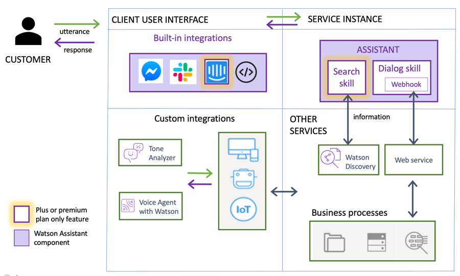

# Watson Assistant 简介
了解 Watson Assistant 服务的基础知识

**标签:** Watson Assistant,人工智能,对话,机器学习,深度学习

[原文链接](https://developer.ibm.com/zh/articles/introduction-watson-assistant/)

[Scott Dangelo](https://developer.ibm.com/zh/profiles/scott.dangelo)

发布: 2019-09-19

* * *

本文已纳入 [Watson Assistant 学习路径](https://developer.ibm.com/cn/blog/2019/learning-path-watson-assistant/)。参阅 [Watson Assistant](https://www.ibm.com/cloud/watson-assistant/) 页面，了解有关功能和入门的更多信息。

级别主题类型**100****[Watson Assistant 简介](https://developer.ibm.com/zh/articles/introduction-watson-assistant/)**文章101[创建第一个由 Assistant 支持的聊天机器人](https://developer.ibm.com/zh/tutorials/create-your-first-assistant-powered-chatbot/)教程200[组装比萨饼订购聊天机器人对话](https://developer.ibm.com/cn/patterns/assemble-a-pizza-ordering-chatbot-dialog/)Code Pattern201[创建银行业务聊天机器人](https://developer.ibm.com/cn/patterns/create-cognitive-banking-chatbot/)Code Pattern300[使用 Watson Assistant 创建 Google Action](https://developer.ibm.com/patterns/create-an-agent-for-rental-car-reservations/)Code Pattern301[使用无服务器架构和对话创建 Alexa 技能](https://developer.ibm.com/cn/patterns/create-an-alexa-skill-with-serverless-and-a-conversation/)Code Pattern400[使用 Voice Gateway 创建下一代呼叫中心](https://developer.ibm.com/zh/patterns/create-a-next-generation-call-center-with-voice-gateway/)Code Pattern

**免费试用 IBM Cloud**

利用 [IBM Cloud Lite](https://cocl.us/IBM_CLOUD_GCG)
快速轻松地构建您的下一个应用程序。您的免费帐户从不过期，而且您会获得 256 MB 的 Cloud Foundry 运行时内存和包含
Kubernetes 集群的 2 GB 存储空间。 [了解所有细节](https://www.ibm.com/cloud/blog/announcements/introducing-ibm-cloud-lite-account-2) 并确定如何开始。

## 概述

通过 IBM Watson Assistant，您可以在任何应用程序、设备或通道中构建对话接口。大多数虚拟助手都会尝试模仿人类互动，但 Watson Assistant 远不止如此。Watson Assistant 知道何时从知识库中搜索答案、何时请求澄清以及何时为您转人工服务。以下视频提供了 Watson Assistant 服务的高级概述。

本文是 [学习路径](https://developer.ibm.com/cn/blog/2019/learning-path-watson-assistant/) 的第一部分，旨在帮助您更深入地了解 Watson Assistant 的工作方式，以及如何将它与其他应用程序集成来构建自己的虚拟助手。

## 为何选择使用 Watson Assistant？

大家可能认为虚拟助手或聊天机器人都是一些噱头，但它们的发展远远超出我们的想象。您可以使用机器人设置约会、叫车等。它不是搜索工具的替代品。Amazon Echo 和 Google Home 堪称是虚拟助手的范例。因为没有界面，所以肯定会提供一个结构良好的对话。

可以看出 Watson Assistant 优势的几个例子包括客户自助服务和员工自助服务。Watson Assistant：

- 直接与 Slack 或 Facebook Messenger 等终端渠道集成，因此您可以在用户最方便的任何地方处理请求
- 知道何时直接提供常见问题的答案，何时提供更复杂问题的更全面的搜索结果参考
- 存储用户互动中产生的数据，以便用于指导用户体验并随时间推移实现用户体验个性化
- 当虚拟助手无法处理问题时，交给人工代理来处理

## 架构

下图显示了所有实施通用的 Watson Assistant 架构。在此架构中：

- 用户通过以下一个或多个集成点来与助手进行互动：

    - 虚拟助手，您直接将其发布到现有社交媒体消息传递平台（如 Slack 或 Facebook Messenger）。

    - 您开发的定制应用程序（例如，带有语音接口的移动应用程序或机器人）。
- 该助手将接收用户输入，然后将其路由到对话技能。

- 对话技能将进一步解释用户输入，然后指导完成对话流程。该对话将收集代表用户响应或执行事务时所需的任何信息。

- 对话技能无法回答的任何问题都会发送到搜索技能，然后搜索技能通过搜索您为此目的配置的公司知识库来查找相关答案。

_在部署 Watson Assistant 时使用的典型方法_

## 术语

本部分介绍了在您完成学习路径以在应用程序中使用 Watson Assistant 时需要了解的术语。

术语定义[技能](https://cloud.ibm.com/docs/services/assistant?topic=assistant-skills)使助手能够帮助您的客户的人工智能容器。[助手](https://cloud.ibm.com/docs/services/assistant?topic=assistant-assistants)将请求引向最佳路径以解决客户问题。添加相关技能，让助手可以直接提供常见问题的答案或提供更复杂问题的更全面的搜索结果参考。[对话](https://cloud.ibm.com/docs/services/assistant?topic=assistant-dialog-overview)根据客户的需求，定义助手对客户的响应。 在该工具中，以图形方式将对话流表示为树。[意图](https://cloud.ibm.com/docs/services/assistant?topic=assistant-intents)您预期用户在与助手互动时要达到的目标。例如，您可以定义名为 `store_hours` 的意图，用于回答有关店铺营业时间的问题。[实体](https://cloud.ibm.com/docs/services/assistant?topic=assistant-entities#entities-described)为意图提供上下文的术语或对象。例如，实体可能是城市名称，有助于对话辨别用户想知道哪家店铺的营业时间。[内容目录](https://cloud.ibm.com/docs/services/assistant?topic=assistant-catalog)向 Watson Assistant 对话添加常见意图的简单方法。

## 在何处提供 Watson Assistant？

在公共云和私有云中都提供了 Watson Assistant。

- **公共云**：在 [IBM Cloud](https://cloud.ibm.com/catalog/services/watson-assistant?cm_sp=ibmdev-_-developer-articles-_-cloudreg) 上提供了 Watson Assistant。Watson Assistant [“入门教程”](https://cloud.ibm.com/docs/services/assistant?topic=assistant-getting-started) 提供了有关设置该服务的其他信息。

- **私有云**：在 IBM 私有云中也提供了 Watson Assistant，采用内部部署或托管方式，通过 [IBM Cloud Pak for Data](https://www.ibm.com/products/cloud-pak-for-data) 和 [Watson Assistant 附加组件](https://docs-icpdata.mybluemix.net/docs/content/SSQNUZ_current/com.ibm.icpdata.doc/zen/admin/add-ons.html) 来提供。

## SDK

提供了几个支持各种 AI 服务的 SDK。并不限于以下列表。

- [Node SDK](https://github.com/watson-developer-cloud/node-sdk)
- [Python SDK](https://github.com/watson-developer-cloud/python-sdk)
- [Swift SDK](https://github.com/watson-developer-cloud/swift-sdk)
- [Java SDK](https://github.com/watson-developer-cloud/java-sdk)
- [Go SDK](https://github.com/watson-developer-cloud/go-sdk)
- [Ruby SDK](https://github.com/watson-developer-cloud/ruby-sdk)
- [.NET SDK](https://github.com/watson-developer-cloud/dotnet-standard-sdk)
- [Salesforce SDK](https://github.com/watson-developer-cloud/salesforce-sdk)

## API

[Watson Assistant V1 API](https://cloud.ibm.com/apidocs/assistant) 可用于帮助您入门，但我们建议对应用程序使用 [Watson Assistant V2 API](https://cloud.ibm.com/apidocs/assistant-v2)。

## 摘要

本文是 [学习路径](https://developer.ibm.com/cn/blog/2019/learning-path-watson-assistant/) 的第一部分，指导您完成 Watson Assistant 服务的部署，使用所含工具创建意图、实体及与其他应用程序的集成。要深入了解 Watson Assistant（包括功能和定价），参阅 [Watson Assistant 产品页面](https://www.ibm.com/cloud/watson-assistant/)。要继续完成此学习路径，请查看该过程中的下一步，即， [创建第一个由 Assistant 支持的聊天机器人](https://developer.ibm.com/zh/tutorials/create-your-first-assistant-powered-chatbot/)。

本文翻译自： [Introduction to Watson Assistant](https://developer.ibm.com/articles/introduction-watson-assistant/)（2019-08-06）