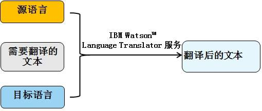
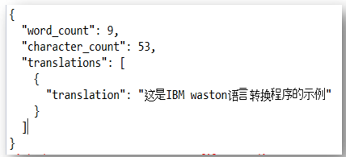
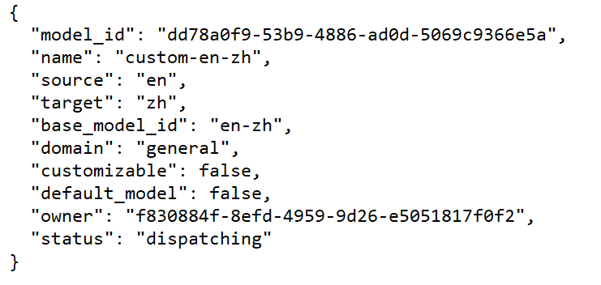
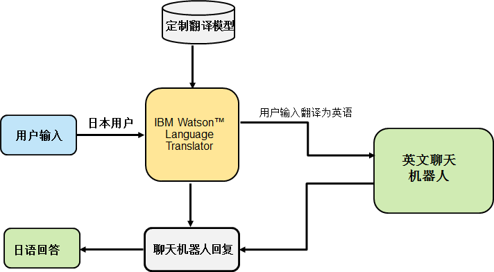

# Watson Language Translator 定制翻译模型介绍和应用实践
借助 Watson Language Translator 定制属于你的翻译模型

**标签:** 分析

[原文链接](https://developer.ibm.com/zh/articles/ba-lo-watson-language-translator-custom-translation-model/)

夏 怀英, 陈 梦奇, 林 志远

发布: 2019-03-13

* * *

## Watson Language Translator 介绍

IBM Watson™ Language Translator 支持以编程的方式将文本从一种语言翻译到另一种语言，包括新闻、对话和特定领域中的文本。目前该服务可识别的语言有 62 种，其中支持即时翻译的语言达到 22 种。该服务还采用神经机器翻译，与以前的技术相比，它在翻译流畅度方面得到了显著提升，还可以支持更多的语言。除此之外，IBM Watson™ Language Translator 还具有数据隐私保护、文档翻译、构建自定义模型、与其他服务集成等特性。

## 定制翻译模型介绍

IBM Watson™ Language Translator 定制翻译模型让客户用特定于公司自己的术语来翻译程序，翻译服务中的定制翻译模型对于满足许多行业，企业和国家的特定需求至关重要。让客户使用自己的数据在 Language Translator API 中创建定制字典和定制翻译模型。IBM Watson™ Language Translator 定制翻译模型支持两种类型的定制，还有基于 Web 的非开发人员的定制工具。现在支持的两种定制模型包括：

强制术语表：用户可以设置自定义术语 – 翻译对，以便始终将给定术语转换为指定术语。

平行语料库：条目被视为平行语料库而不是术语表。 平行语料库添加了翻译模型从中学习的示例和上下文，以改进翻译的响应。

**免费试用 IBM Cloud**

利用 [IBM Cloud Lite](https://console.bluemix.net/) 快速轻松地构建您的下一个应用程序。您的免费帐户从不过期，而且您会获得 256 MB 的 Cloud Foundry 运行时内存和包含 Kubernetes 集群的 2 GB 存储空间。 [了解所有细节](https://developer.ibm.com/dwblog/2017/building-with-ibm-watson/) 并确定如何开始。如果您不熟悉 IBM Cloud，请查阅 [developerWorks 上的 IBM Cloud Essentials 课程](http://developer.ibm.com/courses/all-courses/bluemix-essentials/)。

## 如何使用定制翻译模型

在介绍定制翻译模型之前先介绍一下 IBM Watson™ Language Translator 的使用。IBM Watson™ Language Translator 和其他的翻译引擎一样，输入有源语言、目标语言和需要翻译的文本，通过 IBM Watson™ Language Translator 翻译服务得到翻译后的目标语言文本，如图 1 所示。

##### 图 1\. IBM Watson™ Language Translator 翻译原理



清单 1 是通过 Java API 调用 IBM Watson™ Language Translator 示例。

**输入** ：源语言、需要翻译的文本和目标语言；

**Watson™ Language Translator API** ：用户名、密码和 endpoint。Watson Language Translator 提供两种认证方式即基于令牌的身份和访问管理（IAM）身份验证和用户名密码方式认证，清单 1 采用的是用户名和密码方式认证；

**输出** ：翻译的文本，以 json 格式输出。

##### 清单 1\. 通过 Java API 调用 IBM Watson™ Language Translator

```
public class LanguageTranslation {
    private static String data =
     "{\"textToTranslate\": \"This is the example of IBM watson language translator.\","
            " \"username\": \"d1a0b641-5c3d-42cc-bad9-a988ee611b5c\"," +
            " \"password\": \"jRoMq8dvbzTX\"," +
            " \"endpoint\":
                \"https://api.us-south.language-translator.watson.cloud.ibm.com/api\"," +
            " \"skip_authentication\": \"true\"
        }";

    public static void main(String[] args) {
        JsonParser parser = new JsonParser();
        JsonObject jsonArgs = parser.parse(data).getAsJsonObject();
        main(jsonArgs);
      }

      public static JsonObject main(JsonObject args) {
        JsonParser parser = new JsonParser();
        LanguageTranslator service = new LanguageTranslator("2018-05-01");
        String username = args.get("username").getAsString();
        String password = args.get("password").getAsString();
        service.setUsernameAndPassword(username, password);
        if (args.get("endpoint") != null)
            service.setEndPoint(args.get("endpoint").getAsString());
if (args.get("skip_authentication")!= null)
service.setSkipAuthentication((args.get("skip_authentication")
                .getAsString() == "true") ? true : false);
         String textToTranslate = args.get("textToTranslate").getAsString();
        TranslateOptions translateOptions = new TranslateOptions.Builder()
            .addText(textToTranslate)
            .source(Language.ENGLISH)
            .target(Language.CHINESE)
            .build();

         TranslationResult result = service.translate(translateOptions).execute();
          JsonObject returnObject = parser.parse(result.toString()).getAsJsonObject();
            return returnObject;
          }
          }

```

Show moreShow more icon

##### 图 2\. 清单 1 输出的翻译文本



下面介绍一下如何使用定制翻译模型，使用定制翻译模型通常有以下六个步骤：

**准备：** 创建 Watson Language Translator 服务

**步骤 1** ：创建训练数据

**步骤 2** ：训练翻译模型

**步骤 3：** 检查翻译模型的状态

**步骤 4** ：使用定制翻译模型进行翻译

**步骤 5：** 删除定制翻译模型

下面将详细介绍这六个步骤的应用情况：

**准备：** 创建 Watson Language Translator 服务

Watson Language Translator 服务分为三个等级，Standard、Advanced 以及 Premium。如果需要定制翻译模型，则需要选择 Advanced 或者 Premium 等级的服务。创建完成后，就会获得此服务的一个凭证，包括 URL、Username 以及 Password。

**步骤 1：创建训练数据**

创建训练数据是所有定制过程的基础，也是最为关键的一个步骤。训练数据主要由源语言和目标语言一一配对，组成训练数据，并结合对训练数据的说明信息，来形成训练文档。

用户可以根据不同的需求，来创建不同的训练数据。强制术语表模式，其中包含的术语或短语对是您希望翻译服务视为必需的绝对而明确的术语。或者，平行语料库模式，其中包含的术语或短语对用作您希望翻译服务考虑的备用翻译建议。

在 Language Translator 服务中，训练文档采用 Translation Memory Exchange (TMX) 格式。TMX 是一种专为机器翻译工具设计的 XML 规范，采用 UTF-8 编码。Language Translator 服务对不同模式的定制模型的训练文档，有不同的限制：

强制术语表：

1. 训练数据格式为 TMX
2. 训练文档最大支持 10MB
3. 可以在基础模型上或平行语料库模型上建立强制术语表
4. 每个模型里只允许有一个强制术语表

平行语料库：

1. 训练数据格式为 TMX
2. 翻译对的最小数目为 5,000
3. 训练文档最大支持 250 MB
4. 只要文件的累积大小不超过 250MB，就可以提交多个并行的训练文档。

Language Translator 服务对不同方式的定制模型的训练文档除了上述的一些基本限制外，在训练数据上并没有太多的差异。下面以强制术语表模式为例，来对 TMX 格式进行说明。

##### 清单 2\. 强制术语表模式的 TXM 格式

```
<?xml version="1.0" encoding="UTF-8"?>
<tmx version="1.4">
<header creationtool="" creationtoolversion=""
    segtype="sentence" o-tmf="" adminlang="EN"
    srclang="en" datatype="rtf" o-encoding="UTF-8" />
<body>
    <tu>
      <tuv xml:lang="en">
        <seg>IBM</seg>
      </tuv>
      <tuv xml:lang="zh">
        <seg>国际商业机器公司</seg>
      </tuv>
    </tu>
    <tu>
      <tuv xml:lang="en">
        <seg>java</seg>
      </tuv>
      <tuv xml:lang="zh">
        <seg>Java</seg>
      </tuv>
    </tu>
</body>
</tmx>

```

Show moreShow more icon

上述例子是对某些词汇做英文翻译到中文的训练，可以看到，在 TMX 文档中，所有的翻译对都放置在 标签内，并通过  标签来区分每个翻译对。在  标签中，又通过  标签来区分源翻译和目标翻译。最后，不论源翻译还是目标翻译，都是放置在  标签内。除了 部分的训练数据外，TMX 文档在

 部分，对整个文档的训练数据进行了说明。具体的属性及属性值的填写可参考 [TMX 1.4b](http://www.ttt.org/oscarStandards/tmx/) 。

**步骤 2：训练模型**

训练模型的操作比较简便，首先在现有的普通模型中选定一个为基础模型，然后利用步骤 1 中创建的训练文档，使用 Create Model 方法就可以实现定制翻译模型的训练。请参考以下代码。

##### 清单 3\. 训练模型示例

```
public static void main(String[] args) throws FileNotFoundException {
    LanguageTranslator languageTranslator = new                                     LanguageTranslator("2018-05-01");
    languageTranslator.setUsernameAndPassword(username, password);
    languageTranslator.setEndPoint(url);

    File glossary = new File("src/test/java/wlt/wlt_test01/glossary.tmx");
    CreateModelOptions createModelglossaryOptions = new CreateModelOptions
            .Builder()
                .baseModelId("en-zh")
                .name("custom-en-zh")
                .forcedGlossary(glossary)
                .build();
    TranslationModel modelglossary = languageTranslator.createModel(createModelglossaryOptions).execute();
    System.out.println(modelglossary);
}

```

Show moreShow more icon

结合步骤一中的训练数据，我们是将英文转换成简中，因此我们在现有的普通模型中选定”en-zh”为基础模型，即 baseModelId 为(“en-zh”)，另外，我们采用的是强制术语表模式，因此这里用到 forcedGlossary 属性，并在属性值中添加训练文档的路径。创建训练模型大概会花几分钟到几个小时的时间，这取决于你的训练文档的大小，一般强制术语表的训练时间会稍短些，而平行语料库因为有庞大的训练数据，一般会花费较长的时间。

**步骤 3：检查翻译模型的状态**

执行了清单 3 中的代码后，可以得到如下的定制翻译模型信息。

##### 图 3\. 清单 3 执行后输出的定制翻译模型信息



可以看到，在执行了 Create Model 方法后，生成了一个新的 model\_id，这个就是新创建的定制翻译模型的 ID，后续都会使用到这个 model\_id。另外，此时的状态是 dispatching，表示这个定制翻译模型还没有训练完成。后续可以使用 List Models 方法查看这个定制翻译模型的状态。

模型的状态大概分为：Uploading、Uploaded、dispatching、queued、training、trained、publishing、available、deleted、error。在训练模型创建后，比较常见的状态是 dispatching 和 publishing，这表示训练模型还没有完成，正在进行中，之后如果出现 available，则表示训练数据完成，可以正常使用翻译模型，如果在过程中出现了问题，则会显示 error。

**步骤 4： 使用定制翻译模型进行翻译**

等到创建的定制翻译模型状态变到 available 以后，就可以通过 Translation 方法来使用这个定制的翻译模型了，示例代码如下。

##### 清单 4\. 使用定制翻译模型进行翻译示例

```
public static void main(String[] args) throws FileNotFoundException {

    LanguageTranslator languageTranslator = new LanguageTranslator("2018-05-01");
    languageTranslator.setUsernameAndPassword(username, password);
    languageTranslator.setEndPoint(url);

    TranslateOptions translateOptions = new TranslateOptions
                .Builder()
                .addText("java")
                .modelId("dd78a0f9-53b9-4886-ad0d-5069c9366e5a")
                .build();

    TranslationResult translationResult = languageTranslator.translate(translateOptions).execute();
    System.out.println(translationResult);
}

```

Show moreShow more icon

采用以上代码后，结合我们在训练数据中的设定，”java”得到的翻译结果为”Java”，从小写变换到了大写，这正是我们期望出现的翻译结果。若将清单 4 中的定制翻译模型改成普通模型，即 modelId(“dd78a0f9-53b9-4886-ad0d-5069c9366e5a”)改成 modelId(“en-zh”)，再次执行后，”java”则会翻译成”爪哇”，这并不是我们想要的。

**步骤 5： 删除定制翻译模型**

创建完定制模型以后，如果不再需要的话，可以使用 Delete Model 方法来删除定制翻译模型，示例代码如清单 5 所示。

##### 清单 5\. 删除定制翻译模型示例

```
public static void main(String[] args) throws FileNotFoundException {

    LanguageTranslator languageTranslator = new                                 LanguageTranslator("2018-05-01");
    languageTranslator.setUsernameAndPassword(username, password);
    languageTranslator.setEndPoint(url);

    DeleteModelOptions deleteOptions = new DeleteModelOptions
                .Builder()                                                                .modelId("dd78a0f9-53b9-4886-ad0d-5069c9366e5a")
                .build();
    languageTranslator.deleteModel(deleteOptions).execute();
}

```

Show moreShow more icon

删除成功以后，可以通过 List Model 方法检验是否已经删除。如果已经删除了，在列表中将不会出现已经删除的这个定制翻译模型。

## 定制翻译模型在聊天机器人中的应用

随着人工智能迅猛发展，近几年聊天机器人巨大的应用场景和应用价值，使其发展潮流也势不可挡。聊天机器人是科技领域最令人兴奋和最受欢迎的话题之一，并且已经应用到各行各业。聊天机器人解决方案能够比人工客服更快速、更一致地回答问题，提供直观且令人满意的消费者体验，最终提高净推荐值，让企业从竞争中脱颖而出。Gartner 预测到 2020 年，85%的企业将拥有自己的聊天机器人。创建聊天机器人的技术也相当成熟了。

随着全球化经济的发展，企业全球化网络和全球化服务的发展势在必行。然而由于聊天机器人设计逻辑的特殊性，用户输入影响着聊天机器人内部实体（Entity）和意图（intend）的识别，所以对于多语言支持存在两个问题：一方面聊天机器人通常只能支持一种语言，很难像其他应用程序那样轻易的通过切换语言适用于不同国家的客户，如果想让聊天机器人服务全球用户，必须训练多套聊天机器人，这样大大浪费了人力物力；另外一方面聊天机器人存在于各行各业，所以有很多专业和行业术语，如果采用一般的机器翻译准确性很难保证。

IBM Watson Language Translator 和 Watson Assistant 的集成可以创建特定于领域的多语言聊天机器人来回答实时问题。Watson Assistant 是一种自然语言聊天机器人，可以针对特定行业的意图，实体和对话进行培训。图 3 是利用 IBM Watson Language Translator 定制模型翻译实现的多语言聊天机器人。

第一步：训练一个英文（或者其他需要的语言）聊天机器人；

第二步：基于 IBM Watson Language Translator 创建强制词汇表。强制词汇表允许自定义翻译。鉴于返回给用户的响应是固定的，可以设置强制词汇表，以便聊天机器人返回的每个响应都是自定义的

第三步：通过 IBM Watson Language Translator 和定制翻译模型，将用户输入的问题翻译成英文

第四步：经过英文聊天机器人得到反馈；

第五步：聊天机器人就会识别返回响应的意图，在用户看到响应之前，Watson Language Translator 会将响应转换为提出问题的语言反馈给用户。

##### 图 4\. 多语言聊天机器人框架



## 总结

本文介绍了 IBM Watson™ Language Translator，例举了如何调用 Java API 使用 IBM Watson Language Translator；介绍了定制翻译模型的概念、使用步骤和代码示例，以及通过集成 IBM Watson Language Translator 和定制翻译模型解决多语言聊天机器人的问题，希望对读者提供帮助。

## 参考资源

- [WLT Homepage](https://www.ibm.com/watson/services/language-translator) ：详细介绍 Watson Language Translator。
- [Code Libraries & SDKs](https://github.com/watson-developer-cloud) ：包括 Curl \|NodeJS \| Java \|Python。
- [WLT API Reference](https://cloud.ibm.com/apidocs/language-translator) **:** 详细介绍如何调用 Watson Language Translator API。
- [IBM Watson™ Language Translator 主页](https://www.ibm.com/watson/services/language-translator/?cm_mmc=OSocial_Blog-_-Watson+Core_Watson+Core+-+Platform-_-WW_WW-_-v3+LT+API+Product+Page&cm_mmca1=000029UC&cm_mmca2=10008400&) ：详细介绍了 Watson Language Translator。
- [Build Multilingual Chatbots with Watson Language Translator & Watson Assistant](https://medium.com/ibm-watson/build-multilingual-chatbots-with-watson-language-translator-watson-assistant-8c38247e8af1) ：介绍了如何通过 IBM Watson Assistant 和 IBM Watson Language Translator 构造多语言聊天机器人。