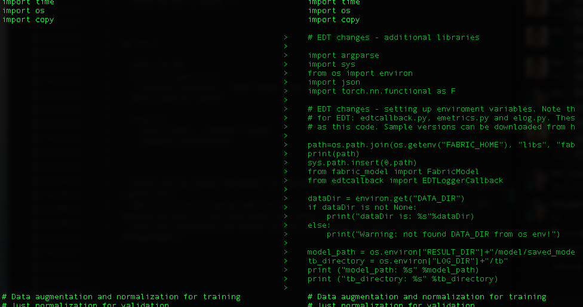
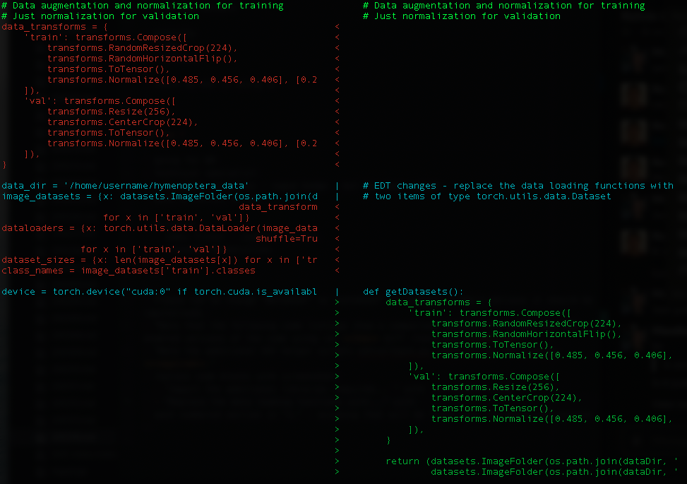
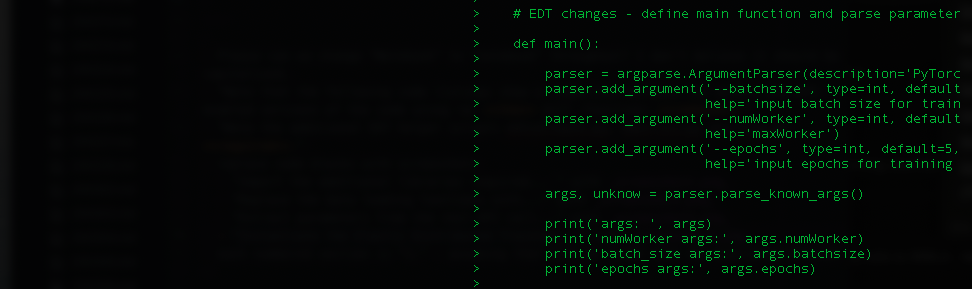
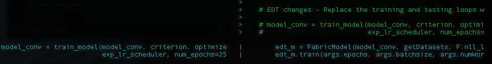

# Watson Machine Learning Accelerator 中的 Elastic Distributed Training
获取 Watson Machine Learning Accelerator 的 EDT 功能概述

**标签:** Watson Machine Learning Accelerator,人工智能,数据科学,机器学习,深度学习

[原文链接](https://developer.ibm.com/zh/articles/elastic-distributed-training-edt-in-watson-machine-learning-accelerator/)

Kelvin Lui, Amanda Quartly

发布: 2020-06-02

* * *

本文是 [学习路径：Watson Machine Learning Accelerator 入门](https://developer.ibm.com/zh/series/learning-path-get-started-with-watson-machine-learning-accelerator/) 系列的一部分。

主题类型[Watson Machine Learning Accelerator 简介](https://developer.ibm.com/zh/articles/introduction-to-watson-machine-learning-accelerator)文章[加速深度学习和机器学习](https://developer.ibm.com/zh/articles/accelerate-dl-with-wmla-and-cp4d/)文章 \+ Notebook**Watson Machine Learning Accelerator 中的 Elastic Distributed Training****文章 \+ Notebook**[使用 Watson Machine Learning Accelerator 超参数优化来加快零售价格预测](https://developer.ibm.com/zh/tutorials/expedite-price-prediction-with-watson-ml-accelerator-hyperparameter-tuning)教程[提高 GPU 利用率和吞吐量](https://developer.ibm.com/zh/tutorials/drive-higher-gpu-utilization-and-throughput-with-watson-machine-learning-accelerator/)教程[使用 Watson Machine Learning Accelerator 对图像进行分类](https://developer.ibm.com/zh/articles/classify-images-with-watson-machine-learning-accelerator)文章 \+ Notebook

## 简介

Watson Machine Learning Accelerator 的 Elastic Distributed Training (EDT) 功能可简化将训练工作负载分配给数据科学家的过程。模型分配对于最终用户是透明的，无需专门了解分配的拓扑结构。其用法非常简单，只需定义用于训练作业的最大 GPU 数量，这样，Watson Machine Learning Accelerator 就可以对现有集群资源同时调度多个作业。可以根据公平分配原则或优先级调度来动态增减用于多个作业的 GPU 分配，而不中断正在运行的作业。

通过使用 EDT 功能，多名数据科学家可以动态共享 GPU，这不仅可以提高他们的工作效率，还可以提高 GPU 的整体利用率。

## 概览

在本文中，我们将使用 [Jupyter Notebook](https://github.com/IBM/wmla-assets/blob/master/WMLA-learning-journey/elastic-distributed-training-module/elastic_distributed_training_demonstration.ipynb) 来逐步完成从社区获取 PyTorch 模型并进行必要的代码更改以使用 Elastic Distributed Training 分配训练工作负载的过程。本文和 Notebook 涵盖：

- 使用 Elastic Distributed Training 来训练 PyTorch 模型
- 监视正在运行的作业状态并说明如何调试问题

## 操作说明

可在相关的 [Jupyter Notebook](https://github.com/IBM/wmla-assets/blob/master/WMLA-learning-journey/elastic-distributed-training-module/elastic_distributed_training_demonstration.ipynb) 中找到本文的详细步骤。 在此 Notebook 中，您将执行以下操作：

- 更改代码
- 提供数据集
- 设置 API 端点并登录
- 通过 API 提交作业
- 监视正在运行的作业
- 检索输出和已保存的模型
- 调试问题

## 更改代码

请注意，下图显示了使用 `diff` 命令对代码的 _之前_ 版本和 _已启用 EDT 的_ 版本进行比较的结果。

1. 导入 Elastic Distributed Training 所需的其他库，并设置环境变量。请注意，另外还需要 EDT 帮助程序脚本 `edtcallback.py`、`emetrics.py` 和 `elog.py`。必须将这些脚本复制到修改后的代码所在的目录中。可在 [教程代码库](https://github.com/IBM/wmla-assets/blob/master/WMLA-learning-journey/elastic-distributed-training-module/) 的 tarball 中找到样本版本。另外，还可以从 [http://ibm.biz/WMLA-samples](http://ibm.biz/WMLA-samples) 下载样本版本。

    

2. 将数据加载函数替换为 EDT 兼容函数，这类函数将返回一个元组，其中包含两个类型为 `torch.utils.data.Dataset` 的项。

    

3. 将训练和测试循环替换为 EDT 等效函数。这需要创建 `main` 函数。 您还可以在 API 调用中指定参数，并将这些参数传递给模型。

    

4. 实例化 Elastic Distributed Training 实例，并使用特定参数来启动 EDT 作业。

    - epoch
    - effective\_batch\_size
    - 每个 EDT 训练作业的最大 GPU 数
    - 检查点创建频率（用回合数表示）

        

## 结束语

本文提供了 Watson Machine Learning Accelerator 的 Elastic Distributed Training 功能概述。本文是 [学习路径：Watson Machine Learning Accelerator 入门](https://developer.ibm.com/zh/series/learning-path-get-started-with-watson-machine-learning-accelerator/) 系列的最后一部分。要继续学习 Watson Machine Learning Accelerator 并更深入地了解其功能，请查看 [利用 IBM Watson Machine Learning Accelerator 开展机器学习和深度学习](https://developer.ibm.com/zh/series/learn-watson-machine-learning-accelerator/) 系列。

本文翻译自： [Elastic Distributed Training in Watson Machine Learning Accelerator](https://developer.ibm.com/articles/elastic-distributed-training-edt-in-watson-machine-learning-accelerator/)（2020-03-17）