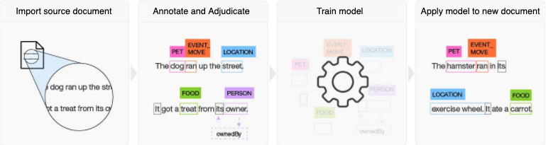
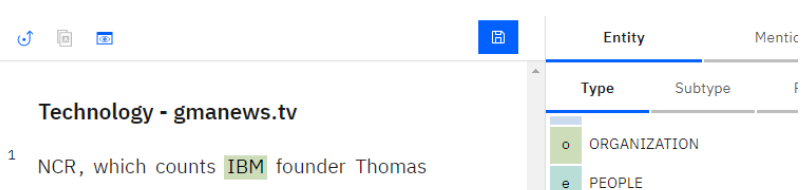
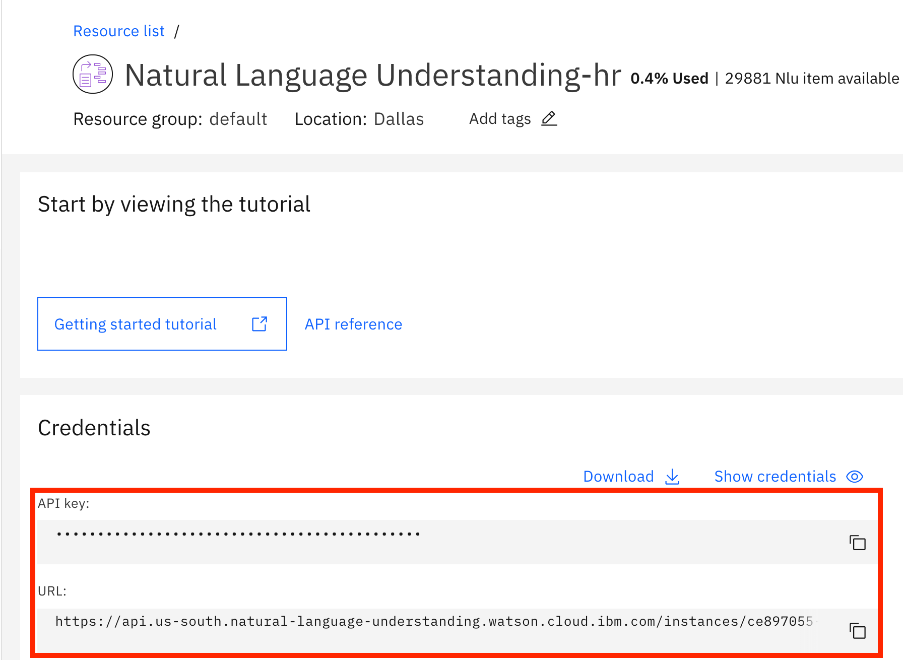

# Watson 自然语言处理简介
Watson 自然语言处理简介

**标签:** Watson APIs,人工智能,自然语言处理

[原文链接](https://developer.ibm.com/zh/articles/introduction-to-watson-natural-language-processing/)

[Horea Porutiu](https://developer.ibm.com/zh/profiles/horea.porutiu)

发布: 2020-08-24

* * *

本文已纳入 [自然语言处理入门](https://developer.ibm.com/zh/series/learning-path-get-started-with-natural-language-processing) 学习路径。

级别主题类型**100****[Watson 自然语言处理简介](https://developer.ibm.com/zh/articles/introduction-to-watson-natural-language-processing/)**文章101[深入了解 Watson Natural Language Understanding 中的语法 API 特征](https://developer.ibm.com/zh/articles/a-deeper-look-at-the-syntax-api-feature-within-watson-nlu)文章201[使用 Watson Natural Language Understanding 实现非结构化数据可视化](https://developer.ibm.com/zh/patterns/visualize-unstructured-text/)Code Pattern

## 简介


如上一个演示中所示，使用 IBM® Watson™ 自然语言处理功能，您可以有效地分析和解析大量文本输入，得出可行的洞察。为 Watson 提供一个 URL 或一个热门新闻站点，Watson 就能从该站点中提取文本并在几秒内分析文本，速度比人类要快得多。可以自定义按照类别、概念、情感、实体、关系、情绪等对文本进行分析。通过从此服务中提取的信息，您能够更深刻理解文本的含义，了解趋势，并从大量数据中推荐相似内容。

本文介绍了 IBM Watson 如何帮助您使用自然语言处理服务来开发越来越智能的应用程序。尽管本文着重介绍 Watson Natural Language Understanding 和 Watson Knowledge Studio 服务，但您也可以通过 [Watson Discovery 学习路径](https://developer.ibm.com/zh/series/learning-path-watson-discovery/) 来了解 Watson Discovery。

查看 [快速演示](https://natural-language-understanding-code-pattern.ng.bluemix.net/)，了解 Watson Natural Language Understanding 服务的功能。

## Watson Natural Understanding 的特定术语

自然语言处理是语言学、计算机科学和人工智能的一个子领域，主要研究计算机与人类语言之间的交互，更具体地说，就是研究如何对计算机进行编程以处理和分析大量自然语言数据。本节介绍了 Watson Natural Language Understanding 的特定术语。

[Natural Language Understanding](https://cloud.ibm.com/docs/natural-language-understanding?topic=natural-language-understanding-about)：AI 中自然语言处理的一个子主题，涉及计算机根据上下文解释文本和理解含义的方式。

[特征](https://cloud.ibm.com/docs/natural-language-understanding?topic=natural-language-understanding-about#features)：Watson Natural Language Understanding 可以通过给定文本输入而输出的可能分类。这些分类包括类别、概念、情感、关键字、元数据、关系、语义角色和情绪。

[实体](https://cloud.ibm.com/docs/natural-language-understanding?topic=natural-language-understanding-about#entities)：人员、公司、位置以及 Watson 进行的分类。可以在 Natural Language Understanding [文档](https://cloud.ibm.com/docs/natural-language-understanding?topic=natural-language-understanding-entity-type-systems) 中找到实体类型和子类型的完整列表。

[类别](https://cloud.ibm.com/docs/natural-language-understanding?topic=natural-language-understanding-about#categories)：Watson 可以从输入文本中识别的五级层次结构。下表提供了“传真机”的示例。

1 级2 级3 级4 级5 级技术和计算硬件计算机外设打印机、复印机和传真机传真机

[概念](https://cloud.ibm.com/docs/natural-language-understanding?topic=natural-language-understanding-about#categories)：在文本中不一定直接引用的高级概念。

[元数据](https://cloud.ibm.com/docs/natural-language-understanding?topic=natural-language-understanding-about#metadata)：一组数据，用于描述并提供有关其他数据的信息。例如，对于给定的输入 URL，元数据字段可以包括发布日期、标题和作者。

[关系](https://cloud.ibm.com/docs/natural-language-understanding?topic=natural-language-understanding-about#relations)：识别两个实体何时关联，以及确定关联的类型。

## Watson Knowledge Studio


了解 Watson Natural Language Understanding 的基础知识后，您会发现 Watson 的强大之处在于其结果的准确性。Watson 可以即取即用，但是此时并没有根据每个行业特定领域的知识进行训练。因此，您可能需要教会 Watson 关于你这个行业所特定的语言上具体的细微差别、关系和含义。例如，如果您正在与一家评估信用风险的初创公司合作，则不仅需要将初创公司的名称告诉 Watson，以便它可以将其识别为“Organization”实体类型，而且还需要教会 Watson 区分金融术语的细微差别，例如信用、破产和利息。这其中的每个词语根据其上下文可能具有不同的含义，而用来训练 Watson 的注解越多，您的模型和结果也就越准确。

下图直观地显示了使用 Watson Knowledge Studio 对 Watson 进行领域知识训练所需的步骤。



## Watson Knowledge Studio 的特定术语

[注解](https://cloud.ibm.com/docs/services/watson-knowledge-studio?topic=watson-knowledge-studio-glossary#gloss_A)：从文档中选择特定文本并将其与预定义实体相关联的过程。例如，“IBM”将与实体类型“Organization”相关联，如下图中所示。



[注解集](https://cloud.ibm.com/docs/services/watson-knowledge-studio?topic=watson-knowledge-studio-glossary#gloss_A)：分配给人工注解的文档。

[Watson Knowledge Studio](https://cloud.ibm.com/docs/services/watson-knowledge-studio?topic=watson-knowledge-studio-wks_overview_full)：一种工具，可用于构建机器学习模型来识别实体和关系，而无需任何编码专业知识。您可以使用该工具来注解文档，并用您的领域知识来训练 Watson。

[参考标准](https://cloud.ibm.com/docs/services/watson-knowledge-studio?topic=watson-knowledge-studio-glossary#gloss_G)：经过审查的数据集合，包含由人类注解者添加的注解，这些注解用于让机器学习模型适应特定领域。

[机器学习模型](https://cloud.ibm.com/docs/services/watson-knowledge-studio?topic=watson-knowledge-studio-glossary#gloss_M)：一种组件，可根据一个基于参考标准的统计模型来识别实体和实体关系。该模型应用过去的经验（例如训练数据），基于数据特征来确定或预测未来体验的正确结果。通过计算每个候选答案或证据的特征分数，并将这些分数与已知结果相结合，以模型的形式捕获这些过去的经验。有时会被称为机器学习注解器。

[训练模型](https://cloud.ibm.com/docs/services/watson-knowledge-studio?topic=watson-knowledge-studio-glossary#gloss_T)：使用使系统能够在特定域中运行的组件（例如，语料库内容，生成机器学习模型的训练数据，编程算法或其他基本事实组件）设置 Watson 实例的过程，然后基于精确性分析对这些组件进行改进和更新。

## 用例

自然语言处理的各种用例，包括：

- **自动汇总以及早发现趋势**：汇总新闻文章或社交媒体，提取有关特定产品或公司的信息，并确定客户情绪的趋势。

- **虚拟助手聊天机器人，例如 Watson Assistant、Siri、Alexa 或 Google**：这些广受欢迎的助手可以将音频转换为文本，然后使用自然语言处理来分析文本以理解上下文。它们可以实时回答您的问题。Watson 自然语言处理可以通过了解您的领域语言并添加情绪和情感分析来丰富客户的输入。

- **电子邮件自动补全**：当您看到电子邮件应用程序能够预测句子的结尾时，该应用程序就会在您键入内容时提取上下文，并且能够理解前面单词后接某些单词的可能性。Watson Natural Language Understanding 功能使您可以快速提取上下文，因此非常有助于您实现自动补全或自动更正功能。


## 访问 IBM Watson 自然语言处理

您可以通过多种方法访问 Watson 自然语言处理服务，以改善业务开展方式。以下是部分方法：

- [IBM Cloud 上的 Watson Knowledge Studio（免费）](https://cloud.ibm.com/catalog/services/knowledge-studio?location=eu-gb&cm_sp=ibmdev-_-developer-articles-_-cloudreg)
- [IBM Cloud 上的 Watson Natural Language Understanding（免费）](https://cloud.ibm.com/registration?target=%2Fcatalog%2Fservices%2Fnatural-language-understanding%3FhideTours%3Dtrue%26&cm_sp=WatsonPlatform-WatsonPlatform-_-OnPageNavCTA-IBMWatson_NaturalLanguageUnderstanding-_-Watson_Developer_Website&cm_sp=ibmdev-_-developer-articles-_-cloudreg)
- [Watson Discovery（免费）](https://cloud.ibm.com/registration?target=%2Fcatalog%2Fservices%2Fdiscovery%3FhideTours%3Dtrue%26&cm_sp=WatsonPlatform-WatsonPlatform-_-OnPageNavCTA-IBMWatson_Discovery-_-Watson_Developer_Website&cm_sp=ibmdev-_-developer-articles-_-cloudreg)
- [IBM Cloud 或 IBM Cloud Pak for Data](https://www.ibm.com/products/cloud-pak-for-data/services)

Watson Assistant 和 Watson 自然语言处理服务紧密相关，经常一起使用。您可以尝试 [Watson Assistant](https://cloud.ibm.com/registration?target=/developer/watson/launch-tool/conversation&hideTours=true&cm_sp=WatsonPlatform-WatsonPlatform-_-OnPageNavCTA-IBMWatson_Conversation-_-Watson_Developer_Website&cm_mmca1=000027BD&cm_sp=ibmdev-_-developer-articles-_-cloudreg)，并在 IBM Cloud 上免费构建聊天机器人。

此 [信息视频](https://mediacenter.ibm.com/media/t/0_2rv92cyl) 概述了 IBM Watson Natural Language Understanding 的功能。

当您准备创建自定义模型时，此 [视频](https://mediacenter.ibm.com/media/t/1_9oa373di) 将带您了解 Watson Knowledge Studio 的功能，并教您如何注解、训练和部署机器学习模型，进而提高 Watson Natural Language Understanding 和 Watson Discovery 的准确性。

如果要详细了解此服务，可以在 [Watson Discovery](https://developer.ibm.com/zh/series/learning-path-watson-discovery/) 中找到学习路径。

### SDK

对于编程式访问，Watson SDK 为大量语言提供了支持。以下列表显示了现有开发者 SDK。

- [Node SDK](https://github.com/watson-developer-cloud/node-sdk)
- [Python SDK](https://github.com/watson-developer-cloud/python-sdk)
- [Swift SDK](https://github.com/watson-developer-cloud/swift-sdk)
- [Java™ 语言 SDK](https://github.com/watson-developer-cloud/java-sdk)
- [Go SDK](https://github.com/watson-developer-cloud/go-sdk)
- [Ruby SDK](https://github.com/watson-developer-cloud/ruby-sdk)
- [.NET SDK](https://github.com/watson-developer-cloud/dotnet-standard-sdk)
- [Salesforce SDK](https://github.com/watson-developer-cloud/salesforce-sdk)

### API

有关 API 的更多信息，可参阅 [Discovery API 文档](https://cloud.ibm.com/apidocs/natural-language-understanding/natural-language-understanding)。

### 代码样本

以下 Node.js 代码样本显示了如何授权和分析文本，以识别情感、情绪、实体和关键字。

在文件的顶部，我们导入 Watson Natural Language Understanding Node.js SDK 和一个身份验证模块，确保我们可以从 IBM Cloud 访问 Watson 服务。

接下来传入 `api-key`，这是在您创建 Watson Natural Language Understanding 服务以在 Node.js 代码中创建实例时在 IBM Cloud 上生成的。此外，还传入了实例 URL，它也位于 IBM Cloud 服务的凭证选项卡中，如下图所示。



我们知道 Watson 可以解析网站，因此传入了 URL `www.nytimes.com`。我们还传入了实体和关键字功能，并通过将上限设置为 2，告知 Watson 我们只需排名前两位的关键字和实体结果。我们同时还启用了情感和情绪功能，因此 Watson 也会输出这方面内容。

最后，我们使用 Watson 服务的分析功能来解析 nytimes.com 网站，并输出找到的排名前两位的关键字和实体。


继续下一步并获取以下代码，打开代码编辑器，创建一个名为 `nlu.js` 的新文件，然后在包含该文件的目录中运行 `npm install`。这会安装 ibm-watson 依赖项，用于访问 Watson Natural Language Understanding API。接下来，在函数的前几行中输入您的 `apiKey` 和 `url`。

```lang-javascript

const NaturalLanguageUnderstandingV1 = require('ibm-watson/natural-language-understanding/v1');
const { IamAuthenticator } = require('ibm-watson/auth');

async function analyze() {

const naturalLanguageUnderstanding = new NaturalLanguageUnderstandingV1({
    version: '2019-07-12',
    authenticator: new IamAuthenticator({
      apikey: '<apiKey>',
    }),
    url: 'https://api.us-south.natural-language-understanding.watson.cloud.ibm.com/instances/<instanceId>',
});

const analyzeParams = {
    'url': 'www.nytimes.com',
    'features': {
      'entities': {
        'emotion': true,
        'sentiment': true,
        'limit': 2,
      },
      'keywords': {
        'emotion': true,
        'sentiment': true,
        'limit': 2,
      },
    },
};

naturalLanguageUnderstanding.analyze(analyzeParams)
    .then(analysisResults => {
      console.log(JSON.stringify(analysisResults, null, 2));
    })
    .catch(err => {
      console.log('error:', err);
    });
}

analyze();

```

Show moreShow more icon

继续下一步并运行代码 `node nlu.js`。以下演示显示了运行脚本的样本输出。


前面的代码向您展示了启动和运行 Watson 的最低要求。要了解 Watson 自然语言处理的更高级用法，可参阅我们的 [IBM Developer Code Pattern](https://developer.ibm.com/zh/patterns/category/watson-apis/)。

## 结束语

本文概述了 Watson 自然语言处理服务。它介绍了 IBM Watson 如何帮助您使用自然语言处理服务来开发越来越智能的应用程序，着重说明了 Watson Natural Language Understanding 和 Watson Knowledge Studio 服务的使用。

本文已纳入 [自然语言处理入门](https://developer.ibm.com/zh/series/learning-path-get-started-with-natural-language-processing) 学习路径，指导您如何通过 Watson 自然语言处理服务构建功能齐全的 Web 应用。要继续学习，可 [深入了解 Watson Natural Language Understanding 中的语法 API 特征](https://developer.ibm.com/zh/articles/a-deeper-look-at-the-syntax-api-feature-within-watson-nlu)。

本文翻译自： [An introduction to Watson natural language processing](https://developer.ibm.com/articles/introduction-to-watson-natural-language-processing/)（2020-04-10）