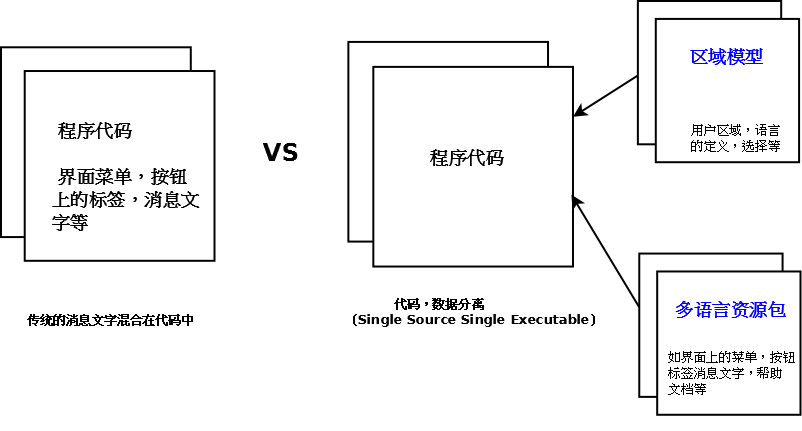
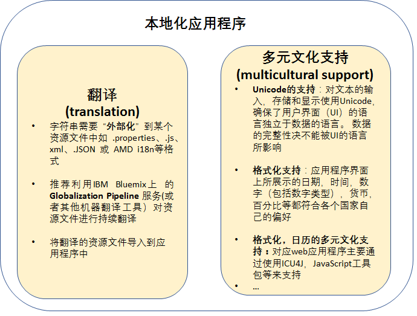
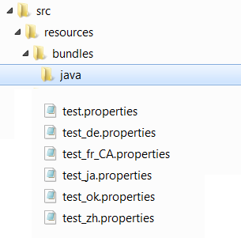
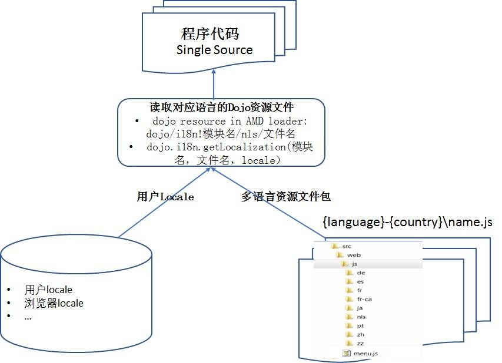

# Web 应用程序中 Resource Bundle 技术概述
如何存储 web 应用程序中使用不同框架时的资源文件及其命名规则以及如何取得资源文件中的键值等

**标签:** Java,Web 开发

[原文链接](https://developer.ibm.com/zh/articles/j-web-resource-bundle/)

夏怀英, [David Chen](https://developer.ibm.com/zh/profiles/davidsc)

发布: 2017-09-19

* * *

## 背景概述

世界经济日益全球化的同时，一个应用程序需要在全球范围内使用势在必然。传统的程序设计方法将可翻译信息如菜单按钮的标签，提示信息，帮助文档等文字信息硬编码在程序代码中，不能很好的适应全球化发展，程序的扩展性差，维护成本高。一个能支持全球化的应用程序，必须实现单一可执行的程序，动态地使用资源（Single Source Single Executable），图1 是两种模型的对比图。

##### 图 1\. 传统的程序模型和支持全球化程序模型



对于一个能支持全球化的应用程序来说：

**一方面需要考虑的是用户的语言环境（我们称作 Language Locale）：** 这里主要就是指翻译，在不同的国家用他们自己的语言正确运作软件，让客户感觉这个产品是为他们而设计的；

**另一方面就是用户的文化环境（我们称作 Culture Locale）：** 主要处理的是多元文化的支持，包括货币、日历、时间、日期、排序、界面方向性（Bi-directional) 等符合各个国家自己习惯的显示方式。

图 2 概述了如何使得一个应用程序（C/S 或者 B/S）支持全球化和本地化。

##### 图 2\. 全球化应用程序



本文结合项目实践，总结了 web 应用程序中 Java，JSP，Dojo 和 HTML 四种不同语言是如何管理 Resource Bundle 的，实现单一可执行程序动态读取资源文件，从而支持全球化和本地化。主要从三个方面来阐述：资源文件存储和命名规则；用户语言区域信息的读取；如何取得对应语言的资源文件中的键值。

## Java 程序中的 Resource Bundle 管理

ResourceBundle 是一个机制，主要用来根据用户的语言环境展示不同的界面文字给用户，让用户感觉这个应用程序为我而定制。

然而 Java 中的 ResourceBundle 是一个类，包含在标准的 Java 发行版中。图3总结了 Java 程序中 ResourceBundle 的管理机制。

##### 图 3\. Java 程序 Resource Bundle 管理流程


### Java 程序中资源文件的存储和命名

在一个多模块的 Java 应用程序中，一般每个模块都有自己独立的资源文件（也叫 Resource Bundles），Resource Bundle 一般存储在对应模块的 src/resources/bundles/java/ 目录下面。通常的命名规则是：模块名 _语言_ 国家 .properties({moduleName} _{language}_{country}.properties)。对应资源文件中的每一个 key，一般都是小写字母开头，用下划线表示这个 key 在程序中的层级结构，并且按照字母顺序排序，便于管理和查找，如清单1所示的例子。

##### 清单 1\. Java properties 文件示例

```
英文Properties 文件:
    helloKey=Hello!
    goodMorningKey=Good Morning!
    goodEveningKey=Good Evening!

日语Properties 文件：
    helloKey=\u3053\u3093\u306b\u3061\u306f!
    goodMorningKey=\u304a\u306f\u3088\u3046!
    goodEveningKey=\u3053\u3093\u3070\u3093\u306f!

```

Show moreShow more icon

Java 程序对资源文件的回滚机制：当对应翻译的资源文件不存在时，将使用”默认”的资源文件（通常为英文），图 4 是 Java 资源文件的组织方式。

##### 图 4\. Java 资源文件组织方式



### Java 中用户语言环境（Locale）和资源文件的读取

根据用户使用的区域信息来决定从哪个 Resource Bundle 里面读取对应的 key 值。Java 语言通过 java.util.Locale 类来表示区域，一个 Locale 实例就代表了一个特定的区域。在实际的项目中，通常将读取资源文件包装成一个类，方便后续代码的重用和管理，如清单 2 的示例所示。

##### 清单 2\. Java 中 ResourceBundleService 使用

```
public class LocalizedPropertyResources extends MessageResources {
private static final String MODULE_NAME = "resourceBundle.module.name";
public String getProperty(String key, Object... parameters) {
Locale locale = getUserLocale();
String value = getProperty(key, locale, parameters);
Return value;
}
public String getProperty(String key, Locale locale, Object... parameters)
     {
ResourceBundle resourceBundle = ResourceBundle.getBundle(MODULE_NAME,
     locale);
String value resourceBundle.getString(key, parameters);
return value;
}
}

```

Show moreShow more icon

## JSP 中的 Resource Bundle 管理

**资源文件管理：** JSP 是基于 Java 技术，所以 Java 中的 ResourceBundle 机制也可以应用于 JSP，同样以 .properties 形式存储资源文件，资源文件的命名规则、资源文件的存储结构，key 的命名规则等都可以遵循 Java 程序中的 Resource Bundle 管理机制。

**用户语言环境的设定** ：HTTP 协议通过 Accept-Language 请求头将本地化信息从浏览器传递至服务器, JSTL fmt 库中的定制标记又会利用这些方法来自动地确定用户的语言环境，从而相应地调整它们的输出。同时用户也可以通过  来设置用户语言环境。

对于 JSP 中资源文件的读取有以下三种情况：

1. 使用 fmt 消息标签：JSP 标准标签库（JSP Standard Tag Library，JSTL）中的 fmt标签支持通过资源文件（ResourceBundle）对文本内容进行本地化，该功能可以对一个特定的语言请求作出相应的响应，它使用了 J2SE 的 ResourceBundle 来保持各种翻译过的语言编码。另外用来设置地区，比如，这等于设定了语言和国家代码。默认 JPS 将读取 Accept-Language 信息。还可以指定 ResourceBundle，比如： 。一旦设定了 locale（地区）或 ResourceBundle，就可以使用  来把原文进行相应的转化，同时还可以使用< fmt:requestEncoding/>来设定请求的字符编码。如清单3 示例所示：


    ##### 清单 3\. JSTL fmt 标签示例


    ```
    //myTest.jsp
    <%@ taglib uri="http://java.sun.com/jsp/jstl/fmt" prefix="fmt" %>

    <html>
    <head>
         <title>JSTL fmt: Localized tag testing</title>
    </head>

    <body>
    <fmt:requestEncoding value="UTF-8" />
    <fmt:setLocale value="zh_TW"/>
    <fmt:setTimeZone value= "GMT+8" scope="request"/>
    <fmt:bundle basename="src.resources.bundles.java.menu ">
           <fmt:message key="OK"/><br/>
           <fmt:message key="CANCEL"/><br/>
    </fmt:bundle>
    //也可以通过下面的方式获取资源文件

    <fmt:setBundle basename="src.resources.bundles.java.menu"    var="resources"/>
        ...
         <fmt:message key="OK"/><br/>
         <fmt:message key="CANCEL"/><br/>
         ...
    </body>
    </html>

    ```


    Show moreShow more icon

2. 被 Spring 管理的 JSP，通常 JSP 中有这样的 `taglig"<%@ taglib prefix="spring" uri="http://www.springframework.org/tags" %>"`，这种情况下可以使用 Spring message 标签。

    `<%@ taglib prefix="spring" uri="http://www.springframework.org/tags" %>`

3. 对于由 Struts 操作类提供的JSP，可以使用 Struts bean 消息标签：

     <%@ taglib uri=”/tags/struts-bean” prefix=”bean” %>


## Dojo 中的 Resource Bundle 管理

Dojo 是一个 JavaScript 库，提供了一个有用的工具来创建丰富的 Web 客户端界面。同时 Dojo 也提供了 API 支持全球化功能，如翻译资源包，函数的格式化和解析日期、数字和货币，Dojo 对全球化的支持主要基于 CLDR (Common Locale Data Repository) 和 ICU 的使用。 这一小节总结了 Dojo 中资源文件的管理，用户区域信息（locale）和资源文件的读取，如图5所示。

##### 图 5\. Dojo 中资源文件管理



### Dojo 中资源文件的存储和命名

UTF-8 是 Dojo 程序编码的先决条件，Dojo 脚本一般将使用 HTML，JSP，Servlet，js等编写，所以这些文件必须以 UTF-8 编码。Dojo 用 JSON 格式来组织资源文件，首先在 /nls 目录下有一个主资源文件（一般是英文），主资源文件中定义了支持的区域，区域的值设置为 true 或者 false，如清单4所示。

##### 清单 4\. Dojo 主资源文件的定义

```
    define({
      root: {
        OK: "Ok",
        CANCEL: "Cancel",
        OK_CANCEL: "${OK}, ${CANCEL}"
      },
      "ko": true,
      "ja": true,
      "ru": false,
      "zh-cn": true
    });

```

Show moreShow more icon

翻译的资源文件应放在/ nls / 目录中，目录的命名需要符合下面的规范：

- 目录的名称必须要全部小写
- 用横线（而不是下划线）分割语言和国家，比如 zh-cn，zh-tw 等，如清单5所示。

##### 清单 5\. 翻译资源文件的目录结构

```
    /src/web/js/nls/menu.js       ... 主资源文件，用于默认的消息显示
    /src/web/js/nls/ko/menu.js    ... 韩语的翻译文件
                    /ja/menu.js    ... 日语的翻译文件
                    /ru/menu.js    ...俄语的翻译文件
                     /zh-cn/menu.js  ...简中的翻译文件
                    ...

```

Show moreShow more icon

Dojo 资源文件的回滚机制为：在 / nls 目录的根目录下如果检测到区域设置，但 nls 目录中不存在特定于区域设置的资源，则将使用主包；当主资源文件中某个语言设置为 false 时，即使该语言的资源文件存在，也将使用主包。

### Dojo 中用户语言环境（Locale）和资源文件的读取

Dojo 和 Java 以相同的方式支持用户区域信息，但 Dojo 和 Java 实现之间存在微小差异。

- “Dojo 和 Java 对区域设置命名约定有一些区别，Dojo 使用” – “（连字符）作为连接语言代码，国家代码和变体的分隔符，而 Java 使用”\_”（下划线）。例如，Java 中的 “zh\_CN” 与 Dojo 中的 “zh-cn” 相似。

- 像 Java 中的默认用户语言区域一样，Dojo 有一个全局变量 dojo.locale 用来存储默认 locale 值，但是我们不能直接修改 dojo.locale，可以通过 dojoConfig.locale 来对 dojo.locale 做初始化工作。

- 如果 dojoConfig.locale 未定义，Dojo 使用浏览器的显示语言作为用户区域设置。另外 dojoConfig.locale 的设定需要在加载 dojo.js 之前，这样设置的 dojoConfig.locale 才会起效果。如清单 6 是一个示例将用户的 locale 信息保存在 sessionScope，然后传递给 dojoConfig。


##### 清单 6\. 将用户 locale 保存在 sessionScope 传递给 dojoConfig

```
    var dojoConfig = {
            async: 'sync',
            baseUrl: '',
            locale: '${sessionScope.userLanguageLocale}',

             bindEncoding: "utf-8",
               ...
        };

```

Show moreShow more icon

userLanguageLocale：是应用程序中用户所设定的 locale，每个应用程序可能不太一样。

Dojo 中有两种方式读取资源文件：

**方式 1：** 又叫 AMD 方式，通过 dojo/i18n! 这个插件加载资源文件，首先检测 dojoConifg.locale 是否设置，如果设置了就读取 dojoConfig.locale，否则就会使用浏览器的显示语言读取对应的翻译资源文件。清单 7 是 dojo/i18n! 的使用示例。

##### 清单 7\. Dojo/i18n！使用示例

```
...
<script src="dojo-release-1.9.1/dojo/dojo.js" data-dojo-config="async:
    true, parseOnLoad: true></script>
<script>
require(["dojo/string", "dojo/i18n!js/nls/menu"],
function(string, resources){
var strOk = resources.OK;
alert(strOk);
});
</script>
...

```

Show moreShow more icon

**方式 2** ： 使用 dojo.requireLocalization 加载资源文件，dojo.i18n.getLocalization 读取资源文件，这个是旧的资源加载方式，新的 Dojo 版本都将采用 AMD 的方式，不过这种方式用户可以指定 locale 信息，缺省 locale 的时候，采用和 AMD 同样的 locale 解析方式。清单8 是一个示例。

##### 清单 8\. Dojo. requireLocalization 使用示例

```
<script src="dojo-release-1.9.1/dojo/dojo.js" data-dojo-config="async:
    true, parseOnLoad: true></script>
<script>
dojo.require("dojo.i18n");
dojo.requireLocalization("js", "menu");
var resources = dojo.i18n.getLocalization("js", "menu", locale);
//或者省去 locale 参数，var resources = dojo.i18n.getLocalization("js",
    "menu")
alert(resources.OK);
</script>
...

```

Show moreShow more icon

## HTML 中的 Resource Bundle 管理

HTML 中的硬编码（Hard Code）通常分为两种情况：一种情况是 HTML 页面不涉及任何编程逻辑，这时候可以翻译整个 HTML 文件（这种方式在开发过程中不需要特殊处理），或者将 HTML 变更为 JSP，这样就可以利用 JSP 中 fmt 标签将 Hard Code 提取出来，如清单 9 示例所示。

##### 清单 9\. HTML 更改为 JSP

```
//Index.html
<html>
<head>
<script language="JavaScript">
window.location = "/login.do";
</script>
<title>Welcome Page</title>
</head>
<body>
...
</body>
</html>
//将 Index.html 更改为 Index.jsp，这样就可以利用 JSP 中 fmt 标签
<%@ taglib prefix="c" uri="http://java.sun.com/jsp/jstl/core" %>
<%@ taglib prefix="fmt" uri="http://java.sun.com/jsp/jstl/fmt" %>
<html>
<head>
<script language="JavaScript">
...
</script>
<title><fmt:message key="common_welcome"
         /></title>
</head>
<body>
...
</body>
</html>
//test.properties
Common_welcome=Welcome Page
...

```

Show moreShow more icon

另外一种情况是 HTML 作为 Dojo widget 模板文件，这种情况下可以使用 dojo API 的 i18n 库来处理硬编码消息，其处理方式和 Dojo 很类似，模板 HTML 文件中使用的 Key 需要在 Widget 的 js 文件中定义和获取。下面将通过示例介绍 HTML 作为 Dojo 模板文件时，如何抽取当中的 hard code 信息。通常分三个步骤完成模板 HTML 文件中的字符串抽取。

第一步： 将 HTML 中的字符串放到一个资源文件如 message.js 中，资源文件的组织方式和 Dojo 是一样的；

第二步： 在 Dojo widget 的 js 文件中使用 Dojo Resource Bundle 获取资源文件，定义变量获取对应的Key值；

第三步： 在HTML模板文件中使用 Dojo .js 文件中定义的变量。如清单 10 所示。

##### 清单 10\. HTML 作为 Dojo Widget 模板

```
Test.html
<div dojoAttachPoint="testNode" style="display:inline">
<table style="position: relative; margin: 20px 0 0 120px; padding:
    0;">
<tr>
<td style="text-align: right;">Username:</td> //原来的 hard
    code
<td style="text-align: right;">${usernameLabel}</td>
    //Resource out 之后的变量引用
....
</tr>
</div>
Test.js
dojo.requireLocalization("js", "message");
dojo.declare("Test") {
templatePath: dojo.moduleUrl("common", " /html/Test.html"),
usernameLabel: "",
postMixInProperties: function(){
this.inherited(arguments);
var resources = dojo.i18n.getLocalization("js", "message");
this.usernameLabel = resources.labels.username; //获取资源文件
}
}

```

Show moreShow more icon

另外有时 hard code 消息为 HTML 标记的 value 属性，如果直接将 value 值抽取出来，很容易引起功能问题，因为后端服务器将会利用 value 值处理一些逻辑问题，这时候需要使用 Label 和 Value 来处理，Label 主要为了展示给用户，Value 主要用于服务器端的逻辑处理，清单11 是含有 Hard Code 的一个 option HTML 片段和处理后的代码，这里的 HTML 作为 Dojo 模板处理的。

##### 清单 11\. HTML 中特殊硬编码处理

```
// Hard Code
<html>
<body>
<select id="Product">
<option>Is Not</option>
<option>Is</option>
</select>
</body>
</html>
//处理后的 HTML
<html>
<body>
<select id="Product">
<option value="Is
        Not">${Label.IS_NOT}</option> <option value="Is">${Label.IS}</option>
</select>
</body>
</html>

```

Show moreShow more icon

## 结束语

本文总结了如何存储 web 应用程序中使用不同框架时的资源文件及其命名规则，如何取得资源文件中的键值。希望这篇文章能为正在开发国际化 Web 应用程序的读者提供一定的参考价值。