# 一键式持续交付信息管理系统
基于 Docker、Jenkins、Ant、Apache Tomcat、Git、数据库等技术或工具

**标签:** Apache Spark,Docker,持续交付

[原文链接](https://developer.ibm.com/zh/articles/os-one-click-continuous-delivery-information-management-system/)

周良

发布: 2019-03-04

* * *

## 前言

在持续交付过程中，每次交付都不可避免地要花费大量时间精力用于环境配置、build、回归（Regression）测试、结果管理、问题跟踪、质量分析、总结，一个可以自动化完成所有功能的智能系统将大大提高开发、测试和管理效率。

本文基于开源工具或技术搭建一键式持续交付管理系统，对于任何代码的更新或修改，只需要发起一个 build 请求，剩下的所有流程将自动完成，用户只需要关注是否有分配给他的 issue 即可，并且本系统将所有 build、测试信息纳入统一管理存储到数据库，方便随时查阅。通过该系统提供的查询网站，用户可以随时查看 bug、build、regression 的趋势，以及对一段时间内或某个 release 的情形进行分析总结。

## 环境部署测试整体架构

本章主要介绍一键式持续交付信息管理系统的整体框架和流程，如图 1 所示。从大的功能点上划分，该系统主要包括：Jenkins 控制模块、Build 阶段、部署阶段、测试阶段、邮件通知模块、数据库、查询网站，每部分的具体功能将在下一章介绍。

##### 图 1\. 一键式持续交付信息管理系统整体架构

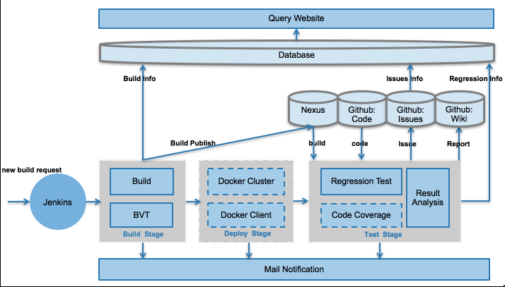

该系统比较典型的一个工作流程如下：

1. 工程师在完成代码提交后，便可发起新一轮的 build 请求，这个请求将被发送给 Jenkins 控制模块。
2. Jenkins 作为整个系统的控制单元，在收到请求后将启动 job 触发 Build 阶段。Build 阶段主要包括 Build 和 BVT（版本验证测试），此阶段无论成功或是失败都会有邮件通知用户，并且此次 build 和 BVT 的信息将会被插入到数据库的 buildinfo 表中。如果成功，build 将会被发布到 Nexus 上，一个成功的 Build Stage 将会触发 Deploy Stage。
3. Deploy 阶段将会进行实际回归测试环境的部署，此阶段主要通过 Docker 部署所需要的 Spark Cluster 服务端（图中 Docker Cluster）以及执行测试用例所需要的客户端（图中 Docker Client）。图中虚线表示此部分并不是必须的，如果环境在此阶段之前已经准备完成便可以跳过此阶段直接进行测试以节省时间。比如，我们可以将所需要的 Docker 镜像事先存储在机器上以便直接使用，而不是每次都去重新 build 镜像。Deploy 阶段完成后管理员将会收到邮件通知以便及时了解环境配置是否存在异常。
4. 环境准备完成后，将会开始进行实际的测试（图中 Test Stage），主要包括 Regression 测试和代码覆盖率测试，我们将代码覆盖率测试作为一个非必选项（图中虚线部分 Code Coverage）。在开始测试前，将从 Nexus 上下载所需要的 build，与 Github 进行测试代码的同步。测试完成后，通过专门的结果分析过程（图中 Result Analysis），用户将会收到包含此次测试信息的邮件，此次测试的统计信息报告会被 push 到 Github Wiki 上以便后续查阅，详细测试信息插入到数据库的 regressioninfo 表中。如果存在失败的测试用例，Github 上将会自动创建相关失败模块的 issue 以便于跟踪问题，并将改 issue 指定给对应模块的管理人员。
5. 上面四步基本可以组成一个完成的交付流程。此外，我们特地设计开发了一个查询网站（图中 Query Website）用于随时查阅 build，regression 和 bug 信息，以便于统计和总结。查询网站是对数据库信息表的直观展示和总结，包括 buildinfo 表、regressioninfo 表和 buginfo 表，其中 buginfo 表是从 Github 上持续获取 bug 信息插入到数据库中的。用户可以通过查询网站随时去查询每个 build 的信息、每次 Regression 测试的信息、每个 bug 的信息，也可以对一个时间段或者某个 release 的 build、regression、bug 情况进行查询。

## 功能和输出

本章将对上一章节所述架构中的各个部分进行具体介绍，重点介绍各部分的功能及输出。

### Build 阶段

Build 阶段主要进行代码的编译、build 输出、BVT。对外交付的实际版本由此部分产生，并且对代码进行了简单的测试。

**功能：**

1. 代码编译、build、BVT。
2. 插入 build 信息到数据库 buildinfo 表。
3. 将成功的 build 发布到 Nexus 上。
4. 触发 Deploy 环境的流程。
5. 发送邮件通知用户。

**输出：**

1. Build。
2. Build 成功或者失败的邮件。
3. BVT 报告。

Build 阶段输出的邮件如图 2 所示，该邮件为 Build 成功的邮件，失败的邮件类似，标题中会包含明确的版本号和成功失败标志。

##### 图 2\. Build 阶段成功邮件

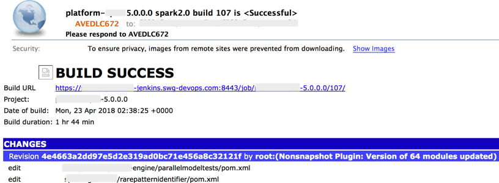

邮件内容中有具体的 Jenkins 链接以便于查阅本次 build 的 Jenkins Job 情况，还有对应的 BVT 报告以便查阅各个模块以及所有 BVT 测试用例的详细情况，如图 3 所示。

##### 图 3\. Build 阶段 BVT 报告

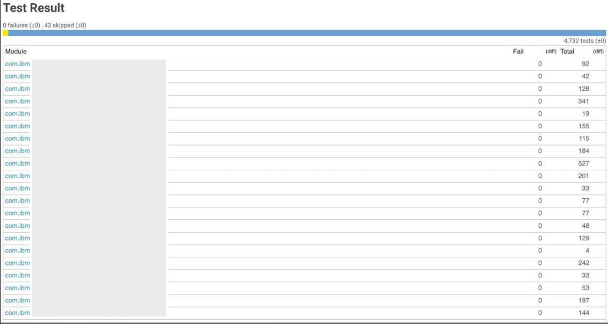

### Deploy 阶段

Deploy 阶段主要进行 Spark Cluster、Client 端环境的部署和配置，为了环境的易用性本系统采用了 Docker。Spark Cluster 和 Client 的部署均通过 Dockerfile 脚本实现，支持部署各种组合参数需要的环境，如不同的 Spark 版本、Java 版本、Scala 版本。

**功能：**

1. 部署测试环境的 Spark Cluster。
2. 部署测试环境的 Client 端。
3. 触发测试流程。
4. 发送邮件通知环境管理员。

**输出：**

1. Spark Cluster 环境。
2. Client 端。

Deploy 阶段输出的 Spark Cluster 环境部署成功的邮件如图 4 所示。

##### 图 4\. Deploy 阶段成功邮件

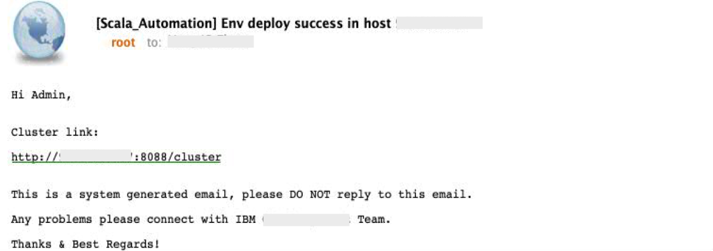

通过邮件中的链接可以访问该环境对应的 yarn 端口查看具体信息，如图 5 所示。

##### 图 5\. Spark Cluster Yarn 页面

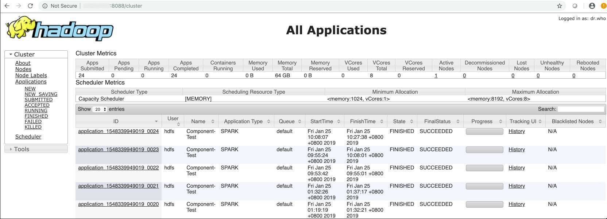

在机器上可以通过执行 docker ps 命令查询所启动的 Docker container 情况，此处启动了 namenode 和 client1 两个 container，如图 6 所示，其中 namenode 即为 Spark Cluster 的 namenode，当然也可以启动其他 datanode 节点，本系统为了简便没有启用。client1 为第一个客户端，当存在多个客户端并行测试时此处会启动多个 client。

##### 图 6\. namenode 和 client container

### Test 阶段

Test 阶段主要进行 Regression 和代码覆盖率的实际测试。所有的 Regression 测试用例都是在这一阶段执行的，测试结果直接反应本轮 build 的质量，也是本轮交付的关键。

**功能：**

1. Regression 测试。
2. 代码覆盖率测试。
3. 将本轮测试信息插入到数据库的测试表中。
4. 分析测试结果并生成测试用例级的详细测试报告。
5. 发布 Wiki 测试报告到 Github 上。
6. 如果测试中存在失败用例则在 Github 上创建 issue。
7. 发送测试完成邮件给用户。

**输出：**

1. 测试邮件。
2. Wiki 报告。
3. 用例级详细测试报告。
4. Issue。

如果测试过程中存在失败用例，用户将会收到带有详细信息的测试邮件，如图 7 所示，邮件中给出了本轮测试的用例级详细测试报告、测试的输出文件位置、Github 上的 Wiki 报告。

##### 图 7\. 测试阶段失败邮件

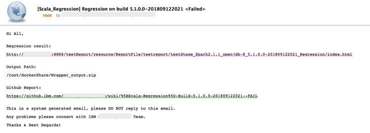

用例级详细测试报告如图 8 所示，该报告是使用 Ant 工具 build 完成，然后放入 Apache Tomcat 中以方便用户访问。从中可以查看到所有模块、所有用例的具体情况（可以看到用例失败的具体原因）。

##### 图 8\. 用例级详细测试报告

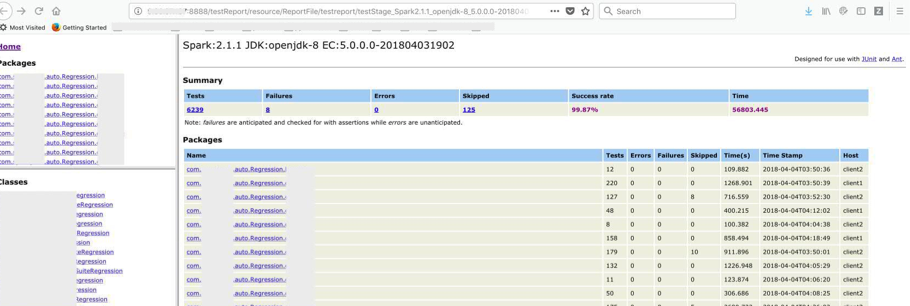

Wiki 测试报告如图 9 所示，该报告是对本轮测试的一个总结，报告中包括测试环境信息、issue 个数、代码覆盖率链接以及各模块情况。其中代码覆盖率报告如图 10 所示。

##### 图 9\. Wiki 测试报告

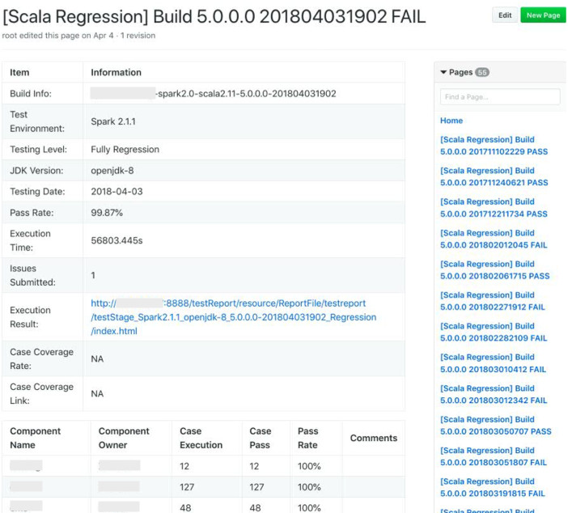

##### 图 10\. 代码覆盖率报告

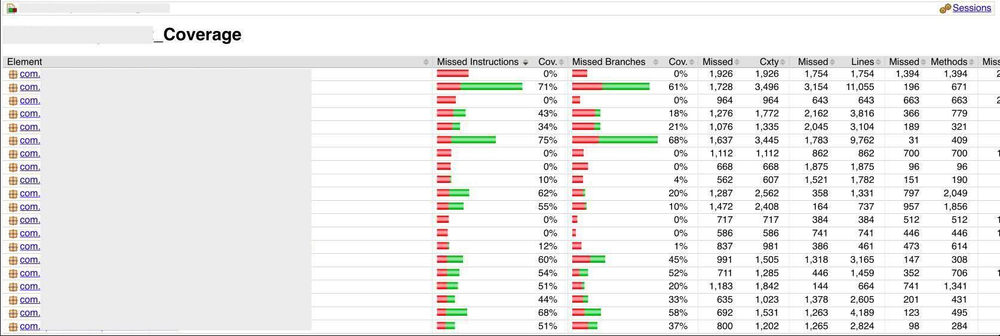

系统自动创建的 issue 如图 11 所示，issue 是通过 Github API 按模块自动创建，标题中包含模块名和其失败的用例个数，内容包含测试 build 号、详细测试报告、对应的 Assignees、Labels、Releases 等，当模块的负责人收到指定给他的 issue 时才需要进行后续分析，否则则认为其所负责的模块在本轮测试中没有问题。

##### 图 11\. Issue

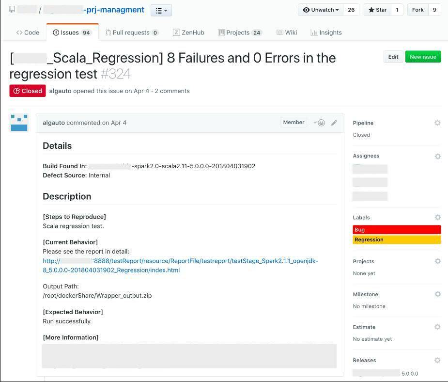

### 数据库

数据库用来存储日常开发测试流程中的各种信息，主要包括 build 信息、测试信息、bug 信息，

分别存储在 buildinfo、 regressioninfo、 buginfo 表中。表中可以尽你所能多存储信息以便于后续查阅或网页展示。

build 信息是在 Build 阶段结束时插入的，测试信息实在测试阶段结束时插入的。需要注意的是 buginfo 表中除了存储每次测试阶段所创建的 issue 信息外，还是存储从 Github 上不断获取的外部或者个人创建的其他 bug 信息，这个举动是通过我们维护的一个进程实时获取的。

### 查询网站

查询网站作为对数据库信息的展示和总结，是整个系统中对于用户来说最直观的一个部分。如图 12 所示，查询网站包含三个部分：Regression Analysis、Bug Analysis、Build Analysis，分别对应数据中的三张表。

##### 图 12\. 查询网站

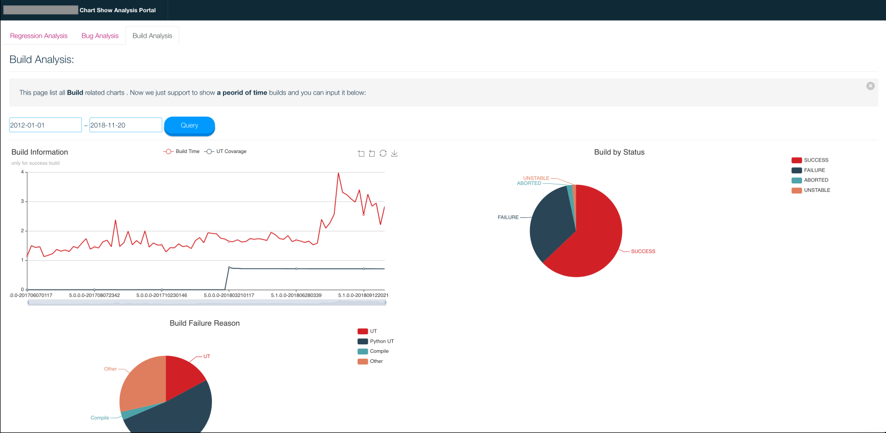

- 对于 Build Analysis，网站支持查询一个时间段或者 release 内的 build 次数趋势、每个 build 的时间和 UT 覆盖率、build 的成功失败占比等。
- 对于 Bug Analysis，网站支持查询一个时间段或者 release 内的 bug 个数趋势、内部外部 bug 占比、各模块 bug 占比、有效无效 bug 占比等。
- 对于 Regression Analysis，网站支持查询一个时间段或者 release 内的测试次数趋势、每次测试的用例通过率、测试的成功失败占比等。

对于每部分来说，页面最下方是数据库的直接展示（由于页面大小限制未在截图中显示）。

## 结束语

本文侧重于从架构和流程上介绍一键式持续交付信息管理系统，希望您能够从整体上对于系统有个完整的认识，通过了解系统各部分的功能和输出从而明白整个系统是如何运作的。而实际系统的搭建涉及大量技术细节，由于内容过于繁琐且文章篇幅有限在此不能一一介绍，如果您感兴趣可以在实际系统搭建过程中去体会，本文最后一个参考资源中也有部分介绍。本系统早已在实际工作中投入使用，并且经过不断的优化提升，目前运行流畅，极大的提升了开发、测试和交付效率。另外，通过把工作中的信息存储至数据库中从而纳入统一管理，极大的提高了工作质量和管理人员的统计和管理效率。